# 保護猫トライアル30日 — System Architecture v1.0

**Document Type**: System Architecture / システム設計図
**Parent Documents**:
- [00-PROJECT-CONSTITUTION.md](./00-PROJECT-CONSTITUTION.md)（最上位）
- [01-EXPERIENCE-BIBLE.md](./01-EXPERIENCE-BIBLE.md)（第2位）
- [02-PLAYER-FLOW.md](./02-PLAYER-FLOW.md)（第3位）

**Authority**: 上記3文書に次ぐ第4位。上位と矛盾する記述は無効
**Scope**: システムの責務・関係・データフロー・依存関係のみ
**Out of Scope**: 各システムの詳細ロジック（Cat AI の判断式、イベント内容、家具性能、アイテム性能、UI レイアウト）
**Audience**: ソフトウェアアーキテクト / ゲームプログラマー / ゲームデザイナー / UIデザイナー
**Last Updated**: 2026-07-24

---

## 📌 前提の確認

指定された参照文書のうち **「Core Gameplay Loop Bible」は未作成**である（既存は Constitution / Experience Bible / Player Flow の3本）。
本書はループ定義を Constitution §3.3・§6.2 および Player Flow ③ から参照する。同文書作成時は本書 §6（Update Flow）との整合を再検証すること。

---

## 目次

- [0. アーキテクチャの根本方針](#0-アーキテクチャの根本方針)
- [① System Overview](#-system-overview)
- [② Architecture Diagram](#-architecture-diagram)
- [③ System Modules](#-system-modules)
- [④ Data Flow](#-data-flow)
- [⑤ Event Flow](#-event-flow)
- [⑥ Update Flow](#-update-flow)
- [⑦ Dependency Rules](#-dependency-rules)
- [⑧ State Management](#-state-management)
- [⑨ Save Architecture](#-save-architecture)
- [⑩ Extensibility](#-extensibility)
- [⑪ Error Handling](#-error-handling)
- [⑫ Performance](#-performance)
- [⑬ Anti Architecture](#-anti-architecture)
- [⑭ Architecture Checklist](#-architecture-checklist)
- [付録A: 用語集](#付録a-用語集)
- [付録B: 次工程への引き継ぎ](#付録b-次工程への引き継ぎ)

---

## 0. アーキテクチャの根本方針

> **目的**: 本アーキテクチャが解くべき唯一の構造的問題を明示する。
> **責務**: 上位文書の思想を、規律ではなく**構造**として保証すること。
> **設計理由**: 「数値を表示しない」を人間の注意力に委ねると、長期開発で必ず破られる。破れないように**組む**のがアーキテクチャの仕事である。
> **他システムへの影響**: 全モジュールの配置・依存・API 形状がこの方針から導かれる。

### 0.1 本アーキテクチャが解く唯一の問題

憲章の不可侵条項 I-1 は次の通りである。

> **猫の内部状態を数値としてプレイヤーに表示しない。**

一方、Experience Bible §4.4 は次の通りである。

> **内部シミュレーションには数値がある（再現性と一貫性のために必要）。しかしそれはプレイヤーには一切開示しない。**

すなわち本作は、**真実は存在するが、決して露出してはならない**という構造を持つ。

これを「気をつける」で守るのは不可能である。したがって：

> ### 🔑 本アーキテクチャの中核概念：**観測境界（Perception Boundary）**

```
真実（Truth）は、観測境界を越えられない。
越えられるのは、現象（Phenomenon）だけである。
```

### 0.2 観測境界の定義

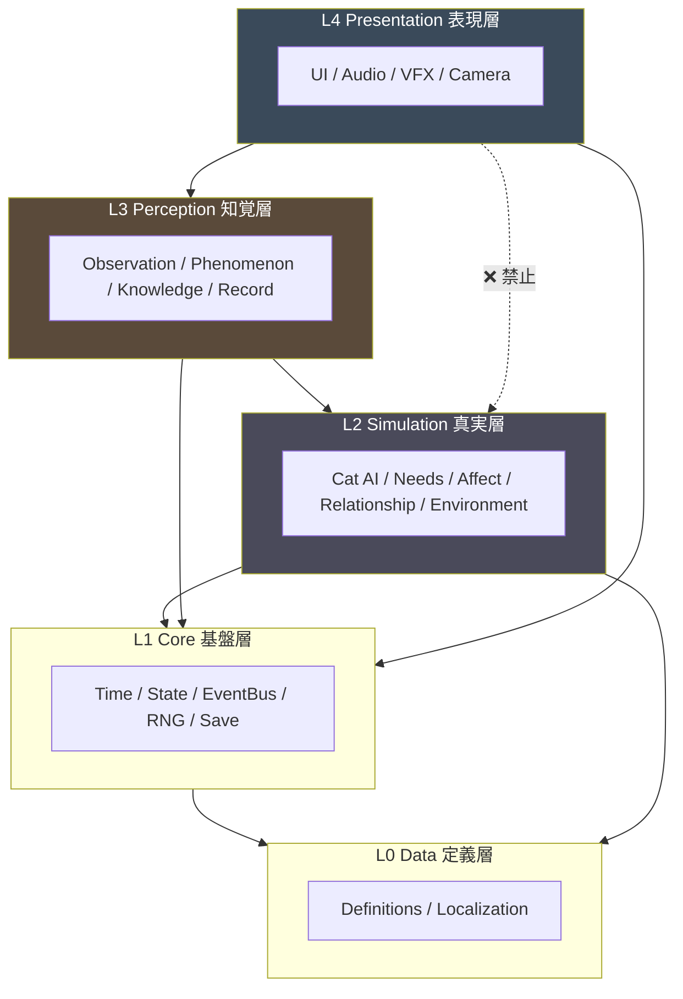

| 層 | 名称 | 扱うもの | プレイヤーへの露出 |
|---|---|---|---|
| **L4** | Presentation | 描画・音・入力 | 直接 |
| **L3** | Perception | 現象・観測・知識・記録 | 経由 |
| **L2** | **Simulation** | **数値・状態・真実** | **絶対に不可** |
| **L1** | Core | 時間・状態管理・保存 | 間接 |
| **L0** | Data | 定義データ | 間接 |

### 0.3 三つの構造的保証

本アーキテクチャは、以下を**構造として**保証する。規律ではない。

| # | 保証 | 実現手段 | 守る条項 |
|---|---|---|---|
| **G-1** | 数値がUIに到達しない | L4 → L2 の参照を禁止。型レベルで分離 | 憲章 I-1 |
| **G-2** | ゲームが正解を教えられない | Player Knowledge は Simulation を参照できない | Pillar 2 |
| **G-3** | 猫の行動が再現可能 | 決定論的シミュレーション + Seeded RNG | 原則2（個体差≠ランダム） |

### 0.4 G-2 の重要性（設計理由）

**Player Knowledge System（プレイヤーの理解度）が Simulation を参照できないこと**は、
本アーキテクチャで2番目に重要な決定である。

```
❌ よくある実装：
   PlayerKnowledge.progress = compare(playerHypothesis, catTruth)
   → ゲームは正解を知っており、答え合わせができてしまう
   → Pillar 2 の構造的破壊

✅ 本作の実装：
   PlayerKnowledge = f(観測した Phenomenon の履歴)
   → ゲームは「プレイヤーが何を見たか」しか知らない
   → 答え合わせが物理的に不可能
```

**「正解表示を実装しない」のではなく、「正解表示を実装できない」構造にする。**

### 0.5 設計上のトレードオフと受容

| トレードオフ | 受容する理由 |
|---|---|
| 層をまたぐ変換コストが増える | 憲章の保証がコードで担保される価値が上回る |
| デバッグ時に真実が見えにくい | **開発ビルド限定**のデバッグビューを別経路で用意する（§11.5） |
| Phenomenon の語彙定義が先行して必要 | 語彙の共通化は職種横断の利益になる |
| 直接参照より記述量が増える | 長期保守で回収できる |

---

# ① System Overview

> **目的**: ゲームを構成する全システムを列挙し、責務と依存を一望可能にする。
> **責務**: システムの粒度と境界を確定し、「どこに実装すべきか」の判断を一意にする。
> **設計理由**: 責務が曖昧なシステムは必ず肥大化する。特に本作では Simulation と Perception の境界が曖昧になると憲章違反が起きるため、境界を最初に固定する。
> **他システムへの影響**: 全モジュールの配置がここで決まる。以降の章はすべてこの一覧を前提とする。

## 1.1 システム一覧（層別）

### L0: Data 定義層

| # | システム | 責務 | 依存 |
|---|---|---|---|
| D-01 | **Content Definition Registry** | 全定義データの読込・検証・提供 | なし |
| D-02 | **Localization System** | 言語別テキストの提供 | D-01 |

### L1: Core 基盤層

| # | システム | 責務 | 依存 |
|---|---|---|---|
| C-01 | **Game Manager** | 起動・シーン統括・ライフサイクル | C-02〜C-09 |
| C-02 | **Time System** | 時間の進行と粒度管理 | C-04 |
| C-03 | **State Store** | 全状態の単一保持・遷移制御 | C-04 |
| C-04 | **Event Bus** | システム間の疎結合通信 | なし |
| C-05 | **RNG Service** | 決定論的乱数の提供 | なし |
| C-06 | **Save System** | 永続化・復元・整合性検証 | C-03, C-05 |
| C-07 | **Settings System** | 設定値の保持と提供 | C-06 |
| C-08 | **Internal Metrics System** | 内部指標の計測（非表示） | C-04 |
| C-09 | **Error & Recovery Service** | 異常検出・縮退・復旧 | C-04, C-06 |

### L2: Simulation 真実層 ⚠️ 観測境界の内側

| # | システム | 責務 | 依存 |
|---|---|---|---|
| S-01 | **Simulation System** | 真実層の統括・更新順序の保証 | S-02〜S-12, C-* |
| S-02 | **Cat AI System** | 猫の意思決定 | S-03〜S-06, S-07 |
| S-03 | **Behavior System** | 行動の実行と遷移 | S-04, S-07 |
| S-04 | **Needs System** | 生理的欲求の管理 | C-02 |
| S-05 | **Internal Affect State** | 情動状態の管理（旧 Emotion System） | S-04, S-06 |
| S-06 | **Relationship System** | 対プレイヤー関係の管理 | C-02 |
| S-07 | **Environment System** | 空間条件の統合評価 | S-08, S-09, S-10 |
| S-08 | **Room System** | 部屋の構造・領域・動線 | D-01 |
| S-09 | **Furniture System** | 設置物の配置と属性 | S-08, D-01 |
| S-10 | **Item System** | 消耗品・道具の状態 | D-01 |
| S-11 | **Trace System** | 痕跡の生成と減衰 | S-03, C-02 |
| S-12 | **Scenario System** | 30日の進行文脈・個体プロファイル適用 | D-01, C-02 |
| S-13 | **Event Rule Engine** | 条件判定とイベント発火 | S-01〜S-12, C-04 |

### L3: Perception 知覚層 ⚠️ 観測境界そのもの

| # | システム | 責務 | 依存 |
|---|---|---|---|
| P-01 | **Perception Gateway** ★ | 真実→現象の変換。**唯一の越境点** | S-*, D-01 |
| P-02 | **Phenomenon Registry** | 現象語彙の定義と解決 | D-01 |
| P-03 | **Observation System** | 注視・走査・滞留時間の管理 | P-01, P-02, C-02 |
| P-04 | **Player Knowledge System** | プレイヤーの理解度（観測履歴由来） | P-03, P-02 |
| P-05 | **Record System** | 観察ノート・仮説・記録の保持 | P-03, P-04, D-02 |
| P-06 | **Narration System** | 現象の言語化（旧 Dialogue System） | P-02, P-04, D-02 |
| P-07 | **Decision System** | プレイヤーの意思決定の受理と適用 | P-04, C-04 |
| P-08 | **Progression System** | 日数進行とプレイヤー側の到達管理 | C-02, P-04 |
| P-09 | **Onboarding Constraint System** | 初期制約の管理（旧 Tutorial System） | P-07, C-02 |

### L4: Presentation 表現層

| # | システム | 責務 | 依存 |
|---|---|---|---|
| V-01 | **UI Manager** | 画面構成・遷移・入力受付 | P-*, C-* |
| V-02 | **Input Manager** | 入力の正規化 | C-04 |
| V-03 | **Camera Manager** | 視点・構図の管理 | P-03 |
| V-04 | **Audio Manager** | 音の再生管理 | P-01経由, C-07 |
| V-05 | **Visual Effect Manager** | 演出の再生管理 | P-02 |
| V-06 | **In-Game Notice System** | 画面内の状態通知（旧 Notification System） | C-04 |

## 1.2 ⚠️ 上位文書との整合により再定義／不採用としたモジュール

**指定されたモジュール一覧のうち、以下は上位文書と衝突するため、そのままでは採用できない。**
本書では honest に再定義または不採用とする。

| 指定名 | 判定 | 理由 | 本書での扱い |
|---|---|---|---|
| **Achievement System** | ❌ **不採用** | 実績・トロフィーは憲章 I-7 / AP-27 で禁止 | **実装しない**。内部計測のみ C-08 が担う |
| **Notification System** | 🔄 **再定義** | プッシュ通知は AP-16 で禁止 | V-06「画面内の状態通知」に限定。外部通知は実装しない |
| **Progression System** | 🔄 **再定義** | レベル・経験値は憲章 I-3 で禁止 | P-08「日数進行 + プレイヤー側の到達管理」。猫側の進行は扱わない |
| **Tutorial System** | 🔄 **再定義** | 説明による教示は Player Flow T-1 で禁止 | P-09「初期制約の管理」。**説明を出す機能を持たない** |
| **Dialogue System** | 🔄 **再定義** | 猫のセリフは AP-35 で禁止 | P-06「現象の言語化」。猫の台詞・内心の語りを扱わない |
| **Emotion System** | 🔄 **再定義** | 猫の感情の露出は憲章 I-1 で禁止 | S-05「Internal Affect State」。観測境界の内側に完全に閉じる |
| **Analytics System** | 🔄 **再定義** | 現実行動の追跡は AP-86 で禁止 | C-08「Internal Metrics」。プレイヤーに非表示、外部送信は同意ベース |

> ⚠️ **Achievement System を「後で必要になるかもしれないから枠だけ用意する」ことはしない。**
> 空の枠は必ず埋められる。存在しないものは実装できない。これが構造的保証である。

## 1.3 責務の一言定義（共通言語）

```
Data          ── 「何が存在しうるか」を定義する
Core          ── 「いつ」「どこに保持し」「どう伝えるか」を担う
Simulation    ── 「実際に何が起きているか」を計算する
Perception    ── 「そのうち何が観測できるか」に変換する
Presentation  ── 「それをどう見せるか」を担う
```

---

# ② Architecture Diagram

> **目的**: 職種横断の共通言語となる図を提供する。
> **責務**: 文章で読み違えうる関係を、図で一意に固定する。
> **設計理由**: 依存関係の誤解はレビューでは検出されにくい。図があれば「この矢印は存在しない」と即座に指摘できる。
> **他システムへの影響**: 実装時のディレクトリ構成・モジュール境界がこの図に一致すること。

## 2.1 システム構成図

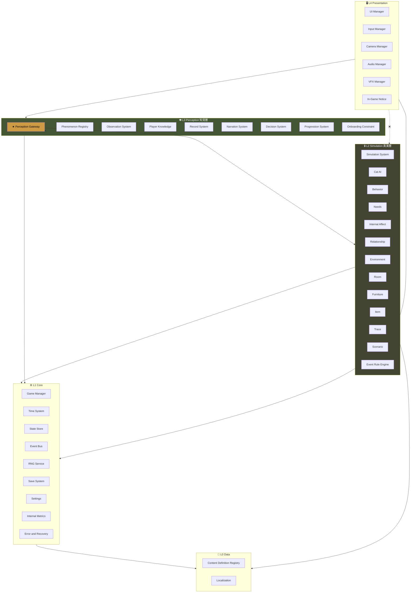

## 2.2 依存関係図（許可と禁止）

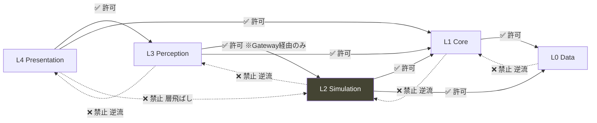

### 依存の絶対規則

| # | 規則 | 違反時の影響 |
|---|---|---|
| **DR-1** | 上位層は下位層を参照してよい | — |
| **DR-2** | 下位層は上位層を参照してはならない | 循環参照・テスト不能 |
| **DR-3** | **L4 は L2 を参照してはならない**（層飛ばし禁止） | **憲章 I-1 違反** |
| **DR-4** | L3 → L2 の参照は **Perception Gateway 経由のみ** | **憲章 I-1 違反** |
| **DR-5** | 同一層内の相互参照は Event Bus 経由 | 循環参照 |

## 2.3 モジュール図（責務グループ）

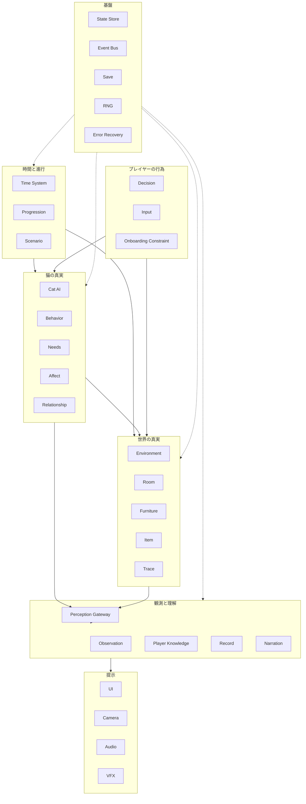

## 2.4 責務図

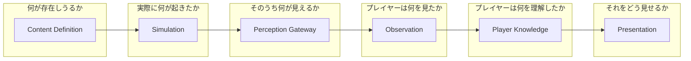

**この一直線が、本作のアーキテクチャの本質である。**
逆流する矢印は存在しない。ゲームは「プレイヤーが理解したか」を、真実と照合しない。

---

# ③ System Modules

> **目的**: 各モジュールの責務・入出力・保持データ・依存・禁止事項を確定する。
> **責務**: 「この機能はどこに書くのか」を一意に決定可能にする。
> **設計理由**: 特に**禁止事項**を明記することが本章の主眼である。責務の記述だけでは、憲章違反は防げない。禁止を書いて初めて、レビューが機能する。
> **他システムへの影響**: 詳細設計はすべて本章の枠内で行われる。枠を超える場合は本書の改訂が必要。

## 記法

各モジュールを以下で定義する。

```
責務      : 何をするか（1〜3行）
入力      : 受け取るもの
出力      : 提供するもの
保持データ : 自身が所有する状態
依存先    : 参照してよいモジュール
禁止事項  : 絶対にしてはならないこと ⚠️
```

---

## L0: Data 定義層

### D-01 Content Definition Registry

| 項目 | 内容 |
|---|---|
| **責務** | 全定義データ（猫プロファイル、家具、アイテム、部屋、イベント、現象語彙、シナリオ）の読込・スキーマ検証・提供 |
| **入力** | 定義ファイル群（JSON等） |
| **出力** | 型付き定義オブジェクト、検証結果 |
| **保持データ** | 読込済み定義の不変マップ |
| **依存先** | なし |
| **禁止事項** | ⚠️ 実行時に定義を書き換えないこと（不変であること）<br>⚠️ ロジックを持たないこと（データのみ）<br>⚠️ 検証を通らない定義を提供しないこと |

**設計理由**: 拡張性（⑩）の土台。新しい猫・家具・イベントは**定義追加のみ**で成立させる。

### D-02 Localization System

| 項目 | 内容 |
|---|---|
| **責務** | キーから表示テキストへの解決。言語切替 |
| **入力** | テキストキー、言語設定、置換パラメータ |
| **出力** | 表示文字列 |
| **保持データ** | 現在言語、テキスト辞書 |
| **依存先** | D-01, C-07 |
| **禁止事項** | ⚠️ ハードコードされた表示文字列を許容しないこと<br>⚠️ テキスト内で数値をフォーマットして返さないこと（憲章 I-1 の抜け道になる）<br>⚠️ 文中の語順固定を前提にしないこと（多言語対応の阻害） |

---

## L1: Core 基盤層

### C-01 Game Manager

| 項目 | 内容 |
|---|---|
| **責務** | アプリのライフサイクル統括。シーン遷移。初期化順序の保証。終了処理 |
| **入力** | 起動要求、シーン遷移要求 |
| **出力** | ライフサイクルイベント |
| **保持データ** | 現在シーン、初期化状態 |
| **依存先** | C-02〜C-09, D-01 |
| **禁止事項** | ⚠️ ゲームロジックを持たないこと（統括のみ）<br>⚠️ 他モジュールの内部状態を直接書き換えないこと<br>⚠️ シングルトンの神クラス化（AA-03） |

### C-02 Time System

| 項目 | 内容 |
|---|---|
| **責務** | 時間粒度（Frame / Tick / Segment / Day / Trial）の進行と通知 |
| **入力** | 実時間デルタ、時間進行要求 |
| **出力** | 各粒度の進行イベント、現在時刻 |
| **保持データ** | 現在Day、現在Segment、Tick累積、実時間デルタ |
| **依存先** | C-04 |
| **禁止事項** | ⚠️ 時間を巻き戻せる API を提供しないこと（Pillar 4 / AP-08）<br>⚠️ 実時間（壁時計）と連動しないこと（AP-17）<br>⚠️ 各層が独自に時間を数えることを許容しないこと（時間の単一情報源） |

**時間粒度の定義**（§6 で詳述）

| 粒度 | 意味 | 駆動 |
|---|---|---|
| Frame | 描画1回 | 実時間 |
| Tick | 観察中の滞留単位 | 実時間（観察中のみ） |
| Segment | 1日内の時間帯（朝/昼/夕/夜） | プレイヤー行動 |
| Day | 1日 | 明示的な確定操作 |
| Trial | 30日全体 | Day 30 到達 |

### C-03 State Store

| 項目 | 内容 |
|---|---|
| **責務** | ゲーム全状態の単一保持。状態遷移の受理と検証。変更の通知 |
| **入力** | 状態変更要求（Command） |
| **出力** | 現在状態（読み取り専用）、変更通知 |
| **保持データ** | GameState / SceneState / DayState / CatState / PlayerState / EventState |
| **依存先** | C-04 |
| **禁止事項** | ⚠️ 状態を直接書き換え可能な参照を外部に渡さないこと<br>⚠️ 不正な遷移を受理しないこと<br>⚠️ **L4 に CatState への読み取りアクセスを与えないこと**（憲章 I-1）<br>⚠️ 状態にロジックを持たせないこと（データのみ） |

### C-04 Event Bus

| 項目 | 内容 |
|---|---|
| **責務** | 疎結合なシステム間通信。購読・発行・優先度制御 |
| **入力** | イベント発行 |
| **出力** | 購読者への配信 |
| **保持データ** | 購読レジストリ、配信キュー |
| **依存先** | なし |
| **禁止事項** | ⚠️ イベントに Simulation の生データを載せないこと（Phenomenon のみ・L3以上向け）<br>⚠️ 同期配信中の再入を許容しないこと（AA-27）<br>⚠️ 配信順序を保証しない実装にしないこと<br>⚠️ 購読解除漏れを検出しない実装にしないこと |

### C-05 RNG Service

| 項目 | 内容 |
|---|---|
| **責務** | 決定論的乱数の提供。用途別ストリーム管理 |
| **入力** | シード、ストリーム識別子 |
| **出力** | 乱数値 |
| **保持データ** | シード、ストリームごとの内部状態 |
| **依存先** | なし |
| **禁止事項** | ⚠️ グローバルな `Math.random()` を使用しないこと（再現性の破壊）<br>⚠️ 用途間でストリームを共有しないこと（一つの変更が全体を変える）<br>⚠️ **猫の性格をランダム生成した結果をプレイヤーに開示しないこと**（AP-11） |

**設計理由**: 原則2「猫は個体差がある」は**ランダム**ではなく**一貫した個体**を意味する（Experience Bible 原則2）。
再現性がなければ、プレイヤーの観察は成立しない。

### C-06 Save System

| 項目 | 内容 |
|---|---|
| **責務** | 状態の永続化・復元・整合性検証・マイグレーション |
| **入力** | 保存要求、復元要求 |
| **出力** | 保存結果、復元された状態 |
| **保持データ** | 保存スキーマ版、最終保存時刻 |
| **依存先** | C-03, C-05, C-09 |
| **禁止事項** | ⚠️ 複数スロットを提供しないこと（Pillar 4 / AP-08）<br>⚠️ 手動ロードによる巻き戻しを提供しないこと<br>⚠️ 保存失敗を無言で握りつぶさないこと<br>⚠️ 保存単位を大きくしすぎないこと（部分保存を可能に） |

### C-07 Settings System

| 項目 | 内容 |
|---|---|
| **責務** | ユーザー設定（音量、文字サイズ、モーション低減、言語）の保持と提供 |
| **入力** | 設定変更 |
| **出力** | 現在設定、変更通知 |
| **保持データ** | 設定値 |
| **依存先** | C-06 |
| **禁止事項** | ⚠️ 難易度設定を持たないこと（AP-09）<br>⚠️ 体験の内容を変える設定を持たないこと（提示方法の変更のみ・Player Flow ⑪11.7）<br>⚠️ ヒント表示等の設定を持たないこと（AP-32） |

### C-08 Internal Metrics System

| 項目 | 内容 |
|---|---|
| **責務** | 憲章§11.2の評価指標（観察回数、仮説数、環境改善試行、再試行、理解度）の内部計測 |
| **入力** | 各種行動イベント |
| **出力** | 集計値（**開発者向けのみ**） |
| **保持データ** | 計測カウンタ、時系列ログ |
| **依存先** | C-04 |
| **禁止事項** | ⚠️ **計測値をプレイヤーに表示しないこと**（憲章 I-1 / Reality Bridge 10.4）<br>⚠️ 実績・トロフィーを実装しないこと（AP-27）<br>⚠️ プレイヤーの現実行動を追跡しないこと（AP-86）<br>⚠️ 同意なく外部送信しないこと<br>⚠️ 計測がゲームロジックに影響しないこと（観測が対象を変えない） |

### C-09 Error & Recovery Service

| 項目 | 内容 |
|---|---|
| **責務** | 異常検出・分類・縮退運転・復旧・ユーザー通知 |
| **入力** | 例外、整合性違反、リソース欠損 |
| **出力** | 復旧アクション、通知要求 |
| **保持データ** | エラー履歴、縮退状態 |
| **依存先** | C-04, C-06 |
| **禁止事項** | ⚠️ エラーメッセージでプレイヤーを不安にさせないこと<br>⚠️ 進行を失わせる復旧を行わないこと<br>⚠️ 技術的詳細を素のまま表示しないこと |

---

## L2: Simulation 真実層 🔒

> ⚠️ **本層のすべてのモジュールは、L4 から直接参照されてはならない。**
> **本層のデータは、Perception Gateway を経由してのみ外部に出る。**

### S-01 Simulation System

| 項目 | 内容 |
|---|---|
| **責務** | 真実層の統括。更新順序の保証。1 Segment / 1 Day のシミュレーション実行 |
| **入力** | 時間進行、プレイヤー決定の適用結果 |
| **出力** | シミュレーション完了通知、変化サマリ（内部用） |
| **保持データ** | シミュレーション進行状態 |
| **依存先** | S-02〜S-13, C-02, C-03, C-05 |
| **禁止事項** | ⚠️ Perception 層を参照しないこと（DR-2）<br>⚠️ 「プレイヤーが何を知っているか」を参照しないこと（G-2）<br>⚠️ 更新順序を非決定的にしないこと |

### S-02 Cat AI System

| 項目 | 内容 |
|---|---|
| **責務** | 猫の意思決定。次に何をするかの選択 |
| **入力** | Needs / Affect / Relationship / Environment の現状、時間帯 |
| **出力** | 行動意図（Behavior への指示） |
| **保持データ** | 意思決定の内部文脈、直近の選択履歴 |
| **依存先** | S-03〜S-07, C-02, C-05 |
| **禁止事項** | ⚠️ プレイヤーの入力に直接反応しないこと（環境と関係を介する・憲章 I-2）<br>⚠️ 「懐き度」等の単一スカラーで行動を決めないこと<br>⚠️ プレイヤーの理解度を参照しないこと（G-2）<br>⚠️ **性格プロファイルを実行中に変更しないこと**（Pillar 5） |

**⚠️ 詳細ロジックは本書の対象外**（Cat AI 設計指針で定義）。本書が定めるのは責務境界のみ。

### S-03 Behavior System

| 項目 | 内容 |
|---|---|
| **責務** | 行動の実行・遷移・継続時間管理。行動から観測可能な事象への写像元を生成 |
| **入力** | 行動意図、環境条件 |
| **出力** | 現在行動、行動遷移イベント |
| **保持データ** | 現在行動、経過時間、行動履歴 |
| **依存先** | S-04, S-07, C-02 |
| **禁止事項** | ⚠️ 実在しない行動を実装しないこと（憲章§9.6 / AP-45）<br>⚠️ 1つの行動に単一の意味を固定しないこと（Player Flow ⑥6.3・文脈依存）<br>⚠️ 演出都合で行動を発生させないこと（真実が先、表現が後） |

### S-04 Needs System

| 項目 | 内容 |
|---|---|
| **責務** | 生理的欲求（空腹・排泄・睡眠・体温・グルーミング等）の推移管理 |
| **入力** | 時間経過、行動による充足 |
| **出力** | 各欲求の現在値（**内部のみ**） |
| **保持データ** | 欲求値、推移パラメータ |
| **依存先** | C-02 |
| **禁止事項** | ⚠️ **欲求値を L3 以上に生値で渡さないこと**（憲章 I-1）<br>⚠️ 欠乏を致命的結果に接続しないこと（憲章§9.4・死を扱わない）<br>⚠️ プレイヤーの介入で直接充足させないこと（環境を介する） |

### S-05 Internal Affect State（旧 Emotion System）

| 項目 | 内容 |
|---|---|
| **責務** | 情動状態（警戒・緊張・弛緩・興味）の管理 |
| **入力** | 環境変化、プレイヤーの距離・動作、時間経過 |
| **出力** | 情動状態（**内部のみ**） |
| **保持データ** | 情動値、減衰・上昇パラメータ、履歴 |
| **依存先** | S-04, S-06, S-07, C-02 |
| **禁止事項** | ⚠️ **情動を L3 以上に生値で渡さないこと**（憲章 I-1・最重要）<br>⚠️ 情動をUIに表示可能な形式で公開しないこと<br>⚠️ 感情アイコン・記号に対応づけないこと（AP-36）<br>⚠️ 「感情」という語をプレイヤー向けテキストに使わないこと |

> ⚠️ **本モジュールが本作で最も危険なモジュールである。**
> ここからの漏洩は、そのまま憲章 I-1 違反になる。型システムで L3 への露出を禁止すること（§7.4）。

### S-06 Relationship System

| 項目 | 内容 |
|---|---|
| **責務** | 猫からプレイヤーへの関係状態（許容距離、接近許容、回避傾向）の管理。悪循環の進行と回復 |
| **入力** | プレイヤーの距離・行動、時間経過 |
| **出力** | 関係状態（**内部のみ**） |
| **保持データ** | 関係値、悪循環カウンタ、回復進行 |
| **依存先** | C-02, S-05 |
| **禁止事項** | ⚠️ **「好感度」「懐き度」として公開しないこと**（憲章 I-1・AP-02）<br>⚠️ 単調増加させないこと（Pillar 5・行き来がある）<br>⚠️ **回復不能状態を作らないこと**（詰みの禁止・Player Flow ⑧8.4）<br>⚠️ 上限に到達可能なゲージにしないこと |

### S-07 Environment System

| 項目 | 内容 |
|---|---|
| **責務** | Room / Furniture / Item を統合し、空間条件（高さ・遮蔽・動線・視線・音・光）を評価 |
| **入力** | 部屋構成、設置物、アイテム、プレイヤー位置 |
| **出力** | 空間条件の評価結果（**内部のみ**） |
| **保持データ** | 評価キャッシュ、無効化フラグ |
| **依存先** | S-08, S-09, S-10 |
| **禁止事項** | ⚠️ 家具に「効果値」を持たせないこと（Pillar 3 / AP-16相当）<br>⚠️ 「良い配置スコア」を算出しないこと（正解の存在を意味する・原則3）<br>⚠️ 評価結果をプレイヤーに開示しないこと |

### S-08 Room System

| 項目 | 内容 |
|---|---|
| **責務** | 部屋の構造・領域分割・通行可能性・視線の通り |
| **入力** | 部屋定義、家具配置 |
| **出力** | 領域グラフ、通行・視線判定 |
| **保持データ** | 領域構造、接続関係 |
| **依存先** | D-01 |
| **禁止事項** | ⚠️ 部屋を単一固定にしないこと（拡張性・⑩）<br>⚠️ 座標系をプレゼンテーション層と共有しないこと（表現の変更が真実に影響する） |

### S-09 Furniture System

| 項目 | 内容 |
|---|---|
| **責務** | 設置物の配置・向き・占有領域・物理属性（高さ、遮蔽性、素材、安定性） |
| **入力** | 配置操作、家具定義 |
| **出力** | 配置状態、属性 |
| **保持データ** | 配置リスト |
| **依存先** | S-08, D-01 |
| **禁止事項** | ⚠️ **家具に性能値・効果説明を持たせないこと**（Pillar 3・「事実」のみ）<br>⚠️ 価格・ランク・レアリティを持たせないこと（AP-41相当）<br>⚠️ 「猫が好む家具」というフラグを持たせないこと（個体差の否定・原則2） |

### S-10 Item System

| 項目 | 内容 |
|---|---|
| **責務** | 消耗品・道具の状態（残量、鮮度、位置） |
| **入力** | 使用・配置・補充 |
| **出力** | アイテム状態 |
| **保持データ** | アイテムインスタンス |
| **依存先** | D-01 |
| **禁止事項** | ⚠️ 収集要素にしないこと（AP-26 / 憲章 I-7）<br>⚠️ レアリティ・強化を持たせないこと<br>⚠️ 所持数を報酬にしないこと |

### S-11 Trace System

| 項目 | 内容 |
|---|---|
| **責務** | 痕跡（餌の減り、トイレ、抜け毛、爪跡、移動跡）の生成・蓄積・減衰 |
| **入力** | 猫の行動履歴、時間経過 |
| **出力** | 痕跡インスタンス |
| **保持データ** | 痕跡リスト、鮮度 |
| **依存先** | S-03, C-02 |
| **禁止事項** | ⚠️ 痕跡を自動で解釈しないこと（意味づけは Perception 以降）<br>⚠️ プレイヤーが見なくても情報が自動取得される構造にしないこと（Pillar 1）<br>⚠️ 痕跡を無限蓄積しないこと（減衰必須・パフォーマンス） |

**設計理由**: Player Flow ②5〜10分区間の主要体験。**不在時の情報源**という独自の責務を持つため、独立モジュールとする。

### S-12 Scenario System

| 項目 | 内容 |
|---|---|
| **責務** | 30日の進行文脈。個体プロファイルの適用。Day帯ごとの条件供給 |
| **入力** | Day、個体定義 |
| **出力** | 現在の進行文脈、適用中プロファイル |
| **保持データ** | シナリオ進行状態 |
| **依存先** | D-01, C-02 |
| **禁止事項** | ⚠️ 特定日に特定の結果を強制しないこと（原則5・思い通りにならない）<br>⚠️ **プレイヤーの行動を無視した台本進行にしないこと**<br>⚠️ 分岐をフラグの羅列で管理しないこと（AA-41） |

### S-13 Event Rule Engine

| 項目 | 内容 |
|---|---|
| **責務** | 条件評価とイベント発火。優先度・排他・クールダウンの管理 |
| **入力** | 全 Simulation 状態、時間 |
| **出力** | 発火イベント |
| **保持データ** | ルール状態、発火履歴、クールダウン |
| **依存先** | S-01〜S-12, C-02, C-04 |
| **禁止事項** | ⚠️ ルールをコードにハードコードしないこと（データ駆動・⑩）<br>⚠️ イベントが Simulation 状態を直接書き換えないこと（Command 経由）<br>⚠️ 同一 Segment 内で無制限に発火させないこと（⑤5.4） |

---

## L3: Perception 知覚層 👁️

### P-01 Perception Gateway ★ 最重要

| 項目 | 内容 |
|---|---|
| **責務** | **真実（Truth）から現象（Phenomenon）への変換。観測境界の唯一の通過点** |
| **入力** | Simulation 状態、観測条件（視線・距離・注視時間・光・音） |
| **出力** | **Phenomenon のみ**（数値を含まない構造体） |
| **保持データ** | 変換ルール参照、直近の変換結果キャッシュ |
| **依存先** | S-01〜S-12, P-02, D-01 |
| **禁止事項** | ⚠️ **数値を含む出力を返さないこと**（型で禁止する）<br>⚠️ 真実への参照を出力に含めないこと<br>⚠️ 「解釈」を出力しないこと（現象のみ。意味づけはプレイヤーの仕事）<br>⚠️ Gateway をバイパスする経路を作らないこと |

**出力の形（概念）**

```
Phenomenon {
  subject   : 対象識別子（猫 / 痕跡 / 家具 / 音）
  descriptor: 現象語彙ID（「棚の上にいる」「耳を後ろに向けている」）
  qualifier : 修飾語彙ID（「わずかに」「しばらく」）
  observability: 観測条件を満たしたか
}
```

**含まれてはならないもの**

```
❌ 警戒度: 0.73
❌ 好感度: 42
❌ 空腹度: high
❌ 内部状態への参照
❌ 「猫は怖がっている」という解釈
```

**含まれてよいもの**

```
✅ 「耳を後ろに向けている」（観測可能な事実）
✅ 「棚の上から降りてこない」（観測可能な事実）
✅ 「しばらく動かない」（観測可能な事実）
```

> **この境界が破られたら、それは実装のミスではなく、憲章違反である。**
> レビューの最優先確認項目とする。

### P-02 Phenomenon Registry

| 項目 | 内容 |
|---|---|
| **責務** | 現象語彙（descriptor / qualifier）の定義・検証・解決 |
| **入力** | 語彙ID |
| **出力** | 語彙定義、表示キー |
| **保持データ** | 語彙辞書 |
| **依存先** | D-01 |
| **禁止事項** | ⚠️ 語彙に「意味」「正解」を持たせないこと<br>⚠️ 語彙に数値属性を持たせないこと<br>⚠️ 未定義語彙の動的生成を許容しないこと |

**設計理由**: 現象語彙は**職種横断の共通言語**である。
デザイナー・シナリオ・アニメーター・プログラマーが同じ語彙を使うことで、齟齬が消える。

### P-03 Observation System

| 項目 | 内容 |
|---|---|
| **責務** | 走査・注視・滞留時間の管理。観測条件の成立判定。**時間の関数としての情報開示** |
| **入力** | 視点、注視対象、滞留 Tick |
| **出力** | 観測された Phenomenon 群、観測履歴 |
| **保持データ** | 現在注視対象、滞留時間、観測履歴 |
| **依存先** | P-01, P-02, C-02 |
| **禁止事項** | ⚠️ **一度の操作で全情報を返さないこと**（AP-33 / Player Flow ⑥6.1）<br>⚠️ 観測回数・時間に制限を設けないこと（Pillar 1）<br>⚠️ プレイヤーが見ていない対象の情報を返さないこと<br>⚠️ 「未観測」を可視化しないこと（AP-26） |

**核心的責務: 時間の関数**

```
滞留 Tick  →  開示される Phenomenon の粒度
   1        →  位置
   3        →  姿勢
   6        →  部位の動き
  10        →  持続・反復のパターン
```

**この段階的開示が、AP-33（クリックで情報ウィンドウ）を構造的に防ぐ。**

### P-04 Player Knowledge System

| 項目 | 内容 |
|---|---|
| **責務** | プレイヤーの理解度の管理。**観測履歴のみから**構築 |
| **入力** | 観測履歴（Phenomenon の系列） |
| **出力** | 理解度（内部）、描写解像度レベル、再解釈可能フラグ |
| **保持データ** | 観測済み Phenomenon の集合、パターン検出結果、学習ライン進行 |
| **依存先** | P-03, P-02 |
| **禁止事項** | ⚠️ **Simulation を参照しないこと**（G-2・最重要）<br>⚠️ 「正解との一致度」を計算しないこと<br>⚠️ **理解度をプレイヤーに数値表示しないこと**（憲章 I-1）<br>⚠️ 「学習完了」を判定・通知しないこと（Player Flow ⑦7.5）<br>⚠️ 未達成の学習項目を可視化しないこと |

> **本モジュールは、猫の真実を知らない。**
> 知っているのは「プレイヤーが何を、何回、どの文脈で見たか」だけである。
> これにより答え合わせが物理的に不可能になる。

### P-05 Record System

| 項目 | 内容 |
|---|---|
| **責務** | 観察ノート・仮説・環境変更履歴・日次記録の保持と参照 |
| **入力** | 観測結果、プレイヤーの仮説操作、決定履歴 |
| **出力** | 記録エントリ、日次参照 |
| **保持データ** | 記録エントリ列（**追記のみ・不変**） |
| **依存先** | P-03, P-04, P-06, D-02 |
| **禁止事項** | ⚠️ 記録を書き換え・削除しないこと（Pillar 4・過去は変わらない）<br>⚠️ **外れた仮説を削除しないこと**（Player Flow ⑧8.5）<br>⚠️ 進捗率・達成率を算出しないこと（AP-27）<br>⚠️ 未解決件数をカウント表示しないこと（Player Flow RF-3） |

### P-06 Narration System（旧 Dialogue System）

| 項目 | 内容 |
|---|---|
| **責務** | Phenomenon を言語化する。描写解像度に応じた文の選択 |
| **入力** | Phenomenon、描写解像度レベル |
| **出力** | 表示テキストキー + パラメータ |
| **保持データ** | 描写テンプレート参照 |
| **依存先** | P-02, P-04, D-02 |
| **禁止事項** | ⚠️ **猫のセリフ・モノローグを扱わないこと**（AP-35）<br>⚠️ **猫の内心を断定しないこと**（AP-50 / 原則4）<br>⚠️ 正解を宣告しないこと（AP-49）<br>⚠️ プレイヤーを評価・叱責しないこと（憲章 I-10）<br>⚠️ 禁止語彙（育成/攻略/好感度/クリア/失敗/正解/飼う/ペット）を出力しないこと（憲章§10.2）<br>⚠️ 教訓を明示しないこと（AP-48） |

**描写解像度の実装**

```
同一 Phenomenon に対し、解像度レベル別のテキストを持つ

L1: 「猫が、こちらを見ている」
L2: 「猫が、耳を少し後ろに向けて、こちらを見ている」
L3: 「猫が、耳を少し後ろに向けている。逃げる準備をしながら、こちらを確かめている」
```

⚠️ **解像度レベルはプレイヤーに表示しない。**（Player Flow ⑥6.5）

### P-07 Decision System

| 項目 | 内容 |
|---|---|
| **責務** | プレイヤーの意思決定（D1〜D8）の受理・検証・Simulation への適用要求 |
| **入力** | プレイヤー操作 |
| **出力** | Simulation への Command、決定履歴 |
| **保持データ** | 当日の決定履歴、利用可能な決定の集合 |
| **依存先** | P-04, S-01（Command 送信のみ）, C-04 |
| **禁止事項** | ⚠️ **「おすすめ行動」を算出・提示しないこと**（AP-31）<br>⚠️ 決定の重要度を可視化しないこと（Player Flow ⑤5.1）<br>⚠️ **「何もしない」を特別扱いしないこと**（同等の選択肢として扱う）<br>⚠️ 決定に対して正誤を返さないこと（Pillar 2）<br>⚠️ 猫への直接命令を表現可能にしないこと（憲章 I-2） |

### P-08 Progression System（再定義）

| 項目 | 内容 |
|---|---|
| **責務** | 日数進行の管理。プレイヤー側の到達状態（観察力・理解力・判断力の段階）の内部管理 |
| **入力** | Day 進行、Player Knowledge の状態 |
| **出力** | 進行状態（内部）、Day 確定要求 |
| **保持データ** | 現在 Day、到達段階（内部） |
| **依存先** | C-02, P-04 |
| **禁止事項** | ⚠️ **レベル・経験値・スコアを持たないこと**（憲章 I-3）<br>⚠️ 猫側の進行を扱わないこと（Pillar 5）<br>⚠️ 到達段階をプレイヤーに表示しないこと<br>⚠️ 「アンロック通知」を出さないこと（Player Flow ⑨9.3）<br>⚠️ **残り日数を主表示として提供しないこと**（Pillar 4 / AP-18） |

### P-09 Onboarding Constraint System（旧 Tutorial System）

| 項目 | 内容 |
|---|---|
| **責務** | Day 1-3 における**制約の管理**。選択肢の絞り込み、観測対象の限定、反復回数の増加 |
| **入力** | Day、進行状態 |
| **出力** | 利用可能な決定の制限、観測ノイズの抑制指示 |
| **保持データ** | 制約プロファイル |
| **依存先** | P-07, C-02, D-01 |
| **禁止事項** | ⚠️ **説明テキストを出力する機能を持たないこと**（Player Flow T-1・最重要）<br>⚠️ ヒントを提示しないこと（AP-32）<br>⚠️ 目標を提示しないこと（Pillar 2）<br>⚠️ **Day 4 以降に制約を持ち越さないこと**（Player Flow T-5）<br>⚠️ 「チュートリアル完了」を通知しないこと |

> ⚠️ **本モジュールは「説明を出す機能」を構造的に持たない。**
> 持たせれば必ず使われる。チュートリアルは制約でのみ実現する。

---

## L4: Presentation 表現層 🖥️

### V-01 UI Manager

| 項目 | 内容 |
|---|---|
| **責務** | 画面構成・遷移・入力受付・情報提示 |
| **入力** | Perception 層の出力、Core の状態 |
| **出力** | 描画要求、ユーザー操作 |
| **保持データ** | 画面状態、表示中の要素 |
| **依存先** | P-01〜P-09, C-01〜C-07 |
| **禁止事項** | ⚠️ **L2（Simulation）を参照しないこと**（DR-3・憲章 I-1）<br>⚠️ 数値・ゲージ・パーセントを表示しないこと（憲章 I-1）<br>⚠️ 猫を覆い隠さないこと（Pillar 1）<br>⚠️ 情報階層を3階層より深くしないこと（憲章§9.5）<br>⚠️ 通知バッジ・未読マークを使わないこと（AP-28）<br>⚠️ アニメーションするUI（点滅・脈動）を使わないこと（AP-34）<br>⚠️ UI内でゲームロジックを判定しないこと |

### V-02 Input Manager

| 項目 | 内容 |
|---|---|
| **責務** | 入力の正規化（ポインタ / タッチ / キー）。デバイス差の吸収 |
| **入力** | 生入力イベント |
| **出力** | 正規化入力イベント |
| **保持データ** | 入力状態 |
| **依存先** | C-04, C-07 |
| **禁止事項** | ⚠️ 入力にゲーム的意味を持たせないこと（意味づけは上位）<br>⚠️ 精密操作を要求する入力を前提にしないこと（憲章§9.8）<br>⚠️ 片手操作で到達不能な操作を許容しないこと（憲章§9.5） |

### V-03 Camera Manager

| 項目 | 内容 |
|---|---|
| **責務** | 視点・構図・注視対象への追従 |
| **入力** | 注視対象、観察状態 |
| **出力** | カメラ状態 |
| **保持データ** | 現在の構図 |
| **依存先** | P-03, C-07 |
| **禁止事項** | ⚠️ **朝の構図を毎日変えないこと**（Player Flow ③[1]・差分が読めなくなる）<br>⚠️ 不必要にカメラを動かさないこと（AP-73）<br>⚠️ 重要な変化へ自動的に向けないこと（AP-75・気づきの代行）<br>⚠️ 演出的なカメラワークで感情を作らないこと |

### V-04 Audio Manager

| 項目 | 内容 |
|---|---|
| **責務** | 音の再生。生活音・環境音・限定的な音楽 |
| **入力** | Phenomenon（音）、演出要求、設定 |
| **出力** | 再生 |
| **保持データ** | 再生状態、ミキサ状態 |
| **依存先** | P-02, C-07 |
| **禁止事項** | ⚠️ **BGMを常時再生しないこと**（AP-72 / 憲章§9.6）<br>⚠️ 達成のファンファーレ・失敗音を持たないこと（AP-67 / AP-71）<br>⚠️ 「わかった瞬間」に効果音を鳴らさないこと（AP-70）<br>⚠️ **音のみで伝わる情報を作らないこと**（憲章§9.8・視覚的冗長が必須）<br>⚠️ 音楽で感情を作らないこと（EF-4） |

### V-05 Visual Effect Manager

| 項目 | 内容 |
|---|---|
| **責務** | 演出の再生管理 |
| **入力** | 演出要求 |
| **出力** | 演出再生 |
| **保持データ** | 再生中の演出 |
| **依存先** | P-02, C-07 |
| **禁止事項** | ⚠️ パーティクル・光エフェクトを使わないこと（AP-74）<br>⚠️ 変化を強調する演出（矢印・光る枠）を持たないこと（AP-75）<br>⚠️ 失敗時の暗転・赤化を持たないこと（AP-71）<br>⚠️ 感情アイコンを表示しないこと（AP-36）<br>⚠️ モーション低減設定を無視しないこと（憲章§9.8） |

### V-06 In-Game Notice System（旧 Notification System）

| 項目 | 内容 |
|---|---|
| **責務** | 画面内での状態変化の静かな提示（保存完了、設定変更、エラー） |
| **入力** | 通知要求 |
| **出力** | 画面内表示 |
| **保持データ** | 通知キュー |
| **依存先** | C-04, C-07 |
| **禁止事項** | ⚠️ **OSプッシュ通知を実装しないこと**（AP-16）<br>⚠️ メール送信を実装しないこと（AP-82）<br>⚠️ ゲーム進行に関する催促を出さないこと<br>⚠️ バッジ・赤丸を使わないこと（AP-28）<br>⚠️ 連続日数・復帰を言及しないこと（AP-15） |

---

# ④ Data Flow

> **目的**: 起動から終了までのデータの流れを確定する。
> **責務**: どのデータがどこで生まれ、どう変換され、どこで消えるかを明示する。
> **設計理由**: 本作のデータフローは「一方向」であることが憲章保証の実体である。双方向の流れが1本でも生まれた時点で、保証は失われる。
> **他システムへの影響**: 全モジュールの API 形状（何を受け取り何を返すか）がここから導かれる。

## 4.1 データの三態

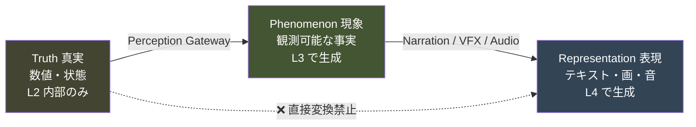

| 態 | 例 | 存在する層 | プレイヤーへの到達 |
|---|---|---|---|
| **Truth** | `affect.vigilance = 0.73` | L2 のみ | ❌ 不可 |
| **Phenomenon** | `{subject: cat, descriptor: EARS_BACK}` | L3 | ○ 経由 |
| **Representation** | 「耳を少し後ろに向けている」 | L4 | ✅ 到達 |

## 4.2 起動〜終了の全体データフロー

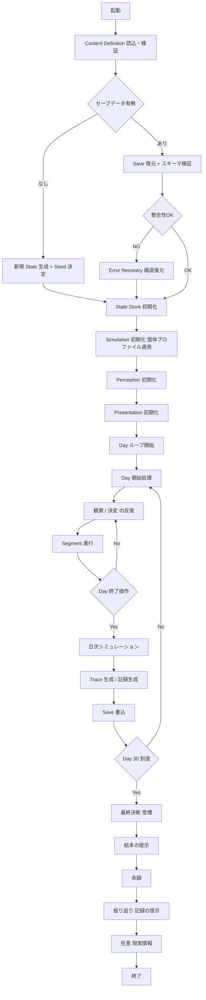

## 4.3 観察1回のデータフロー（最重要経路）

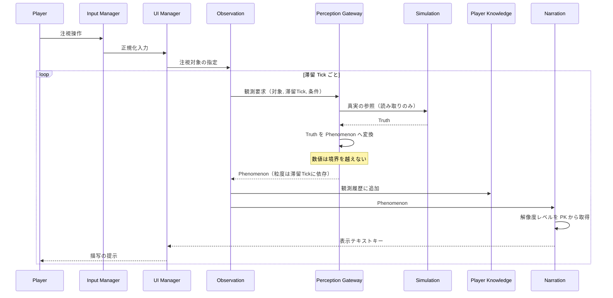

**この図の要点**

```
1. UI は Simulation を一度も参照していない
2. Gateway だけが Simulation を読む
3. Player Knowledge は Phenomenon しか受け取らない
4. Narration の解像度は「プレイヤーが何を見てきたか」で決まる（真実ではない）
```

## 4.4 決定1回のデータフロー

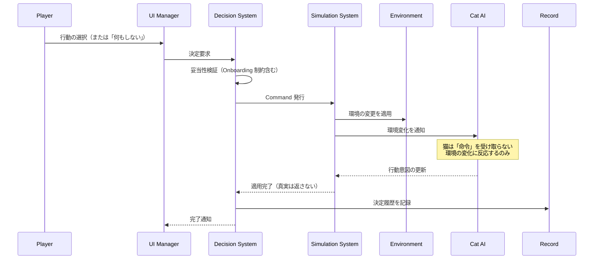

**⚠️ 最重要**: プレイヤーの決定は **Cat AI に直接届かない**。
必ず Environment を経由する。これが憲章 I-2（猫に命令できない）の構造的実装である。

## 4.5 1日終了時のデータフロー

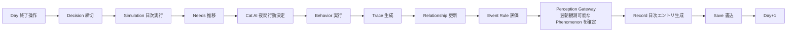

## 4.6 データの寿命

| データ | 生成 | 消滅 | 永続化 |
|---|---|---|---|
| Content Definition | 起動時 | 終了時 | ❌（毎回読込） |
| Truth（猫の状態） | Day 0 | 終了時 | ✅ |
| Phenomenon | 観測時 | 表示後 | ❌（都度生成） |
| 観測履歴 | 観測時 | 終了時 | ✅ |
| Record エントリ | 日次 | 終了時 | ✅（追記のみ） |
| Representation | 描画時 | フレーム終了 | ❌ |
| Environment 評価キャッシュ | 評価時 | 無効化時 | ❌（再生成） |
| Internal Metrics | 行動時 | 終了時 | ✅ |

---

# ⑤ Event Flow

> **目的**: イベントの発火・配信・競合・割り込みの規則を確定する。
> **責務**: イベント駆動による疎結合を実現しつつ、順序の非決定性を排除する。
> **設計理由**: Event Bus は疎結合をもたらすが、順序保証がないと再現性（G-3）が壊れる。本作では再現性が観察体験の前提であるため、**順序が保証されたイベントバス**が必須である。
> **他システムへの影響**: 全モジュールの通信規約。Event System 設計の直接の親仕様。

## 5.1 イベントの分類

| 種別 | 発生源 | 配信先 | 同期性 | 例 |
|---|---|---|---|---|
| **Lifecycle** | Game Manager | 全層 | 同期 | 初期化完了、シーン遷移 |
| **Time** | Time System | 全層 | 同期 | Segment 進行、Day 確定 |
| **Command** | Decision System | L2 | 同期 | 環境変更、行動実行 |
| **Simulation** | L2 内部 | L2 のみ | 同期 | 行動遷移、欲求閾値到達 |
| **Phenomenon** | Perception Gateway | L3, L4 | 同期 | 観測成立 |
| **Presentation** | L4 | L4 | 非同期可 | 演出開始、音再生 |
| **System** | Core | 全層 | 非同期 | 保存完了、エラー発生 |

### ⚠️ 種別ごとの越境規則

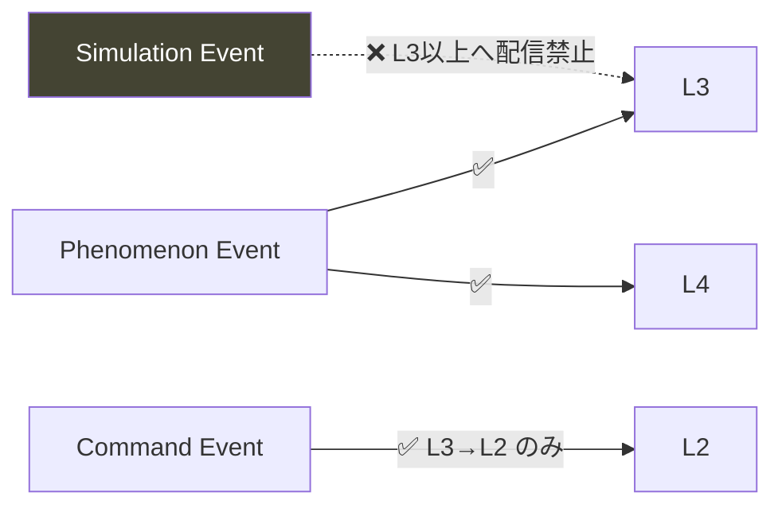

**Simulation Event は L2 の外へ出てはならない。**
外に出したい変化がある場合は、Perception Gateway で Phenomenon に変換する。

## 5.2 発火フロー

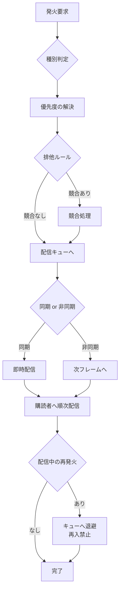

## 5.3 優先順位

イベント処理の優先度は以下で固定する。

| 優先度 | 種別 | 理由 |
|---|---|---|
| **1（最高）** | Lifecycle | 初期化・終了は他に先行する |
| **2** | System（エラー） | 異常は即座に処理する |
| **3** | Time | 時間は他の全変化の前提 |
| **4** | Command | プレイヤーの意思が Simulation に先行 |
| **5** | Simulation | 真実の更新 |
| **6** | Phenomenon | 真実が確定してから観測 |
| **7** | Presentation | 最後に見せる |
| **8（最低）** | System（計測） | 全てが済んでから記録 |

**この順序は不変とする。** 変更は本書の改訂を要する。

## 5.4 競合処理

| 競合パターン | 処理 |
|---|---|
| **同一 Segment で同種イベントが複数** | 優先度が高い1件のみ発火。残りは破棄せず次 Segment へ持ち越し |
| **排他イベント同士** | 排他グループを定義し、グループ内は同時に1件のみ |
| **クールダウン中の再発火** | 抑止。抑止された事実をログに残す |
| **同一 Day 内の発火上限超過** | 抑止。上限は Day帯ごとに定義（データ駆動） |
| **相互に前提を壊すイベント** | 依存順序を定義。定義がない場合は後発を破棄しエラーログ |

**⚠️ 破棄する場合は必ずログを残す。**
無言の破棄は再現不能なバグの温床であり、体験上の「なぜか起きなかった」を生む。

## 5.5 割り込み

**本作には、プレイヤーの操作を中断する割り込みは原則として存在しない。**

| 割り込み種別 | 可否 | 理由 |
|---|---|---|
| モーダルダイアログによる中断 | ❌ | 静けさの破壊（Pillar 6） |
| 演出による操作不能時間 | 🟡 最小限 | 日の区切りなど、意味のある場面のみ |
| 通知による中断 | ❌ | AP-16 |
| エラーによる中断 | ✅ | 進行保護のため必要 |
| 自動セーブによる中断 | ❌ | 非同期で行い、体験を止めない |

**⚠️ 唯一許容される中断は「進行が失われる危険がある場合」のみ。**

## 5.6 イベントの禁止事項

```
❌ イベントに Truth（数値）を載せて L3 以上へ配信する
❌ 同期配信中に同一イベントを再発火する（再入）
❌ 購読者が発火順序に依存する
❌ 配信順序が実行ごとに変わる（Set / Map の反復順依存）
❌ イベントで Simulation 状態を直接書き換える（Command 経由必須）
❌ 購読解除を忘れる（メモリリーク・多重実行）
❌ イベント名を文字列リテラルで散在させる
```

---

# ⑥ Update Flow

> **目的**: 更新順序を粒度ごとに固定し、非決定性を排除する。
> **責務**: 「いつ何が更新されるか」を一意にする。
> **設計理由**: 本作の観察体験は「昨日と今日の差分」に依存する。更新順序が揺れると差分が揺れ、観察が成立しない。再現性（G-3）は更新順序の固定から生まれる。
> **他システムへの影響**: 全モジュールの更新メソッドの呼ばれる順番。Technical Design の実装骨格。

## 6.1 時間粒度の全体像

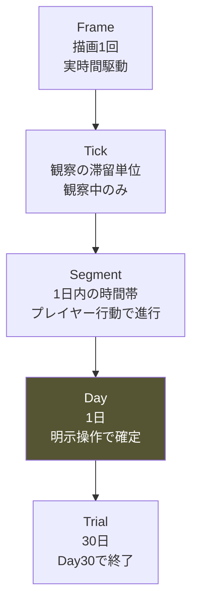

| 粒度 | 駆動 | 頻度 | 主な処理 |
|---|---|---|---|
| **Frame** | 実時間 | 描画レート依存 | 入力・カメラ・演出・描画 |
| **Tick** | 実時間（観察中のみ） | 固定間隔 | 滞留累積・Phenomenon 解決 |
| **Segment** | プレイヤーの行動 | 1日に数回 | 猫の行動決定・環境評価 |
| **Day** | 明示的な確定操作 | 1日1回 | 日次シミュレーション・保存 |
| **Trial** | Day 30 到達 | 1回 | 決断・結末 |

**⚠️ 実時間で Simulation を回さない。**
本作は実時間連動しない（AP-17）。実時間が影響するのは Frame と Tick のみ。

## 6.2 Frame 更新順序

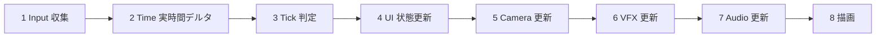

| 順 | 処理 | 担当 | 備考 |
|---|---|---|---|
| 1 | 入力収集・正規化 | V-02 | |
| 2 | 実時間デルタ確定 | C-02 | |
| 3 | Tick 到達判定 | C-02 | 観察中のみ Tick 発火 |
| 4 | UI 状態更新 | V-01 | Simulation を参照しない |
| 5 | カメラ更新 | V-03 | |
| 6 | 演出更新 | V-05 | |
| 7 | 音更新 | V-04 | |
| 8 | 描画 | — | |

**⚠️ Frame 内で Simulation を更新しない。** Simulation は Segment / Day 粒度でのみ動く。

## 6.3 Tick 更新順序（観察中のみ）

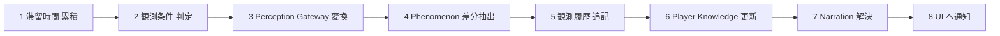

**設計上の要点**

- **4「差分抽出」が重要**。前 Tick と同じ Phenomenon は再通知しない（描写のちらつき防止）
- 6 は Simulation を参照しない（G-2）
- 観察していない間、この経路は一切動かない（パフォーマンス）

## 6.4 Segment 更新順序

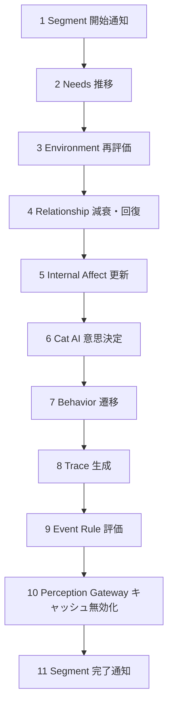

**順序の設計理由**

```
Needs → Environment → Relationship → Affect → AI の順は不変。

理由：
・欲求は環境に依存しない（最初）
・環境評価は行動決定の前提
・関係と情動は行動決定の入力
・AI は全ての入力が揃ってから決定する
```

**逆順にすると**：AI が古い情報で判断し、1 Segment 遅れた挙動になる。
観察者から見ると「昨日の環境に反応している」ように見え、因果が読めなくなる。

## 6.5 Day 更新順序

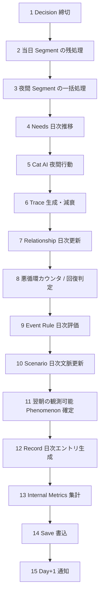

**⚠️ 14「Save」は最後から2番目。** Day+1 通知の前に保存を完了させる。
これにより「日が変わったのに保存されていない」状態が発生しない。

## 6.6 終了処理順序

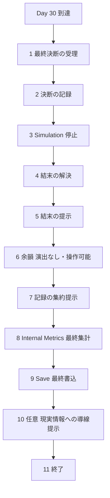

**⚠️ 6「余韻」を飛ばせる実装にしてよいが、飛ばすことを促してはならない**（Player Flow ⑨9.6）。

## 6.7 更新順序の禁止事項

```
❌ Frame で Simulation を更新する
❌ 実時間で猫の状態を変化させる（AP-17）
❌ Segment 内で更新順序が実行ごとに変わる
❌ 更新中に別粒度の更新を再入させる
❌ Save を Day 確定より前に行う
❌ Perception を Simulation より先に更新する
❌ 各モジュールが自分のタイミングで勝手に更新する
```

---

# ⑦ Dependency Rules

> **目的**: 依存の方向を規則化し、循環参照を構造的に排除する。
> **責務**: 「参照してよいか」の判断を、議論なしで決定可能にする。
> **設計理由**: 循環参照は初期には無害に見え、後期に修正不能になる。最初にルール化し、機械的に検証することが唯一の対策である。
> **他システムへの影響**: ディレクトリ構成・ビルド設定・Lint ルールの根拠。

## 7.1 依存の絶対規則（再掲・拡張）

| # | 規則 | 検証方法 |
|---|---|---|
| **DR-1** | 上位層 → 下位層 の参照は可 | 静的解析 |
| **DR-2** | 下位層 → 上位層 の参照は不可 | 静的解析（必須） |
| **DR-3** | **L4 → L2 の参照は不可**（層飛ばし禁止） | 静的解析（必須・憲章 I-1） |
| **DR-4** | L3 → L2 は **Perception Gateway 経由のみ** | 静的解析（必須・憲章 I-1） |
| **DR-5** | 同一層内の相互参照は Event Bus 経由 | レビュー |
| **DR-6** | 循環参照は全面禁止 | 静的解析（必須） |
| **DR-7** | Core は上位層の型を知らない | 静的解析 |
| **DR-8** | Data は誰も参照しない（参照されるのみ） | 静的解析 |

## 7.2 依存の詳細マトリクス

行が「参照する側」、列が「参照される側」。

| ↓参照元 \ 参照先→ | L0 Data | L1 Core | L2 Sim | L3 Perc | L4 Pres |
|---|:---:|:---:|:---:|:---:|:---:|
| **L0 Data** | 🟡内部のみ | ❌ | ❌ | ❌ | ❌ |
| **L1 Core** | ✅ | 🟡規約内 | ❌ | ❌ | ❌ |
| **L2 Simulation** | ✅ | ✅ | 🟡規約内 | ❌ | ❌ |
| **L3 Perception** | ✅ | ✅ | 🔶Gateway経由 | 🟡規約内 | ❌ |
| **L4 Presentation** | ✅ | ✅ | ❌**禁止** | ✅ | 🟡規約内 |

```
✅ 許可 ／ 🔶 条件付き ／ 🟡 同層内規約あり ／ ❌ 禁止
```

### 同層内規約（🟡）

| 層 | 規約 |
|---|---|
| L1 Core | Event Bus / RNG / State Store は他 Core モジュールを参照しない（葉ノード） |
| L2 Simulation | Simulation System のみが他を統括。S-02〜S-13 は相互に直接参照しない（Simulation System 経由） |
| L3 Perception | Perception Gateway 以外は L2 を参照しない |
| L4 Presentation | UI Manager が統括。他は UI Manager を参照しない |

## 7.3 循環参照の排除

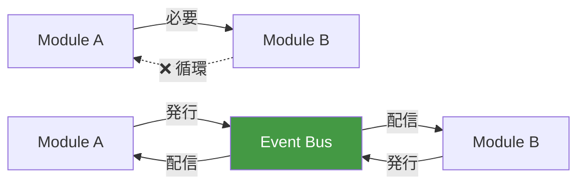

**循環が必要に見える場合の解決手順**

```
1. 責務の分割が誤っていないか疑う（多くはこれ）
2. 共通部分を下位層に切り出せないか検討する
3. どうしても双方向が必要なら Event Bus を挟む
4. それでも解決しない場合、本書の改訂を検討する
```

**⚠️ 「とりあえず相互参照」は禁止。** 一度作ると必ず増える。

## 7.4 型による境界の強制（実装指針）

**DR-3 / DR-4 を規律ではなく型で守る。**

```
概念的な指針（言語非依存）

・L2 の公開型は、L2 内部モジュールと Perception Gateway からのみ import 可能とする
  → パッケージ境界 / モジュール可視性 / Lint ルールのいずれかで強制

・Perception Gateway の戻り値型は Phenomenon に限定し、
  Phenomenon に数値型フィールドを持たせない

・L4 のビルド設定から L2 のパスを解決不能にする
  → 参照した時点でビルドエラー
```

**推奨する検証手段（優先順）**

| 手段 | 強度 | 導入コスト |
|---|---|---|
| ビルド時のモジュール解決禁止 | 最強 | 中 |
| Lint ルール（import 制限） | 強 | 低 |
| CI での依存グラフ検証 | 強 | 中 |
| コードレビュー | 弱 | — |

**⚠️ レビューだけに頼らない。** 長期開発では必ず漏れる。

## 7.5 依存に関する禁止事項

```
❌ グローバル変数・グローバルシングルトンによる暗黙の依存
❌ 「便利だから」という理由での層飛ばし
❌ 循環参照の一時的な許容
❌ 動的 import による静的解析の回避
❌ 型の any / unknown キャストによる境界の突破
❌ デバッグ用コードの本番ビルドへの混入（Simulation の直接参照）
❌ テスト用に境界を緩めること
```

---

# ⑧ State Management

> **目的**: ゲーム全体の状態を分類し、単一の情報源を確立する。
> **責務**: 「この情報はどこにあるか」を一意にする。
> **設計理由**: 状態が複数箇所に散ると、必ず不整合が起きる。本作では不整合が「昨日と今日の差分が読めない」という体験の破壊に直結するため、単一情報源が必須。
> **他システムへの影響**: Save Architecture（⑨）の対象、Error Handling（⑪）の検証対象。

## 8.1 状態の分類

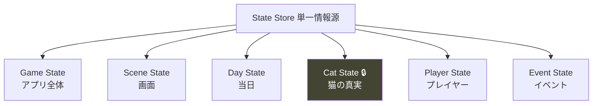

| 状態 | 所有 | 層 | 可視性 |
|---|---|---|---|
| **Game State** | C-03 | L1 | 全層 |
| **Scene State** | C-03 | L1 | L4 中心 |
| **Day State** | C-03 | L1 | 全層 |
| **Cat State** 🔒 | C-03 | L1 保持 / **L2 のみアクセス可** | **L2 限定** |
| **Player State** | C-03 | L1 | L3, L4 |
| **Event State** | C-03 | L1 | L2, L3 |

**⚠️ Cat State は State Store が保持するが、アクセスは L2 に限定する。**
State Store の API レベルで、L3/L4 からの Cat State 取得を不可能にする。

## 8.2 Game State 遷移図

```mermaid
stateDiagram-v2
    [*] --> Booting
    Booting --> Loading: 定義読込
    Loading --> Title: 初期化完了
    Loading --> Error: 読込失敗
    Title --> Preparing: 開始
    Preparing --> Playing: Day1 開始
    Playing --> Playing: Day 進行
    Playing --> Paused: 中断
    Paused --> Playing: 再開
    Playing --> Deciding: Day30 到達
    Deciding --> Ending: 決断確定
    Ending --> Epilogue: 余韻
    Epilogue --> Reflection: 振り返り
    Reflection --> Title: 終了
    Error --> Title: 縮退復旧
    Playing --> Error: 異常検出
    Error --> [*]: 復旧不能
```

## 8.3 Day State 遷移図

```mermaid
stateDiagram-v2
    [*] --> Morning
    Morning --> Free: 朝の確認完了
    Free --> Observing: 観察開始
    Observing --> Free: 観察終了
    Free --> Deciding: 行動選択
    Deciding --> Applying: 決定確定
    Applying --> Free: 適用完了
    Free --> Closing: 1日を終える操作
    Closing --> Simulating: 締切
    Simulating --> Recording: 日次処理完了
    Recording --> Saving: 記録生成完了
    Saving --> [*]: 保存完了 → 翌日へ

    note right of Free
        Segment はここで進行する
        「何もしない」も Deciding を経由する
    end note
```

**⚠️ 「何もしない」も Deciding → Applying を通る。**
特別扱いしない（P-07 禁止事項）ことを、状態遷移レベルで保証する。

## 8.4 Cat State 遷移図 🔒

```mermaid
stateDiagram-v2
    [*] --> Hidden: Day1 到着
    Hidden --> Peeking: 警戒低下
    Peeking --> Hidden: 警戒上昇
    Peeking --> Emerging: 継続的な安定
    Emerging --> Peeking: 驚き
    Emerging --> Present: 環境への慣れ
    Present --> Emerging: 環境変化
    Present --> Approaching: 関係の進展
    Approaching --> Present: 中断
    Present --> Withdrawn: 悪循環
    Approaching --> Withdrawn: 悪循環
    Withdrawn --> Present: 回復
    Withdrawn --> Hidden: 深い後退

    note right of Withdrawn
        必ず回復経路が存在する
        詰み状態は作らない
    end note
```

**⚠️ この図はプレイヤーに開示しない。** 内部の状態機械であり、UIに反映してはならない。
プレイヤーが受け取るのは、各状態で観測される **Phenomenon のみ**。

## 8.5 各状態の保持内容

### Game State

```
現在のゲームフェーズ / 起動からの経過 / 縮退フラグ / スキーマ版
```

### Scene State

```
現在シーン / 遷移中フラグ / 表示中のUI要素 / カメラ構図ID
```

### Day State

```
現在Day / 現在Segment / 当日の決定履歴 / 当日の観測履歴 / Day遷移フェーズ
```

### Cat State 🔒（L2 限定）

```
個体プロファイル参照 / Needs値 / Affect値 / Relationship値
現在Behavior / 行動履歴 / 悪循環カウンタ / 回復進行
```

### Player State

```
Player Knowledge（観測由来の理解） / Record エントリ列
到達段階（観察力・理解力・判断力） / 描写解像度レベル
```

### Event State

```
発火履歴 / クールダウン / 排他グループ状態 / 抑止ログ
```

## 8.6 状態管理の原則

| # | 原則 | 理由 |
|---|---|---|
| **SM-1** | 単一情報源（State Store のみが保持） | 不整合の排除 |
| **SM-2** | 読み取りは不変参照、変更は Command | 意図しない変更の防止 |
| **SM-3** | 状態にロジックを持たせない | テスト容易性 |
| **SM-4** | 状態遷移は明示的に定義し、不正遷移を拒否 | 破綻の早期検出 |
| **SM-5** | **Cat State へのアクセスは L2 に限定** | 憲章 I-1 |
| **SM-6** | 派生値はキャッシュせず、必要時に計算（重い場合のみキャッシュ + 明示的無効化） | 不整合の排除 |
| **SM-7** | 状態変更は必ず通知を伴う | 見落としの防止 |

## 8.7 状態管理の禁止事項

```
❌ モジュールがローカルに状態のコピーを持つ
❌ UI が独自に状態を持ち、State Store と二重管理する
❌ 状態の直接書き換え（外部から可変参照を得る）
❌ L3 / L4 から Cat State を読む
❌ 状態遷移の検証をスキップする
❌ 派生値を状態として保存し、元データと乖離させる
❌ 状態変更を通知せずに行う
```

---

# ⑨ Save Architecture

> **目的**: 保存対象を分類し、セーブの構造・整合性・移行方針を確定する。
> **責務**: 「何を保存し、何を保存しないか」を一意にする。
> **設計理由**: 憲章§9.7 は「通信断でもプレイ継続」「1日単位で確実に保存」を必達とする。同時に Pillar 4 は巻き戻しを禁じる。この2つを同時に満たす構造が必要。
> **他システムへの影響**: Save Data 設計の直接の親仕様。Error Handling（⑪）と密結合。

## 9.1 保存方針

| 項目 | 方針 | 根拠 |
|---|---|---|
| スロット数 | **1つのみ** | Pillar 4 / AP-08 |
| 保存契機 | 自動（Day確定時 + 中間チェックポイント） | 憲章§9.7 |
| 手動セーブ | **なし** | Pillar 4 |
| 手動ロード | **なし** | AP-08 |
| ログイン | **不要** | 憲章§9.7 / AP-83 |
| 保存先 | ローカル（ブラウザ永続領域） | 憲章§9.7 |
| クラウド同期 | 任意・将来拡張 | 必須にしない |

## 9.2 データの三分類

```mermaid
graph TB
    A["全データ"]
    A --> B["保存する<br/>Persisted"]
    A --> C["保存しない<br/>Transient"]
    A --> D["再生成する<br/>Derived"]

    style B fill:#484,color:#fff
    style C fill:#844,color:#fff
    style D fill:#448,color:#fff
```

### 保存する（Persisted）

| データ | 理由 |
|---|---|
| スキーマ版 | マイグレーション |
| RNG シード + ストリーム位置 | 再現性（G-3） |
| 現在 Day / Segment | 進行 |
| Cat State（全項目） | 猫の真実 |
| Environment 配置状態 | 部屋・家具・アイテム |
| Trace リスト | 痕跡 |
| 観測履歴 | Player Knowledge の再構築元 |
| Record エントリ列 | 記録（追記のみ） |
| Decision 履歴 | 記録・振り返り |
| Event State（発火履歴・クールダウン） | 再発火防止 |
| Scenario 進行 | 文脈 |
| Internal Metrics | 憲章§11.2 の指標 |
| Settings | 設定 |

### 保存しない（Transient）

| データ | 理由 |
|---|---|
| Phenomenon | 都度生成される |
| Representation（表示文字列） | 言語変更で変わる |
| UI 状態 | 再構築可能 |
| カメラ状態 | 再構築可能 |
| 再生中の演出・音 | 復元しても意味がない |
| Content Definition | 起動時に読み込む |
| Event Bus キュー | 保存すると再入の危険 |

### 再生成する（Derived）

| データ | 再生成元 | 理由 |
|---|---|---|
| Player Knowledge | 観測履歴 | 二重管理の排除 |
| 描写解像度レベル | Player Knowledge | 同上 |
| Environment 評価キャッシュ | 配置状態 | 同上 |
| Room 領域グラフ | 部屋定義 + 家具配置 | 同上 |
| 到達段階 | Player Knowledge | 同上 |

**⚠️ 派生データを保存しない理由**

```
派生データを保存すると、元データとの乖離が起きうる。
乖離は「昨日と今日で理解度が違う」という体験の破綻を生む。
再生成コストは小さい（30日分の観測履歴は軽量）。
```

## 9.3 セーブデータ構造（概念）

```
SaveData {
  meta {
    schemaVersion    // マイグレーション用
    savedAt          // 保存時刻
    checksum         // 整合性検証
    buildVersion     // 診断用
  }
  determinism {
    seed             // 個体・イベントの決定
    streamPositions  // 各 RNG ストリームの位置
  }
  progress {
    day, segment, dayPhase
  }
  simulation {
    cat { profile参照, needs, affect, relationship, behavior, history }
    environment { room, furniture[], items[] }
    traces[]
    scenario { ... }
  }
  perception {
    observationLog[]   // Player Knowledge の再生成元
  }
  player {
    records[]          // 追記のみ
    decisions[]
  }
  events {
    fired[], cooldowns, suppressed[]
  }
  metrics { ... }
}
```

**⚠️ `perception` に理解度そのものを保存しない。** 観測ログのみを保存し、理解度は再生成する。

## 9.4 保存契機

```mermaid
flowchart LR
    A[Day 確定] -->|"完全保存"| S[(Save)]
    B[Segment 進行] -->|"チェックポイント"| S
    C[環境変更適用] -->|"チェックポイント"| S
    D[記録追加] -->|"チェックポイント"| S
    E[設定変更] -->|"設定のみ"| S
    F[ページ離脱検知] -->|"緊急保存"| S
```

| 契機 | 範囲 | 同期性 |
|---|---|---|
| Day 確定 | 完全保存 | 完了を待つ |
| Segment 進行 | 差分 | 非同期 |
| 環境変更 | 差分 | 非同期 |
| 記録追加 | 差分 | 非同期 |
| 設定変更 | 設定のみ | 非同期 |
| ページ離脱 | 完全保存 | 同期（可能な限り） |

**⚠️ 保存が体験を止めてはならない**（⑤5.5）。Day 確定時以外は非同期。

## 9.5 整合性検証

```mermaid
flowchart TD
    A[復元開始] --> B{スキーマ版}
    B -->|古い| C[マイグレーション]
    B -->|同じ| D[チェックサム検証]
    B -->|新しい| E[復元不可 → 新規開始の確認]
    C --> D
    D -->|NG| F[Error Recovery]
    D -->|OK| G[構造検証]
    G -->|NG| F
    G -->|OK| H[参照整合性検証]
    H -->|NG| F
    H -->|OK| I[復元完了]
    F --> J{部分復旧可能}
    J -->|Yes| K[縮退復元 + 通知]
    J -->|No| L[新規開始の提案]
```

### 検証項目

```
□ スキーマ版が読み込み可能か
□ チェックサムが一致するか
□ 必須フィールドが存在するか
□ Day が 0〜30 の範囲か
□ 参照ID（家具定義・個体定義）が解決可能か
□ 観測履歴の時系列が単調か
□ Record が追記のみか（改竄検出）
□ RNG ストリーム位置が妥当か
```

## 9.6 マイグレーション方針

| 変更種別 | 対応 |
|---|---|
| フィールド追加 | 既定値で補完 |
| フィールド削除 | 無視 |
| フィールド名変更 | マイグレーション関数で変換 |
| 意味変更 | **マイグレーション関数必須**。曖昧な場合は変換しない |
| 定義ID削除 | 参照解決失敗 → 縮退（該当要素を除外） |

**⚠️ マイグレーションは一方向のみ。** 古い版へのダウングレードは提供しない。

## 9.7 セーブの禁止事項

```
❌ 複数スロットの提供（Pillar 4 / AP-08）
❌ 手動セーブ / 手動ロード
❌ セーブデータの編集画面
❌ 保存失敗の無言の握りつぶし
❌ 派生データの保存
❌ 表示テキストの保存（言語変更で破綻）
❌ Content Definition の保存（更新で乖離）
❌ 保存中の体験停止（Day 確定時を除く）
❌ ログイン必須化（AP-83）
❌ 保存データを外部に自動送信（AP-86）
```

---

# ⑩ Extensibility

> **目的**: 将来の追加が設計変更を伴わない構造を確立する。
> **責務**: 「何を追加するときに、どこを触ればよいか」を定義する。
> **設計理由**: 憲章§14.2 は「増やすより深める」を作法とする。しかし深めることも実装上は追加である。追加のコストを下げないと、深化の提案が実装コストを理由に却下される。
> **他システムへの影響**: Content Definition Registry の設計が全拡張の土台。

## 10.1 拡張の原則

```mermaid
graph LR
    A["拡張したい"] --> B{"データで足りるか"}
    B -->|Yes| C["定義追加のみ<br/>コード変更ゼロ"]
    B -->|No| D{"既存の仕組みの組合せか"}
    D -->|Yes| E["定義 + 少量の合成ルール"]
    D -->|No| F{"新しい概念か"}
    F -->|Yes| G["本書の改訂を検討"]
    F -->|No| H["設計を再考"]

    style C fill:#484,color:#fff
    style G fill:#844,color:#fff
```

**目標：追加の 80% を「定義追加のみ」で完了させる。**

## 10.2 拡張対象と影響範囲

| 追加するもの | 定義のみ | 合成ルール | コード | 本書改訂 |
|---|:---:|:---:|:---:|:---:|
| **新しい猫（個体）** | ✅ | — | — | — |
| **新しい家具** | ✅ | — | — | — |
| **新しいアイテム** | ✅ | — | — | — |
| **新しい痕跡種別** | ✅ | 🔶 | — | — |
| **新しい現象語彙** | ✅ | — | — | — |
| **新しい描写文** | ✅ | — | — | — |
| **新しいイベント** | ✅ | 🔶 | — | — |
| **新しい部屋** | ✅ | 🔶 | — | — |
| **新しいシナリオ** | ✅ | 🔶 | — | — |
| **季節・時期の概念** | — | ✅ | 🔶 | — |
| **新しい観察の次元** | — | — | ✅ | 🔶 |
| **複数個体の同時飼育** | — | — | ✅ | ✅ |

## 10.3 個体（猫）の拡張

**最も重要な拡張軸。** 憲章§14.3 により、個体数を増やしても1周のプレイ時間は変えない。

```
CatProfile 定義（データ）
├── 性格パラメータ群         ← 数値。非公開
├── 行動傾向テーブル         ← 状況 → 行動の重み
├── 環境選好                 ← 空間条件 → 選好の重み
├── 反応閾値                 ← 音・動き・距離
├── 学習ライン割当           ← どの気づきが得られるか
└── Phenomenon 割当          ← 観測される現象のセット
```

**⚠️ 新しい個体を追加しても、以下は変わらない。**

```
□ コアループ
□ 観察の仕組み
□ 学習ラインの構造
□ 30日という長さ
□ Phenomenon の語彙（新規追加は可、既存の変更は不可）
```

## 10.4 現象語彙の拡張

**Phenomenon Registry は追記専用（append-only）とする。**

| 操作 | 可否 | 理由 |
|---|---|---|
| 新語彙の追加 | ✅ | 拡張の基本 |
| 既存語彙の表示文変更 | ✅ | 表現の改善 |
| 既存語彙の意味変更 | ❌ | 既存セーブとの乖離 |
| 既存語彙の削除 | ❌ | 観測履歴の参照が壊れる |
| 語彙IDの再利用 | ❌ | 同上 |

## 10.5 イベントの拡張

**イベントはデータ駆動とし、コードにハードコードしない。**

```
EventDefinition {
  id
  trigger      // 条件式（データ）
  priority     // 優先度
  exclusion    // 排他グループ
  cooldown     // クールダウン
  effects[]    // Command の列（データ）
  constraints  // Day帯 / 発火上限
}
```

**⚠️ effects は Simulation への Command のみ。**
イベントが直接 Simulation 状態を書き換える実装は禁止（S-13 禁止事項）。

## 10.6 季節・時期の拡張（将来）

30日固定（憲章§14.3）は変えない。変えられるのは**文脈**である。

```
Season 定義（将来）
├── 環境条件の修飾（温度・光量・日照時間）
├── 猫の行動傾向の修飾
└── 描写の修飾
```

**設計要件**: Environment System が「基準条件 + 修飾」の構造を持つこと。
初期実装で修飾レイヤーを用意しておけば、季節追加は定義のみで済む。

## 10.7 拡張を阻害する設計（避けるべき）

```
❌ 個体の性格をコードの if 文で分岐する
❌ 家具のIDをコードに直接書く
❌ イベント条件をコードにハードコードする
❌ 描写文をコードに埋め込む
❌ 部屋の構造を固定サイズの配列で持つ
❌ Phenomenon を enum で固定し、追加時に全箇所修正が必要になる
❌ 学習ラインの本数を定数で固定する
❌ 30日を前提とした固定長配列
```

## 10.8 拡張時の必須検証

新規コンテンツ追加時、以下を必ず通す。

```
□ Content Definition のスキーマ検証を通過するか
□ 既存セーブデータが引き続き復元できるか
□ Phenomenon 語彙の参照がすべて解決するか
□ 憲章の不可侵条項に抵触しないか（Experience Bible ⑬）
□ Anti Pattern（AP-01〜AP-100）に該当しないか
□ Player Flow の Dead End を新たに生まないか
```

---

# ⑪ Error Handling

> **目的**: 異常時にも体験と進行を守る方針を確定する。
> **責務**: 「壊れたときに何を優先して守るか」を定義する。
> **設計理由**: 本作は Pillar 4（30日は戻らない）により、進行の喪失が体験の全否定になる。したがって**進行の保護が最優先**であり、機能の完全性は二の次である。
> **他システムへの影響**: Save Architecture と密結合。Technical Design の可用性要件。

## 11.1 守るべきものの優先順位

```
1. プレイヤーの進行（Day、記録、観測履歴）
2. データの整合性
3. 体験の連続性（静けさを壊さない）
4. 機能の完全性
5. パフォーマンス
```

**⚠️ 4 と 5 を守るために 1 を犠牲にしない。**

## 11.2 異常の分類と対処

| 分類 | 例 | 深刻度 | 対処 |
|---|---|---|---|
| **E-1 定義データ欠損** | 家具定義が見つからない | 中 | 該当要素を除外して継続。ログ |
| **E-2 定義データ不正** | スキーマ違反 | 高 | 起動時に検出し、起動を中止 |
| **E-3 セーブ破損** | チェックサム不一致 | 最高 | 縮退復元 → 不能なら新規提案 |
| **E-4 セーブ書込失敗** | 容量不足・権限 | 最高 | リトライ → 通知 → 進行を止めない |
| **E-5 状態不整合** | 不正な状態遷移 | 高 | 遷移を拒否し、直前の正常状態を維持 |
| **E-6 イベント競合** | 相互に前提を壊す | 中 | 後発を破棄。ログ |
| **E-7 参照解決失敗** | Phenomenon 語彙が未定義 | 中 | フォールバック語彙。ログ |
| **E-8 演出・音の失敗** | アセット読込失敗 | 低 | 無音・無演出で継続 |
| **E-9 描画性能低下** | フレーム落ち | 低 | 演出の簡略化 |
| **E-10 予期しない例外** | 未捕捉エラー | 高 | 状態保存 → 安全な画面へ |

## 11.3 セーブ破損時のフロー

```mermaid
flowchart TD
    A[復元試行] --> B{メインデータ}
    B -->|OK| Z[正常復元]
    B -->|NG| C{バックアップ}
    C -->|あり・OK| D[バックアップから復元 + 通知]
    C -->|なし・NG| E{部分復旧可能}
    E -->|Yes| F[縮退復元]
    E -->|No| G[新規開始の提案]
    F --> H[復旧内容の説明 + 継続]
    D --> Z
    H --> Z
    G --> I{プレイヤーの選択}
    I -->|新規| J[新規開始]
    I -->|中止| K[終了]
```

### バックアップ方針

```
・直近のDay確定時のセーブを、1世代だけ保持する
・メイン書込成功後に、前回分をバックアップへ移す
・バックアップは1世代のみ（Pillar 4：巻き戻しの手段にしない）
```

**⚠️ バックアップを「前の日に戻る手段」として提供してはならない**（AP-08）。
プレイヤーから見えない、破損時のみの内部的な保険である。

### 縮退復元の範囲

| 復旧可能 | 復旧不能 |
|---|---|
| Player Knowledge（観測履歴から再生成） | Cat State（真実） |
| Environment 評価（配置から再生成） | 観測履歴 |
| 描写解像度（Knowledge から再生成） | Record エントリ |
| Room 領域グラフ（定義から再生成） | Day 進行 |

**復旧不能なデータが失われた場合、縮退復元は行わない。**
中途半端な状態で続けるより、明確に伝えて選ばせるほうが誠実である。

## 11.4 プレイヤーへの伝え方

**エラーメッセージも本作の表現である。憲章§10.2 の語彙統制が適用される。**

| ❌ 使わない | ✅ 使う |
|---|---|
| 「エラーが発生しました」 | 「うまく読み込めませんでした」 |
| 「データが破損しています」 | 「記録の一部が読み取れませんでした」 |
| 「保存に失敗しました」 | 「まだ保存できていません。もう一度試します」 |
| 技術的なエラーコードの露出 | 診断用に内部ログのみ |
| プレイヤーの操作を責める表現 | 状況の説明のみ |

**⚠️ エラー表示でプレイヤーを不安にさせない**（C-09 禁止事項）。

## 11.5 開発時のデバッグ経路

**開発ビルド限定で、Simulation の真実を可視化するデバッグビューを許可する。**

```
条件（すべて必須）
□ 本番ビルドから完全に除去される（ビルド時に削除）
□ 通常のUI経路とは別モジュールとして実装する
□ デバッグ経路が Simulation の状態を変更しない（読み取り専用）
□ デバッグ用に L4 → L2 の依存を作らない
   → デバッグビューは L2 と同層または専用層に置く
```

**⚠️ 「デバッグ用だから」を理由に DR-3 を緩めない。**
一度緩めると本番に漏れる。デバッグビューは**別の層に置く**ことで解決する。

## 11.6 エラー処理の禁止事項

```
❌ 例外の握りつぶし（catch して何もしない）
❌ エラー時に進行を巻き戻す（Pillar 4）
❌ エラー時に自動でリセットする
❌ 技術的詳細をプレイヤーに見せる
❌ エラーの原因をプレイヤーの操作のせいにする
❌ 復旧不能を「復旧できました」と偽る
❌ エラーログを残さない
❌ デバッグコードの本番混入
```

---

# ⑫ Performance

> **目的**: Webブラウザゲームとしての性能方針を確定する。
> **責務**: 「どこに性能予算を使い、どこを削るか」を定義する。
> **設計理由**: 憲章§9.7 は「インストール不要」「短時間で Day 1 到達」「通信断でも継続」を必達とする。同時に Pillar 6（静けさ）は演出負荷が低いことを意味し、性能面では有利に働く。この有利を活かす。
> **他システムへの影響**: Technical Design の性能要件。アセット制作の上限。

## 12.1 本作の性能特性

```mermaid
graph LR
    A["静けさの設計<br/>Pillar 6"] --> B["演出が少ない"]
    B --> C["描画負荷が低い"]
    A --> D["カメラが動かない"]
    D --> E["再描画が少ない"]
    F["実時間非連動<br/>AP-17"] --> G["常時シミュレーション不要"]
    G --> H["CPU 負荷が低い"]
    C --> I["性能予算を<br/>ロード時間と<br/>アセット品質に配分"]
    E --> I
    H --> I
```

**本作は性能的に極めて有利なジャンルである。**
浮いた予算は**初回ロードの短縮**と**静けさを支えるアセット品質**に回す。

## 12.2 性能予算の配分方針

| 領域 | 優先度 | 方針 |
|---|---|---|
| **初回ロード時間** | 最高 | 憲章§9.7。離脱の最大要因 |
| **入力応答性** | 高 | 観察の心地よさに直結 |
| **描画の安定性** | 高 | 静けさの中では乱れが目立つ |
| **アセット品質** | 中 | 静止画の質が体験を支える |
| **描画フレームレート上限** | 低 | 高レートは不要 |
| **シミュレーション速度** | 低 | Segment / Day 粒度でしか動かない |

## 12.3 ロード戦略

```mermaid
flowchart TD
    A[起動] --> B["Critical: 最小起動セット<br/>タイトル + 初期定義"]
    B --> C[タイトル表示]
    C --> D["Preload: Day1-5 に必要なもの"]
    D --> E[Day 1 開始可能]
    E --> F["Lazy: Day帯ごとの追加アセット"]
    F --> G["Idle: 先読み"]
```

| 段階 | 内容 | 目標 |
|---|---|---|
| **Critical** | タイトル表示に必要な最小限 | 最短 |
| **Preload** | Day 1-5 の体験に必要なもの | タイトル表示中に完了 |
| **Lazy** | Day帯ごとの追加分 | 使用前に完了 |
| **Idle** | 先読み | 体験を妨げない |

**⚠️ 具体的な秒数・容量目標は Technical Design で定義する**（憲章§9.7 の方針に従う）。

## 12.4 更新頻度の設計

| 粒度 | 頻度 | 負荷 |
|---|---|---|
| Frame | 描画レート | 低（静的な画面） |
| **Tick** | **観察中のみ** | 低〜中 |
| Segment | 1日数回 | 中 |
| Day | 1日1回 | 中〜高（許容） |

**⚠️ 最大の負荷は Day 確定時である。**
ここは体験上「1日が終わる」区切りであり、多少の処理時間が許容される。
**逆に Tick は観察の心地よさに直結するため、最も軽量でなければならない。**

## 12.5 キャッシュ方針

| 対象 | キャッシュ | 無効化 |
|---|---|---|
| Environment 評価 | ✅ | 配置変更時 |
| Room 領域グラフ | ✅ | 家具変更時 |
| Phenomenon 変換結果 | ✅（Tick 内） | Tick 境界 |
| 描写テキスト | ✅ | 言語変更時・解像度変更時 |
| Content Definition | ✅（起動時のみ） | なし |
| Player Knowledge 派生値 | ✅ | 観測追加時 |

**⚠️ キャッシュは必ず明示的な無効化とセットで実装する。**
時間ベースの自動失効は、再現性（G-3）を壊す。

## 12.6 メモリ方針

| 対象 | 方針 |
|---|---|
| Trace | 減衰により自動的に上限が保たれる（S-11） |
| 観測履歴 | 30日分。軽量な構造体で保持 |
| Record | 追記のみ。30日分で上限が読める |
| Event 発火履歴 | 30日分 |
| アセット | Day帯を過ぎたものは解放可能に |

**⚠️ 無制限に増える配列を作らない。**
30日という上限があるため、設計時に最大量を見積もれる。見積もること。

## 12.7 性能に関する禁止事項

```
❌ 毎フレームでの Simulation 更新
❌ 実時間による猫の状態変化（AP-17）
❌ 観察していない時の Perception Gateway 呼び出し
❌ 毎フレームでの文字列生成・整形
❌ 無効化のないキャッシュ
❌ 時間ベースのキャッシュ失効（再現性の破壊）
❌ 無制限に増える配列・ログ
❌ 起動時の全アセット読込
❌ 演出の追加による Pillar 6 の破壊（性能以前の問題）
❌ パフォーマンスのために観測情報を削る（Pillar 1 の破壊）
```

---

# ⑬ Anti Architecture

> **目的**: 避けるべき設計を網羅的に列挙し、判断コストを消す。
> **責務**: レビューで「なぜ駄目か」を毎回説明する必要をなくす。
> **設計理由**: アーキテクチャの劣化は、個々には合理的に見える判断の積み重ねで起きる。事前にリスト化しておけば、議論は「該当するか」で終わる。
> **他システムへの影響**: 全設計・全実装のレビュー基準。⑭の根拠。

## 凡例

```
🔴 憲章違反に直結  🟠 アーキテクチャの破壊  🟡 保守性の劣化
```

---

## A. 観測境界の違反（AA-01〜AA-12）★最重要

| # | アンチパターン | 度 | 理由 |
|---|---|---|---|
| AA-01 | UI が Simulation を直接参照する | 🔴 | 憲章 I-1。数値が漏れる |
| AA-02 | Perception Gateway をバイパスする経路を作る | 🔴 | 境界の意味が消える |
| AA-03 | Phenomenon に数値フィールドを持たせる | 🔴 | 憲章 I-1。型で防ぐべき |
| AA-04 | Event に Truth を載せて L3 以上へ配信する | 🔴 | 境界のすり抜け |
| AA-05 | State Store が L4 に Cat State を公開する | 🔴 | 憲章 I-1 |
| AA-06 | Gateway が「解釈」を返す | 🔴 | Pillar 2。答えを教えている |
| AA-07 | Player Knowledge が Simulation を参照する | 🔴 | G-2。答え合わせが可能になる |
| AA-08 | 「正解との一致度」を計算する | 🔴 | Pillar 2 |
| AA-09 | デバッグ用に L4 → L2 の依存を追加する | 🔴 | 本番に漏れる |
| AA-10 | テスト用に境界を緩める | 🔴 | 緩めた境界は戻らない |
| AA-11 | ログ出力に Truth を含め、それをUIに出す | 🔴 | 抜け道 |
| AA-12 | 数値を文字列化して Phenomenon に載せる | 🔴 | 明確な脱法行為 |

## B. 依存関係（AA-13〜AA-24）

| # | アンチパターン | 度 | 理由 |
|---|---|---|---|
| AA-13 | 循環参照を「一時的に」許容する | 🟠 | 恒久化する |
| AA-14 | グローバルシングルトンによる暗黙依存 | 🟠 | テスト不能・依存が見えない |
| AA-15 | 神クラス（Game Manager が全部持つ） | 🟠 | 変更の影響範囲が無限 |
| AA-16 | 下位層が上位層の型を知る | 🟠 | 逆流。再利用不能 |
| AA-17 | 層飛ばし（L4 → L2） | 🔴 | AA-01 と同根 |
| AA-18 | 動的 import で静的解析を回避 | 🟠 | 検証が効かなくなる |
| AA-19 | any / unknown キャストで境界突破 | 🟠 | 型の保証が無意味に |
| AA-20 | Simulation 内モジュールの相互直接参照 | 🟠 | 更新順序が崩れる |
| AA-21 | UI が他の UI モジュールを直接呼ぶ | 🟡 | 画面間の結合 |
| AA-22 | Core が Simulation の概念を知る | 🟠 | 再利用不能 |
| AA-23 | Data 層がロジックを持つ | 🟠 | 定義と実装の混在 |
| AA-24 | 依存の検証を人力レビューのみに頼る | 🟠 | 必ず漏れる |

## C. 状態管理（AA-25〜AA-36）

| # | アンチパターン | 度 | 理由 |
|---|---|---|---|
| AA-25 | 状態を複数箇所で保持する | 🟠 | 不整合。差分が読めなくなる |
| AA-26 | UI が独自の状態を持ち二重管理 | 🟠 | 同上 |
| AA-27 | 状態変更中の再入を許容する | 🟠 | 非決定的な結果 |
| AA-28 | 可変参照を外部に渡す | 🟠 | どこで変わったか追えない |
| AA-29 | 状態にビジネスロジックを持たせる | 🟡 | テスト困難 |
| AA-30 | 不正な状態遷移を黙って受理する | 🟠 | 破綻の遅延検出 |
| AA-31 | 派生値を状態として保存する | 🟠 | 元データと乖離 |
| AA-32 | 状態変更を通知せずに行う | 🟠 | 見落とし |
| AA-33 | 状態のスナップショットを取らずに複雑な変更を行う | 🟡 | 巻き戻せない（デバッグ困難） |
| AA-34 | 状態の初期値を各所に散在させる | 🟡 | 初期化漏れ |
| AA-35 | 状態遷移図を文書化しない | 🟡 | 実装が正解になる |
| AA-36 | Cat State を L3/L4 が読む | 🔴 | 憲章 I-1 |

## D. 時間・更新（AA-37〜AA-46）

| # | アンチパターン | 度 | 理由 |
|---|---|---|---|
| AA-37 | 各モジュールが独自に時間を数える | 🟠 | 時間の不整合 |
| AA-38 | 実時間で Simulation を回す | 🟠 | AP-17。監視義務感 |
| AA-39 | Frame で Simulation を更新する | 🟠 | 負荷・非決定性 |
| AA-40 | 更新順序が実行ごとに変わる | 🔴 | 再現性の破壊（G-3） |
| AA-41 | 更新中に別粒度の更新を再入させる | 🟠 | 状態の不整合 |
| AA-42 | 時間を巻き戻す API を提供する | 🔴 | Pillar 4 / AP-08 |
| AA-43 | Save を Day 確定より前に行う | 🟠 | 不整合な保存 |
| AA-44 | Perception を Simulation より先に更新する | 🟠 | 古い真実を観測する |
| AA-45 | 更新順序を暗黙の呼び出し順に依存させる | 🟠 | リファクタで壊れる |
| AA-46 | Tick を重くする | 🟡 | 観察の心地よさの劣化 |

## E. イベント（AA-47〜AA-56）

| # | アンチパターン | 度 | 理由 |
|---|---|---|---|
| AA-47 | イベント名を文字列リテラルで散在させる | 🟡 | タイポ・追跡不能 |
| AA-48 | 配信順序が非決定的 | 🔴 | 再現性の破壊 |
| AA-49 | 同期配信中の再入 | 🟠 | 無限ループ |
| AA-50 | 購読解除漏れ | 🟠 | リーク・多重実行 |
| AA-51 | イベントで状態を直接書き換える | 🟠 | Command 経由の原則違反 |
| AA-52 | 競合を無言で破棄する | 🟠 | 再現不能なバグ |
| AA-53 | イベントチェーンが長く追跡不能 | 🟡 | デバッグ困難 |
| AA-54 | すべてをイベント化する | 🟡 | 制御フローが読めない |
| AA-55 | イベントに副作用の順序依存がある | 🟠 | 脆い設計 |
| AA-56 | モーダルな割り込みで体験を止める | 🟠 | Pillar 6 |

## F. データ設計（AA-57〜AA-68）

| # | アンチパターン | 度 | 理由 |
|---|---|---|---|
| AA-57 | 個体の性格をコードの分岐で表現する | 🟠 | 拡張不能 |
| AA-58 | 家具・アイテムIDをコードに直書き | 🟠 | 同上 |
| AA-59 | イベント条件をハードコード | 🟠 | 同上 |
| AA-60 | 描写文をコードに埋め込む | 🟠 | 多言語化不能 |
| AA-61 | Phenomenon を enum で固定 | 🟡 | 追加時に全箇所修正 |
| AA-62 | 30日を前提とした固定長配列 | 🟡 | 変更時に破綻 |
| AA-63 | 定義データの実行時書き換え | 🟠 | 不変性の破壊 |
| AA-64 | スキーマ検証なしの定義読込 | 🟠 | 実行時に初めて壊れる |
| AA-65 | 家具に「効果値」を持たせる | 🔴 | Pillar 3・憲章 I-1 |
| AA-66 | 「良い配置スコア」を算出する | 🔴 | 原則3（正解は一つではない） |
| AA-67 | 現象語彙の意味を後から変更する | 🟠 | 既存セーブとの乖離 |
| AA-68 | 語彙IDを再利用する | 🟠 | 観測履歴の破壊 |

## G. セーブ（AA-69〜AA-78）

| # | アンチパターン | 度 | 理由 |
|---|---|---|---|
| AA-69 | 複数セーブスロット | 🔴 | Pillar 4 / AP-08 |
| AA-70 | 手動セーブ・手動ロード | 🔴 | 同上 |
| AA-71 | バックアップを巻き戻し手段として提供 | 🔴 | 同上 |
| AA-72 | 派生データを保存する | 🟠 | 乖離 |
| AA-73 | 表示テキストを保存する | 🟠 | 言語変更で破綻 |
| AA-74 | Content Definition を保存する | 🟠 | 更新で乖離 |
| AA-75 | 保存失敗を握りつぶす | 🔴 | 進行喪失 |
| AA-76 | チェックサム検証なし | 🟠 | 破損の見逃し |
| AA-77 | マイグレーション関数なしのスキーマ変更 | 🟠 | 既存セーブの破壊 |
| AA-78 | 保存処理で体験を止める（Day確定時以外） | 🟡 | Pillar 6 |

## H. UI・表現（AA-79〜AA-88）

| # | アンチパターン | 度 | 理由 |
|---|---|---|---|
| AA-79 | UI がゲームロジックを判定する | 🟠 | ロジックの散在 |
| AA-80 | UI が数値を表示できる構造 | 🔴 | 憲章 I-1 |
| AA-81 | 「クリックで情報ウィンドウ」実装 | 🔴 | AP-33 / Pillar 1 |
| AA-82 | 観察情報を一度に全部返す API | 🔴 | 同上 |
| AA-83 | 通知バッジ・未読カウンタの実装 | 🟠 | AP-28 |
| AA-84 | 進捗率・達成率の算出機能 | 🔴 | AP-27 |
| AA-85 | 「おすすめ行動」の算出機能 | 🔴 | AP-31 |
| AA-86 | ヒント表示機能 | 🔴 | AP-32 |
| AA-87 | チュートリアルの説明表示機能 | 🔴 | AP-29 / Player Flow T-1 |
| AA-88 | 実績・トロフィーの枠だけ用意する | 🔴 | 必ず埋められる |

## I. 拡張性（AA-89〜AA-95）

| # | アンチパターン | 度 | 理由 |
|---|---|---|---|
| AA-89 | 追加のたびに既存コードの修正が必要 | 🟠 | 拡張性の欠如 |
| AA-90 | 新規個体の追加にコード変更が必要 | 🟠 | 同上 |
| AA-91 | 修飾レイヤーのない Environment 設計 | 🟡 | 季節等の追加が困難 |
| AA-92 | 学習ライン数を定数固定 | 🟡 | 拡張困難 |
| AA-93 | 部屋を単一固定と仮定した実装 | 🟡 | 同上 |
| AA-94 | 「後で必要になるかも」で空の枠を作る | 🟠 | 必ず埋められる |
| AA-95 | 拡張のために境界を緩める | 🔴 | 憲章保証の喪失 |

## J. パフォーマンス（AA-96〜AA-102）

| # | アンチパターン | 度 | 理由 |
|---|---|---|---|
| AA-96 | 毎フレームでの文字列生成 | 🟡 | GC 負荷 |
| AA-97 | 無効化のないキャッシュ | 🟠 | 不整合 |
| AA-98 | 時間ベースのキャッシュ失効 | 🔴 | 再現性の破壊 |
| AA-99 | 無制限に増える配列・ログ | 🟠 | メモリリーク |
| AA-100 | 起動時の全アセット読込 | 🟠 | 初回離脱 |
| AA-101 | 性能のために観測情報を削る | 🔴 | Pillar 1 |
| AA-102 | 性能のために演出を足す（逆説的） | 🟡 | Pillar 6 |

## K. エラー処理（AA-103〜AA-109）

| # | アンチパターン | 度 | 理由 |
|---|---|---|---|
| AA-103 | 例外の握りつぶし | 🟠 | 原因不明のバグ |
| AA-104 | エラー時の自動リセット | 🔴 | Pillar 4・進行喪失 |
| AA-105 | 技術的詳細のプレイヤーへの露出 | 🟡 | 体験の毀損 |
| AA-106 | エラー文言でプレイヤーを責める | 🔴 | 憲章 I-10 |
| AA-107 | 復旧不能を復旧できたと偽る | 🟠 | 信頼の毀損 |
| AA-108 | エラーログを残さない | 🟠 | 診断不能 |
| AA-109 | デバッグコードの本番混入 | 🔴 | 境界の漏洩 |

## L. 保守・プロセス（AA-110〜AA-118）

| # | アンチパターン | 度 | 理由 |
|---|---|---|---|
| AA-110 | アーキテクチャ図と実装の乖離を放置 | 🟠 | 図が信用されなくなる |
| AA-111 | 責務の曖昧なモジュールを作る | 🟠 | 肥大化 |
| AA-112 | 「とりあえずここに置く」実装 | 🟠 | 責務の崩壊 |
| AA-113 | モジュールの禁止事項を書かない | 🟠 | 憲章違反の温床 |
| AA-114 | 依存検証を CI に入れない | 🟠 | 劣化の検出遅れ |
| AA-115 | 命名が層・責務を反映しない | 🟡 | 誤配置 |
| AA-116 | テストが境界をまたぐ | 🟡 | 脆いテスト |
| AA-117 | 決定の記録を残さない | 🟡 | 同じ議論の再発 |
| AA-118 | 上位文書を参照せずに設計する | 🔴 | 憲章違反 |

## M. 憲章由来の構造的禁止（AA-119〜AA-126）

| # | アンチパターン | 度 | 理由 |
|---|---|---|---|
| AA-119 | 経験値・レベルのデータ構造を持つ | 🔴 | 憲章 I-3 |
| AA-120 | 好感度・懐き度という名前の変数を持つ | 🔴 | 憲章 I-1。名前が実装を導く |
| AA-121 | 猫への直接命令 API を持つ | 🔴 | 憲章 I-2 |
| AA-122 | ゲームオーバー判定を持つ | 🔴 | 憲章 I-4 |
| AA-123 | 課金・確率抽選の仕組みを持つ | 🔴 | 憲章 I-5 |
| AA-124 | 猫への加害操作を表現可能にする | 🔴 | 憲章 I-6 |
| AA-125 | 猫の性格を実行中に変更する | 🔴 | Pillar 5 |
| AA-126 | 回復不能な関係状態を作る | 🔴 | 詰みの禁止 |

**合計 126 項目**

---

# ⑭ Architecture Checklist

> **目的**: アーキテクチャ品質を YES/NO で検証可能にする。
> **責務**: 設計レビュー・実装レビュー・CI 検証の基準を提供する。
> **設計理由**: アーキテクチャの劣化は緩やかに進む。定期的な機械的検証がなければ気づけない。
> **他システムへの影響**: 全設計レビューのゲート。CI パイプラインの検証項目。

## 使い方

```
★ = 必須。1つでもNOなら実装を止めて修正
   = 推奨。3つ以上NOなら該当領域を見直す
```

---

## A群: 観測境界（AQ001〜AQ016）★最重要

```
□ AQ001 ★ L4 から L2 への参照がゼロか（静的解析で検証済みか）
□ AQ002 ★ Perception Gateway 以外に L2 → L3 の出口がないか
□ AQ003 ★ Phenomenon 型に数値フィールドが存在しないか
□ AQ004 ★ Phenomenon 型に Simulation 型への参照がないか
□ AQ005 ★ Gateway の戻り値型が Phenomenon に限定されているか
□ AQ006 ★ Event に Truth を載せて L3 以上へ配信していないか
□ AQ007 ★ State Store が L3/L4 に Cat State を公開していないか
□ AQ008 ★ Player Knowledge が Simulation を import していないか
□ AQ009 ★ 「正解との一致度」を計算する箇所が存在しないか
□ AQ010 ★ Gateway が「解釈」ではなく「現象」のみを返すか
□ AQ011 ★ 数値を文字列化して境界を越える箇所がないか
□ AQ012 ★ デバッグビューが L4 → L2 の依存を作っていないか
□ AQ013 ★ デバッグコードが本番ビルドから除去されるか
□ AQ014 ★ テスト用に境界を緩めていないか
□ AQ015    ログ出力に Truth を含む場合、UIに到達しない経路か
□ AQ016    境界違反を検出する自動テストが存在するか
```

## B群: 依存関係（AQ017〜AQ030）

```
□ AQ017 ★ 循環参照がゼロか（静的解析で検証済みか）
□ AQ018 ★ 下位層が上位層を参照していないか
□ AQ019 ★ 依存規則が Lint / ビルド設定で強制されているか
□ AQ020 ★ 依存検証が CI に組み込まれているか
□ AQ021 ★ 動的 import による静的解析の回避がないか
□ AQ022 ★ any / unknown キャストによる境界突破がないか
□ AQ023 ★ Core が Simulation の型を知らないか
□ AQ024 ★ Data 層が誰も参照していないか
□ AQ025    Simulation 内モジュールが相互に直接参照していないか
□ AQ026    同層内の相互参照が Event Bus 経由か
□ AQ027    グローバルシングルトンによる暗黙依存がないか
□ AQ028    Game Manager が神クラス化していないか
□ AQ029    各モジュールの依存先が本書の定義と一致するか
□ AQ030    依存グラフが図と一致するか
```

## C群: モジュール責務（AQ031〜AQ042）

```
□ AQ031 ★ 各モジュールの禁止事項が実装で守られているか
□ AQ032 ★ Achievement System を実装していないか
□ AQ033 ★ Tutorial System が説明表示機能を持っていないか
□ AQ034 ★ Narration System が猫のセリフ・内心を扱っていないか
□ AQ035 ★ Progression System がレベル・経験値を持っていないか
□ AQ036 ★ Notification System が OS 通知を実装していないか
□ AQ037 ★ Furniture に効果値・性能値が存在しないか
□ AQ038 ★ Environment が「良い配置スコア」を算出していないか
□ AQ039 ★ Decision System が「おすすめ行動」を算出していないか
□ AQ040 ★ Relationship に到達可能な上限がないか
□ AQ041    責務が曖昧なモジュールが存在しないか
□ AQ042    命名が層・責務を正しく反映しているか
```

## D群: データフロー（AQ043〜AQ052）

```
□ AQ043 ★ Truth → Phenomenon → Representation が一方向か
□ AQ044 ★ Truth から Representation への直接変換が存在しないか
□ AQ045 ★ プレイヤーの決定が Cat AI に直接届いていないか
□ AQ046 ★ プレイヤーの決定が Environment を経由しているか
□ AQ047 ★ 観測していない対象の情報が返らないか
□ AQ048 ★ 一度の操作で全情報が返る API が存在しないか
□ AQ049    Phenomenon の差分抽出が実装されているか
□ AQ050    描写解像度が Player Knowledge から決まるか
□ AQ051    データの寿命が定義通りか
□ AQ052    UI が Simulation を一度も参照していないか（実測） |
```

## E群: イベント（AQ053〜AQ062）

```
□ AQ053 ★ 配信順序が決定論的か
□ AQ054 ★ 同期配信中の再入が禁止されているか
□ AQ055 ★ イベント優先度が本書の定義と一致するか
□ AQ056 ★ Simulation Event が L2 の外へ出ていないか
□ AQ057 ★ イベントが Simulation 状態を直接書き換えていないか
□ AQ058 ★ 競合による破棄がログに残るか
□ AQ059    購読解除漏れの検出手段があるか
□ AQ060    イベント名が型で管理されているか（文字列散在なし）
□ AQ061    モーダルな割り込みが存在しないか
□ AQ062    イベント定義がデータ駆動か
```

## F群: 更新順序（AQ063〜AQ072）

```
□ AQ063 ★ Frame で Simulation を更新していないか
□ AQ064 ★ 実時間で猫の状態が変化していないか
□ AQ065 ★ Segment 更新順序が本書の定義と一致するか
□ AQ066 ★ Day 更新順序が本書の定義と一致するか
□ AQ067 ★ Save が Day 確定の直前に実行されるか
□ AQ068 ★ 更新順序が実行ごとに変わらないか（再現性テスト済みか）
□ AQ069 ★ 更新中の再入が禁止されているか
□ AQ070    Tick が軽量に保たれているか
□ AQ071    観察していない時に Perception 経路が動いていないか
□ AQ072    時間の情報源が Time System に単一化されているか
```

## G群: 状態管理（AQ073〜AQ082）

```
□ AQ073 ★ 状態が State Store に単一化されているか
□ AQ074 ★ 外部に可変参照を渡していないか
□ AQ075 ★ Cat State へのアクセスが L2 に限定されているか
□ AQ076 ★ 不正な状態遷移が拒否されるか
□ AQ077 ★ 派生値を状態として保存していないか
□ AQ078 ★ 「何もしない」が Deciding → Applying を通るか
□ AQ079    状態変更が必ず通知を伴うか
□ AQ080    UI が独自状態を二重管理していないか
□ AQ081    状態遷移図が実装と一致するか
□ AQ082    状態にロジックを持たせていないか
```

## H群: セーブ（AQ083〜AQ094）

```
□ AQ083 ★ セーブスロットが1つのみか
□ AQ084 ★ 手動セーブ・手動ロードが存在しないか
□ AQ085 ★ バックアップが巻き戻し手段として露出していないか
□ AQ086 ★ 派生データを保存していないか
□ AQ087 ★ 表示テキストを保存していないか
□ AQ088 ★ チェックサム検証が実装されているか
□ AQ089 ★ 保存失敗が検出・通知されるか
□ AQ090 ★ RNG シード・ストリーム位置が保存されるか
□ AQ091 ★ Day 確定時に完全保存が完了するか
□ AQ092 ★ ページ離脱時の緊急保存が実装されているか
□ AQ093    マイグレーション関数が全スキーマ変更に存在するか
□ AQ094    Record が追記のみで改竄検出可能か
```

## I群: 拡張性（AQ095〜AQ104）

```
□ AQ095 ★ 新しい猫の追加が定義のみで完了するか
□ AQ096 ★ 新しい家具の追加が定義のみで完了するか
□ AQ097 ★ 新しいイベントの追加が定義のみで完了するか
□ AQ098 ★ 現象語彙が追記専用（削除・意味変更不可）か
□ AQ099 ★ 「後で必要になるかも」の空の枠が存在しないか
□ AQ100    描写文がコードに埋め込まれていないか
□ AQ101    Environment が「基準 + 修飾」構造か
□ AQ102    30日を前提とした固定長配列がないか
□ AQ103    学習ライン数が定数固定でないか
□ AQ104    拡張時の必須検証手順が定義・実施されているか
```

## J群: エラー処理（AQ105〜AQ112）

```
□ AQ105 ★ 例外の握りつぶしがゼロか
□ AQ106 ★ エラー時に進行を巻き戻していないか
□ AQ107 ★ エラー時に自動リセットしていないか
□ AQ108 ★ セーブ破損時の縮退復元が実装されているか
□ AQ109 ★ エラー文言が憲章§10.2 の語彙統制に従うか
□ AQ110 ★ エラー文言がプレイヤーを責めていないか
□ AQ111    技術的詳細がプレイヤーに露出していないか
□ AQ112    エラーログが診断可能な粒度で残るか
```

## K群: パフォーマンス（AQ113〜AQ120）

```
□ AQ113 ★ 初回ロードが Critical → Preload の段階構成か
□ AQ114 ★ 起動時に全アセットを読み込んでいないか
□ AQ115 ★ 時間ベースのキャッシュ失効が存在しないか
□ AQ116 ★ 無効化のないキャッシュが存在しないか
□ AQ117 ★ 性能のために観測情報を削っていないか
□ AQ118    無制限に増える配列・ログが存在しないか
□ AQ119    Trace に減衰・上限が実装されているか
□ AQ120    毎フレームの文字列生成が最小化されているか
```

## L群: 憲章適合（AQ121〜AQ134）★

```
□ AQ121 ★ 経験値・レベルのデータ構造が存在しないか（I-3）
□ AQ122 ★ 「好感度」「懐き度」という名前の変数が存在しないか（I-1）
□ AQ123 ★ 猫への直接命令 API が存在しないか（I-2）
□ AQ124 ★ ゲームオーバー判定が存在しないか（I-4）
□ AQ125 ★ 課金・確率抽選の仕組みが存在しないか（I-5）
□ AQ126 ★ 猫への加害操作が表現可能でないか（I-6）
□ AQ127 ★ 報酬による学習誘導の仕組みが存在しないか（I-7）
□ AQ128 ★ 実在団体を敵役とするデータが存在しないか（I-8）
□ AQ129 ★ 結末に優劣を示す構造がないか（I-9）
□ AQ130 ★ プレイヤーを評価・叱責する出力が存在しないか（I-10）
□ AQ131 ★ 猫の性格が実行中に変更されないか（Pillar 5）
□ AQ132 ★ 回復不能な関係状態が存在しないか（詰みの禁止）
□ AQ133 ★ 時間を巻き戻す手段が存在しないか（Pillar 4）
□ AQ134 ★ Anti Architecture 🔴項目がゼロか
```

## M群: ドキュメント整合（AQ135〜AQ140）

```
□ AQ135 ★ 実装が本書のモジュール定義と一致するか
□ AQ136 ★ 依存グラフが本書の図と一致するか
□ AQ137 ★ 状態遷移が本書の図と一致するか
□ AQ138    更新順序が本書の定義と一致するか
□ AQ139    乖離が発見された場合、本書か実装のどちらかが修正されたか
□ AQ140    重要な設計判断が記録されているか（憲章§14.5）
```

**合計 140 項目**

---

## 14.1 検証結果フォーマット

```markdown
## Architecture Review: 〈対象／バージョン〉
実施日 / 実施者 / 対象コミット

| 群 | ★NO | NO | 判定 |
|---|---|---|---|
| A 観測境界     | 0 | 0 | 通過 |
| B 依存関係     | 1 | 2 | 差し戻し |
| ...            |   |   |   |

### ★NO 項目（実装停止・要修正）
- AQ0XX: 〈現象〉→ 該当AA番号 → 対処方針

### 自動検証の実施状況
□ 依存グラフ検証（CI）  □ 境界違反検出テスト  □ 再現性テスト

### 総合判定
□ 通過  □ 条件付き通過  □ 差し戻し
```

## 14.2 CI に組み込むべき自動検証

**人力レビューに頼らない項目を明示する。**

| 検証 | 対象チェック項目 | 手段 |
|---|---|---|
| 依存グラフ検証 | AQ001, AQ002, AQ017, AQ018 | 静的解析ツール |
| 境界違反検出 | AQ003〜AQ008 | 型検査 + カスタム Lint |
| 再現性テスト | AQ068 | 同一シードでの実行結果比較 |
| セーブ往復テスト | AQ086〜AQ091 | 保存 → 復元 → 状態一致検証 |
| 禁止語検出 | AQ122 | 変数名・文字列の grep |
| デバッグコード検出 | AQ013 | ビルド成果物の走査 |

**⚠️ これらが CI にない状態で「守られている」と主張しない。**

---

# 付録A: 用語集

| 用語 | 定義 |
|---|---|
| **観測境界 / Perception Boundary** | L2 と L3 の間。真実が現象に変換される唯一の地点 |
| **Truth（真実）** | Simulation が保持する数値・状態。プレイヤーに到達不可 |
| **Phenomenon（現象）** | 観測可能な事実の記述。数値を含まない |
| **Representation（表現）** | プレイヤーが実際に見る文字・画・音 |
| **Perception Gateway** | 観測境界の実装。Truth → Phenomenon の唯一の変換点 |
| **Descriptor / Qualifier** | 現象語彙。「棚の上にいる」「わずかに」等 |
| **Command** | Perception 層から Simulation 層への変更要求 |
| **Segment** | 1日内の時間帯単位 |
| **Tick** | 観察中の滞留時間単位 |
| **Trace（痕跡）** | 猫の行動が残す観測可能な結果 |
| **学習ライン** | 一つの気づきが成立するまでの並行進行単位（Player Flow ⑦7.2） |
| **描写解像度** | Player Knowledge に応じた描写の詳しさ（L1〜L3） |
| **縮退復元** | 破損データの一部を諦めて復旧すること |
| **AA番号** | Anti Architecture の項目番号 |
| **AQ番号** | Architecture Checklist の項目番号 |

---

# 付録B: 次工程への引き継ぎ

## B.1 各設計書が本書から受け取る制約

| 設計書 | 本書からの必達制約 |
|---|---|
| **Cat AI 設計** | S-02 の責務・禁止事項 / §6.4 更新順序 / G-3 決定論性 / 性格不変（Pillar 5） |
| **Simulation Rules** | §6 更新順序 / S-04〜S-07 の責務境界 / 数値の非公開 |
| **Event System 設計** | §5 全体 / S-13 の責務 / データ駆動（§10.5） |
| **Item System 設計** | S-10 の禁止事項 / 収集要素の禁止 |
| **Room System 設計** | S-08 / S-09 の禁止事項 / 効果値の禁止 |
| **UI 設計** | V-01 の禁止事項 / DR-3 / §4.3 観察経路 / Player Flow U-1〜U-10 |
| **Save Data 設計** | §9 全体 |
| **Technical Design** | §12 全体 / §7.4 型による境界強制 / §14.2 CI 検証 |

## B.2 本書で未確定の事項

| # | 事項 | 決定すべき工程 |
|---|---|---|
| Y-01 | Segment の具体的な区切り数（朝/昼/夕/夜 の妥当性） | Core Gameplay Loop Bible |
| Y-02 | Tick の実時間間隔と、滞留段階の数 | UI 設計 + 実測 |
| Y-03 | Phenomenon 語彙の初期セット | Cat AI 設計 + シナリオ設計 |
| Y-04 | Needs / Affect / Relationship の具体的な変数構成 | Simulation Rules |
| Y-05 | 悪循環カウンタの閾値と回復速度 | Cat AI 設計 + 実測 |
| Y-06 | 学習ラインの本数と定義形式 | Event / シナリオ設計 |
| Y-07 | 保存の具体的なストレージ方式と容量見積 | Technical Design |
| Y-08 | ロード時間・容量の数値目標 | Technical Design |
| Y-09 | 使用技術スタック（フレームワーク・言語） | Technical Design |
| Y-10 | Core Gameplay Loop Bible との §6 整合 | 同文書作成時 |

## B.3 レビュー時の優先確認順

```
1. AQ001〜AQ016（観測境界）   ← ここが破れたら全てが無意味
2. AQ121〜AQ134（憲章適合）
3. AQ017〜AQ030（依存関係）
4. その他
```

---

## 改訂履歴

| バージョン | 日付 | 変更内容 |
|---|---|---|
| 1.0 | 2026-07-24 | 初版策定 |

---

> **このアーキテクチャが守っているのは、コードの綺麗さではない。**
> **「猫の気持ちは数値で見えない」という、たった一行の約束である。**
