# 保護猫トライアル30日 — Simulation Rules v1.0

**Document Type**: Simulation Rules / 世界法則設計
**Parent Documents**:
- [00-PROJECT-CONSTITUTION.md](./00-PROJECT-CONSTITUTION.md)（最上位）
- [01-EXPERIENCE-BIBLE.md](./01-EXPERIENCE-BIBLE.md)
- [02-PLAYER-FLOW.md](./02-PLAYER-FLOW.md)
- [03-SYSTEM-ARCHITECTURE.md](./03-SYSTEM-ARCHITECTURE.md)

**Authority**: 上記4文書に次ぐ第5位
**Layer**: L2 Simulation（観測境界の内側）+ L3 Perception の観測規則
**Scope**: 世界が矛盾なく動くための法則のみ
**Out of Scope**: Cat AI の意思決定ロジック / イベント内容 / アイテム性能 / 部屋仕様 / UI
**Last Updated**: 2026-07-24

---

## 📌 前提の確認

参照指定された **「Core Gameplay Loop Bible」は未作成**である。本書はループ定義を Constitution §3.3・§6.2 と Player Flow ③ から参照する。
特に **§1 の Segment 定義**は Architecture 付録B の未確定事項 Y-01 に該当するため、本書で**暫定確定**し、同 Bible 作成時に再検証すること。

---

## 目次

- [0. 本書の原則](#0-本書の原則)
- [① Time Simulation](#-time-simulation)
- [② Cat Needs Model](#-cat-needs-model)
- [③ Affect Simulation](#-affect-simulation)
- [④ Environment Simulation](#-environment-simulation)
- [⑤ Relationship Simulation](#-relationship-simulation)
- [⑥ Behavior Triggers](#-behavior-triggers)
- [⑦ Observation Rules](#-observation-rules)
- [⑧ 統合: 1 Segment の完全計算順序](#-統合-1-segment-の完全計算順序)
- [⑨ 個体差モデル](#-個体差モデル)
- [⑩ 検証ルール](#-検証ルール)
- [付録A: 全変数一覧](#付録a-全変数一覧)
- [付録B: 監修必須項目](#付録b-監修必須項目)
- [付録C: 実測調整が必要なパラメータ](#付録c-実測調整が必要なパラメータ)

---

## 0. 本書の原則

> **目的**: シミュレーション設計の全体を貫く不変則を先に固定する。
> **設計理由**: 個別ルールを積み上げると必ず矛盾する。先に全体則を置き、個別ルールをその下に従わせる。
> **他システムとの関係**: Cat AI / Event / Room / Item の全設計が本節に従う。
> **プレイヤーから見える変化**: なし（メタ規則）
> **内部シミュレーション**: 全モジュールの実装制約

### 0.1 六つの不変則

| # | 不変則 | 意味 | 破った場合 |
|---|---|---|---|
| **SR-1** | **観測可能性保証** | すべての内部変化には、1つ以上の観測可能な手がかりが対応する | Player Flow DE-23「理不尽」 |
| **SR-2** | **因果の遡行可能性** | すべての変化は、事後に原因を辿れる | 原則5が「でたらめ」に堕ちる |
| **SR-3** | **決定論性** | 同一シード・同一入力なら、常に同一結果 | 観察が成立しない（G-3） |
| **SR-4** | **非対称性** | 悪化は速く、回復は遅い。ただし必ず回復する | 原則6が体験されない／詰みが生じる |
| **SR-5** | **個体固有性** | 全パラメータは個体プロファイルで変動する。共通の必勝法は存在しない | 原則2・3の否定 |
| **SR-6** | **数値の非露出** | 本書の全数値は L2 内部にのみ存在する | 憲章 I-1 違反 |

### 0.2 SR-1 観測可能性保証（最重要）

```
内部変化 Δ が発生する
        ↓
必ず、少なくとも1つの Cue（手がかり）が同一 Segment または翌 Segment に生成される
        ↓
Cue は観測条件を満たせば必ず観測できる
```

**この保証がないと、本作は成立しない。**
プレイヤーが「なぜ悪くなったかわからない」状態は、難しさではなく設計欠陥である（Player Flow N-04）。

**実装要件**: 内部変数の変化量が閾値を超えた場合、対応する Cue の生成を**強制**する。
Cue が定義されていない変化は、シミュレーションに存在してはならない。

### 0.3 SR-4 非対称性の数理

本作のほぼ全ての変数が、**上昇と下降で異なる速度**を持つ。


| 変数 | 上昇 | 下降 | 比率の目安 |
|---|---|---|---|
| Vigilance（警戒） | 即時 | 数十分〜数時間 | 1 : 20 |
| StressLoad（慢性ストレス） | 数時間 | 数日 | 1 : 10 |
| Trust（信頼） | 数日 | 即時（裏切り時） | 20 : 1（逆非対称） |
| Familiarity（慣れ） | 数日 | ほぼ不可逆 | — |

**この非対称性が、原則6「焦るほど悪循環になる」の数理的実体である。**

### 0.4 本書の数値表記について

```
⚠️ 本書に登場するすべての数値は L2 内部変数である（SR-6）。
⚠️ 具体値は暫定であり、実測調整の対象である（付録C）。
⚠️ 数値そのものではなく、「変数間の関係」と「変化の方向・速度比」が本書の成果物である。
```

値域は原則として **0.0 〜 1.0** に正規化する。例外は明記する。

---

# ① Time Simulation

> **目的**: 時間の粒度・構造・進行規則を確定し、全シミュレーションの駆動軸を定義する。
> **設計理由**: 猫の生活は時間構造に強く支配される。時間設計が曖昧だと、行動パターンの規則性（Player Flow ⑥6.4 階層C）が成立せず、観察が学習に繋がらない。
> **他システムとの関係**: 全システムの駆動源。Architecture §6 の Update Flow と1対1で対応する。
> **プレイヤーから見える変化**: 光の色と量、生活音、猫の活動量の日内変化。日付表示。
> **内部シミュレーション**: Segment カウンタ、Day カウンタ、天候の日次決定。

## 1.1 時間粒度（Architecture §6.1 の具体化）

| 粒度 | 実装単位 | 駆動 | Simulation を動かすか |
|---|---|---|---|
| Frame | 描画1回 | 実時間 | ❌ |
| Tick | 観察の滞留単位 | 実時間（観察中のみ） | ❌（Perception のみ） |
| **Segment** | **1日を6分割** | プレイヤー行動 + 自動進行 | ✅ |
| **Day** | 1日 | 明示的な確定操作 | ✅ |
| Trial | 30日 | Day 30 到達 | — |

**⚠️ Simulation は Segment / Day 粒度でのみ動く**（Architecture AA-38/39）。

## 1.2 1日の構造（暫定確定・Y-01）

**1日 = 6 Segment。** 猫の薄明薄暮性（crepuscular）に基づく。

```mermaid
gantt
    title 1日の Segment 構造と猫の活動水準
    dateFormat HH:mm
    axisFormat %H:%M

    section 猫の活動
    未明 高活動      :active, s1, 04:00, 2h
    朝 中活動        :active, s2, 06:00, 4h
    昼 低活動 睡眠   :done, s3, 10:00, 5h
    夕 高活動        :active, s4, 15:00, 4h
    夜 中活動        :active, s5, 19:00, 4h
    深夜 低〜中活動  :done, s6, 23:00, 5h
```

| ID | Segment | 時間帯 | 猫の基準活動水準 | プレイヤーの既定在室 |
|---|---|---|---|---|
| SG-1 | **未明** | 04:00-06:00 | **高**（第1ピーク） | ❌ 就寝中 |
| SG-2 | **朝** | 06:00-10:00 | 中 | ✅ 在室 |
| SG-3 | **昼** | 10:00-15:00 | **低**（主睡眠） | ❌ 外出 |
| SG-4 | **夕** | 15:00-19:00 | **高**（第2ピーク） | ✅ 在室 |
| SG-5 | **夜** | 19:00-23:00 | 中 | ✅ 在室 |
| SG-6 | **深夜** | 23:00-04:00 | 中〜低 | ❌ 就寝中 |

> 📋 **監修必須**: 活動ピークの時間帯配分（付録B-01）

### 設計理由：なぜ6分割か

```
・薄明薄暮性を表現するには、最低2つの活動ピークが要る
・ピークの前後に低活動帯がないと、コントラストが読めない
・プレイヤー在室3・不在3 の対称構造が、痕跡の価値を生む
・1日1〜2分の体験に対し、6分割が認知上の上限に近い
```

### プレイヤー在室／不在の設計的意味

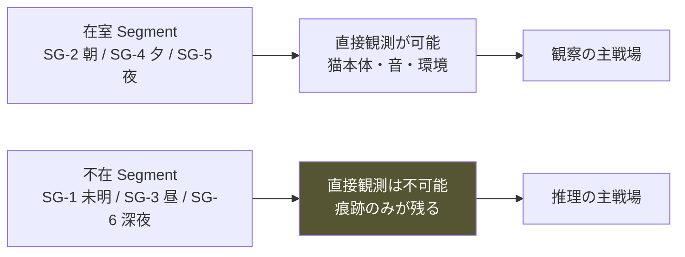

**不在 Segment が存在することが、Player Flow ②5〜10分区間（痕跡の発見）の構造的前提である。**

⚠️ 在室 Segment はシナリオまたはプレイヤーの選択で変動しうる（拡張余地）。既定は上表。

## 1.3 時間進行の規則

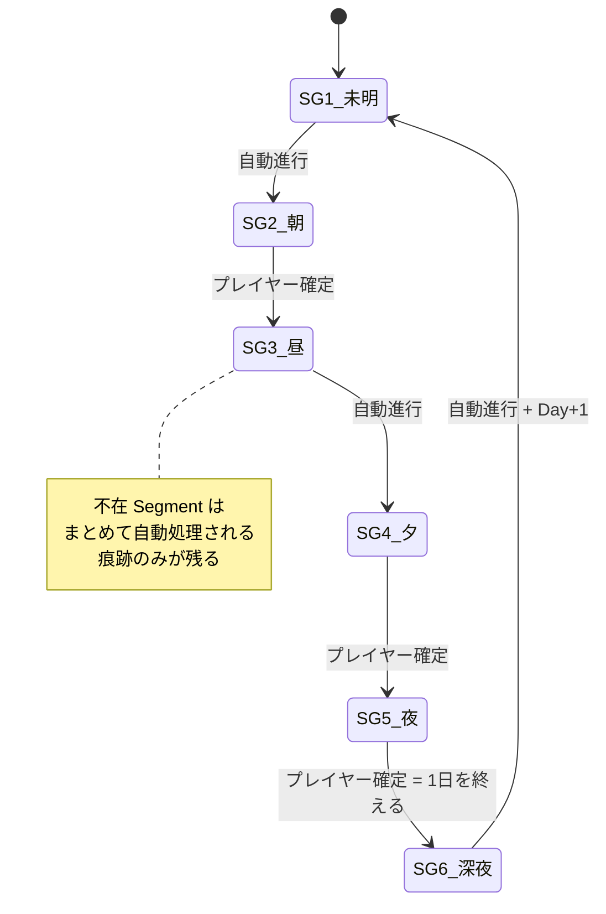

| 規則 | 内容 |
|---|---|
| **T-1** | 在室 Segment の終了は、プレイヤーの明示操作で行う |
| **T-2** | 不在 Segment は自動で処理される（プレイヤーの介入不可） |
| **T-3** | 時間は巻き戻らない（Pillar 4 / AA-42） |
| **T-4** | 在室 Segment 内で観察は無制限（Pillar 1） |
| **T-5** | 介入行動は Segment ごとに有限（後述 §6.6） |
| **T-6** | 「何もしない」を選んでも Segment は進行する |

### T-5 の設計理由

**観察は無制限、介入は有限。** この非対称が、Pillar 1（観察が最大の攻略法）の資源設計上の実装である。

```
観察 = コストゼロ  → いくらでも見られる
介入 = 有限資源    → 選ばなければならない
```

⚠️ ただし「介入回数を使い切らないと損」という感覚を生んではならない（Pillar 6）。
**未使用の介入は繰り越されず、消滅する。** これにより「使わない」が損にならない。

## 1.4 日付と日数

| 項目 | 規則 |
|---|---|
| 総日数 | **30日固定**（憲章§14.3。変更不可） |
| Day 0 | 到着日。Segment は SG-4 夕 から開始 |
| Day 1-29 | 通常進行 |
| Day 30 | 決断の日。SG-5 夜 で終了 |
| 曜日 | **持たない**（生活リズムの複雑化を避ける） |

**⚠️ 曜日を持たない理由**: 平日／休日の区別は在室パターンを複雑にし、
「この子の普通」（Player Flow ⑪11.2）の確立を遅らせる。学習ラインの妨げになる。

## 1.5 天候


| 天候 | 光量 | 環境音 | 気温 | 猫への主影響 |
|---|---|---|---|---|
| 晴 | 高 | 低 | 標準 | 日向の出現。高所選好の増加 |
| 曇 | 中 | 低 | やや低 | 影響小 |
| 雨 | 低 | **中（雨音）** | 低 | 活動量低下。隠れ選好の微増 |
| 強風 | 中 | **高（突発音）** | 低 | **警戒の増加**（突発音源） |

> 📋 **監修必須**: 気圧・天候と猫の活動量の関係（付録B-02）
> 現時点では「雨天時の活動量低下」を穏やかな傾向として実装し、断定的な描写はしない。

**決定論性（SR-3）**: 天候は `RNG.stream("weather").at(day)` で決定する。プレイヤーの行動に依存しない。

## 1.6 季節

**初期実装では単一季節（初秋を想定）とする。**

Architecture §10.6 に従い、Environment を「**基準条件 + 修飾レイヤー**」構造で実装する。

```
EnvironmentCondition = BaseCondition × SeasonModifier × WeatherModifier
```

初期実装では `SeasonModifier = 恒等` とし、将来の季節追加を定義のみで可能にする。

**⚠️ 30日の長さは季節を跨がない。** 季節変化を30日内で起こさない。

## 1.7 時間更新図

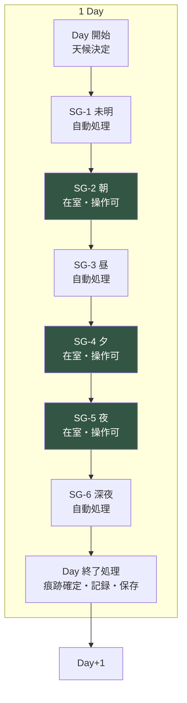

---

# ② Cat Needs Model

> **目的**: 猫の欲求を定義し、行動の発生源を確立する。
> **設計理由**: 猫の行動が「気分」で決まると、観察が推理に繋がらない。欲求という一貫した駆動源を置くことで、SR-2（因果の遡行可能性）が成立する。
> **他システムとの関係**: Affect（③）が Needs をゲートする。Environment（④）が充足可能性を決める。Behavior（⑥）が Needs から選ばれる。
> **プレイヤーから見える変化**: 食べる／飲む／トイレへ行く／寝る／毛づくろい／爪とぎ／探索する／遊ぶ／隠れる。そして**それらをしないこと**。
> **内部シミュレーション**: 各 Need の圧（pressure）値と切迫度（urgency）の計算。

## 2.1 Needs の分類

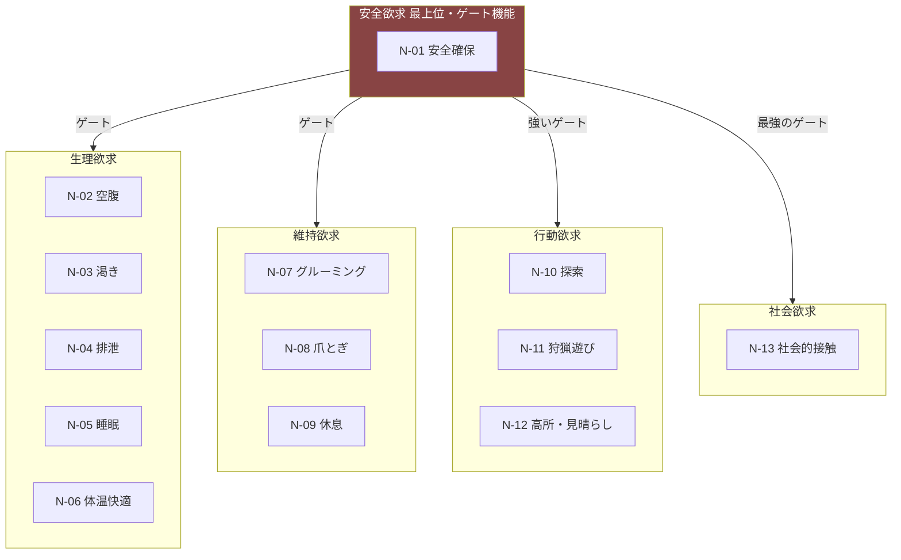

## 2.2 Needs 一覧表

**値域**: 0.0（完全に充足）〜 1.0（切迫）。「圧（pressure）」として扱う。

| ID | 名称 | 上昇速度<br/>(/Segment) | 主な充足行動 | 充足量 | 優先重み | ゲート感受性 |
|---|---|---|---|---|---|---|
| N-01 | **安全確保** | 状況依存 | 退避・隠れる・高所 | 状況依存 | **最高 1.0** | — |
| N-02 | 空腹 | 0.10 | 摂食 | 0.8 | 0.85 | **高** |
| N-03 | 渇き | 0.08 | 飲水 | 0.9 | 0.75 | 中 |
| N-04 | 排泄 | 0.12 | トイレ使用 | 1.0 | 0.80 | **高** |
| N-05 | 睡眠 | 0.09 | 睡眠 | 0.7 | 0.70 | 中 |
| N-06 | 体温快適 | 環境依存 | 移動・丸まる・伸びる | 0.6 | 0.55 | 低 |
| N-07 | グルーミング | 0.06 | 毛づくろい | 0.5 | 0.40 | 低 |
| N-08 | 爪とぎ | 0.05 | 爪とぎ | 0.7 | 0.35 | 中 |
| N-09 | 休息 | 0.08 | 伏せ・くつろぎ | 0.6 | 0.45 | 中 |
| N-10 | 探索 | 0.04 | 移動・調査 | 0.5 | 0.30 | **非常に高** |
| N-11 | 狩猟遊び | 0.05 | 遊び行動 | 0.6 | 0.30 | **非常に高** |
| N-12 | 高所・見晴らし | 0.03 | 高所への移動 | 0.6 | 0.35 | 低 |
| N-13 | 社会的接触 | 0.02 | 接近・並在 | 0.5 | 個体差大 | **最高** |

⚠️ 上昇速度・充足量・優先重みは**すべて個体プロファイルで変動する**（SR-5・§9）。上表は基準値。

## 2.3 各 Need の詳細

### N-01 安全確保（Safety）— 最重要

| 項目 | 内容 |
|---|---|
| **発生条件** | Vigilance が閾値超過 / 突発刺激 / 現在地の ZoneSecurity 低下 |
| **増加条件** | 音・動き・接近・未知の物体・環境変化 |
| **減少条件** | 安全な場所への移動 + 時間経過（遅い） |
| **充足行動** | 退避、隠れる、高所へ移動、静止 |
| **他欲求との関係** | **すべての他欲求をゲートする**（下記） |
| **観測される現れ** | 隠れる／動かない／出てこない／高い所から降りない |

**ゲート則（本作の中核メカニクス）**

```
effective_urgency(n) = urgency(n) × gate(N-01, sensitivity(n))

gate(s, k) = clamp(1 - s × k, 0, 1)
  s = N-01 の圧
  k = その Need のゲート感受性
```

| N-01 圧 | 探索・遊び | 摂食・排泄 | 睡眠 | 社会的接触 |
|---|---|---|---|---|
| 0.0-0.2 | 通常 | 通常 | 通常 | 通常 |
| 0.3-0.5 | **抑制** | やや抑制 | やや抑制 | **強く抑制** |
| 0.6-0.8 | **停止** | **強く抑制** | 浅い睡眠のみ | **停止** |
| 0.9-1.0 | 停止 | **停止** | 停止 | 停止 |

> 📋 **監修必須**: 不安時の摂食・排泄抑制の程度（付録B-03）

**設計理由**: これが Player Flow の学習ライン L2「食事の条件」の実体である。

```
プレイヤー：「餌を置いたのに食べない」
   ↓ 観察
「人がいると食べない」「音がすると食べない」
   ↓ 仮説
「安心できないと食べられないのでは？」
   ↓ 検証（食器の位置を変える／その場を離れる）
「食べた」
   ↓ 理解
「この子は、安心できない場所では食べない」
```

**ゲート則ひとつが、一つの学習ライン全体を生む。**

### N-02 空腹（Hunger）

| 項目 | 内容 |
|---|---|
| 発生条件 | 常時（時間経過） |
| 増加条件 | 時間経過。活動量に応じて加速 |
| 減少条件 | 摂食 |
| 充足の前提 | 食器に餌がある / 到達可能 / N-01 が閾値以下 |
| 他欲求との関係 | 摂食後は N-07 グルーミングが上昇（食後の毛づくろい） |
| 観測される現れ | 食器の周辺にいる／食べる／**食器の前で止まって戻る**／餌が減る（痕跡） |

**⚠️「食器の前で止まって戻る」は最重要の Cue である。**
空腹だが N-01 ゲートで摂食できない状態を、観測可能にする（SR-1）。

### N-03 渇き（Thirst）

| 項目 | 内容 |
|---|---|
| 増加条件 | 時間経過。気温・乾燥で加速 |
| 減少条件 | 飲水 |
| 充足の前提 | 水がある / 到達可能 / **水と食器が近すぎない** |
| 他欲求との関係 | 空腹と独立。ただし摂食後にやや上昇 |
| 観測される現れ | 水を飲む／水が減る（痕跡） |

> 📋 **監修必須**: 水と食器の距離が飲水量に与える影響（付録B-04）

### N-04 排泄（Elimination）

| 項目 | 内容 |
|---|---|
| 増加条件 | 時間経過。摂食後に加速 |
| 減少条件 | トイレ使用 |
| 充足の前提 | トイレが清潔 / 到達可能 / **落ち着ける位置** / N-01 が閾値以下 |
| 他欲求との関係 | 排泄後に N-08 爪とぎ・N-07 グルーミングが微増 |
| 観測される現れ | トイレへの移動／使用痕（痕跡）／**我慢している様子** |

**トイレの条件（内部変数）**

```
ToiletUsability = f(清潔度, 位置の落ち着き, 到達性, 出入口の数, 食事場所からの距離)
```

> 📋 **監修必須**: トイレの数・位置・清潔度の推奨（付録B-05）

### N-05 睡眠（Sleep）/ N-09 休息（Rest）

**分けて持つ。** 睡眠は意識の遮断、休息は覚醒下の低活動。

| | N-05 睡眠 | N-09 休息 |
|---|---|---|
| 充足の前提 | **高い安全性が必要** | 中程度の安全性で可 |
| N-01 ゲート | 強い（不安時は浅い睡眠のみ） | 中程度 |
| 観測される現れ | 丸まって動かない／目を閉じる | 伏せている／目は開いている |

**設計理由**: 「寝ているように見えるが寝ていない」を表現するため。
これは実在する状態であり、警戒度の高い個体の重要な観測対象になる。

### N-06 体温快適（Thermal Comfort）

| 項目 | 内容 |
|---|---|
| 増加条件 | 環境温度が快適域から乖離 |
| 減少条件 | 適温の場所へ移動 / 姿勢の変更 |
| 観測される現れ | 日向へ移動／丸まる／伸びて寝る／暖かい場所を選ぶ |

**姿勢が温度の指標になる。** 丸まる＝寒い、伸びる＝暖かい。観測しやすい優れた Cue。

### N-07 グルーミング / N-08 爪とぎ

| | N-07 グルーミング | N-08 爪とぎ |
|---|---|---|
| 増加条件 | 時間経過、摂食後、接触後 | 時間経過、起床後、興奮後 |
| 特記 | **転位行動としても発生**（§6.5） | マーキング機能も持つ |
| 観測される現れ | 毛づくろい | 爪とぎ行動／爪とぎ跡（痕跡） |

**⚠️ N-07 は転位行動として、葛藤時にも発生する。**
これは「欲求充足」ではなく「情動の発露」であり、Behavior 側で別扱いする（§6.5）。
**観測上は同じ毛づくろいに見える**ことが、本作最良の観察題材になる。

### N-10 探索 / N-11 狩猟遊び

| 項目 | 内容 |
|---|---|
| 増加条件 | 時間経過（遅い）。環境変化により加速 |
| 減少条件 | 探索行動 / 遊び行動 |
| **ゲート感受性** | **非常に高**（安全でなければ一切出ない） |
| 観測される現れ | 部屋を歩く／物の匂いを嗅ぐ／物を触る／追いかける |

**設計理由**: この2つが出現することが、**安心の最良の指標**になる。
数値を見せずに「この子は今、落ち着いている」を伝える唯一の手段。

### N-12 高所・見晴らし（Vantage）

| 項目 | 内容 |
|---|---|
| 増加条件 | 時間経過（遅い）。警戒時に加速 |
| 減少条件 | 高所での滞在 |
| 観測される現れ | 高い場所へ登る／そこから降りない／見下ろす |

**⚠️ 個体差が最も大きい Need のひとつ。** 高所を好まない個体も存在する（SR-5）。
「猫は高い所が好き」という一般論を裏切る装置として機能する（Player Flow ⑪11.2）。

### N-13 社会的接触（Social Contact）

| 項目 | 内容 |
|---|---|
| 増加条件 | 時間経過（非常に遅い）。個体差が最大 |
| 減少条件 | 人との近接・並在・接触 |
| **ゲート感受性** | **最高**（Relationship にも強く依存） |
| 前提 | Trust が閾値以上（§5） |
| 観測される現れ | 自分から近づく／同じ部屋にいる／少し離れて座る |

**⚠️ この Need は Relationship System と結合する。**
Familiarity / Trust が低い間は、圧が上がっても充足行動が発現しない。

**⚠️ 絶対禁止**: この Need の充足度を「懐き度」として扱わないこと（憲章 I-1 / AA-120）。

## 2.4 切迫度（Urgency）の計算

```
urgency(n) = weight(n) × curve(pressure(n))

curve(p) = p^γ    （γ ≈ 2.5、個体差あり）
```

**凸カーブを使う理由**

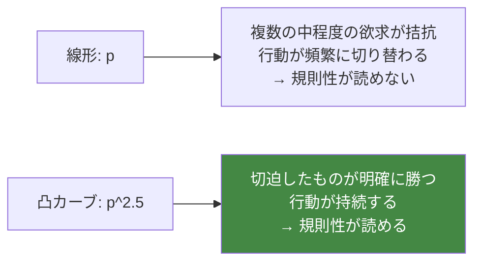

**規則性が読めることが、観察の前提である**（Player Flow ⑥6.5 「3回ルール」）。

## 2.5 Needs 依存関係図

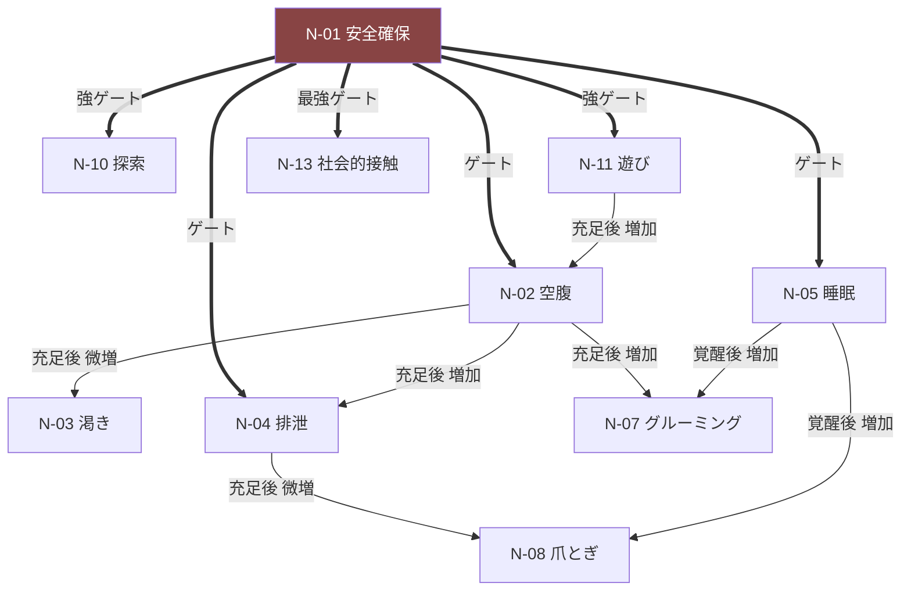

**この連鎖が「一日の流れ」を自然に生む。**
食べる → 毛づくろい → 寝る → 起きて伸びる → 爪とぎ → 探索。
これは実際の猫の行動連鎖であり、**プレイヤーが最初に気づく規則性**になる。

> 📋 **監修必須**: 行動連鎖の妥当性（付録B-06）

---

# ③ Affect Simulation

> **目的**: 猫の情動状態を、行動学的に妥当かつ観測可能な形でモデル化する。
> **設計理由**: 「感情」を人間的なカテゴリ（嬉しい・悲しい）で持つと、猫の内心を断定することになり原則4に反する。次元モデルを採用し、カテゴリは**分類ラベル**に留める。
> **他システムとの関係**: Needs（②）をゲートし、Behavior（⑥）の選択を変え、Relationship（⑤）から影響を受ける。
> **プレイヤーから見える変化**: 姿勢、耳、尻尾、瞳孔、呼吸、移動速度、隠れる時間の長さ。
> **内部シミュレーション**: 3次元 + 1蓄積変数。

## 3.1 なぜ次元モデルか

```
❌ カテゴリモデル：emotion = "恐怖"
   → 内心の断定。原則4違反。中間状態が表現できない

✅ 次元モデル：arousal / valence / vigilance の連続値
   → 断定しない。連続的な変化が表現できる
   → 「恐怖」は3次元空間の一領域の呼称にすぎない
```

**この選択が、憲章§4.4（数値は存在するが見せない）と原則4（内心は見えない）の両立を可能にする。**

## 3.2 情動の3次元 + 1蓄積

| ID | 名称 | 値域 | 意味 | 時定数 |
|---|---|---|---|---|
| **A-1** | **Arousal（覚醒度）** | 0.0〜1.0 | 生理的な活性の高さ | 分〜時間 |
| **A-2** | **Valence（情動価）** | -1.0〜+1.0 | 不快〜快 | 分〜時間 |
| **A-3** | **Vigilance（警戒）** | 0.0〜1.0 | 脅威への注意配分 | **上昇：即時 / 下降：時間** |
| **A-4** | **StressLoad（蓄積ストレス）** | 0.0〜1.0 | 慢性的な負荷 | **上昇：時間 / 下降：日** |

### A-3 Vigilance の非対称性（SR-4 の中核）

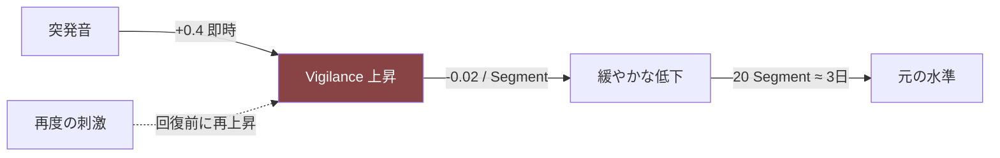

**回復前の再刺激が、悪循環の起点である。**

### A-4 StressLoad の設計

```
StressLoad は Vigilance の時間積分に近い。

d(StressLoad)/dt = α × max(0, Vigilance - θ_stress) - β × recovery_rate

θ_stress ≈ 0.4   （この水準を超えた警戒が、蓄積に転化する）
α : 蓄積速度（速い）
β : 減衰速度（遅い）
```

| StressLoad | 状態 | プレイヤーから見える変化 |
|---|---|---|
| 0.0-0.2 | 平常 | 通常の行動レパートリー |
| 0.2-0.4 | 軽度負荷 | 探索・遊びの減少 |
| 0.4-0.6 | **中度負荷** | 隠れる時間の増加。食事時間の後退 |
| 0.6-0.8 | **高度負荷（悪循環域）** | 姿を見せない。使っていた場所を使わない |
| 0.8-1.0 | 重度負荷 | ほぼ全ての Need 行動が抑制 |

**⚠️ StressLoad = 0.8 が上限。** これ以上は上がらない。
**回復不能状態を作らない**（憲章 I-4 の精神 / AA-126）。

> 📋 **監修必須**: 慢性ストレスの行動指標（付録B-07）

## 3.3 情動状態の分類（ラベル）

3次元空間の領域に名前をつける。**これは内部の分類であり、プレイヤーには決して開示しない。**

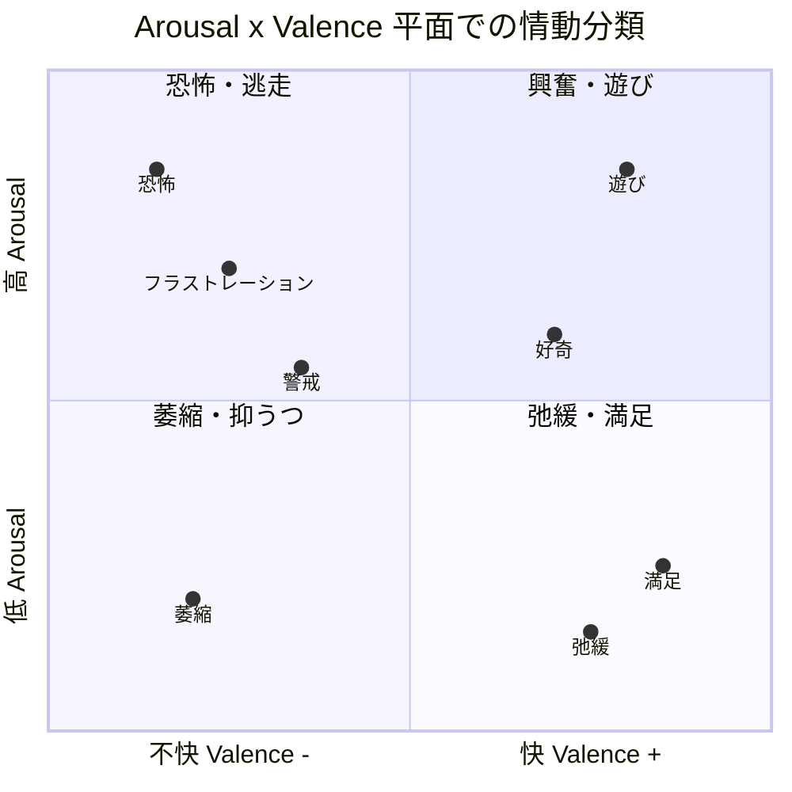

| ラベル | Arousal | Valence | Vigilance | 主な観測される現れ |
|---|---|---|---|---|
| **弛緩** | 低 | + | 低 | 伸びて寝る／目を細める／喉を鳴らす |
| **満足** | 低〜中 | + | 低 | 毛づくろい／ゆっくり動く |
| **好奇** | 中 | + | 中 | 匂いを嗅ぐ／頭を傾ける／ひげが前へ |
| **遊び** | 高 | + | 低〜中 | 追う／飛びかかる／瞳孔散大 |
| **警戒** | 中 | 0〜- | **高** | 耳が動く／じっと見る／低い姿勢 |
| **恐怖** | 高 | - | **最高** | 逃げる／固まる／耳を伏せる／瞳孔散大 |
| **フラストレーション** | 高 | - | 低〜中 | 尻尾を打ちつける／鳴く／落ち着かない |
| **萎縮** | 低 | - | 中〜高 | 動かない／隅にいる／反応が乏しい |

> 📋 **監修必須**: 各情動に対応するボディランゲージ（付録B-08）。**本作の描写の正確性の根幹**。

**⚠️ 瞳孔散大は「遊び」と「恐怖」の両方で起きる。**
これは事実であり、**同一の観測が文脈で異なる意味を持つ**（Player Flow ⑥6.3 多層性）最良の例である。

## 3.4 情動間の相互作用

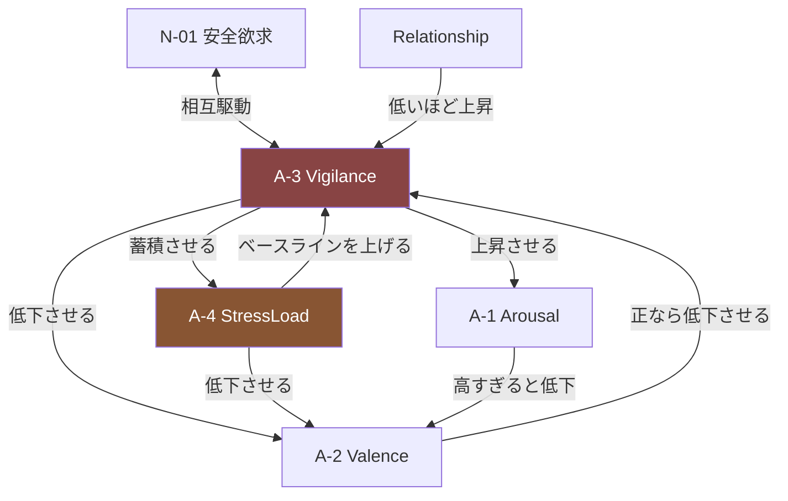

### 最重要のフィードバックループ

```
StressLoad ↑ → Vigilance のベースライン ↑ → 些細な刺激でも Vigilance が閾値超過
   → StressLoad ↑ → ...（正のフィードバック = 悪循環）
```

**この正のフィードバックが、原則6「焦るほど悪循環になる」の数理的実体である。**

**⚠️ ループを止める仕組みが必須**（詰みの禁止）:

```
1. StressLoad に上限 0.8 を設ける
2. 刺激がない Segment が連続すると、減衰速度 β が増加する
3. Day 単位の下限保証（§5.6 セーフティネット）
```

## 3.5 慣れと感作（Habituation / Sensitization）

**同じ刺激への反応は、反復により変化する。**

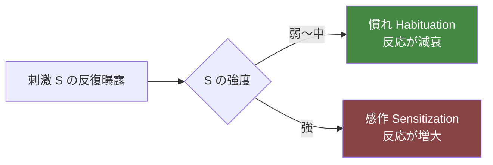

| 項目 | 慣れ | 感作 |
|---|---|---|
| 条件 | 刺激強度 < 個体閾値 | 刺激強度 ≥ 個体閾値 |
| 効果 | 同一刺激への Vigilance 応答が逓減 | 同一刺激への応答が逓増 |
| 速度 | 遅い（数日） | 速い（1〜2回） |
| 減衰 | 曝露が途切れると徐々に戻る | 長期間持続する |

> 📋 **監修必須**: 慣れと感作の閾値の考え方（付録B-09）

**設計上の意味（極めて重要）**

```
弱い刺激を繰り返す → 慣れる（良い）
強い刺激を与える   → 感作する（悪い。しかも長く残る）

つまり：
「少しずつ、ゆっくり」が正解であり、
「一気に距離を詰める」が最悪手である。
```

**これはメカニクスであると同時に、現実の正しい知識である。**
Reality Bridge 層1（Experience Bible ⑩10.3）の最良の実装。

## 3.6 予測可能性（Predictability）

**猫の安心は、環境の予測可能性に強く依存する。**

```
Predictability = f(ルーチンの一貫性, 環境変化の頻度, 人の行動の一貫性)
```

| 要素 | 予測可能性への寄与 |
|---|---|
| 同じ時間帯に同じことが起きる | + |
| 環境が変わらない | + |
| 人の動きが緩やかで一定 | + |
| 突発的な音・動き | −− |
| 頻繁な環境変更 | −− |
| 来客 | −− |

**効果**: Predictability が高いほど、Vigilance のベースラインが下がる。

**設計上の意味**

```
何もしない日が続く → 予測可能性が上がる → Vigilance ベースライン低下
   → 猫が出てくる

これが Player Flow ⑧8.3「R3 待つ」の数理的実体である。
```

**⚠️ 「何もしないことに効果がある」を、明示せずに成立させる唯一の仕組み。**

---

# ④ Environment Simulation

> **目的**: 環境が猫に与える影響を規則化し、Pillar 3（環境こそが対話）を成立させる。
> **設計理由**: プレイヤーが猫に働きかける唯一の手段が環境である以上、環境の影響則が本作の「操作性」そのものになる。曖昧だと、対話が成立しない。
> **他システムとの関係**: Affect（③）と Needs（②）の入力。Behavior（⑥）の可能性を制約する。
> **プレイヤーから見える変化**: 猫がどこにいるか、どこを避けるか、何を使い何を使わないか。
> **内部シミュレーション**: Zone 単位の安全度・快適度の評価。

## 4.1 環境の構成要素

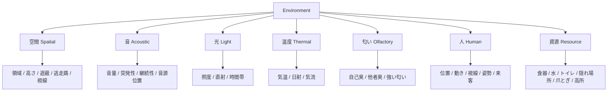

## 4.2 空間の基本単位：Zone

**部屋は連続空間ではなく、Zone の集合として扱う。**

```
Zone = 猫が「ある場所」として認識しうる単位空間
       例：ソファの下、棚の上、窓辺、部屋の隅、キャリーの中
```

**設計理由**: 連続座標で扱うと計算量が増え、かつ「あの場所」という観察の言語化が困難になる。
Zone 単位なら、Phenomenon 語彙（Architecture P-02）と自然に対応する。

### Zone の属性

| 属性 | 値域 | 意味 |
|---|---|---|
| `height` | 0.0〜1.0 | 床面からの相対高さ |
| `cover` | 0.0〜1.0 | 遮蔽度（囲まれている度合い） |
| `exits` | 整数 | 逃走経路の数 |
| `sightline` | 0.0〜1.0 | 周囲の見渡しやすさ |
| `humanDistance` | 0.0〜1.0 | 人からの距離（正規化） |
| `trafficLevel` | 0.0〜1.0 | 人の動線上にある度合い |
| `noiseLevel` | 0.0〜1.0 | 到達する音量 |
| `lightLevel` | 0.0〜1.0 | 照度 |
| `temperature` | 0.0〜1.0 | 相対温度 |
| `selfScent` | 0.0〜1.0 | 自己臭の蓄積（マーキング） |

## 4.3 Zone Security（領域安全度）

**猫が場所を選ぶ際の中核指標。**

```
ZoneSecurity(z) =
    w_cover    × cover(z)
  + w_height   × height(z)
  + w_exits    × exitScore(z)
  + w_sight    × sightline(z)
  + w_dist     × humanDistance(z)
  - w_traffic  × trafficLevel(z)
  - w_noise    × noiseLevel(z)
  + w_scent    × selfScent(z)
```

⚠️ 重み `w_*` は**すべて個体プロファイルで変動する**（SR-5）。

### exitScore の設計（重要）

```
exitScore(z) = 0        if exits == 0   （行き止まり）
             = 0.5      if exits == 1
             = 1.0      if exits >= 2
```

**「逃げ場のない場所」は、どれだけ隠れられても安全ではない。**

> 📋 **監修必須**: 逃走路の数と猫の場所選好の関係（付録B-10）

**設計上の意味**: プレイヤーが「隠れ場所を作った」つもりで行き止まりを作ると、使われない。
これは Player Flow の学習ライン L1「隠れる場所」の実体であり、
**現実の環境エンリッチメントで最も見落とされる要素**でもある。

### selfScent の設計

```
猫が滞在した Zone には、時間とともに自己臭が蓄積する。
自己臭のある場所は、その猫にとって安心度が上がる。

蓄積: 滞在時間に比例
減衰: 掃除・洗濯・物の移動でリセット
```

> 📋 **監修必須**: フェイシャルフェロモンとマーキング行動（付録B-11）

**設計上の意味**: 「掃除したら猫が来なくなった」という体験を生む。
これは実際に起こる現象であり、極めて反直観的で、優れた学習材料になる。

## 4.4 音（Acoustic）

| 音の属性 | Vigilance への影響 |
|---|---|
| **音量** | 大きいほど大 |
| **突発性** | **最も影響が大きい**。予測不能な音は音量以上に効く |
| **継続性** | 継続音は慣れやすい（Habituation） |
| **音源の可視性** | 音源が見えない音は、見える音より影響が大きい |
| **既知性** | 既に慣れた音は影響が小さい |

```
VigilanceDelta(sound) =
    baseImpact(volume)
  × suddennessFactor      （突発なら ×2.0）
  × invisibilityFactor    （音源不可視なら ×1.5）
  × (1 - habituation(soundType))
```

**⚠️ 音は本作で最も強力な環境変数である。** そして最も観測しやすい（プレイヤーにも聞こえる）。

## 4.5 光・温度

| 要素 | 猫への影響 |
|---|---|
| **照度（高）** | 日向の出現 → N-06 体温快適の充足地点 |
| **照度（低）** | 隠れ場所の実効的な cover を上げる |
| **直射日光** | 特定 Zone の temperature を時間帯で変動させる |
| **気温（低）** | N-06 上昇。暖かい Zone への選好 |
| **気温（高）** | N-06 上昇。涼しい Zone・N-03 渇き の加速 |

**日向は時間とともに移動する。** これが「同じ場所にいるようで、少しずつ動いている」という
観察題材を、実装コストほぼゼロで生む。

## 4.6 人（Human）— 最も強い環境変数

**⚠️ プレイヤーは環境の一部である。** これが本作の設計上の要である。

| 人の属性 | 猫への影響 | 観測可能性 |
|---|---|---|
| **距離** | 近いほど Vigilance ↑ | プレイヤーは自覚しにくい |
| **移動速度** | 速いほど Vigilance ↑↑ | 自覚しにくい |
| **移動の予測可能性** | 不規則ほど Vigilance ↑ | 自覚しにくい |
| **姿勢（高さ）** | 立位＞座位＞臥位 で Vigilance ↑ | 自覚しにくい |
| **視線（直視）** | **直視は威嚇シグナル**。Vigilance ↑↑ | **最も自覚しにくい** |
| **ゆっくり瞬き** | 親和シグナル。Vigilance ↓ | 効果が地味 |
| **正対 vs 側面** | 正対のほうが Vigilance ↑ | 自覚しにくい |

> 📋 **監修必須**: 視線・姿勢・接近速度の影響（付録B-12）。**本作の中核メカニクス**。

### 「観察が対象を変える」

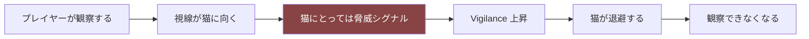

**これが本作最大のジレンマであり、Player Flow ⑤D4（最も自覚されない決定）の実装である。**

**⚠️ ただし観察そのものにコストを課してはならない**（Pillar 1）。
課すのは「距離」「速度」「姿勢」であり、**見ること自体は自由**である。

```
✅ 遠くから、静かに、長く見る  → 影響ほぼゼロ
❌ 近づいて、正面から、じっと見る → 影響大
```

**同じ「観察」でも、やり方で結果が変わる。** これが観察の熟達（Player Flow ⑨9.2 L5）の実体。

### 来客（Visitor）

| 項目 | 内容 |
|---|---|
| 発生 | イベント由来（本書の対象外） |
| 影響 | 強い急性 Vigilance 上昇 + StressLoad 蓄積 |
| 持続 | 来訪中 + 退去後も数 Segment |
| 慣れ | 反復訪問で緩和されるが、遅い |

## 4.7 資源（Resource）配置

**資源の「数」と「分散」が安心を作る。**

| 原則 | 内容 |
|---|---|
| **R-1 分散** | 同種資源が複数箇所にあるほど安心度が上がる |
| **R-2 分離** | 食事・水・トイレは互いに離れているほうがよい |
| **R-3 到達性** | 人の動線を通らずに到達できることが重要 |
| **R-4 清潔** | トイレの清潔度は使用可否に直結する |
| **R-5 垂直性** | 高低差のある資源があるほど選択肢が増える |

> 📋 **監修必須**: 資源配置の推奨（付録B-13）。現実の飼育助言と一致させる。

**⚠️ 「良い配置スコア」を算出してはならない**（Architecture AA-66 / 原則3）。
評価するのは**この個体にとっての適合度**であり、絶対的な良し悪しではない。

## 4.8 環境変化そのものの影響（重要）

**どんなに良い変更でも、変更それ自体がストレス要因である。**

```
EnvironmentChangeImpact = changeMagnitude × noveltyFactor × (1 + StressLoad)

効果：
  即時   : Vigilance +Δ（変更直後の警戒）
  短期   : 該当 Zone の一時的な回避（1〜2 Segment）
  中期   : 慣れれば、変更の本来の効果が現れる（翌日以降）
```

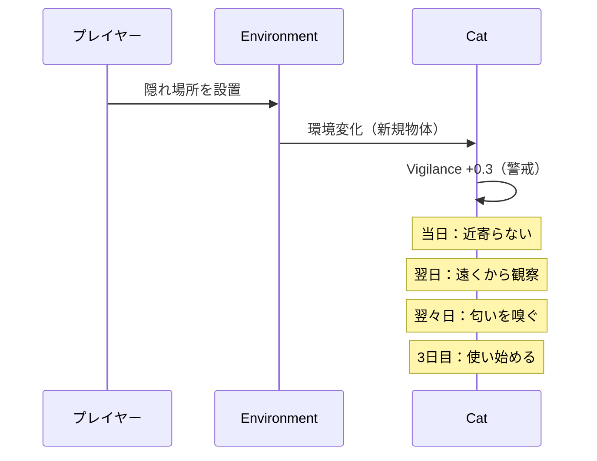

**設計上の意味**

```
・即座の結果を求める → 変更を繰り返す → 常に警戒状態 → 何も定着しない
・待てる           → 慣れる          → 効果が現れる
```

**これも原則6の実装である。** そして現実の飼育でも正しい。

**⚠️ 頻繁な環境変更はペナルティを持つ。** ただし「ペナルティ」と表示しない。
現象（使われない・警戒する）としてのみ現れる。

## 4.9 環境依存関係図

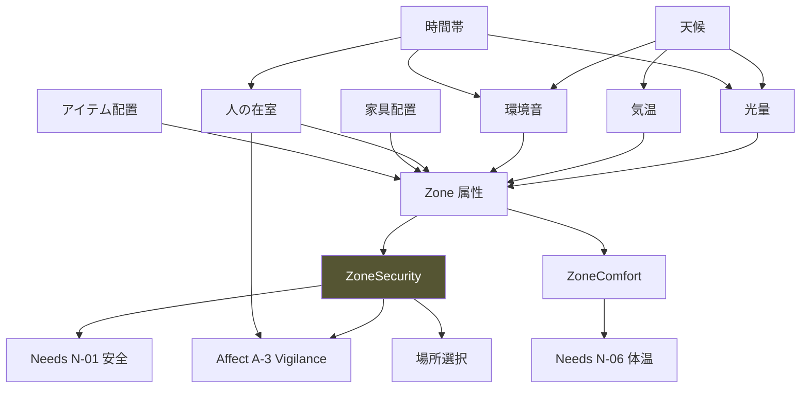

---

# ⑤ Relationship Simulation

> **目的**: 人と猫の関係を、数値と状態遷移の双方でモデル化する。
> **設計理由**: 関係を単一スカラー（好感度）で持つと、必ず「上げるゲーム」になる（憲章 I-1 / AA-120）。複数変数 + 状態機械にすることで、単調な最大化を構造的に不可能にする。
> **他システムとの関係**: Affect（③）に強く影響。Needs N-13 をゲート。Behavior（⑥）の接近行動を制御。
> **プレイヤーから見える変化**: 許容される距離、姿を見せる頻度、逃げるまでの時間、猫から近づくかどうか。
> **内部シミュレーション**: 3変数 + 状態機械 + 悪循環カウンタ。

## 5.1 関係の3変数

**単一のスカラーにしない。** これが設計上の最重要判断である。

| ID | 名称 | 値域 | 意味 | 変化の非対称性 |
|---|---|---|---|---|
| **R-1** | **Familiarity（慣れ）** | 0.0〜1.0 | 存在への習慣化 | 上昇：遅い / 下降：**ほぼ不可逆** |
| **R-2** | **Trust（信頼）** | 0.0〜1.0 | 予測可能性の蓄積 | 上昇：**遅い** / 下降：**速い** |
| **R-3** | **ToleranceDistance（許容距離）** | 派生値 | 猫が許容する接近距離 | R-1, R-2, StressLoad から算出 |

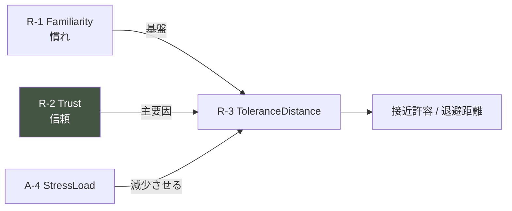

### なぜ Familiarity と Trust を分けるか

```
Familiarity : 「この人がいることに慣れた」   ← 時間と曝露で増える
Trust       : 「この人は安全だと予測できる」 ← 行動の一貫性で増える

慣れているが信頼していない状態が存在する。
  → 逃げなくなったが、近づいてもこない
  → プレイヤーには「進んでいないように見える」が、実は前進している
```

**この二層構造が、Player Flow ④「10-20分：わかった → 20-30分：わかってなかった」の実体になる。**

## 5.2 R-1 Familiarity（慣れ）

| 項目 | 内容 |
|---|---|
| **上昇条件** | プレイヤーが同じ空間にいる時間（穏やかな状態で） |
| **上昇速度** | 遅い。Vigilance が低いときのみ加算 |
| **下降条件** | 長期の不在のみ（30日以内では実質下降しない） |
| **効果** | ToleranceDistance の基礎値。逃走の閾値 |
| **観測される現れ** | 同じ部屋にいても逃げなくなる／隠れる時間が短くなる |

```
d(Familiarity)/dSegment = k_fam × coPresence × (1 - Vigilance) × (1 - Familiarity)
```

**⚠️ `(1 - Vigilance)` が掛かることが重要。**
警戒した状態でいくら一緒にいても、慣れは進まない。

## 5.3 R-2 Trust（信頼）— 本作の核心

**Trust は「猫の意思を尊重した回数」で増える。**

### 上昇条件

| 行為 | Trust 増分 | 説明 |
|---|---|---|
| **猫が退避したとき、追わない** | **大** | 最重要 |
| 猫が近づいたとき、動かない | 大 | 主体性の尊重 |
| ToleranceDistance を侵さない | 中 | 継続的な加算 |
| 予測可能な行動の反復 | 中 | ルーチンの確立 |
| ゆっくり瞬きへの応答 | 小 | 親和シグナル |
| 静かに、離れて同席する | 小 | 継続的な加算 |

### 下降条件

| 行為 | Trust 減分 | 説明 |
|---|---|---|
| **ToleranceDistance の侵犯** | **大** | 即時 |
| **逃げた猫を追う** | **最大** | 最悪手 |
| 突発的な動き | 大 | 予測可能性の破壊 |
| 隠れ場所への手出し | **最大** | 安全地帯の侵害 |
| 猫が休んでいるときの接近 | 中 | |
| 頻繁な環境変更 | 小（累積） | 予測可能性の低下 |

```
d(Trust)/dEvent = +k_up × respectScore   （respectScore は上表）
                  -k_down × violationScore

k_down / k_up ≈ 5〜10   （SR-4 逆非対称）
```

**⚠️ Trust は 0 未満にならない。** 下限 0.0。
そして **Familiarity は Trust の下降に影響されない**。これが「詰みの禁止」の実装。

### 設計上の意味（極めて重要）

```
「何もしない」ことで Trust が上がる。
「良かれと思って近づく」ことで Trust が下がる。

しかもゲームは、それを一切説明しない。
```

**これが本作の全メカニクスの中で最も強力である。**
Player Flow ⑧8.3「R2 止めさせる設計」は、この規則の上に成立する。

## 5.4 R-3 ToleranceDistance（許容距離）

```
ToleranceDistance = base
                  × (1 + w_fam × Familiarity)
                  × (1 + w_trust × Trust)
                  × (1 - w_stress × StressLoad)
                  × individualModifier
```

| 状態 | 許容距離のイメージ |
|---|---|
| Day 1・警戒最大 | 部屋の反対側でも警戒 |
| Familiarity 中・Trust 低 | 同室は可。近づくと退避 |
| Familiarity 高・Trust 中 | 数歩の距離まで可 |
| Familiarity 高・Trust 高 | 隣に座れる。ただし触れることは別問題 |

**⚠️ ToleranceDistance を UI に表示しない**（憲章 I-1）。
観測されるのは「どこまで近づくと逃げるか」という**行動**のみ。

**⚠️ 「触れる」を最終目標にしない**（Experience Bible SF-3）。
接触は Trust が高くても、個体・状況によって許容されない。これは事実であり、
「懐いた＝触れる」という誤解を防ぐ。

## 5.5 関係の状態遷移

数値とは別に、**観測される関係の様態**を状態機械で持つ。
（Architecture §8.4 Cat State と対応）

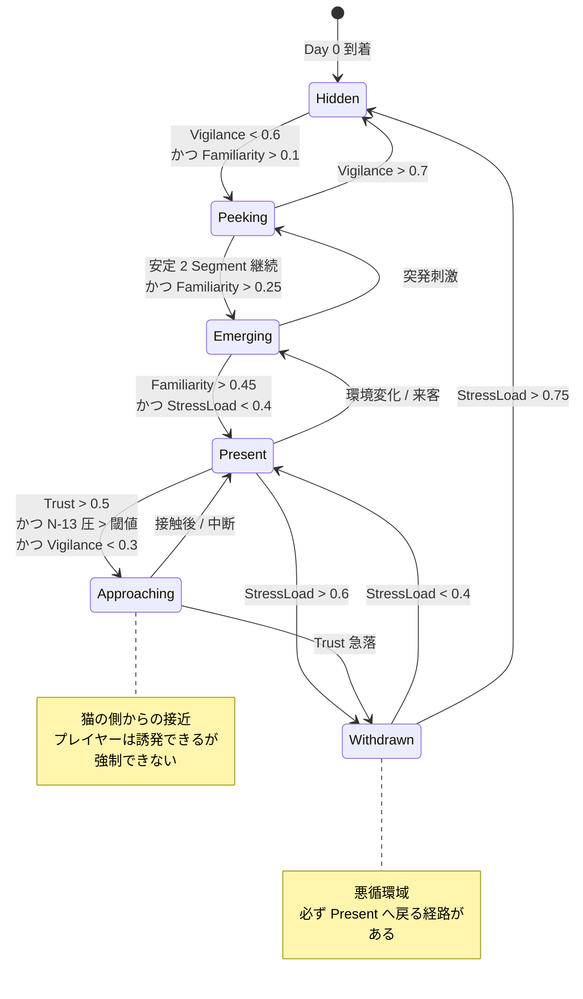

### 各状態でプレイヤーから見えるもの

| 状態 | 見えるもの | 見えないもの |
|---|---|---|
| **Hidden** | 痕跡のみ。時々の物音 | 猫本体 |
| **Peeking** | 部分的な姿（目・尻尾・耳） | 全身・行動 |
| **Emerging** | 短時間の全身。すぐ隠れる | 落ち着いた行動 |
| **Present** | 通常の生活行動 | 接近行動 |
| **Approaching** | 猫からの接近 | — |
| **Withdrawn** | 姿を見せない。使っていた場所を使わない | 通常行動 |

**⚠️ Withdrawn は「前より悪い」ことが明確に観測できなければならない**（SR-1）。

```
必須の Cue：
□ 使っていた場所を使わなくなる
□ 姿を見せる時間が明確に減る
□ 食事の時間が後ろにずれる
□ 隠れている時間が長くなる
```

## 5.6 悪循環（Negative Spiral）とセーフティネット

**Player Flow ⑧8.4 の実装。**

### 悪循環の定義

```
NegativeSpiral = (StressLoad > 0.6) かつ (直近3 Segment の介入頻度 > 閾値)
```

### 進行と脱出

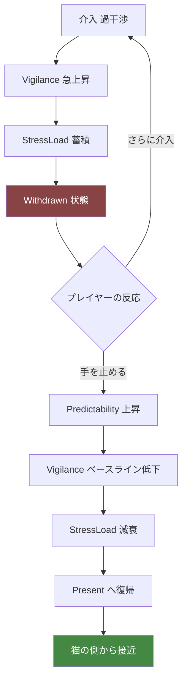

### 回復速度の規定（Player Flow ⑧8.4 と一致させること）

| 状況 | StressLoad 減衰速度 | 回復までの日数 |
|---|---|---|
| **介入を止め、静かに過ごす** | 速い（β × 3.0） | **1〜3日** |
| 通常の関わり | 標準（β） | 3〜5日 |
| 介入を続ける | 減衰しない（正味は上昇） | 回復しない |
| **完全放置（何もしない）** | 遅い（β × 0.5） | **6〜8日** |

**⚠️ 「待つ」が「放置」より速いことが必須。**
放置のほうが速いと、プレイヤーは「関わらないほうがいい」と誤学習する。
正しい学習は「**関わり方を変える**」であって「関わらない」ではない。

### セーフティネット（詰みの禁止）

```
悪循環の継続日数 D に応じて、減衰速度を段階的に引き上げる：

D ≤ 3   : 標準（プレイヤーの自力に任せる）
D = 4-5 : Cue の顕在化を強める（気づきやすくする）
D = 6-7 : 微細な回復の兆しを提示し始める
D ≥ 8   : 減衰速度を強制的に引き上げる（自然回復の開始）
```

**⚠️ 自然回復は「待つ」より必ず遅い。**（Architecture C-3/C-4 引き継ぎ）

## 5.7 関係が「行き来する」ことの保証

**Trust と Familiarity は単調増加してはならない**（AA-120 / Pillar 5）。

```
□ Trust は日常的に微減する（予測可能性の自然な減衰）
□ 環境変化・来客・偶発事象で一時的に後退する
□ 「昨日できたことが今日できない」日が存在する
□ ただし Familiarity のベースが、後退の底を支える
```

**設計理由**: 単調増加すると、プレイヤーは「上げるゲーム」として認識する。
行き来があることで、**「読む」対象になる**。

---

# ⑥ Behavior Triggers

> **目的**: どの条件でどの行動が発生するかを規則化する。
> **設計理由**: 行動選択の**規則**（本書）と行動選択の**判断**（Cat AI 設計）を分離する。本書は「何が可能か」「何が優先されるか」を定め、「どう選ぶか」は Cat AI に委ねる。
> **他システムとの関係**: Needs・Affect・Environment・Relationship のすべてを入力とする。Trace（痕跡）の生成源。
> **プレイヤーから見える変化**: 猫のすべての行動。
> **内部シミュレーション**: 4層の優先度ゲート + 行動候補のスコアリング。

## 6.1 行動の4層トリガー構造

```mermaid
graph TB
    L1["層1 反射 Reflex<br/>突発刺激への即応"]
    L2["層2 安全 Safety<br/>Vigilance が閾値超過"]
    L3["層3 欲求 Need<br/>最も切迫した欲求"]
    L4["層4 機会 Opportunity<br/>余裕があるときの行動"]

    L1 -->|"抑制"| L2
    L2 -->|"抑制"| L3
    L3 -->|"抑制"| L4

    L1 -.->|"発火条件<br/>突発刺激 > 閾値"| X1["逃走 / 硬直 / 反射的注視"]
    L2 -.->|"Vigilance > 0.6"| X2["退避 / 隠れる / 高所へ / 警戒静止"]
    L3 -.->|"最大 urgency"| X3["摂食 / 飲水 / 排泄 / 睡眠 / 毛づくろい / 爪とぎ"]
    L4 -.->|"余裕あり"| X4["探索 / 遊び / 接近 / 日向ぼっこ / 見晴らし"]

    style L1 fill:#844,color:#fff
    style L2 fill:#853,color:#fff
```

**上位層が発火している間、下位層は選択されない。**

## 6.2 各層のトリガー条件

### 層1: 反射（Reflex）

| トリガー | 条件 | 行動 | 持続 |
|---|---|---|---|
| 突発音 | 音量 × 突発性 > 個体閾値 | 硬直 → 逃走 or 注視 | 数秒〜数十秒 |
| 急接近 | 人の接近速度 > 閾値 | 逃走 | 退避完了まで |
| 視界内の急な動き | 動きの大きさ > 閾値 | 硬直 or 逃走 | 短 |
| 触られる（許容外） | 距離 < ToleranceDistance × 0.3 | 逃走 | 退避完了まで |

**⚠️ 反射は他のすべてを中断する。** 食事中でも、睡眠中でも中断される。

### 層2: 安全（Safety）

| 条件 | 行動 |
|---|---|
| Vigilance > 0.6 | 最も ZoneSecurity の高い Zone へ移動 |
| Vigilance > 0.8 | 移動せず硬直（動くこと自体がリスク） |
| StressLoad > 0.6 | 隠れ Zone に長時間滞在 |
| 現在 Zone の Security 低下 | より安全な Zone へ移動 |

### 層3: 欲求（Need）

```
選択される行動 = argmax( effective_urgency(n) ) の充足行動

ただし：
  □ その行動が現在の環境で実行可能であること
  □ 必要な資源に到達可能であること
  □ 到達経路の ZoneSecurity が閾値以上であること
```

**⚠️ 「到達経路の安全性」が重要。**
食器が人の動線上にあると、空腹でも行かない。これが Player Flow の学習題材になる。

### 層4: 機会（Opportunity）

```
発火条件：
  □ Vigilance < 0.3
  □ StressLoad < 0.4
  □ 全 Need の urgency < 0.4
  □ 現在 Zone の Security > 0.5
```

**この4条件が揃うことは、序盤には起こらない。**
だから探索・遊びは、序盤には決して見られない。
**そして中盤にそれが見られたとき、それが「安心の証拠」になる。**

## 6.3 行動一覧

| ID | 行動 | 層 | 持続 | 生成する痕跡 |
|---|---|---|---|---|
| B-01 | 逃走 | 1 | 短 | 移動跡 |
| B-02 | 硬直 | 1 | 短 | — |
| B-03 | 反射的注視 | 1 | 短 | — |
| B-04 | 退避移動 | 2 | 短 | 移動跡 |
| B-05 | 隠れる | 2 | **長** | 毛（滞在痕） |
| B-06 | 高所へ移動 | 2/4 | 中 | 毛 |
| B-07 | 警戒静止 | 2 | 中 | — |
| B-08 | 摂食 | 3 | 中 | **餌の減り** |
| B-09 | 飲水 | 3 | 短 | **水の減り** |
| B-10 | 排泄 | 3 | 短 | **トイレの使用痕** |
| B-11 | 睡眠 | 3 | **長** | 毛 |
| B-12 | 休息 | 3 | 長 | 毛 |
| B-13 | 毛づくろい | 3/転位 | 中 | **抜け毛** |
| B-14 | 爪とぎ | 3 | 短 | **爪とぎ跡** |
| B-15 | 探索 | 4 | 中 | **物の位置変化** |
| B-16 | 遊び | 4 | 中 | 物の位置変化 |
| B-17 | 接近 | 4 | 短 | — |
| B-18 | 並在（そばにいる） | 4 | 長 | 毛 |
| B-19 | 見晴らし | 4 | 長 | 毛 |
| B-20 | 転位行動 | 特殊 | 短 | 抜け毛 |
| B-21 | マーキング（頬すり） | 4 | 短 | **自己臭の蓄積** |

## 6.4 行動の持続と中断

```mermaid
stateDiagram-v2
    [*] --> Idle
    Idle --> Executing: 行動選択
    Executing --> Completing: 持続時間経過
    Executing --> Interrupted: 上位層のトリガー
    Completing --> Idle: Need 充足を適用
    Interrupted --> Idle: 充足を部分適用
    Idle --> Executing: 次の行動

    note right of Interrupted
        中断された行動は
        Need を部分的にしか充足しない
        これが繰り返されると
        Need が慢性的に高止まりする
    end note
```

**⚠️ 中断の累積が、悪循環の隠れた経路である。**

```
警戒が高い → 食事が中断される → 空腹が下がりきらない
   → 次の Segment でも空腹 → しかし警戒でゲートされる
   → 慢性的な空腹 → 観測上は「あまり食べていない」
```

**この連鎖が、痕跡（餌の減りが少ない）として観測される。** 優れた学習題材。

## 6.5 転位行動（Displacement Behavior）— 特別扱い

**葛藤状態で発生する、目的と無関係な行動。**

```
発火条件：
  接近したい（N-13 の圧が高い）
    かつ
  近づけない（Vigilance が高い）
    → 葛藤

conflictLevel = min(approachDrive, avoidanceDrive)

conflictLevel > 閾値 のとき、転位行動が発生する
```

| 転位行動として現れるもの | 通常時の同じ行動 |
|---|---|
| 突然の毛づくろい | N-07 の充足 |
| 床の匂いを嗅ぐ | N-10 探索 |
| あくび | 覚醒調整 |
| 前足で顔を洗う | N-07 の充足 |

> 📋 **監修必須**: 転位行動の種類と発生条件（付録B-14）

### 設計上の価値

**同じ「毛づくろい」が、文脈によって全く違う意味を持つ。**

```
落ち着いているときの毛づくろい  → 満足の指標
近づこうとして止まったときの毛づくろい → 葛藤の指標
```

**これが Player Flow ⑥6.3「多層性」の最良の実装であり、
観察力 L4（文脈を見る）への到達点そのものである。**

**⚠️ ゲームは、どちらであるかを一切説明しない。**
プレイヤーが「直前に何があったか」を見ていれば、区別できる。

## 6.6 介入行動（プレイヤー側）の制約

**プレイヤーが Segment ごとに実行できる介入は有限である**（§1.3 T-5）。

| 介入の種別 | コスト | 猫への影響 |
|---|---|---|
| 環境変更（家具の移動・追加） | 高 | 大（§4.8） |
| 資源の配置・補充 | 中 | 中 |
| 掃除 | 中 | 中（自己臭のリセット） |
| 移動（自分の位置を変える） | 低 | 中（距離の変化） |
| 姿勢の変更 | 低 | 小 |
| **何もしない** | **0** | **なし（Predictability +）** |

**⚠️ 「何もしない」のコストがゼロであり、かつ Predictability を上げる。**
これが Pillar 6 と原則6の資源設計上の実装。

**⚠️ 未使用の介入枠は繰り越されない**（§1.3）。使わないことが損にならない。

## 6.7 Behavior 依存関係図

```mermaid
graph TB
    ENV["Environment"] --> ZS["ZoneSecurity"]
    HU["人の状態"] --> VIG["Vigilance"]
    SND["音"] --> VIG
    ZS --> VIG
    VIG --> N01["N-01 安全欲求"]
    VIG --> L2["層2 安全トリガー"]
    SND --> L1["層1 反射トリガー"]

    N01 ==>|"ゲート"| NEEDS["N-02〜N-13"]
    NEEDS --> URG["urgency 計算"]
    URG --> L3["層3 欲求トリガー"]

    VIG --> L4G{"層4 発火条件"}
    SL["StressLoad"] --> L4G
    URG --> L4G
    L4G --> L4["層4 機会トリガー"]

    REL["Relationship"] --> N13["N-13 社会的接触"]
    REL --> TD["ToleranceDistance"]
    TD --> L1

    L1 --> SEL["行動選択"]
    L2 --> SEL
    L3 --> SEL
    L4 --> SEL
    CONF["葛藤検出"] --> DISP["転位行動"]
    DISP --> SEL

    SEL --> BEH["Behavior 実行"]
    BEH --> TRC["Trace 生成"]
    BEH --> CUE["Cue 生成"]

    style VIG fill:#844,color:#fff
    style CUE fill:#484,color:#fff
```

---

# ⑦ Observation Rules

> **目的**: 何が観測でき、何が観測できないかを規則化する。
> **設計理由**: 憲章 I-1 は「見せない」を定めるが、Player Flow SR-1 は「必ず手がかりがある」を要求する。この二つを両立させる規則が必要。
> **他システムとの関係**: Architecture P-01 Perception Gateway / P-03 Observation System の実装規約。
> **プレイヤーから見える変化**: 本章そのもの。
> **内部シミュレーション**: 観測条件の判定と Cue の生成。

## 7.1 観測可能性の階層

```mermaid
graph TB
    T["Truth 内部変数<br/>Needs / Affect / Relationship"]
    T -->|"必ず1つ以上生成 SR-1"| C["Cue 手がかり"]
    C --> C1["直接 Cue: 猫の行動・姿勢・部位"]
    C --> C2["間接 Cue: 痕跡"]
    C --> C3["環境 Cue: 音・物の位置変化"]
    C --> C4["時間 Cue: 反復パターン・欠落"]

    C1 --> O{"観測条件を満たすか"}
    C2 --> O
    C3 --> O
    C4 --> O
    O -->|"Yes"| P["Phenomenon 生成"]
    O -->|"No"| N["観測されない<br/>ただし存在はする"]

    T -.->|"❌ 絶対に到達しない"| P

    style T fill:#443,color:#fff
    style P fill:#453,color:#fff
```

## 7.2 観測条件

**Cue が Phenomenon になるための条件。**

| 条件 | 内容 |
|---|---|
| **視線の通り** | プレイヤーの位置から対象 Zone への sightline > 0 |
| **距離** | 距離に応じて観測できる粒度が変わる |
| **光量** | 暗い Zone では細部が観測できない |
| **遮蔽** | cover が高い Zone は部分的にしか見えない |
| **滞留時間（Tick）** | §7.3 |
| **在室** | 不在 Segment では直接 Cue が観測できない |

## 7.3 滞留時間による段階開示（Architecture P-03 の具体化）

| Tick | 開示される Phenomenon の粒度 | 例 |
|---|---|---|
| 1 | 存在と位置 | 「棚の上にいる」 |
| 3 | 姿勢と大まかな行動 | 「丸くなっている」 |
| 6 | 部位の状態 | 「耳が後ろを向いている」 |
| 10 | 微細な変化・持続パターン | 「ときどき耳だけが動く」 |
| 15+ | 反復・周期 | 「同じ方向を何度も見ている」 |

**条件による減衰**

```
実効 Tick = 滞留 Tick × distanceFactor × lightFactor × (1 - coverFactor)

遠い / 暗い / 隠れている ほど、同じ滞留時間で得られる粒度が下がる
```

**⚠️ この構造が AP-33（クリックで全情報）を防ぐ**（Architecture AA-81/82）。

## 7.4 観測できるもの / できないもの

### ✅ 観測できるもの

| カテゴリ | 内容 |
|---|---|
| **位置** | どの Zone にいるか |
| **姿勢** | 丸まる／伸びる／伏せる／立つ／低い姿勢 |
| **部位** | 耳の向き／尻尾の状態／瞳孔／ひげ／目の開き |
| **行動** | 何をしているか（B-01〜B-21） |
| **持続時間** | どれくらい続いているか |
| **移動** | どこからどこへ、どんな速さで |
| **音** | 鳴き声／足音／喉の音／物音 |
| **痕跡** | 餌・水の減り／トイレ／抜け毛／爪跡／物の位置 |
| **不在** | いないこと、来ないこと、しないこと |
| **反復** | 同じことが繰り返されること |
| **欠落** | いつもあることが今日はないこと |

### ❌ 観測できないもの

| カテゴリ | 内容 | 理由 |
|---|---|---|
| **すべての内部数値** | Needs / Affect / Relationship の値 | 憲章 I-1 |
| **猫の内心** | 何を考えているか、どう感じているか | 原則4 |
| **正解** | 何をすべきか | Pillar 2 |
| **未来** | 明日何が起きるか | Pillar 2 |
| **不在時のリアルタイム** | 不在 Segment 中の猫の様子 | §1.2 |
| **状態遷移のラベル** | Hidden / Present などの内部状態名 | 憲章 I-1 |
| **理解度** | 自分がどれだけ理解したか | 憲章 I-1 |

## 7.5 「ヒント」の再定義 ⚠️

**本作に「ヒント」は存在しない。**（AP-32 / Architecture AA-86）

| ❌ ヒント | ✅ 手がかり（Cue） |
|---|---|
| ゲームが与える | 世界が示す |
| 正解へ誘導する | 事実を提示する |
| プレイヤーの状態に応じて出る | 常に同じ条件で存在する |
| 「〜しましょう」 | 「〜が起きている」 |
| 見逃すと損 | 見逃しても、別の経路がある |

**設計規則**

```
□ Cue は、プレイヤーの理解度に応じて増減しない
□ Cue は、詰まっているプレイヤーに追加提示されない
□ Cue は、意味を説明しない
□ Cue は、複数の解釈を許す
□ 同じ Cue が、文脈によって異なる意味を持つ
```

**唯一の例外**: 悪循環が長期化した場合の **Cue の顕在化**（§5.6、悪循環 D=4-5）。
これは新しい情報を追加するのではなく、**既存の Cue を観測しやすくする**（例：滞留時間の要求を下げる）。
説明は一切行わない。

## 7.6 SR-1 観測可能性保証の実装規約

**すべての内部変化に、Cue を紐づける。**

| 内部変化 | 必須 Cue（最低1つ） |
|---|---|
| Vigilance 上昇 | 耳の動き／姿勢の低下／動きの停止 |
| Vigilance 高止まり | 隠れ続ける／出てこない |
| StressLoad 上昇 | 探索・遊びの消失／隠れる時間の増加 |
| **StressLoad 高（悪循環）** | **使っていた場所を使わない／食事時間の後退／姿を見せる時間の減少** |
| Trust 上昇 | 許容距離の拡大（近づいても逃げない） |
| **Trust 下降** | **許容距離の縮小／退避の早期化** |
| Familiarity 上昇 | 隠れる時間の短縮／同室滞在の増加 |
| Need 圧の高止まり | 該当行動を試みて中断する／痕跡の変化 |
| N-01 ゲートによる抑制 | **行動を開始しかけて戻る**（最重要 Cue） |
| 環境変更への警戒 | 該当 Zone を避ける／遠くから見る |
| 慣れの進行 | 同じ刺激への反応時間の短縮 |
| 感作の発生 | 同じ刺激への反応の増大 |
| 葛藤 | 転位行動 |

**⚠️ この表に載っていない内部変化を実装してはならない。**
Cue のない変化は、プレイヤーにとって存在しない変化であり、理不尽の源である。

## 7.7 痕跡（Trace）の観測規則

**不在 Segment の唯一の情報源。**

| 痕跡 | 生成源 | 減衰 | 読み取れること |
|---|---|---|---|
| 餌の減り | B-08 摂食 | 補充まで残る | 食べた量、食べなかったこと |
| 水の減り | B-09 飲水 | 補充まで | 同上 |
| トイレの使用痕 | B-10 排泄 | 掃除まで | 回数、時期 |
| 抜け毛 | B-05,11,12,13 | 掃除まで | **どこに長くいたか** |
| 爪とぎ跡 | B-14 爪とぎ | 蓄積する | 使われている爪とぎ |
| 物の位置変化 | B-15,16 | そのまま | 探索・遊びがあったこと |
| 自己臭 | B-21 マーキング | 掃除でリセット | （猫にのみ意味がある） |

**⚠️ 痕跡は自動で解釈されない**（Architecture S-11 禁止事項）。
「餌が半分減っている」は提示される。「食欲がない」とは言わない。

**⚠️ 痕跡は見なければ得られない。** 自動でレポートされない（Pillar 1）。

## 7.8 観測の冗長性（Player Flow I-D の実装）

**1つの気づきに、最低2つの観測経路を用意する。**

```
気づき：「この子は人の動線上では食べない」

経路1（直接）: 食器の前まで来て、食べずに戻るのを見る
経路2（痕跡）: 翌朝、餌が減っていない
経路3（検証）: 食器を移動した後、食べるようになる
```

**実装規約**: 各学習ラインについて、直接 Cue と間接 Cue の両方を保証する。

---

# ⑧ 統合: 1 Segment の完全計算順序

> **目的**: すべてのルールを1つの実行順序に統合し、Cat AI がそのまま実装できる形にする。
> **設計理由**: 個別ルールが正しくても、実行順序が誤れば結果は破綻する。順序こそが仕様である。
> **他システムとの関係**: Architecture §6.4 Segment 更新順序の具体化。
> **プレイヤーから見える変化**: なし（内部処理）
> **内部シミュレーション**: 本章そのもの。

## 8.1 Segment 計算の全順序

```mermaid
flowchart TD
    S0["Segment 開始"] --> S1["1. 環境の外部条件を更新<br/>天候・時間帯・光・温度・環境音"]
    S1 --> S2["2. 人の状態を確定<br/>在室 / 位置 / 姿勢 / 視線"]
    S2 --> S3["3. Zone 属性を再計算<br/>ZoneSecurity / ZoneComfort"]
    S3 --> S4["4. Needs 圧を推移<br/>時間経過による上昇"]
    S4 --> S5["5. 刺激イベントを適用<br/>突発音・環境変更・来客"]
    S5 --> S6["6. Vigilance を更新<br/>刺激 + Zone + 人 - 慣れ"]
    S6 --> S7["7. StressLoad を更新<br/>Vigilance の積分 - 減衰"]
    S7 --> S8["8. Arousal / Valence を更新"]
    S8 --> S9["9. Relationship を更新<br/>Familiarity / Trust"]
    S9 --> S10["10. ToleranceDistance を再計算"]
    S10 --> S11["11. N-01 安全欲求を更新"]
    S11 --> S12["12. ゲート適用<br/>effective_urgency 計算"]
    S12 --> S13["13. 葛藤レベルを判定"]
    S13 --> S14["14. 行動トリガー層を評価<br/>層1 → 層2 → 層3 → 層4"]
    S14 --> S15["15. 【Cat AI】行動を選択"]
    S15 --> S16["16. 行動を実行<br/>持続 / 中断 / 完了"]
    S16 --> S17["17. Need 充足を適用"]
    S17 --> S18["18. Trace を生成・減衰"]
    S18 --> S19["19. 自己臭を更新"]
    S19 --> S20["20. Cue を生成 SR-1 検証"]
    S20 --> S21["21. 関係状態機械を遷移"]
    S21 --> S22["22. Perception Gateway キャッシュ無効化"]
    S22 --> S23["Segment 完了"]

    style S15 fill:#454,color:#fff
    style S20 fill:#484,color:#fff
```

## 8.2 順序の設計理由

| 順序 | 理由 |
|---|---|
| 環境（1-3）が先 | 猫の判断の前提条件だから |
| Needs（4）が刺激より先 | 時間経過は刺激と独立だから |
| Vigilance（6）が Needs ゲートより先 | ゲートの入力だから |
| StressLoad（7）が Vigilance の後 | 積分だから |
| Relationship（9）が Affect の後 | Vigilance に依存するから |
| ゲート（12）が行動選択の直前 | 最新の状態で判断させるため |
| **Cat AI（15）が最後の判断** | すべての入力が揃ってから |
| **Cue 生成（20）が行動の後** | 行動も Cue の源だから |
| SR-1 検証（20）が必須 | 保証の実装 |

**⚠️ この順序を変えると、猫が「1 Segment 前の情報で行動する」ように見える。**
プレイヤーからは因果が読めなくなり、SR-2 が破れる。

## 8.3 Day 終了時の追加処理

```mermaid
flowchart LR
    A["最終 Segment 完了"] --> B["不在 Segment の一括処理"]
    B --> C["StressLoad 日次減衰"]
    C --> D["Familiarity 日次加算"]
    D --> E["Trust 日次微減"]
    E --> F["慣れ / 感作の日次更新"]
    F --> G["Predictability の再計算"]
    G --> H["悪循環カウンタの更新"]
    H --> I["セーフティネット判定"]
    I --> J["翌朝観測可能な Cue の確定"]
    J --> K["Trace の日次減衰"]
```

## 8.4 決定論性の保証（SR-3）

**RNG ストリームの分割**

| ストリーム | 用途 | シード |
|---|---|---|
| `weather` | 天候決定 | `seed + day` |
| `behavior` | 行動選択の揺らぎ | `seed + day + segment` |
| `trace` | 痕跡の位置・量の揺らぎ | `seed + day + segment` |
| `micro` | 微細な行動の揺らぎ | `seed + day + segment + tick` |
| `profile` | 個体プロファイル生成 | `seed` のみ |

**⚠️ ストリームを共有しない**（Architecture C-05 禁止事項）。
共有すると、行動の揺らぎを1つ変えただけで天候まで変わる。

**⚠️ 揺らぎの範囲は小さく保つ。**
揺らぎが大きいと規則性が読めず、観察が成立しない（§2.4）。

---

# ⑨ 個体差モデル

> **目的**: SR-5（個体固有性）を実装可能な形に落とす。
> **設計理由**: 原則2「猫は個体差がある」と原則3「正解は一つではない」は、パラメータの個体変動によってのみ実装できる。ただしランダムではなく、**一貫した個体**でなければならない。
> **他システムとの関係**: Scenario System（S-12）が個体プロファイルを適用する。
> **プレイヤーから見える変化**: 周回時、同じ手が通用しないこと。攻略情報が当てにならないこと。
> **内部シミュレーション**: プロファイルによる全パラメータの修飾。

## 9.1 個体プロファイルの構成

```mermaid
graph TB
    P["CatProfile"]
    P --> T["気質軸 Temperament"]
    P --> N["Needs 修飾"]
    P --> A["Affect 修飾"]
    P --> E["Environment 選好"]
    P --> R["Relationship 修飾"]
    P --> B["行動レパートリー"]
    P --> H["経歴由来の特性"]
```

## 9.2 気質軸（Temperament Axes）

**個体を定義する基礎軸。すべて 0.0〜1.0。**

| 軸 | 低い側 | 高い側 | 影響先 |
|---|---|---|---|
| **T-1 神経質さ** | 動じない | 些細な刺激に反応 | Vigilance 感度、感作閾値 |
| **T-2 社会性** | 単独志向 | 人を求める | N-13 の重みと上昇速度 |
| **T-3 活動性** | 低活動 | 高活動 | N-10, N-11 の重み、活動水準 |
| **T-4 探索性** | 新規回避 | 新規探索 | 環境変更への反応、N-10 |
| **T-5 順応速度** | 慣れにくい | 慣れやすい | Habituation 速度 |
| **T-6 高所選好** | 床好み | 高所好み | N-12 の重み、`w_height` |
| **T-7 遮蔽選好** | 開放好み | 隠れ好み | `w_cover` |
| **T-8 回復力** | 引きずる | 立ち直る | StressLoad 減衰速度 |

**⚠️ 「良い気質／悪い気質」は存在しない。** すべて中立的な特性である。

## 9.3 経歴由来の特性

**保護猫という設定に基づく、経歴の反映。**

| 特性 | 影響 | 注意 |
|---|---|---|
| 特定の音への強い反応 | その音種への感作が初期状態で存在 | 悲惨な過去を詳述しない（AP-43） |
| 特定の物への警戒 | 該当物体の novelty が高止まり | 同上 |
| 人の特定の動作への反応 | 該当動作の影響係数が大 | 同上 |
| 資源への執着 | 食事の中断に対する反応が強い | 同上 |

**⚠️ 経歴は「効果」としてのみ実装する。** 物語として語らない（AP-43 / Experience Bible ⑦7.6）。
プレイヤーは「この子はこの音が特に苦手らしい」と気づくが、なぜかは推測するしかない。

**これが誠実である。** 現実の保護猫についても、過去は多くの場合わからない。

## 9.4 個体差の生成規則

```
CatProfile = ベース定義（デザイナーが作成）
           + 気質軸の値（定義に含む）
           + 微小な変動（RNG.stream("profile")）
```

**⚠️ 完全なランダム生成をしない。**
デザイナーが意図した個体を定義し、微小な変動のみを許す。

**理由**: ランダム生成された個体は、学習ラインが成立する保証がない。
「観察しても何も気づけない個体」が生まれてしまう。

## 9.5 個体差が保証すべきこと

```
□ 同じ手順が、別の個体では通用しない（原則3）
□ ただし、観察の「方法」は共通して有効である（Player Flow ⑨9.6）
□ どの個体でも、学習ラインが最低3本は成立する
□ どの個体でも、詰みが発生しない
□ どの個体でも、30日で「わかる」ところまで到達できる
```

**⚠️ 個体差は「難易度差」ではない**（AP-09）。
難しい個体ではなく、**違う個体**である。

---

# ⑩ 検証ルール

> **目的**: シミュレーションが上位文書に適合しているかを検証可能にする。
> **設計理由**: シミュレーションの破綻は、テストプレイでは「なんとなく変」としてしか現れない。数値的な検証基準が必要。
> **他システムとの関係**: Cat AI 設計・QA の受け入れ基準。
> **プレイヤーから見える変化**: なし
> **内部シミュレーション**: 自動テストの判定基準。

## 10.1 不変則の検証

```
□ SR-1: すべての内部変化に Cue が紐づいているか（§7.6 の表と実装の突合）
□ SR-2: 任意の変化から、原因を辿るログが残るか
□ SR-3: 同一シードで2回実行し、全変数が一致するか
□ SR-4: 全変数の上昇速度と下降速度の比が設計通りか
□ SR-5: 3個体以上で、同一手順が異なる結果を生むか
□ SR-6: L2 変数が L3 以上に露出していないか（Architecture AQ001-016）
```

## 10.2 体験保証の検証

| # | 検証項目 | 判定基準 |
|---|---|---|
| V-01 | Day 1-5 で猫は姿をほとんど見せない | Present 状態の Segment 数 < 閾値 |
| V-02 | Day 1-5 で痕跡は毎日必ず生成される | 各 Day で Trace ≥ 1 |
| V-03 | Day 6-8 頃に環境変更の効果が現れる | 該当期間に Zone 使用の変化 |
| V-04 | Day 11-14 で行動パターンが安定する | 同一 Segment の行動の一致率 > 閾値 |
| V-05 | 過干渉で悪循環に入る | 介入頻度 max で StressLoad > 0.6 に到達 |
| V-06 | 悪循環から必ず脱出できる | 全個体・全状態で Present へ復帰可能 |
| V-07 | 待つと1〜3日で回復する | 介入停止時の StressLoad 減衰速度 |
| V-08 | 放置は6〜8日かかる | 完全放置時の減衰速度 |
| V-09 | 探索・遊びが中盤以降に出現する | 層4 発火の初回 Day が 10-20 の範囲 |
| V-10 | Day 21-27 で Approaching が発生しうる | Trust > 0.5 到達が可能 |
| V-11 | Trust は単調増加しない | 30日間で減少局面が最低1回 |
| V-12 | 詰みが発生しない | 全状態から Present への経路が存在 |

## 10.3 禁止の検証

```
□ 単一スカラーで関係を表現していないか（AA-120）
□ 「懐き度」に相当する変数名が存在しないか
□ 猫の性格が実行中に変更されていないか（Pillar 5 / AA-125）
□ StressLoad に上限があるか（詰みの禁止）
□ 家具に効果値が付与されていないか（AA-65）
□ 「良い配置スコア」を算出していないか（AA-66）
□ 猫が言葉・命令に反応していないか（憲章 I-2）
□ 死・重篤な疾病がシミュレーションに存在しないか（憲章§9.4）
□ ゲームオーバー条件が存在しないか（憲章 I-4）
```

## 10.4 監修の検証

```
□ 付録B の全項目が監修を通過しているか
□ 監修で否定された挙動が実装から除去されているか
□ 断定できない事柄が、断定的に実装されていないか
□ 実在しない行動が実装されていないか（AP-45）
```

---

# 付録A: 全変数一覧

## Needs（②）

| ID | 変数名 | 値域 | 層 |
|---|---|---|---|
| N-01 | `need.safety` | 0-1 | L2 |
| N-02 | `need.hunger` | 0-1 | L2 |
| N-03 | `need.thirst` | 0-1 | L2 |
| N-04 | `need.elimination` | 0-1 | L2 |
| N-05 | `need.sleep` | 0-1 | L2 |
| N-06 | `need.thermal` | 0-1 | L2 |
| N-07 | `need.grooming` | 0-1 | L2 |
| N-08 | `need.scratching` | 0-1 | L2 |
| N-09 | `need.rest` | 0-1 | L2 |
| N-10 | `need.exploration` | 0-1 | L2 |
| N-11 | `need.play` | 0-1 | L2 |
| N-12 | `need.vantage` | 0-1 | L2 |
| N-13 | `need.socialContact` | 0-1 | L2 |

## Affect（③）

| ID | 変数名 | 値域 | 層 |
|---|---|---|---|
| A-1 | `affect.arousal` | 0-1 | L2 |
| A-2 | `affect.valence` | -1〜+1 | L2 |
| A-3 | `affect.vigilance` | 0-1 | L2 |
| A-4 | `affect.stressLoad` | 0-0.8 | L2 |

## Relationship（⑤）

| ID | 変数名 | 値域 | 層 |
|---|---|---|---|
| R-1 | `rel.familiarity` | 0-1 | L2 |
| R-2 | `rel.trust` | 0-1 | L2 |
| R-3 | `rel.toleranceDistance` | 派生 | L2 |
| — | `rel.state` | 状態機械 | L2 |
| — | `rel.spiralDays` | 整数 | L2 |

## Environment（④）

| 変数名 | 値域 | 層 |
|---|---|---|
| `zone[].security` | 0-1 | L2 |
| `zone[].comfort` | 0-1 | L2 |
| `zone[].selfScent` | 0-1 | L2 |
| `env.predictability` | 0-1 | L2 |
| `env.weather` | 列挙 | L2 |
| `human.position / speed / posture / gaze` | — | L2 |

## Learning（③3.5）

| 変数名 | 値域 | 層 |
|---|---|---|
| `habituation[stimulusType]` | 0-1 | L2 |
| `sensitization[stimulusType]` | 0-1 | L2 |

**⚠️ 上記すべてが L2 内部変数であり、L3 以上に露出してはならない（SR-6）。**

---

# 付録B: 監修必須項目

**リリース前に、猫の行動学・獣医療の専門家による確認を要する項目。**

| # | 項目 | 該当節 | 重要度 |
|---|---|---|---|
| B-01 | 薄明薄暮性と活動ピークの時間帯 | §1.2 | 高 |
| B-02 | 天候・気圧と活動量の関係 | §1.5 | 中 |
| B-03 | 不安時の摂食・排泄抑制の程度 | §2.3 | **最高** |
| B-04 | 水と食器の距離が飲水に与える影響 | §2.3 | 中 |
| B-05 | トイレの数・位置・清潔度の推奨 | §2.3 | 高 |
| B-06 | 行動連鎖（食後の毛づくろい等）の妥当性 | §2.5 | 高 |
| B-07 | 慢性ストレスの行動指標 | §3.2 | **最高** |
| B-08 | 情動とボディランゲージの対応 | §3.3 | **最高** |
| B-09 | 慣れと感作の閾値の考え方 | §3.5 | 高 |
| B-10 | 逃走路の数と場所選好 | §4.3 | 高 |
| B-11 | フェイシャルフェロモンとマーキング | §4.3 | 中 |
| B-12 | 視線・姿勢・接近速度の影響 | §4.6 | **最高** |
| B-13 | 資源配置の推奨（分散・分離） | §4.7 | 高 |
| B-14 | 転位行動の種類と発生条件 | §6.5 | 高 |

**⚠️ 重要度「最高」の5項目は、本作の学習体験の中核である。**
これらが不正確なら、本作は誤った知識を広めることになり、Mission に反する（憲章§9.2）。

---

# 付録C: 実測調整が必要なパラメータ

**プレイテストによる調整を前提とするパラメータ。本書の値は初期値にすぎない。**

| # | パラメータ | 調整の基準 | 該当節 |
|---|---|---|---|
| C-01 | 各 Need の上昇速度 | 1日6 Segment で自然な行動頻度になるか | §2.2 |
| C-02 | urgency カーブの γ | 行動の切り替わり頻度が読める規則性を持つか | §2.4 |
| C-03 | ゲート感受性 k | 「安心しないと食べない」が観測可能な頻度で起きるか | §2.3 |
| C-04 | Vigilance の減衰速度 | Player Flow の Day 帯設計に合うか | §3.2 |
| C-05 | StressLoad の α / β | 悪循環が Day 15-19 に起きるか | §3.2 |
| C-06 | 悪循環からの回復日数 | 待つ=1〜3日、放置=6〜8日になるか | §5.6 |
| C-07 | Trust の k_up / k_down 比 | 「近づくと下がる」が体感できるか | §5.3 |
| C-08 | Familiarity の上昇速度 | Day 6-12 で Present に到達するか | §5.2 |
| C-09 | 層4 の発火条件閾値 | 探索・遊びの初出が Day 10-20 になるか | §6.2 |
| C-10 | 環境変更の警戒 Δ と減衰 | 3日程度で慣れるか | §4.8 |
| C-11 | Tick と観測粒度の対応 | 注視が心地よい長さか | §7.3 |
| C-12 | 行動の揺らぎの幅 | 規則性が読める範囲に収まるか | §8.4 |

**⚠️ 調整の判定基準は、すべて Player Flow の体験設計である。**
「バランスが良い」ではなく、「Day 17 に最深部が来るか」で判定する。

---

# 付録D: 次工程への引き継ぎ

## D.1 Cat AI 設計が本書から受け取るもの

```
□ §8.1 の計算順序（ステップ15が Cat AI の担当範囲）
□ §6.1 の4層トリガー構造（優先度の枠組み）
□ §6.3 の行動一覧（選択肢の集合）
□ §2.4 の urgency 計算（入力）
□ §2.3 のゲート則（制約）
□ §6.5 の転位行動（特殊ケース）
□ §9 の個体プロファイル（パラメータ源）
```

**Cat AI が設計すべきは「候補の中からどう選ぶか」だけである。**
何が候補になるか、何が優先されるかは本書が定めた。

## D.2 本書で未確定の事項

| # | 事項 | 決定すべき工程 |
|---|---|---|
| Z-01 | Segment 数 6 の妥当性（Y-01 の暫定確定） | Core Gameplay Loop Bible |
| Z-02 | 1 Segment あたりの介入可能回数 | Core Gameplay Loop Bible |
| Z-03 | Zone の具体的な数と構成 | Room System 設計 |
| Z-04 | 家具・アイテムの Zone 属性への寄与 | Furniture / Item 設計 |
| Z-05 | 刺激イベントの種類と強度 | Event System 設計 |
| Z-06 | 学習ラインと Cue の具体的な対応表 | Event / シナリオ設計 |
| Z-07 | 個体プロファイルの初期セット | Cat AI 設計 + 監修 |
| Z-08 | Phenomenon 語彙と Cue の対応 | Cat AI 設計 + シナリオ設計 |
| Z-09 | 付録B 全項目の監修 | 監修工程 |
| Z-10 | 付録C 全項目の実測調整 | プレイテスト工程 |

---

## 改訂履歴

| バージョン | 日付 | 変更内容 |
|---|---|---|
| 1.0 | 2026-07-24 | 初版策定 |

---

> **このシミュレーションが表現しているのは、猫の複雑さではない。**
> **「思い通りにならないものにも、必ず理由がある」という一つの事実である。**
