# 保護猫トライアル30日 — Cat AI Design v1.0

**Document Type**: Cat AI Design / 猫の意思決定設計
**Parent Documents**:
- [00-PROJECT-CONSTITUTION.md](./00-PROJECT-CONSTITUTION.md)（最上位）
- [01-EXPERIENCE-BIBLE.md](./01-EXPERIENCE-BIBLE.md)
- [02-PLAYER-FLOW.md](./02-PLAYER-FLOW.md)
- [03-SYSTEM-ARCHITECTURE.md](./03-SYSTEM-ARCHITECTURE.md)
- [04-SIMULATION-RULES.md](./04-SIMULATION-RULES.md)

**Authority**: 上記5文書に次ぐ第6位
**Layer**: L2 Simulation / S-02 Cat AI System
**Scope**: Simulation Rules §8.1 ステップ15「行動の選択」+ 記憶・性格・観測写像
**Out of Scope**: Needs/Affect/Environment の推移則（04 で確定済み）、イベント内容、UI
**Last Updated**: 2026-07-24

---

## 📌 前提の確認

参照指定のうち **「Core Gameplay Loop Bible」は未作成**。本書はループ定義を Constitution §3.3・Player Flow ③・Simulation Rules §1 から参照する。

**本書と Simulation Rules の役割分担**

```
Simulation Rules (04) : 世界の法則。「何が起こりうるか」「何が優先されるか」
Cat AI Design  (本書) : 猫の判断。「候補の中から、この個体はどう選ぶか」
```

⚠️ 04 §6.3 で **21 の行動カテゴリ** B-01〜B-21 を定義済み。
本書 ⑥ はそれを **126 の行動インスタンス** CB-001〜CB-126 に展開する。両者は包含関係にあり、対応表を §6.1 に置く。

---

## 目次

- [① AI Philosophy](#-ai-philosophy)
- [② Decision Architecture](#-decision-architecture)
- [③ Internal Brain Model](#-internal-brain-model)
- [④ Personality System](#-personality-system)
- [⑤ Learning Model](#-learning-model)
- [⑥ Behavior Library](#-behavior-library)
- [⑦ State Transition](#-state-transition)
- [⑧ Environment Reaction](#-environment-reaction)
- [⑨ Human Interaction Model](#-human-interaction-model)
- [⑩ Observation Mapping](#-observation-mapping)
- [付録A: クラス図](#付録a-クラス図)
- [付録B: 監修必須項目](#付録b-監修必須項目)
- [付録C: 実装チェックリスト](#付録c-実装チェックリスト)

---

# ① AI Philosophy

> **目的**: 本作の猫AIが何のために存在するかを定義し、以降すべての技術選択の判断基準を確立する。
> **設計理由**: 「面白いAI」を目指すと、必ずプレイヤーに媚びる挙動が混入する。目的を「猫として生きる」に固定することで、面白さは結果として生まれるものに位置づける。
> **ゲーム体験への影響**: プレイヤーが「この子はこういう子だ」と語れるかどうかは、本章の徹底度に比例する。
> **他システムとの依存関係**: 全システムの上位規範。特に S-02 の禁止事項（Architecture）を具体化する。
> **実装時の注意点**: 「わかりにくいから」を理由にした挙動の追加は、本章への違反である。

## 1.1 猫AIの目的

> ### **この猫は、プレイヤーのために行動しない。**
> ### **自分の必要のために行動し、その結果が観察される。**

| ❌ 本作が作らないAI | ✅ 本作が作るAI |
|---|---|
| プレイヤーを楽しませるAI | 自分の必要を満たすAI |
| 反応してくれるAI | 反応が結果として観測されるAI |
| 賢いAI | **一貫したAI** |
| 最適に振る舞うAI | **自分の記憶に基づいて振る舞うAI** |
| プレイヤーの進捗に応じて変わるAI | **プレイヤーの振る舞いに応じて変わるAI** |

### 「賢いAI」を目指さない理由

猫は最適化しない。**猫は習慣と記憶で動く。**

```
最適なAI : 餌が移動されたら、即座に新しい場所へ行く
猫らしいAI: 元の場所へ行く。ない。しばらく探す。数日かけて新しい場所を覚える
```

**後者が、観察に値する。** 前者は観察する必要がない。

## 1.2 AIがプレイヤーへ与える体験

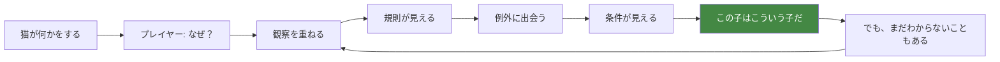

**AIが提供すべき体験の順序**

| 期間 | プレイヤーの認識 | AIが供給するもの |
|---|---|---|
| Day 1-5 | 「わからない」 | 断片的な行動。規則が見えない密度 |
| Day 6-12 | 「規則がある」 | 反復する行動パターン |
| Day 13-20 | 「例外がある」 | 文脈依存で規則が破れる場面 |
| Day 21-27 | 「条件が読める」 | 一貫した条件下での予測可能性 |
| Day 28-30 | 「でも全部はわからない」 | 説明のつかない揺らぎの残存 |

**⚠️ Day 28-30 で「完全に読める」状態にしてはならない。**
それは原則4（猫の気持ちは数値で見えない）と原則5（思い通りにならない）の否定である。

## 1.3 「リアルさ」と「ゲーム性」のバランス

### 三つの軸で判断する

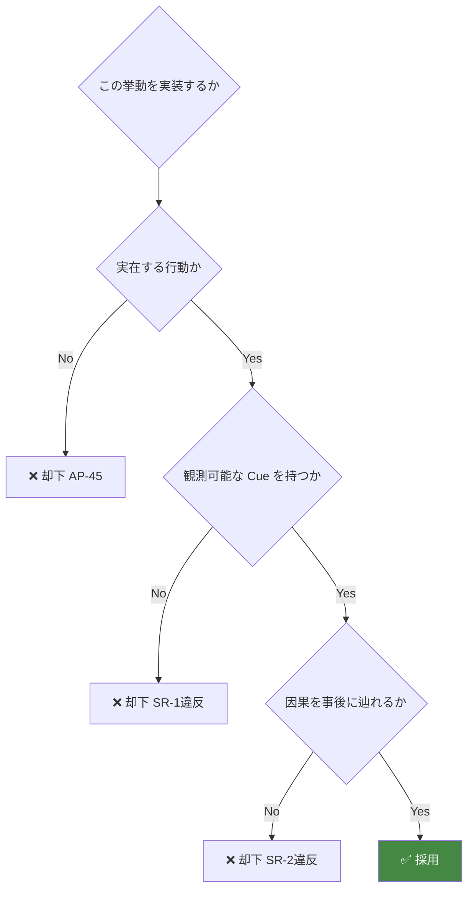

### リアルさを優先する領域

| 領域 | 理由 |
|---|---|
| ボディランゲージの意味 | 現実に転移する知識。誤りは有害 |
| 環境への反応則 | 同上 |
| 情動と行動の対応 | 同上 |
| 行動連鎖の自然さ | 観察の基礎 |
| 学習と記憶の性質 | 「なぜ思い通りにならないか」の根拠 |

### ゲーム性を優先する領域

| 領域 | 調整内容 | 理由 |
|---|---|---|
| **時間スケール** | 現実より圧縮 | 30日で理解に到達させる必要 |
| **行動の頻度** | 観察可能な密度に調整 | 1日1〜2分で読める量 |
| **規則性の明瞭さ** | 現実よりやや強調 | 3回で気づける（Player Flow ⑥6.5） |
| **揺らぎの幅** | 現実より抑制 | 規則が読めなくなるのを防ぐ |
| **重篤な健康事象** | **実装しない** | 憲章§9.4 |

**⚠️ 調整は「速度と密度」にのみ適用し、「意味」には適用しない。**

```
✅ 3日で慣れる（現実は1〜2週間）  → 時間の圧縮。意味は同じ
❌ 撫でると懐く（現実は違う）      → 意味の改変。禁止
```

## 1.4 AIが守る5つの誓約

| # | 誓約 | 対応する上位条項 |
|---|---|---|
| **AI-1** | 猫はプレイヤーの命令に従わない | 憲章 I-2 |
| **AI-2** | 猫の性格は実行中に変わらない | Pillar 5 / AA-125 |
| **AI-3** | 猫は世界の真実ではなく、自分の記憶で行動する | 完全最適行動の禁止 |
| **AI-4** | すべての行動には、観測可能な理由がある | SR-1 / SR-2 |
| **AI-5** | 完全なランダムは存在しない | SR-3 |

---

# ② Decision Architecture

> **目的**: 猫の意思決定機構を選定し、その構成と責務分担を確定する。
> **設計理由**: 単一のAI技法では本作の要求（個体差・一貫性・非決定性・可読性・記憶依存）を満たせない。要求ごとに適した技法を層として組み合わせる。
> **ゲーム体験への影響**: 「予測できるが、たまに外れる」の実装。この匙加減が体験の質を決める。
> **他システムとの依存関係**: Simulation Rules §6.1 の4層トリガー構造を実装形式に翻訳したもの。
> **実装時の注意点**: 層を跨いだショートカットを作らないこと。層の混濁がAIの非決定性を生む。

## 2.1 要求の整理

| # | 要求 | 出典 |
|---|---|---|
| REQ-1 | 突発刺激に即座に反応する | 04 §6.2 層1 |
| REQ-2 | 安全欲求が他をゲートする | 04 §2.3 |
| REQ-3 | 複数の連続的な欲求を比較して選ぶ | 04 §2.4 |
| REQ-4 | 個体差がパラメータで表現できる | SR-5 |
| REQ-5 | 予測可能だが完全決定的ではない | 設計目標 |
| REQ-6 | 行動が持続し、頻繁に切り替わらない | 04 §2.4 |
| REQ-7 | 多段階の行動連鎖を表現できる | 04 §2.5 |
| REQ-8 | 記憶（信念）に基づいて行動する | AI-3 |
| REQ-9 | 観測可能な微細表現を持つ | ⑩ |
| REQ-10 | 決定論的に再現できる | SR-3 |

## 2.2 技法比較

| 技法 | REQ-1 | REQ-3 | REQ-4 | REQ-5 | REQ-7 | REQ-8 | 可読性 | 拡張性 | 総合 |
|---|:---:|:---:|:---:|:---:|:---:|:---:|:---:|:---:|---|
| **FSM** | ◎ | × | △ | × | △ | △ | ◎ | × | 単体では不足 |
| **Behavior Tree** | ○ | △ | △ | △ | ◎ | ○ | ◎ | ○ | 連鎖に最適 |
| **Utility AI** | △ | ◎ | ◎ | ◎ | × | ○ | △ | ◎ | 選択に最適 |
| **GOAP** | × | ○ | △ | × | ◎ | ◎ | × | △ | **不適** |
| **HTN** | × | △ | × | × | ◎ | ○ | ○ | △ | **不適** |
| **ML（学習型）** | △ | ○ | × | ○ | △ | ○ | × | × | **不適** |

### GOAP / HTN を却下する理由（重要）

```
GOAP・HTN は「目標から逆算して計画を立てる」機構である。

しかし猫は多段階の計画を立てない。
そして「計画を立てるAI」は、必然的に最適行動へ収束する。

→ 設計目標「完全最適行動も禁止」に構造的に反する
→ さらに、プレイヤーが「攻略」できてしまう（AP-02 / N-02）
```

**⚠️ 計画するAIは、読まれると必勝法を生む。** 本作には不適。

### 機械学習を却下する理由

```
□ 決定論性（SR-3）を保証できない
□ 挙動の因果を事後に辿れない（SR-2 違反）
□ 個体差をデザイナーが意図的に設計できない（§9.4）
□ 学習の結果が行動学的に正しい保証がない（憲章§9.2）
□ Webブラウザでの実行コスト
```

**⚠️ 「猫が学習する」（⑤）は、機械学習ではなく明示的な記憶モデルで実装する。**

## 2.3 採用構成：4層ハイブリッド

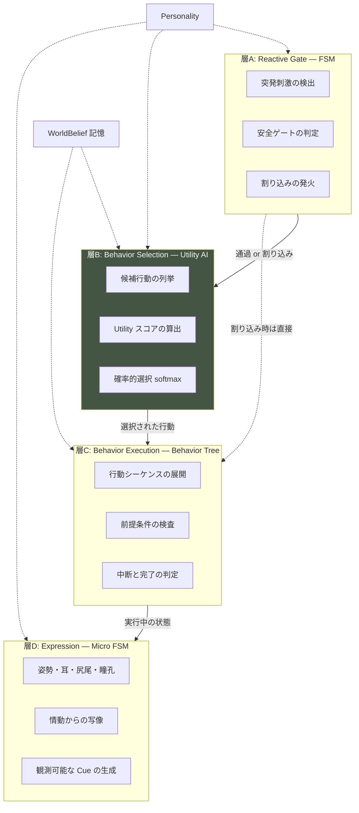

### 各層の責務

| 層 | 技法 | 責務 | 更新頻度 |
|---|---|---|---|
| **A** | FSM | 反射と安全ゲート。他層を中断する権限を持つ | Segment + 刺激時 |
| **B** | Utility AI | 何をするかを選ぶ | Segment |
| **C** | Behavior Tree | 選ばれた行動をどう遂行するか | Segment 内の進行 |
| **D** | Micro FSM | 状態をどう見せるか | Segment + Tick |

### 選定理由の要約

```
層A に FSM  : 反射は「即座・確実・優先」。確率的である必要がない
層B に Utility: 個体差がパラメータになり、非決定性が自然に入る
層C に BT   : 行動連鎖（04 §2.5）をデザイナーが読める形で記述できる
層D に FSM  : 観測可能な表現は離散的なほうが読み取りやすい
```

## 2.4 層B: Utility スコアの算出

**本作AIの中核。**

```
Score(behavior b) =
      Urgency(need(b))          … 欲求の切迫度        [04 §2.4]
    × SafetyGate(b)             … 安全ゲート          [04 §2.3]
    × ContextFit(b)             … 状況適合度
    × BeliefConfidence(b)       … 記憶の確信度        [⑤]
    × PersonalityBias(b)        … 個体傾向            [④]
    × Inertia(b)                … 持続バイアス
    × TimeOfDayFactor(b)        … 時間帯適合          [04 §1.2]
```

### 各因子の定義

| 因子 | 値域 | 意味 |
|---|---|---|
| `Urgency` | 0〜1 | `weight × pressure^γ`（04 §2.4） |
| `SafetyGate` | 0〜1 | `clamp(1 - safety × k_b, 0, 1)` |
| `ContextFit` | 0〜2 | 資源の有無・到達可能性・経路の安全度 |
| `BeliefConfidence` | 0.3〜1 | 記憶が古い／外れた経験があると低下 |
| `PersonalityBias` | 0.5〜2 | 気質軸からの倍率 |
| `Inertia` | 1.0〜1.5 | 直前と同一・連続する行動へのボーナス |
| `TimeOfDayFactor` | 0.5〜1.5 | 活動ピーク帯での補正 |

## 2.5 層B: 確率的選択（予測可能性の設計）

**argmax を使わない。** 上位k個から温度付き softmax で抽出する。

```
候補を Score 降順にソート
上位 k = 3 を取る
P(b_i) = exp(Score_i / τ) / Σ exp(Score_j / τ)
τ = 個体の「決断温度」（Personality パラメータ）
```

### 温度 τ が性格になる

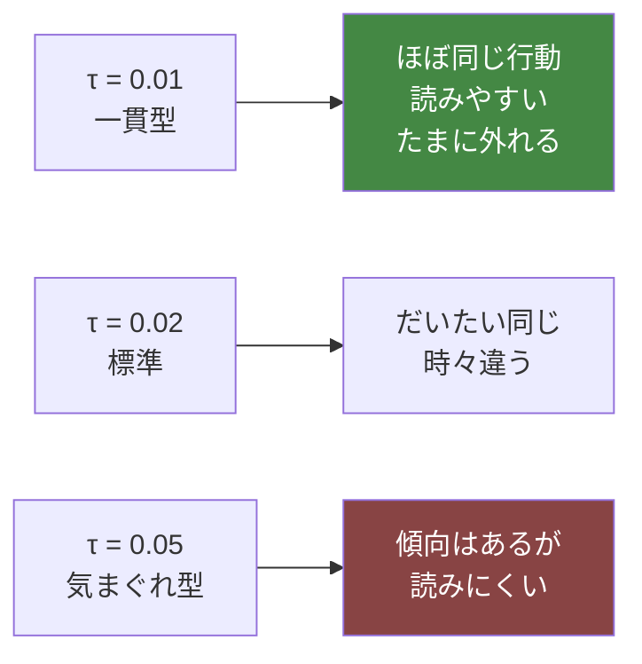

**⚠️ τ は「ランダム性の強さ」ではなく「性格」である。**
プレイヤーには「気まぐれな子」「几帳面な子」として観測される。

## 2.6 Utility スコア計算例（実例）

**状況**: Day 8 / SG-4 夕 / 個体：慎重観察型（T-1 神経質 0.7、T-6 高所選好 0.8）

**内部状態**
```
need.hunger      = 0.62      affect.vigilance  = 0.30
need.exploration = 0.48      affect.stressLoad = 0.25
need.vantage     = 0.30      need.safety       = 0.35
need.grooming    = 0.22      直前の行動        = 見晴らし
```

### 計算表

| 候補行動 | pressure | weight | Urgency<br/>`w×p^2.5` | k | SafetyGate | ContextFit | Inertia | **Score** |
|---|---|---|---|---|---|---|---|---|
| **摂食** | 0.62 | 0.85 | 0.258 | 0.8 | 0.72 | 0.52 ※1 | 1.0 | **0.0965** |
| **見晴らし** | 0.30 | 0.525 ※2 | 0.026 | 0.3 | 0.895 | 1.32 ※3 | 1.3 | **0.0398** |
| **退避** | 0.35 | 1.00 | 0.073 | — | — | 0.50 ※4 | 1.0 | **0.0363** |
| **探索** | 0.48 | 0.30 | 0.048 | 1.5 | 0.475 | 1.40 ※5 | 1.0 | **0.0319** |
| 毛づくろい | 0.22 | 0.40 | 0.009 | 0.4 | 0.86 | 1.00 | 1.0 | 0.0078 |

```
※1 食器あり(1.0) × 到達経路の安全度(0.65) × 人の近さ補正(0.8) = 0.52
※2 基準 0.35 × 個体の高所選好 1.5 = 0.525
※3 高所が空いている(1.2) × 日向(1.1) = 1.32
※4 現在 Zone の安全度が十分(0.7) → 退避の必要が薄い = 0.5
※5 新規物体が置かれている = 1.4
```

### 確率的選択（上位3候補）

| τ | 摂食 | 見晴らし | 退避 | プレイヤーから見た印象 |
|---|---|---|---|---|
| **0.01（一貫型）** | 99.7% | 0.2% | 0.1% | 「必ず食べに行く」 |
| **0.02（標準）** | 90.2% | 5.3% | 4.4% | 「たいてい食べるが、たまに行かない」 |
| **0.05（気まぐれ型）** | 61.6% | 19.9% | 18.5% | 「その日による」 |

**⚠️ この差が、まさに「性格」としてプレイヤーに読まれる。**
たった一つのパラメータが、数日の観察を経て人格として認識される。

## 2.7 層C: Behavior Tree の構造

**選ばれた行動を、多段階のシーケンスとして遂行する。**

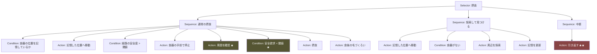

### ★ 印のノードが観察の題材になる

| ノード | プレイヤーが観測するもの | 意味 |
|---|---|---|
| **A3 周囲を確認** | 「食べる前に、一度部屋を見回した」 | 不安の残存 |
| **C3 安全欲求チェック** | — | ゲート判定 |
| **A9 引き返す** | **「食器の前まで来て、食べずに戻った」** | **最重要Cue（04 §2.3）** |

**⚠️ A9「引き返す」は、Behavior Tree の失敗パスである。**
失敗が観測可能な現象になる — これが SR-1 の実装形である。

### BT が担う「行動連鎖」（04 §2.5）

```
起床 → 伸びる → 爪とぎ → 移動 → 摂食 → 毛づくろい → 休息
```

**この連鎖は Utility では表現できない。** BT が担当する。

## 2.8 層D: Micro FSM（表現層）

情動から観測可能な表現への写像。詳細は ⑩。

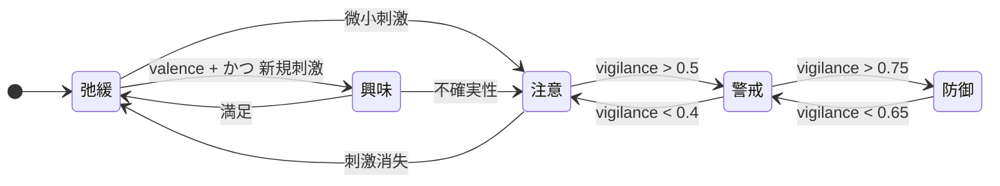

**⚠️ この層は行動を選ばない。** 選ばれた行動の**見え方**だけを決める。

## 2.9 1 Segment の意思決定シーケンス

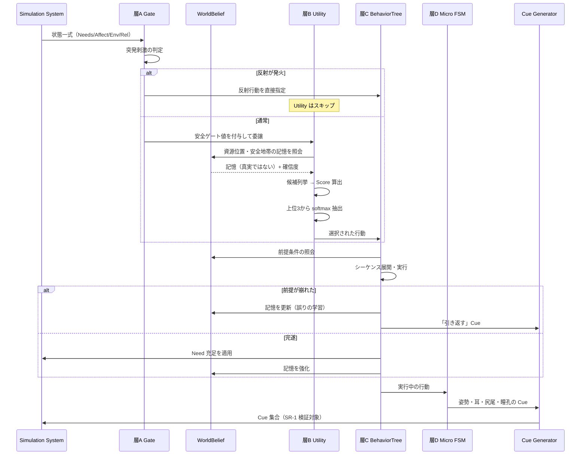

## 2.10 実装時の注意点

```
⚠️ 層A から層B をスキップして層C を呼ぶのは、反射時のみ
⚠️ Utility の因子を後から足すと、既存個体の挙動が全部変わる。因子の追加は本書の改訂を要する
⚠️ softmax の τ を 0 にしない（argmax 化して個体差が消える）
⚠️ Inertia を強くしすぎると、行動が固着して観察が退屈になる（上限 1.5）
⚠️ BT のノードは 5 階層を超えない（可読性）
⚠️ すべての乱数は RNG.stream("behavior") から取る（04 §8.4）
```

---

# ③ Internal Brain Model

> **目的**: 猫が内部に保持する情報を確定し、Cat AI の入力を定義する。
> **設計理由**: 04 で Needs / Affect / Relationship を定義済み。本章はそれに **AI固有の内部情報**（記憶・確信・注意・体調・縄張り）を追加し、猫の「頭の中」を完成させる。
> **ゲーム体験への影響**: 内部情報の豊かさが、行動の説明可能な多様性を決める。
> **他システムとの依存関係**: 04 の全変数を入力とし、⑤の記憶モデルを保持する。
> **実装時の注意点**: すべて L2 内部変数。L3 以上への露出は憲章 I-1 違反（SR-6）。

## 3.1 内部情報の全体像

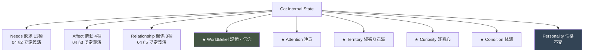

**★ = 本書で新規に定義する情報**

## 3.2 04 で定義済みの情報（参照のみ）

| 分類 | 変数 | 出典 |
|---|---|---|
| Needs | N-01 安全 / N-02 空腹 / N-03 渇き / N-04 排泄 / N-05 睡眠 / N-06 体温 / N-07 グルーミング / N-08 爪とぎ / N-09 休息 / N-10 探索 / N-11 遊び / N-12 高所 / N-13 社会的接触 | 04 §2 |
| Affect | A-1 覚醒 / A-2 情動価 / A-3 警戒 / A-4 蓄積ストレス | 04 §3 |
| Relationship | R-1 慣れ / R-2 信頼 / R-3 許容距離 | 04 §5 |
| Learning | 慣れ / 感作（刺激種別ごと） | 04 §3.5 |

## 3.3 ★ WorldBelief（記憶・信念）— 最重要

> ### **猫は世界の真実ではなく、自分の記憶に基づいて行動する。**（AI-3）

| 項目 | 内容 |
|---|---|
| **役割** | 資源の位置・安全地帯・危険地帯・人の習慣についての、猫自身の認識 |
| **増減条件** | 経験により形成・強化・減衰・修正 |
| **影響範囲** | 層B の `BeliefConfidence`、層C の前提条件 |
| **更新頻度** | 行動の完遂／失敗時、および Segment 単位の減衰 |
| **プレイヤーから見える兆候** | **記憶と現実がずれたときの行動**（下記） |

### 保持する信念の種類

| ID | 信念 | 内容 | 確信度の変化 |
|---|---|---|---|
| WB-1 | 資源位置 | 食器・水・トイレ・爪とぎがどこにあるか | 使用で強化、不在で急落 |
| WB-2 | 安全地帯 | どの Zone が安全か | 平穏な滞在で強化、驚愕体験で急落 |
| WB-3 | 危険地帯 | どの Zone を避けるべきか | 一度の嫌悪体験で強く形成 |
| WB-4 | 人の習慣 | 人がいつ・どこにいるか | 反復で強化 |
| WB-5 | 音源の意味 | どの音が何を予告するか | 連合学習 |
| WB-6 | 物体の性質 | どの物が安全／危険／興味深いか | 接触経験で形成 |

### 記憶と現実のずれが生む観測

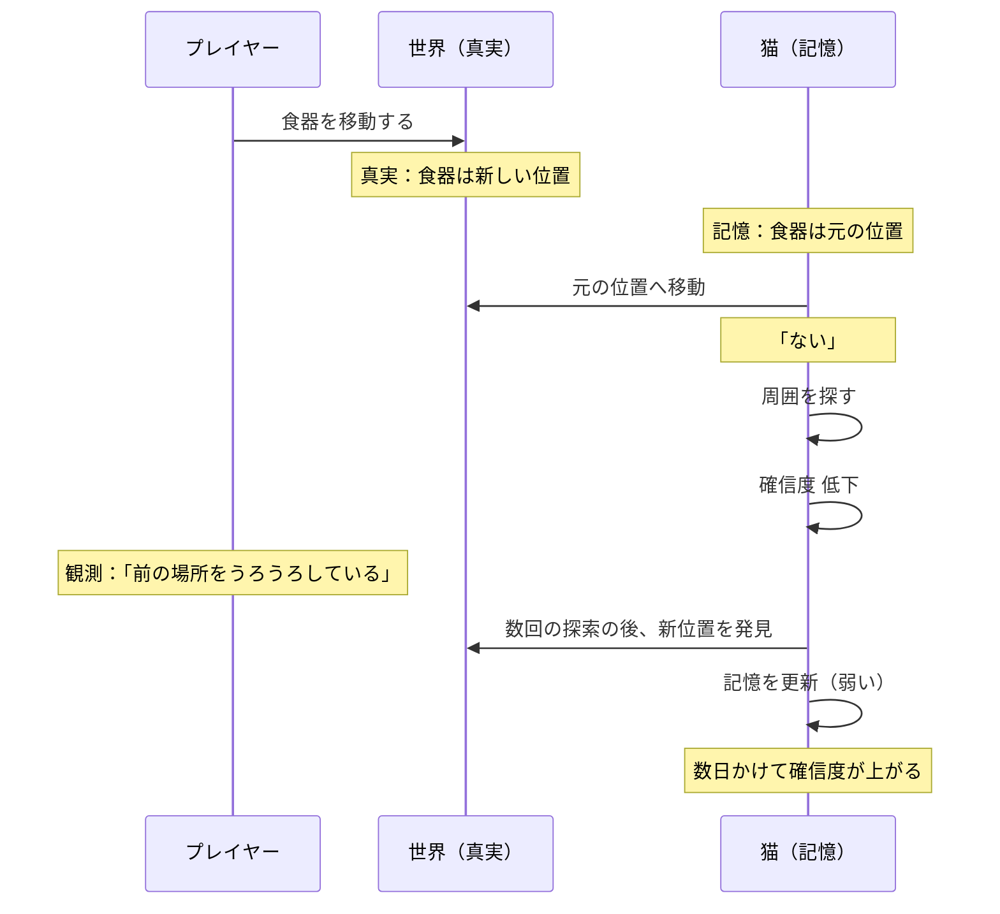

**⚠️ これが本作で最も価値のある挙動である。**

```
プレイヤー：「良かれと思って食器を動かした」
   ↓
猫：元の場所へ行く。ない。食べない。
   ↓
プレイヤー：「なんで食べないんだ？」
   ↓
観察：前の場所をうろうろしている
   ↓
理解：「場所を覚えていたのか。急に変えたら困るんだ」
```

**これは事実として正しく、現実の飼育でも重要な知識である。**（Reality Bridge 層1）

> 📋 **監修必須**: 猫の空間記憶と環境変化への適応期間（付録B-01）

### 確信度（Confidence）の設計

```
confidence ∈ [0.0, 1.0]

強化: 記憶通りだった → +Δ_up（小さい。何度も必要）
減衰: 時間経過      → -Δ_decay（遅い）
急落: 記憶と違った  → ×0.5（一度で大きく下がる）

行動への影響:
  confidence が低い → その資源への行動 Score が下がる
                   → 探索行動の Score が上がる
```

## 3.4 ★ Attention（注意）

| 項目 | 内容 |
|---|---|
| **役割** | 今、何に注意を向けているか。1つのみ保持 |
| **増減条件** | 新規刺激で切り替え。時間で減衰 |
| **影響範囲** | 視線方向・耳の向き・反応速度 |
| **更新頻度** | Tick |
| **見える兆候** | **視線の方向・耳の向き・頭の向き** |

```
attention = { target: Zone|Object|Sound|Human|None, intensity: 0-1, duration: n }
```

**設計上の価値**: 猫が「何を気にしているか」は、最も観測しやすく、最も推理に使える情報である。

```
「さっきから、あの窓のほうばかり見ている」
   → 何かある？ → 外の音？ → 鳥？ → 他の猫？
```

**⚠️ 注意の対象は Cue として観測可能だが、その理由は開示しない。**

## 3.5 ★ Territory（縄張り意識）

| 項目 | 内容 |
|---|---|
| **役割** | どの範囲を自分の領域と認識しているか |
| **増減条件** | 滞在時間とマーキングで拡大。侵害と環境変化で縮小 |
| **影響範囲** | Zone ごとの安心度補正、マーキング行動の発生 |
| **更新頻度** | Day |
| **見える兆候** | **頬すり・爪とぎの位置・行動範囲の広がり** |

```
territory[zone] ∈ [0.0, 1.0]

拡大: 平穏な滞在時間 × 頬すり × 爪とぎ
縮小: 掃除（自己臭の除去）、家具移動、来客
```

### 設計上の価値

```
Day 1-5   : territory はキャリー周辺のみ（極小）
Day 6-15  : 徐々に拡大
Day 16-30 : 部屋の大半

→ プレイヤーは「行動範囲が広がっている」ことを観測できる
→ これが数値なしで進行を表現する主要手段のひとつ
```

**⚠️ 「掃除したら行動範囲が縮んだ」という体験が発生する。**（04 §4.3 自己臭）
反直観的だが事実であり、優れた学習材料。

> 📋 **監修必須**: マーキング行動と縄張り形成（付録B-02）

## 3.6 ★ Curiosity（好奇心）

| 項目 | 内容 |
|---|---|
| **役割** | 新規性への接近傾向。探索行動の駆動 |
| **増減条件** | 新規物体の出現で上昇。調査完了で減衰。警戒で抑制 |
| **影響範囲** | N-10 探索の Score、新規物体への接近 |
| **更新頻度** | Segment |
| **見える兆候** | **遠くから見る → 近づく → 匂いを嗅ぐ → 前足で触る**の段階進行 |

### 好奇心と警戒の拮抗（重要）

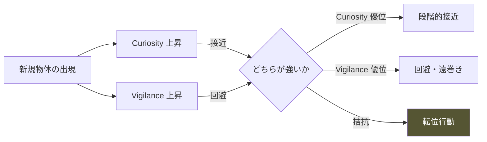

**新規物体への反応の4段階**（実在する行動パターン）

| 段階 | 行動 | 所要 |
|---|---|---|
| 1 | 遠くから見る | 数 Segment |
| 2 | 遠巻きに歩く | 1日 |
| 3 | 近づいて匂いを嗅ぐ | 1〜2日 |
| 4 | 前足で触る／使う | 2〜3日 |

**⚠️ この段階を飛ばさない。** これが「環境変更の効果は3日後」（04 §4.8）の実装形。

**⚠️ T-4 探索性が低い個体は、段階4に到達しないことがある。** 個体差。

## 3.7 ★ Condition（体調）— 慎重な扱いを要する

> ⚠️ **憲章§9.4 により、死・重篤な疾病は脅威・失敗条件として使用しない。**

| 項目 | 内容 |
|---|---|
| **役割** | 微細な体調の変動 |
| **値域** | 0.7〜1.0（**この範囲を出ない**） |
| **増減条件** | ストレス蓄積・環境・時間経過による緩やかな変動 |
| **影響範囲** | 活動量・食欲・グルーミング頻度の微調整 |
| **更新頻度** | Day |
| **見える兆候** | 活動量の低下／食欲の微減／毛づくろいの増減／丸まる時間の増加 |

### 設計方針

| ✅ 実装する | ❌ 実装しない |
|---|---|
| 微細な調子の波 | 病気 |
| 観測可能な変調のサイン | 症状の悪化 |
| ストレスと体調の緩やかな連動 | 治療・投薬 |
| 「なんとなく元気がない日」 | 死亡・危篤 |
| 回復 | 失敗条件 |

### なぜ「体調」を実装するのか

```
現実で猫を迎える人が、最初に身につけるべき能力は
「いつもと違うことに気づくこと」である。

体調の微細な変動を観測させることは、
・教育的価値が最も高い
・脅威として使わなければ、憲章に反しない
・「気づいたら獣医へ」という現実の行動に繋がる（Reality Bridge）
```

**⚠️ ただし本作は診断ゲームではない。**
「何の病気か」を当てさせない。「いつもと違う」に気づかせるだけである。

**⚠️ 30日以内に体調が悪化し続けることはない。** 波はあるが、下限は 0.7。

> 📋 **監修必須**: 体調変化の観測可能なサイン（付録B-03）

## 3.8 内部情報の更新頻度まとめ

| 情報 | 更新頻度 | 更新箇所（04 §8.1 の番号） |
|---|---|---|
| Needs | Segment | 4, 11, 17 |
| Affect | Segment | 6, 7, 8 |
| Relationship | Segment + Day | 9, 10 |
| **Attention** | **Tick** | 層D |
| **WorldBelief** | 行動完遂/失敗時 + Segment 減衰 | 層C |
| **Curiosity** | Segment | 層B の前 |
| **Territory** | Day | Day 終了処理 |
| **Condition** | Day | Day 終了処理 |
| Personality | **不変** | — |

---

# ④ Personality System

> **目的**: 個体差を、観察によって識別可能な形で体系化する。
> **設計理由**: 原則2「猫は個体差がある」と原則3「正解は一つではない」は、性格システムでのみ実装できる。ただし性格は**ラベルではなくパラメータの布置**であり、離散的なタイプは「よく使う座標のプリセット」にすぎない。
> **ゲーム体験への影響**: プレイヤーが「この子はこういう子だ」と語れるかどうかは、性格が観察で識別可能かにかかっている。
> **他システムとの依存関係**: 04 §9 の気質軸 T-1〜T-8 を基礎とし、層B の PersonalityBias と層Aの閾値を修飾する。
> **実装時の注意点**: **性格タイプ名を絶対にプレイヤーに表示しない**（憲章 I-1 の精神に反する）。

## 4.1 性格モデルの構造

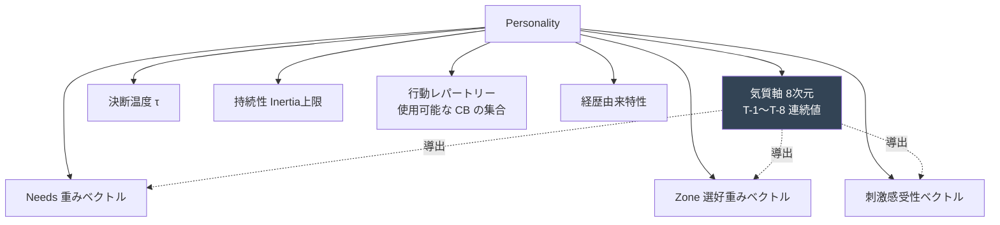

**⚠️ タイプは 8 次元空間の「点」である。** 連続空間であり、中間の個体も存在しうる。

## 4.2 気質軸（04 §9.2 の再掲）

| 軸 | 低 | 高 |
|---|---|---|
| T-1 神経質さ | 動じない | 些細な刺激に反応 |
| T-2 社会性 | 単独志向 | 人を求める |
| T-3 活動性 | 低活動 | 高活動 |
| T-4 探索性 | 新規回避 | 新規探索 |
| T-5 順応速度 | 慣れにくい | 慣れやすい |
| T-6 高所選好 | 床好み | 高所好み |
| T-7 遮蔽選好 | 開放好み | 隠れ好み |
| T-8 回復力 | 引きずる | 立ち直る |

## 4.3 性格タイプ一覧（24タイプ）

**表記**: T-1〜T-8 を `[神経/社会/活動/探索/順応/高所/遮蔽/回復]` の順で 0-9 表記。

| # | タイプ名 | 気質値 | τ |
|---|---|---|---|
| PT-01 | 慎重観察型 | `[7/4/4/3/5/8/6/5]` | 0.015 |
| PT-02 | 潜伏型 | `[8/2/3/2/3/3/9/3]` | 0.010 |
| PT-03 | 高所監視型 | `[6/3/5/4/5/9/4/6]` | 0.015 |
| PT-04 | 探索先行型 | `[3/5/7/8/7/6/3/7]` | 0.025 |
| PT-05 | 段階的接近型 | `[5/7/5/5/6/5/5/6]` | 0.020 |
| PT-06 | 距離維持型 | `[6/3/4/4/5/6/6/5]` | 0.015 |
| PT-07 | 音過敏型 | `[8/4/4/3/3/7/7/4]` | 0.012 |
| PT-08 | 動き過敏型 | `[8/4/5/4/4/6/6/4]` | 0.012 |
| PT-09 | ルーチン重視型 | `[5/5/4/2/4/5/5/6]` | **0.008** |
| PT-10 | 気まぐれ型 | `[4/5/6/6/6/5/4/7]` | **0.055** |
| PT-11 | 食事優先型 | `[5/4/5/4/6/4/5/6]` | 0.018 |
| PT-12 | 遊び駆動型 | `[3/6/8/7/7/6/3/8]` | 0.030 |
| PT-13 | 甘え表出型 | `[4/9/6/5/7/4/3/7]` | 0.025 |
| PT-14 | 単独志向型 | `[5/1/4/5/5/6/6/6]` | 0.015 |
| PT-15 | 環境依存型 | `[6/4/4/3/4/5/7/4]` | 0.015 |
| PT-16 | 早期回復型 | `[5/5/6/6/8/5/4/9]` | 0.022 |
| PT-17 | 長期引きずり型 | `[7/4/3/3/2/6/8/2]` | 0.012 |
| PT-18 | 新規回避型 | `[6/4/4/1/3/5/7/4]` | 0.010 |
| PT-19 | 新規探索型 | `[3/5/7/9/8/7/2/7]` | 0.030 |
| PT-20 | 夜行強化型 | `[5/4/7/5/5/6/5/6]` | 0.020 |
| PT-21 | 接触忌避型 | `[6/7/5/4/5/5/5/5]` | 0.015 |
| PT-22 | 発声型 | `[5/8/6/5/6/5/4/6]` | 0.025 |
| PT-23 | 縄張り強型 | `[5/4/6/6/5/7/4/6]` | 0.018 |
| PT-24 | 低活動型 | `[4/4/2/3/5/4/6/5]` | 0.012 |

## 4.4 各タイプの詳細

### PT-01 慎重観察型

| 項目 | 内容 |
|---|---|
| **特徴** | 行動の前に必ず周囲を確認する。決断が遅いが、一度決めると一貫している |
| **初期傾向** | Day 1-7 は高所または遮蔽 Zone に滞在。姿はときどき見える |
| **環境による変化** | 安全な高所があると早期に落ち着く。なければ長期化 |
| **行動優先度** | 見晴らし > 安全 > 摂食 > 探索 |
| **苦手な状況** | 見通しの悪い部屋。逃走路のない隠れ場所 |
| **得意な状況** | 高所があり、人の動線から離れた資源配置 |
| **識別できる観測** | 食器の前で必ず一度立ち止まって周囲を見る |

### PT-02 潜伏型

| 項目 | 内容 |
|---|---|
| **特徴** | 徹底して隠れる。姿を見せる時間が極端に短い |
| **初期傾向** | Day 1-12 はほぼ姿を見せない。痕跡のみ |
| **環境による変化** | 良質な隠れ場所があると、そこを起点に少しずつ出る |
| **行動優先度** | 隠れる > 安全 > 排泄 > 摂食 |
| **苦手な状況** | 隠れ場所の撤去。掃除。開放的な空間 |
| **得意な状況** | 複数の隠れ場所。低照度。静穏 |
| **識別できる観測** | 痕跡だけが毎日確実に増える。姿は稀 |

⚠️ **本タイプは Player Flow Phase ② の体験が最も強く出る。** 離脱リスクが高いため、痕跡の生成密度を上げる。

### PT-03 高所監視型

| 項目 | 内容 |
|---|---|
| **特徴** | 常に高い場所にいる。降りてこない。しかし隠れはしない |
| **初期傾向** | 到着直後から高所を探す |
| **環境による変化** | 高所がないと強いストレス。設置すると急速に落ち着く |
| **行動優先度** | 見晴らし > 安全 > 休息 > 摂食 |
| **苦手な状況** | 高低差のない部屋。高所への経路の遮断 |
| **得意な状況** | 段階的な高さの構造。窓辺の高所 |
| **識別できる観測** | 床にいる時間が極端に短い。見下ろしている |

### PT-04 探索先行型

| 項目 | 内容 |
|---|---|
| **特徴** | 警戒が解けると即座に部屋中を調べ始める |
| **初期傾向** | Day 3-5 で早くも動き出す |
| **環境による変化** | 変化を歓迎する。ただし過剰な変化はストレス |
| **行動優先度** | 探索 > 遊び > 摂食 > 見晴らし |
| **苦手な状況** | 何も変化のない環境（退屈による問題行動） |
| **得意な状況** | 適度に変化があり、調べる対象が多い |
| **識別できる観測** | 新しい物にすぐ近づく。物の位置が毎日変わる |

### PT-05 段階的接近型

| 項目 | 内容 |
|---|---|
| **特徴** | 明確な段階を踏んで距離を詰める。逆行も明確 |
| **初期傾向** | Day 5 頃から「見る」、Day 12 頃「同室」、Day 20 頃「接近」 |
| **環境による変化** | 一貫した関わりで着実に進む。裏切りで明確に後退 |
| **行動優先度** | 社会的接触 > 安全 > 摂食 |
| **苦手な状況** | 予測不能な人の動き。急な接近 |
| **得意な状況** | ルーチンが安定した生活 |
| **識別できる観測** | **進捗が最も読みやすい。教科書的な個体** |

⚠️ **本タイプは初回プレイ用の推奨個体候補。** 学習ラインが最も成立しやすい。

### PT-06 距離維持型

| 項目 | 内容 |
|---|---|
| **特徴** | 一定の距離を保ち続ける。それ以上でもそれ以下でもない |
| **初期傾向** | 早期に「同室は可」まで進むが、そこで止まる |
| **環境による変化** | 距離を詰めようとすると後退。放置すると維持 |
| **行動優先度** | 安全 > 生理欲求 > 見晴らし |
| **苦手な状況** | 接近の試み |
| **得意な状況** | 干渉のない共存 |
| **識別できる観測** | **同じ距離で止まる。近づくと同じだけ下がる** |

⚠️ **本タイプは「懐かせる」目標の否定に最も有効。** 30日で接触に至らないことが正常。

### PT-07 音過敏型

| 項目 | 内容 |
|---|---|
| **特徴** | 音に対する反応が突出して強い。視覚刺激には比較的鈍い |
| **初期傾向** | 生活音のたびに退避 |
| **環境による変化** | 静穏な環境で急速に改善。騒音下では長期化 |
| **行動優先度** | 安全 > 隠れる > 生理欲求 |
| **苦手な状況** | 突発音。音源の見えない音。雨・風 |
| **得意な状況** | 遮音された隠れ場所。予測可能な生活音 |
| **識別できる観測** | **音がした瞬間だけ反応する。動きには無反応** |

### PT-08 動き過敏型

| 項目 | 内容 |
|---|---|
| **特徴** | 人の動きの速さ・大きさに強く反応する。音には比較的鈍い |
| **初期傾向** | 人が立ち上がるだけで退避 |
| **環境による変化** | ゆっくり動くことで急速に改善 |
| **行動優先度** | 安全 > 見晴らし > 生理欲求 |
| **苦手な状況** | 急な動き。立位。正対 |
| **得意な状況** | 座位で静かに過ごす人 |
| **識別できる観測** | **音には反応しないが、動くと逃げる** |

⚠️ PT-07 と PT-08 の対比が、Player Flow ⑥6.4「文脈を見る」の最良の教材になる。

### PT-09 ルーチン重視型

| 項目 | 内容 |
|---|---|
| **特徴** | 極めて規則正しい。毎日同じ時間に同じことをする |
| **初期傾向** | 数日でルーチンが確立し、以後ほぼ変わらない |
| **環境による変化** | 変化を強く嫌う。ルーチンの崩壊が最大のストレス |
| **行動優先度** | 時間帯に依存（固定的） |
| **苦手な状況** | 生活リズムの変化。予定外の出来事 |
| **得意な状況** | 毎日が同じ |
| **識別できる観測** | **時計のように正確。τ=0.008 で最も予測しやすい** |

⚠️ **本タイプは「規則の発見」（Player Flow ⑥6.4 階層C）が最も容易。** 初心者向け。

### PT-10 気まぐれ型

| 項目 | 内容 |
|---|---|
| **特徴** | 同じ状況でも違う行動を取る。傾向はあるが読みにくい |
| **初期傾向** | 日によって大きく異なる |
| **環境による変化** | 環境の影響も一定しない |
| **行動優先度** | 変動的 |
| **苦手な状況** | 特になし（適応的） |
| **得意な状況** | 特になし |
| **識別できる観測** | **τ=0.055。統計を取らないと傾向が見えない** |

⚠️ **本タイプは上級者向け。** 初回プレイには割り当てない。

### PT-11 食事優先型

| 項目 | 内容 |
|---|---|
| **特徴** | 空腹の重みが突出して高い。警戒より食欲が勝つことがある |
| **初期傾向** | Day 1-2 から食べる。ただし人がいない時のみ |
| **環境による変化** | 食事環境の質に強く依存 |
| **行動優先度** | 摂食 > 安全 > その他 |
| **苦手な状況** | 食事場所が落ち着かない。食事の中断 |
| **得意な状況** | 静かで隔離された食事場所 |
| **識別できる観測** | 早期から餌が減る。しかし姿は見せない |

### PT-12 遊び駆動型

| 項目 | 内容 |
|---|---|
| **特徴** | 狩猟欲求が強い。遊びが最大の安心のサイン |
| **初期傾向** | 落ち着くと急に活発になる |
| **環境による変化** | 遊べる対象がないとフラストレーション |
| **行動優先度** | 遊び > 探索 > 摂食 |
| **苦手な状況** | 刺激のない環境。長時間の単調 |
| **得意な状況** | 動く対象。狩猟を模した構造 |
| **識別できる観測** | 遊びの出現が明確な転換点になる |

### PT-13 甘え表出型

| 項目 | 内容 |
|---|---|
| **特徴** | 社会性が非常に高い。ただし警戒が解けるまでは出ない |
| **初期傾向** | 警戒期は普通。解けると急速に接近する |
| **環境による変化** | 孤独がストレスになる稀なタイプ |
| **行動優先度** | 社会的接触 > 遊び > 摂食 |
| **苦手な状況** | 長時間の不在。無視 |
| **得意な状況** | 人が同じ空間にいる時間が長い |
| **識別できる観測** | **転換が急激。「別の猫みたい」に見える** |

### PT-14 単独志向型

| 項目 | 内容 |
|---|---|
| **特徴** | 人を必要としない。しかし怯えてもいない |
| **初期傾向** | 早期に落ち着くが、近づいてこない |
| **環境による変化** | 環境が良ければ満足して暮らす |
| **行動優先度** | 生理欲求 > 探索 > 見晴らし（社会は最下位） |
| **苦手な状況** | 過度な干渉 |
| **得意な状況** | 良い環境と、適度な距離 |
| **識別できる観測** | **落ち着いているのに近づかない**（PT-06 との差異が難問） |

### PT-15 環境依存型

| 項目 | 内容 |
|---|---|
| **特徴** | 環境の質に行動が強く左右される。人よりも部屋に反応する |
| **初期傾向** | 部屋次第 |
| **環境による変化** | **最も大きい**。環境改善の効果が明確に出る |
| **行動優先度** | Zone の質に依存 |
| **苦手な状況** | 資源の集中配置。逃走路の不足 |
| **得意な状況** | 分散配置。高低差。複数の隠れ場所 |
| **識別できる観測** | **環境を変えると明確に反応する。Pillar 3 の教材** |

### PT-16 早期回復型

| 項目 | 内容 |
|---|---|
| **特徴** | 驚いてもすぐ戻る。失敗が尾を引かない |
| **初期傾向** | 順調に進む |
| **環境による変化** | 多少の失敗を許容する |
| **行動優先度** | 標準的 |
| **苦手な状況** | 継続的な高ストレス |
| **得意な状況** | ほとんどの環境 |
| **識別できる観測** | 逃げてもすぐ戻ってくる |

### PT-17 長期引きずり型

| 項目 | 内容 |
|---|---|
| **特徴** | 一度の嫌な経験が数日〜1週間残る |
| **初期傾向** | 慎重 |
| **環境による変化** | 悪化しやすく、回復に時間がかかる |
| **行動優先度** | 安全 > 隠れる > 生理欲求 |
| **苦手な状況** | 過干渉。急な接近。来客 |
| **得意な状況** | 一貫して静かな環境 |
| **識別できる観測** | **悪循環に最も入りやすい。Phase ④ が強く出る** |

⚠️ **本タイプは Player Flow ⑧8.4 のセーフティネットが最も重要になる。**

### PT-18 新規回避型

| 項目 | 内容 |
|---|---|
| **特徴** | 新しいものを徹底的に避ける。慣れるのに時間がかかる |
| **初期傾向** | すべてが新規なので、当初は極度に警戒 |
| **環境による変化** | 環境変更が逆効果になりうる稀なタイプ |
| **行動優先度** | 既知のもの > 未知のもの |
| **苦手な状況** | 家具の追加。模様替え。新しい物 |
| **得意な状況** | **何も変えないこと** |
| **識別できる観測** | **良かれと思った追加が、明確に裏目に出る** |

⚠️ **本タイプは原則3（正解は一つではない）の最強の教材。**
「環境を良くする＝物を足す」という思い込みを打ち砕く。

### PT-19 新規探索型

| 項目 | 内容 |
|---|---|
| **特徴** | 新しいものに真っ先に近づく |
| **初期傾向** | 警戒が解けるのが早い |
| **環境による変化** | 変化を歓迎する |
| **行動優先度** | 探索 > 遊び > その他 |
| **苦手な状況** | 変化のない環境。**脱走リスクが最も高い**（⑧） |
| **得意な状況** | 安全に探索できる環境 |
| **識別できる観測** | 置いたその日に調べに来る |

### PT-20 夜行強化型

| 項目 | 内容 |
|---|---|
| **特徴** | 活動が未明・深夜に極端に偏る |
| **初期傾向** | 在室時間帯にほとんど姿を見せない |
| **環境による変化** | 徐々に人の生活時間に寄る（ただし遅い） |
| **行動優先度** | 時間帯依存が最も強い |
| **苦手な状況** | 日中の干渉（睡眠の妨害） |
| **得意な状況** | 夜間に安全に活動できる環境 |
| **識別できる観測** | **痕跡は豊富だが姿は見えない。時間の観察が鍵** |

### PT-21 接触忌避型

| 項目 | 内容 |
|---|---|
| **特徴** | 社会性は高いが、身体接触は許容しない |
| **初期傾向** | 早期に同室・接近まで進む |
| **環境による変化** | 接触の試みで明確に後退 |
| **行動優先度** | 社会的接触（並在のみ） > その他 |
| **苦手な状況** | 触ろうとする手 |
| **得意な状況** | そばにいるが触れない関係 |
| **識別できる観測** | **すぐそばに来るのに、手を伸ばすと離れる** |

⚠️ **本タイプは「懐く＝触れる」という誤解を打ち砕く最良の教材。**（Experience Bible SF-3）

### PT-22 発声型

| 項目 | 内容 |
|---|---|
| **特徴** | よく鳴く。鳴き声で状況を伝えようとする |
| **初期傾向** | 警戒期は無音。落ち着くと鳴き始める |
| **環境による変化** | 応答があると鳴く頻度が上がる |
| **行動優先度** | 標準 + 発声行動の頻度が高い |
| **苦手な状況** | 無反応 |
| **得意な状況** | 反応が返る環境 |
| **識別できる観測** | **鳴き声の種類と文脈の対応が読める稀なタイプ** |

📋 **監修必須**: 成猫の meow は主に対人的なシグナルである（付録B-04）

### PT-23 縄張り強型

| 項目 | 内容 |
|---|---|
| **特徴** | マーキング行動が多い。territory の拡大が速い |
| **初期傾向** | 落ち着くと頬すり・爪とぎが増える |
| **環境による変化** | **掃除の影響が最も大きい** |
| **行動優先度** | マーキング > 探索 > その他 |
| **苦手な状況** | 頻繁な掃除。物の移動 |
| **得意な状況** | 自分の匂いが残る環境 |
| **識別できる観測** | **掃除の翌日に明確な変化が出る** |

### PT-24 低活動型

| 項目 | 内容 |
|---|---|
| **特徴** | 全体に活動量が少ない。落ち着いているのか元気がないのか区別が難しい |
| **初期傾向** | 動かない |
| **環境による変化** | 快適な休息場所の質に依存 |
| **行動優先度** | 休息 > 睡眠 > 摂食 |
| **苦手な状況** | 快適な休息場所の不在 |
| **得意な状況** | 暖かく静かな場所 |
| **識別できる観測** | **「元気がない」との判別が最も難しい**（③3.7 体調との対比） |

⚠️ **本タイプは Condition（体調）との識別が観察の課題になる。**
「いつも動かない子」と「今日は動かない子」の違い — 最高難度かつ最も教育的。

## 4.5 タイプの配置戦略

| 難度 | タイプ | 用途 |
|---|---|---|
| **易** | PT-05, PT-09, PT-15, PT-16 | 初回プレイ推奨 |
| **中** | PT-01, PT-03, PT-04, PT-07, PT-08, PT-11, PT-12, PT-13, PT-19, PT-22, PT-23 | 標準 |
| **難** | PT-02, PT-06, PT-14, PT-17, PT-18, PT-20, PT-21, PT-24 | 周回向け |
| **最難** | PT-10 | 上級者向け |

**⚠️ 難度は「クリアの難しさ」ではなく「読み取りの難しさ」である**（AP-09）。
どのタイプでも30日は終わり、どのタイプでも詰みは発生しない。

## 4.6 実装時の注意点

```
⚠️ タイプ名をプレイヤーに一切表示しない（性格ラベルは内部状態の開示に当たる）
⚠️ タイプは 8次元空間のプリセット。中間個体を許容する設計にする
⚠️ タイプごとに固有の分岐コードを書かない（AA-57）。パラメータのみで表現する
⚠️ どのタイプでも学習ラインが最低3本成立することを検証する（04 §9.5）
⚠️ 「良い性格／悪い性格」を実装上も示唆しない
⚠️ 性格は実行中に変化しない（AI-2 / Pillar 5）
```

---

# ⑤ Learning Model

> **目的**: 猫が経験から学ぶ機構を定義し、AI-3（記憶で行動する）を実装可能にする。
> **設計理由**: 学習しない猫は機械である。学習する猫は生き物になる。同時に、記憶の**不完全さ**こそが「思い通りにならない」の正体である。
> **ゲーム体験への影響**: 「昨日できたことが今日できない」「覚えるのに時間がかかる」という体験の源。
> **他システムとの依存関係**: 04 §3.5 の慣れ・感作を包含し、WorldBelief（③3.3）を構築する。
> **実装時の注意点**: 機械学習ではない。すべて明示的・決定論的な記憶モデル（SR-3）。

## 5.1 4種の学習

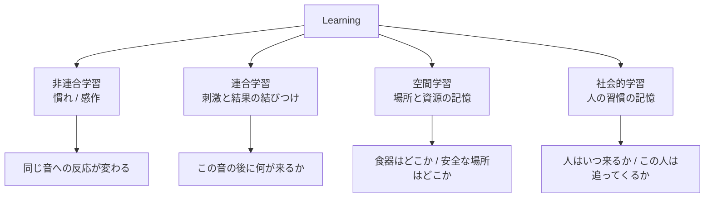

| 学習 | 04 での定義 | 本書での追加 |
|---|---|---|
| 非連合学習 | §3.5 で定義済み | 実装詳細のみ |
| **連合学習** | — | ★ 本書で新規定義 |
| **空間学習** | — | ★ 本書で新規定義 |
| **社会的学習** | — | ★ 本書で新規定義 |

## 5.2 連合学習（Associative Learning）

**刺激と、その後に起きたことの結びつけ。**

```
association[cue][outcome] ∈ [0.0, 1.0]

形成: cue の後に outcome が続く → +Δ
消去: cue の後に outcome が続かない → -Δ_ext（形成より遅い）
```

### 実装する連合の種類

| Cue | Outcome | 効果 | 形成速度 |
|---|---|---|---|
| 特定の音 | 人が来る | 事前に退避／事前に接近 | 速い（3〜5回） |
| 特定の音 | 食事 | 期待行動（音で食器へ向かう） | **非常に速い（2〜3回）** |
| 人の特定の動作 | 接近される | その動作で退避 | 速い |
| 人の特定の動作 | 何も起きない | 無反応化 | 遅い |
| 特定の Zone | 驚愕体験 | その Zone の回避 | **1回で形成** |
| 特定の Zone | 平穏 | 安全地帯化 | 遅い（数日） |

### 非対称性（重要）

```
負の連合（嫌な経験）: 1回で形成、消去に数日〜数週間
正の連合（良い経験）: 数回必要、消去は比較的速い
```

**これは生存上合理的であり、事実として正しい。**
そして「一度の失敗が長く残る」という体験の根拠になる。

> 📋 **監修必須**: 連合学習の形成・消去速度（付録B-05）

### 設計上の価値

```
Day 10: プレイヤーが急に立ち上がる → 猫が驚く
   ↓ 連合が1回で形成
Day 11-20: プレイヤーが立ち上がろうとしただけで、猫が退避する
   ↓ プレイヤーの観察
「立つと逃げる」→「ゆっくり立てば？」→ 検証 → 理解
```

## 5.3 空間学習（Spatial Learning）

**WorldBelief WB-1〜WB-3 の構築。**

```
spatialMemory[zone] = {
    resourceType : 何があると記憶しているか
    confidence   : 0.0〜1.0
    lastVerified : 最後に確認した Segment
    valence      : この場所の情動的な色（正 / 負）
    visitCount   : 訪問回数
}
```

### 記憶の形成と減衰

| 事象 | confidence の変化 |
|---|---|
| その場所で資源を利用できた | +0.15 |
| 行ったが資源がなかった | **×0.5**（急落） |
| 時間経過（1 Day） | -0.02 |
| その場所で驚愕体験 | valence 急落 + 回避リストへ |
| その場所で平穏に長時間過ごした | valence 上昇 |

### 環境変更後の再学習曲線

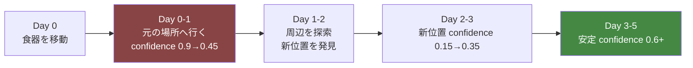

**⚠️ この曲線が「環境変更の効果は3日後」（04 §4.8）の実装形である。**

**⚠️ 複数の資源を同時に動かすと、再学習が並行して発生し、混乱が長期化する。**
これは意図された挙動であり、「一度に全部変えない」という現実の助言と一致する。

## 5.4 社会的学習（Social Learning）

**人の習慣の記憶。WB-4。**

```
humanModel = {
    presencePattern[segment] : 各 Segment に人がいる確率の記憶
    approachTendency         : この人は近づいてくるか
    pursuitTendency          : 逃げたときに追ってくるか  ★最重要
    movementPredictability   : 動きが読めるか
    respectHistory           : 意思を尊重された回数
}
```

### pursuitTendency（追跡傾向）の重要性

```
猫が逃げる
   ↓
人が追う   → pursuitTendency ↑ → 「この人は追ってくる」
   → 以後、より早く・より遠くへ逃げる
   → ToleranceDistance が縮小（04 §5.4）

人が追わない → pursuitTendency ↓ → 「この人は追ってこない」
   → 逃げる距離が短くなる
   → やがて逃げなくなる
```

**⚠️ これが Trust の最大の上昇要因（04 §5.3）の内部実装である。**

**設計上の価値**: プレイヤーは「追わなかったこと」の効果を、数日後に観測する。
即時のフィードバックがないため、気づくには観察と記憶が要る。**最も深い学習ライン。**

### presencePattern の学習

```
Day 1-5   : 人がいつ来るか予測できない → 常に警戒
Day 6-12  : パターンを学習し始める → 予測可能な時間帯で弛緩
Day 13+   : 「この時間は人が来ない」を知っている → 活動する
```

**⚠️ 不規則な生活は、この学習を阻害する。**
プレイヤーが毎日違う時間に違うことをすると、猫は落ち着かない。
これも現実の知識と一致する。

## 5.5 忘却モデル

**すべての記憶は減衰する。ただし速度が異なる。**

| 記憶 | 半減期の目安 | 30日以内の消失 |
|---|---|---|
| 慣れ（habituation） | 5〜7日 | 部分的 |
| **感作（sensitization）** | **20日以上** | **しない** |
| 正の連合 | 7〜10日 | 部分的 |
| **負の連合** | **25日以上** | **しない** |
| 空間記憶（confidence） | 15日 | 部分的 |
| 空間記憶（危険地帯） | **30日以上** | **しない** |
| 人の習慣モデル | 10日 | 部分的 |
| **pursuitTendency** | **20日以上** | ほぼしない |

### 忘却の非対称性が意味すること

```
良い経験は忘れられる。悪い経験は残る。

→ 「良いことを続ける」必要がある
→ 「一度の悪いこと」は取り返しに時間がかかる
→ しかし、決して消えないわけではない（詰みの禁止）
```

**⚠️ 30日という期間設定と、忘却曲線は整合していなければならない。**
負の記憶が30日で完全に消えると、「取り返しがつく」体験になりすぎる。
消えないが、上書きは可能 — これが正しい設計。

## 5.6 学習の観測可能性（SR-1）

| 学習内容 | 観測される Cue |
|---|---|
| 慣れの進行 | 同じ音への反応時間が短くなる／反応しなくなる |
| 感作の発生 | 同じ音への反応が強くなる／予期して身構える |
| 正の連合形成 | 音がしただけで食器へ向かう |
| 負の連合形成 | その動作の予兆で退避する |
| 空間記憶の形成 | 迷わず目的地へ向かう |
| 空間記憶の混乱 | **元の場所をうろうろする** |
| 危険地帯の学習 | その Zone を明確に迂回する |
| 人の習慣の学習 | 特定の時間帯にだけ姿を見せる |
| pursuitTendency の低下 | 逃げる距離が短くなる／逃げなくなる |

**⚠️ 学習の進行を数値・進捗バーで示さない**（憲章 I-1）。
観測されるのは、上記の**行動の変化**のみ。

## 5.7 実装時の注意点

```
⚠️ 機械学習を使わない（SR-3 決定論性・SR-2 因果追跡）
⚠️ すべての記憶更新は明示的な規則で行う
⚠️ 記憶を「正解への収束」にしない（学習しても最適にならない）
⚠️ 負の記憶に下限を設ける（完全な忌避を作らない = 詰みの禁止）
⚠️ 記憶はセーブ対象（Architecture §9.2 Persisted）
⚠️ 記憶容量に上限を設ける（Zone 数 × 資源種別。無制限にしない）
```

---

# ⑥ Behavior Library

> **目的**: 猫が取りうる行動を網羅的に体系化し、層B の候補集合と層C の実行単位を確定する。
> **設計理由**: 行動の種類数が観察の豊かさを決める。ただし種類を増やすだけでは意味がなく、**それぞれが異なる内部状態を示唆する**ことが要件である。
> **ゲーム体験への影響**: プレイヤーが読み取れる情報の総量。
> **他システムとの依存関係**: 04 §6.3 の 21 カテゴリを展開したもの。各行動が Trace と Cue を生成する。
> **実装時の注意点**: すべて実在する行動であること（AP-45）。存在しない行動を創作しない。

## 6.1 04 のカテゴリとの対応

| 04 のカテゴリ | 本書の展開範囲 | 件数 |
|---|---|---|
| B-01 逃走 / B-02 硬直 / B-03 反射的注視 | CB-070〜CB-078 | 9 |
| B-04 退避移動 / B-05 隠れる | CB-062〜CB-069 | 8 |
| B-06 高所へ移動 | CB-001〜CB-012 内 | — |
| B-07 警戒静止 | CB-070〜CB-078 内 | — |
| B-08 摂食 / B-09 飲水 | CB-032〜CB-040 | 9 |
| B-10 排泄 | CB-041〜CB-046 | 6 |
| B-11 睡眠 / B-12 休息 | CB-023〜CB-031 | 9 |
| B-13 毛づくろい | CB-047〜CB-054 | 8 |
| B-14 爪とぎ | CB-105〜CB-110 内 | — |
| B-15 探索 | CB-055〜CB-064 | 10 |
| B-16 遊び | CB-065〜CB-074 | 10 |
| B-17 接近 / B-18 並在 | CB-088〜CB-097 | 10 |
| B-19 見晴らし | CB-013〜CB-022 内 | — |
| B-20 転位行動 | CB-121〜CB-126 | 6 |
| B-21 マーキング | CB-105〜CB-110 | 6 |

**総計 126 行動**

## 6.2 記法

```
層  : 1=反射 / 2=安全 / 3=欲求 / 4=機会 / D=転位
優先: 同一層内での基礎優先度（1-5、大きいほど優先）
```

---

## A. 移動（CB-001〜CB-012）

| ID | 行動 | 層 | 優先 | 発生条件 | 終了条件 | 競合 |
|---|---|---|---|---|---|---|
| CB-001 | 通常歩行 | 3/4 | 3 | 目的地がある | 到着 | 全移動 |
| CB-002 | 低い姿勢で歩く | 2 | 4 | vigilance 0.5-0.7 | 到着／警戒解除 | CB-001 |
| CB-003 | 忍び歩き | 4 | 2 | 狩猟対象を認識 | 接近完了／対象消失 | CB-001 |
| CB-004 | 走る | 1/4 | 5 | 逃走／遊び興奮 | 目的地／興奮低下 | 全移動 |
| CB-005 | 跳び上がる | 3/4 | 3 | 高所へ移動、経路に段差 | 着地 | — |
| CB-006 | 跳び降りる | 3/4 | 3 | 高所から降りる | 着地 | — |
| CB-007 | 段階的に登る | 3/4 | 3 | 段差のある経路 | 到達 | CB-005 |
| CB-008 | 立ち止まる | 2/3 | 4 | 移動中に刺激／不確実性 | 判断完了 | 全移動 |
| CB-009 | 引き返す | 2/3 | 4 | 前提条件の破綻（BT失敗） | 出発点へ帰還 | ★重要Cue |
| CB-010 | 縁を伝って移動 | 2 | 3 | vigilance 中、開けた空間の横断 | 到着 | CB-001 |
| CB-011 | 迂回する | 3 | 3 | 経路上に危険地帯の記憶 | 到着 | CB-001 |
| CB-012 | うろつく | 3 | 2 | 空間記憶の confidence 低下 | 発見／断念 | ★重要Cue |

**★ CB-009・CB-012 が学習と記憶の観測窓である。**

## B. 姿勢・体勢（CB-013〜CB-022）

| ID | 行動 | 層 | 優先 | 発生条件 | 終了条件 | 競合 |
|---|---|---|---|---|---|---|
| CB-013 | 座る（前足そろえ） | 3/4 | 2 | 静止 + 低警戒 | 移動開始 | 全姿勢 |
| CB-014 | 香箱座り | 4 | 2 | 弛緩 + 静止 | 移動／警戒 | 全姿勢 |
| CB-015 | 伏せる（足を体の下） | 2/3 | 3 | 中程度の警戒。即座に動ける | 移動／弛緩 | 全姿勢 |
| CB-016 | 横になる | 4 | 2 | 弛緩 + 安全 | 移動 | 全姿勢 |
| CB-017 | 仰向けで寝る | 4 | 1 | **高度な弛緩** | 移動 | 全姿勢 |
| CB-018 | 丸まる | 3/4 | 2 | 低体温／軽い不安 | 体温回復／移動 | 全姿勢 |
| CB-019 | 伸びて寝る | 4 | 1 | 高体温 + 弛緩 | 移動 | 全姿勢 |
| CB-020 | 立つ | 2/3 | 3 | 移動準備／注意 | 移動／着座 | 全姿勢 |
| CB-021 | 背伸びをする | 3 | 2 | 起床直後 | 完了 | — |
| CB-022 | 見晴らす | 4 | 2 | 高所滞在 + 低警戒 | 移動／警戒 | CB-013〜019 |

**⚠️ CB-017 仰向け = 高度な弛緩のサイン。触れてよいという意味ではない。**（⑩ で詳述）

## C. 休息・睡眠（CB-023〜CB-031）

| ID | 行動 | 層 | 優先 | 発生条件 | 終了条件 | 競合 |
|---|---|---|---|---|---|---|
| CB-023 | 浅い眠り | 3 | 3 | 睡眠圧 + 中程度の安全 | 刺激／充足 | 全休息 |
| CB-024 | 深い眠り | 3 | 3 | 睡眠圧 + **高い安全** | 充足／強刺激 | 全休息 |
| CB-025 | まどろむ | 3 | 2 | 睡眠圧（低）+ 安全 | 覚醒 | 全休息 |
| CB-026 | 休息（覚醒下） | 3 | 2 | 休息圧 + 中安全 | 充足／刺激 | 全休息 |
| CB-027 | 寝場所を選ぶ | 3 | 3 | 睡眠圧 + 現在地が不適 | 到着 | — |
| CB-028 | 寝返り | 3 | 1 | 睡眠中 | 完了 | — |
| CB-029 | 寝ながら耳だけ動かす | 3 | 1 | 浅い眠り + 音刺激 | 音消失／覚醒 | ★重要Cue |
| CB-030 | 目を細める | 4 | 1 | 弛緩 + 覚醒下 | 移動／警戒 | — |
| CB-031 | 起床する | 3 | 3 | 睡眠充足／強刺激 | 完了 | — |

**★ CB-029 が「寝ているようで寝ていない」の実装。** 警戒の残存を示す最良の Cue。

## D. 食事・飲水（CB-032〜CB-040）

| ID | 行動 | 層 | 優先 | 発生条件 | 終了条件 | 競合 |
|---|---|---|---|---|---|---|
| CB-032 | 食器へ向かう | 3 | 4 | 空腹圧 + ゲート通過 | 到着 | — |
| CB-033 | 食器の手前で止まる | 3 | 4 | 到着 + 不確実性 | 判断完了 | ★重要Cue |
| CB-034 | 周囲を確認する | 3 | 4 | 摂食直前 | 確認完了 | ★重要Cue |
| CB-035 | 食べる | 3 | 4 | 安全確認完了 | 充足／中断 | — |
| CB-036 | 食べずに戻る | 3 | 4 | **安全確認で不合格** | 帰還 | ★★最重要Cue |
| CB-037 | 食事を中断する | 1/2 | 5 | 摂食中の刺激 | 退避完了 | — |
| CB-038 | 匂いを嗅いで去る | 3 | 3 | 餌が不適／不安 | 完了 | ★重要Cue |
| CB-039 | 水を飲む | 3 | 3 | 渇き圧 + ゲート通過 | 充足／中断 | — |
| CB-040 | 少しずつ何度も食べる | 3 | 3 | 空腹 + 中程度の警戒 | 充足 | ★重要Cue |

**★★ CB-036 が本作で最も重要な単一の Cue である**（04 §2.3）。

## E. 排泄（CB-041〜CB-046）

| ID | 行動 | 層 | 優先 | 発生条件 | 終了条件 | 競合 |
|---|---|---|---|---|---|---|
| CB-041 | トイレへ向かう | 3 | 4 | 排泄圧 + ゲート通過 | 到着 | — |
| CB-042 | トイレを確認する | 3 | 4 | 到着 | 判断完了 | — |
| CB-043 | 排泄する | 3 | 5 | 条件充足 | 完了 | — |
| CB-044 | 砂をかける | 3 | 3 | 排泄後 | 完了 | — |
| CB-045 | トイレを使わず去る | 3 | 4 | 清潔度不足／不安 | 完了 | ★重要Cue |
| CB-046 | 排泄を我慢する | 3 | 4 | 排泄圧高 + ゲート不通過 | ゲート通過 | ★重要Cue |

**⚠️ CB-045・CB-046 は健康上重要なサインである。** 現実でも見逃してはならない。

> 📋 **監修必須**: 排泄の抑制と健康リスク（付録B-06）

## F. 毛づくろい（CB-047〜CB-054）

| ID | 行動 | 層 | 優先 | 発生条件 | 終了条件 | 競合 |
|---|---|---|---|---|---|---|
| CB-047 | 全身の毛づくろい | 3 | 2 | グルーミング圧 + 安全 | 充足 | — |
| CB-048 | 前足で顔を洗う | 3 | 2 | 食後／グルーミング圧 | 完了 | — |
| CB-049 | 部分的な毛づくろい | 3 | 2 | 軽いグルーミング圧 | 完了 | — |
| CB-050 | 肉球を舐める | 3 | 1 | グルーミング圧 | 完了 | — |
| CB-051 | 短時間の毛づくろい | D | 2 | **葛藤（転位行動）** | 葛藤解消 | ★重要Cue |
| CB-052 | 過剰な毛づくろい | 3 | 2 | **高ストレス継続** | ストレス低下 | ★重要Cue |
| CB-053 | 毛づくろいの中断 | 1/2 | 5 | 刺激 | 退避 | — |
| CB-054 | 毛づくろいをしない | — | — | **高ストレス／体調不良** | — | ★重要Cue |

**⚠️ CB-051（転位）と CB-047（充足）は見た目がほぼ同じ。**
**区別は「直前に何があったか」でしかつかない。** — Player Flow ⑥6.3 多層性の最良の実装。

**⚠️ CB-054「毛づくろいをしない」は行動の不在として観測される。**
毛艶の低下という痕跡でも現れる。体調のサイン。

> 📋 **監修必須**: 過剰グルーミングと毛づくろい欠如の意味（付録B-07）

## G. 探索・調査（CB-055〜CB-064）

| ID | 行動 | 層 | 優先 | 発生条件 | 終了条件 | 競合 |
|---|---|---|---|---|---|---|
| CB-055 | 部屋を歩き回る | 4 | 2 | 探索圧 + 層4発火 | 充足 | — |
| CB-056 | 匂いを嗅ぐ | 4 | 2 | 探索圧／新規物体 | 完了 | — |
| CB-057 | 遠くから新規物体を見る | 4 | 3 | 新規物体 + 好奇心 | 段階進行／断念 | 好奇心4段階 |
| CB-058 | 遠巻きに歩く | 4 | 3 | 新規物体（段階2） | 段階進行 | 好奇心4段階 |
| CB-059 | 近づいて嗅ぐ | 4 | 3 | 新規物体（段階3） | 段階進行 | 好奇心4段階 |
| CB-060 | 前足で触る | 4 | 3 | 新規物体（段階4） | 完了 | 好奇心4段階 |
| CB-061 | 隙間を覗く | 4 | 2 | 探索圧 + 未踏 Zone | 完了 | — |
| CB-062 | 家具の裏へ入る | 4 | 2 | 探索圧／隠れ場所の確認 | 完了 | — |
| CB-063 | 窓の外を見る | 4 | 2 | 窓へのアクセス + 外部刺激 | 刺激消失 | ★重要Cue |
| CB-064 | 高所から見渡す | 4 | 2 | 高所滞在 + 探索圧 | 完了 | CB-022 |

## H. 遊び・狩猟（CB-065〜CB-074）

| ID | 行動 | 層 | 優先 | 発生条件 | 終了条件 | 競合 |
|---|---|---|---|---|---|---|
| CB-065 | 対象を凝視する | 4 | 3 | 狩猟対象 + 遊び圧 | 段階進行 | 狩猟連鎖 |
| CB-066 | 腰を落として構える | 4 | 3 | 凝視後 | 段階進行 | 狩猟連鎖 |
| CB-067 | 腰を振る | 4 | 3 | 構え後 | 飛びかかり | 狩猟連鎖 |
| CB-068 | 飛びかかる | 4 | 4 | 構え完了 | 捕捉／失敗 | 狩猟連鎖 |
| CB-069 | 前足で叩く | 4 | 3 | 対象が近い | 完了 | — |
| CB-070 | 追いかける | 4 | 3 | 動く対象 | 捕捉／消失 | — |
| CB-071 | 咥えて運ぶ | 4 | 2 | 捕捉後 | 目的地 | — |
| CB-072 | 一人遊び | 4 | 2 | 遊び圧 + 対象なし | 充足 | — |
| CB-073 | 急に走り回る | 4 | 3 | 遊び圧の蓄積解放 | 充足 | ★重要Cue |
| CB-074 | 遊びの中断 | 1/2 | 5 | 刺激 | 退避 | — |

**★ CB-073（いわゆる「猫の運動会」）は、高度な安心の指標。**
これが出現する日が、Player Flow Phase ⑤ の転換点になりうる。

## I. 隠れる・退避（CB-075〜CB-082）

| ID | 行動 | 層 | 優先 | 発生条件 | 終了条件 | 競合 |
|---|---|---|---|---|---|---|
| CB-075 | 隠れ場所へ移動 | 2 | 5 | vigilance > 0.6 | 到着 | — |
| CB-076 | 隠れて動かない | 2 | 5 | 隠れ場所滞在 | vigilance 低下 | — |
| CB-077 | 隠れ場所から覗く | 2 | 3 | vigilance 中 + 好奇心 | 出る／引っ込む | ★重要Cue |
| CB-078 | 一部だけ出す | 2 | 3 | vigilance 低下中 | 全身を出す／引っ込む | ★重要Cue |
| CB-079 | 高所へ退避 | 2 | 5 | vigilance 高 + 高所選好 | 到着 | CB-075 |
| CB-080 | 部屋の隅へ移動 | 2 | 4 | vigilance 高 + 隠れ場所なし | 到着 | CB-075 |
| CB-081 | 障害物の陰に入る | 2 | 4 | vigilance 中〜高 | 到着 | — |
| CB-082 | 出てこない | 2 | 5 | stressLoad > 0.6 | stressLoad 低下 | ★重要Cue |

## J. 警戒・防御（CB-083〜CB-091）

| ID | 行動 | 層 | 優先 | 発生条件 | 終了条件 | 競合 |
|---|---|---|---|---|---|---|
| CB-083 | 硬直する | 1 | 5 | 突発刺激 | 判断完了 | 全行動 |
| CB-084 | 音の方向を向く | 1 | 5 | 音刺激 | 特定／消失 | — |
| CB-085 | 耳だけ向ける | 1 | 4 | 弱い音刺激 | 消失 | ★重要Cue |
| CB-086 | じっと見る | 2 | 4 | 不確実な対象 | 判断完了 | — |
| CB-087 | 尻尾を膨らませる | 1 | 5 | 強い恐怖／驚愕 | 恐怖低下 | — |
| CB-088 | 背を丸めて毛を立てる | 1 | 5 | 強い恐怖 + 逃走不可 | 恐怖低下 | — |
| CB-089 | 後ずさる | 2 | 4 | 接近される | 距離確保 | — |
| CB-090 | 身をかがめる | 2 | 4 | vigilance 上昇中 | 判断完了 | — |
| CB-091 | 逃げる | 1 | 5 | 許容距離の侵犯 | 退避完了 | 全行動 |

**⚠️ CB-088 は追い詰められた状態でのみ発生する。**
逃走路があれば逃げる。**威嚇は最後の手段である。**これは重要な知識。

## K. 発声（CB-092〜CB-099）

| ID | 行動 | 層 | 優先 | 発生条件 | 終了条件 | 競合 |
|---|---|---|---|---|---|---|
| CB-092 | 短い鳴き声 | 3/4 | 2 | 対人 + 要求／挨拶 | 完了 | — |
| CB-093 | 長い鳴き声 | 3 | 3 | 強い要求／不安 | 完了 | — |
| CB-094 | 喉を鳴らす（弛緩） | 4 | 1 | 高い弛緩 | 状態変化 | ★重要Cue |
| CB-095 | 喉を鳴らす（自己鎮静） | 3 | 2 | **高ストレス／不調** | 状態変化 | ★★重要Cue |
| CB-096 | 威嚇音（シャー） | 1 | 5 | 強い恐怖 + 接近 | 距離確保 | — |
| CB-097 | 低い唸り | 1/2 | 5 | 警告 | 距離確保 | — |
| CB-098 | チャタリング | 4 | 2 | 捕獲できない対象の視認 | 対象消失 | ★重要Cue |
| CB-099 | 静かに口を開ける | 4 | 1 | 弱い要求 | 完了 | ★重要Cue |

**★★ CB-094 と CB-095 は音として区別がつかない。**
**「ゴロゴロ＝機嫌が良い」という最も一般的な誤解を打ち砕く。**
区別は文脈（姿勢・状況・他の Cue）でしかつかない。

> 📋 **監修必須**: 喉鳴らしの多義性、成猫の meow の対人特異性（付録B-04, B-08）

## L. 対人（CB-100〜CB-109）

| ID | 行動 | 層 | 優先 | 発生条件 | 終了条件 | 競合 |
|---|---|---|---|---|---|---|
| CB-100 | 人を遠くから見る | 2/4 | 3 | 人の在室 | 注意移動 | — |
| CB-101 | 人を避けて移動する | 2 | 4 | 人が経路上 | 到着 | CB-001 |
| CB-102 | 同じ部屋にいる | 4 | 2 | familiarity 中以上 | 移動 | — |
| CB-103 | 一定距離で並在する | 4 | 2 | trust 中以上 | 移動 | ★重要Cue |
| CB-104 | 人に近づく | 4 | 3 | trust 高 + 社会圧 | 到達／中断 | ★★重要Cue |
| CB-105 | 途中で止まる | 4 | 3 | 接近中の葛藤 | 進む／戻る | ★★重要Cue |
| CB-106 | ゆっくり瞬きする | 4 | 1 | 弛緩 + 人の視認 | 完了 | ★重要Cue |
| CB-107 | 頭や体を擦り付ける | 4 | 2 | trust 高 + マーキング | 完了 | — |
| CB-108 | 人の動きを目で追う | 2/4 | 2 | 人の移動 | 停止 | — |
| CB-109 | 人から離れる | 2 | 4 | 許容距離の接近 | 距離確保 | — |

**★★ CB-105「途中で止まる」が、Player Flow の最大ピーク（Day 24）の素材になる。**
接近したいが怖い — この葛藤が可視化された瞬間である。

## M. マーキング・縄張り（CB-110〜CB-115）

| ID | 行動 | 層 | 優先 | 発生条件 | 終了条件 | 競合 |
|---|---|---|---|---|---|---|
| CB-110 | 頬を物に擦り付ける | 4 | 2 | territory 拡大 + 低警戒 | 完了 | — |
| CB-111 | 体を物に擦り付ける | 4 | 2 | 同上 | 完了 | — |
| CB-112 | 爪をとぐ（水平） | 3 | 3 | 爪とぎ圧 + 適切な面 | 充足 | — |
| CB-113 | 爪をとぐ（垂直） | 3 | 3 | 同上 | 充足 | — |
| CB-114 | 起床後の爪とぎ | 3 | 3 | 起床直後 | 完了 | — |
| CB-115 | 新しい場所で爪をとぐ | 4 | 2 | territory 拡大 | 完了 | ★重要Cue |

**★ CB-115 は行動範囲の拡大を示す。** 進行の可視化に使える。

## N. 体温調節（CB-116〜CB-120）

| ID | 行動 | 層 | 優先 | 発生条件 | 終了条件 | 競合 |
|---|---|---|---|---|---|---|
| CB-116 | 日向へ移動する | 3 | 3 | 低体温 + 日向あり | 到着 | — |
| CB-117 | 日陰へ移動する | 3 | 3 | 高体温 | 到着 | — |
| CB-118 | 暖かい場所を探す | 3 | 3 | 低体温 + 日向なし | 発見／断念 | — |
| CB-119 | 体を丸める | 3 | 2 | 低体温 | 体温回復 | CB-018 |
| CB-120 | 体を伸ばす | 3 | 1 | 高体温 | 体温低下 | CB-019 |

**⚠️ 日向は時間とともに移動する**（04 §4.5）。
「同じ場所にいるようで、少しずつ動いている」という観察題材が自動的に生まれる。

## O. 転位・葛藤（CB-121〜CB-126）

| ID | 行動 | 層 | 優先 | 発生条件 | 終了条件 | 競合 |
|---|---|---|---|---|---|---|
| CB-121 | 突然の毛づくろい | D | 3 | 葛藤レベル > 閾値 | 葛藤解消 | ★★重要Cue |
| CB-122 | 床の匂いを嗅ぐ | D | 3 | 同上 | 同上 | ★重要Cue |
| CB-123 | あくびをする | D | 2 | 同上／覚醒調整 | 完了 | ★重要Cue |
| CB-124 | 尻尾を打ちつける | D | 3 | 葛藤／フラストレーション | 解消 | ★重要Cue |
| CB-125 | 前足を上げて止まる | D | 3 | 接近と回避の拮抗 | 判断 | ★★重要Cue |
| CB-126 | 視線をそらす | D | 2 | 直視への回避 | 完了 | ★重要Cue |

**★★ CB-125「前足を上げて止まる」は、葛藤の最も明瞭な視覚表現。**

## 6.3 行動の競合解決

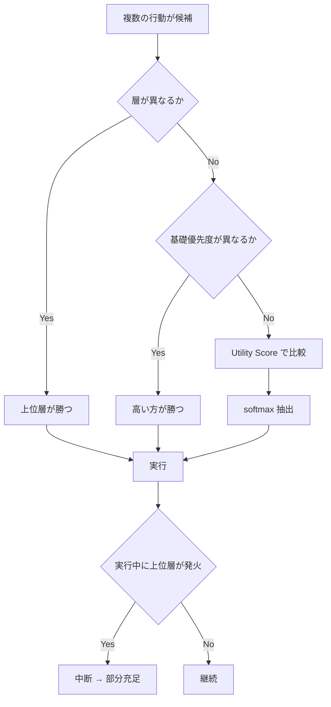

## 6.4 実装時の注意点

```
⚠️ すべての行動が実在すること（AP-45）。創作しない
⚠️ 各行動に最低1つの観測可能な Cue を紐づける（SR-1）
⚠️ ★印の行動は Cue としての価値が高い。演出品質を優先配分する
⚠️ 同じ見た目で異なる意味を持つ行動（CB-047/051、CB-094/095）は
   絶対に見た目で区別できるようにしないこと
⚠️ 行動の実装は Behavior Tree のノードとして記述する（層C）
⚠️ 行動数を増やすときは、それが新しい内部状態を示唆するか検証する
```

---

# ⑦ State Transition

> **目的**: 猫の状態遷移を階層的に定義し、AI の可読性と検証可能性を確保する。
> **設計理由**: Utility AI は挙動が読みにくい。状態機械を併置することで、「今どういう状態か」をデザイナーとQAが把握できるようにする。
> **ゲーム体験への影響**: 状態の遷移がプレイヤーには「様子の変化」として観測される。
> **他システムとの依存関係**: Architecture §8.4 Cat State / 04 §5.5 関係状態機械の詳細化。
> **実装時の注意点**: 状態は行動を決めない。行動の傾向を規定するだけである。

## 7.1 三層の状態機械

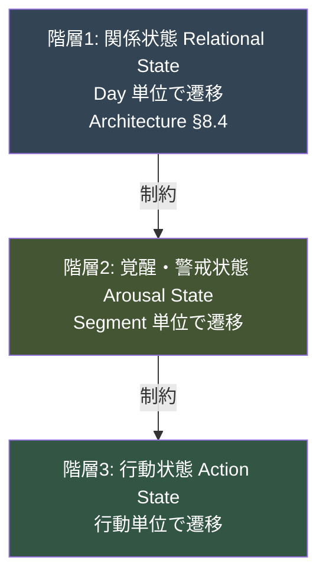

## 7.2 階層1: 関係状態（04 §5.5 再掲・詳細化）

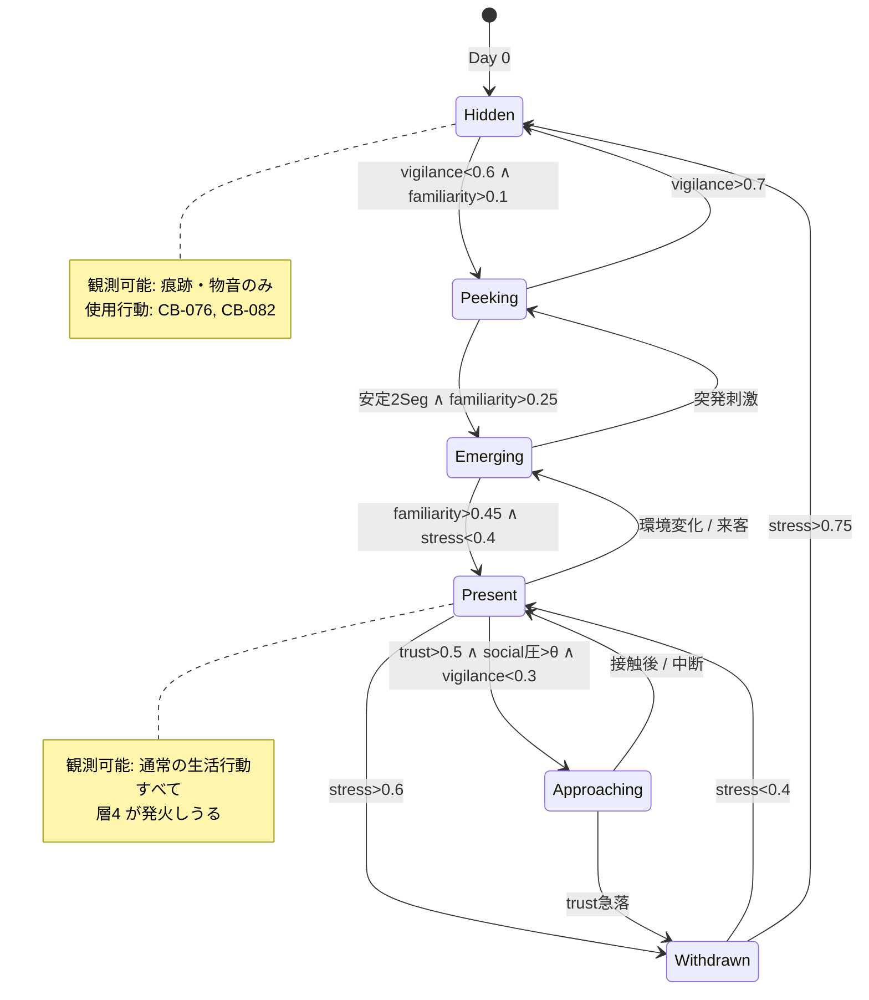

## 7.3 階層2: 覚醒・警戒状態

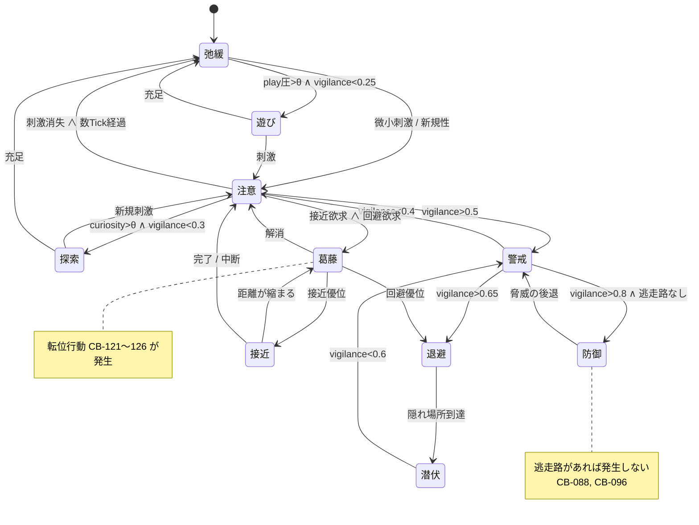

**⚠️ 防御状態は「逃走路がない場合のみ」到達する。**
プレイヤーが猫を追い詰めない限り、本作では稀にしか見られない。
**見られたときは、明確な警告として機能する。**

## 7.4 階層3: 行動状態

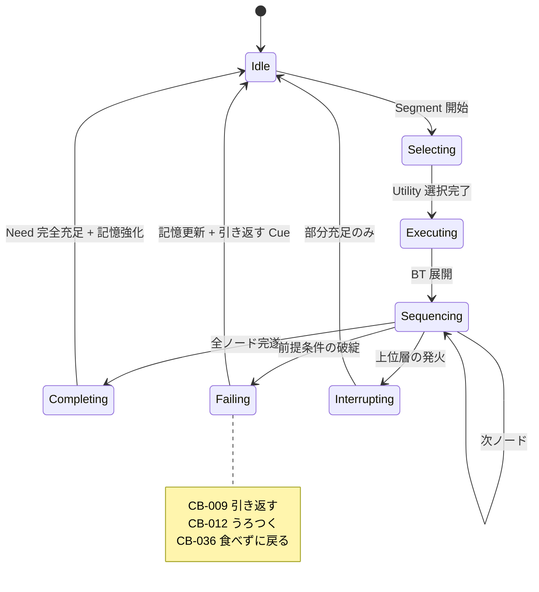

## 7.5 典型的な遷移例（要求された例の実装）

**「安心 → 探索 → 物音 → 警戒 → 隠れる → 落ち着く → 探索」**

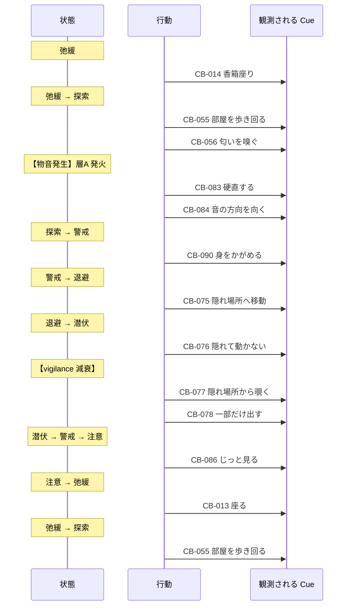

**⚠️ この一連が、Vigilance の非対称減衰（04 §3.2）により、
上りは数秒、下りは数十分〜数時間かかる。**

**プレイヤーは「一瞬で隠れて、なかなか出てこない」を観測する。**

## 7.6 実装時の注意点

```
⚠️ 状態は行動を決定しない。層B の Utility に制約を与えるだけ
⚠️ 状態名をプレイヤーに表示しない（憲章 I-1）
⚠️ 階層をまたぐ直接遷移を作らない
⚠️ すべての状態から、正常な状態への復帰経路が存在すること（詰みの禁止）
⚠️ 状態遷移をログに残す（SR-2 因果の遡行可能性）
```

---

# ⑧ Environment Reaction

> **目的**: 環境要因への反応を、AI の入力として具体化する。
> **設計理由**: 04 §4 で環境の影響則を定義済み。本章はそれを「猫がどう反応するか」の行動レベルに落とす。
> **ゲーム体験への影響**: Pillar 3（環境こそが対話）の体感の質。
> **他システムとの依存関係**: 04 §4 の Zone 属性・ZoneSecurity を入力とする。
> **実装時の注意点**: 環境の影響は個体差で大きく変わる。共通の「正解の環境」を作らない（AA-66）。

## 8.1 環境要因別の反応表

| 要因 | 即時反応 | 短期（1-2日） | 中期（3日以降） | 個体差の大きさ |
|---|---|---|---|---|
| **家具の追加** | CB-057 遠くから見る | 好奇心4段階の進行 | 使用開始 or 恒久回避 | **大**（T-4） |
| **家具の移動** | 空間記憶の混乱、CB-012 | 再学習 | 適応 | 中 |
| **家具の撤去** | CB-012 うろつく | 代替場所の探索 | 新しい定位置 | 中 |
| **突発音** | CB-083 硬直 → CB-075 退避 | 音源への警戒 | 慣れ or 感作 | **最大**（T-1, PT-07） |
| **継続音** | CB-085 耳だけ向ける | 慣れの進行 | 無反応化 | 中 |
| **照度低下** | 活動量の微増 | — | — | 小 |
| **照度上昇** | CB-116 日向へ移動 | 日向の定位置化 | 習慣化 | 中 |
| **来客** | CB-075 退避 → CB-082 出てこない | stressLoad 蓄積 | 数日かけて回復 | **大**（T-1, T-8） |
| **匂いの変化（掃除）** | 探索・確認行動 | territory の縮小 | 再マーキング | **大**（PT-23） |
| **強い匂い** | 回避 | Zone の一時忌避 | 消失後に復帰 | 中 |
| **時間帯** | 活動水準の変動 | ルーチンの形成 | 固定化 | **大**（PT-20） |
| **温度低下** | CB-018 丸まる、CB-118 | 暖所の探索 | 定位置化 | 小 |
| **温度上昇** | CB-019 伸びる、CB-117 | 涼所の探索 | 定位置化 | 小 |
| **窓の外の刺激** | CB-063 窓の外を見る | 窓辺の定位置化 | 習慣化 | **大**（T-4） |

## 8.2 掃除の扱い（反直観的で重要）

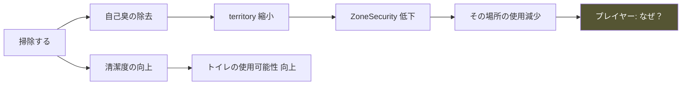

**⚠️ 掃除は「良いこと」と「悪いこと」の両面を持つ。**

| 掃除の対象 | 効果 |
|---|---|
| **トイレ** | **明確に良い**（使用可能性の回復） |
| 食器・水 | 明確に良い |
| 猫の定位置 | **悪い**（自己臭の除去） |
| 爪とぎ | 悪い（マーキングの除去） |
| 床全体 | 中立〜やや悪い |

**設計上の価値**: 「掃除すればいい」という単純な理解を否定し、
**どこを掃除すべきかを考えさせる。** 原則3（正解は一つではない）の実装。

> 📋 **監修必須**: 掃除と猫のストレスの関係（付録B-09）

## 8.3 脱走リスクの扱い ⚠️

**Player Flow ⑧8.3 の条件付き実装方針に従う。**

### 設計判断：**本編で実際の脱走は発生させない**

| ✅ 実装する | ❌ 実装しない |
|---|---|
| 窓・扉への関心（CB-063） | 実際の脱走 |
| 開口部付近での滞在増加 | 脱走によるゲームオーバー |
| 外部刺激への反応 | 猫の喪失 |
| 「出ようとする素振り」の観測 | 捜索イベント |
| 開口部管理の必要性の示唆 | プレイヤーへの責任追及 |

### 理由

```
□ 脱走をゲームオーバーにすることは憲章 I-4 違反
□ 脱走を脅威として使うと、恐怖による行動誘導になる（憲章 I-10 の精神）
□ 一方、脱走リスクは現実で最も重要な注意事項のひとつ
   → 知識としては伝える価値が極めて高い

結論：リスクの「存在」は観測可能にし、「発生」はさせない。
```

### 実装形

```
・T-4 探索性が高い個体は、開口部への関心が明確に高い（CB-063 の頻度増）
・開口部が開いた状態が続くと、その付近での滞在時間が増える
・これは Cue として観測される
・Reality Bridge（ゲーム外情報層）で、脱走対策の正確な情報を提供する
```

**⚠️ ゲーム内で「危険です」と警告しない。** 観測させ、ゲーム外で正確に伝える。

## 8.4 環境変更への反応の個体差

```mermaid
graph TB
    CHANGE["環境変更"]
    CHANGE --> T4H["T-4 探索性 高<br/>PT-04, PT-19"]
    CHANGE --> T4M["T-4 探索性 中"]
    CHANGE --> T4L["T-4 探索性 低<br/>PT-18"]

    T4H --> R1["1日で段階4到達<br/>変更を歓迎"]
    T4M --> R2["3日で段階4到達<br/>標準的"]
    T4L --> R3["段階2で停滞<br/>変更が逆効果"]

    style R3 fill:#844,color:#fff
```

**⚠️ PT-18 新規回避型では、環境改善が悪化を招く。**
これは原則3の最強の実装であり、「良かれと思って」の危険性を体験させる。

## 8.5 実装時の注意点

```
⚠️ 環境の「良さ」を絶対的に評価しない（AA-66）
⚠️ 環境変更の効果は必ず遅延させる（即時に良くならない）
⚠️ 同時に複数変更すると、再学習が並行して混乱が長期化する（意図された挙動）
⚠️ 掃除の両面性を実装する
⚠️ 脱走は発生させない。関心のみ観測可能にする
⚠️ 環境要因の影響係数はすべて個体プロファイル由来
```

---

# ⑨ Human Interaction Model

> **目的**: 人との距離と関係形成を、猫側の視点でモデル化する。
> **設計理由**: 04 §5 で関係変数を定義済み。本章はそれを「猫が人をどう扱うか」の行動選択として実装する。
> **ゲーム体験への影響**: Player Flow ⑤D4（最も自覚されない決定）の体感。
> **他システムとの依存関係**: 04 §5 の Familiarity / Trust / ToleranceDistance、⑤の humanModel。
> **実装時の注意点**: 猫は人の「意図」を読まない。「行動パターン」だけを読む。

## 9.1 猫から見た人間

**猫にとって人は、予測すべき環境要因である。**

```mermaid
graph TB
    H["人間"]
    H --> P1["位置 — 距離の計算対象"]
    H --> P2["動き — 速度・方向・急峻さ"]
    H --> P3["姿勢 — 高さ・正対/側面"]
    H --> P4["視線 — 直視/非直視"]
    H --> P5["音 — 足音・声"]
    H --> P6["予測可能性 — パターンの一貫性"]
    H --> P7["追跡傾向 — 逃げたら追うか ★"]

    P1 --> V["Vigilance"]
    P2 --> V
    P3 --> V
    P4 --> V
    P5 --> V
    P6 --> T["Trust"]
    P7 --> T

    style P7 fill:#454,color:#fff
```

**⚠️ 猫は「好意」を認識しない。「安全か」だけを認識する。**

## 9.2 距離帯の定義

```
距離帯は ToleranceDistance（04 §5.4）を基準に定義される。

D0 接触圏      : < TD × 0.3   → 逃走（CB-091）
D1 侵害圏      : < TD × 0.6   → 後ずさり（CB-089）／緊張
D2 境界圏      : ≈ TD         → 注視・身構え（CB-090）
D3 許容圏      : < TD × 2.0   → 通常行動を維持
D4 安全圏      : ≥ TD × 2.0   → 影響なし
```

```mermaid
graph LR
    D0["D0 接触圏<br/>逃走"] --> D1["D1 侵害圏<br/>後退"]
    D1 --> D2["D2 境界圏<br/>身構え"]
    D2 --> D3["D3 許容圏<br/>通常"]
    D3 --> D4["D4 安全圏<br/>無影響"]

    style D0 fill:#844,color:#fff
    style D4 fill:#484,color:#fff
```

**⚠️ TD は日々変動する。** 昨日 D3 だった距離が、今日は D2 になりうる。
これが「昨日できたことが今日できない」の実装。

## 9.3 人の行動に対する猫の反応表

| 人の行動 | 猫の即時反応 | Trust への影響 | 個体差 |
|---|---|---|---|
| ゆっくり近づく | CB-090 身構え | 小さく減 | 中 |
| **速く近づく** | CB-091 逃走 | **大きく減** | 大（PT-08） |
| 立ち上がる | CB-090 / CB-101 | 小さく減 | 大（PT-08） |
| 座る | 緊張の緩和 | 微増 | 小 |
| 横になる | 緊張の緩和（大） | 増 | 小 |
| **直視する** | CB-126 視線をそらす／CB-090 | 減 | 中 |
| **ゆっくり瞬きする** | CB-106 で応答しうる | **増** | 中 |
| 背を向ける | 緊張の緩和 | 微増 | 小 |
| 手を伸ばす | CB-089 後退／CB-091 | **大きく減** | 大（PT-21） |
| 触ろうとする（許容外） | CB-091 逃走 | **最大の減** | 大 |
| **逃げた猫を追う** | 逃走距離の増大 | **壊滅的な減** | — |
| **逃げた猫を追わない** | 退避距離の短縮 | **最大の増** | — |
| 名前を呼ぶ | CB-085 耳だけ向ける | 中立 | 中 |
| 静かに同席する | 徐々に弛緩 | 増（継続的） | 小 |
| 餌を置いて離れる | 摂食可能に | 増 | 小 |
| 餌を置いて見ている | **摂食のゲート不通過** | 中立 | 大 |

**⚠️ 「餌を置いて見ている」が食事を妨げるのは、本作の重要な学習ポイント。**

> 📋 **監修必須**: 視線・接近・接触に対する反応（付録B-10）

## 9.4 関係形成の進行

```mermaid
stateDiagram-v2
    [*] --> 未知
    未知 --> 認識: 人の存在を認識
    認識 --> 警戒対象: 初期状態
    警戒対象 --> 予測可能: presencePattern 学習
    予測可能 --> 中立: familiarity > 0.4
    中立 --> 安全: trust > 0.4 ∧ pursuitTendency 低
    安全 --> 接近可能: trust > 0.5 ∧ social圧
    接近可能 --> 安全: 中断
    安全 --> 警戒対象: 信頼の裏切り
    接近可能 --> 警戒対象: 重大な裏切り
    中立 --> 警戒対象: 裏切り

    note right of 安全
        これが到達可能な現実的な上限
        「接近可能」は個体と条件次第
    end note
```

**⚠️ 「接近可能」に到達しない個体が存在する**（PT-06, PT-14, PT-21）。
**それは失敗ではない。** 30日で「安全」に到達すれば十分である。

## 9.5 「甘える」の扱い

**要求された「甘える」を、慎重に定義する。**

| 実装する | 実装しない |
|---|---|
| CB-107 頭や体を擦り付ける（マーキング兼親和） | 「甘える」という状態表示 |
| CB-103 一定距離で並在 | 撫でると喜ぶ |
| CB-092 短い鳴き声（要求） | 触れば懐く |
| CB-106 ゆっくり瞬き | 好感度による段階解放 |
| CB-094 喉を鳴らす | 「懐きました」の演出 |

**⚠️ 擦り付け行動は「甘え」ではなくマーキングでもある。**
どちらの意味かは、**文脈でしか判断できない**。これも多義的な Cue。

## 9.6 実装時の注意点

```
⚠️ 猫は人の意図を読まない。行動パターンのみを読む
⚠️ プレイヤーの「善意」は一切変数にならない。行動だけが影響する
⚠️ pursuitTendency の学習を最重要視する（Trust の主要因）
⚠️ 「接近可能」に到達しない個体を実装すること（PT-06/14/21）
⚠️ 接触の許容は Trust と独立した個体特性である
⚠️ 距離を数値でUIに出さない（憲章 I-1）
```

---

# ⑩ Observation Mapping

> **目的**: 内部状態から観測可能な表現への写像を確定し、SR-1 を実装する。
> **設計理由**: 本作の全価値は、内部状態が正しく外部に現れるかにかかっている。誤った写像は、誤った知識をプレイヤーに与える（憲章§9.2 違反）。
> **ゲーム体験への影響**: **本章の正確性が、本作の教育的価値そのものである。**
> **他システムとの依存関係**: Architecture P-01 Perception Gateway の変換テーブルの源。
> **実装時の注意点**: **全項目が監修対象**。推測で書いた写像を実装しない。

## 10.1 観測される表現の5系統

```mermaid
graph TB
    INT["内部状態"]
    INT --> E1["身体部位<br/>耳 / 尻尾 / 瞳孔 / ひげ / 目"]
    INT --> E2["姿勢<br/>体勢 / 重心 / 筋緊張"]
    INT --> E3["行動<br/>CB-001〜126"]
    INT --> E4["発声<br/>CB-092〜099"]
    INT --> E5["生活リズム<br/>時間帯 / 頻度 / 持続"]

    E1 --> OBS["観測される Phenomenon"]
    E2 --> OBS
    E3 --> OBS
    E4 --> OBS
    E5 --> OBS
```

## 10.2 耳の位置

| 耳の状態 | 内部状態 | 注意 |
|---|---|---|
| 前を向いている | 弛緩／興味 | — |
| 小刻みに動く | **注意の走査**。音源の探索 | 警戒の初期兆候 |
| 片方だけ向ける | 注意の分割 | 寝ながらでも起きる（CB-029） |
| 横に倒れる | 不快／苛立ち／不安 | — |
| 後ろに倒れる | 恐怖／防御 | 強い |
| 完全に伏せる | 強い恐怖／攻撃準備 | 最も危険な状態 |

> 📋 **監修必須**（付録B-11）

## 10.3 尻尾

| 尻尾の状態 | 内部状態 | 注意 |
|---|---|---|
| 垂直に立てる | 親和的な接近シグナル | **対人・対猫の挨拶** |
| 先端だけ曲げる | 親和 + わずかな不確実 | — |
| 水平 | 中立 | — |
| 低い位置 | 不安／不確実 | — |
| 脚の間に巻き込む | 恐怖 | 強い |
| 膨らむ | **驚愕／恐怖／威嚇** | 反射的 |
| 先端だけ小刻みに動く | 軽い関心／軽い苛立ち | **多義的** |
| 大きく打ちつける | 苛立ち／葛藤 | CB-124 |
| ゆっくり左右に振る | 集中／狩猟前 | **「機嫌が良い」ではない** |

**⚠️ 「尻尾を振る＝機嫌が良い」は犬の話であり、猫では逆の意味を持つことが多い。**
**この誤解を解くことは、本作の教育的価値の中核のひとつ。**

> 📋 **監修必須**（付録B-12）

## 10.4 瞳孔

| 瞳孔 | 内部状態 | 注意 |
|---|---|---|
| 散大（丸い） | **高覚醒**：恐怖 or 遊び or 低照度 | **最も多義的** |
| 中間 | 通常 | — |
| 縮小（細い） | 高照度 or 集中／緊張 | 多義的 |

**⚠️ 瞳孔だけでは何もわからない。** 必ず照度と他の Cue との組合せで読む。
**これが「一つの観測では判断できない」の最良の教材。**

## 10.5 ひげ

| ひげ | 内部状態 |
|---|---|
| 前方に張り出す | 興味／調査／狩猟 |
| 横に自然に伸びる | 弛緩 |
| 後方に引く | 恐怖／防御 |

## 10.6 姿勢

| 姿勢 | 内部状態 | 注意 |
|---|---|---|
| 香箱座り（CB-014） | 弛緩。ただし即座には動けない | 安心のサイン |
| 前足を体の下に伏せる（CB-015） | **警戒の残存**。すぐ動ける | 「くつろいでいる」ではない |
| 横になる（CB-016） | 弛緩 | — |
| **仰向け（CB-017）** | **高度な弛緩** | **触ってよいという意味ではない** |
| 丸まる（CB-018） | 低体温 or 軽い不安 | 多義的 |
| 伸びて寝る（CB-019） | 高体温 + 高い安心 | — |
| 背を丸め毛を立てる（CB-088） | 恐怖 + 逃走不可 | 最終手段 |
| 低い姿勢での移動（CB-002） | 警戒下の移動 | — |

**⚠️ 「お腹を見せる＝撫でて」は最も一般的な誤解。**
仰向けは**弛緩と信頼の表現**であって、**接触の要請ではない**。
触れると反射的に防御される。**本作でこれを体験させる価値は極めて高い。**

> 📋 **監修必須**（付録B-13）

## 10.7 発声

| 発声 | 内部状態 | 注意 |
|---|---|---|
| 短い鳴き声（CB-092） | 挨拶／軽い要求 | **成猫の meow は主に対人** |
| 長い鳴き声（CB-093） | 強い要求／不安 | — |
| **喉鳴らし（CB-094/095）** | **弛緩 or 自己鎮静（不調・不安）** | **音では区別不能** |
| 威嚇音（CB-096） | 強い恐怖 + 接近 | 警告。従うべき |
| 低い唸り（CB-097） | 警告 | 同上 |
| チャタリング（CB-098） | 捕獲できない対象への興奮 | — |
| 無声の口開け（CB-099） | 弱い要求 | — |

**⚠️ 喉鳴らしの多義性は、本作で必ず扱うべき知識である。**
「ゴロゴロ言っているから大丈夫」という判断が、現実で誤りになりうる。

> 📋 **監修必須**（付録B-04, B-08）

## 10.8 生活リズム

**最も見落とされ、最も価値のある観測対象。**

| リズムの変化 | 内部状態 |
|---|---|
| 活動時間帯が人の在室時間からずれる | 警戒／不慣れ |
| 活動時間帯が人の在室時間に近づく | 慣れの進行 |
| 食事の時刻が遅くなる | ストレスの蓄積 |
| 食事の回数が増え1回量が減る（CB-040） | 中程度の警戒 |
| 隠れている時間が長くなる | stressLoad 上昇 |
| 姿を見せる時間が増える | familiarity 上昇 |
| 行動範囲が広がる（CB-115） | territory 拡大 |
| 遊び・探索が出現する（CB-055/073） | **高い安心** |
| 毛づくろいが減る（CB-054） | **ストレス or 体調** |
| 毛づくろいが増える（CB-052） | **ストレス** |

**⚠️ CB-052（過剰）と CB-054（欠如）は、どちらもストレスのサイン。**
「ちょうどよい量」は個体ごとに異なる。**基準を知っていなければ判断できない。**
これが Player Flow ⑪11.2「この子の普通の確立」が必要な理由である。

## 10.9 内部状態 → 観測 の統合マッピング表

| 内部状態 | 耳 | 尻尾 | 瞳孔 | 姿勢 | 主な行動 | リズム |
|---|---|---|---|---|---|---|
| **弛緩** | 前 | 水平／緩やか | 中間 | CB-014/016/017 | CB-030, CB-094 | 規則的 |
| **満足** | 前 | 緩やか | 中間 | CB-014 | CB-047 | 規則的 |
| **興味** | 前 | 先端が動く | やや散大 | CB-020 | CB-056〜060 | — |
| **注意** | 小刻みに動く | 静止 | やや散大 | CB-015 | CB-085/086 | — |
| **警戒** | 横〜後ろ | 低い | 散大 | CB-015/090 | CB-002, CB-075 | 活動低下 |
| **恐怖** | 後ろに伏せる | 巻き込む／膨らむ | 最大散大 | CB-090 | CB-091, CB-083 | 隠れる |
| **防御** | 完全に伏せる | 膨らむ | 散大 | CB-088 | CB-096/097 | — |
| **葛藤** | 前後に動く | 打ちつける | 変動 | CB-125 | CB-121〜126 | — |
| **遊び興奮** | 前 | 振る／膨らむ | 散大 | CB-066/067 | CB-065〜073 | 短時間の爆発 |
| **高ストレス** | 横 | 低い | やや散大 | CB-018 | CB-052/054, CB-082 | 食事時刻の後退 |
| **体調不良** | 変化小 | 低い | — | CB-018 | CB-054, 活動低下 | 全般的な低下 |

**⚠️ 「高ストレス」と「体調不良」の観測が似ていることは、意図的である。**
現実でも区別は難しく、**「いつもと違う」に気づくことが先である**という教育的メッセージになる。

## 10.10 実装時の注意点

```
⚠️ 本章の全項目が監修対象。推測で実装しない
⚠️ 一つの Cue が一つの意味に対応する実装をしない（多義性の保持）
⚠️ Cue に意味ラベルを付与して出力しない（Perception Gateway 禁止事項）
⚠️ 「わかりやすくするため」に Cue を単純化しない
⚠️ 全内部状態に、最低1つの観測可能な Cue を保証する（SR-1）
⚠️ 逆に、Cue のない内部状態を実装しない
⚠️ 誤解を招く写像（尻尾振り＝機嫌が良い等）を絶対に実装しない
```

---

# 付録A: クラス図

```mermaid
classDiagram
    class CatAgent {
        +CatProfile profile
        +InternalState state
        +WorldBelief belief
        +decideSegment(context) Behavior
    }

    class CatProfile {
        +float[8] temperament
        +float decisionTemperature
        +float inertiaMax
        +float[13] needWeights
        +float[10] zonePreference
        +float[N] stimulusSensitivity
        +Set~BehaviorId~ repertoire
        +HistoryTraits history
    }

    class InternalState {
        +float[13] needs
        +Affect affect
        +Relationship relationship
        +Attention attention
        +float[Zone] territory
        +float curiosity
        +float condition
    }

    class Affect {
        +float arousal
        +float valence
        +float vigilance
        +float stressLoad
    }

    class Relationship {
        +float familiarity
        +float trust
        +float toleranceDistance
        +RelationalState state
    }

    class WorldBelief {
        +Map~Zone,SpatialMemory~ spatial
        +Map~Cue,Association~ associations
        +Map~Stimulus,float~ habituation
        +Map~Stimulus,float~ sensitization
        +HumanModel human
        +decay(days)
        +reinforce(event)
        +correct(event)
    }

    class SpatialMemory {
        +ResourceType resource
        +float confidence
        +int lastVerified
        +float valence
        +int visitCount
    }

    class HumanModel {
        +float[6] presencePattern
        +float approachTendency
        +float pursuitTendency
        +float movementPredictability
        +int respectHistory
    }

    class ReactiveGate {
        +evaluate(state, stimuli) GateResult
    }

    class UtilitySelector {
        +enumerate(state) Behavior[]
        +score(behavior, state, belief, profile) float
        +select(scored, temperature) Behavior
    }

    class BehaviorTreeRunner {
        +execute(behavior, state, belief) ExecResult
    }

    class ExpressionFSM {
        +update(affect, behavior) Expression
    }

    class CueGenerator {
        +generate(state, behavior, expression) Cue[]
        +verifyCoverage(deltas) bool
    }

    CatAgent *-- CatProfile
    CatAgent *-- InternalState
    CatAgent *-- WorldBelief
    InternalState *-- Affect
    InternalState *-- Relationship
    WorldBelief *-- SpatialMemory
    WorldBelief *-- HumanModel
    CatAgent --> ReactiveGate
    CatAgent --> UtilitySelector
    CatAgent --> BehaviorTreeRunner
    CatAgent --> ExpressionFSM
    CatAgent --> CueGenerator
    UtilitySelector ..> WorldBelief : 照会
    BehaviorTreeRunner ..> WorldBelief : 更新
```

**⚠️ CueGenerator.verifyCoverage() は SR-1 の実装。**
内部変化に対応する Cue が生成されなかった場合、開発ビルドでは検出エラーとする。

---

# 付録B: 監修必須項目

**本書で新規に発生した監修項目。04 付録B と併せて全項目の確認を要する。**

| # | 項目 | 該当節 | 重要度 |
|---|---|---|---|
| B-01 | 猫の空間記憶と環境変化への適応期間 | ③3.3 | 高 |
| B-02 | マーキング行動と縄張り形成 | ③3.5 | 中 |
| B-03 | 体調変化の観測可能なサイン | ③3.7 | **最高** |
| B-04 | 成猫の meow の対人特異性 | ⑥K, ⑩10.7 | 高 |
| B-05 | 連合学習の形成・消去速度 | ⑤5.2 | 高 |
| B-06 | 排泄の抑制と健康リスク | ⑥E | **最高** |
| B-07 | 過剰グルーミング／毛づくろい欠如の意味 | ⑥F | **最高** |
| B-08 | 喉鳴らしの多義性（弛緩と自己鎮静） | ⑥K, ⑩10.7 | **最高** |
| B-09 | 掃除と猫のストレスの関係 | ⑧8.2 | 中 |
| B-10 | 視線・接近・接触に対する反応 | ⑨9.3 | **最高** |
| B-11 | 耳の位置と情動の対応 | ⑩10.2 | **最高** |
| B-12 | 尻尾の状態と情動の対応 | ⑩10.3 | **最高** |
| B-13 | 仰向け姿勢の意味（接触要請ではない） | ⑩10.6 | **最高** |
| B-14 | 新規物体への4段階接近 | ③3.6 | 高 |
| B-15 | 威嚇が最終手段であること | ⑥J | 高 |

**⚠️ 重要度「最高」の8項目は、誤ると現実の猫に害を及ぼす知識である。**
監修未了の状態でリリースしてはならない（憲章§9.2）。

---

# 付録C: 実装チェックリスト

## C.1 アーキテクチャ

```
□ 層A/B/C/D が分離されているか
□ 層A から層C への直接呼び出しが反射時のみか
□ Utility の因子が §2.4 の7項目のみか
□ softmax の τ が 0 でないか
□ Inertia の上限が 1.5 か
□ BT のノード階層が5以内か
□ すべての乱数が RNG.stream("behavior") からか
```

## C.2 誓約の遵守

```
□ AI-1: 猫が命令に従う経路が存在しないか
□ AI-2: 性格が実行中に変更されないか
□ AI-3: 猫が世界の真実を直接参照していないか（WorldBelief 経由か）
□ AI-4: すべての行動に観測可能な Cue があるか
□ AI-5: 完全ランダムな選択が存在しないか
```

## C.3 内部情報

```
□ 全内部変数が L2 に閉じているか（SR-6）
□ WorldBelief がセーブ対象か
□ 記憶に容量上限があるか
□ Condition が 0.7〜1.0 を出ないか
□ 病気・死亡の実装が存在しないか
```

## C.4 性格

```
□ 24タイプが 8次元パラメータのみで表現されているか
□ タイプ固有の分岐コードが存在しないか
□ タイプ名がプレイヤーに露出しないか
□ 全タイプで学習ラインが3本以上成立するか
□ 全タイプで詰みが発生しないか
□ PT-06/14/21 が接触に至らない実装か
```

## C.5 学習

```
□ 機械学習を使用していないか
□ 負の連合が1回で形成されるか
□ 負の記憶が30日で完全消失しないか
□ 負の記憶に下限があるか（完全忌避の禁止）
□ pursuitTendency が Trust の主要因になっているか
□ 空間記憶の再学習が3日程度か
```

## C.6 行動

```
□ 126行動すべてが実在する行動か
□ CB-036「食べずに戻る」が実装されているか
□ CB-047 と CB-051 が見た目で区別できないか
□ CB-094 と CB-095 が音で区別できないか
□ 各行動に Cue が紐づいているか
```

## C.7 観測写像

```
□ ⑩の全写像が監修済みか
□ 一つの Cue が複数の意味を持ちうるか
□ Cue に意味ラベルが付与されていないか
□ 誤解を招く写像が存在しないか（尻尾振り等）
□ 全内部状態に Cue が存在するか（SR-1）
□ CueGenerator.verifyCoverage() が実装されているか
```

## C.8 体験検証（04 §10.2 との整合）

```
□ Day 1-5 で姿をほとんど見せないか
□ Day 6-8 頃に環境変更の効果が現れるか
□ Day 11-14 で行動パターンが安定するか
□ Day 15-19 で悪循環が発生しうるか
□ Day 10-20 に探索・遊びが初出するか
□ Day 21-27 に接近が発生しうるか
□ 30日で「完全に読める」状態にならないか
```

---

# 付録D: 未確定事項

| # | 事項 | 決定すべき工程 |
|---|---|---|
| CA-01 | Utility 因子の具体的な係数 | 実測調整 |
| CA-02 | 各性格タイプの Needs 重みベクトルの具体値 | Cat AI 実装 + 監修 |
| CA-03 | BT の具体的なノード定義（126行動分） | Cat AI 実装 |
| CA-04 | 連合学習の刺激-結果ペアの一覧 | Event System 設計 |
| CA-05 | Zone の具体的な数と構成 | Room System 設計 |
| CA-06 | 初回プレイの推奨個体の確定 | シナリオ設計 |
| CA-07 | Phenomenon 語彙と Cue の対応表 | Perception 設計 |
| CA-08 | 付録B 全15項目の監修 | 監修工程 |
| CA-09 | Core Gameplay Loop Bible との整合 | 同文書作成時 |

---

## 改訂履歴

| バージョン | 日付 | 変更内容 |
|---|---|---|
| 1.0 | 2026-07-24 | 初版策定 |

---

> **このAIは、プレイヤーを楽しませようとしない。**
> **自分の必要を満たそうとするだけである。**
> **その姿が観察に値することを、私たちは知っている。**
