# 保護猫トライアル30日 — Player Knowledge System v1.0

**Document Type**: Player Knowledge / 学習体験設計
**Parent Documents**:
- [00-PROJECT-CONSTITUTION.md](./00-PROJECT-CONSTITUTION.md)（最上位）
- [01-EXPERIENCE-BIBLE.md](./01-EXPERIENCE-BIBLE.md)
- [02-PLAYER-FLOW.md](./02-PLAYER-FLOW.md)
- [03-SYSTEM-ARCHITECTURE.md](./03-SYSTEM-ARCHITECTURE.md)
- [04-SIMULATION-RULES.md](./04-SIMULATION-RULES.md)
- [05-CAT-AI-DESIGN.md](./05-CAT-AI-DESIGN.md)

**Authority**: 上記6文書に次ぐ第7位
**Layer**: L3 Perception / P-04 Player Knowledge・P-05 Record・P-06 Narration
**Scope**: プレイヤーの理解の構築過程のみ
**Out of Scope**: イベント / UI / 猫AI / 部屋 / 家具 / アイテム
**Last Updated**: 2026-07-24

---

## 📌 前提の確認

参照指定のうち **「Core Gameplay Loop Bible」は未作成**。本書はループ定義を Constitution §3.3・Player Flow ③・Simulation Rules §1 から参照する。

**本書が絶対に守る制約（Architecture G-2）**

> ### **Player Knowledge System は Simulation を参照できない。**
> ### **理解度は「観測履歴」からのみ構築され、真実と照合されない。**

この制約が本書のすべての設計を規定する。詳細は §1.4。

---

## 目次

- [① Knowledge Philosophy](#-knowledge-philosophy)
- [② Understanding Model](#-understanding-model)
- [③ Observation Skills](#-observation-skills)
- [④ Hypothesis System](#-hypothesis-system)
- [⑤ Learning Loop](#-learning-loop)
- [⑥ Knowledge Progression](#-knowledge-progression)
- [⑦ Misunderstanding Design](#-misunderstanding-design)
- [⑧ Reflection System](#-reflection-system)
- [⑨ Emotional Learning](#-emotional-learning)
- [⑩ Reality Transfer](#-reality-transfer)
- [⑪ Anti Learning Design](#-anti-learning-design)
- [⑫ Knowledge Validation Checklist](#-knowledge-validation-checklist)
- [付録A: データ構造](#付録a-データ構造)
- [付録B: 次工程への引き継ぎ](#付録b-次工程への引き継ぎ)

---

# ① Knowledge Philosophy

> **目的**: 本作における「理解」を定義し、それをシステムとして成立させる方法を確立する。
> **背景**: 憲章 原則9「知識より理解を重視する」、Experience Bible ⑥ で三層学習モデルを定義済み。しかし「理解をどう実装するか」は未解決だった。本章がそれに答える。
> **設計理由**: 理解を「正解との一致」で定義すると、必ず答え合わせ構造になる（Pillar 2 違反）。理解を**証拠構造の充足**で定義することで、正解を知らないまま理解を扱えるようにする。
> **期待するプレイヤー体験**: 「わかった気がする」から「根拠を持ってわかる」への移行。
> **他システムとの依存関係**: Architecture P-04 の実装規約。⑤⑥⑧の土台。
> **実装時の注意点**: 本章の定義を外れた瞬間、G-2 が破れ、憲章違反になる。

## 1.1 本作における「理解」の定義

> ### **理解とは、未知の状況に適用できるモデルを、自分で構築した状態である。**

| 要素 | 意味 |
|---|---|
| **未知の状況に適用できる** | 見たことのない場面でも予測できる |
| **モデル** | 単一の事実ではなく、条件と結果の関係 |
| **自分で構築した** | 与えられたのではなく、観測から組み上げた |

## 1.2 知識と理解の違い（Experience Bible ⑥6.1 の深化）

| | 知識 | 理解 |
|---|---|---|
| 形式 | 命題 | 条件付きモデル |
| 例 | 「猫は高い所が好き」 | 「この子は、人の視線より上にいると動きが緩む」 |
| 獲得 | 提示される | 構築される |
| 検証 | 想起できるか | **未知の状況で予測できるか** |
| 反証 | されない（覚えているだけ） | **される（だから深まる）** |
| 転移 | しない | する |
| 本作での扱い | 手段 | **目的** |

### 決定的な違い：反証可能性

```
知識：「猫は高い所が好き」
   → この子が高い所を使わなくても、知識は揺らがない
   → 「この子は変わってるな」で終わる
   → 学習が止まる

理解：「この子は、人の視線より上にいると動きが緩む」
   → 反例に出会うと、モデルが揺らぐ
   → 「あれ、今日は違う」→ 条件を探す
   → 学習が続く
```

**⚠️ 反証可能であることが、理解の証拠である。**
反証されない主張は、理解ではなく信念である。

## 1.3 「理解」をシステムとして成立させる方法

**本作の核心的な発明。**

> ### **理解度を、正解との一致ではなく、証拠構造の充足で測る。**

### 一つの理解（Insight）が成立する条件

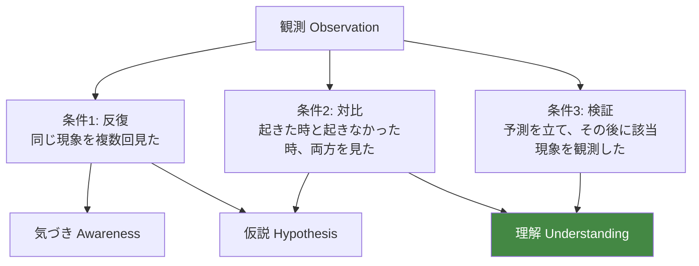

| 充足条件 | 到達段階 |
|---|---|
| 反復のみ | **気づき** — 「何かがある」 |
| 反復 + 対比 | **仮説** — 「たぶんこうだ」 |
| 反復 + 対比 + 検証 | **理解** — 「こうだと確かめた」 |

**⚠️ この判定は、正解を一切参照していない。**
参照しているのは「プレイヤーが何を、どういう構造で観測したか」だけである。

### なぜこれで成立するのか

```
ゲームは正解を知らない。
しかし世界（Simulation）は一貫している（SR-2, SR-3）。

したがって：
・誤った理解に基づく予測は、いずれ外れる
・外れると、反証となる現象が観測履歴に入る
・反証が増えると、その Insight の確信度が下がる
・プレイヤーは自分で修正する

→ 正しい理解だけが生き残る
→ しかしゲームは一度も「正解」を提示していない
```

**これは科学的方法そのものであり、本作の教育的価値の中核である。**

## 1.4 G-2 制約の実装的帰結

**Player Knowledge System にできること／できないこと。**

| ✅ できる | ❌ できない（構造的に不可能） |
|---|---|
| プレイヤーが何を観測したか追跡する | プレイヤーの解釈が正しいか判定する |
| 観測の反復回数を数える | 正解を提示する |
| 観測の文脈の多様性を測る | 「その通りです」と返す |
| 予測と、その後の観測の関係を追跡する | 進捗率を算出する |
| 反証となる現象の観測を検出する | 未達成の理解を列挙する |
| 描写の解像度を上げる | 理解度を数値表示する |

**⚠️ 「できない」欄は、実装しないのではなく、実装できない。**
Player Knowledge は Simulation を import できないため、正解にアクセスする手段がない。

## 1.5 実装時の注意点

```
⚠️ Player Knowledge が Simulation の型を import した時点で G-2 は破れる
⚠️ 「正解との一致度」を計算する関数を書かない（AA-08）
⚠️ Insight の「内容」を保持しない。保持するのは観測構造だけ
⚠️ プレイヤーが何を信じているかは、記録に自然言語として残るのみ
⚠️ 理解度を数値・進捗率としてUIに出さない（憲章 I-1）
⚠️ 「学習完了」を判定・通知しない（Player Flow ⑦7.5）
```

---

# ② Understanding Model

> **目的**: 理解が構築される認知プロセスを段階化し、システムの追跡対象を確定する。
> **背景**: Experience Bible ⑥6.3 で学習サイクル [1]〜[10] を定義済み。本章はそれを**プレイヤーの認知状態**として再構成し、内部表現を与える。
> **設計理由**: 認知プロセスを段階化しなければ、「今どこで詰まっているか」が診断できない。診断できなければ、体験の改善もできない。
> **期待するプレイヤー体験**: 自分の中で理解が組み上がっていく感覚。
> **他システムとの依存関係**: ③④⑤⑥の共通土台。⑧の記録内容を規定する。
> **実装時の注意点**: 段階をプレイヤーに表示しない。内部の診断用である。

## 2.1 理解の8段階

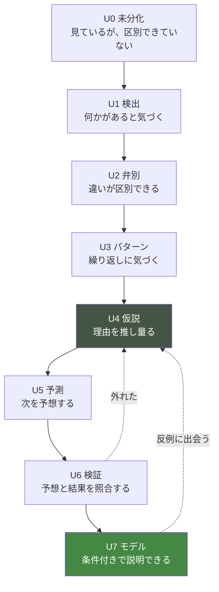

### 各段階の定義

| 段階 | 認知状態 | プレイヤーの内言 | 成立条件（観測構造） |
|---|---|---|---|
| **U0 未分化** | 情報が意味を持たない | 「よくわからない」 | — |
| **U1 検出** | 存在に気づく | 「何かしてる」 | 該当現象の観測 1回 |
| **U2 弁別** | 違いがわかる | 「さっきと違う」 | 同種現象の異なる形態を2種以上 |
| **U3 パターン** | 反復に気づく | 「いつもこうだ」 | 同一文脈で3回以上 |
| **U4 仮説** | 理由を推し量る | 「たぶん〜だから」 | 対比観測（起きた/起きなかった）あり |
| **U5 予測** | 先を読む | 「なら次はこうなるはず」 | 仮説の記録 + 予測の明示 |
| **U6 検証** | 照合する | 「やっぱり」／「違った」 | 予測後に該当現象を観測 |
| **U7 モデル** | 条件付きで説明できる | 「〜のときは〜になる」 | 検証成功 2回以上 + 反証少 |

## 2.2 理解の2軸：確信度と適用範囲

**理解は「強さ」だけでなく「広さ」を持つ。**

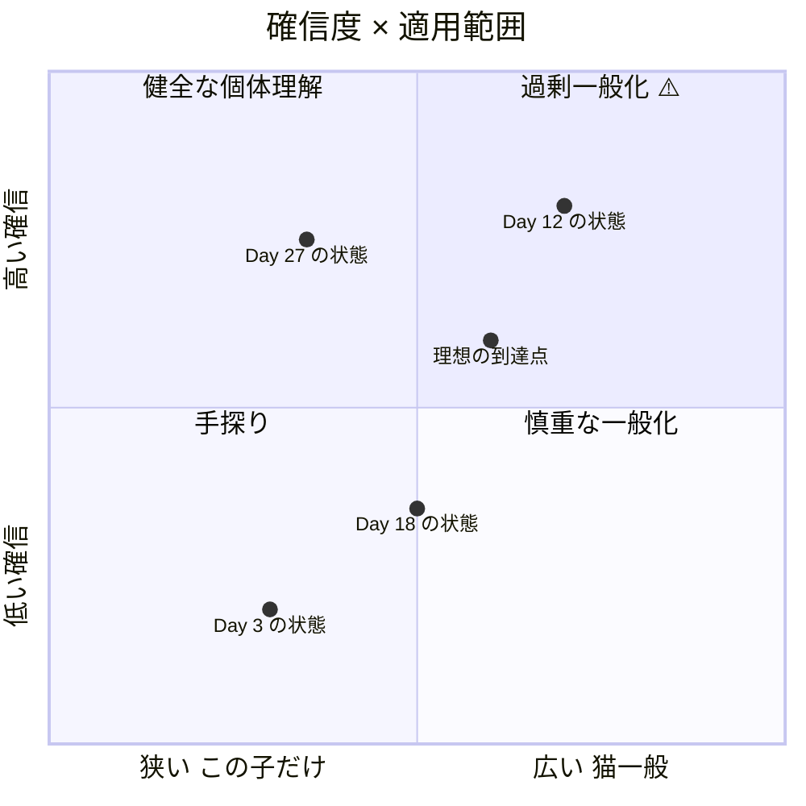

### 過剰一般化（右上）が最大の危険

```
Day 12：「猫は高い所が好き」（高確信・広スコープ）
   ↓
別の個体では通用しない
現実の猫でも通用しない
   ↓
学習が止まり、誤った知識が現実に持ち出される
```

**⚠️ 本作は Day 13-20 で意図的にこの状態を破壊する**（Player Flow Phase ④）。

### 理想の到達点

```
「この子は、こういうときはこうなる」（高確信・狭スコープ）
   +
「猫には個体差がある。だから、目の前の子を見るしかない」（中確信・広スコープ）
```

**⚠️ 最も価値のある一般化は、内容ではなく方法である。**

## 2.3 内部表現（実装可能な形）

```
Insight {
    lineId              // 学習ラインID（どの気づきに関するものか）

    // 観測構造（Simulation を参照しない）
    observationCount    // 関連現象の観測回数
    contextVariety      // 観測された文脈の種類数
    contrastObserved    // 対比（起きた/起きなかった）を観測したか
    temporalSpread      // 観測が何日にわたるか

    // プレイヤーの能動性
    hypothesisFormed    // 仮説を立てたか
    predictionMade      // 予測を立てたか
    predictionCount     // 予測の回数
    predictionResolved  // 予測後に該当現象を観測した回数

    // 反証
    counterEvidence     // 反証となる現象の観測回数

    // 派生
    stage               // U0〜U7
    confidence          // 0.0〜1.0（正解とは無関係）
    scope               // individual / general（プレイヤーが選ぶ）
}
```

### confidence の算出

```
base = w1 × min(observationCount / N_target, 1)
     + w2 × min(contextVariety / V_target, 1)
     + w3 × (contrastObserved ? 1 : 0)
     + w4 × min(predictionResolved / P_target, 1)

confidence = base × decay(counterEvidence)

decay(c) = 1 / (1 + k × c)
```

**⚠️ この式のどこにも「正解」は登場しない。**

**⚠️ counterEvidence が増えると confidence が下がる。**
これが「わかった → わかってなかった」（Player Flow ②）の実装である。

## 2.4 「先回りできる」の実装

要求された最終段階「次は先回りできる」を定義する。

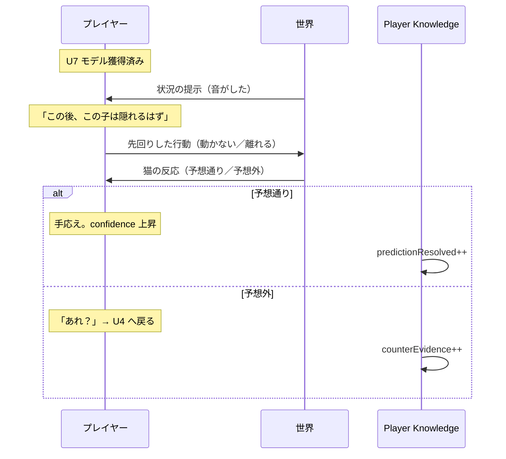

**⚠️ 「先回り」はゲームが評価しない。**
プレイヤーが心の中で予想し、結果を見るだけ。ゲームは予想の内容を知らない。

**⚠️ ただし「予測を立てた」という事実は記録できる**（⑧ Reflection System）。
これが predictionMade の実装。**内容ではなく、行為を記録する。**

## 2.5 段階ごとの体験と失敗モード

| 段階 | 詰まる原因 | 診断できる指標 | 対処（許容されるもの） |
|---|---|---|---|
| U0→U1 | 観測対象が見つからない | 観察時間が短い | 観測可能な差分を増やす |
| U1→U2 | 基準（いつも）が未形成 | 反復観測が少ない | Day 1-5 の反復密度を上げる |
| U2→U3 | 反復に気づかない | 同一文脈の観測が散発 | 反復回数を増やす（3回ルール） |
| U3→U4 | 理由を考える動機がない | 仮説記録がゼロ | 未解決の問いを明確にする |
| U4→U5 | 予測の場がない | 予測記録がゼロ | 予測を記録できる場を用意 |
| U5→U6 | 検証機会がない | 予測後の観測なし | 同種現象の再出現を保証 |
| U6→U7 | 検証が一度きり | predictionResolved < 2 | 冗長な検証機会を用意 |

**⚠️ 対処はすべて「観測機会の設計」である。** 説明・ヒント・正解提示は含まれない。

## 2.6 実装時の注意点

```
⚠️ 段階（U0〜U7）をプレイヤーに表示しない
⚠️ 「次はU5です」のような誘導をしない
⚠️ Insight の内容（何を信じているか）を保持しない
⚠️ scope はプレイヤーが選ぶ。ゲームが判定しない
⚠️ confidence を数値表示しない。描写の解像度に反映するのみ
⚠️ 段階が下がることを「後退」として演出しない
```

---

# ③ Observation Skills

> **目的**: プレイヤーが身につける観察能力を分類し、その熟達を設計可能にする。
> **背景**: Cat AI ⑩ で「内部状態 → 観測される表現」を定義済み。本章は逆方向、「同じ表現から、プレイヤーは何を読み取れるようになるか」を扱う。
> **設計理由**: 観察は単一の能力ではない。対象ごとに異なる技能であり、対象ごとに熟達曲線が異なる。分類しなければ、成長を設計できない。
> **期待するプレイヤー体験**: 同じ光景が、日を追うごとに違って見える。
> **他システムとの依存関係**: Cat AI ⑩ の写像表を入力とする。P-06 Narration の描写解像度を規定する。
> **実装時の注意点**: 技能レベルをプレイヤーに表示しない。描写の詳細度としてのみ現れる。

## 3.1 観察技能の3層

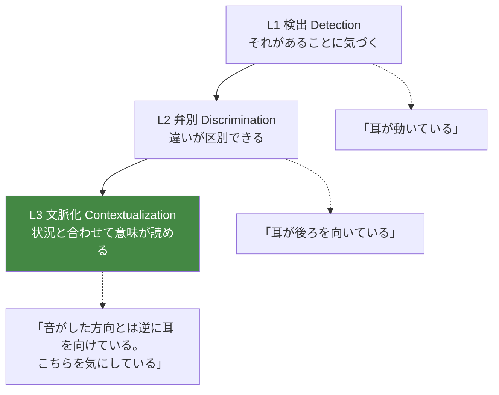

**⚠️ L3 に到達しても、意味は断定されない。** 「気にしているらしい」までである。

## 3.2 観察対象別の熟達表

### O-01 耳

| レベル | 見えるもの | 到達目安 |
|---|---|---|
| **初心者（L1）** | 耳が動いた | Day 1-5 |
| **中級者（L2）** | 前／横／後ろ／小刻みの区別 | Day 6-15 |
| **上級者（L3）** | 音源との角度関係。片耳だけの分割注意。寝ながらの反応 | Day 16-30 |

**上級者だけが読めること**: 「寝ているのに耳だけこちらを向いている」＝ 深く眠れていない

### O-02 尻尾

| レベル | 見えるもの |
|---|---|
| **L1** | 尻尾が動いた／立っている |
| **L2** | 高さ（垂直／水平／低い／巻き込む）／膨らみ／先端の動き |
| **L3** | 動きの速さと振幅の意味。同じ「振る」でも狩猟集中と苛立ちの区別 |

⚠️ **最も誤解されやすい対象**（⑦ MU-06）。L2 で誤った理解に到達しやすい。

### O-03 瞳孔

| レベル | 見えるもの |
|---|---|
| **L1** | 目が大きい／細い |
| **L2** | 散大／縮小の区別 |
| **L3** | **照度との交絡を除いて読む**。暗い部屋での散大は情報がない |

⚠️ **単独では何も読めない対象。** L3 の本質は「読めないと知ること」である。

### O-04 ひげ

| レベル | 見えるもの |
|---|---|
| **L1** | （気づかない） |
| **L2** | 前／横の区別 |
| **L3** | 調査時の前方張り出し。恐怖時の後方引き |

⚠️ **最も気づかれにくい対象。** L1 が存在しない稀な例。

### O-05 姿勢・体勢

| レベル | 見えるもの |
|---|---|
| **L1** | 座っている／寝ている／立っている |
| **L2** | 香箱座り／前足を体の下／横になる／仰向け／丸まる |
| **L3** | **すぐ動ける姿勢かどうか**。同じ「伏せ」でも警戒の有無 |

⚠️ **L3 の核心**: 「くつろいで見えるが、実は動ける体勢」の判別。

### O-06 歩き方・移動

| レベル | 見えるもの |
|---|---|
| **L1** | 移動した |
| **L2** | 速さ／低い姿勢／縁を伝う／迂回 |
| **L3** | 経路の選択理由。**避けている場所の存在**。うろつきの意味 |

⚠️ **L3 は「通らない場所」を読む。** 行動の不在からの推論。

### O-07 睡眠

| レベル | 見えるもの |
|---|---|
| **L1** | 寝ている |
| **L2** | 浅い／深い／まどろみの区別。姿勢の違い |
| **L3** | 睡眠場所の選択理由。睡眠の分断。時間帯の変化 |

⚠️ **睡眠は最も見過ごされる情報源。** 「寝ているだけ」に見える時間に、最も多くの情報がある。

### O-08 食事

| レベル | 見えるもの |
|---|---|
| **L1** | 食べた／食べていない |
| **L2** | 食べる速さ／量／回数／中断 |
| **L3** | **食べる前の確認行動**。時刻の変化。場所への依存 |

⚠️ **CB-036「食べずに戻る」を読めるのは L2 以降。**
L3 では「なぜ戻ったか」の条件を特定できる。

### O-09 トイレ

| レベル | 見えるもの |
|---|---|
| **L1** | 使った／使っていない |
| **L2** | 回数／時刻／砂かけの有無 |
| **L3** | 使用前の確認。我慢の兆候。清潔度との相関 |

⚠️ **健康上最も重要な観察対象。** 現実への転移価値が最も高い。

### O-10 鳴き声

| レベル | 聞こえるもの |
|---|---|
| **L1** | 鳴いた |
| **L2** | 短い／長い／喉鳴らし／威嚇音の区別 |
| **L3** | **文脈による意味の分岐**。喉鳴らしの多義性。誰に向けているか |

⚠️ **L3 の核心**: 「ゴロゴロ＝機嫌が良い」ではないと知ること（⑦ MU-05）。

### O-11 遊び方

| レベル | 見えるもの |
|---|---|
| **L1** | 遊んでいる |
| **L2** | 狩猟連鎖の段階（凝視→構え→腰振り→飛びかかり） |
| **L3** | **遊びの出現そのものが安心の指標である**という理解 |

⚠️ **L3 は行動の意味ではなく、行動の存在の意味を読む。**

### O-12 隠れ方

| レベル | 見えるもの |
|---|---|
| **L1** | 隠れている |
| **L2** | 隠れ場所の選択／覗く／一部だけ出す |
| **L3** | 隠れ場所の条件（逃走路・高さ・遮蔽）。滞在時間の変化 |

### O-13 痕跡

| レベル | 見えるもの |
|---|---|
| **L1** | 餌が減った／トイレが使われた |
| **L2** | 量・回数・時期の推定 |
| **L3** | **不在時の行動の再構成**。痕跡の組合せからの推論 |

⚠️ **L3 は「見ていない時間」を読む技能。** 推理として最も高度。

### O-14 環境の変化

| レベル | 見えるもの |
|---|---|
| **L1** | 物が動いている |
| **L2** | どこが使われ、どこが使われていないか |
| **L3** | **使われていないことの意味**。自分の変更の影響 |

### O-15 自分自身 ★

| レベル | 見えるもの |
|---|---|
| **L1** | （観察対象だと思っていない） |
| **L2** | 自分が動くと猫が反応することに気づく |
| **L3** | **自分の距離・速度・姿勢・視線が変数だと理解する** |

**⚠️ O-15 が本作の観察技能の到達点である。**（Player Flow ⑨9.2 L5）
そして最も現実に転移する技能である。

## 3.3 技能の熟達曲線

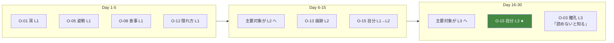

## 3.4 技能レベルと描写解像度の対応

**Player Knowledge の技能レベルが、Narration System（P-06）の描写を変える。**

| 技能L | 描写例（同じ現象） |
|---|---|
| L1 | 「猫が、こちらを見ている」 |
| L2 | 「猫が、耳を少し後ろに向けて、こちらを見ている」 |
| L3 | 「猫が、耳を少し後ろに向けている。逃げる準備をしながら、こちらを確かめている」 |

**⚠️ L3 の描写でも断定していない。** 「〜しながら」「〜らしい」の形を保つ。

**⚠️ 技能レベルはUIに表示しない**（憲章 I-1）。描写の詳細度としてのみ現れる。

## 3.5 技能の獲得条件

```
技能レベルの上昇 = 該当対象の観測構造の充足

L1: 該当対象を観測した（1回）
L2: 該当対象の異なる形態を観測した（2種以上）
L3: 該当対象を、異なる文脈で観測した（3文脈以上）
    かつ、その対象に関する予測を立てた（1回以上）
```

**⚠️ ここでも正解は参照していない。** 観測の構造だけで判定する。

## 3.6 実装時の注意点

```
⚠️ 技能レベルを表示しない。習得通知を出さない（Player Flow ⑨9.3）
⚠️ 未習得の技能を可視化しない（AP-26）
⚠️ 技能を「アンロック」として演出しない
⚠️ O-15（自分自身）を明示的に提示しない。気づかせる
⚠️ L3 の描写でも断定しない
⚠️ 描写テキストは全レベル分を用意する（アセット量に注意）
```

---

# ④ Hypothesis System

> **目的**: プレイヤーの仮説形成を支援しつつ、答え合わせ構造を構造的に排除する。
> **背景**: Pillar 2「答えではなく、手応えを渡す」の実装。AP-59（クイズ形式）の禁止と、学習に必要な予測生成の両立が課題。
> **設計理由**: 学習は予測誤差から生まれる。予測しなければ学習は起きない。しかし予測を採点した瞬間、クイズになる。**予測させて、採点しない**機構が必要。
> **期待するプレイヤー体験**: 自分の考えが形を持ち、それが確かめられていく感覚。
> **他システムとの依存関係**: ②のU4-U6、⑧ Reflection System、P-05 Record System。
> **実装時の注意点**: 「正解でした」を出力する経路を、実装上作らない。

## 4.1 仮説の形式

**仮説は「条件と結果のペア」として記録される。**

```
「〜のとき、〜になるのではないか」
```

| 部分 | 内容 | プレイヤーの操作 |
|---|---|---|
| 条件 | 観測した文脈から選ぶ | 選択 |
| 結果 | 観測した現象から選ぶ | 選択 |
| 語調 | 推量形で記録される | 自動 |

**⚠️ 自由記述を主にしない。** 記述負担が体験を止める（Player Flow ⑩10.3 1日1〜2分）。
ただし補助的な自由記述欄は許容する。

### 例

```
条件：「人が近くにいるとき」
結果：「食べない」
→ 記録：「人が近くにいると、食べないのかもしれない」
```

## 4.2 仮説の材料は観測から供給される

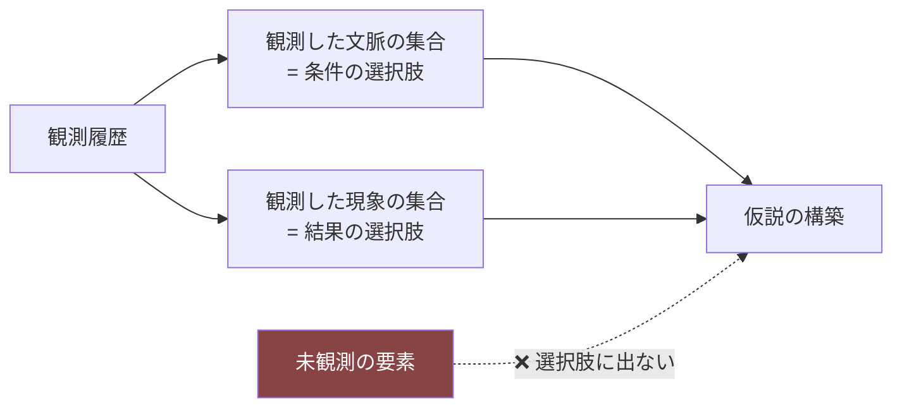

**⚠️ 観測していないものは、仮説の材料にならない。**

これが極めて重要である。

```
選択肢を全部並べる → 総当たりで正解を探せる → クイズになる
観測したものだけが並ぶ → 観察しないと仮説すら立てられない
   → Pillar 1（観察が最大の攻略法）が仮説段階でも機能する
```

## 4.3 ゲームによる支援（許容される範囲）

| ✅ 支援する | ❌ 支援しない |
|---|---|
| 仮説を立てる場を用意する | 仮説を立てるよう促す |
| 観測した要素を選択肢として提示する | 正しい要素を強調する |
| 仮説を推量形の文として整形する | 仮説を評価する |
| 仮説に関連する現象の描写を詳しくする | 仮説の答えを示す |
| 未解決の問いとして残す | 未解決件数を数える |
| 過去の仮説を参照可能にする | 仮説の正誤を表示する |

### 「仮説を立てると描写が詳しくなる」の設計

**これが唯一の、かつ最も重要な支援である。**

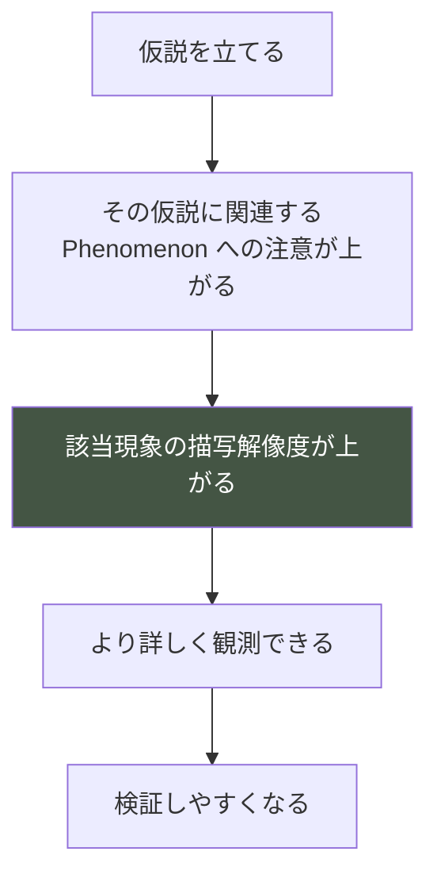

**⚠️ これは「答えを教える」ことではない。**
**「そこを見る目を持った」ことの表現である。**

現実でも、仮説を持って見ると見えるものが変わる。**認知的に正しい。**

**⚠️ ただし、間違った仮説でも描写は詳しくなる。**
正しい仮説だけ詳しくなると、それは正誤の示唆になる（Pillar 2 違反）。

## 4.4 予測（Prediction）の扱い

**仮説から予測への移行が、学習の要である。**

```
仮説：「人が近くにいると食べないのかもしれない」
   ↓
予測：「なら、離れていれば食べるはず」
```

| 項目 | 設計 |
|---|---|
| 予測の記録 | 「明日、確かめたいこと」として1つだけ記録できる |
| 強制 | しない |
| 採点 | **しない** |
| 結果の提示 | しない。プレイヤーが自分で観測する |
| 記録される情報 | **予測を立てたという事実のみ**（内容は文として残るが判定されない） |

**⚠️ predictionResolved の判定は「予測後に該当現象を観測したか」であり、
「予測が当たったか」ではない。**

```
✅ 判定できる：「その後、食事に関する現象を観測した」
❌ 判定できない：「予測通りだった」
```

## 4.5 間違った仮説の扱い

**間違った仮説は、消さない・責めない・訂正しない。**

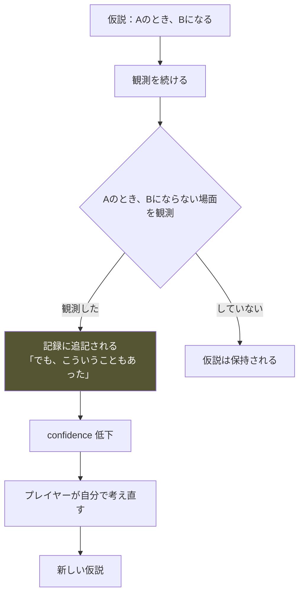

### 追記の文面

```
❌ 「この仮説は誤りでした」
❌ 「正しくは〜です」
✅ 「人が近くにいると、食べないのかもしれない」
   「── でも、Day 14 は人がいても食べていた」
```

**事実の並置のみ。解釈しない。**

**⚠️ この並置が、プレイヤーの中で矛盾を生み、思考を起動する。**
これが Player Flow Phase ④「わかってなかった」の実装である。

## 4.6 仮説の生存と更新

| 状態 | 条件 | 表示 |
|---|---|---|
| **検討中** | 立てたばかり | 推量形 |
| **支持されている** | 一致観測が反証を上回る | やや断定寄りの推量形 |
| **揺らいでいる** | 反証が増えた | 併記される |
| **保留** | プレイヤーが手動で保留 | 一覧の下部へ |

**⚠️ 「棄却」を用意しない。** 仮説は消えない（Player Flow ⑧8.5）。
プレイヤーが保留にできるだけである。

**⚠️ 状態は文体で示す。ラベル・アイコン・色で示さない**（正誤の記号になるため）。

## 4.7 仮説の上限

```
同時に保持できる仮説：5〜7件程度
```

**理由**: 多すぎると管理作業になり、Player Flow ⑫ DE-29（記録が読めない）を招く。
上限に達したら、古い仮説を保留にすることで新しい仮説を立てられる。

**⚠️ 「あと2件立てられます」のような表示をしない。**

## 4.8 実装時の注意点

```
⚠️ 正誤を返す関数を実装しない（そもそも正解を知らない = G-2）
⚠️ 仮説の選択肢に未観測の要素を含めない
⚠️ 正しい仮説だけ描写が詳しくなる実装をしない
⚠️ 仮説を立てることを強制・催促しない
⚠️ 未解決件数・解決率を表示しない（AP-27）
⚠️ 仮説を削除できないようにする
⚠️ 状態を記号（○×色）で示さない
```

---

# ⑤ Learning Loop

> **目的**: 理解が深まるループを多層で設計し、時間スケールごとの学習を成立させる。
> **背景**: Constitution §3.3 でコアループを定義済み。本章はそれを**学習の観点**で再構成し、入れ子構造として詳細化する。
> **設計理由**: 単一のループでは、1分の体験と30日の体験を同時に説明できない。時間スケールごとにループを分け、入れ子にすることで両方を設計可能にする。
> **期待するプレイヤー体験**: 短期の手応えと、長期の変化の両方。
> **他システムとの依存関係**: ②の段階、④の仮説、⑧の振り返り。
> **実装時の注意点**: 各ループが独立して閉じること。上位ループの完結を下位ループの前提にしない。

## 5.1 4層の入れ子ループ

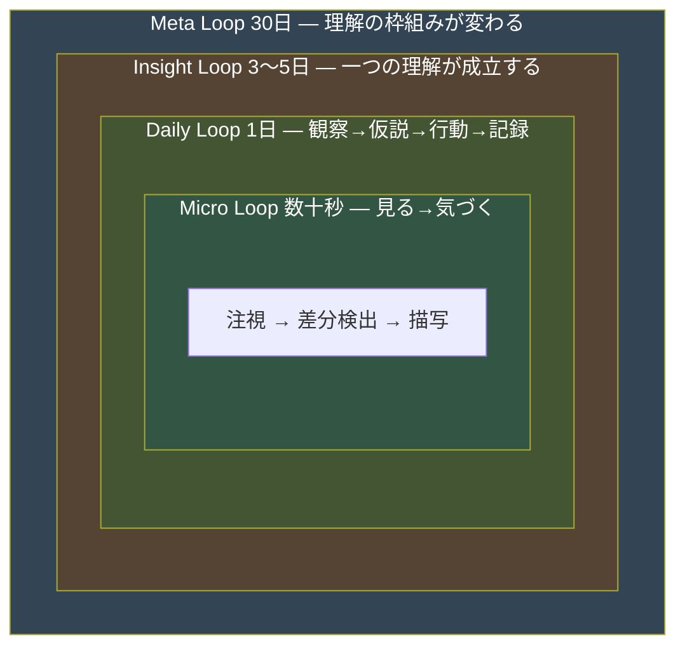

| ループ | 周期 | 完結するもの | 報酬（Experience Bible ⑪） |
|---|---|---|---|
| **Micro** | 数十秒 | 一つの観測 | ER-D 美的 |
| **Daily** | 1日 | 一つの試行 | ER-A 解読（小） |
| **Insight** | 3〜5日 | 一つの理解 | ER-A 解読（大）+ ER-B 関係 |
| **Meta** | 30日 | 枠組みの変化 | ER-C 自己変化 |

## 5.2 Micro Loop（数十秒）

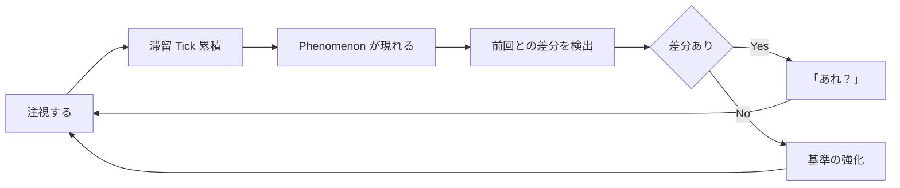

| 段階 | プレイヤーの認知 | システムの動作 |
|---|---|---|
| 注視 | 「見てみよう」 | Observation System が滞留を累積 |
| 差分検出 | 「いつもと違う」 | 前 Tick との Phenomenon 差分 |
| 基準強化 | （無自覚） | 反復観測カウントの増加 |

**⚠️ 差分がない観測にも価値がある。** 基準（いつも）の形成に必要（Player Flow ⑪11.2）。

**失敗モード**: 注視の報酬が薄いと、走査だけで終わる（Player Flow OF-1）。

## 5.3 Daily Loop（1日）

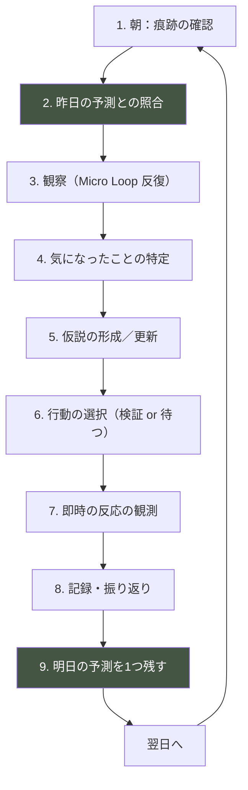

### 各段階の詳細

| # | 段階 | プレイヤーの認知 | システムの動作 | 所要 |
|---|---|---|---|---|
| 1 | 痕跡の確認 | 「昨日の夜、何があったか」 | Trace の観測 | 10-20秒 |
| 2 | **予測との照合** | 「思った通りだった／違った」 | predictionResolved 判定 | 5秒 |
| 3 | 観察 | 「今日は何が違うか」 | Micro Loop × n | 30-60秒 |
| 4 | 気になったこと | 「これは何だろう」 | 観測構造の更新 | 10秒 |
| 5 | 仮説 | 「たぶん〜だから」 | Hypothesis の形成 | 10-20秒 |
| 6 | 行動 | 「試してみよう／待とう」 | Decision の適用 | 10-20秒 |
| 7 | 即時反応 | 「あ、警戒した」 | 短期的な Cue | 10秒 |
| 8 | 記録 | 「今日わかったこと」 | Record の生成 | 10-20秒 |
| 9 | **明日の予測** | 「明日はこうなるはず」 | predictionMade 記録 | 10秒 |

**⚠️ 段階2と段階9が Daily Loop の学習機能そのものである。**
昨日の予測を今日照合し、今日の予測を明日照合する。**この鎖が学習を駆動する。**

### 失敗モード

| 失敗 | 症状 | 原因 |
|---|---|---|
| 予測を立てない | 段階9が空 | 予測の場が使いにくい／動機がない |
| 照合しない | 段階2を飛ばす | 昨日の予測が思い出せない |
| 仮説を立てない | 段階5が空 | 「なぜ」が生まれていない（U3 未到達） |
| 作業化 | 段階3が短い | 差分がない／観測対象が枯渇 |

## 5.4 Insight Loop（3〜5日）

**一つの理解が成立するまでのループ。**

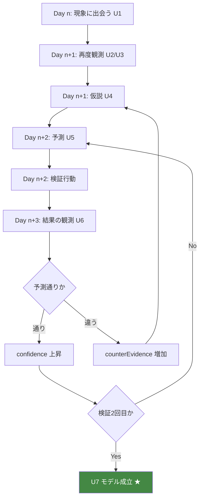

**⚠️ U7 到達には検証2回が必要。** 1回の的中では「たまたま」を排除できない。

**⚠️ これが「一つの気づきに3〜5日かかる」（Player Flow ⑦7.1）の内訳である。**

### 並行する Insight Loop

```
Player Flow ⑦7.2 により、常時2〜3本が並行して走る。

L1 隠れる場所   ━━━★
L2 食事の条件      ━━━━━━━★
L3 音への反応         ━━━━━━━━━★
L4 人との距離              ━━━━━━━━━━★
L5 自分が変数                     ━━━━━━━★
```

**⚠️ 並行することで「どれかは必ず進展する」状態を保つ。**
これが Daily Loop の手応えを維持する。

## 5.5 Meta Loop（30日）

**理解の「枠組み」自体が変わるループ。**

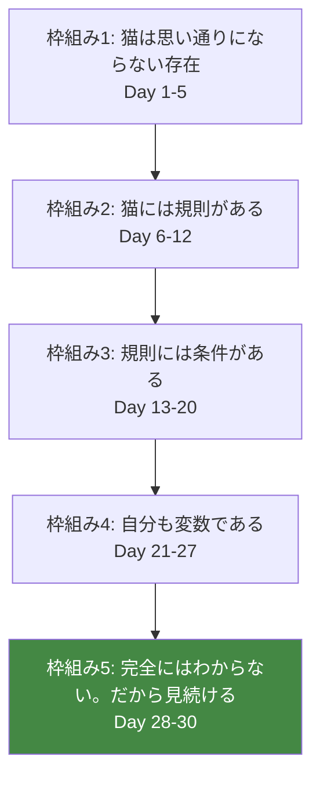

**⚠️ 枠組みの変化は、個別の Insight の蓄積では起きない。**
**「思っていたのと違った」という経験が必要である。**

だから Player Flow Phase ④（Day 13-20）で仮説を破壊する設計が要る。

### 枠組みの変化を起こす仕掛け

| 移行 | 必要な経験 |
|---|---|
| 1→2 | 反復するパターンの発見 |
| 2→3 | **規則が破れる場面の観測**（Phase ④） |
| 3→4 | **自分の行動と猫の反応の相関の発見**（O-15） |
| 4→5 | **説明のつかない揺らぎの残存**（Cat AI ①1.2） |

**⚠️ 枠組み5「完全にはわからない」が最終到達点である。**
これが原則4（猫の気持ちは数値で見えない）の学習的実装。

## 5.6 実装時の注意点

```
⚠️ 各ループが独立して閉じること（上位が未完でも下位は完結する）
⚠️ Daily Loop の段階2・9 を体験の中心に置く
⚠️ Insight Loop の並行本数を2本未満にしない（手応えの枯渇）
⚠️ Meta Loop の枠組み変化を明示的に告げない
⚠️ ループの進行度を可視化しない
⚠️ 「新しい課題」をゲームが提示しない。プレイヤーの中に生まれる
```

---

# ⑥ Knowledge Progression

> **目的**: 30日を通じてプレイヤーが到達しうる理解を段階的に整理する。
> **背景**: Player Flow ② が「最初の30分」を、Experience Bible ③ が感情を扱った。本章は**理解の内容**を時系列で整理する。
> **設計理由**: 到達目標が定義されていなければ、イベント設計・シナリオ設計が何を用意すべきか判断できない。
> **期待するプレイヤー体験**: 振り返ったとき、序盤の自分が幼く見えること。
> **他システムとの依存関係**: Player Flow ② と 1対1で対応。イベント設計の直接の入力。
> **実装時の注意点**: これは「必ず到達する」表ではなく「到達しうる」表である。全員が全部到達する必要はない。

## 6.1 理解の3層（Experience Bible ⑥6.2 再掲）

```
第3層 一般化層  「猫は、安心できない場所では食べない」    ← 転移可能
第2層 解釈層    「この子は、人の動線上では食べない」      ← 個体理解
第1層 現象層    「食器の前まで来て、食べずに戻った」      ← 観測事実
```

## 6.2 段階別の到達内容

### Day 0-1（開始時）

| 層 | 到達内容 |
|---|---|
| 第1層 | 部屋がある。猫が来た。キャリーから出てこない |
| 第2層 | — |
| 第3層 | — |
| **枠組み** | 「思っていたのと違う」 |

**プレイヤーが言えるようになること**: 「猫は、来てすぐには出てこないらしい」

---

### Day 2-5（数日）

| 層 | 到達内容 |
|---|---|
| 第1層 | 餌が減る／トイレが使われる／夜に物音がする／一瞬だけ姿が見える |
| 第2層 | 「見ていない時間に動いているらしい」 |
| 第3層 | 「猫は人がいないときに動くことがある」 |
| **枠組み** | 「見えなくても、生活している」 |

**到達する観察技能**: O-01 耳 L1 / O-05 姿勢 L1 / O-08 食事 L1 / O-12 隠れ方 L1 / O-13 痕跡 L1

**プレイヤーが言えるようになること**
```
・「近づくと逃げる」
・「見ていると出てこない」
・「痕跡を見れば、何かはわかる」
```

**⚠️ この時点で第2層に到達するのは1〜2項目のみ。** それでよい。

---

### Day 6-12（1週間）

| 層 | 到達内容 |
|---|---|
| 第1層 | 決まった時間に決まった場所にいる／環境を変えると反応する／隠れ場所を選ぶ |
| 第2層 | 「この子は◯◯の時間に◯◯にいる」<br/>「この子は高い所／狭い所を好む」<br/>「大きな音がすると隠れる」 |
| 第3層 | 「猫には生活のリズムがある」<br/>「猫は環境に反応する」 |
| **枠組み** | 「規則がある。読める」 |

**到達する観察技能**: 主要対象が L2 へ / O-13 痕跡 L2

**プレイヤーが言えるようになること**
```
・「この子は夕方に活動する」
・「隠れ場所を置いたら使い始めた」
・「音に反応する」
```

**⚠️ Day 11-12 で自信のピーク**（Player Flow ②2.5）。
この時点の理解は**部分的に正しく、かつ過剰一般化されている**。意図的な状態。

---

### Day 13-20（2週間）

| 層 | 到達内容 |
|---|---|
| 第1層 | 規則が破れる／同じことをしても結果が違う／近づくほど遠ざかる／使っていた場所を使わなくなる |
| 第2層 | 「同じ音でも、状況によって反応が違う」<br/>「自分が焦ると、悪くなる」<br/>「待つと、向こうから動く」 |
| 第3層 | 「猫の行動は文脈に依存する」<br/>「単純な法則では説明できない」<br/>**「焦ると悪循環になる」** |
| **枠組み** | 「規則には条件がある。自分の見方が粗かった」 |

**到達する観察技能**: O-06 移動 L2-L3 / O-15 自分自身 L1→L2 ★

**プレイヤーが言えるようになること**
```
・「わかったつもりだった」
・「条件がある」
・「何もしないほうが良いこともある」
```

**⚠️ この段階が本作の中核。** ここを通らないと、Day 21 以降は成立しない。

---

### Day 21-27（3週間）

| 層 | 到達内容 |
|---|---|
| 第1層 | 同じ仕草が違う意味を持つ／自分の動きに反応している／序盤に見た行動の意味が読める |
| 第2層 | 「この子は、こういうときは、こうなる」（条件付きモデル）<br/>「自分が◯◯すると、この子は◯◯する」 |
| 第3層 | 「猫は人の振る舞いを見ている」<br/>「観察には方法がある」<br/>「一つの仕草に一つの意味を割り当てられない」 |
| **枠組み** | **「自分も変数である」** |

**到達する観察技能**: 主要対象が L3 へ / **O-15 自分自身 L3 ★★**

**プレイヤーが言えるようになること**
```
・「あのとき、この子はこう感じていたのかもしれない」
・「変わったのは、この子じゃなくて自分の見方だ」
・「猫を見るというのは、自分を見ることでもある」
```

**⚠️ Day 24 の最大ピーク**（Player Flow ⑨9.3）はここに配置される。

---

### Day 28-30（30日）

| 層 | 到達内容 |
|---|---|
| 第1層 | 30日分の記録／自分の仮説の変遷 |
| 第2層 | この子についての、条件付きで確からしいモデル群 |
| 第3層 | 「個体差がある。一般論は目の前の子には当てはまらないことがある」<br/>「わからないことは、わからないままでよい」<br/>**「わからない相手を、わかろうとする方法がある」** |
| **枠組み** | **「完全にはわからない。だから見続ける」** |

**プレイヤーが言えるようになること**
```
・「この子のことは、だいたいわかった。でも全部ではない」
・「猫と暮らすというのは、こういうことか」
・「自分に何ができて、何ができないか」
```

## 6.3 到達内容の一覧（第3層のみ）

**現実に転移する一般化。これが本作の教育的成果物である。**

| # | 一般化 | 到達目安 | 転移価値 |
|---|---|---|---|
| G-01 | 猫は人がいないときに動くことがある | Day 5 | 中 |
| G-02 | 猫には生活のリズムがある | Day 10 | 高 |
| G-03 | 猫は環境に反応する | Day 10 | **最高** |
| G-04 | 猫は環境の変化そのものをストレスに感じる | Day 15 | **最高** |
| G-05 | 猫の行動は文脈に依存する | Day 17 | 高 |
| G-06 | 焦って距離を詰めると逆効果になる | Day 18 | **最高** |
| G-07 | 待つことには効果がある | Day 20 | **最高** |
| G-08 | 猫は人の振る舞い（速度・視線・姿勢）を見ている | Day 23 | **最高** |
| G-09 | 一つの仕草に一つの意味を割り当てられない | Day 25 | 高 |
| G-10 | 猫には個体差がある。一般論が当てはまらないことがある | Day 27 | **最高** |
| G-11 | 猫は思い通りにならない。それでよい | Day 28 | 高 |
| G-12 | 迎えるかどうかは、猫のために判断すること | Day 30 | **最高** |
| G-13 | **わからない相手を、わかろうとする方法がある** | Day 30 | **最高** |

**⚠️ G-13 が本作の最終的な学習目標である。**（Experience Bible ⑥6.7）
これは猫以外にも適用できる。

## 6.4 到達の保証と非保証

| 保証する | 保証しない |
|---|---|
| G-01〜G-03 は全プレイヤーが到達する | G-09〜G-13 の全到達 |
| G-06・G-07 は Phase ④ を通れば到達する | 特定の第2層理解 |
| 学習ラインが最低3本成立する | 全ラインの完走 |
| 30日で「わかる」ところまで行ける | 「全部わかる」 |

**⚠️ 全部到達しなくてよい。** 未到達は失敗ではない（Player Flow ⑦LF-5）。

## 6.5 実装時の注意点

```
⚠️ 到達内容を目標として提示しない
⚠️ 未到達の内容を可視化しない
⚠️ 到達を通知しない
⚠️ G-13 を明文としてゲーム内に書かない（説教になる）
⚠️ 到達内容は「言えるようになること」であり、記録の文言ではない
⚠️ 個体によって到達可能な内容が異なる（Cat AI ④）
```

---

# ⑦ Misunderstanding Design

> **目的**: プレイヤーが陥る誤解を列挙し、ゲーム内で自然に修正する仕組みを設計する。
> **背景**: Experience Bible ⑥6.5 で誤解を3分類（一時的／有用／有害）した。本章は具体的な誤解を列挙し、修正フローを設計する。
> **設計理由**: 誤解は避けられない。避けられない以上、**誤解を学習の材料として設計する**しかない。そして有害な誤解は、現実の猫に害を及ぼすため必ず修正しなければならない。
> **期待するプレイヤー体験**: 「そう思っていたけど、違った」という健全な訂正。
> **他システムとの依存関係**: ④の反証、⑤の Insight Loop、⑩ Reality Transfer。
> **実装時の注意点**: 修正は説明で行わない。反証となる現象に出会わせる。

## 7.1 誤解の分類と扱い

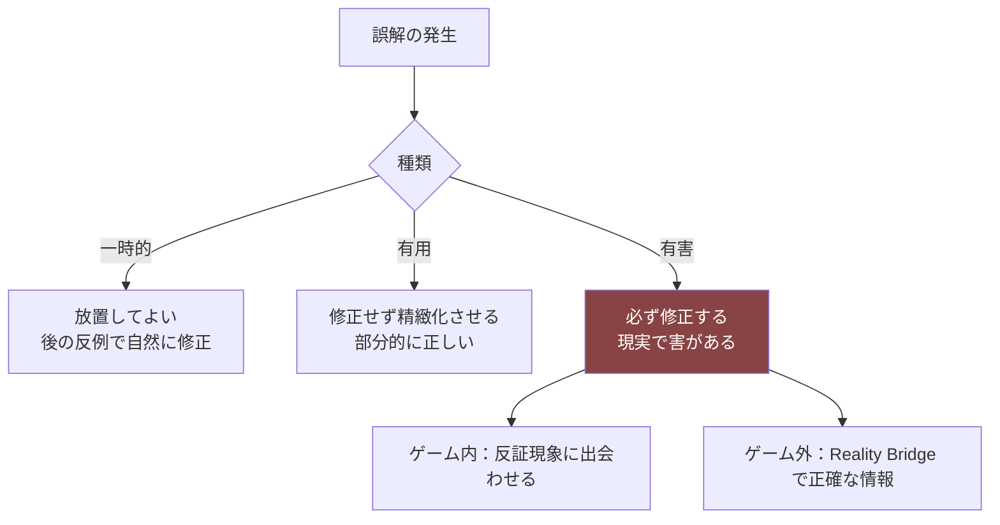

## 7.2 誤解一覧

### A. 関係についての誤解（MU-01〜MU-08）

| # | 誤解 | 種類 | なぜ生じるか | 現実での害 | ゲーム内での修正 |
|---|---|---|---|---|---|
| MU-01 | 「懐いていない」 | 有害 | 接触がないことを関係の不在と解釈 | 諦め・返却 | 距離を保ったまま行動が変化する現象を見せる（並在・同室時間の増加） |
| MU-02 | 「嫌われた」 | 有害 | 回避を拒絶と解釈 | 自己否定・関わりの断絶 | 回避の直後にも通常の生活行動が続くことを観測させる |
| MU-03 | 「わざとやっている」 | **最有害** | 行動に意図を読み込む | **懲罰的対応** | 同じ行動が人の不在時にも起きることを痕跡で示す |
| MU-04 | 「復讐している」 | **最有害** | 粗相などを報復と解釈 | 懲罰・虐待 | 粗相の前に環境条件の変化があることを観測可能にする |
| MU-05 | 「慣れれば触れるようになる」 | 有害 | 慣れと接触許容を同一視 | 無理な接触・信頼の破壊 | PT-21 接触忌避型の存在／慣れても接触は別問題 |
| MU-06 | 「たくさん構えば懐く」 | **最有害** | 接触量と関係を比例と考える | **過干渉による悪循環** | Phase ④ の悪循環体験そのもの |
| MU-07 | 「名前を呼べばわかる」 | 一時的 | 犬との混同 | 期待外れ | 反応しない現象の反復。ただし音として認識はする |
| MU-08 | 「目を見て話しかければ伝わる」 | 有害 | 人間的コミュニケーションの投影 | 威嚇シグナルの発信 | 直視で退避する現象の反復 |

### B. ボディランゲージの誤解（MU-09〜MU-16）

| # | 誤解 | 種類 | なぜ生じるか | 現実での害 | ゲーム内での修正 |
|---|---|---|---|---|---|
| MU-09 | 「ゴロゴロ＝機嫌が良い」 | **最有害** | 最も流布した俗説 | **不調の見逃し** | CB-094/095 を音で区別不能に。文脈の違う場面で両方を観測させる |
| MU-10 | 「お腹を見せる＝撫でて」 | **最有害** | 犬との混同 | **接触→防御反応→信頼破壊** | CB-017 の後に接触すると明確に後退する |
| MU-11 | 「尻尾を振る＝嬉しい」 | **最有害** | 犬との混同 | 苛立ちの見逃し・咬傷 | 狩猟集中時と苛立ち時の両方で尻尾振りを観測させる |
| MU-12 | 「瞳孔が開く＝怖がっている」 | 有用 | 部分的に正しい | 誤診断 | 遊び時・暗所でも散大することを観測させる |
| MU-13 | 「伏せている＝くつろいでいる」 | 有害 | 姿勢の意味の誤読 | 警戒状態での接近 | CB-015（足を体の下）の直後に逃げる現象 |
| MU-14 | 「動かない＝落ち着いている」 | 有害 | 静止を安心と解釈 | 硬直状態の見逃し | CB-083 硬直と CB-014 香箱座りを対比させる |
| MU-15 | 「毛づくろい＝リラックス」 | 有用 | 部分的に正しい | 葛藤の見逃し | CB-047 と CB-051 を同じ見た目で提示 |
| MU-16 | 「あくび＝眠い」 | 一時的 | 人間の投影 | 小 | 葛藤時のあくび（CB-123）を観測させる |

### C. 環境についての誤解（MU-17〜MU-24）

| # | 誤解 | 種類 | なぜ生じるか | 現実での害 | ゲーム内での修正 |
|---|---|---|---|---|---|
| MU-17 | 「猫は高い所が好き」 | 有用 | 一般論として概ね正しい | 個体差の無視 | T-6 が低い個体の存在 |
| MU-18 | 「良い物を買えば良い環境」 | 有害 | 消費で解決する発想 | 無駄な出費・本質の見逃し | 高価な家具に相当する物が使われない現象 |
| MU-19 | 「隠れ場所を作れば安心」 | 有害 | 遮蔽だけを見る | 逃走路のない場所を作る | exitScore=0 の隠れ場所が使われない |
| MU-20 | 「掃除すればするほど良い」 | **最有害** | 清潔＝善という発想 | **自己臭の除去による不安増大** | 掃除の翌日に定位置の使用が減る現象 |
| MU-21 | 「模様替えで気分転換」 | 有害 | 人間の感覚の投影 | 大きなストレス | 環境変更直後の警戒（04 §4.8） |
| MU-22 | 「一度に全部整えるのが効率的」 | 有害 | 効率思考 | 混乱の長期化 | 複数同時変更で再学習が並行して混乱 |
| MU-23 | 「トイレは目立たない場所に」 | 有用 | 部分的に正しい | 行き止まりへの設置 | 逃走路のないトイレが使われない |
| MU-24 | 「食器と水は隣に置く」 | 有害 | 人間の食卓の投影 | 飲水量の低下 | 距離を離すと飲水が増える |

### D. 生活・健康についての誤解（MU-25〜MU-32）

| # | 誤解 | 種類 | なぜ生じるか | 現実での害 | ゲーム内での修正 |
|---|---|---|---|---|---|
| MU-25 | 「食べないのは餌が嫌い」 | **最有害** | 単一原因の想定 | **不安・不調の見逃し** | 同じ餌でも環境を変えると食べる |
| MU-26 | 「隠れているのは寂しい」 | 有害 | 感情の投影 | 引き出そうとする介入 | 隠れている時の生理指標が安定していることを行動で示す |
| MU-27 | 「鳴くのは呼んでいる」 | 有用 | 部分的に正しい | 過剰な応答 | 要求以外の文脈での発声を観測させる |
| MU-28 | 「寝てばかりで元気がない」 | 一時的 | 人間の睡眠との比較 | 過剰な心配 | 睡眠時間の長さが正常であることを反復で示す |
| MU-29 | 「トイレを我慢するのは平気」 | **最有害** | 軽視 | **泌尿器疾患のリスク** | CB-046 我慢の観測 + Reality Bridge |
| MU-30 | 「毛づくろいが多いのは綺麗好き」 | **最有害** | 好意的解釈 | **ストレス性過剰グルーミングの見逃し** | CB-052 とストレス指標の相関 |
| MU-31 | 「窓を見ているのは外に出たい」 | 有用 | 部分的に正しい | 脱走リスクの軽視 | 外部刺激との相関 + Reality Bridge |
| MU-32 | 「元気がないのは性格」 | **最有害** | 個体差への帰属 | **体調不良の見逃し** | PT-24 低活動型と Condition 低下の対比 |

### E. プロセスについての誤解（MU-33〜MU-38）

| # | 誤解 | 種類 | なぜ生じるか | 現実での害 | ゲーム内での修正 |
|---|---|---|---|---|---|
| MU-33 | 「関係は一方向に進む」 | 有害 | 進捗の想定 | 後退時の絶望 | Trust の日常的な微減（04 §5.7） |
| MU-34 | 「早く慣れるほど良い」 | 有害 | 速度＝成功 | 焦り | 早期の接近が後退を招く場面 |
| MU-35 | 「うまくいかないのは自分のせい」 | 有害 | 過剰な自責 | 自己否定 | 個体差による差異／責めない記録文体 |
| MU-36 | 「攻略法がある」 | **最有害** | ゲーム的思考 | 個体を見なくなる | 前周回の手が通用しない（周回時） |
| MU-37 | 「懐いたら完了」 | 有害 | ゴール思考 | 継続的観察の停止 | 終盤でも新しい発見が続く |
| MU-38 | 「見送りは失敗」 | **最有害** | 成功/失敗の二分 | **無理な譲渡／自己否定** | 3結末の等価な演出（憲章 I-9） |

**総計 38 項目**

## 7.3 修正フローの原則

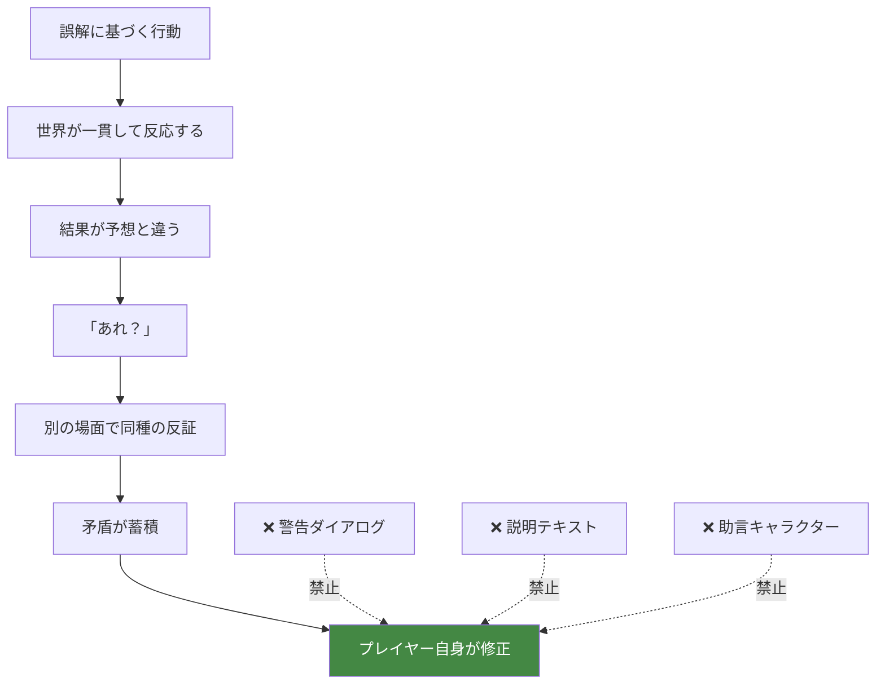

### 修正の3原則

| # | 原則 | 内容 |
|---|---|---|
| **MC-1** | 説明しない | 反証となる現象に出会わせる |
| **MC-2** | 複数回示す | 1回の反例では偶然と解釈される（3回ルール） |
| **MC-3** | 責めない | 誤解していたことを指摘しない |

## 7.4 有害な誤解への二段構え

**最有害（★）に分類した12項目は、ゲーム内修正だけに依存しない。**

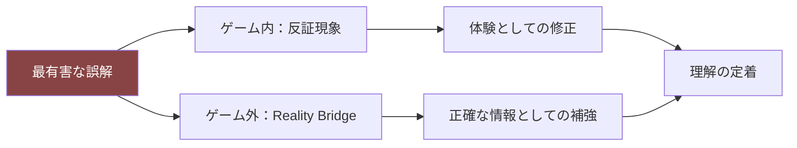

### 最有害12項目

```
MU-03 わざとやっている        MU-20 掃除すればするほど良い
MU-04 復讐している            MU-25 食べないのは餌が嫌い
MU-06 たくさん構えば懐く      MU-29 トイレ我慢は平気
MU-09 ゴロゴロ＝機嫌が良い    MU-30 毛づくろい多い＝綺麗好き
MU-10 お腹を見せる＝撫でて    MU-32 元気ないのは性格
MU-11 尻尾を振る＝嬉しい      MU-36 攻略法がある
MU-38 見送りは失敗
```

**⚠️ これらが修正されないままリリースすることは、誤った知識を広めることになる。**
Mission 2・3 に反し、憲章§9.2 違反である。

**⚠️ ゲーム内での修正機会が確実に発生することを、検証項目とする**（⑫ Q群）。

## 7.5 実装時の注意点

```
⚠️ 警告ダイアログを実装しない（Experience Bible ⑥6.5）
⚠️ 「それは誤りです」というテキストを書かない
⚠️ 反証となる現象は、必ず観測可能な形で発生させる（SR-1）
⚠️ 反証を1回で済ませない（3回ルール）
⚠️ 誤解していたことをプレイヤーに指摘しない
⚠️ 最有害12項目は Reality Bridge でも扱う（二段構え）
⚠️ 修正機会の発生を自動テストで検証する
```

---

# ⑧ Reflection System

> **目的**: 1日の終わりに「何を理解できたか」を中心とした振り返りを設計する。
> **背景**: Player Flow ③[7] で振り返り段階を定義済み。Experience Bible ⑥6.4 技法2 で「不完全な言語化」を規定済み。本章はそれを実装可能な形にする。
> **設計理由**: 振り返りがなければ、経験は記憶されるが理解にならない。しかし「今日の成果」を評価すると、それは採点になる。**言語化はするが評価しない**機構が必要。
> **期待するプレイヤー体験**: 自分の言葉が残り、後で読み返すと自分の変化が見える。
> **他システムとの依存関係**: ②の段階、④の仮説、P-05 Record System、P-06 Narration。
> **実装時の注意点**: 記録は追記のみ。書き換え・削除を実装しない。

## 8.1 振り返りの構造

**「今日は何が起きたか」ではなく「今日は何を理解できたか」。**

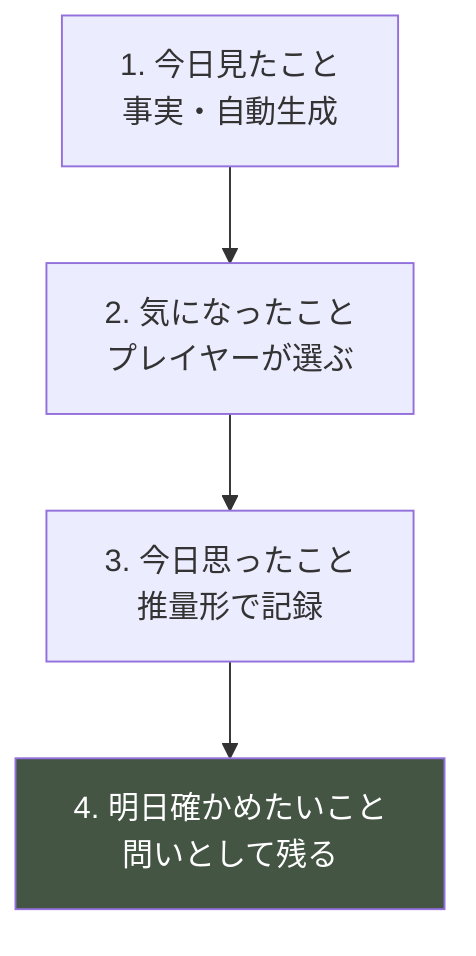

| # | 要素 | 生成 | 文体 | 目的 |
|---|---|---|---|---|
| 1 | 今日見たこと | 自動 | 事実の記述 | 第1層の記録 |
| 2 | 気になったこと | プレイヤーが選択 | 事実の抜粋 | 注意の焦点化 |
| 3 | 今日思ったこと | 選択 + 整形 | **推量形** | 第2層の言語化 |
| 4 | 明日確かめたいこと | 選択 | **疑問形** | M1・予測の記録 |

## 8.2 各要素の設計

### 1. 今日見たこと（自動生成）

```
・観測した Phenomenon のうち、重要度の高いものを数行
・事実のみ。解釈を含まない
・プレイヤーが観測していないものは含まれない ★
```

**⚠️ 観測していないことは書かれない。** これが Pillar 1 の記録における実装。

```
❌ 「猫は夜、部屋を歩き回っていました」（観測していないのに書かれる）
✅ 「朝、物の位置が変わっていた」（観測した痕跡のみ）
```

### 2. 気になったこと（選択）

```
・今日観測した Phenomenon の中から、1〜2件を選ぶ
・選ばなくてもよい
・選ぶと、その対象への注意が上がる（描写解像度への寄与）
```

**⚠️ 「重要なもの」を推奨表示しない。** プレイヤーが自分で選ぶ。

### 3. 今日思ったこと（推量形）

**Experience Bible ⑥6.4 技法2「不完全な言語化」の実装。**

| ❌ 書かない | ✅ 書く |
|---|---|
| 「猫は視線を威嚇と感じる」 | 「目が合うと逃げる。まっすぐ見ないほうがいいのかも」 |
| 「環境変化はストレスである」 | 「昨日棚を動かしたからかな。今日はずっと隠れてた」 |
| 「安心できないと食べない」 | 「食器の前まで来て戻った。何が気になったんだろう」 |

**文体規則**

```
□ 推量形（〜かも／〜だろうか／〜らしい）を基本とする
□ 断定は、検証が2回以上成立した場合のみ
□ 一人称のメモ。教科書調にしない
□ 専門用語を使わない
□ 教訓を書かない
```

**⚠️ 文体が理解の段階を表す。** これが数値を使わない進捗表現である。

| 段階 | 文体の例 |
|---|---|
| U1-U2 | 「何かしてた」「よくわからない」 |
| U3 | 「いつもこうしてる気がする」 |
| U4 | 「〜だからかもしれない」 |
| U5-U6 | 「〜なら〜になるはず。明日確かめよう」 |
| U7 | 「この子は、〜のときは〜になる」 |

### 4. 明日確かめたいこと（問い）

```
・1つだけ記録できる
・疑問形で残る
・翌朝、最初に提示される ★
・答えは提示されない
```

**⚠️ 翌朝の提示が、Daily Loop 段階2（予測との照合）を成立させる。**

## 8.3 記録の参照

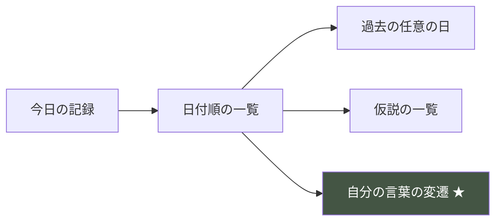

### 「自分の言葉の変遷」の設計

**ER-C（自己変化報酬）の最強の実装。**

```
Day 3  「よくわからない。ずっと隠れてる」
Day 9  「夕方になると出てくる気がする」
Day 15 「音がすると隠れる。でも今日は音がしても出てた」
Day 22 「人がいないときの音は平気なのかも」
Day 27 「この子は、音そのものより、音と人が同時にあるのが苦手らしい」
```

**⚠️ この並置が、プレイヤーに自分の成長を見せる唯一の手段である。**

**⚠️ 「成長しました」とは書かない。** 並べるだけ。

## 8.4 評価の完全な排除

| ❌ 実装しない | 理由 |
|---|---|
| 「今日の成果」 | 採点 |
| 「よくできました」 | 評価（憲章 I-10） |
| 観察回数の表示 | 数値化（憲章 I-1） |
| 「◯個の気づきを得ました」 | 進捗率（AP-27） |
| 星・スタンプ・バッジ | 実績（憲章 I-7） |
| 「もっと観察しましょう」 | 説教・催促 |
| 前日との比較 | 評価 |

**⚠️ 記録は鏡であって、通知表ではない。**

## 8.5 記録の負担管理

**1日1〜2分の中で、振り返りは10〜20秒で完了しなければならない。**

| 要素 | 操作 | 所要 |
|---|---|---|
| 1. 今日見たこと | 読むだけ | 5秒 |
| 2. 気になったこと | タップ1〜2回（省略可） | 5秒 |
| 3. 今日思ったこと | 選択（省略可） | 5秒 |
| 4. 明日確かめたいこと | 選択（省略可） | 5秒 |

**⚠️ すべて省略可能。** 省略しても進行に支障はない。
ただし省略すると、Daily Loop の段階2・9 が機能しないため、理解は進みにくい。

**⚠️ 省略したことを指摘しない。**

## 8.6 実装時の注意点

```
⚠️ 記録は追記のみ。書き換え・削除を実装しない（Player Flow P-05）
⚠️ 観測していないことを記録に書かない
⚠️ 推量形を基本とし、断定は検証2回以上のみ
⚠️ 評価・採点・進捗を一切出力しない
⚠️ 「明日確かめたいこと」を翌朝提示する（Daily Loop の要）
⚠️ 全要素を省略可能にする
⚠️ 記録の総量が30日で読み切れる分量に収まること
```

---

# ⑨ Emotional Learning

> **目的**: 感情を経由した学習の定着機構を設計する。
> **背景**: Experience Bible ⑧ で感情設計を、⑪ で感情的報酬を定義済み。本章はそれを**学習の観点**で再構成する。
> **設計理由**: 感情は学習の定着剤である。特に**予測誤差（驚き・悔しさ）が学習を駆動する**ことは認知科学の基本知見である。感情設計と学習設計は分離できない。
> **期待するプレイヤー体験**: 感情が動いた出来事が、理解として残る。
> **他システムとの依存関係**: Experience Bible ③⑧⑪、⑤ Learning Loop。
> **実装時の注意点**: 感情を報酬として与えない。学習の結果として発生させる。

## 9.1 感情と学習の関係

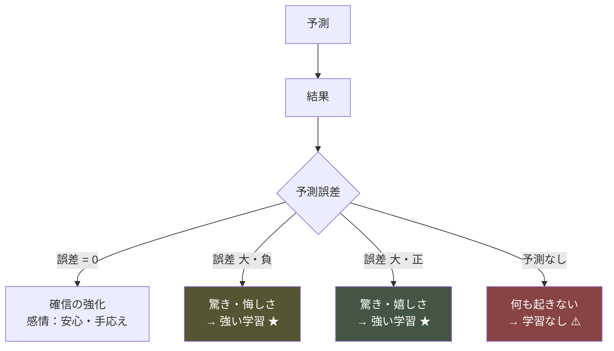

> ### **予測しなければ、予測誤差も起きず、学習も起きない。**

**⚠️ これが ④ Hypothesis System が学習設計の中核である理由である。**

## 9.2 感情別の学習機能

| 感情 | 発生条件 | 学習機能 | 配置 |
|---|---|---|---|
| **驚き** | 予測が大きく外れる | **最強の学習駆動**。注意を焦点化する | Phase ③④⑤ |
| **悔しさ** | 予測が外れ、自分の見落としが原因 | 内省の起動。次の観察の動機 | Phase ④ |
| **嬉しさ** | 予測が当たる | 確信の強化。方法の妥当性の確認 | Phase ③⑤ |
| **安心** | 予測可能な状態が続く | 基準（いつも）の定着 | Phase ⑤ |
| **達成感** | 一連の理解が繋がる | モデルの統合 | Phase ⑤ |
| **共感** | 猫の状態が想像できる | **視点取得の成立** | Phase ⑤⑥ |
| **戸惑い** | 矛盾する観測 | 枠組みの見直しの起動 | Phase ④ |
| **もどかしさ** | 情報が足りない | 観察の動機 | 全期間 |

## 9.3 「驚き」の設計（最重要）

**驚きは、予測があって初めて生まれる。**

```mermaid
sequenceDiagram
    participant P as プレイヤー
    participant R as 記録
    participant W as 世界

    Note over P: Day n：仮説を立てる
    P->>R: 「音がすると隠れるのかも」
    Note over P: Day n+1：予測を立てる
    P->>R: 「明日も音がしたら隠れるはず」
    W->>P: Day n+2：音がした。しかし隠れない
    Note over P: 驚き ★
    Note over P: 「なんで？」← 注意が最大化
    P->>P: 今日と昨日の違いを探す
    Note over P: 「昨日は自分が近くにいた」
    Note over P: 条件の発見 → U7 へ
```

**⚠️ 予測を記録していなければ、この驚きは発生しない。**
「音がしても隠れなかった」を、ただの出来事として流してしまう。

**⚠️ だから ⑧ Reflection System の要素4「明日確かめたいこと」が決定的に重要である。**

## 9.4 「悔しさ」の設計

**悔しさは、自責に転じてはならない。**

```
✅ 健全な悔しさ：「見落としていた。次は見よう」
❌ 有害な自責  ：「自分が悪い。猫に申し訳ない」（MU-35 / 憲章 I-10）
```

### 分岐条件

| 要因 | 健全な悔しさ | 有害な自責 |
|---|---|---|
| 原因の所在 | 観察の不足 | 人格・資質 |
| ゲームの反応 | 何も言わない | 責める／同情する |
| 回復の可能性 | 明確にある | 見えない |
| 記録の文体 | 事実の記述 | 評価・反省 |

**⚠️ 記録に「反省」を書かせない。** 事実と気づきのみ。

## 9.5 「共感」の設計 — 最終到達点

**共感は、感情移入ではなく視点取得である。**

```
❌ 感情移入：「かわいそう」「寂しそう」（人間の感情の投影）
✅ 視点取得：「この位置からだと、あの音は近く聞こえるだろう」
```

### 共感が成立する条件

```mermaid
graph TB
    A["猫の位置・向き・状態を観測している"] --> D["視点取得"]
    B["環境の条件を理解している"] --> D
    C["猫の反応則を理解している"] --> D
    D --> E["「この子から見たら、こう見えているはずだ」"]

    style E fill:#484,color:#fff
```

**⚠️ 共感は Day 21 以降にしか成立しない。** 前提となる理解が必要だからである。

**⚠️ 共感を演出で誘発しない。** かわいそうな音楽・表情は、感情移入（誤り）を誘発する。

## 9.6 感情ピークと学習の対応

| Day | 感情ピーク | 対応する学習 |
|---|---|---|
| 6-7 | 最初の因果体験 | G-03「猫は環境に反応する」 |
| 11-12 | 自信のピーク | 第2層モデルの構築（過剰一般化含む） |
| **17** | **最深部・悔しさ** | **G-06「焦ると逆効果」** |
| **20** | **転回・驚き** | **G-07「待つことには効果がある」** |
| **24** | **最大ピーク・理解** | **G-08「猫は人の振る舞いを見ている」** |
| 30 | 決断・責任 | G-12「猫のために判断する」 |

**⚠️ 感情ピークと学習到達が一致していることが、本作の設計の核心である。**
感情が動いた瞬間に理解が生まれるのではなく、**理解が生まれた瞬間に感情が動く**。

## 9.7 実装時の注意点

```
⚠️ 感情を報酬として与えない（Experience Bible ⑪）
⚠️ 「わかった瞬間」に効果音・演出を付けない（AP-70）
⚠️ 悔しさを自責に転じさせない（記録文体の管理）
⚠️ 共感を感情移入と混同させる演出をしない
⚠️ 予測の記録がなければ驚きは発生しない。要素4を軽視しない
⚠️ 感情を先読みして演出しない（EF-1）
```

---

# ⑩ Reality Transfer

> **目的**: ゲーム内の理解を現実へ転移させる機構を、学習理論に基づいて設計する。
> **背景**: Experience Bible ⑩ で Reality Bridge の4層を定義済み。本章はその**転移（transfer）の成立条件**を扱う。
> **設計理由**: 学習の転移は自動的には起きない。転移を起こすには、抽象化・複数文脈・メタ認知の3条件が必要である。これを30日の中に組み込む。
> **期待するプレイヤー体験**: 街で猫を見たとき、見方が変わっている。
> **他システムとの依存関係**: Experience Bible ⑩、⑥ Knowledge Progression の第3層、⑦の有害な誤解。
> **実装時の注意点**: 「現実でも使えます」と言わない。使えることに自分で気づかせる。

## 10.1 転移の3レベル

```mermaid
graph TB
    A["ゲーム内の理解<br/>この子について"]
    A --> B["近転移<br/>ゲーム内の別個体"]
    A --> C["中転移<br/>現実の猫"]
    A --> D["遠転移 ★<br/>猫以外の他者"]

    B --> B1["周回時に検証される"]
    C --> C1["ゲーム終了後に起きる"]
    D --> D1["言語化されないまま作用する"]

    style D fill:#484,color:#fff
```

| レベル | 対象 | 転移するもの | 検証可能性 |
|---|---|---|---|
| **近転移** | ゲーム内の別個体 | 観察の方法（内容は転移しない） | 周回で検証可能 |
| **中転移** | 現実の猫 | 第3層の一般化 G-01〜G-12 | アンケートで測定 |
| **遠転移** | 人間関係・他者理解 | G-13「わかろうとする方法」 | 測定困難 |

## 10.2 転移が成立する3条件

**教育心理学における転移の必要条件。**

```mermaid
graph LR
    A["条件1<br/>抽象化された原理の言語化"] --> T["転移"]
    B["条件2<br/>複数文脈での適用経験"] --> T
    C["条件3<br/>メタ認知<br/>どう学んだかの自覚"] --> T

    style T fill:#484,color:#fff
```

### 条件1: 抽象化された原理の言語化

**第3層（一般化層）が、プレイヤー自身の言葉で存在すること。**

| 実装 | 内容 |
|---|---|
| 場所 | Reflection の要素3「今日思ったこと」 |
| 発生条件 | 検証が2回以上成立した Insight |
| 文体 | プレイヤーの一人称 |
| ゲームの関与 | **言語化を補助する。内容は与えない** |

```
❌ ゲームが書く：「猫は環境に反応します」
✅ プレイヤーが選ぶ：「猫って、部屋の様子で行動が変わるんだな」
```

**⚠️ 選択肢は、プレイヤーが観測した内容からのみ構成される**（④4.2 と同じ原則）。

### 条件2: 複数文脈での適用経験

**同じ原理が、異なる場面で通用することを経験する。**

| 原理 | 文脈1 | 文脈2 | 文脈3 |
|---|---|---|---|
| G-03 環境に反応する | 隠れ場所 | 食事場所 | トイレ |
| G-06 焦ると逆効果 | 接近 | 環境変更の頻度 | 掃除 |
| G-08 人の振る舞いを見ている | 距離 | 速度 | 視線 |

**⚠️ 一つの原理を、必ず3つ以上の文脈で経験させる。**
これがイベント設計・シナリオ設計への必達要件になる。

### 条件3: メタ認知

**「自分がどうやってわかるようになったか」の自覚。**

```mermaid
graph TB
    A["30日間の記録の並置"] --> B["自分の言葉の変遷が見える"]
    B --> C["「最初は何もわからなかった」"]
    C --> D["「見方が変わったんだ」"]
    D --> E["「見続ければ、わかるようになる」★"]

    style E fill:#484,color:#fff
```

**⚠️ E が本作の最終的な学習成果である。**
これは知識ではなく、**方法についての信念**である。だから転移する。

**⚠️ ゲームは「見続ければわかる」と書かない。** 記録を並べるだけ。

## 10.3 転移の時系列

```mermaid
graph LR
    subgraph GAME["ゲーム内 Day 1-30"]
        A["第1層 現象"]
        B["第2層 この子"]
        C["第3層 一般化"]
        A --> B --> C
    end
    subgraph POST["終了直後"]
        D["記録の振り返り"]
        E["メタ認知の成立"]
        D --> E
    end
    subgraph REAL["現実 数日〜"]
        F["猫を見たときの視線の変化"]
        G["情報を自分で調べる"]
        H["行動の可能性"]
    end

    C --> D
    E --> F
    E --> G
    G --> H
```

**⚠️ 転移は終了直後には観測できない。** 数日後に、現実の猫を見たときに起きる。

**⚠️ したがって「今すぐ行動を」という導線は転移を助けない。**
むしろ感情操作になり、Reality Bridge の R-3（余韻）に違反する。

## 10.4 転移を助ける設計

| ✅ 助ける | ❌ 助けない・妨げる |
|---|---|
| 第3層の言語化の機会 | 第3層をゲームが提示する |
| 3文脈以上での経験 | 1回だけの体験 |
| 記録の並置による自己変化の可視化 | 「成長しました」の通知 |
| ゲーム内知識がすべて現実に基づくこと | ゲーム独自の嘘の設定 |
| 終了後の任意の情報提示 | 感動直後の行動喚起 |
| 「わからないこともある」の残存 | 「全部わかった」感 |

## 10.5 有害な誤解の二段構え（⑦7.4 との接続）

**最有害12項目は、ゲーム外でも扱う。**

| ゲーム内 | ゲーム外（Reality Bridge 層3） |
|---|---|
| 反証となる現象に出会わせる | 正確な情報として明示する |
| 説明しない | 説明してよい |
| 3回以上の反証 | 一度の明確な記述 |

**⚠️ ゲーム外では説明してよい。** ゲームが終わった後は、教育の場である。
ただし押し付けない（任意・静かに・中立に）。

### ゲーム外で扱うべき項目（例）

```
□ 喉鳴らしの多義性（MU-09）
□ 仰向けの意味（MU-10）
□ トイレの回数と健康（MU-29）
□ 過剰グルーミングのサイン（MU-30）
□ 体調変化への気づき方（MU-32）
□ 脱走対策（MU-31 / Cat AI ⑧8.3）
□ 「気になったら獣医へ」という原則
```

**⚠️ 医療的判断をゲームに依らせない旨を明示する**（憲章§7.4）。

## 10.6 転移の測定

| 対象 | 方法 | 注意 |
|---|---|---|
| 近転移 | 周回時の行動データ | 「前回の答えが通用しない」ことの体感 |
| 中転移 | プレイ後アンケート（任意） | 強制しない |
| 遠転移 | 測定しない | 測定困難かつ追跡は不適切 |

### アンケート項目（例・任意回答）

```
□ 猫の行動の意味を、以前より想像できるようになったか
□ 保護猫を迎えることへの印象は変わったか
□ 現実の猫を見たとき、見方が変わったと感じるか
□ 「わからないものをわかろうとする」ことについて、何か考えたか
```

**⚠️ 「何人が猫を迎えたか」を成功指標にしない**（Experience Bible ⑩10.7）。

## 10.7 実装時の注意点

```
⚠️ 「現実でも使えます」と書かない
⚠️ 第3層の内容をゲームが提示しない。選択肢はプレイヤーの観測から構成
⚠️ 一つの原理を3文脈以上で経験させる（イベント設計への必達要件）
⚠️ メタ認知は記録の並置でのみ実現する
⚠️ 感動直後に行動喚起を置かない（Experience Bible ⑩R-3）
⚠️ 最有害12項目はゲーム外でも扱う
⚠️ 医療判断をゲームに依らせない旨を明示する
```

---

# ⑪ Anti Learning Design

> **目的**: 避けるべき教育設計を網羅列挙し、判断コストを消す。
> **背景**: 教育目的のゲームの大半は、善意の追加によって学習効果を失う。事前列挙が唯一の防御である。
> **設計理由**: 「わかりにくい」への対処として説明を足す圧力は、開発期間を通じて必ず発生する。そのときに参照できるリストが必要。
> **期待するプレイヤー体験**: （本章の遵守により）押し付けられない体験。
> **他システムとの依存関係**: Experience Bible ⑫ AP-01〜100 の学習領域への拡張。
> **実装時の注意点**: 🔴 に該当したら実装を止める。議論しない。

## 凡例

```
🔴 憲章・Pillar 違反に直結  🟠 学習効果の破壊  🟡 学習効率の低下
```

---

## A. 知識の提示（AL-01〜AL-14）

| # | アンチパターン | 度 | 理由 |
|---|---|---|---|
| AL-01 | 知識を現象より先に提示する | 🔴 | 憲章§7.2。発見を奪う |
| AL-02 | チュートリアルで生態を説明する | 🔴 | 憲章§7.5 / AP-29 |
| AL-03 | 長文の説明テキストを読ませる | 🔴 | 押し付け。Mission 4 違反 |
| AL-04 | 図鑑・辞典を実装する | 🟠 | 収集動機。AP-61 |
| AL-05 | 用語を先に定義する | 🟠 | 現象より言葉が先になる |
| AL-06 | 専門用語を説明なしで使う | 🟡 | 憲章§9.8 |
| AL-07 | ナレーターが解説する | 🔴 | AP-50。内心の断定 |
| AL-08 | 助言キャラクターを登場させる | 🔴 | 説教。Mission 4 違反 |
| AL-09 | ローディング画面に豆知識を出す | 🟠 | 現象先行の原則に反する |
| AL-10 | ツールチップで意味を説明する | 🟠 | 解釈の代行 |
| AL-11 | 「ヒント」機能を実装する | 🔴 | AP-32 / AA-86 |
| AL-12 | 詰まったプレイヤーに情報を追加する | 🔴 | Cue の増減禁止（04 §7.5） |
| AL-13 | 正解を最終的に開示する | 🔴 | Pillar 2 |
| AL-14 | エンディングで「実は〜でした」と種明かしする | 🔴 | 同上 |

## B. 評価・採点（AL-15〜AL-28）

| # | アンチパターン | 度 | 理由 |
|---|---|---|---|
| AL-15 | クイズを実装する | 🔴 | AP-59。答え合わせ構造 |
| AL-16 | 仮説の正誤を判定する | 🔴 | Pillar 2 / G-2 |
| AL-17 | ○×マークを使う | 🔴 | AP-25 |
| AL-18 | 理解度を数値表示する | 🔴 | 憲章 I-1 |
| AL-19 | 進捗率・達成率を表示する | 🔴 | AP-27 |
| AL-20 | 未習得項目を「？？？」で表示する | 🔴 | AP-26 |
| AL-21 | 「よくできました」と評価する | 🔴 | 憲章 I-10 |
| AL-22 | ランク・称号を与える | 🔴 | 憲章 I-4 / I-7 |
| AL-23 | 観察回数をプレイヤーに表示する | 🔴 | 憲章 I-1 |
| AL-24 | 前日との比較を表示する | 🟠 | 評価。焦りの誘発 |
| AL-25 | 他プレイヤーとの比較を表示する | 🔴 | AP-87 |
| AL-26 | 「もっと観察しましょう」と促す | 🔴 | 説教・催促 |
| AL-27 | 学習完了を通知する | 🔴 | Player Flow ⑦7.5 |
| AL-28 | 記録に評価コメントを付ける | 🔴 | 憲章 I-10 |

## C. 動機づけ（AL-29〜AL-40）

| # | アンチパターン | 度 | 理由 |
|---|---|---|---|
| AL-29 | 報酬で学習を誘導する | 🔴 | 憲章 I-7 |
| AL-30 | 実績・トロフィーで収集させる | 🔴 | AP-27 / AA-88 |
| AL-31 | 学習の進行でコンテンツを解放する | 🔴 | AP-62 |
| AL-32 | 観察にポイントを付与する | 🔴 | 憲章 I-1 / I-7 |
| AL-33 | デイリー学習ミッションを出す | 🔴 | AP-13 |
| AL-34 | 連続学習日数を表示する | 🟠 | AP-15 |
| AL-35 | 学習しないと不利になる設計 | 🟠 | 強制。内発性の破壊 |
| AL-36 | 「あと◯個で全部わかります」と示す | 🔴 | AP-27。収集化 |
| AL-37 | 罪悪感で学習を促す | 🔴 | 憲章 I-10 |
| AL-38 | 猫が悲しむ演出で行動を促す | 🔴 | 同上 |
| AL-39 | 制限時間内での理解を要求する | 🟠 | 原則6。焦燥 |
| AL-40 | 「効率的な学び方」を提示する | 🟠 | 最適化思考の誘発 |

## D. 学習構造（AL-41〜AL-54）

| # | アンチパターン | 度 | 理由 |
|---|---|---|---|
| AL-41 | 一本道の学習順序を強制する | 🟠 | 個々の発見の順序を奪う |
| AL-42 | 前提知識がないと進めない構造 | 🟠 | 詰みの発生 |
| AL-43 | 一つの気づきを1日で完結させる | 🟠 | 熟成がない。定着しない |
| AL-44 | 学習ラインを1本だけにする | 🟠 | 進展感の枯渇 |
| AL-45 | すべての気づきを必修にする | 🟠 | Player Flow LF-5 |
| AL-46 | 反例を用意しない | 🔴 | 過剰一般化が修正されない |
| AL-47 | 反例を1回だけ提示する | 🟠 | 偶然と解釈される |
| AL-48 | 検証機会を1回しか用意しない | 🟠 | U7 到達不能 |
| AL-49 | 予測を立てる場を用意しない | 🔴 | 予測誤差が起きず学習しない |
| AL-50 | 予測の結果を自動提示する | 🔴 | 観察の代行 |
| AL-51 | 観測していない情報を記録に書く | 🔴 | Pillar 1 |
| AL-52 | 仮説の選択肢に未観測要素を含める | 🔴 | 総当たりで正解探索が可能に |
| AL-53 | 学習の順序をゲームが管理する | 🟠 | 主体性の剥奪 |
| AL-54 | 全個体で同じ学習ラインを提供する | 🔴 | 原則2・3 |

## E. 表現・文体（AL-55〜AL-66）

| # | アンチパターン | 度 | 理由 |
|---|---|---|---|
| AL-55 | 記録を断定形で書く | 🟠 | 理解の段階を反映しない |
| AL-56 | 記録を教科書調で書く | 🔴 | 憲章§7.3 |
| AL-57 | 記録に教訓を書く | 🔴 | AP-48 |
| AL-58 | 記録に反省を書かせる | 🔴 | 自責の誘発。憲章 I-10 |
| AL-59 | 猫の内心を記録に書く | 🔴 | 原則4 / AP-50 |
| AL-60 | 禁止語彙を記録に使う | 🔴 | 憲章§10.2 |
| AL-61 | 感情を指定する文を書く | 🟠 | AP-53 |
| AL-62 | 「あなたは成長しました」と書く | 🔴 | 評価 |
| AL-63 | 「大切なのは〜です」と書く | 🔴 | AP-48。説教 |
| AL-64 | プレイヤーの誤解を指摘する | 🔴 | 憲章 I-10 |
| AL-65 | 「実は〜だったのです」と書く | 🔴 | 正解の開示 |
| AL-66 | 記録を書き換え・削除可能にする | 🟠 | Pillar 4。変遷が消える |

## F. 誤解の扱い（AL-67〜AL-76）

| # | アンチパターン | 度 | 理由 |
|---|---|---|---|
| AL-67 | 警告ダイアログで誤解を訂正する | 🔴 | 説明による修正。Mission 4 |
| AL-68 | 「それは誤りです」と表示する | 🔴 | 評価・断罪 |
| AL-69 | 有害な誤解を放置する | 🔴 | 憲章§9.2。現実で害 |
| AL-70 | 誤解の修正を1回で済ませる | 🟠 | 定着しない |
| AL-71 | 誤った仮説を削除する | 🟠 | 思考の変遷が消える |
| AL-72 | 誤解していたことを事後に指摘する | 🔴 | 憲章 I-10 |
| AL-73 | 一般論を正解として提示する | 🔴 | 原則2・3 |
| AL-74 | 個体差を「例外」として扱う | 🟠 | 一般論を規範化する |
| AL-75 | 最有害な誤解をゲーム内だけで扱う | 🟠 | 修正の確実性が不足 |
| AL-76 | 誤解の修正機会を検証しない | 🟠 | 未修正のままリリースされる |

## G. 転移（AL-77〜AL-86）

| # | アンチパターン | 度 | 理由 |
|---|---|---|---|
| AL-77 | 「現実でも使えます」と書く | 🟠 | 押し付け。気づかせるべき |
| AL-78 | 第3層の一般化をゲームが提示する | 🔴 | 抽象化の代行 |
| AL-79 | 一つの原理を1文脈でしか経験させない | 🟠 | 転移条件2の不足 |
| AL-80 | メタ認知の機会を用意しない | 🟠 | 転移条件3の不足 |
| AL-81 | ゲーム独自の嘘の設定を作る | 🔴 | 転移の阻害。憲章§9.2 |
| AL-82 | 感動直後に行動喚起を置く | 🔴 | AP-80。感情操作 |
| AL-83 | 「全部わかった」感で終わらせる | 🟠 | 原則4 の否定 |
| AL-84 | プレイ中に現実情報を提示する | 🔴 | Pillar 7 / R-2 |
| AL-85 | 医療判断をゲームに依らせる | 🔴 | 憲章§7.4。重大な害 |
| AL-86 | 現実の行動を追跡・測定する | 🔴 | AP-86。プライバシー |

## H. メタ・プロセス（AL-87〜AL-96）

| # | アンチパターン | 度 | 理由 |
|---|---|---|---|
| AL-87 | 「わかりにくい」への対処として説明を足す | 🔴 | Player Flow ①1.5 |
| AL-88 | 「退屈」への対処として刺激を足す | 🔴 | AP-100 |
| AL-89 | 離脱対策として報酬を足す | 🔴 | AP-98 |
| AL-90 | 学習効果を測るためにテストを入れる | 🔴 | AP-59 |
| AL-91 | 監修を経ずに知識を実装する | 🔴 | 憲章§9.2 |
| AL-92 | 監修で否定された内容を残す | 🔴 | 同上 |
| AL-93 | 学習設計を後付けで足す | 🟠 | 体験と分離した学習は機能しない |
| AL-94 | 学習を「おまけ」として扱う | 🔴 | Mission の否定 |
| AL-95 | 面白さのために正確性を犠牲にする | 🔴 | 憲章§9.2 |
| AL-96 | 「教育ゲームだから多少つまらなくてよい」とする | 🟠 | Mission 4。両立が要件 |

## I. G-2 制約の違反（AL-97〜AL-104）

| # | アンチパターン | 度 | 理由 |
|---|---|---|---|
| AL-97 | Player Knowledge が Simulation を参照する | 🔴 | G-2 / AA-07 |
| AL-98 | 「正解との一致度」を計算する | 🔴 | AA-08 |
| AL-99 | 正しい仮説だけ描写を詳しくする | 🔴 | 正誤の示唆 |
| AL-100 | 理解度を真実から算出する | 🔴 | G-2 |
| AL-101 | 未発見の Insight を内部で列挙する | 🟠 | 進捗率の算出が可能になる |
| AL-102 | プレイヤーの解釈内容を構造化して保持する | 🟠 | 正誤判定の実装が可能になる |
| AL-103 | デバッグ用に正解表示を作り、本番に残す | 🔴 | AA-09 |
| AL-104 | テスト用に G-2 を緩める | 🔴 | AA-10 |

**合計 104 項目**

---

# ⑫ Knowledge Validation Checklist

> **目的**: Player Knowledge System として成立しているかを YES/NO で検証可能にする。
> **背景**: 学習設計の破綻は、プレイテストでは「なんとなく学んだ気がしない」としか現れない。項目化した検証が必要。
> **設計理由**: 特に G-2 制約は、静的解析でしか確実に検証できない。人力レビューに頼らない項目を明示する。
> **期待するプレイヤー体験**: （本章の遵守により）学習が成立する体験。
> **他システムとの依存関係**: 全章の検証装置。
> **実装時の注意点**: ★ は必須。1つでもNOなら実装を止める。

---

## A群: G-2 制約（KQ001〜KQ012）★最重要

```
□ KQ001 ★ Player Knowledge が Simulation を import していないか（静的解析）
□ KQ002 ★ 「正解との一致度」を計算する関数が存在しないか
□ KQ003 ★ 理解度が観測履歴のみから算出されているか
□ KQ004 ★ 仮説の正誤を判定する経路が存在しないか
□ KQ005 ★ 正しい仮説だけ描写が詳しくなる実装でないか
□ KQ006 ★ 未発見の Insight を内部で列挙していないか
□ KQ007 ★ プレイヤーの解釈内容を構造化保持していないか
□ KQ008 ★ 進捗率・達成率を算出できる情報を持っていないか
□ KQ009 ★ デバッグ用の正解表示が本番から除去されるか
□ KQ010 ★ テスト用に G-2 を緩めていないか
□ KQ011    G-2 違反を検出する自動テストが存在するか
□ KQ012    G-2 検証が CI に組み込まれているか
```

## B群: 理解の定義（KQ013〜KQ022）

```
□ KQ013 ★ 理解が「証拠構造の充足」で定義されているか
□ KQ014 ★ 反復・対比・検証の3条件が実装されているか
□ KQ015 ★ counterEvidence で confidence が低下するか
□ KQ016 ★ U7 到達に検証2回以上を要求しているか
□ KQ017 ★ 段階（U0〜U7）を表示していないか
□ KQ018 ★ confidence を数値表示していないか
□ KQ019    scope をプレイヤーが選べるか
□ KQ020    段階の後退を「失敗」として演出していないか
□ KQ021    Insight の内容を保持していないか
□ KQ022    学習完了を判定・通知していないか
```

## C群: 観察技能（KQ023〜KQ034）

```
□ KQ023 ★ 15の観察対象すべてに L1/L2/L3 の描写が存在するか
□ KQ024 ★ 技能レベルを表示していないか
□ KQ025 ★ 技能の習得を通知していないか
□ KQ026 ★ 未習得技能を可視化していないか
□ KQ027 ★ O-15（自分自身）が観察対象として成立するか
□ KQ028 ★ L3 の描写でも断定していないか
□ KQ029    技能上昇が観測構造のみで判定されるか
□ KQ030    O-03 瞳孔の L3 が「読めないと知る」になっているか
□ KQ031    O-13 痕跡の L3 が不在時間の再構成になっているか
□ KQ032    Day 1-5 で主要対象が L1 に到達するか
□ KQ033    Day 6-15 で主要対象が L2 に到達するか
□ KQ034    Day 21-30 で O-15 が L3 に到達しうるか
```

## D群: 仮説システム（KQ035〜KQ048）

```
□ KQ035 ★ 仮説の選択肢が観測した要素のみで構成されるか
□ KQ036 ★ 未観測の要素が選択肢に出ないか
□ KQ037 ★ 仮説の正誤を返す出力が存在しないか
□ KQ038 ★ ○×・正誤マークを使っていないか
□ KQ039 ★ 誤った仮説が削除されないか
□ KQ040 ★ 反証が「事実の並置」として追記されるか
□ KQ041 ★ 反証に解釈・評価が付いていないか
□ KQ042 ★ 未解決件数・解決率を表示していないか
□ KQ043 ★ 「棄却」を実装していないか
□ KQ044 ★ 仮説の状態を記号・色で示していないか
□ KQ045 ★ 仮説を立てることを強制・催促していないか
□ KQ046    仮説を立てると描写解像度が上がるか
□ KQ047    間違った仮説でも描写解像度が上がるか
□ KQ048    仮説の同時保持数に上限があるか
```

## E群: 学習ループ（KQ049〜KQ060）

```
□ KQ049 ★ 4層のループが独立して閉じるか
□ KQ050 ★ Daily Loop に「昨日の予測との照合」があるか
□ KQ051 ★ Daily Loop に「明日確かめたいこと」があるか
□ KQ052 ★ 明日確かめたいことが翌朝提示されるか
□ KQ053 ★ Insight Loop が3〜5日で完結するか
□ KQ054 ★ Insight Loop が常時2〜3本並行するか
□ KQ055 ★ Meta Loop の枠組み変化を明示していないか
□ KQ056 ★ ループの進行度を可視化していないか
□ KQ057    Micro Loop で差分検出が機能するか
□ KQ058    差分がない観測にも基準形成の価値があるか
□ KQ059    「新しい課題」をゲームが提示していないか
□ KQ060    Daily Loop が1〜2分で完結するか
```

## F群: 知識進行（KQ061〜KQ070）

```
□ KQ061 ★ G-01〜G-03 に全プレイヤーが到達しうるか
□ KQ062 ★ G-06・G-07 が Phase ④ を通れば到達するか
□ KQ063 ★ 到達内容を目標として提示していないか
□ KQ064 ★ 未到達内容を可視化していないか
□ KQ065 ★ 到達を通知していないか
□ KQ066 ★ G-13 を明文としてゲーム内に書いていないか
□ KQ067    Day 11-12 で過剰一般化が起きうるか
□ KQ068    Day 13-20 で過剰一般化が破壊されるか
□ KQ069    第3層に到達しない項目があってよい設計か
□ KQ070    個体により到達可能内容が異なるか
```

## G群: 誤解の修正（KQ071〜KQ084）

```
□ KQ071 ★ 最有害12項目すべてに反証現象が存在するか
□ KQ072 ★ 反証が3回以上発生しうるか
□ KQ073 ★ 警告ダイアログを実装していないか
□ KQ074 ★ 「それは誤りです」というテキストが存在しないか
□ KQ075 ★ 誤解していたことを指摘していないか
□ KQ076 ★ MU-09 ゴロゴロの多義性が体験可能か
□ KQ077 ★ MU-10 仰向けの意味が体験可能か
□ KQ078 ★ MU-11 尻尾振りの多義性が体験可能か
□ KQ079 ★ MU-06 過干渉の逆効果が体験可能か
□ KQ080 ★ MU-20 掃除の両面性が体験可能か
□ KQ081 ★ MU-38 見送りが失敗でないと伝わるか
□ KQ082 ★ 最有害12項目が Reality Bridge でも扱われるか
□ KQ083    修正機会の発生が自動テストで検証されるか
□ KQ084    一般論を正解として提示していないか
```

## H群: 振り返り（KQ085〜KQ096）

```
□ KQ085 ★ 記録が追記のみか（書き換え・削除不可）
□ KQ086 ★ 観測していないことが記録に書かれていないか
□ KQ087 ★ 記録が推量形を基本としているか
□ KQ088 ★ 断定が検証2回以上の場合のみか
□ KQ089 ★ 評価・採点・進捗が一切出力されていないか
□ KQ090 ★ 「よくできました」等の評価文がないか
□ KQ091 ★ 記録に教訓・反省が書かれていないか
□ KQ092 ★ 記録に猫の内心が書かれていないか
□ KQ093 ★ 禁止語彙が記録に使われていないか
□ KQ094 ★ 全要素が省略可能か
□ KQ095 ★ 省略したことを指摘していないか
□ KQ096    自分の言葉の変遷が並置して参照できるか
```

## I群: 感情と学習（KQ097〜KQ104）

```
□ KQ097 ★ 予測を記録する場が存在するか
□ KQ098 ★ 予測の結果が自動提示されていないか
□ KQ099 ★ 「わかった瞬間」に効果音・演出がないか
□ KQ100 ★ 悔しさが自責に転じない記録文体か
□ KQ101 ★ 共感を感情移入と混同させる演出がないか
□ KQ102    感情ピークと学習到達が一致しているか
□ KQ103    Day 17・20・24 の学習が設計通りか
□ KQ104    感情を報酬として与えていないか
```

## J群: 転移（KQ105〜KQ116）

```
□ KQ105 ★ ゲーム内知識がすべて現実に基づくか
□ KQ106 ★ ゲーム独自の嘘の設定が存在しないか
□ KQ107 ★ 第3層の一般化をゲームが提示していないか
□ KQ108 ★ 一つの原理が3文脈以上で経験されるか
□ KQ109 ★ メタ認知の機会（記録の並置）が存在するか
□ KQ110 ★ プレイ中に現実情報が混入していないか
□ KQ111 ★ 感動直後に行動喚起が置かれていないか
□ KQ112 ★ 医療判断をゲームに依らせない旨が明示されるか
□ KQ113 ★ 「現実でも使えます」と書いていないか
□ KQ114 ★ 「全部わかった」感で終わっていないか
□ KQ115    周回時に前回の答えが通用しないか
□ KQ116    現実の行動を追跡していないか
```

## K群: Anti Learning 適合（KQ117〜KQ124）

```
□ KQ117 ★ AL-01〜AL-104 の 🔴項目がゼロか
□ KQ118 ★ 説明テキスト・チュートリアルが存在しないか
□ KQ119 ★ クイズ・テストが存在しないか
□ KQ120 ★ ヒント機能が存在しないか
□ KQ121 ★ 図鑑・実績が存在しないか
□ KQ122 ★ 監修未了の知識が実装されていないか
□ KQ123 ★ 「わかりにくい」への対処が説明追加でないか
□ KQ124    AL の 🟠項目が3件以下か
```

## L群: 体験検証（KQ125〜KQ134）

```
□ KQ125 ★ V-06「何か学びましたか」に第2層の答えが返るか
□ KQ126 ★ V-07「どうしてわかりましたか」に説明できるか
□ KQ127 ★ V-08「現実の猫にも当てはまると思うか」に YES が返るか
□ KQ128 ★ V-05「一言で説明」で「懐かせるゲーム」と言われないか
□ KQ129 ★ プレイ後に自分の言葉で語れる気づきが1つ以上残るか
□ KQ130 ★ 「説教された」というフィードバックが出ていないか
□ KQ131 ★ 「クイズみたい」というフィードバックが出ていないか
□ KQ132    「攻略できた」というフィードバックが出ていないか
□ KQ133    プレイ後に「もう一度考えたい」と思うか
□ KQ134    「わからないこともあった」と感じているか
```

**合計 134 項目**

---

# 付録A: データ構造

```mermaid
classDiagram
    class PlayerKnowledge {
        +Map~LineId,Insight~ insights
        +Map~SkillId,ObservationSkill~ skills
        +ObservationLog log
        +update(phenomenon, context)
        +resolveDescriptionLevel(subject) int
    }

    class Insight {
        +LineId lineId
        +int observationCount
        +int contextVariety
        +bool contrastObserved
        +int temporalSpread
        +bool hypothesisFormed
        +int predictionCount
        +int predictionResolved
        +int counterEvidence
        +Stage stage
        +float confidence
        +Scope scope
    }

    class ObservationSkill {
        +SkillId id
        +int level
        +Set~FormId~ formsObserved
        +Set~ContextId~ contextsObserved
        +bool predictionMade
    }

    class ObservationLog {
        +List~ObservationEntry~ entries
        +append(phenomenon, context, day, segment)
        +countBy(lineId) int
        +varietyOf(lineId) int
        +hasContrast(lineId) bool
    }

    class Hypothesis {
        +HypothesisId id
        +ConditionId condition
        +PhenomenonId result
        +int formedDay
        +List~int~ supportDays
        +List~int~ counterDays
        +HypothesisState state
    }

    class Prediction {
        +HypothesisId source
        +int madeDay
        +bool resolved
        +int resolvedDay
    }

    class RecordEntry {
        +int day
        +List~string~ observedKeys
        +List~string~ noticedKeys
        +string thoughtKey
        +string questionKey
        +bool isAppendOnly
    }

    PlayerKnowledge *-- Insight
    PlayerKnowledge *-- ObservationSkill
    PlayerKnowledge *-- ObservationLog
    PlayerKnowledge --> Hypothesis
    Hypothesis --> Prediction
    PlayerKnowledge --> RecordEntry

    note for PlayerKnowledge "Simulation を import しない\nG-2 制約"
```

**⚠️ このクラス図に Simulation 側の型が一切登場しないことが、G-2 の可視化である。**

---

# 付録B: 次工程への引き継ぎ

## B.1 各設計書への必達要件

| 設計書 | 本書からの要件 |
|---|---|
| **イベント設計** | 一つの原理を3文脈以上で経験させる（⑩10.2 条件2）<br/>最有害12項目の反証現象を各3回以上（⑦7.4）<br/>Insight Loop を常時2〜3本並行（⑤5.4） |
| **シナリオ設計** | 記録の推量形文体（⑧8.2）<br/>15観察対象 × 3レベルの描写テキスト（③3.4）<br/>禁止語彙・教訓の排除（AL-55〜66） |
| **UI設計** | 仮説の選択肢を観測要素のみで構成（④4.2）<br/>振り返り10〜20秒（⑧8.5）<br/>記録の並置参照（⑧8.3）<br/>技能レベル・段階・確信度を表示しない |
| **チュートリアル設計** | 説明を実装しない（AL-02）<br/>担当は観察技能 L1 到達の支援のみ |
| **Perception 設計** | 描写解像度の3段階（③3.4）<br/>観測構造の記録（付録A） |
| **監修工程** | 04 付録B + 05 付録B + 本書 ⑦の最有害12項目 |

## B.2 未確定事項

| # | 事項 | 決定すべき工程 |
|---|---|---|
| K-01 | 学習ラインの具体的な内容と本数 | イベント設計 |
| K-02 | confidence 算出式の重み w1〜w4 | 実測調整 |
| K-03 | N_target / V_target / P_target の具体値 | 実測調整 |
| K-04 | 仮説の条件・結果の選択肢の粒度 | UI設計 + Perception 設計 |
| K-05 | 記録テキストの全パターン | シナリオ設計 |
| K-06 | 15観察対象 × 3レベルの描写テキスト量 | シナリオ設計 |
| K-07 | 反証現象の配置スケジュール | イベント設計 |
| K-08 | Reality Bridge で扱う情報の確定 | Reality Bridge 設計 |
| K-09 | プレイ後アンケートの設計 | UX リサーチ |
| K-10 | Core Gameplay Loop Bible との整合 | 同文書作成時 |

---

## 改訂履歴

| バージョン | 日付 | 変更内容 |
|---|---|---|
| 1.0 | 2026-07-24 | 初版策定 |

---

> **このゲームは、正解を知らない。**
> **知っているのは、あなたが何を見たかだけである。**
> **それでも理解が成立するのは、世界が一貫しているからだ。**
