# 保護猫トライアル30日 — Event System Design v1.0

**Document Type**: Event System / 観察機会設計
**Parent Documents**:
- [00-PROJECT-CONSTITUTION.md](./00-PROJECT-CONSTITUTION.md)（最上位）
- [01-EXPERIENCE-BIBLE.md](./01-EXPERIENCE-BIBLE.md)
- [02-PLAYER-FLOW.md](./02-PLAYER-FLOW.md)
- [03-SYSTEM-ARCHITECTURE.md](./03-SYSTEM-ARCHITECTURE.md)
- [04-SIMULATION-RULES.md](./04-SIMULATION-RULES.md)
- [05-CAT-AI-DESIGN.md](./05-CAT-AI-DESIGN.md)
- [06-PLAYER-KNOWLEDGE-SYSTEM.md](./06-PLAYER-KNOWLEDGE-SYSTEM.md)

**Authority**: 上記7文書に次ぐ第8位
**Layer**: L2 Simulation / S-13 Event Rule Engine
**Scope**: イベントシステムの設計のみ。実イベントデータは Content Bible で作成
**Out of Scope**: イベント内容100件、UI、猫AI、部屋、家具、アイテム
**Last Updated**: 2026-07-24

---

## 📌 前提の確認

参照指定のうち **「Core Gameplay Loop Bible」は未作成**（6回連続）。本書は 04 §1 の暫定確定値（1日6 Segment）を前提とする。

**本書が確定させる、上位文書からの持ち越し課題**

| 課題 | 出典 | 本書での確定 |
|---|---|---|
| K-01 学習ラインの内容と本数 | 06 付録B | §1.4 / §7 |
| K-07 反証現象の配置スケジュール | 06 付録B | §7.5 |
| CA-04 連合学習の刺激-結果ペア | 05 付録D | §4.6 |
| Z-05 刺激イベントの種類と強度 | 04 付録D | §3 |
| Z-06 学習ラインと Cue の対応 | 04 付録D | §9.2 |

---

## 目次

- [① Event Philosophy](#-event-philosophy)
- [② Event Lifecycle](#-event-lifecycle)
- [③ Event Categories](#-event-categories)
- [④ Trigger System](#-trigger-system)
- [⑤ Event Structure](#-event-structure)
- [⑥ Event Difficulty](#-event-difficulty)
- [⑦ Event Chains](#-event-chains)
- [⑧ Failure Handling](#-failure-handling)
- [⑨ Knowledge Integration](#-knowledge-integration)
- [⑩ Event Balance](#-event-balance)
- [⑪ Event Data Model](#-event-data-model)
- [⑫ Anti Event Design](#-anti-event-design)
- [⑬ Event Quality Checklist](#-event-quality-checklist)
- [付録A: 採用しないカテゴリと理由](#付録a-採用しないカテゴリと理由)
- [付録B: 次工程への引き継ぎ](#付録b-次工程への引き継ぎ)

---

# ① Event Philosophy

> **目的**: 本作におけるイベントを定義し、以降すべての設計判断の基準を確立する。
> **設計理由**: 「イベント」という語は、ほぼすべてのゲームで「特別な出来事」を意味する。その常識のまま設計すると、本作は「毎日何かが起きるゲーム」になり、Pillar 6（静けさ）が崩壊する。定義を先に置き換える必要がある。
> **プレイヤー体験への影響**: イベントが「課題」に見えるか「暮らし」に見えるかが、本作の成否を分ける。
> **他システムとの依存関係**: S-13 Event Rule Engine の存在理由。⑤⑦⑩の前提。
> **実装時の注意点**: 「イベント」という語を、チーム内でも慎重に扱うこと。§1.6 の語彙統制を守る。

## 1.1 本作におけるイベントの定義

> ### **イベントとは、猫の生活に自然に生じる状態変化と、それが生む「観察機会の束」である。**

| ❌ イベントではないもの | ✅ イベントであるもの |
|---|---|
| クリアすべき課題 | 観察できる状態の変化 |
| ストーリーの一場面 | 暮らしの中の出来事 |
| 特別な演出 | いつもと違う一日 |
| 報酬の獲得機会 | 理解の材料 |
| プレイヤーへの挑戦 | 猫に起きたこと |

## 1.2 イベントの4つの役割

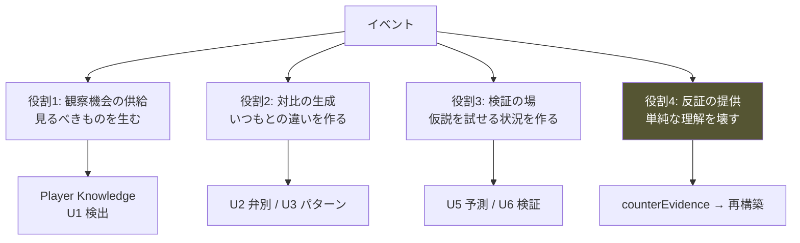

**⚠️ 役割4（反証）が最も重要である。**
反証がなければ、プレイヤーは Day 12 の過剰一般化のまま30日を終える（06 §2.2）。

## 1.3 イベントは「学習ラインの一区間」である ★

> ### **独立したイベントは存在しない。**
> ### **すべてのイベントは、いずれかの学習ラインに属する。**

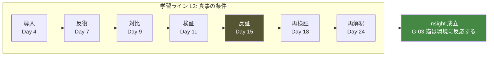

### 学習ライン（Learning Line）の定義 ★K-01 の確定

```
学習ライン = 一つの理解（Insight）に至る、観察機会の設計された系列
```

| 属性 | 内容 |
|---|---|
| **テーマ** | 何を理解するか（第2層：この子について） |
| **一般化** | 対応する第3層（06 §6.3 の G-01〜G-13） |
| **構成イベント** | 6種のイベント役割（§1.4）による系列 |
| **文脈** | 最低3つの異なる文脈（06 ⑩10.2 条件2 の必達要件） |
| **期間** | 開始日〜完了日（3〜25日） |
| **依存** | 前提となる学習ライン |

**⚠️ この構造により、「イベントを作る」は「イベント単体を作る」ではなく
「学習ラインを設計し、その中にイベントを配置する」作業になる。**

## 1.4 イベントの6つの役割型 ★

**すべてのイベントは、学習ラインの中で以下のいずれかの役割を担う。**

| 型 | 名称 | 役割 | 対応する認知段階（06 ②） |
|---|---|---|---|
| **T-1** | **導入 Seeding** | 現象の初出。意味はまだわからない | U1 検出 |
| **T-2** | **反復 Reinforcing** | 同じ現象の再出現。パターンを形成する | U2 弁別 / U3 パターン |
| **T-3** | **対比 Contrasting** | 起きなかった場面を見せる | U4 仮説（対比条件） |
| **T-4** | **検証 Verifying** | プレイヤーの行動に応答する | U5 予測 / U6 検証 |
| **T-5** | **反証 Falsifying** | 単純な仮説が通用しない場面 | counterEvidence |
| **T-6** | **再解釈 Recontextualizing** | 序盤の現象が意味を持つ | U7 モデル |

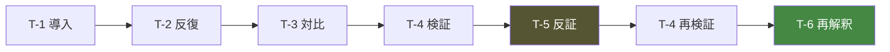

**⚠️ T-5（反証）を持たない学習ラインは、学習ラインとして不完全である。**
反証がなければ理解は深まらず、過剰一般化のまま固定される。

## 1.5 プレイヤー体験への影響

| イベントが正しく設計された場合 | 誤って設計された場合 |
|---|---|
| 「今日はいつもと違う」 | 「イベントが発生しました」 |
| 「なんでだろう」 | 「何をすればいいんだろう」 |
| 暮らしが続いている感覚 | 課題を処理している感覚 |
| 静けさが保たれる | 賑やかで落ち着かない |
| 理解が積み上がる | 出来事を消化している |

## 1.6 語彙統制（憲章§10.2 の拡張）

**チーム内でも以下の語を使わない。** 語彙が設計を規定する。

| 禁止語 | 代替 |
|---|---|
| イベントをクリアする | イベントを通して理解する |
| イベント発生！ | （通知しない） |
| クエスト / ミッション / タスク | 学習ライン / 観察機会 |
| 攻略 | 理解 |
| 報酬 | （存在しない） |
| 正解の行動 | この子に合っていた行動 |
| イベントを消化する | （消化するものではない） |

## 1.7 教育への影響

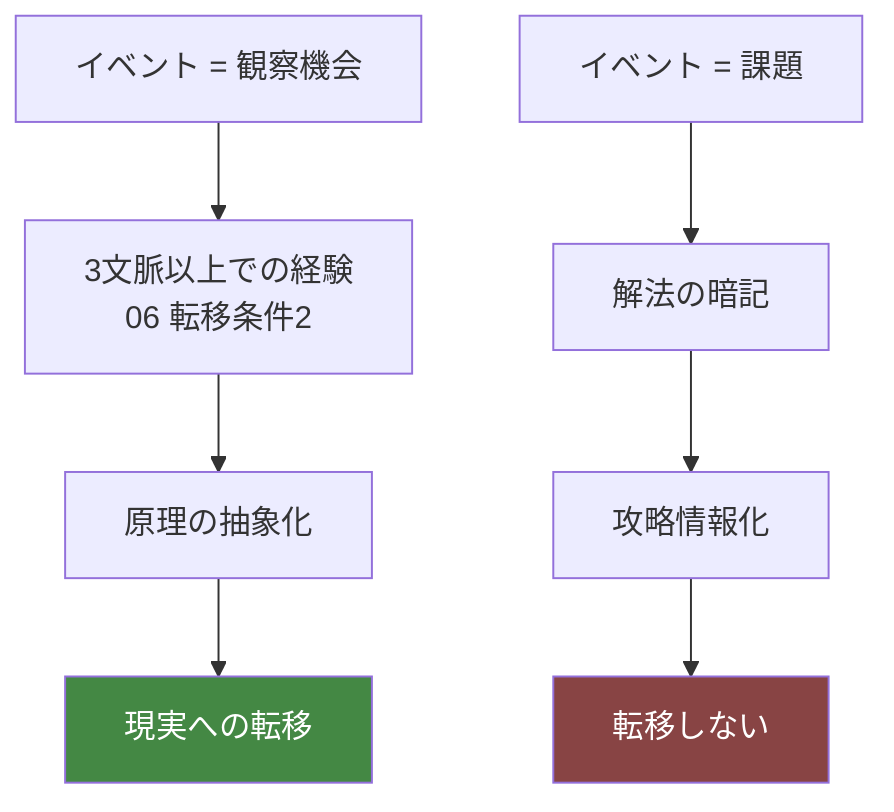

**⚠️ イベントが「課題」になった瞬間、教育的価値は失われる。**
解法が共有され、攻略情報として消費されるからである（MU-36）。

## 1.8 実装時の注意点

```
⚠️ イベントの発生をプレイヤーに通知しない（AP-28 / §1.5）
⚠️ イベントにプレイヤー向けのタイトルを付けない（§11.3）
⚠️ 独立したイベントを作らない。必ず学習ラインに属させる
⚠️ T-5 反証を持たない学習ラインを承認しない
⚠️ 「イベント」という語を、プレイヤー向けテキストに出さない
```

---

# ② Event Lifecycle

> **目的**: イベントの発生から理解に至るまでの完全な流れを定義する。
> **設計理由**: 上位文書の複数のループ（コアループ・学習ループ・Insight Loop）が、イベント単位ではどう繋がるのかが未定義だった。本章がそれを接続する。
> **プレイヤー体験への影響**: 「起きたこと」が「わかったこと」に変わる過程そのもの。
> **他システムとの依存関係**: 04 §8.1 ステップ9（Event Rule 評価）、06 ⑤ Learning Loop。
> **実装時の注意点**: ライフサイクルは Segment / Day をまたぐ。単一 Segment で完結させない。

## 2.1 完全なライフサイクル

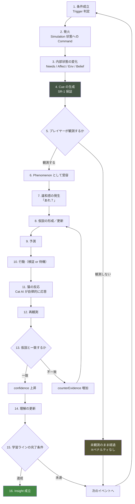

## 2.2 各段階の詳細

| # | 段階 | 担当システム | 所要 | 備考 |
|---|---|---|---|---|
| 1 | 条件成立 | S-13 Event Rule Engine | Segment | 04 §8.1 ステップ9 |
| 2 | 発火 | S-13 → S-01 へ Command | 即時 | **直接書き換え禁止**（AA-51） |
| 3 | 内部状態の変化 | S-02〜S-12 | Segment | |
| 4 | **Cue の生成** | Cue Generator | Segment | **SR-1 の検証点** |
| 5 | 観測の有無 | P-03 Observation | Tick | プレイヤー次第 |
| 6 | Phenomenon 受容 | P-01 Gateway | Tick | |
| 7 | 違和感 | プレイヤーの内側 | — | 差分検出に依存 |
| 8 | 仮説 | P-04/P-05 | Day | 06 ④ |
| 9 | 予測 | P-05 Record | Day | 「明日確かめたいこと」 |
| 10 | 行動 | P-07 Decision | Segment | |
| 11 | 猫の反応 | S-02 Cat AI | Segment〜Day | **イベントが指定しない** |
| 12 | 再観測 | P-03 | Tick | |
| 13 | 照合 | P-04 | Day | 06 ②2.3 |
| 14 | 理解の更新 | P-04 | Day | |
| 15 | 完了判定 | S-13 | Day | |
| 16 | Insight 成立 | P-04 | — | **通知しない** |

## 2.3 ⚠️ 段階11の設計上の要点

> ### **イベントは猫の反応を指定しない。**

```
❌ イベント定義：「掃除をすると、猫は不機嫌になる」
✅ イベント定義：「掃除により、該当 Zone の selfScent が 0 になる」
   → その後の猫の行動は、Cat AI が自律的に決める
```

**理由**

| 理由 | 説明 |
|---|---|
| 個体差の保持 | 反応を指定すると、全個体で同じ反応になる（SR-5 違反） |
| 因果の一貫性 | Cat AI を通らない反応は、他の状況と矛盾しうる（SR-2 違反） |
| 攻略の防止 | 「このイベントではこうなる」が攻略情報になる |

**⚠️ イベントが変更してよいのは、環境と刺激だけである。猫の内部状態を直接操作しない。**

| ✅ イベントが変更してよい | ❌ 変更してはならない |
|---|---|
| Zone の属性（清潔度・自己臭・配置） | 猫の Needs 値 |
| 刺激の発生（音・光・匂い） | 猫の Affect 値 |
| 資源の状態（餌の量・水・トイレ） | 猫の Relationship 値 |
| 人の状態（在室・来客） | 猫の行動の直接指定 |
| 天候・時刻 | 猫の性格 |

**例外**: 生理的に必然な変化（換毛による抜け毛量の増加など）は Needs 側に作用してよい。
ただしその場合も、**観測可能な Cue を必ず伴う**（SR-1）。

## 2.4 未観測イベントの扱い（段階5の分岐）

**プレイヤーが観測しなかったイベントは、なかったことにならない。**

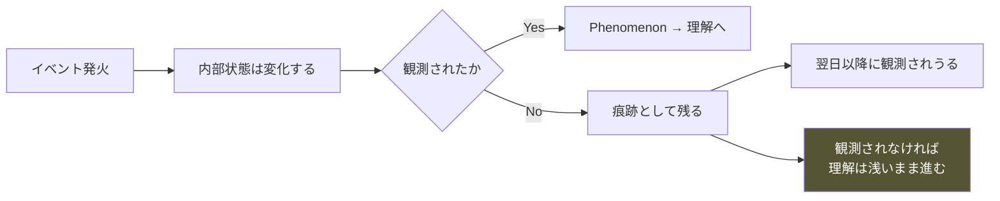

**⚠️ 見逃しにペナルティはない。得られなかっただけである**（憲章§4.5）。

**⚠️ ただし冗長性を保証する**（Player Flow ④I-D）。
同じ学習ラインには、直接 Cue と間接 Cue（痕跡）の両方が存在する。

## 2.5 イベント状態遷移図

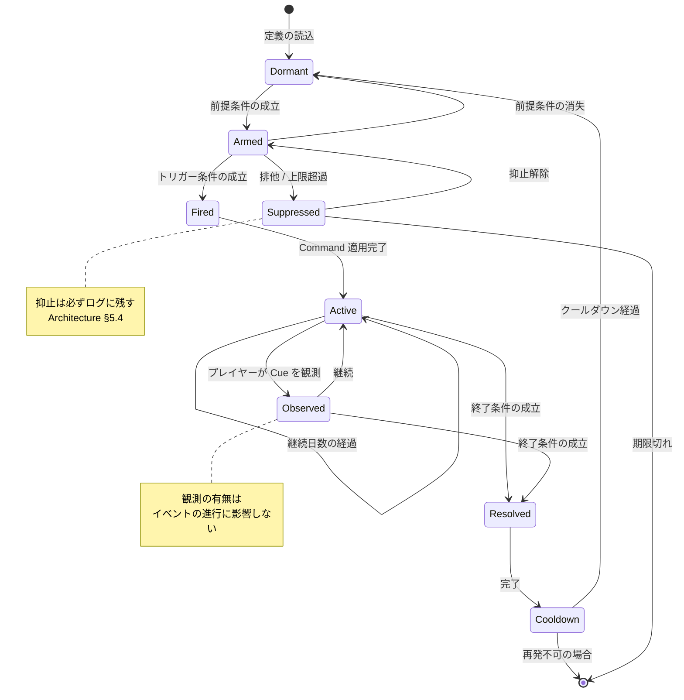

**⚠️ Observed → Active に戻ることに注意。**
観測してもイベントは終わらない。**イベントの終了条件は、プレイヤーの理解ではなく状態の変化である。**

## 2.6 実装時の注意点

```
⚠️ イベントは Command 経由でのみ Simulation を変更する（AA-51）
⚠️ イベントが猫の反応を指定しない
⚠️ イベントが猫の内部状態を直接操作しない
⚠️ 段階4（Cue 生成）を省略できない。SR-1 の検証点
⚠️ 未観測でもイベントは進行する
⚠️ イベントの終了をプレイヤーの理解で判定しない（G-2 違反）
⚠️ 抑止された発火は必ずログに残す
```

---

# ③ Event Categories

> **目的**: イベントのカテゴリを分類し、Content Bible の作成単位を確定する。
> **設計理由**: カテゴリなしに実イベントを作ると、偏りと重複が生じる。同時に、上位文書が禁じている領域を先に除外しておかないと、後から大量の作り直しが発生する。
> **プレイヤー体験への影響**: 観察対象の網羅性と、暮らしの手触りの豊かさ。
> **他システムとの依存関係**: 04 §2〜§4 の Needs / Environment、05 ⑥ Behavior Library、06 ③ Observation Skills。
> **実装時の注意点**: カテゴリはコンテンツの引き出しであり、プレイヤーには一切見せない分類である。

## 3.1 ⚠️ 採用しないカテゴリ（上位文書との整合）

**指示に挙げられたカテゴリのうち、以下は上位文書と衝突するため採用しない。**
詳細な理由は付録A。

| 指示されたカテゴリ | 判定 | 主な理由 |
|---|---|---|
| **発情** | ❌ 不採用 | 譲渡条件として避妊去勢が前提。全年齢対象 |
| **病院・病気** | 🔄 限定 | 憲章§9.4。疾病イベントは作らない。健康観察のみ |
| **災害** | 🔄 限定 | 脅威化の禁止。軽微な環境変化としてのみ |
| **脱走** | 🔄 限定 | 05 ⑧8.3 で発生させないと決定済み。関心のみ |
| **多頭飼育** | ❌ 不採用 | 憲章 AP-12。30日の密度が薄まる |
| **引越し** | ❌ 不採用 | トライアル30日中には発生しない |
| **季節** | ⏸ 保留 | 04 §1.6 で単一季節。将来拡張 |

## 3.2 採用するカテゴリ一覧（27カテゴリ）

### 凡例

```
難易度: ★☆☆ 初級 / ★★☆ 中級 / ★★★ 上級
時期  : 主に発生する Day 帯
```

---

### A. 生活基盤（EC-01〜EC-06）

| ID | カテゴリ | 目的 | 学べる内容 | 難度 | 時期 |
|---|---|---|---|---|---|
| **EC-01** | **食事** | 安全欲求のゲート則を体験させる | 不安だと食べない／場所と時刻の重要性／中断の意味 | ★☆☆ | Day 2-30 |
| **EC-02** | **飲水** | 見落とされやすい欲求への注意 | 水と食器の距離／飲水量の変化 | ★★☆ | Day 5-30 |
| **EC-03** | **トイレ** | 健康観察の基礎 | 回数と時刻／清潔度／位置と逃走路／我慢のサイン | ★★☆ | Day 3-30 |
| **EC-04** | **睡眠・休息** | 「寝ている」の情報量 | 浅い眠りと深い眠り／場所の選択／姿勢の意味 | ★★★ | Day 6-30 |
| **EC-05** | **グルーミング** | 同一行動の多義性 | 充足と転位の区別／過剰と欠如 | ★★★ | Day 10-30 |
| **EC-06** | **爪とぎ** | マーキングという概念 | 場所の選択／起床後の連鎖／縄張りとの関係 | ★★☆ | Day 5-30 |

---

### B. 空間と環境（EC-07〜EC-13）

| ID | カテゴリ | 目的 | 学べる内容 | 難度 | 時期 |
|---|---|---|---|---|---|
| **EC-07** | **隠れ場所** | 遮蔽だけでは不十分と知る | 逃走路の必要性／行き止まりの回避／複数の選択肢 | ★☆☆ | Day 1-20 |
| **EC-08** | **高所・垂直空間** | 一般論の限界を知る | 高所選好の個体差／段階的な高さ／見晴らしの意味 | ★★☆ | Day 3-25 |
| **EC-09** | **動線** | 見えない障壁の存在 | 人の動線上の資源は使われない／経路の安全性 | ★★★ | Day 8-30 |
| **EC-10** | **環境変化** | 良い変更もストレスであること | 3日の慣れ／同時変更の混乱／個体差 | ★★☆ | Day 5-30 |
| **EC-11** | **掃除** | 反直観の代表 | 自己臭の除去／掃除すべき場所とすべきでない場所 | ★★★ | Day 7-30 |
| **EC-12** | **家具・物** | 新規物への段階的接近 | 4段階の接近／価格と効果の無関係／使われない物 | ★★☆ | Day 4-30 |
| **EC-13** | **温度・光** | 見過ごされる環境要因 | 日向の移動／姿勢による体温調節／時間帯の影響 | ★★☆ | Day 5-30 |

---

### C. 感覚刺激（EC-14〜EC-16）

| ID | カテゴリ | 目的 | 学べる内容 | 難度 | 時期 |
|---|---|---|---|---|---|
| **EC-14** | **音** | 最も強力な環境変数の理解 | 突発性 > 音量／音源不可視の影響／慣れと感作 | ★☆☆ | Day 1-30 |
| **EC-15** | **匂い** | 人には知覚しにくい要因 | 自己臭の意味／強い匂いの回避／マーキング | ★★★ | Day 10-30 |
| **EC-16** | **窓の外** | 外部刺激と関心 | 何を見ているか／脱走リスクの存在／時間帯との相関 | ★★☆ | Day 8-30 |

---

### D. 人との関係（EC-17〜EC-21）

| ID | カテゴリ | 目的 | 学べる内容 | 難度 | 時期 |
|---|---|---|---|---|---|
| **EC-17** | **距離** | 許容距離という概念 | 距離は日々変わる／侵犯の代償／後退の意味 | ★☆☆ | Day 1-30 |
| **EC-18** | **視線・姿勢** | 自分が変数だと知る | 直視は威嚇／立位と座位／ゆっくり瞬き | ★★★ | Day 12-30 |
| **EC-19** | **留守番** | 不在時の生活の存在 | 痕跡からの再構成／不在時のほうが活動する | ★★☆ | Day 2-30 |
| **EC-20** | **来客** | 強い外的ストレス源 | 急性ストレスと回復／予告できない出来事への備え | ★★☆ | Day 10-25 |
| **EC-21** | **生活リズム** | 予測可能性の価値 | 一貫した生活が安心を作る／不規則の代償 | ★★★ | Day 6-30 |

---

### E. 猫自身（EC-22〜EC-25）

| ID | カテゴリ | 目的 | 学べる内容 | 難度 | 時期 |
|---|---|---|---|---|---|
| **EC-22** | **遊び・狩猟** | 遊びの出現＝安心の指標 | 狩猟連鎖の段階／遊べる条件／個体差 | ★★☆ | Day 10-30 |
| **EC-23** | **縄張り・マーキング** | 行動範囲という進行の可視化 | 頬すり／爪とぎの位置／範囲の拡大と縮小 | ★★★ | Day 8-30 |
| **EC-24** | **体調** | 「いつもと違う」への気づき | 微細な変調のサイン／性格との判別／獣医という選択肢 | ★★★ | Day 12-30 |
| **EC-25** | **換毛** | 生理的な自然現象 | 抜け毛の増加／グルーミング増／ブラッシングの是非 | ★★☆ | Day 15-30 |

---

### F. 制度と現実（EC-26〜EC-27）

| ID | カテゴリ | 目的 | 学べる内容 | 難度 | 時期 |
|---|---|---|---|---|---|
| **EC-26** | **トライアル手続き** | 現実の制度の理解 | トライアルとは何か／確認事項／団体とのやり取り | ★☆☆ | Day 1, 14, 28 |
| **EC-27** | **決断** | 責任の実感 | 生活の変化／費用と時間／3つの結末の等価性 | ★☆☆ | Day 28-30 |

## 3.3 カテゴリの難易度分布

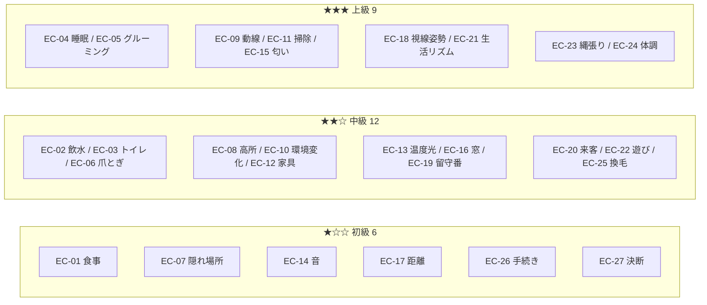

**⚠️ 難易度は「読み取りの難しさ」であり、クリアの難しさではない**（AP-09）。

## 3.4 カテゴリと学習ラインの関係

```
1つの学習ライン = 複数のカテゴリを横断する

例：学習ライン「この子は安心できない場所では食べない」
    EC-01 食事 ＋ EC-09 動線 ＋ EC-14 音 ＋ EC-17 距離
```

**⚠️ カテゴリはコンテンツの引き出しであり、学習の単位ではない。**
学習の単位は学習ラインである（§1.3）。

## 3.5 実装時の注意点

```
⚠️ カテゴリをプレイヤーに見せない
⚠️ カテゴリごとの達成率・網羅率を算出しない（AP-27）
⚠️ 全カテゴリを1周で経験させようとしない
⚠️ 上級カテゴリを序盤に配置しない
⚠️ 採用しないカテゴリを「後で追加できるように」枠だけ用意しない（AA-94）
⚠️ EC-24 体調は、疾病に発展させない（憲章§9.4）
```

---

# ④ Trigger System

> **目的**: イベントの発生条件を体系化し、決定論性と自然さを両立させる。
> **設計理由**: 完全ランダムな発生は SR-3（決定論性）と AI-5 に反する。一方、完全に固定されたスケジュールは「台本」になり、プレイヤーの行動が無意味になる（S-12 禁止事項）。両者の中間を精密に設計する必要がある。
> **プレイヤー体験への影響**: 「自分の行動が世界に影響している」という感覚の根拠。
> **他システムとの依存関係**: S-13 Event Rule Engine、Architecture ⑤ Event Flow、04 §8.4 RNG ストリーム。
> **実装時の注意点**: すべてのトリガーはデータ駆動。コードにハードコードしない（AA-59）。

## 4.1 トリガーの7種類

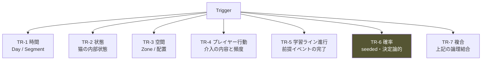

## 4.2 各トリガーの詳細

### TR-1 時間トリガー

| 条件 | 例 |
|---|---|
| Day 到達 | Day 14 に手続きの確認 |
| Day 範囲 | Day 8-15 のいずれか |
| Segment | 特定の時間帯のみ |
| 経過日数 | 前回から N 日後 |

**⚠️ 固定日の使用は最小限にする。** 台本感を生む。
**⚠️ ただし EC-26 手続き、EC-27 決断 は固定日でよい**（現実の制度に対応するため）。

### TR-2 状態トリガー

| 条件 | 例 |
|---|---|
| Needs 閾値 | 空腹圧が一定以上 |
| Affect 閾値 | StressLoad が 0.6 超過 |
| Relationship 閾値 | Trust が一定以上 |
| 関係状態 | Present 状態に到達 |
| 累積 | 特定行動の回数 |

**⚠️ 状態トリガーは、プレイヤーの行動の結果として成立する。**
これが「自分の行動が世界に影響している」感覚の主要な源である。

### TR-3 空間トリガー

| 条件 | 例 |
|---|---|
| Zone 属性 | 逃走路 0 の隠れ場所が存在する |
| 資源配置 | 食器と水が近接している |
| 配置の欠如 | 高所が存在しない |
| 経路 | 資源への経路が人の動線上にある |

**⚠️ 空間トリガーは、プレイヤーの環境設計への応答である。**
Pillar 3（環境こそが対話）の実装上の中核。

### TR-4 プレイヤー行動トリガー

| 条件 | 例 |
|---|---|
| 特定行動の実行 | 掃除を行った |
| 行動の頻度 | 直近3 Segment の介入回数 |
| 行動の欠如 | N 日間、環境を変えていない |
| 接近の履歴 | 許容距離を侵犯した |

**⚠️ 「行動の欠如」トリガーが重要である。**
何もしないことにも世界が応答することで、Pillar 6 が体験として成立する。

### TR-5 学習ライン進行トリガー

| 条件 | 例 |
|---|---|
| 前提イベントの完了 | 導入イベントが Resolved |
| 観測の有無 | 該当 Cue が観測された |
| 経過 | 前段から N 日 |

**⚠️ 「観測の有無」を条件に使う場合の注意**

```
✅ 許容：導入イベントの Cue を観測した → 次段へ進める
❌ 禁止：プレイヤーが理解した → 次段へ進める（G-2 違反）
```

観測の有無は L3 Perception が知っている情報であり、**理解の有無ではない**。

### TR-6 確率トリガー ⚠️

**完全ランダムは禁止（AI-5 / SR-3）。**

```
確率は RNG.stream("event").at(day, segment) から決定論的に導出する。

同一シード → 同一の発生スケジュール
```

| 用途 | 説明 |
|---|---|
| 発生日の分散 | Day 8-15 のどこかで発生（シードで決まる） |
| バリエーション選択 | 複数の変種からの選択 |
| 微細な揺らぎ | 発生 Segment の分散 |

**⚠️ 確率を「発生するかしないか」に使わない。**
「いつ発生するか」「どの変種か」に使う。

```
❌ 30% の確率でイベントが発生する（発生しないことがある）
✅ Day 8-15 のいずれかで必ず発生する（いつかはシードで決まる）
```

**理由**: 発生しないと学習ラインが成立しない。**必須の観察機会を確率に委ねない。**

### TR-7 複合トリガー

```
論理結合：AND / OR / NOT
時間窓  ：条件Aの成立後 N Segment 以内に条件B
順序    ：条件A → 条件B の順で成立
```

**⚠️ 複合条件の深さは3階層まで。** 超えると因果が追えなくなる（SR-2）。

## 4.3 トリガーの優先順位

**Architecture §5.3 のイベント優先度と整合させる。**

| 優先 | トリガー種別 | 理由 |
|---|---|---|
| **1** | TR-1 固定日（制度系 EC-26/27） | 現実の制度に対応。必ず発生 |
| **2** | TR-5 学習ライン進行 | 学習の連続性を最優先 |
| **3** | TR-2 状態（危機的閾値） | 悪循環の検出など |
| **4** | TR-4 プレイヤー行動 | 応答性の担保 |
| **5** | TR-3 空間 | 環境設計への応答 |
| **6** | TR-2 状態（通常） | |
| **7** | TR-6 確率 | 装飾的な変化 |
| **8** | TR-1 時間（範囲） | 最も柔軟 |

## 4.4 競合処理（Architecture §5.4 の具体化）

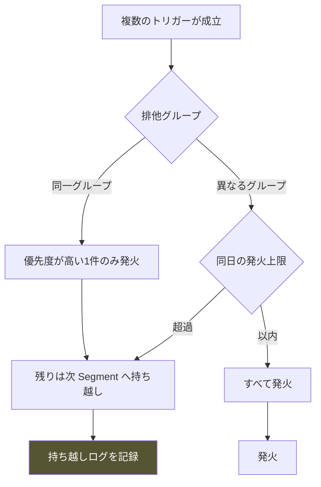

### 排他グループの例

| グループ | 含まれるカテゴリ | 理由 |
|---|---|---|
| 環境変化系 | EC-10, EC-11, EC-12 | 同時発生で再学習が過度に混乱 |
| 強刺激系 | EC-14（強）, EC-20 | ストレスの過剰蓄積を防ぐ |
| 生理系 | EC-01, EC-02, EC-03 | 1 Segment に複数は不自然 |

**⚠️ 抑止された発火は破棄せず、次 Segment へ持ち越す**（Architecture §5.4）。

## 4.5 発火上限

| 単位 | 上限 | 理由 |
|---|---|---|
| **1 Day あたり新規発火** | **最大 1 件** | Pillar 6 / §10 |
| 1 Day あたり継続中 | 最大 4 件 | 認知負荷 |
| 1 Segment あたり | 最大 1 件 | 自然さ |
| 強刺激（EC-14強/EC-20） | 3日に1件まで | ストレス管理 |

**⚠️ 「1日1件」が本作のイベント密度の上限である。**
これを超えた瞬間、「イベントだらけのゲーム」になる。詳細は §10。

## 4.6 連合学習の刺激-結果ペア ★CA-04 の確定

**05 ⑤5.2 で定義された連合学習の材料を、イベントとして供給する。**

| Cue（刺激） | Outcome（結果） | 供給するカテゴリ | 形成速度 |
|---|---|---|---|
| 特定の生活音 | 人が部屋に入る | EC-14, EC-19 | 速い |
| 特定の生活音 | 食事の準備 | EC-01, EC-14 | **最速** |
| 人が立ち上がる動作 | 接近される | EC-17, EC-18 | 速い |
| 人が座る動作 | 何も起きない | EC-18 | 遅い |
| 玄関の音 | 来客 | EC-20 | 速い |
| 掃除の音 | 環境が変わる | EC-11, EC-14 | 中 |
| 窓の外の音 | 何も起きない（安全） | EC-16 | 遅い |
| 特定 Zone での経験 | 驚愕 | EC-07, EC-09 | **1回で形成** |
| 特定 Zone での経験 | 平穏 | EC-04, EC-07 | 遅い |

**⚠️ 負の連合は1回で形成され、消去に数週間かかる**（05 §5.2）。
**したがって、負の連合を生むイベントは慎重に配置する。**

## 4.7 実装時の注意点

```
⚠️ すべてのトリガーをデータ駆動にする（AA-59）
⚠️ 確率を「発生するか」に使わない。「いつ・どの変種か」に使う
⚠️ 必須の観察機会を確率に委ねない
⚠️ TR-5 で「理解したか」を条件にしない（G-2 違反）
⚠️ 複合条件は3階層まで
⚠️ 1日の新規発火は1件まで
⚠️ 抑止した発火を必ずログに残す
⚠️ RNG は stream("event") を専用に使う
```

---

# ⑤ Event Structure

> **目的**: 各イベントが持つ内部構造を標準化する。
> **設計理由**: 構造が標準化されていないと、Content Bible で作られるイベントの品質が作り手ごとにばらつく。同時に、標準構造は品質検証の基準にもなる。
> **プレイヤー体験への影響**: どのイベントでも「観察→推測→理解」の流れが保たれる一貫性。
> **他システムとの依存関係**: 06 ② Understanding Model、②のライフサイクル。
> **実装時の注意点**: 構造の段階をプレイヤーに提示しない。内部の設計単位である。

## 5.1 標準構造（8段階）

**指示された構造を、上位文書に適合する形で確定する。**

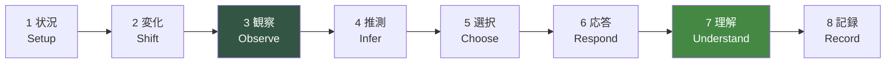

## 5.2 各段階の定義

| # | 段階 | 内容 | 担当 | 必須 |
|---|---|---|---|---|
| **1** | **状況 Setup** | 発生前の平常状態。基準となる「いつも」 | Simulation | ✅ |
| **2** | **変化 Shift** | 内部状態の変化。**演出ではない** | S-13 → Command | ✅ |
| **3** | **観察 Observe** | Cue の生成と、プレイヤーによる観測 | Cue Gen / P-03 | ✅ |
| **4** | **推測 Infer** | 仮説の形成・更新 | プレイヤー | 任意 |
| **5** | **選択 Choose** | 行動（介入 or 待機） | P-07 | 任意 |
| **6** | **応答 Respond** | Cat AI による自律的な反応 | S-02 | ✅ |
| **7** | **理解 Understand** | 観測構造の充足 | P-04 | 任意 |
| **8** | **記録 Record** | 記録への追記 | P-05 | ✅ |

**⚠️ 段階4・5・7 は任意である。**
プレイヤーが推測しなくても、行動しなくても、理解しなくても、イベントは進行し終了する。
**強制しないことが Pillar 2 と Player Flow の要件である。**

## 5.3 ⚠️ 指示された構造からの変更点

| 指示 | 本書 | 理由 |
|---|---|---|
| 導入 | **状況 Setup** | 「導入」は演出を想起させる。必要なのは基準状態 |
| **異変** | **変化 Shift** | 「異変」は異常事態を想起させる。多くは平穏な変化 |
| 結果 | **応答 Respond** | 「結果」は成否を含意する。あるのは猫の反応のみ |

**⚠️ 語彙の変更は §1.6 の語彙統制に基づく。**

## 5.4 段階2「変化」の設計原則

**イベントの本体は、演出ではなく状態変化である。**

```
❌ イベント：「猫が驚いて棚から落ちる」（演出の記述）
✅ イベント：「Zone-05 で突発音が発生する。強度 0.7、音源不可視」
   → その後の猫の行動は Cat AI が決める
```

| 変化の種類 | 例 |
|---|---|
| 刺激の発生 | 音・光・匂いの生成 |
| 環境属性の変更 | 清潔度・自己臭・温度 |
| 資源状態の変更 | 餌の量・水・トイレの状態 |
| 空間の変更 | 物の追加・移動・撤去 |
| 人の状態の変更 | 在室・来客 |
| 生理的変化 | 換毛期の開始 |

## 5.5 段階3「観察」の設計原則 — SR-1 の実装点

**すべてのイベントは、観測可能な Cue を最低2つ持つ。**

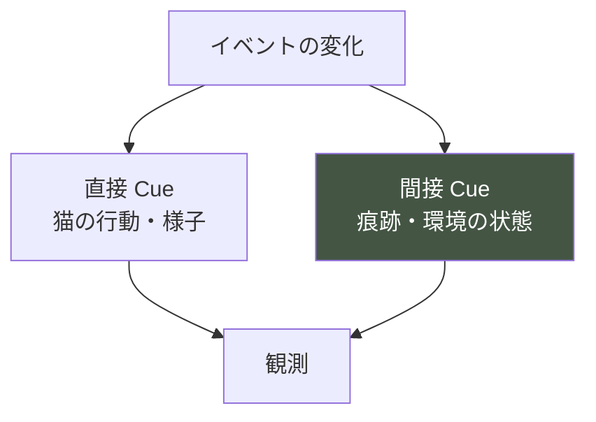

**⚠️ 直接 Cue と間接 Cue の両方を持つことが必須である**（Player Flow ④I-D 冗長性）。

| 理由 | 説明 |
|---|---|
| 見逃しの許容 | 一方を見逃しても、他方で到達できる |
| 不在時の観測 | 不在 Segment では間接 Cue のみが残る |
| 観察技能の育成 | 直接と間接の両方を使う習慣がつく |

## 5.6 段階5「選択」の設計原則

**イベントは選択肢を提示しない。**

```
❌ 「どうしますか？ 1. 掃除する 2. そのままにする 3. 様子を見る」
✅ 通常の行動選択がそのまま使える。イベント専用の選択肢を作らない
```

**理由**

| 理由 | 説明 |
|---|---|
| 選択肢の提示は課題化 | 「解くべき問題」に見える |
| 正解の示唆 | 選択肢の並びが正解を示唆する |
| 攻略情報化 | 「このイベントでは2を選ぶ」が共有される |
| 常時の行動と分断 | イベント中だけ特別な操作になる |

**⚠️ プレイヤーが取れる行動は、常に同じである。** イベント専用の行動を作らない。

## 5.7 段階7「理解」の設計原則

**イベントは理解を判定しない。**

```
❌ イベント終了時に「あなたは〜を理解しました」
✅ 何も起きない。P-04 が観測構造を更新するだけ
```

**⚠️ イベントの終了と理解の成立は無関係である**（②2.5）。
イベントが終わっても理解していないことがあり、
イベントの途中で理解に至ることもある。

## 5.8 段階8「記録」の設計原則

**記録されるのは、観測した事実のみである。**

```
❌ 「掃除をしたため、猫のストレスが上がった」（因果の断定）
✅ 「昨日そうじをした。今日は棚の上にいなかった」（事実の並置）
```

**⚠️ 06 ⑧8.2 の文体規則に従う。** 推量形が基本。

## 5.9 イベント構造の検証

**Content Bible で作られる各イベントは、以下を満たすこと。**

```
□ 段階1（状況）が定義されているか — 何が「いつも」か
□ 段階2（変化）が状態変化として記述されているか — 演出ではないか
□ 段階3（観察）に直接 Cue と間接 Cue の両方があるか
□ 段階5（選択）にイベント専用の選択肢がないか
□ 段階6（応答）を Cat AI に委ねているか
□ 段階7（理解）を判定していないか
□ 段階8（記録）が事実の並置か
```

## 5.10 実装時の注意点

```
⚠️ イベントを演出として記述しない。状態変化として記述する
⚠️ Cue を2つ以上（直接・間接）持たせる
⚠️ イベント専用の選択肢を作らない
⚠️ 猫の反応を指定しない
⚠️ 理解を判定・通知しない
⚠️ 段階をプレイヤーに提示しない
⚠️ 「異変」「導入」という語を設計ドキュメントでも使わない
```

---

# ⑥ Event Difficulty

> **目的**: イベントの難易度をどう扱うかを確定する。
> **設計理由**: 指示は「プレイヤー理解度に応じて難易度が変化する」ことを求めているが、これは AP-09（難易度緩和）と AA-09（動的難易度）に抵触しうる。かつ SR-3（決定論性）と G-2（理解度で世界を変えない）を破る。**本章は要求を修正して実現する。**
> **プレイヤー体験への影響**: 「ゲームが手加減している」と感じさせないこと。
> **他システムとの依存関係**: 06 ③3.4 描写解像度、Player Knowledge。
> **実装時の注意点**: イベントの発生・内容は理解度に依存しない。読み取れる量だけが変わる。

## 6.1 ⚠️ 要求の修正提案

> ### **イベントの内容は、プレイヤーの理解度で変わらない。**
> ### **変わるのは、同じイベントから読み取れる情報量である。**

### 理由

| 問題 | 説明 |
|---|---|
| **G-2 違反** | 理解度でイベントを変えるには、L2 が L3 を参照する必要がある（逆流） |
| **SR-3 違反** | 同一シードで異なる結果になり、決定論性が壊れる |
| **AP-09 抵触** | 実質的な動的難易度調整。「手加減された」感覚を生む |
| **AA-09 抵触** | 難易度の自動低下は悟られる |
| **体験の毀損** | 「わからないから簡単になった」は自尊心を傷つける |

### 代替の実装

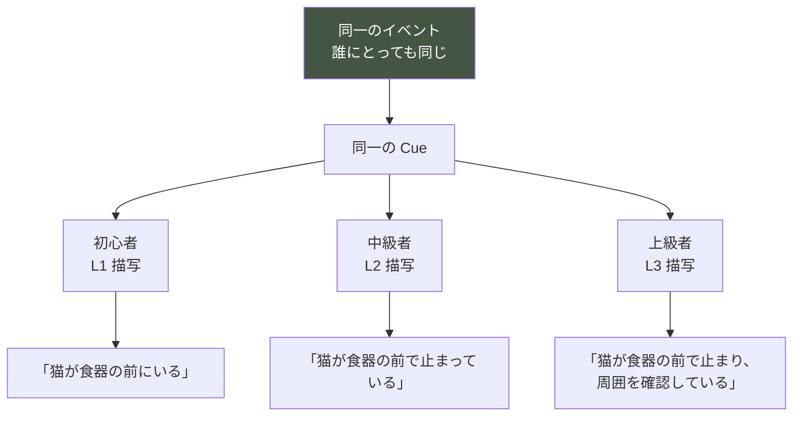

**⚠️ これは 06 ③3.4（技能レベルと描写解像度）と同一の機構である。**
新しい仕組みを作らない。

## 6.2 イベント難易度の定義

**難易度 = そのイベントの Cue を読み解くのに必要な観察技能レベル**

| 難度 | 必要技能 | 特徴 |
|---|---|---|
| **★☆☆ 初級** | L1 検出 | Cue が明確。一度見れば気づく |
| **★★☆ 中級** | L2 弁別 | 違いの区別が必要。基準が要る |
| **★★★ 上級** | L3 文脈化 | 文脈と組み合わせないと読めない |

## 6.3 難易度別の設計要件

### ★☆☆ 初級イベント

```
□ Cue が視覚的に明瞭
□ 変化が大きい（隠れる／出てこない など）
□ 直接 Cue で完結する
□ 前提となる理解が不要
□ Day 1-10 に配置可能
```

### ★★☆ 中級イベント

```
□ 「いつも」との比較が必要
□ 直接 Cue と間接 Cue の統合が必要
□ 前提となる基準の形成が必要（Day 5 以降）
□ 複数日にまたがることがある
□ Day 5-30 に配置
```

### ★★★ 上級イベント

```
□ 文脈（直前に何があったか）の把握が必要
□ 複数の Cue の組み合わせが必要
□ 前提となる学習ラインの進行が必要
□ 同じ Cue が別の意味を持ちうる
□ Day 12-30 に配置
```

## 6.4 難易度と Day 帯の対応

```mermaid
gantt
    title 難易度別の配置可能範囲
    dateFormat X
    axisFormat Day %s

    section 初級 ★☆☆
    配置可能    :0, 30
    section 中級 ★★☆
    配置可能    :5, 25
    section 上級 ★★★
    配置可能    :12, 18
```

**⚠️ 上級イベントを Day 12 より前に配置しない。**
基準（いつも）が形成されておらず、読み取り不能になる（Player Flow ⑪11.2）。

## 6.5 「わからなかった」ときの扱い

**上級イベントを読み解けなかったプレイヤーに、追加情報を与えない。**

| ❌ 禁止 | ✅ 許容 |
|---|---|
| ヒントの表示 | 同種のイベントの再出現 |
| Cue の追加 | 別の学習ラインでの類似経験 |
| 描写の詳細化（理解度以外の理由で） | 冗長な観測経路（直接／間接） |
| 難易度の低下 | 時間をかけること |

**⚠️ 「読み解けなかった」は失敗ではない。**
30日で全部読み解く必要はない（06 §6.4）。

## 6.6 個体差による実質的な難易度差

**難易度の主要な源は、イベントではなく個体である**（05 §4.5）。

```
同じイベント（例：EC-11 掃除）
  PT-23 縄張り強型 → 影響が明確。★☆☆ 相当
  PT-14 単独志向型 → 影響が微細。★★★ 相当
```

**⚠️ これは「難しい個体」ではなく「違う個体」である**（05 §4.5）。

## 6.7 実装時の注意点

```
⚠️ イベントの発生・内容を理解度で変えない
⚠️ 動的難易度調整を実装しない
⚠️ 読み解けなかったプレイヤーに追加情報を与えない
⚠️ 難易度をプレイヤーに表示しない
⚠️ 上級イベントを Day 12 より前に置かない
⚠️ 描写解像度の変化は 06 ③3.4 の機構を再利用する（新規実装しない）
```

---

# ⑦ Event Chains

> **目的**: 複数日にまたがるイベント連鎖を設計し、学習ラインを実装可能にする。
> **設計理由**: 単発イベントでは理解は生まれない。06 ⑤5.4 で「一つの気づきに3〜5日」と定めた以上、イベントも複数日構造でなければ整合しない。
> **プレイヤー体験への影響**: 「今日のことが明日につながる」という時間の厚み。
> **他システムとの依存関係**: 06 ⑤ Insight Loop、§1.3 学習ライン。
> **実装時の注意点**: チェーンは分岐しない。分岐はフラグ管理の複雑化を招く（AA-41）。

## 7.1 チェーンの基本構造

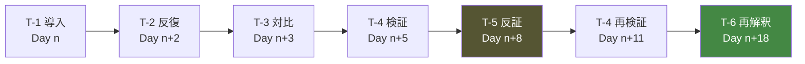

**⚠️ チェーンは分岐しない。** 順序は固定である。
分岐するのは**プレイヤーの理解**であって、イベントではない。

## 7.2 チェーンの3つの長さ

| 種別 | 期間 | 構成 | 用途 |
|---|---|---|---|
| **短鎖 Short** | 3〜5日 | T-1 → T-2 → T-4 | 単純な因果の理解 |
| **中鎖 Medium** | 7〜12日 | T-1 → T-2 → T-3 → T-4 → T-5 | 条件付き理解 |
| **長鎖 Long** | 15〜25日 | 全6型 + 再検証 | 深い理解 + 再解釈 |

```mermaid
gantt
    title チェーン長別の典型的な配置
    dateFormat X
    axisFormat Day %s

    section 短鎖
    L1 隠れ場所     :1, 6
    L2 食事の基礎   :3, 8
    section 中鎖
    L3 音への反応   :5, 17
    L4 環境変化     :8, 20
    section 長鎖
    L5 人との距離   :4, 27
    L6 自分が変数   :8, 30
```

## 7.3 学習ラインの標準セット ★K-01 の確定

**30日で成立させる学習ラインを、以下の6本を基本とする。**

| # | 学習ライン | 長さ | 期間 | 対応する一般化 | 依存 |
|---|---|---|---|---|---|
| **LL-1** | 安心できる場所の条件 | 短鎖 | Day 1-6 | G-03 環境に反応する | — |
| **LL-2** | 食事が成立する条件 | 中鎖 | Day 3-17 | G-03, G-05 | LL-1 |
| **LL-3** | 音と刺激への反応 | 中鎖 | Day 5-20 | G-05 文脈依存 | — |
| **LL-4** | 環境を変えるということ | 中鎖 | Day 8-22 | G-04 変化もストレス | LL-1 |
| **LL-5** | 人との距離 | 長鎖 | Day 4-27 | G-06, G-07 | — |
| **LL-6** | **自分が変数である** | 長鎖 | Day 8-30 | **G-08** | LL-3, LL-5 |

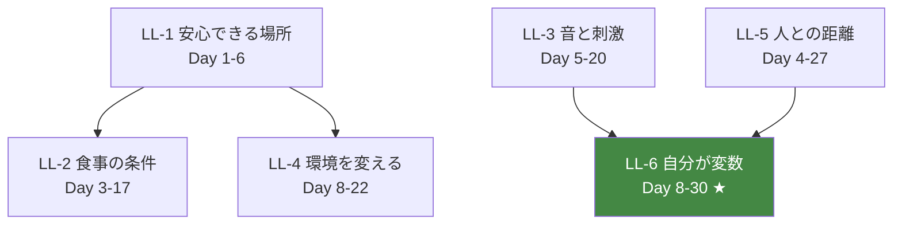

**⚠️ LL-6 が本作の到達点である**（06 §6.2 Day 21-27 の枠組み）。
LL-3 と LL-5 の理解が前提となるため、必然的に終盤に成立する。

## 7.4 並行進行の設計

**Player Flow ⑦7.2 の「常時2〜3本並行」を保証する。**

```mermaid
gantt
    title 学習ラインの並行進行
    dateFormat X
    axisFormat Day %s

    section 並行本数
    LL-1  :1, 6
    LL-2  :3, 17
    LL-5  :4, 27
    LL-3  :5, 20
    LL-4  :8, 22
    LL-6  :8, 30
```

| Day 帯 | 並行本数 | 内訳 |
|---|---|---|
| 1-3 | 1〜2 | LL-1, LL-2 |
| 4-6 | 3〜4 | LL-1, LL-2, LL-5, LL-3 |
| 7-17 | 4〜5 | LL-2, LL-3, LL-4, LL-5, LL-6 |
| 18-22 | 3 | LL-4, LL-5, LL-6 |
| 23-30 | 2 | LL-5, LL-6 |

**⚠️ 常に2本以上が走っている。** これが「どれかは必ず進展する」を保証する。

**⚠️ 終盤に本数が減るのは意図的である。** 深化に集中させるため。

## 7.5 反証イベントの配置 ★K-07 の確定

**06 が求めた「反証現象の配置スケジュール」を確定する。**

```mermaid
gantt
    title 反証イベント T-5 の配置
    dateFormat X
    axisFormat Day %s

    section 反証の集中帯
    Phase 4 の谷    :crit, 13, 20

    section 各ラインの反証
    LL-2 反証   :crit, 14, 15
    LL-3 反証   :crit, 15, 16
    LL-4 反証   :crit, 16, 17
    LL-5 反証   :crit, 17, 18
```

| 学習ライン | 反証の内容 | 配置 Day | 破壊する誤解 |
|---|---|---|---|
| **LL-2** | 環境が同じでも食べない日がある | 14-15 | 「原因は一つ」 |
| **LL-3** | 同じ音でも反応しない場面がある | 15-16 | 「音＝必ず隠れる」 |
| **LL-4** | 良い変更が使われない | 16-17 | 「良い物＝良い環境」（MU-18） |
| **LL-5** | 近づいたら遠ざかる | 17-18 | 「構えば懐く」（MU-06） |

**⚠️ Day 17 が反証の集中点であり、Player Flow ⑨9.2 の「最深部」と一致する。**

### 反証の設計要件

```
□ 反証には必ず観測可能な原因が先行する（SR-2 / Player Flow DE-23）
□ 反証は3回以上発生しうる（06 MC-2）
□ 反証はプレイヤーを責めない（MC-3）
□ 反証は「間違い」として提示されない
□ 反証後に、再検証の機会が必ず用意される
```

## 7.6 最有害な誤解への反証配置（06 ⑦7.4 の実装）

**最有害12項目それぞれに、反証機会を3回以上配置する。**

| 誤解 | 反証を供給する学習ライン／カテゴリ | 配置 Day |
|---|---|---|
| MU-03 わざとやっている | EC-19 留守番（不在時にも同じ行動） | 6, 12, 20 |
| MU-04 復讐している | EC-03 トイレ（環境条件が先行） | 9, 16, 23 |
| MU-06 構えば懐く | LL-5（Day 17-18 の反証） | 11, 17, 24 |
| MU-09 ゴロゴロ＝機嫌が良い | EC-05, EC-24（異なる文脈で両方） | 13, 19, 26 |
| MU-10 仰向け＝撫でて | EC-17（接触後の後退） | 15, 21, 27 |
| MU-11 尻尾振り＝嬉しい | EC-22（狩猟時）, EC-17（苛立ち時） | 12, 18, 25 |
| MU-20 掃除すればするほど良い | EC-11（LL-4 の反証） | 10, 16, 22 |
| MU-25 食べないのは餌が嫌い | LL-2（環境変更で食べる） | 8, 14, 20 |
| MU-29 トイレ我慢は平気 | EC-03（我慢の観測） | 11, 18, 25 |
| MU-30 毛づくろい多い＝綺麗好き | EC-05（ストレスとの相関） | 14, 20, 26 |
| MU-32 元気ないのは性格 | EC-24（体調変動との対比） | 16, 22, 28 |
| MU-36 攻略法がある | 全ライン（個体差・条件依存） | 全期間 |

**⚠️ この表が Content Bible の必達要件である。**
全項目3回以上の反証が配置されていることを、自動テストで検証する（⑬ G群）。

## 7.7 再解釈イベント T-6 の設計（Day 24 のピーク）

**Player Flow ⑨9.3 の最大ピークを、イベントとして実装する。**

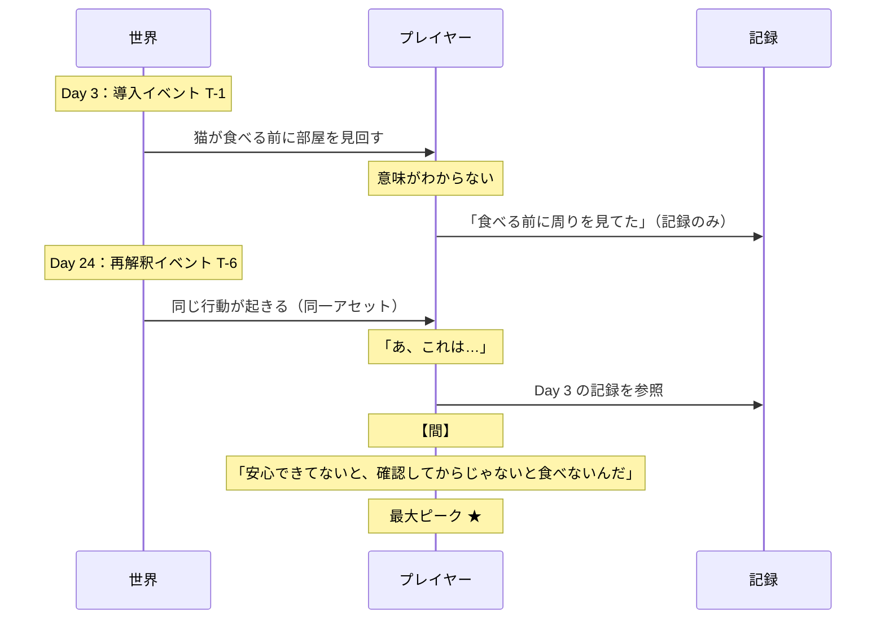

### T-6 の設計要件

```
□ 序盤（Day 1-6）に対応する T-1 が必ず存在する
□ T-1 と T-6 で同一のアセット・同一の Cue を使う ★
□ T-6 の時点では、プレイヤーの描写解像度が L3 に達している
□ 現象と理解の間に「間」がある（Player Flow ⑨9.3）
□ ゲームは「あの時と同じですね」と言わない ★
□ 記録の参照が容易であること
```

**⚠️ T-1 と T-6 で同一アセットを使うことが、Pillar 5 の直接体験である。**
**変わったのは猫ではなく、プレイヤーの見る目である。**

**⚠️ アセット制作時に、序盤の素材が終盤で再利用される前提で作る**（Experience Bible ⑤ 実装注意点）。

## 7.8 チェーンの中断と再開

**プレイヤーが途中の Cue を見逃しても、チェーンは進行する。**

| 状況 | チェーンの挙動 |
|---|---|
| 導入を見逃した | 反復イベントで再供給される |
| 検証行動を取らなかった | 次の検証機会が用意される |
| 反証を見逃した | 別の学習ラインでも同種の反証がある |
| 全部見逃した | チェーンは完了するが、Insight は成立しない |

**⚠️ Insight が成立しないことは失敗ではない**（06 §6.4）。

## 7.9 実装時の注意点

```
⚠️ チェーンを分岐させない（AA-41 フラグ管理の複雑化）
⚠️ T-5 反証を持たない学習ラインを作らない
⚠️ 反証には観測可能な原因を先行させる
⚠️ T-1 と T-6 で同一アセットを使う
⚠️ Day 17 前後に反証を集中させる
⚠️ 最有害12項目の反証を各3回以上配置する
⚠️ 常時2本以上の学習ラインが並行するよう配置する
⚠️ 上級学習ライン（LL-6）を Day 8 より前に開始しない
```

---

# ⑧ Failure Handling

> **目的**: 「間違った行動」を取った場合のイベント継続を設計する。
> **設計理由**: 憲章 I-4 によりゲームオーバーは存在しない。Player Flow ⑧ で失敗の3分類を定義済み。本章はそれを**イベント文脈**で具体化する。
> **プレイヤー体験への影響**: 失敗が学習に変わるか、離脱に変わるかの分岐点。
> **他システムとの依存関係**: Player Flow ⑧ Failure Recovery、04 §5.6 悪循環。
> **実装時の注意点**: イベントに「失敗状態」を持たせない。状態は Simulation にのみ存在する。

## 8.1 イベントには失敗が存在しない

> ### **イベントに成功／失敗の判定は存在しない。**
> ### **存在するのは、状態の変化だけである。**

```mermaid
graph LR
    A["プレイヤーの行動"] --> B["環境の変化"]
    B --> C["Cat AI の応答"]
    C --> D["新しい状態"]
    D --> E["イベントの終了条件を評価"]

    X["❌ 成功判定"] -.->|"存在しない"| E
    Y["❌ 失敗判定"] -.->|"存在しない"| E

    style X fill:#844,color:#fff
    style Y fill:#844,color:#fff
```

## 8.2 「間違った行動」の3種類と扱い

| 種類 | 例 | イベントへの影響 | 扱い |
|---|---|---|---|
| **F-1 効果のない行動** | この個体には合わない環境変更 | なし | 現象として結果を返す |
| **F-2 逆効果の行動** | 過干渉・急な接近 | 状態が悪化 | 悪化を観測可能にする |
| **F-3 何もしない** | 介入しない | 予測可能性が上がる | **有効な選択肢** |

**⚠️ F-3 は失敗ではない。** むしろ多くの場面で最善手である（04 §3.6）。

## 8.3 F-2（逆効果）のイベント継続設計

```mermaid
flowchart TD
    A["逆効果の行動"] --> B["StressLoad 上昇"]
    B --> C["猫が退避／出てこない"]
    C --> D["進行中のイベントの Cue が観測しにくくなる"]
    D --> E{"プレイヤーの反応"}
    E -->|"さらに介入"| F["悪循環（04 §5.6）"]
    E -->|"手を止める"| G["回復"]
    F --> H["イベントは継続する<br/>ただし観測機会が減る"]
    G --> I["観測機会の回復"]
    H --> J["セーフティネット<br/>Day 8 で自然回復開始"]
    J --> I

    style F fill:#844,color:#fff
    style I fill:#484,color:#fff
```

**⚠️ 重要な設計判断：悪循環中もイベントは進行する。**

| ❌ しない | ✅ する |
|---|---|
| イベントを中断する | イベントは進行する |
| イベントを失敗扱いにする | 観測機会が減るだけ |
| イベントを再発火させる | 継続時間が延びる |
| 警告を出す | 状態を観測可能にする |

**理由**: イベントを止めると、プレイヤーは「失敗した」と受け取る。
**進行し続けることで、「悪化したが、まだ続いている」という現実に近い状態になる。**

## 8.4 観測機会の減少と保証

**悪循環中は Cue が観測しにくくなる。しかしゼロにはならない。**

| 状態 | 直接 Cue | 間接 Cue |
|---|---|---|
| 通常 | 観測可能 | 観測可能 |
| 軽度ストレス | やや減少 | 観測可能 |
| **悪循環中** | **大きく減少** | **観測可能（保証）** |

**⚠️ 間接 Cue（痕跡）は、いかなる状態でも観測可能であることを保証する。**
これがなければ Player Flow DE-09（何も起きないと感じる）を招く。

## 8.5 学習ラインへの影響

```
悪循環中：
  進行中の学習ラインは停滞する（観測機会が減るため）
  ただし、悪循環そのものが LL-5「人との距離」の材料になる ★
```

**⚠️ 悪循環は、それ自体が最重要の学習機会である**（G-06, G-07）。

```mermaid
graph LR
    A["過干渉"] --> B["悪循環"]
    B --> C["他の学習ラインが停滞"]
    B --> D["LL-5 の中核的経験 ★"]
    D --> E["G-06 焦ると逆効果"]
    D --> F["G-07 待つことには効果がある"]

    style D fill:#484,color:#fff
```

## 8.6 取り返しのつかないイベント

**存在しない。**

| 確認項目 | 保証 |
|---|---|
| 永久に発生しなくなるイベントがあるか | ❌ ない |
| 到達不能になる学習ラインがあるか | ❌ ない |
| 回復不能な状態があるか | ❌ ない（04 §5.6 上限 0.8） |
| ゲームオーバーがあるか | ❌ ない（憲章 I-4） |
| 猫を失うことがあるか | ❌ ない（05 ⑧8.3） |

**⚠️ ただし「時間」は取り返せない**（Pillar 4）。
悪循環で数日を失うと、その分だけ理解が浅いまま30日を終える。

## 8.7 失敗の演出における禁則

```
❌ 失敗音・暗転・赤化
❌ 「失敗しました」「うまくいきませんでした」
❌ 猫の悲しそうな表情の強調
❌ イベントの中断・リセットの提案
❌ 「もっと〜すべきでした」
❌ 再挑戦の提示
```

**⚠️ 起きたことを、起きた通りに見せるだけである**（Player Flow ⑧8.5）。

## 8.8 実装時の注意点

```
⚠️ イベントに成功／失敗の状態を持たせない
⚠️ 悪循環中もイベントを進行させる
⚠️ 間接 Cue はいかなる状態でも観測可能に保つ
⚠️ 到達不能になる学習ラインを作らない
⚠️ 再挑戦・リセットを提示しない
⚠️ 失敗の演出を一切実装しない
```

---

# ⑨ Knowledge Integration

> **目的**: イベントと Player Knowledge System の連携を確定する。
> **設計理由**: 06 は「理解は観測履歴から構築される」と定めた。イベントはその観測履歴を供給する側である。両者の接続点を明示しなければ、学習ラインが機能しない。
> **プレイヤー体験への影響**: イベントが理解に変わるかどうか。
> **他システムとの依存関係**: 06 全体、Architecture P-01 Perception Gateway。
> **実装時の注意点**: イベントは Player Knowledge を直接更新しない。Cue 経由でのみ影響する。

## 9.1 接続の構造

```mermaid
graph LR
    E["Event<br/>L2"] --> S["Simulation<br/>状態変化"]
    S --> C["Cue 生成"]
    C --> GW["Perception Gateway<br/>L2→L3"]
    GW --> PH["Phenomenon"]
    PH --> OB["Observation System"]
    OB --> PK["Player Knowledge"]

    E -.->|"❌ 直接更新禁止"| PK

    style GW fill:#c94,color:#000
    style E fill:#443,color:#fff
```

**⚠️ イベントは Player Knowledge を直接更新しない。**
イベントは L2、Player Knowledge は L3 であり、DR-2（逆流禁止）に該当する。

## 9.2 学習ラインと Cue の対応 ★Z-06 の確定

**各学習ラインが供給する Cue を定義する。**

| 学習ライン | 直接 Cue（猫の行動） | 間接 Cue（痕跡・環境） | 対応する Insight |
|---|---|---|---|
| **LL-1 安心できる場所** | 隠れ場所の使用／不使用、滞在時間 | 抜け毛の位置、使われない物 | 逃走路・遮蔽・高さの条件 |
| **LL-2 食事の条件** | CB-033 手前で止まる、CB-036 食べずに戻る | 餌の減り方、食事時刻 | 環境と摂食の関係 |
| **LL-3 音と刺激** | CB-084 音の方向を向く、CB-085 耳だけ向ける、退避 | 隠れた場所、活動時間の変化 | 突発性・可視性・慣れ |
| **LL-4 環境を変える** | 新規物への4段階接近、Zone の使用変化 | 物の位置、自己臭の分布 | 変化そのものがストレス |
| **LL-5 人との距離** | CB-089 後ずさり、CB-091 逃走、CB-103 並在 | 活動時刻の変化、隠れ時間 | 距離・速度・追跡 |
| **LL-6 自分が変数** | CB-105 途中で止まる、CB-126 視線をそらす | （直接 Cue が主） | 自分の振る舞いが影響する |

**⚠️ 各ラインが直接 Cue と間接 Cue の両方を持つ**（Player Flow ④I-D）。

**⚠️ LL-6 は例外的に直接 Cue が主である。**
自分の振る舞いへの反応は、痕跡には残りにくいため。
そのぶん、直接 Cue の観測機会を多く用意する。

## 9.3 観測構造への寄与

**イベントは、06 ②2.3 の Insight 構造の各項目に寄与する。**

| Insight の項目 | 寄与するイベント型 |
|---|---|
| `observationCount` | T-1 導入、T-2 反復 |
| `contextVariety` | T-2 反復（異なる文脈）、T-3 対比 |
| `contrastObserved` | **T-3 対比** |
| `temporalSpread` | チェーン全体 |
| `predictionResolved` | **T-4 検証** |
| `counterEvidence` | **T-5 反証** |

```mermaid
graph TB
    T1["T-1 導入"] --> OC["observationCount"]
    T2["T-2 反復"] --> OC
    T2 --> CV["contextVariety"]
    T3["T-3 対比"] --> CO["contrastObserved ★"]
    T4["T-4 検証"] --> PR["predictionResolved ★"]
    T5["T-5 反証"] --> CE["counterEvidence ★"]
    T6["T-6 再解釈"] --> ST["stage → U7"]

    OC --> CONF["confidence"]
    CV --> CONF
    CO --> CONF
    PR --> CONF
    CE --> DEC["decay"]
    DEC --> CONF

    style CO fill:#454,color:#fff
    style PR fill:#454,color:#fff
    style CE fill:#553,color:#fff
```

**⚠️ T-3 対比、T-4 検証、T-5 反証がなければ、U7 には到達できない。**
これが「学習ラインは6型すべてを持つべき」という要件の根拠である。

## 9.4 3文脈以上の保証（06 ⑩10.2 条件2）

**転移の必要条件。各一般化を3つ以上の文脈で経験させる。**

| 一般化 | 文脈1 | 文脈2 | 文脈3 |
|---|---|---|---|
| **G-03 環境に反応する** | EC-07 隠れ場所 | EC-01 食事場所 | EC-03 トイレ |
| **G-04 変化もストレス** | EC-12 家具の追加 | EC-11 掃除 | EC-10 配置変更 |
| **G-05 文脈依存** | EC-14 音（人の有無） | EC-05 毛づくろい（充足/転位） | EC-22 遊び（尻尾の意味） |
| **G-06 焦ると逆効果** | EC-17 接近 | EC-10 変更の頻度 | EC-11 掃除の頻度 |
| **G-07 待つことには効果** | 悪循環からの回復 | 新規物への慣れ | 距離の自然な縮小 |
| **G-08 人の振る舞いを見ている** | EC-17 距離 | EC-18 速度 | EC-18 視線 |

**⚠️ この表が Content Bible の必達要件である。**

## 9.5 イベントが更新してはならないもの

```
❌ Insight の stage を直接設定する
❌ confidence を直接操作する
❌ 仮説を自動生成する
❌ 記録に解釈を書き込む
❌ 「理解しました」を通知する
❌ 学習ラインの完了をプレイヤーに知らせる
```

**⚠️ すべて G-2 違反、または憲章 I-1 違反である。**

## 9.6 記録への反映

**イベントは記録に「事実」だけを供給する。**

```
イベント：EC-11 掃除（Zone-03 の自己臭がリセット）
   ↓
Cue：翌日、Zone-03 の使用時間が減少
   ↓
記録（自動生成部分）：「棚の上にいる時間が短かった」
   ↓
記録（プレイヤーの選択）：「昨日そうじしたからかな」（推量形）
```

**⚠️ イベント名・カテゴリ名を記録に書かない。**

## 9.7 実装時の注意点

```
⚠️ イベントが Player Knowledge を直接更新しない
⚠️ すべての影響は Cue → Phenomenon 経由
⚠️ 各学習ラインに直接 Cue と間接 Cue の両方を持たせる
⚠️ T-3 / T-4 / T-5 を欠く学習ラインを作らない
⚠️ 各一般化を3文脈以上で供給する
⚠️ 記録にイベント名・カテゴリ名を書かない
```

---

# ⑩ Event Balance

> **目的**: イベント密度を設計し、「毎日イベントだらけ」を構造的に防ぐ。
> **設計理由**: Pillar 6（静けさ）は本作のトーンそのものである。イベント設計は、放置すれば必ず密度が上がる方向に働く（作り手は何かを起こしたくなる）。上限を先に固定する必要がある。
> **プレイヤー体験への影響**: 静けさが保たれるか、賑やかで落ち着かないか。
> **他システムとの依存関係**: Pillar 6、Player Flow ③3.3 日のタイプ、④4.5 発火上限。
> **実装時の注意点**: 上限は下げる方向にのみ調整可能。上げる調整は本書の改訂を要する。

## 10.1 密度の絶対上限

| 単位 | 上限 | 根拠 |
|---|---|---|
| **1 Day あたり新規発火** | **1 件** | Pillar 6 |
| 1 Day あたり継続中 | 4 件 | 認知負荷 |
| 1 Segment あたり | 1 件 | 自然さ |
| 強刺激イベント | 3日に1件 | ストレス管理 |
| 来客（EC-20） | 30日で2件まで | 急性ストレス源 |

**⚠️ 「1日1件」は上限であって目標ではない。**

## 10.2 日のタイプと配分

**Player Flow ③3.3 の日のタイプに、イベント密度を割り当てる。**

| 日のタイプ | 新規発火 | 継続中 | 30日中の日数 | 割合 |
|---|---|---|---|---|
| **静かな日** | **0 件** | 0〜1 件 | **9〜11 日** | **30〜37%** |
| **標準日** | 0〜1 件 | 1〜3 件 | 12〜14 日 | 40〜47% |
| **発見の日** | 1 件 | 2〜4 件 | 4 日 | 13% |
| **後退の日** | 1 件 | 2〜4 件 | 1〜2 日 | 3〜7% |
| **回復の日** | 0〜1 件 | 1〜3 件 | 1〜2 日 | 3〜7% |
| **決断の日** | 1 件 | 1 件 | 1 日 | 3% |

```mermaid
pie title 30日の日のタイプ配分
    "静かな日 30-37%" : 10
    "標準日 40-47%" : 13
    "発見の日 13%" : 4
    "後退の日 3-7%" : 2
    "回復の日 3-7%" : 1
```

**⚠️ 静かな日を30%以上確保することが必達要件である。**

## 10.3 「静かな日」の定義

**静かな日 = 新規イベントが発火しない日**

| ✅ 静かな日にあるもの | ❌ 静かな日にないもの |
|---|---|
| 猫の通常の生活行動 | 新規イベントの発火 |
| 日々の微細な差分 | 大きな変化 |
| 継続中のイベントの経過 | 新しい課題 |
| 痕跡 | — |
| 観測できるもの | — |

**⚠️ 「静か」と「何も観測できない」は違う**（Player Flow N-14）。
静かな日にも、必ず観測可能な差分が存在する。

```
静かな日の最低保証：
□ 猫の位置・姿勢・行動が観測できる
□ 痕跡が1つ以上存在する
□ 昨日との差分が1つ以上存在する
```

## 10.4 Day 帯ごとの密度

```mermaid
gantt
    title Day 帯ごとのイベント密度
    dateFormat X
    axisFormat Day %s

    section 密度 低
    Day 1-5 導入期      :1, 6
    Day 25-30 収束期    :25, 31

    section 密度 中
    Day 6-12 発見期     :6, 13
    Day 21-24 理解期    :21, 25

    section 密度 高
    Day 13-20 深化期    :crit, 13, 21
```

| Day 帯 | 密度 | 理由 |
|---|---|---|
| **1-5** | 低 | 基準（いつも）の形成期。差分がないことが重要 |
| **6-12** | 中 | 発見の供給 |
| **13-20** | **高** | 反証の集中（§7.5） |
| **21-24** | 中 | 再解釈と統合 |
| **25-30** | 低 | 収束。演出を引く（Player Flow ⑨9.2） |

**⚠️ Day 1-5 の密度が低いことは、退屈ではなく設計である。**
基準がなければ差分は読めない（Player Flow ⑪11.2）。

**⚠️ ただし Day 1-5 でも「毎日1つ以上の観測可能な差分」は保証する**（Player Flow DE-09）。
差分はイベントによらず、猫の通常行動と痕跡から供給される。

## 10.5 密度が上がる圧力への対処

**開発期間中、密度は必ず上がる方向に圧力がかかる。**

| よくある圧力 | 正しい対処 |
|---|---|
| 「Day 3 が退屈だ」 | V-01 で判定。観測対象を増やす（イベントではない） |
| 「もっと何か起こしたい」 | 既存イベントの Cue を豊かにする |
| 「離脱率が高い」 | Player Flow ⑩10.6 の6段階を上から試す |
| 「コンテンツ量が足りない」 | イベント数ではなく学習ラインの深さで測る |
| 「毎日何かあったほうが楽しい」 | Pillar 6 に反する。却下 |

**⚠️ 「1日1件」の上限を上げる提案は、本書の改訂を要する。**

## 10.6 密度の測定

| 指標 | 健全な値 |
|---|---|
| 30日の新規発火総数 | 18〜22 件 |
| 静かな日の割合 | 30〜37% |
| 1日あたり平均継続中 | 1.8〜2.5 件 |
| 連続してイベントが発火する日数 | 最大3日 |
| 最長の静かな期間 | 最大3日 |

**⚠️ 「最長の静かな期間3日」は上限である。**
4日以上何も起きないと、Player Flow DE-19（繰り返しに感じる）を招く。

## 10.7 実装時の注意点

```
⚠️ 1日の新規発火上限を1件に固定する
⚠️ 静かな日を30%以上確保する
⚠️ 静かな日にも観測可能な差分を保証する
⚠️ Day 1-5 の密度を上げない
⚠️ 連続発火は最大3日
⚠️ 静かな期間は最大3日
⚠️ 密度の上限を上げる変更は本書の改訂を要する
```

---

# ⑪ Event Data Model

> **目的**: イベント1件のデータ構造を確定し、Content Bible の記述形式を定める。
> **設計理由**: データ構造が「何を記述できるか」を決め、それが「どんなイベントが作られるか」を決める。禁じたい設計を、そもそも記述できないようにするのがデータモデルの役割である。
> **プレイヤー体験への影響**: 間接的（記述可能な範囲が体験の範囲を決める）。
> **他システムとの依存関係**: D-01 Content Definition Registry、S-13 Event Rule Engine。
> **実装時の注意点**: フィールドの追加は本書の改訂を要する。特に「猫の反応」を記述できるフィールドを作らない。

## 11.1 データモデル図

```mermaid
classDiagram
    class LearningLine {
        +LineId id
        +string internalName
        +string insightTheme
        +GeneralizationId generalization
        +ChainLength length
        +DayRange period
        +LineId[] prerequisites
        +EventId[] events
        +ContextId[] contexts
        +CueSpec[] directCues
        +CueSpec[] indirectCues
    }

    class EventDefinition {
        +EventId id
        +string internalName
        +CategoryId category
        +LineId learningLine
        +EventRole role
        +Difficulty difficulty
        +TriggerSpec trigger
        +int priority
        +ExclusionGroup exclusion
        +int cooldownDays
        +bool repeatable
        +int maxOccurrence
        +StateChange[] changes
        +CueSpec[] cues
        +TerminationSpec termination
        +EventId[] relatedEvents
        +MisunderstandingId[] refutes
    }

    class TriggerSpec {
        +TriggerType type
        +Condition[] conditions
        +LogicOp operator
        +DayRange window
        +RngStream stream
    }

    class StateChange {
        +TargetLayer target
        +CommandType command
        +Parameters params
    }

    class CueSpec {
        +CueChannel channel
        +PhenomenonId phenomenon
        +ObservabilityCondition condition
        +int minDurationSegments
        +bool guaranteedInSpiral
    }

    class TerminationSpec {
        +TerminationType type
        +Condition[] conditions
        +int maxDurationDays
    }

    class EventInstance {
        +EventId definition
        +EventState state
        +int firedDay
        +int firedSegment
        +int elapsedDays
        +bool[] cuesObserved
        +int resolvedDay
    }

    LearningLine "1" *-- "n" EventDefinition
    EventDefinition *-- TriggerSpec
    EventDefinition *-- "n" StateChange
    EventDefinition *-- "n" CueSpec
    EventDefinition *-- TerminationSpec
    EventDefinition <.. EventInstance : instantiates

    note for EventDefinition "猫の反応を記述するフィールドは存在しない\n反応は Cat AI が決める"
    note for StateChange "target は環境・刺激・資源・人のみ\n猫の内部状態は指定不可"
```

## 11.2 フィールド定義

### EventDefinition

| フィールド | 型 | 説明 | 必須 |
|---|---|---|---|
| `id` | EventId | 一意な識別子 | ✅ |
| `internalName` | string | **内部名。プレイヤーに表示しない** | ✅ |
| `category` | CategoryId | EC-01〜EC-27 | ✅ |
| `learningLine` | LineId | 所属する学習ライン | ✅ |
| `role` | EventRole | T-1〜T-6 | ✅ |
| `difficulty` | Difficulty | ★☆☆ / ★★☆ / ★★★ | ✅ |
| `trigger` | TriggerSpec | 発火条件 | ✅ |
| `priority` | int | 競合時の優先度 | ✅ |
| `exclusion` | ExclusionGroup | 排他グループ | — |
| `cooldownDays` | int | 再発までの日数 | — |
| `repeatable` | bool | 再発可否 | ✅ |
| `maxOccurrence` | int | 30日中の最大発生回数 | ✅ |
| `changes` | StateChange[] | **状態変化（環境・刺激のみ）** | ✅ |
| `cues` | CueSpec[] | **直接1つ以上・間接1つ以上** | ✅ |
| `termination` | TerminationSpec | 終了条件 | ✅ |
| `relatedEvents` | EventId[] | 関連イベント | — |
| `refutes` | MisunderstandingId[] | 反証する誤解（MU-XX） | — |

### ⚠️ 意図的に存在させないフィールド

| 指示にあったフィールド | 判定 | 理由 |
|---|---|---|
| **タイトル** | ❌ | プレイヤー向けタイトルはイベントの存在を告知する（AP-28） |
| **観察ポイント** | ❌ | 「ここを見ましょう」はヒント（AP-32 / AA-86） |
| **推奨行動** | ❌ | 「おすすめ行動」の提示（AP-31 / AA-85） |
| **猫の反応** | ❌ | 反応は Cat AI が決める（§2.3 / SR-5） |
| **学習テーマ**（イベント単位） | 🔄 | 学習ライン側に持つ。イベント単位では持たない |
| **成功条件 / 失敗条件** | ❌ | 成否は存在しない（⑧） |
| **報酬** | ❌ | 憲章 I-7 |

**⚠️ 「記述できないようにする」ことが、データモデルの最も重要な仕事である。**

### StateChange

```
target : "environment" | "stimulus" | "resource" | "human" | "physiology"
         ⚠️ "cat.needs" / "cat.affect" / "cat.relationship" / "cat.behavior" は指定不可
command: 適用する Command 種別
params : パラメータ
```

**⚠️ `target` の許容値を型で制限する。** これにより §2.3 の原則が構造的に守られる。

**⚠️ `"physiology"` は換毛など生理的必然のみ。** 使用時は監修必須。

### CueSpec

| フィールド | 説明 |
|---|---|
| `channel` | `direct`（猫の行動）/ `indirect`（痕跡・環境）/ `sound` |
| `phenomenon` | 対応する Phenomenon 語彙ID |
| `condition` | 観測条件（視線・距離・光量・滞留） |
| `minDurationSegments` | 観測可能な最低継続 Segment 数 |
| `guaranteedInSpiral` | **悪循環中も観測可能か**（⑧8.4） |

**⚠️ `channel: indirect` の Cue を最低1つ持ち、うち1つは `guaranteedInSpiral: true` とする。**

### TerminationSpec

```
type : "duration"（日数）| "stateCondition"（状態）| "chainProgress"（次段へ）
⚠️ "playerUnderstanding" は存在しない（G-2 違反）
```

## 11.3 LearningLine のデータ

| フィールド | 説明 | 必須 |
|---|---|---|
| `id` | LL-1〜LL-6 | ✅ |
| `insightTheme` | 第2層のテーマ（内部記述） | ✅ |
| `generalization` | 対応する G-01〜G-13 | ✅ |
| `length` | short / medium / long | ✅ |
| `period` | 開始〜完了の Day 範囲 | ✅ |
| `prerequisites` | 前提学習ライン | — |
| `events` | 構成イベント（T-1〜T-6 を含む） | ✅ |
| `contexts` | **3つ以上の文脈**（06 ⑩10.2） | ✅ |
| `directCues` | 直接 Cue の一覧 | ✅ |
| `indirectCues` | 間接 Cue の一覧 | ✅ |

**⚠️ `contexts` が3未満の学習ラインは、スキーマ検証で不合格とする。**

## 11.4 スキーマ検証ルール

**Content Definition Registry（D-01）が読込時に検証する。**

```
□ EventDefinition.learningLine が存在する学習ラインを指すか
□ EventDefinition.cues に direct が1つ以上あるか
□ EventDefinition.cues に indirect が1つ以上あるか
□ EventDefinition.cues に guaranteedInSpiral: true が1つ以上あるか
□ StateChange.target が許容値のみか（cat.* を含まないか）
□ TerminationSpec.type が許容値のみか
□ LearningLine.contexts が3つ以上あるか
□ LearningLine.events に T-1 / T-3 / T-4 / T-5 が含まれるか
□ 上級難度のイベントが Day 12 以降に配置されているか
□ 30日の新規発火総数が上限内か
□ 最有害12項目それぞれに refutes が3件以上あるか
```

**⚠️ 検証を通らない定義は読み込まない**（Architecture D-01 禁止事項）。

## 11.5 EventInstance（実行時）

```
state : Dormant / Armed / Fired / Active / Observed / Resolved / Cooldown / Suppressed
```

**⚠️ `cuesObserved` は「観測されたか」であり「理解されたか」ではない。**

**⚠️ EventInstance はセーブ対象**（Architecture §9.2 Persisted）。

## 11.6 実装時の注意点

```
⚠️ 「猫の反応」を記述できるフィールドを作らない
⚠️ 「推奨行動」「観察ポイント」を作らない
⚠️ プレイヤー向けタイトルを作らない
⚠️ StateChange.target を型で制限する
⚠️ TerminationSpec に理解度条件を作らない
⚠️ スキーマ検証を必須にする
⚠️ フィールドの追加は本書の改訂を要する
```

---

# ⑫ Anti Event Design

> **目的**: 導入してはならないイベント設計を網羅列挙する。
> **設計理由**: イベントは最も「良かれと思って」追加されやすい要素である。事前列挙が唯一の防御になる。
> **プレイヤー体験への影響**: （遵守により）静けさと誠実さの保持。
> **他システムとの依存関係**: Experience Bible ⑫ AP-01〜100 のイベント領域への拡張。
> **実装時の注意点**: 🔴 に該当したら実装しない。議論しない。

## 凡例

```
🔴 憲章・Pillar 違反に直結  🟠 体験の破壊  🟡 品質の低下
```

---

## A. 構造の誤り（AE-01〜AE-12）

| # | アンチパターン | 度 | 理由 |
|---|---|---|---|
| AE-01 | イベントに成功／失敗を設ける | 🔴 | 憲章 I-4。⑧ |
| AE-02 | イベントをクリア対象にする | 🔴 | §1.1。課題化 |
| AE-03 | イベント専用の選択肢を提示する | 🔴 | §5.6。正解の示唆 |
| AE-04 | イベントが猫の反応を指定する | 🔴 | §2.3。個体差の否定 |
| AE-05 | イベントが猫の内部状態を直接操作する | 🔴 | §2.3。因果の破壊 |
| AE-06 | 単発で完結するイベントを作る | 🟠 | §1.3。理解に至らない |
| AE-07 | 学習ラインに属さないイベントを作る | 🟠 | §1.3 |
| AE-08 | T-5 反証を持たない学習ラインを作る | 🔴 | 過剰一般化が固定される |
| AE-09 | イベントを分岐させる | 🟠 | §7.1。フラグ地獄 |
| AE-10 | イベントの終了を理解度で判定する | 🔴 | G-2 違反 |
| AE-11 | イベントが Player Knowledge を直接更新する | 🔴 | DR-2 逆流 |
| AE-12 | イベントに報酬を設定する | 🔴 | 憲章 I-7 |

## B. 提示・通知（AE-13〜AE-24）

| # | アンチパターン | 度 | 理由 |
|---|---|---|---|
| AE-13 | 「イベント発生！」と通知する | 🔴 | Pillar 6。課題化 |
| AE-14 | イベントにプレイヤー向けタイトルを付ける | 🔴 | 同上 |
| AE-15 | イベント一覧・履歴を表示する | 🟠 | 収集化（AP-27） |
| AE-16 | 進行中イベント数を表示する | 🟠 | 同上 |
| AE-17 | 「観察ポイント」を表示する | 🔴 | ヒント（AP-32） |
| AE-18 | 「推奨行動」を表示する | 🔴 | AP-31 |
| AE-19 | イベント中に専用UIを出す | 🟠 | 日常からの分断 |
| AE-20 | イベントの開始・終了を演出する | 🟠 | Pillar 6 |
| AE-21 | 通知バッジでイベントを知らせる | 🟠 | AP-28 |
| AE-22 | イベントのカテゴリをプレイヤーに見せる | 🟠 | 分類は内部情報 |
| AE-23 | 未経験イベントを「？？？」で示す | 🔴 | AP-26 |
| AE-24 | イベント達成率を表示する | 🔴 | AP-27 |

## C. 難易度・調整（AE-25〜AE-34）

| # | アンチパターン | 度 | 理由 |
|---|---|---|---|
| AE-25 | 理解度でイベント内容を変える | 🔴 | G-2 / SR-3 / ⑥6.1 |
| AE-26 | 詰まったプレイヤーに易しいイベントを出す | 🔴 | 動的難易度（AA-09） |
| AE-27 | 詰まったプレイヤーに Cue を追加する | 🔴 | 04 §7.5 |
| AE-28 | 難易度選択を設ける | 🔴 | AP-09 |
| AE-29 | 上級イベントを序盤に置く | 🟠 | 読み取り不能 |
| AE-30 | イベントの難易度を表示する | 🟠 | メタ情報の漏洩 |
| AE-31 | 失敗したイベントを再挑戦させる | 🔴 | Pillar 4 / ⑧ |
| AE-32 | イベントをスキップ可能にする | 🟠 | Pillar 1 |
| AE-33 | イベントを早送りできるようにする | 🟠 | AP-21 |
| AE-34 | プレイヤーの上手さでイベント頻度を変える | 🔴 | 動的調整 |

## D. 内容の誤り（AE-35〜AE-50）

| # | アンチパターン | 度 | 理由 |
|---|---|---|---|
| AE-35 | 理不尽なイベント（原因が観測不能） | 🔴 | SR-1 / SR-2 / DE-23 |
| AE-36 | 運だけで結果が決まるイベント | 🔴 | AI-5 / SR-3 |
| AE-37 | 答えを説明するイベント | 🔴 | Pillar 2 / AP-49 |
| AE-38 | 猫を悪者にするイベント | 🔴 | 憲章の根幹 |
| AE-39 | 猫が「わざと」何かをするイベント | 🔴 | MU-03 を強化する |
| AE-40 | 猫が復讐するイベント | 🔴 | MU-04 を強化する |
| AE-41 | 感動を押し売りするイベント | 🔴 | AP-69 |
| AE-42 | プレイヤーを責めるイベント | 🔴 | 憲章 I-10 |
| AE-43 | 猫の死・重篤な疾病を扱うイベント | 🔴 | 憲章§9.4 |
| AE-44 | 脱走が実際に起きるイベント | 🔴 | 05 ⑧8.3 |
| AE-45 | 災害を脅威として扱うイベント | 🔴 | 憲章§9.4 の精神 |
| AE-46 | 発情に関するイベント | 🔴 | 付録A |
| AE-47 | 多頭飼育を扱うイベント | 🟠 | AP-12 |
| AE-48 | 引越しを扱うイベント | 🟠 | 30日中に発生しない |
| AE-49 | 猫の過去を詳細に描くイベント | 🔴 | AP-43。同情の消費 |
| AE-50 | 実在の団体・業種を悪く描くイベント | 🔴 | 憲章 I-8 |

## E. トリガー（AE-51〜AE-62）

| # | アンチパターン | 度 | 理由 |
|---|---|---|---|
| AE-51 | 完全ランダムな発生 | 🔴 | AI-5 / SR-3 |
| AE-52 | 必須の観察機会を確率に委ねる | 🔴 | 学習ラインが成立しない |
| AE-53 | 「理解したか」をトリガー条件にする | 🔴 | G-2 違反 |
| AE-54 | トリガーをコードにハードコードする | 🟠 | AA-59 |
| AE-55 | 複合条件を4階層以上にする | 🟠 | 因果が追えない（SR-2） |
| AE-56 | 固定日イベントを多用する | 🟠 | 台本感。プレイヤーの行動が無意味に |
| AE-57 | 抑止された発火を無言で破棄する | 🟠 | Architecture §5.4 |
| AE-58 | 1日に2件以上の新規発火を許す | 🔴 | §10.1 |
| AE-59 | 排他グループを設定しない | 🟠 | 同時多発による混乱 |
| AE-60 | クールダウンを設定しない | 🟠 | 連続発火 |
| AE-61 | プレイヤーの行動に一切依存しないイベント群 | 🟠 | Pillar 3。対話の不在 |
| AE-62 | 「行動の欠如」トリガーを持たない | 🟠 | Pillar 6 が体験にならない |

## F. Cue と観測（AE-63〜AE-74）

| # | アンチパターン | 度 | 理由 |
|---|---|---|---|
| AE-63 | Cue を持たないイベント | 🔴 | SR-1 違反 |
| AE-64 | 直接 Cue のみのイベント | 🟠 | 不在時に観測不能 |
| AE-65 | 間接 Cue のみのイベント | 🟠 | 冗長性の欠如 |
| AE-66 | 悪循環中に全 Cue が観測不能になる | 🔴 | ⑧8.4 / DE-09 |
| AE-67 | Cue を演出で強調する | 🟠 | AP-75。気づきの代行 |
| AE-68 | Cue に意味ラベルを付ける | 🔴 | Perception Gateway 禁止事項 |
| AE-69 | 見逃した Cue を後から自動提示する | 🔴 | Pillar 1 |
| AE-70 | 観測しないと進行しないイベント | 🟠 | 詰まり |
| AE-71 | Cue の観測を強制する | 🟠 | Pillar 1 の形骸化 |
| AE-72 | 1回しか観測機会がない重要 Cue | 🟠 | 冗長性（I-D） |
| AE-73 | Cue が観測可能な Segment を1つに限定する | 🟡 | 見逃しやすい |
| AE-74 | 同じ Cue に常に同じ意味を割り当てる | 🟠 | 多義性の否定（Player Flow ⑥6.3） |

## G. バランス（AE-75〜AE-86）

| # | アンチパターン | 度 | 理由 |
|---|---|---|---|
| AE-75 | 毎日イベントを発火させる | 🔴 | Pillar 6 |
| AE-76 | 静かな日を30%未満にする | 🔴 | §10.2 |
| AE-77 | 静かな日に観測可能な差分がない | 🔴 | DE-09 / N-14 |
| AE-78 | Day 1-5 の密度を上げる | 🟠 | 基準形成の阻害 |
| AE-79 | 4日以上連続で何も起きない | 🟠 | DE-19 |
| AE-80 | 4日以上連続でイベントが発火する | 🟠 | 静けさの破壊 |
| AE-81 | 終盤に密度を上げる | 🟠 | Player Flow ⑨「引く」 |
| AE-82 | 来客を3件以上配置する | 🟠 | ストレス過剰 |
| AE-83 | 強刺激を連日配置する | 🔴 | 悪循環の強制 |
| AE-84 | 離脱対策としてイベントを増やす | 🔴 | AP-98 |
| AE-85 | 「退屈」への対処としてイベントを追加する | 🔴 | AP-100 |
| AE-86 | イベント数をコンテンツ量の指標にする | 🟠 | AP-93 |

## H. 学習との関係（AE-87〜AE-98）

| # | アンチパターン | 度 | 理由 |
|---|---|---|---|
| AE-87 | イベント終了時に「理解しました」と通知する | 🔴 | 憲章 I-1 / G-2 |
| AE-88 | イベントで知識を説明する | 🔴 | 憲章§7.2 / AL-01 |
| AE-89 | イベントをクイズ形式にする | 🔴 | AP-59 |
| AE-90 | イベントの正解を後から明かす | 🔴 | Pillar 2 |
| AE-91 | 一般化を1文脈でしか供給しない | 🟠 | 転移条件2（06 ⑩） |
| AE-92 | 最有害な誤解の反証を2回以下にする | 🔴 | 06 MC-2 |
| AE-93 | 反証に観測可能な原因を先行させない | 🔴 | SR-2 / DE-23 |
| AE-94 | 反証を「間違いでした」として提示する | 🔴 | 憲章 I-10 |
| AE-95 | 学習ラインを1本しか走らせない | 🟠 | 進展感の枯渇 |
| AE-96 | T-6 再解釈に対応する T-1 がない | 🟠 | 再解釈が成立しない |
| AE-97 | T-1 と T-6 で別アセットを使う | 🟠 | Pillar 5 の体験が弱まる |
| AE-98 | イベント名を記録に書く | 🟠 | メタ情報の漏洩 |

## I. 実装・運用（AE-99〜AE-108）

| # | アンチパターン | 度 | 理由 |
|---|---|---|---|
| AE-99 | イベント定義をコードに書く | 🟠 | AA-59。拡張不能 |
| AE-100 | スキーマ検証なしで定義を読み込む | 🟠 | AA-64 |
| AE-101 | イベントが Simulation を直接書き換える | 🔴 | AA-51。Command 経由必須 |
| AE-102 | EventInstance をセーブしない | 🟠 | 再発・進行の不整合 |
| AE-103 | イベントの発火順序が非決定的 | 🔴 | SR-3 |
| AE-104 | RNG ストリームを他と共有する | 🟠 | 04 §8.4 |
| AE-105 | 監修未了の生理的変化を実装する | 🔴 | 憲章§9.2 |
| AE-106 | イベント数の上限を設けない | 🟡 | メモリ・処理 |
| AE-107 | イベントのログを残さない | 🟠 | SR-2 の検証不能 |
| AE-108 | 「後で使うかも」で空のイベント枠を作る | 🟠 | AA-94 |

**合計 108 項目**

---

# ⑬ Event Quality Checklist

> **目的**: イベント品質を YES/NO で評価可能にする。
> **設計理由**: Content Bible で作られる各イベントを、作り手を問わず同一基準で検証するため。
> **プレイヤー体験への影響**: （遵守により）一貫した品質。
> **他システムとの依存関係**: 全章の検証装置。
> **実装時の注意点**: ★ は必須。1つでもNOなら、そのイベントは採用しない。

---

## A群: 定義と所属（EQ001〜EQ012）

```
□ EQ001 ★ 学習ラインに所属しているか
□ EQ002 ★ 役割型（T-1〜T-6）が定義されているか
□ EQ003 ★ カテゴリ（EC-01〜EC-27）が定義されているか
□ EQ004 ★ 難易度が定義されているか
□ EQ005 ★ プレイヤー向けタイトルを持っていないか
□ EQ006 ★ 「観察ポイント」フィールドを持っていないか
□ EQ007 ★ 「推奨行動」フィールドを持っていないか
□ EQ008 ★ 「猫の反応」フィールドを持っていないか
□ EQ009 ★ 成功／失敗条件を持っていないか
□ EQ010 ★ 報酬を持っていないか
□ EQ011    再発可否と最大発生回数が定義されているか
□ EQ012    関連イベントが定義されているか
```

## B群: 状態変化（EQ013〜EQ022）

```
□ EQ013 ★ 変化が「状態変化」として記述されているか（演出でないか）
□ EQ014 ★ StateChange.target が許容値のみか
□ EQ015 ★ 猫の Needs を直接操作していないか
□ EQ016 ★ 猫の Affect を直接操作していないか
□ EQ017 ★ 猫の Relationship を直接操作していないか
□ EQ018 ★ 猫の行動を直接指定していないか
□ EQ019 ★ 猫の性格を変更していないか
□ EQ020 ★ Command 経由で適用されるか（直接書き換えでないか）
□ EQ021    physiology を使う場合、監修済みか
□ EQ022    変化の規模が上位文書の範囲内か
```

## C群: Cue と観測（EQ023〜EQ036）

```
□ EQ023 ★ Cue を1つ以上持つか（SR-1）
□ EQ024 ★ 直接 Cue を1つ以上持つか
□ EQ025 ★ 間接 Cue を1つ以上持つか
□ EQ026 ★ guaranteedInSpiral の Cue を1つ以上持つか
□ EQ027 ★ Cue に意味ラベルが付いていないか
□ EQ028 ★ Cue を演出で強調していないか
□ EQ029 ★ 見逃した Cue を自動提示していないか
□ EQ030 ★ 悪循環中も観測可能な Cue があるか
□ EQ031    Cue の観測可能 Segment が2つ以上あるか
□ EQ032    重要 Cue の観測機会が2回以上あるか
□ EQ033    同じ Cue が文脈で異なる意味を持ちうるか
□ EQ034    Cue が Phenomenon 語彙として定義済みか
□ EQ035    未観測でもイベントが進行するか
□ EQ036    観測を強制していないか
```

## D群: トリガー（EQ037〜EQ048）

```
□ EQ037 ★ トリガーがデータとして定義されているか
□ EQ038 ★ 完全ランダムでないか
□ EQ039 ★ RNG が stream("event") を使うか
□ EQ040 ★ 「理解したか」を条件にしていないか
□ EQ041 ★ 必須の観察機会を確率に委ねていないか
□ EQ042 ★ 複合条件が3階層以内か
□ EQ043 ★ 優先度が定義されているか
□ EQ044 ★ 排他グループが適切に設定されているか
□ EQ045    クールダウンが設定されているか
□ EQ046    固定日トリガーの使用が必要最小限か
□ EQ047    プレイヤー行動に応答するトリガーを含むか
□ EQ048    抑止時にログが残るか
```

## E群: 構造（EQ049〜EQ058）

```
□ EQ049 ★ 段階1（状況＝いつも）が定義されているか
□ EQ050 ★ イベント専用の選択肢がないか
□ EQ051 ★ 猫の反応を Cat AI に委ねているか
□ EQ052 ★ 理解を判定していないか
□ EQ053 ★ 終了条件に理解度が含まれていないか
□ EQ054 ★ 記録が事実の並置か
□ EQ055 ★ 記録にイベント名・カテゴリ名がないか
□ EQ056    推測・行動・理解が任意になっているか
□ EQ057    段階をプレイヤーに提示していないか
□ EQ058    終了条件が状態変化で定義されているか
```

## F群: 難易度（EQ059〜EQ066）

```
□ EQ059 ★ 理解度でイベント内容が変わらないか
□ EQ060 ★ 動的難易度調整がないか
□ EQ061 ★ 詰まったプレイヤーへの追加情報がないか
□ EQ062 ★ 上級イベントが Day 12 以降か
□ EQ063 ★ 難易度をプレイヤーに表示していないか
□ EQ064    難易度と Day 帯が対応しているか
□ EQ065    描写解像度が 06 ③3.4 の機構を再利用しているか
□ EQ066    読み解けないことが失敗になっていないか
```

## G群: チェーンと学習ライン（EQ067〜EQ082）

```
□ EQ067 ★ 学習ラインが T-1 を持つか
□ EQ068 ★ 学習ラインが T-3 対比を持つか
□ EQ069 ★ 学習ラインが T-4 検証を持つか
□ EQ070 ★ 学習ラインが T-5 反証を持つか
□ EQ071 ★ 学習ラインが3つ以上の文脈を持つか
□ EQ072 ★ チェーンが分岐していないか
□ EQ073 ★ 反証に観測可能な原因が先行するか
□ EQ074 ★ 反証がプレイヤーを責めていないか
□ EQ075 ★ 反証後に再検証の機会があるか
□ EQ076 ★ 最有害12項目の反証が各3回以上あるか
□ EQ077 ★ T-6 に対応する T-1 が Day 1-6 に存在するか
□ EQ078 ★ T-1 と T-6 が同一アセットを使うか
□ EQ079 ★ 「あの時と同じですね」と言っていないか
□ EQ080    常時2本以上の学習ラインが並行するか
□ EQ081    Day 13-20 に反証が集中しているか
□ EQ082    前提学習ラインが定義されているか
```

## H群: 失敗処理（EQ083〜EQ090）

```
□ EQ083 ★ イベントに成功／失敗状態がないか
□ EQ084 ★ 悪循環中もイベントが進行するか
□ EQ085 ★ 到達不能になる学習ラインがないか
□ EQ086 ★ 再挑戦・リセットを提示していないか
□ EQ087 ★ 失敗音・暗転・赤化がないか
□ EQ088 ★ 「失敗しました」というテキストがないか
□ EQ089 ★ 猫を失うイベントがないか
□ EQ090    「何もしない」が有効な選択肢として機能するか
```

## I群: 知識連携（EQ091〜EQ100）

```
□ EQ091 ★ Player Knowledge を直接更新していないか
□ EQ092 ★ Cue → Phenomenon 経由で影響するか
□ EQ093 ★ 「理解しました」を通知していないか
□ EQ094 ★ 仮説を自動生成していないか
□ EQ095 ★ 記録に解釈を書き込んでいないか
□ EQ096 ★ 学習ラインの完了を通知していないか
□ EQ097    観測構造のどの項目に寄与するか定義されているか
□ EQ098    一般化が3文脈以上で供給されるか
□ EQ099    直接 Cue と間接 Cue が学習ラインに紐づいているか
□ EQ100    反証する誤解（MU-XX）が定義されているか
```

## J群: バランス（EQ101〜EQ112）

```
□ EQ101 ★ 1日の新規発火が1件以内か
□ EQ102 ★ 静かな日が30%以上あるか
□ EQ103 ★ 静かな日にも観測可能な差分があるか
□ EQ104 ★ Day 1-5 の密度が低く保たれているか
□ EQ105 ★ 連続発火が3日以内か
□ EQ106 ★ 静かな期間が3日以内か
□ EQ107 ★ 来客が2件以内か
□ EQ108 ★ 強刺激が3日に1件以内か
□ EQ109 ★ 終盤の密度が上がっていないか
□ EQ110    30日の新規発火総数が18〜22件か
□ EQ111    Day 13-20 の密度が最も高いか
□ EQ112    イベント数をコンテンツ量の指標にしていないか
```

## K群: 内容の適正（EQ113〜EQ126）

```
□ EQ113 ★ 理不尽でないか（原因が観測可能か）
□ EQ114 ★ 運だけで決まらないか
□ EQ115 ★ 答えを説明していないか
□ EQ116 ★ 猫を悪者にしていないか
□ EQ117 ★ 猫が「わざと」何かをしていないか
□ EQ118 ★ 感動を押し売りしていないか
□ EQ119 ★ プレイヤーを責めていないか
□ EQ120 ★ 死・重篤な疾病を扱っていないか
□ EQ121 ★ 実際の脱走が起きないか
□ EQ122 ★ 災害を脅威として扱っていないか
□ EQ123 ★ 発情・多頭飼育・引越しを扱っていないか
□ EQ124 ★ 猫の過去を詳細に描いていないか
□ EQ125 ★ 実在の団体・業種を悪く描いていないか
□ EQ126    禁止語彙（§1.6）を使っていないか
```

## L群: 実装（EQ127〜EQ136）

```
□ EQ127 ★ スキーマ検証を通過するか
□ EQ128 ★ 定義がデータとして記述されているか
□ EQ129 ★ Command 経由で Simulation を変更するか
□ EQ130 ★ 発火順序が決定論的か
□ EQ131 ★ EventInstance がセーブ対象か
□ EQ132 ★ 監修必要項目が監修済みか
□ EQ133    ログが SR-2 の検証に十分か
□ EQ134    RNG ストリームが専用か
□ EQ135    空のイベント枠が存在しないか
□ EQ136    Anti Event の 🔴項目がゼロか
```

**合計 136 項目**

---

# 付録A: 採用しないカテゴリと理由

## A.1 発情 — ❌ 不採用

| 観点 | 理由 |
|---|---|
| **事実** | 保護団体の譲渡条件では、避妊去勢手術済みが標準である。トライアル期間中の猫は手術済みの前提が現実的 |
| **対象年齢** | 全年齢対象（憲章）。性的な内容は不適 |
| **教育価値** | 避妊去勢の意義は重要な知識だが、**行動イベントではなく情報として Reality Bridge で扱うべき** |
| **代替** | ゲーム外の情報層で、避妊去勢の意義を正確に扱う |

## A.2 病気・病院 — 🔄 限定採用

| 扱う | 扱わない |
|---|---|
| EC-24 体調の微細な変動（0.7〜1.0） | 疾病の発生 |
| 「いつもと違う」への気づき | 症状の悪化 |
| 獣医という選択肢の存在 | 診断・治療 |
| 健康診断という手続きの言及 | 危篤・死亡 |

**根拠**: 憲章§9.4。ただし「変調に気づく能力」は現実で最も重要なため、体調の微細な変動は実装する（05 ③3.7）。

## A.3 災害 — 🔄 限定採用

| 扱う | 扱わない |
|---|---|
| 小さな地震（軽微な突発刺激） | 被災 |
| 停電（照度の変化） | 避難 |
| 強風・大雨（環境音の増大） | 猫の負傷・喪失 |
| 「備えの存在」への言及 | 恐怖の演出 |

**根拠**: 憲章§9.4 の精神。防災の知識は価値が高いが、**脅威として使わない**。
災害時の同行避難などの情報は Reality Bridge で扱う。

## A.4 脱走 — 🔄 限定採用

**05 ⑧8.3 で決定済み。** 関心（CB-063 窓の外を見る）のみ観測可能にし、実際の脱走は発生させない。
対策情報は Reality Bridge で提供する。

## A.5 多頭飼育 — ❌ 不採用

| 観点 | 理由 |
|---|---|
| **憲章** | AP-12「複数の猫の同時飼育」は 🟡 判定 |
| **体験** | 30日の密度が薄まる。1対1の関係が本作の本質 |
| **複雑性** | 猫同士の関係シミュレーションは別次元の設計を要する |
| **代替** | 先住猫がいる場合の注意点は Reality Bridge で扱う |

## A.6 引越し — ❌ 不採用

トライアル30日中に引越しは発生しない。
ただし「環境変化が猫にとって何を意味するか」は EC-10 で扱い、
引越し時の注意は Reality Bridge で扱う。

## A.7 季節 — ⏸ 保留（将来拡張）

04 §1.6 により初期実装は単一季節。
Environment の「基準条件 + 修飾レイヤー」構造により、
将来の季節追加は定義のみで可能（Architecture §10.6）。

---

# 付録B: 次工程への引き継ぎ

## B.1 Content Bible への必達要件

| # | 要件 | 出典 |
|---|---|---|
| CB-01 | 全イベントが学習ライン LL-1〜LL-6 のいずれかに属する | §1.3 |
| CB-02 | 各学習ラインが T-1/T-3/T-4/T-5 を持つ | §1.4 |
| CB-03 | 各学習ラインが3つ以上の文脈を持つ | 06 ⑩10.2 |
| CB-04 | 各イベントが直接 Cue と間接 Cue を持つ | §5.5 |
| CB-05 | 悪循環中も観測可能な Cue を各イベントに1つ以上 | §8.4 |
| CB-06 | 最有害12項目の反証を各3回以上配置 | §7.6 |
| CB-07 | 反証を Day 13-20 に集中させる | §7.5 |
| CB-08 | T-6 に対応する T-1 を Day 1-6 に配置 | §7.7 |
| CB-09 | T-1 と T-6 で同一アセットを使う | §7.7 |
| CB-10 | 1日の新規発火を1件以内に保つ | §10.1 |
| CB-11 | 静かな日を30%以上確保 | §10.2 |
| CB-12 | 上級イベントを Day 12 以降に配置 | §6.4 |
| CB-13 | 30日の新規発火総数を18〜22件に収める | §10.6 |
| CB-14 | 各一般化 G-XX を3文脈以上で供給 | §9.4 |

## B.2 他設計書への引き継ぎ

| 設計書 | 要件 |
|---|---|
| **Room System** | Zone 構成が LL-1（隠れ場所の条件）を成立させること。逃走路0の Zone が作れること |
| **Furniture / Item** | 「良い物＝良い環境」を否定できる構成（MU-18 の反証） |
| **UI 設計** | イベントの存在を通知しない。専用UIを作らない |
| **アート** | 序盤アセットが終盤で再利用される前提（T-1 / T-6） |
| **サウンド** | 音の突発性・可視性・慣れを表現できる音源設計（EC-14） |
| **Reality Bridge** | 付録A で除外した領域（避妊去勢・防災・脱走対策・多頭飼育・引越し）を扱う |
| **監修** | EC-24 体調、EC-25 換毛、`physiology` を使う全イベント |

## B.3 未確定事項

| # | 事項 | 決定すべき工程 |
|---|---|---|
| EV-01 | 各学習ラインの構成イベントの具体的内容 | Content Bible |
| EV-02 | Cue と Phenomenon 語彙の完全な対応表 | Content Bible + Perception 設計 |
| EV-03 | 各イベントの発火 Day の確定 | Content Bible + 実測調整 |
| EV-04 | 排他グループの完全な定義 | Content Bible |
| EV-05 | 個体別のイベント適合性（PT-01〜24 との組合せ） | Content Bible + Cat AI 実装 |
| EV-06 | 静かな日の具体的な配置 | Content Bible |
| EV-07 | EC-26 手続きイベントの現実的な内容 | 監修 + シナリオ設計 |
| EV-08 | Core Gameplay Loop Bible との整合 | 同文書作成時 |

---

## 改訂履歴

| バージョン | 日付 | 変更内容 |
|---|---|---|
| 1.0 | 2026-07-24 | 初版策定 |

---

> **イベントは、起こすものではない。**
> **暮らしていれば、起きるものである。**
> **設計するのは出来事ではなく、それが見えるようにしておくことだ。**
