# 保護猫トライアル30日 — Progression / Economy / Balance v1.0

**Document Type**: 進行・リソース循環・バランス設計
**Parent Documents**:
- [00-PROJECT-CONSTITUTION.md](./00-PROJECT-CONSTITUTION.md)（最上位）
- [01-EXPERIENCE-BIBLE.md](./01-EXPERIENCE-BIBLE.md)
- [02-PLAYER-FLOW.md](./02-PLAYER-FLOW.md)
- [03-SYSTEM-ARCHITECTURE.md](./03-SYSTEM-ARCHITECTURE.md)
- [04-SIMULATION-RULES.md](./04-SIMULATION-RULES.md)
- [05-CAT-AI-DESIGN.md](./05-CAT-AI-DESIGN.md)
- [06-PLAYER-KNOWLEDGE-SYSTEM.md](./06-PLAYER-KNOWLEDGE-SYSTEM.md)
- [07-EVENT-SYSTEM.md](./07-EVENT-SYSTEM.md)

**Authority**: 上記8文書に次ぐ第9位
**Scope**: リソース循環・進行設計・ゲームバランスのみ
**Out of Scope**: 家具 / イベント内容 / 猫データ / UI の個別仕様
**Last Updated**: 2026-07-24

---

## 📌 前提の確認と本書での確定事項

参照指定のうち **「Core Gameplay Loop Bible」は未作成**（7回連続）。

**本書が確定させる、長期の持ち越し課題**

| 課題 | 出典 | 本書での確定 |
|---|---|---|
| **Z-02 / Y-02 1 Segment あたりの介入可能回数** | 03 付録B / 04 付録D | **§3.3 で確定** |
| X-1 1日にできる行動の数と種類 | 02 付録E | §3.4 |
| 環境要素の相互作用（経済面） | 02 X-6 | §4 |

---

## 目次

- [① Progression Philosophy](#-progression-philosophy)
- [② Resource Economy](#-resource-economy)
- [③ Time Economy](#-time-economy)
- [④ Money Economy](#-money-economy)
- [⑤ Progression Curve](#-progression-curve)
- [⑥ Reward Design](#-reward-design)
- [⑦ Difficulty Curve](#-difficulty-curve)
- [⑧ Decision Economy](#-decision-economy)
- [⑨ Failure Economy](#-failure-economy)
- [⑩ Replay Economy](#-replay-economy)
- [⑪ Balance Principles](#-balance-principles)
- [⑫ Anti Economy Design](#-anti-economy-design)
- [⑬ Economy Validation Checklist](#-economy-validation-checklist)
- [付録A: 数値パラメータ一覧](#付録a-数値パラメータ一覧)
- [付録B: 次工程への引き継ぎ](#付録b-次工程への引き継ぎ)

---

# ① Progression Philosophy

> **目的**: 本作における「成長」を定義し、数値なき進行設計の土台を確立する。
> **設計理由**: 憲章 I-3 によりレベル・経験値は禁止。しかし進行感がなければゲームは駆動しない。**何が伸びるのか**を明示しなければ、開発中に必ず数値が導入される。
> **プレイヤー体験への影響**: 「上手くなっている」実感の有無。
> **他システムとの依存関係**: 06 ⑨ Player Growth の経済的側面。⑤⑥⑦の土台。
> **実装時の注意点**: 「伸びるもの」に数値を与えない。数値を与えた瞬間、それが最大化の対象になる。

## 1.1 本作における成長の定義

> ### **成長とは、同じ状況から、より多くを読み取り、より適切に判断できるようになることである。**

| ❌ 本作にない成長 | ✅ 本作にある成長 |
|---|---|
| 数値が増える | 読み取れる情報が増える |
| できることが増える | **選ぶべきものが判断できるようになる** |
| 強くなる | 見る目が変わる |
| 効率が上がる | 深さが増す |
| 猫が変わる | 自分が変わる |

## 1.2 ⚠️ 選択肢は増えない

**本作で最も反直観的な設計判断。**

> ### **プレイヤーが取れる行動の種類は、Day 1 から Day 30 まで変わらない。**

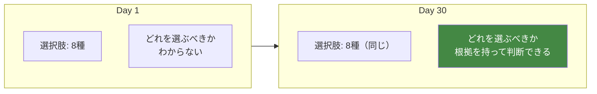

**理由**

| 理由 | 説明 |
|---|---|
| 解放は報酬になる | 「◯◯が使えるようになりました」は憲章 I-7 の構造 |
| 解放は進捗率を生む | AP-27。未解放の可視化が収集動機になる |
| 解放は最適解を生む | 後半の選択肢が「強い」ことになる |
| **成長の所在が変わる** | 選択肢が増えると、成長がプレイヤーの外側に置かれる |

**⚠️ 増えるのは選択肢ではなく、選択の質である。**

## 1.3 伸びる3つの軸

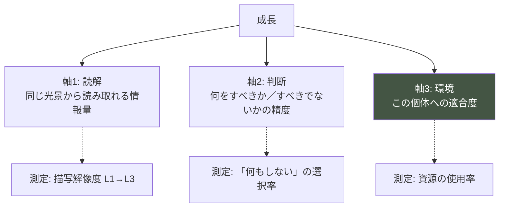

| 軸 | 主体 | 可逆性 | 可視化の方法 |
|---|---|---|---|
| **軸1 読解** | プレイヤー | 不可逆 | 描写の詳細化 |
| **軸2 判断** | プレイヤー | 不可逆 | 選択の変化 |
| **軸3 環境** | 部屋 | **可逆** | 猫の使用行動 |

**⚠️ 軸3（環境）だけが可逆である。**
これが「取り返しがつく」領域であり、試行錯誤の場になる（⑨ Failure Economy）。

## 1.4 達成感の3つの源

**本作で達成感が生まれる瞬間を特定する。**

| # | 源 | 発生条件 | 頻度 |
|---|---|---|---|
| **A-1** | **予測が当たる** | 予測を立て、その通りになる | Day 11以降・断続的 |
| **A-2** | **環境が使われる** | 設置・配置したものを猫が使う | Day 6以降・数回 |
| **A-3** | **意味がわかる** | 過去の観察が現在と結びつく | Day 20以降・稀 |

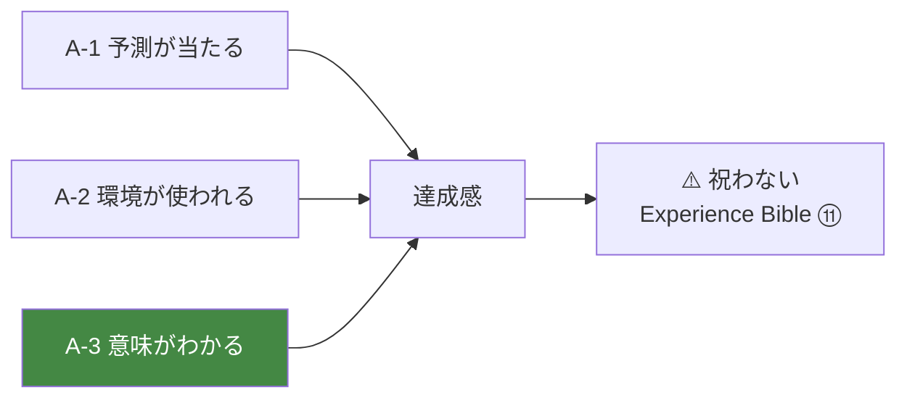

**⚠️ A-3 が最大の達成感であり、最も稀である。** 希少性が価値を生む。

**⚠️ いずれも演出で祝わない**（AP-70）。達成感は内発的であり、外から祝うと価値が下がる。

## 1.5 挑戦（Challenge）の所在

**本作の挑戦は、操作でも戦闘でもない。**

| 挑戦 | 内容 |
|---|---|
| **観察の挑戦** | 限られた時間で、何を見るか |
| **推理の挑戦** | 断片から、見えないものを推し量る |
| **自制の挑戦** | **何もしないでいられるか** ★ |
| **判断の挑戦** | 情報が足りない中で決める |

**⚠️ 「自制の挑戦」が本作固有かつ最も難しい挑戦である。**
多くのゲームは「行動しないこと」を挑戦にしない。本作はそこに賭けている。

## 1.6 実装時の注意点

```
⚠️ 「伸びるもの」に数値を与えない
⚠️ 選択肢を解放しない
⚠️ 達成感を演出で祝わない
⚠️ 効率化を成長にしない（06 §9.5）
⚠️ 成長の可視化は描写と行動の変化でのみ行う
```

---

# ② Resource Economy

> **目的**: ゲーム内で管理するリソースを定義し、循環構造を確定する。
> **設計理由**: リソースを誤って定義すると、そのリソースが最大化の対象になる。特に「信頼」「理解」をリソースとして扱うと、本作は「懐かせるゲーム」に転落する（AA-120）。**何をリソースとしないか**の定義が最重要。
> **プレイヤー体験への影響**: 何を管理し、何を管理しないかの感覚。
> **他システムとの依存関係**: 03 State Management、04 Simulation、07 Event。
> **実装時の注意点**: 非リソースを UI 上でリソースのように扱わないこと。

## 2.1 ⚠️ リソースの定義

> ### **リソース = プレイヤーが管理・配分できるもの**

指示に挙げられた項目のうち、**リソースでないもの**を先に除外する。

| 指示された項目 | 判定 | 理由 |
|---|---|---|
| 時間 | ✅ リソース | 有限。配分可能 |
| 資金 | ✅ リソース（限定） | §4 参照 |
| 生活コスト | ✅ リソース | 固定支出 |
| 行動回数 | ✅ リソース | 本作の主要リソース |
| 猫用品 | ✅ リソース（消耗品のみ） | 補充が必要 |
| 環境改善 | 🔄 **状態**（リソースではない） | 蓄積せず、可逆な状態 |
| **知識** | ❌ **非リソース** | 消費されない。蓄積のみ |
| **理解** | ❌ **非リソース** | 同上。**数値化は憲章 I-1 違反** |
| **信頼** | ❌ **非リソース** | **プレイヤーが操作できない。管理対象にした瞬間に「懐き度」になる** |

## 2.2 なぜ信頼と理解をリソースにしないのか

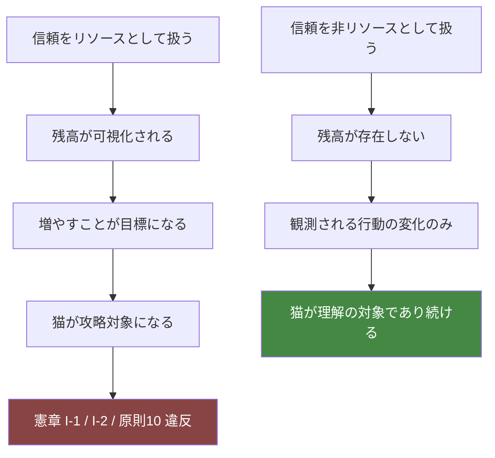

**⚠️ リソース設計は、そのまま「プレイヤーが何を最大化しようとするか」を決める。**
信頼をリソースにしないことが、本作の経済設計における最重要判断である。

## 2.3 リソース一覧

### 主要リソース（消費・配分の対象）

| ID | リソース | 単位 | 用途 | 入手 | 消費 | 枯渇時 | 回復 |
|---|---|---|---|---|---|---|---|
| **R-1** | **時間（Segment）** | Segment | すべての行動の器 | Day 開始時に6 | 行動・観察 | Day 終了 | 翌日リセット |
| **R-2** | **行動枠** | 枠 | 介入の実行 | 在室 Segment ごとに2 | 介入行動 | 介入不可 | 次 Segment |
| **R-3** | **予算** | 円 | 消耗品・物品の購入 | **初期値のみ。増えない** | 購入 | 購入不可 | **回復しない** |
| **R-4** | **消耗品** | 個/量 | 餌・水・トイレ砂 | 購入 | 日次消費 | 資源が使えない | 補充 |

### 状態（リソースではないが管理対象）

| ID | 状態 | 用途 | 変化 | 可逆性 |
|---|---|---|---|---|
| **S-1** | 環境の適合度 | 猫の行動に影響 | 配置・掃除・変更 | ✅ 可逆 |
| **S-2** | 清潔度 | トイレの使用可否 | 掃除で回復／時間で低下 | ✅ 可逆 |
| **S-3** | 自己臭の分布 | 猫の安心に影響 | 滞在で蓄積／掃除で消失 | ✅ 可逆 |

### 非リソース（蓄積するが管理対象ではない）

| ID | 項目 | 性質 | UI 表示 |
|---|---|---|---|
| **N-1** | 観測履歴 | 追記のみ | 記録として参照可 |
| **N-2** | 理解（Insight） | 追記・確信度は変動 | **数値表示しない** |
| **N-3** | 記録 | 追記のみ | 参照可 |
| **N-4** | 猫の信頼・慣れ | **プレイヤー不可視・不可操作** | **表示しない** |
| **N-5** | 経過日数 | 単調増加 | 日付として表示 |

## 2.4 リソース循環図

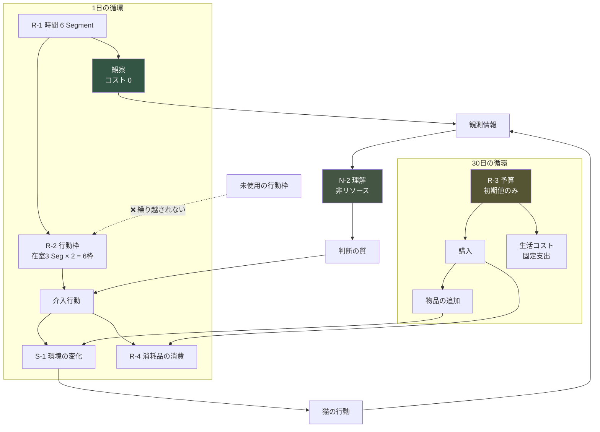

## 2.5 各リソースの詳細

### R-1 時間（Segment）

| 項目 | 内容 |
|---|---|
| **用途** | すべての行動の器。1日6 Segment（04 §1.2） |
| **入手** | Day 開始時に自動で6 |
| **消費** | Segment の進行（在室3・不在3） |
| **枯渇時** | Day 終了。翌日へ |
| **回復** | 翌日にリセット。**繰り越し不可** |
| **⚠️ 特記** | **観察は時間を消費しない**（Pillar 1） |

**⚠️ 観察が Segment を消費しない設計が、Pillar 1 の経済的実装である。**
観察にコストがあると、「観察は損」という判断が生まれる。

### R-2 行動枠（Action Slot）★ Z-02 の確定

| 項目 | 内容 |
|---|---|
| **用途** | 介入行動の実行 |
| **入手** | **在室 Segment ごとに 2 枠**（1日で計 6 枠） |
| **消費** | 行動の種別により 0〜2 枠（§3.4） |
| **枯渇時** | その Segment では介入不可。観察は可能 |
| **回復** | 次の在室 Segment |
| **繰り越し** | **不可。未使用枠は消滅する**（04 §1.3） |

**⚠️ 繰り越し不可の理由**: 「使わないと損」という感覚を生まないため。
繰り越せると、貯めて一気に使う戦略が生まれ、Pillar 6 が崩れる。

### R-3 予算

**§4 Money Economy で詳述。**

| 項目 | 内容 |
|---|---|
| **用途** | 消耗品の補充、物品の追加 |
| **入手** | **初期値のみ。ゲーム内で増える手段は存在しない** |
| **消費** | 購入、固定の生活コスト |
| **枯渇時** | **購入不可になるが、詰みにはならない** |
| **回復** | **しない** |

**⚠️ 予算が尽きても、猫との関係を改善する手段は残る**（§4.5）。

### R-4 消耗品

| 項目 | 内容 |
|---|---|
| **用途** | 餌・水・トイレ砂 |
| **入手** | 購入（R-3 を消費） |
| **消費** | 猫の使用により日次で減少 |
| **枯渇時** | **該当資源が使えなくなる** → 猫の Needs が充足されない |
| **回復** | 補充（行動枠 + 予算を消費） |

**⚠️ 消耗品の枯渇は、本作で唯一の「明確に避けるべき状態」である。**
ただし**枯渇は必ず事前に観測可能**である（SR-1）。

```
餌が減る → 残量が視認できる → 補充しないと空になる
   ↓
空になっても、その日のうちに補充すれば回復する
   ↓
数日放置すると、猫の状態に影響が出る（ただし危機的にはならない）
```

**⚠️ 憲章§9.4 により、消耗品の枯渇が死・重篤な疾病に発展することはない。**

## 2.6 リソース間の交換レート

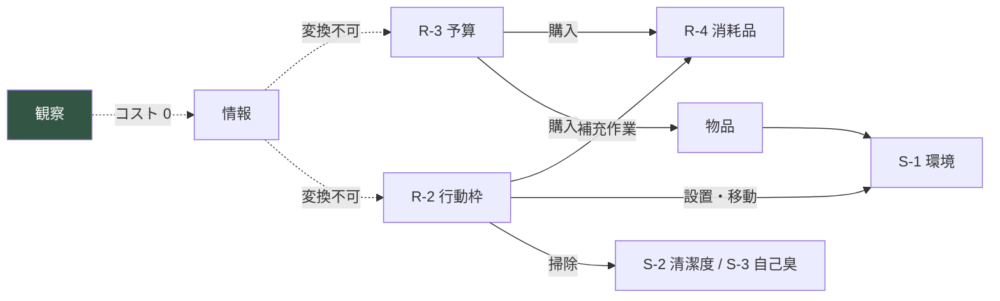

**⚠️ 情報（観察の成果）は、他のリソースに変換されない。**
情報は判断の質を上げるだけである。これにより「観察を効率的に金に換える」構造が生まれない。

## 2.7 実装時の注意点

```
⚠️ 信頼・理解・慣れをリソースとして実装しない
⚠️ 非リソースに残高・ゲージ・数値を与えない
⚠️ 観察にコストを課さない
⚠️ 行動枠を繰り越し可能にしない
⚠️ 予算を増やす手段を実装しない
⚠️ 消耗品の枯渇を致命的にしない
⚠️ 情報を他リソースに変換可能にしない
```

---

# ③ Time Economy

> **目的**: 時間をリソースとして設計し、Z-02（介入回数）を確定する。
> **設計理由**: 本作の唯一の本質的な希少資源は時間である。Pillar 4（30日は戻らない）と Pillar 1（観察は無制限）を両立させるには、時間の内訳を精密に設計する必要がある。
> **プレイヤー体験への影響**: 「すべてはできない」という感覚の源。
> **他システムとの依存関係**: 04 §1（Segment 構造）、07 §10（イベント密度）。
> **実装時の注意点**: 観察と介入の非対称を崩さない。

## 3.1 時間の三重構造

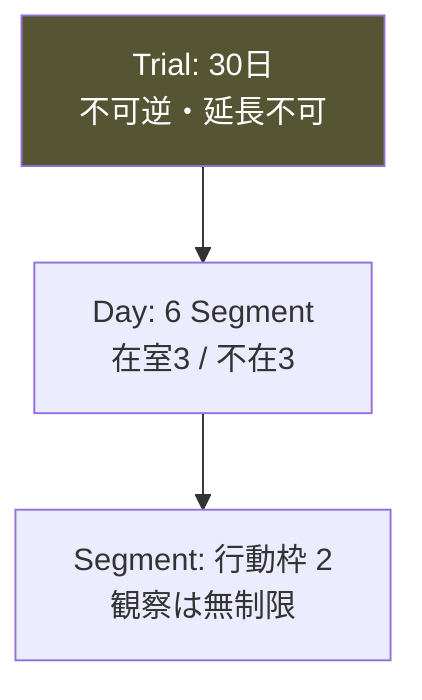

| 階層 | 総量 | 希少性 | プレイヤーの制御 |
|---|---|---|---|
| **Trial** | 30日 | **最高** | なし（固定） |
| **Day** | 6 Segment | 中 | 部分的（進行の確定） |
| **Segment** | 2 行動枠 | 高 | 完全（何に使うか） |

## 3.2 在室・不在の構造（04 §1.2 再掲）

| Segment | 時間帯 | 在室 | 行動枠 | 観察 |
|---|---|---|---|---|
| SG-1 未明 | 04-06 | ❌ | 0 | ❌ |
| **SG-2 朝** | 06-10 | ✅ | **2** | ✅ 無制限 |
| SG-3 昼 | 10-15 | ❌ | 0 | ❌ |
| **SG-4 夕** | 15-19 | ✅ | **2** | ✅ 無制限 |
| **SG-5 夜** | 19-23 | ✅ | **2** | ✅ 無制限 |
| SG-6 深夜 | 23-04 | ❌ | 0 | ❌ |

**1日の総行動枠 = 6**

## 3.3 ★ Z-02 の確定：1 Segment あたり 2 行動枠

### 決定の根拠

| 候補 | 1日の枠 | 評価 |
|---|---|---|
| 1 枠 | 3 | 少なすぎる。環境変更（2枠）が1日1回もできない |
| **2 枠** | **6** | **適正。環境変更2〜3回 + 補充が可能。かつ「すべてはできない」** |
| 3 枠 | 9 | 多すぎる。やりたいことがすべてできてしまう |
| 4 枠以上 | 12+ | 「すべてはできない」が崩壊。作業化する |

### 2枠が生む体験

```
1 Segment で可能な組み合わせ（例）
  ・環境変更 1回（2枠）
  ・資源補充 2回（1枠 × 2）
  ・掃除 1回 + 補充 1回（1+1）
  ・何もしない（0枠）
  ・自分の位置を変える（0枠）+ 補充 1回（1枠）
```

**⚠️ 「環境変更をしたら、その Segment では他に何もできない」ことが重要である。**
これが Pillar 3（環境こそが対話）に重みを与える。

### 実測調整の余地

**⚠️ 2枠は初期値である。** 以下の指標で調整する（付録A）。

| 指標 | 健全な範囲 |
|---|---|
| 1日の平均使用枠 | 3.0〜4.5 |
| 全枠使用日の割合 | 20〜35% |
| 0枠使用日（何もしない日）の割合 | **10〜20%** |
| 「枠が足りない」というフィードバック | 30〜50%（適度な不足感） |

**⚠️ 全枠を毎日使い切る設計は失敗である。** 余裕がないと観察に時間を使えない。

## 3.4 行動別のコスト表 ★ X-1 の確定

| 行動 | コスト | 分類 | 備考 |
|---|---|---|---|
| **観察する** | **0** | 自由 | Pillar 1。無制限 |
| **記録を読む** | **0** | 自由 | いつでも参照可 |
| **自分の位置を変える** | **0** | 自由 | ★ 最も効くのに無料 |
| **自分の姿勢を変える** | **0** | 自由 | ★ 同上 |
| **視線を外す／向ける** | **0** | 自由 | ★ 同上 |
| **何もしない** | **0** | 自由 | 予測可能性が上がる |
| 資源を補充する（餌・水・砂） | 1 | 軽 | 予算も消費 |
| 食器・水入れの位置を変える | 1 | 軽 | |
| 部分的な掃除（トイレ） | 1 | 軽 | 清潔度が回復 |
| 小物を置く／どける | 1 | 軽 | 予算を消費する場合あり |
| 全体の掃除 | 2 | 重 | 自己臭がリセットされる |
| 家具を移動する | 2 | 重 | 大きな環境変化 |
| 家具を追加する | 2 | 重 | 予算を消費 |
| 家具を撤去する | 2 | 重 | |
| トイレの位置を変える | 2 | 重 | 猫への影響が大きい |

### ⚠️ コスト 0 の行動が最重要である

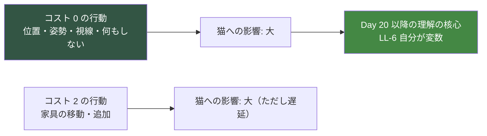

**設計意図**

```
最も効く行動が、最も安く、最も気づかれにくい。

プレイヤーは序盤、コストの高い行動（家具・掃除）に注目する。
終盤、コスト0の行動（自分の振る舞い）が最も効くと気づく。

→ これが Player Flow ⑤D4（最も自覚されない決定）の経済的実装
```

## 3.5 時間帯ごとの制約

| Segment | できること | 制約 |
|---|---|---|
| **SG-2 朝** | 痕跡の確認・補充・軽い変更 | 猫は中活動。観察しやすい |
| **SG-4 夕** | 環境変更・観察 | **猫の活動ピーク。最も観察価値が高い** |
| **SG-5 夜** | 観察・軽い作業 | 猫は中活動。静かな時間 |

**⚠️ 夕（SG-4）の観察価値が最も高い。**
ここで環境変更に2枠を使うと、活動ピークの観察機会を失う。**トレードオフが発生する。**

## 3.6 優先順位の構造

**プレイヤーが毎日直面する優先順位問題。**

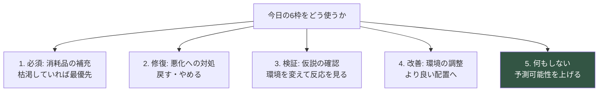

**⚠️ 優先順位はゲームが提示しない**（AP-31）。
プレイヤーが観察から判断する。

## 3.7 時間切れと持ち越し

| 対象 | 時間切れ時 | 持ち越し |
|---|---|---|
| Segment 内の行動枠 | 未使用分は消滅 | ❌ |
| その日の観察機会 | 失われる | ❌ |
| 30日の期限 | 決断へ | ❌ 延長不可 |
| 消耗品 | 残量は保持 | ✅ |
| 予算 | 残額は保持 | ✅ |
| 記録・観測履歴 | 保持 | ✅ |

**⚠️ 「延長」は存在しない。** トライアル延長エンディングは結末であって、ゲームの延長ではない。

## 3.8 実装時の注意点

```
⚠️ 観察のコストを 0 に保つ
⚠️ 自分の位置・姿勢・視線のコストを 0 に保つ
⚠️ 行動枠を繰り越し可能にしない
⚠️ 「枠を使い切る」ことを推奨しない
⚠️ 優先順位を提示しない
⚠️ 全枠使用日が50%を超えたら、コスト設計を見直す
⚠️ 時間の延長手段を実装しない
```

---

# ④ Money Economy

> **目的**: 金銭を扱いつつ、「買えば解決する」構造を構造的に排除する。
> **設計理由**: 費用の理解は Mission 1（心理的ハードルを下げる）と Day 30 の決断に不可欠である。一方、金銭を「猫を良くする通貨」にすると MU-18（良い物を買えば良い環境）を強化し、憲章の根幹に反する。**両立には特殊な設計が要る。**
> **プレイヤー体験への影響**: 「現実の費用感」を得つつ、「金で解決できない」ことを学ぶ。
> **他システムとの依存関係**: S-09 Furniture（効果値の禁止）、07 MU-18 の反証。
> **実装時の注意点**: 価格と効果を相関させない。これが本章の絶対条件。

## 4.1 ⚠️ 基本方針

> ### **金銭は「購買力」ではなく「現実の理解」として扱う。**
> ### **金で猫との関係は改善しない。**

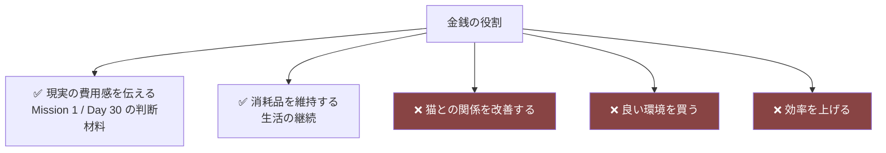

## 4.2 金銭設計の4原則

| # | 原則 | 内容 |
|---|---|---|
| **M-1** | **価格と効果を相関させない** | 高い物が良いとは限らない。個体差が支配する |
| **M-2** | **無料の解法が必ず存在する** | どの課題も、購入せずに解決しうる |
| **M-3** | **予算は増えない** | 稼ぐ要素を作らない |
| **M-4** | **枯渇しても詰まない** | 予算 0 でも30日は完遂できる |

### M-1 の実装

```
❌ キャットタワー（高価）: 効果 +30
❌ 段ボール箱（安価）: 効果 +5

✅ キャットタワー: 高さ 120cm、上部に平坦面、脚部の安定性 中
✅ 段ボール箱: 高さ 30cm、四方が囲まれ、開口 1

→ どちらが「良い」かは、この個体の T-6 高所選好 / T-7 遮蔽選好 で決まる
→ PT-02 潜伏型には、段ボール箱のほうが効く
```

**⚠️ アイテムに「効果値」を持たせない**（AA-65 / S-09 禁止事項）。持つのは**物理的事実**のみ。

### M-2 の実装

**すべての課題に、無料の解法が存在する。**

| 課題 | 有料の解法 | **無料の解法** |
|---|---|---|
| 隠れ場所がない | 猫用ハウスを買う | **既存の家具の配置を変える** |
| 高所がない | キャットタワーを買う | **既存の家具を段差として使う** |
| 食事場所が落ち着かない | 別の食器を買う | **食器の位置を変える** |
| トイレを使わない | 別のトイレを買う | **位置を変える／掃除する** |
| 猫が警戒する | （買えるものはない） | **自分の振る舞いを変える** ★ |

**⚠️ 最も効く解法（自分の振る舞い）には、購入手段が存在しない。**

## 4.3 収支の構造

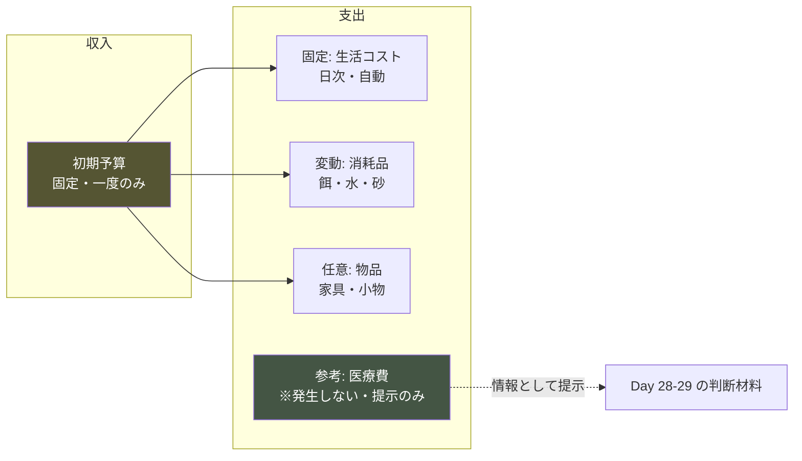

### 収入

| 項目 | 金額 | 発生 |
|---|---|---|
| 初期予算 | 固定値（付録A） | Day 0 に一度のみ |
| **追加収入** | **なし** | ❌ 稼ぐ手段は存在しない |

### 支出

| 分類 | 項目 | 頻度 | 必須 |
|---|---|---|---|
| **固定** | 生活コスト（自分の生活） | 日次・自動 | ✅ 不可避 |
| **変動** | 餌 | 数日ごと | ✅ 必須 |
| **変動** | トイレ砂 | 数日ごと | ✅ 必須 |
| **任意** | 家具・小物 | 随時 | ❌ 任意 |
| **任意** | 消耗品の質の変更 | 随時 | ❌ 任意 |

## 4.4 ⚠️ 医療費・保険の扱い

### 医療費

| 扱う | 扱わない |
|---|---|
| Day 28-29 で「目安」として情報提示 | ゲーム内での発生 |
| 「予期しない出費がありうる」という理解 | 病気イベント |
| Reality Bridge での正確な情報 | 治療の選択 |

**根拠**: 憲章§9.4（疾病を扱わない）。
しかし**費用の現実は Day 30 の判断材料として不可欠**である（Player Flow ⑤D7）。
したがって「発生させないが、情報として提示する」。

### 保険

| 扱う | 扱わない |
|---|---|
| 「そういう選択肢がある」という言及 | 特定商品の推奨 |
| Day 28-29 の情報提示 | ゲームメカニクスとしての加入 |
| Reality Bridge での中立的な情報 | 保険料のシミュレーション |

**根拠**: 06 §6.6「特定商品の推奨」を扱わない。憲章 I-8（中立性）。

## 4.5 予算枯渇時の設計 ★ M-4

**予算が 0 になっても、詰まない。**

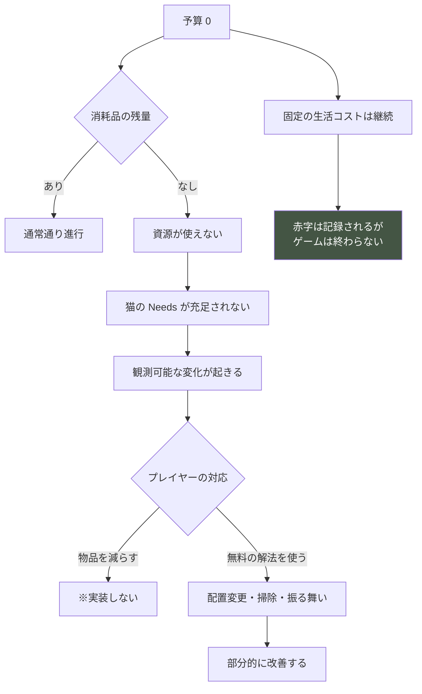

**⚠️ 赤字はゲームオーバーではない**（憲章 I-4）。
記録として残り、Day 30 の判断材料になる。

**⚠️ ただし赤字は「現実では起こりうること」として誠実に扱う。**
「猫を迎えるには経済的な余裕が必要」という理解は、Mission に沿う。

**⚠️ 赤字でプレイヤーを責めない**（憲章 I-10）。記録に評価を書かない。

## 4.6 予算設計の目標

| 指標 | 目標値 |
|---|---|
| 必須支出のみの場合の30日後残高 | **プラス**（余裕がある） |
| 物品を数点購入した場合 | **わずかにプラス〜ゼロ** |
| 物品を多数購入した場合 | **マイナス**（赤字） |
| 予算を使い切らずに完遂可能か | **✅ 可能** |
| 予算を全額使っても解決しない課題 | **✅ 存在する**（自分の振る舞い） |

**⚠️ 「買い物を控えれば余裕がある」設計にする。**
「買わないと足りない」設計は、購入を強制することになる。

## 4.7 経済フロー図（30日）

```
残高
  │ 初期予算
  ●━━━━━━━━━━━━━━━━━━━━━━━━━━━━━━ 必須支出のみ
  │╲                                    （余裕を持って完遂）
  │ ╲___
  │     ╲___                      ━━━━━ 物品を数点購入
  │         ╲___                        （ほぼゼロで着地）
  │             ╲___
  │                 ╲___          ━━━━━ 物品を多数購入
  │                     ╲___            （赤字）
  0├──────────────────────────╲──────────
  │                              ╲
  └────────────────────────────────────→ Day
   0        10        20        30
```

**⚠️ どの線でも30日は完遂でき、どの線でもエンディングに優劣はない。**

## 4.8 実装時の注意点

```
⚠️ アイテムに効果値・ランク・レアリティを持たせない（AA-65）
⚠️ 価格と有用性を相関させない
⚠️ すべての課題に無料の解法を用意する
⚠️ 予算を増やす手段を実装しない
⚠️ 予算枯渇を詰みにしない
⚠️ 赤字をゲームオーバーにしない
⚠️ 赤字でプレイヤーを責めない
⚠️ 医療費を発生させない（情報提示のみ）
⚠️ 特定の保険商品を推奨しない
⚠️ 「おすすめ商品」を提示しない（AP-31）
```

---

# ⑤ Progression Curve

> **目的**: 30日を通じた進行の実感を設計する。
> **設計理由**: 数値が伸びない以上、進行感は「読解・判断・環境」の3軸で作るしかない。3軸の伸び方が異なることを設計に織り込む必要がある。
> **プレイヤー体験への影響**: 「進んでいる」実感の有無。離脱率に直結。
> **他システムとの依存関係**: 06 ⑥ Knowledge Progression、02 Player Flow の Phase。
> **実装時の注意点**: 進行度を数値・進捗バーで示さない。

## 5.1 3軸の進行曲線

```
進行度
  │                                          ┌── 軸1 読解
  │                                    ┌─────┘   （単調増加）
  │                              ┌─────┘
  │                        ┌─────┘
  │                  ┌─────┘
  │            ┌─────┘
  │      ┌─────┘
  │──────┘
  │
  │                          ╱╲        ┌────── 軸2 判断
  │                    ╱╲   ╱  ╲  ╱───┘        （谷を経て伸びる）
  │              ╱╲   ╱  ╲╱    ╲╱
  │        ╱╲   ╱  ╲╱
  │  ╱╲   ╱  ╲╱
  │╱   ╲╱
  │
  │        ╱╲    ╱╲      ╱╲    ╱────────────── 軸3 環境
  │      ╱    ╲╱    ╲  ╱    ╲╱                 （試行錯誤で上下）
  │    ╱              ╲╱
  │  ╱
  └──────────────────────────────────────────→ Day
   1     5    10    15    20    25    30
```

| 軸 | 曲線の形 | 特徴 |
|---|---|---|
| **軸1 読解** | 単調増加（減速なし） | 観察した分だけ伸びる。後退しない |
| **軸2 判断** | **谷を持つ** | Day 13-20 で一度崩れ、その後より高く |
| **軸3 環境** | 上下する | 試行錯誤。可逆 |

**⚠️ 軸2 の谷が Player Flow Phase ④ と一致する。**

## 5.2 段階別の進行実感

### Day 1-5（開始〜数日）

| 軸 | 状態 | プレイヤーの実感 |
|---|---|---|
| 読解 | L1 検出 | 「見えるものが増えてきた」 |
| 判断 | 何をすべきかわからない | 「進んでいる気がしない」 |
| 環境 | 手探り | 「変えても何も起きない」 |

**⚠️ この期間の進行実感は極めて薄い。** 意図的である。

**⚠️ ただし「毎日1つ以上の観測可能な差分」で最低限の手応えを保証する**（DE-09）。

### Day 6-12（1週間）

| 軸 | 状態 | プレイヤーの実感 |
|---|---|---|
| 読解 | L2 弁別へ | 「違いがわかるようになった」 |
| 判断 | 積極的介入 | **「うまくいっている」** |
| 環境 | 初めて効果が出る | 「置いたものを使ってくれた」 |

**⚠️ Day 11-12 が進行実感のピークである。** そして過剰一般化の状態でもある。

### Day 13-20（2週間）

| 軸 | 状態 | プレイヤーの実感 |
|---|---|---|
| 読解 | L2 → L3 へ | 「もっと細かく見ないと」 |
| 判断 | **崩壊** | **「わかっていなかった」** |
| 環境 | 裏目に出る | 「良かれと思ったのに」 |

**⚠️ この期間、進行実感はマイナスになりうる。**
**唯一伸び続けるのが軸1（読解）である。** これが離脱を防ぐ最後の支えになる。

### Day 21-27（3週間）

| 軸 | 状態 | プレイヤーの実感 |
|---|---|---|
| 読解 | L3 文脈化 | 「同じものが違って見える」 |
| 判断 | **再構築** | 「待つことも選べる」 |
| 環境 | 安定 | 「この子に合っている」 |

### Day 28-30（30日）

| 軸 | 状態 | プレイヤーの実感 |
|---|---|---|
| 読解 | L3 定着 | 「だいたい読める。でも全部ではない」 |
| 判断 | 責任 | 「自分で決める」 |
| 環境 | 完成に近い | 「この部屋は、この子のための部屋だ」 |

## 5.3 進行の可視化手段（数値を使わない）

| 手段 | 対応する軸 | 実装 |
|---|---|---|
| **描写の詳細化** | 軸1 読解 | 06 ③3.4 |
| **記録の文体変化** | 軸1・軸2 | 06 ⑧8.2 |
| **記録の並置** | 軸1・軸2 | 06 ⑧8.3 |
| **猫の行動範囲の拡大** | 軸3 環境 | 05 ③3.5 territory |
| **使われる資源の増加** | 軸3 環境 | 観測可能 |
| **「何もしない」の選択率** | 軸2 判断 | 内部指標 |
| **探索・遊びの出現** | 軸3 環境 | 04 §2.3 |

**⚠️ すべて数値表示しない。** 現象と文体としてのみ現れる。

## 5.4 進行が止まったと感じさせない設計

**Day 13-20 で軸2 が崩れても、軸1 は伸び続ける。**

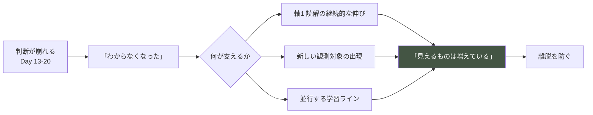

**⚠️ 谷の期間中も、描写は詳しくなり続ける。**
これが「進んでいないわけではない」という感覚を維持する。

## 5.5 実装時の注意点

```
⚠️ 進行度を数値・進捗バーで示さない
⚠️ 「◯%完了」を表示しない
⚠️ 軸1 読解は後退させない（谷の間も伸ばす）
⚠️ Day 11-12 の実感ピークを作る（後の谷のため）
⚠️ Day 13-20 で軸1 の伸びを止めない
⚠️ 進行の可視化は現象と文体のみ
```

---

# ⑥ Reward Design

> **目的**: 数値報酬なき報酬体系を経済の観点から設計する。
> **設計理由**: Experience Bible ⑪ で感情的報酬 ER-A〜D を定義済み。本章はそれを**供給量と頻度**の観点で設計し、報酬の枯渇と過剰を防ぐ。
> **プレイヤー体験への影響**: 手応えの密度。
> **他システムとの依存関係**: Experience Bible ⑪、07 Event（報酬の供給源）。
> **実装時の注意点**: 報酬を演出で祝わない。祝った瞬間に外的報酬になる。

## 6.1 報酬の分類（経済の観点）

| ID | 報酬 | 供給源 | 頻度 | 逓減 |
|---|---|---|---|---|
| **RW-1** | **観測可能性の拡大** | 理解の進行 | 継続的 | しない |
| **RW-2** | **猫の新しい行動の出現** | 環境と時間 | 断続的 | **する** |
| **RW-3** | **環境が使われる** | プレイヤーの配置 | 数回 | する |
| **RW-4** | **予測の的中** | プレイヤーの推理 | 断続的 | しない |
| **RW-5** | **意味の再解釈** | 長期の観察 | 稀 | しない |
| **RW-6** | **静けさ・美的満足** | 常時 | 常時 | しない |
| **RW-7** | **自己変化の自覚** | 記録の参照 | 終盤 | しない |

## 6.2 ⚠️ 「ゲーム的報酬」の扱い

指示は「感情的報酬とゲーム的報酬を整理」を求めているが、
**本作にゲーム的報酬（アイテム・数値・解放）は存在しない**（憲章 I-7 / AP-30〜32）。

**代替として、RW-1「観測可能性の拡大」をゲーム的報酬の位置に置く。**

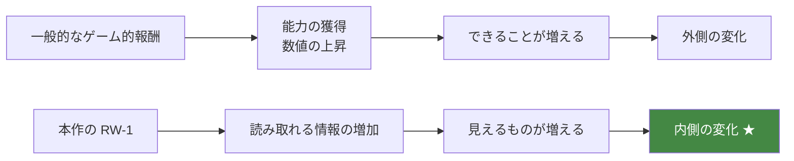

**⚠️ RW-1 は実質的な「能力の獲得」だが、数値化されず、通知されない。**
プレイヤーは「いつの間にか見えるようになっていた」と感じる。

## 6.3 報酬の供給スケジュール

```
報酬強度
  │                                    RW-5 ★
  │                              RW-4  ╱│
  │                        RW-2  ╱╲  ╱  │  RW-7
  │            RW-3  ╱╲   ╱  ╲╱    ╲╱   │  ╱
  │      RW-2  ╱  ╲ ╱  ╲ ╱              │ ╱
  │  ╱╲  ╱  ╲╱    ╲╱    ╲               │╱
  │╱  ╲╱                  ╲_____________╱
  │────────────── RW-6 常時基層 ──────────────
  └──────────────────────────────────────────→ Day
   1     5    10    15    20    25    30
                     ↑
              Day 13-20 報酬を絞る
```

**⚠️ Day 13-20 で報酬を絞ることが、Day 24 の強度を決める**（Experience Bible ⑪11.3）。

| Day 帯 | 主報酬 | 密度 |
|---|---|---|
| 1-5 | RW-6 美的 | 低 |
| 6-12 | RW-2, RW-3, RW-4（小） | **中〜高** |
| **13-20** | **RW-6 のみ** | **最低** |
| 21-27 | RW-4, RW-5 | **最高** |
| 28-30 | RW-7 | 中 |

## 6.4 報酬の逓減設計

**RW-2（猫の新しい行動）と RW-3（環境が使われる）は逓減する。**

```
Day 6  初めて隠れ場所が使われる     → 強い喜び
Day 12 2つ目の場所が使われる       → 中程度
Day 20 3つ目の場所が使われる       → 弱い
```

**⚠️ 逓減は設計上正しい。** 同じ報酬が同じ強度で続くと、慣れて価値を失う。

**⚠️ 逓減を補うのが RW-4（予測の的中）と RW-5（再解釈）である。**
これらは逓減しない。理解が深まるほど強くなる。

## 6.5 報酬の枯渇を防ぐ

| リスク | 対処 |
|---|---|
| RW-2/RW-3 の逓減で手応えが消える | RW-4 の供給を Day 11 以降に増やす |
| Day 13-20 に報酬がなさすぎる | RW-6（美的）を維持し、軸1 の伸びを保つ |
| 終盤に報酬がない | RW-5・RW-7 を配置 |

## 6.6 報酬にしてはならないもの（再掲）

```
❌ アイテム / 経験値 / レベル / 実績 / 称号
❌ 新しい猫の解放
❌ 装飾品・スキン
❌ ストーリーの解放
❌ 猫の「特別な仕草」の解放
❌ 選択肢の解放
❌ 予算の増加
❌ 行動枠の増加
```

**⚠️ 「行動枠の増加」を報酬にしない。** 効率化を成長にしない（06 §9.5）。

## 6.7 実装時の注意点

```
⚠️ 報酬を演出で祝わない（AP-70）
⚠️ 報酬の獲得を通知しない
⚠️ RW-1 を数値化・通知しない
⚠️ Day 13-20 で報酬を絞る
⚠️ 逓減を補う報酬（RW-4/RW-5）を配置する
⚠️ 行動枠・予算を報酬にしない
```

---

# ⑦ Difficulty Curve

> **目的**: ゲーム全体の難易度変化を設計する。
> **設計理由**: 難易度設定は存在しない（AP-09）。難易度は個体差と時期から自然に生まれる。その曲線を意図的に設計しなければ、体験が偶然に委ねられる。
> **プレイヤー体験への影響**: 手応えと理不尽の境界。
> **他システムとの依存関係**: 07 ⑥ Event Difficulty、05 ④ Personality。
> **実装時の注意点**: 難易度を動的に調整しない（AA-09 / AE-26）。

## 7.1 難易度の定義

> ### **難易度 = 読み取るべき情報の微細さ と 考慮すべき文脈の数**

**操作難易度・反射神経・リソース管理の厳しさは、本作の難易度ではない。**

## 7.2 難易度曲線

```
難易度
  │                        ┌─── 最高点 Day 17
  │                     ╱  │╲
  │                  ╱     │ ╲
  │               ╱        │  ╲___
  │            ╱           │      ╲___
  │         ╱              │          ╲___
  │      ╱                 │              ╲___
  │   ╱                    │                  ╲
  │╱                       │                   ╲
  └──────────────────────────────────────────────→ Day
   1     5    10    15    17   20    25    30

  ┌─────┬──────┬────────┬───────┬──────────────┐
  │ 導入 │ 上昇 │ 最高峰  │ 下降  │  安定・深化   │
  │ 低   │ 中   │ 高      │ 中    │  低〜中       │
  └─────┴──────┴────────┴───────┴──────────────┘
```

**⚠️ Day 17 が最高点であり、Player Flow ⑨9.2 の「最深部」と一致する。**

**⚠️ Day 20 以降、難易度は下がる。**
プレイヤーの技能が上がるからではなく、**理解の枠組みが変わるからである。**

## 7.3 段階別の難易度

### 初心者期（Day 1-8）

| 難しいこと | 簡単なこと |
|---|---|
| 何を見ればいいかわからない | やることが少ない |
| 猫が見えない | 選択肢が少ない |
| 変化が読めない | 失敗の概念がない |
| 基準（いつも）がない | 予算に余裕がある |

**この期の難しさ**: **情報の不足**

### 中盤（Day 9-20）

| 難しいこと | 簡単なこと |
|---|---|
| **仮説が通用しなくなる** | 何を見ればいいかはわかる |
| 例外の条件がわからない | 猫の基本的な生活は読める |
| **焦りをどう扱うか** | 環境の基本は整っている |
| 何もしない判断ができない | 記録が蓄積されている |

**この期の難しさ**: **自信の崩壊と、判断の再構築**

### 終盤（Day 21-30）

| 難しいこと | 簡単なこと |
|---|---|
| 微細な変化の読み取り | 大枠の行動は予測できる |
| **自分自身の観察** | 環境は安定している |
| 「わからない」を受け入れること | 何をすべきかは判断できる |
| **決断の重み** | 記録が判断材料になる |

**この期の難しさ**: **メタ的な難しさ（自分と、不確実性）**

## 7.4 何が簡単になり、何が難しくなるか

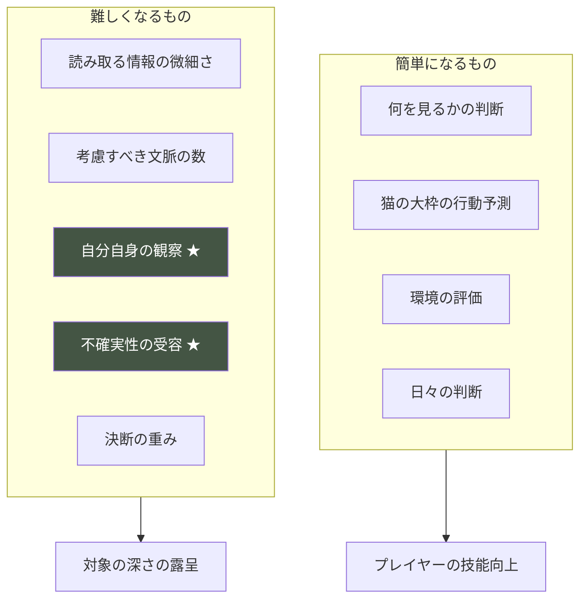

**⚠️ 「難しくなる」のは、ゲームが難しくしているのではない。**
**プレイヤーが深く見られるようになった結果、深い難しさが見えるようになるのである。**

## 7.5 難易度の主要な源は個体差

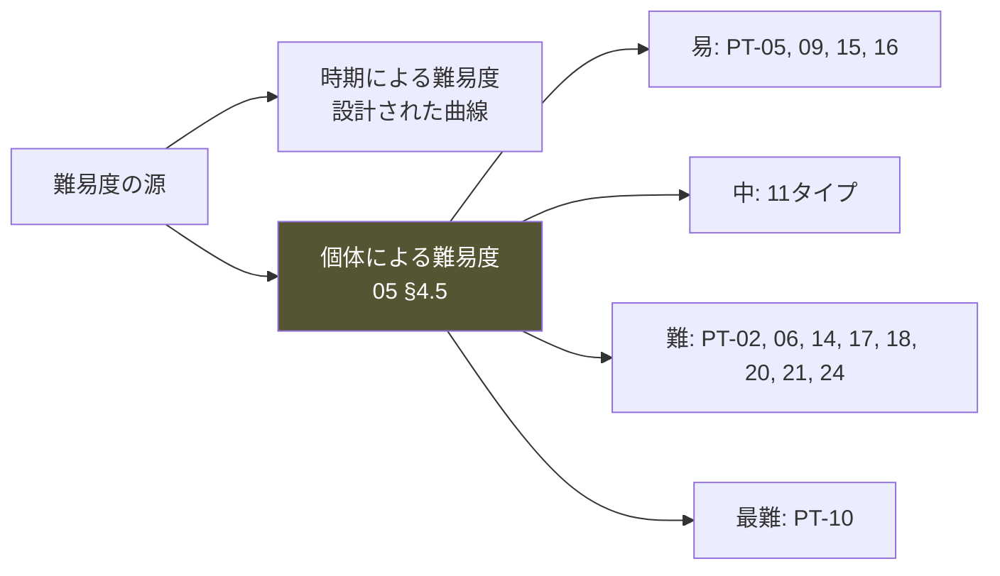

**⚠️ 個体による難易度差は「読み取りの難しさ」であり、クリアの難しさではない**（05 §4.5）。
どの個体でも30日は終わり、詰みは発生しない。

## 7.6 難易度を上げてはならないもの

```
❌ 操作の複雑さ
❌ 時間制限の厳しさ
❌ リソースの逼迫
❌ 情報の隠蔽（理不尽な形での）
❌ 猫の理不尽な行動
❌ 予算の圧迫
❌ 罰の重さ
```

**⚠️ 難易度は「読み取りの深さ」でのみ上げる。**

## 7.7 実装時の注意点

```
⚠️ 難易度設定を実装しない（AP-09）
⚠️ 動的難易度調整を実装しない（AA-09 / AE-26）
⚠️ Day 17 を最高点にする
⚠️ Day 20 以降、難易度を下げる
⚠️ 難易度を操作性・時間制限・リソース逼迫で作らない
⚠️ 難易度をプレイヤーに表示しない
```

---

# ⑧ Decision Economy

> **目的**: 「すべてはできない」設計を確立し、判断を意味あるものにする。
> **設計理由**: 選択に意味を与えるには、選べないものが必要である。同時に「使い切らないと損」という感覚を生んではならない（Pillar 6）。この両立が本章の課題。
> **プレイヤー体験への影響**: 判断の重みと、余裕の共存。
> **他システムとの依存関係**: ③ Time Economy、02 ⑤ Decision Flow。
> **実装時の注意点**: 優先順位をゲームが提示しない。

## 8.1 「すべてはできない」の構造

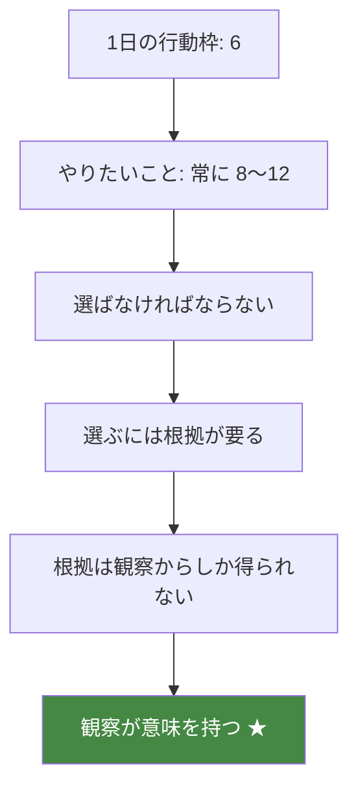

**⚠️ 資源の不足が、観察の価値を生む。**
すべてできるなら、観察する必要がない。

## 8.2 やりたいことの供給源

| 供給源 | 数 |
|---|---|
| 消耗品の補充 | 常時 1〜2 |
| 清潔度の維持 | 常時 1 |
| 進行中の学習ラインの検証 | 2〜3 |
| 新しく気づいたことの確認 | 1〜2 |
| 悪化への対処 | 0〜2 |
| 環境の改善 | 1〜3 |
| **合計** | **6〜13** |

**⚠️ 常に行動枠（6）を上回るようにする。** ただし大幅には超えない。

**⚠️ 12を超えると「何もできていない」感覚を生む**（DE-42 情報過多）。

## 8.3 ⚠️ 「使い切らないと損」を防ぐ設計

**これが本章で最も難しい設計である。**

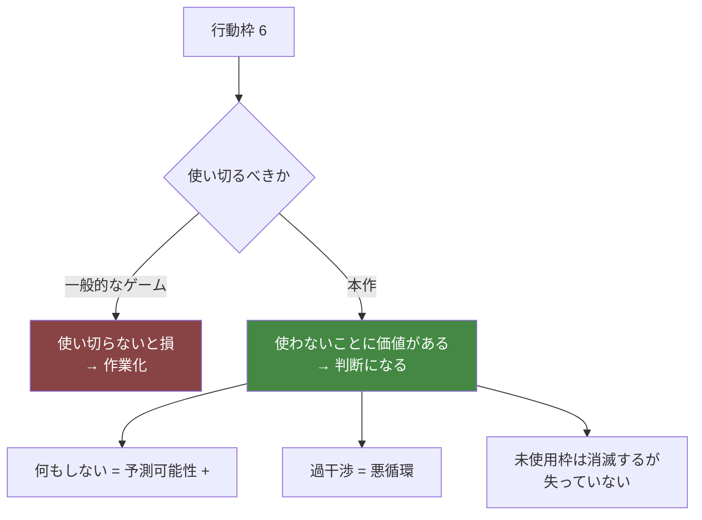

### 3つの安全装置

| # | 装置 | 内容 |
|---|---|---|
| **DS-1** | **介入にはコストがある** | 環境変化そのものがストレス（04 §4.8） |
| **DS-2** | **何もしないことに効果がある** | 予測可能性の上昇（04 §3.6） |
| **DS-3** | **枠の残数を強調しない** | 「あと3枠」を大きく表示しない |

**⚠️ DS-1 が最も重要である。**
行動にコストがあるだけでなく、**行動そのものが猫にとってマイナスになりうる**。
これにより「使い切る」が最適解でなくなる。

## 8.4 判断の優先順位（プレイヤーが自ら構築するもの）

**ゲームは提示しない。** 以下は設計者の想定であり、プレイヤーは自分で辿り着く。

| 優先 | 判断 | 根拠となる観察 |
|---|---|---|
| **1** | 消耗品が枯渇していないか | 残量の視認 |
| **2** | 悪化していないか | 猫の行動の変化 |
| **3** | 昨日の検証結果は出たか | 予測との照合 |
| **4** | 新しい仮説を試すか | 観察からの気づき |
| **5** | 環境を改善するか | 使われていない資源 |
| **6** | 何もしないか | 全体の状況 |

**⚠️ 優先順位 6「何もしない」が、しばしば正解である。**

## 8.5 トレードオフの設計

**意味のある選択には、明確なトレードオフが必要である。**

| トレードオフ | 内容 |
|---|---|
| **観察 vs 介入** | 夕（SG-4）に環境変更すると、活動ピークの観察を逃す |
| **今日 vs 明日** | 今日変えると、明日は結果待ちで動けない |
| **確認 vs 前進** | 既知の検証か、新しい試みか |
| **改善 vs 静穏** | 良くしたいが、変化そのものがストレス |
| **予算 vs 余裕** | 買えば選択肢が増えるが、後で足りなくなる |

**⚠️「改善 vs 静穏」が本作固有の、最も深いトレードオフである。**

## 8.6 実装時の注意点

```
⚠️ やりたいことを常に行動枠より多く供給する（6〜13）
⚠️ ただし12を大きく超えさせない
⚠️ 「使い切らないと損」を防ぐ3装置を実装する
⚠️ 残り枠数を強調表示しない
⚠️ 優先順位をゲームが提示しない
⚠️ 「おすすめ」を表示しない（AP-31）
⚠️ トレードオフを明示しない（気づかせる）
```

---

# ⑨ Failure Economy

> **目的**: 失敗のコストとリカバリーを経済として設計する。
> **設計理由**: Player Flow ⑧ / 07 ⑧ で「失敗は存在しない」と定めた。しかし**コストは存在する**。何を失い、何を失わないかを明確にしなければ、失敗が恐怖になるか、無意味になるかのどちらかに転ぶ。
> **プレイヤー体験への影響**: 試行できるかどうか。
> **他システムとの依存関係**: 04 §5.6 悪循環、07 ⑧ Failure Handling。
> **実装時の注意点**: 失うのは時間だけ。それ以外を失わせない。

## 9.1 失うもの／失わないもの

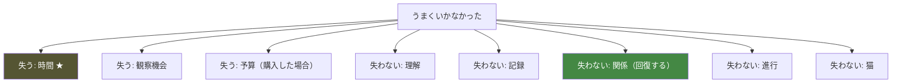

| 対象 | 失うか | 回復 |
|---|---|---|
| **時間（日数）** | ✅ **失う** | ❌ **不可逆**（Pillar 4） |
| 観察機会 | ✅ 失う | ❌ その日の分は不可逆 |
| 行動枠 | ✅ 失う | ✅ 翌 Segment |
| 予算 | ✅ 失う | ❌ 回復しない |
| **理解** | ❌ 失わない | — |
| **記録** | ❌ 失わない | — |
| **関係** | ❌ 失わない | ✅ **時間をかければ回復** |
| **進行（日数の進み）** | ❌ 失わない | — |
| **猫** | ❌ 失わない | — |

**⚠️ 唯一の不可逆な損失は「時間」である。**

## 9.2 失敗の3種類とコスト

| 種類 | コスト | 回復手段 | 回復コスト |
|---|---|---|---|
| **F-1 効果のない行動** | 行動枠 1〜2 | 別の方法を試す | 行動枠 |
| **F-2 逆効果の行動** | 行動枠 + **数日の観察機会** | 待つ／元に戻す | **時間**（1〜3日） |
| **F-3 悪循環** | **数日の観察機会** | 介入を止める | **時間**（1〜3日） |
| **F-4 消耗品の枯渇** | 猫の Needs の未充足 | 補充 | 行動枠 + 予算 |
| **F-5 予算の枯渇** | 購入不可 | **なし** | — （ただし詰まない） |

## 9.3 F-3 悪循環のコスト計算

```
悪循環に入る（Day n）
   ↓
猫が姿を見せなくなる → 直接 Cue の観測機会が減少
   ↓
自力で気づいて止める → 1〜3日で回復
放置する             → 6〜8日で回復（04 §5.6）
   ↓
失った日数 = 観察の深さの損失
```

| 悪循環の日数 | 失う観察機会 | 30日への影響 |
|---|---|---|
| 1〜3日 | 軽微 | ほぼなし |
| 4〜7日 | 中程度 | 学習ライン1本が浅くなる |
| 8日以上 | 大きい | 学習ライン2本が未完に |

**⚠️ 8日以上の悪循環は、セーフティネットで自然回復が始まる**（04 §5.6）。

**⚠️ ただし悪循環そのものが LL-5/LL-6 の最重要の学習機会である**（07 §8.5）。
**失った時間と引き換えに、最も深い理解を得ている。**

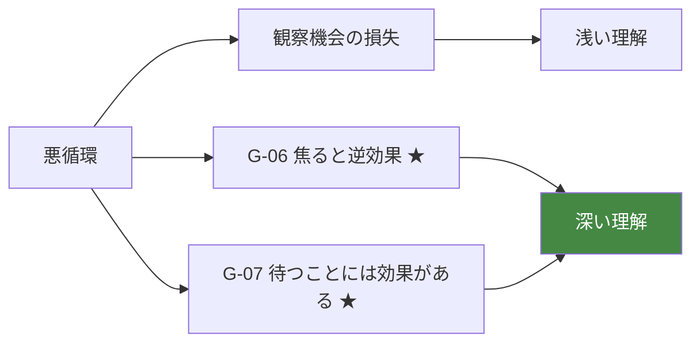

**⚠️ これは「損失」ではなく「投資」である。** ただしプレイヤーにそう説明しない。

## 9.4 再挑戦のコスト

| 対象 | 再挑戦できるか | コスト |
|---|---|---|
| 環境の変更 | ✅ できる | 行動枠 + 猫の再学習期間（3日） |
| 配置の調整 | ✅ できる | 行動枠 |
| 距離の取り方 | ✅ できる | なし（コスト 0 の行動） |
| 一度失った日 | ❌ できない | — |
| 見逃した観察 | ❌ できない | ただし別経路がある（I-D） |

**⚠️ 「やり直す」は存在しない。「別の方法を試す」だけである。**

## 9.5 リカバリー手段の一覧

| 手段 | コスト | 効果 | 所要 |
|---|---|---|---|
| **何もしない・待つ** | **0** | **最も効果的** | 1〜3日 |
| 元に戻す | 行動枠 2 | 中（ただし変更自体が再びストレス） | 3日 |
| 距離を取る | 0 | 高 | 即時〜1日 |
| 静かに過ごす | 0 | 高 | 1〜3日 |
| 別の場所に用意する | 行動枠 1〜2 | 中 | 3日 |
| 予算で解決する | 予算 + 行動枠 | **低** | 3日 |

**⚠️ 最も効果的なリカバリーが最も安い（コスト 0）。**
**最も高価なリカバリー（予算）が最も効果が低い。**

**⚠️ この逆転が、本作の経済設計の思想そのものである。**

## 9.6 失敗が学びになる保証

| 保証 | 実装 |
|---|---|
| 原因が観測可能 | SR-1 / SR-2 |
| 原因が事後に辿れる | 記録の参照 |
| 同じ状況が再現しうる | 学習ラインの反復 |
| 責められない | 憲章 I-10 |
| 記録に残る | 06 ⑧8.3 |
| 再試行できる | ⑨9.4 |

**⚠️ この6条件が揃って初めて、失敗は学びになる。**

## 9.7 実装時の注意点

```
⚠️ 失うのは時間・観察機会・予算のみ
⚠️ 理解・記録・関係・進行・猫を失わせない
⚠️ 最も効果的なリカバリーをコスト 0 に保つ
⚠️ 予算による解決を最も効果の低い手段にする
⚠️ 悪循環に上限を設ける（8日で自然回復開始）
⚠️ 失敗を「投資」として説明しない
⚠️ 再挑戦を「やり直し」にしない
```

---

# ⑩ Replay Economy

> **目的**: 2周目以降に新しい体験が得られる構造を設計する。
> **設計理由**: 憲章§14.3「周回は別の個体であり、効率的な1周目ではない」を経済的に保証する必要がある。効率化を許すと、Pillar 1 が形骸化する。
> **プレイヤー体験への影響**: 周回の価値と、周回しない自由。
> **他システムとの依存関係**: 05 ④ Personality、06 ⑨9.6 周回時の成長。
> **実装時の注意点**: 周回を促さない。周回率を KPI にしない。

## 10.1 周回で変わるもの／変わらないもの

```mermaid
graph TB
    subgraph CHANGE["変わる"]
        C1["個体（性格 24タイプ）"]
        C2["有効な打ち手"]
        C3["学習ラインの内容"]
        C4["環境の最適解"]
        C5["観測される Cue の組合せ"]
    end
    subgraph SAME["変わらない"]
        S1["30日という長さ ★"]
        S2["1日の行動枠 6"]
        S3["コアループ"]
        S4["観察の方法"]
        S5["初期予算"]
    end

    style S1 fill:#553,color:#fff
```

**⚠️ 「30日という長さ」が変わらないことが最重要である。**
2周目が早く終わるなら、それは効率化であり、観察のスキップを意味する。

## 10.2 持ち越すもの／持ち越さないもの

| 対象 | 持ち越し | 理由 |
|---|---|---|
| **観察の方法（プレイヤーの技能）** | ✅ **プレイヤーの中に** | 転移する |
| 一般化（G-01〜G-13） | ✅ プレイヤーの中に | 転移する |
| 前回の記録の参照 | ✅ 可能 | 対比の材料 |
| **描写解像度** | ❌ **リセット** | 個体が違えば見るべきものが違う |
| **Insight** | ❌ リセット | 個体固有 |
| 有効だった具体的な打ち手 | ❌ 通用しない | 個体差 |
| 予算・消耗品 | ❌ リセット | |
| 環境の配置 | ❌ リセット | |

**⚠️ 描写解像度をリセットする理由**

```
描写解像度を持ち越すと、2周目は最初から詳しく見える
   → 観察の必要が減る
   → 効率化
   → Pillar 1 の形骸化

ただし：プレイヤー自身の技能は残っているため、
        解像度の上昇は1周目より速い
   → これが「上達の実感」になる
```

## 10.3 周回で新しく得られるもの

| # | 得られるもの | 説明 |
|---|---|---|
| **RP-1** | **個体差の実感** | 「前の子とは違う」— G-10 の体験的確認 |
| **RP-2** | **方法の有効性の確認** | 観察という方法は通用する — G-13 の確認 |
| **RP-3** | **一般論の限界の再確認** | 前回の答えが通用しない — MU-36 の反証 |
| **RP-4** | **異なる学習ライン** | 個体により成立するラインが違う |
| **RP-5** | **上達の実感** | 同じ段階に速く到達する（ただし30日は変わらない） |
| **RP-6** | **対比による深化** | 2個体の比較から、より深い一般化へ |

**⚠️ RP-6 が周回の最大の価値である。**
1個体では「この子はこう」しか言えない。2個体で初めて「猫にはこういう幅がある」と言える。

## 10.4 周回時の難易度

```mermaid
graph LR
    A["1周目"] --> B["推奨個体: PT-05, 09, 15, 16<br/>読み取りやすい"]
    A --> C["2周目以降"] --> D["中級・上級個体<br/>PT-02, 06, 14, 17, 18, 20, 21, 24"]
    D --> E["最難: PT-10 気まぐれ型"]

    style E fill:#553,color:#fff
```

**⚠️ 個体の割り当ては、プレイヤーが選ぶのではなく、周回数に応じて候補が変わる。**

**⚠️ ただし「難易度が上がる」とは表示しない。** 「別の子がいる」だけである。

## 10.5 周回を促さない設計

```
❌ 「2周目で新しい発見があります！」
❌ 周回ボーナス
❌ 全個体コンプリート
❌ 周回数の表示
❌ 「まだ会っていない子がいます」
❌ 周回限定の要素
```

**⚠️ 1周で満足して終わることは、失敗ではない**（Experience Bible ⑩10.7）。

**⚠️ 提示は静かに。「別の子がいる」程度**（Player Flow ⑩10.7）。

## 10.6 周回率を KPI にしない

| ❌ 指標にしない | ✅ 指標にする |
|---|---|
| 周回率 | 1周目の完走率 |
| 全個体制覇率 | プレイ後の意識変化 |
| 総プレイ時間 | 「猫の見方が変わったか」 |

## 10.7 実装時の注意点

```
⚠️ 30日の長さを周回で変えない
⚠️ 描写解像度をリセットする
⚠️ 前回の答えが通用しない設計にする
⚠️ 周回を促さない
⚠️ 周回ボーナス・コンプリート要素を実装しない
⚠️ 周回率を KPI にしない
⚠️ 「難易度が上がる」と表示しない
```

---

# ⑪ Balance Principles

> **目的**: バランス調整の判断基準を確立する。
> **設計理由**: バランス調整は無数の判断の集合である。原則がなければ、調整のたびに議論が発散し、思想がずれていく。
> **プレイヤー体験への影響**: 一貫性。
> **他システムとの依存関係**: 全システム。
> **実装時の注意点**: 原則に反する調整は、たとえ数値が改善しても却下する。

## 11.1 バランスの10原則

| # | 原則 | 内容 |
|---|---|---|
| **BP-1** | **単一の最適解を作らない** | どの課題にも複数の妥当な解がある（原則3） |
| **BP-2** | **個体差が支配する** | 共通の必勝法を成立させない（原則2） |
| **BP-3** | **無料の解法を常に用意する** | 予算で解決できない領域を残す |
| **BP-4** | **最も効く手段を最も安くする** | 自分の振る舞い＝コスト0 |
| **BP-5** | **「何もしない」を有効に保つ** | 常に選択可能かつ有効（Pillar 6） |
| **BP-6** | **詰みを作らない** | すべての状態から回復経路がある |
| **BP-7** | **失うのは時間だけ** | 理解・記録・関係・猫を失わせない |
| **BP-8** | **効率化を成長にしない** | 熟練しても速くならない |
| **BP-9** | **観察にコストを課さない** | Pillar 1 の経済的保証 |
| **BP-10** | **数値を最大化の対象にしない** | 表示する数値を作らない |

## 11.2 プレイスタイルの尊重

**本作は複数のプレイスタイルを許容する。**

```mermaid
graph TB
    A["プレイスタイル"]
    A --> S1["観察重視型<br/>介入が少なく、見る時間が長い"]
    A --> S2["実験型<br/>積極的に環境を変える"]
    A --> S3["慎重型<br/>変化を最小限に"]
    A --> S4["記録型<br/>仮説と記録を丁寧に"]
    A --> S5["直感型<br/>記録せず、感覚で判断"]

    S1 --> R["すべて成立する"]
    S2 --> R
    S3 --> R
    S4 --> R
    S5 --> R

    style R fill:#484,color:#fff
```

| スタイル | 有利な点 | 不利な点 | 到達可能か |
|---|---|---|---|
| **観察重視型** | 情報が多い | 環境改善が遅い | ✅ |
| **実験型** | 検証が速い | 悪循環に入りやすい | ✅ |
| **慎重型** | 悪循環を避けやすい | 発見が遅い | ✅ |
| **記録型** | 予測誤差から学べる | 時間がかかる | ✅ |
| **直感型** | 素早い | 学習が浅くなりやすい | ✅ |

**⚠️ どのスタイルでも30日は完遂でき、理解に到達できる。**

**⚠️ ただし到達する深さは異なる。** これは公平性の問題ではなく、当然の帰結である。

## 11.3 調整の判断基準

**バランス調整を検討する際、以下の順で判断する。**

```mermaid
flowchart TD
    A["調整の提案"] --> B{"BP-1〜10 に反するか"}
    B -->|"反する"| X["却下"]
    B -->|"反しない"| C{"体験設計に沿うか<br/>Day 17 が最深部か等"}
    C -->|"沿わない"| X
    C -->|"沿う"| D{"上位文書の禁止事項か"}
    D -->|"該当"| X
    D -->|"該当しない"| E["採用検討"]

    style X fill:#844,color:#fff
```

**⚠️ 「数値は改善したが原則に反する」調整は却下する。**

## 11.4 調整可能な範囲

| 調整可 | 調整不可 |
|---|---|
| 各種パラメータの数値（付録A） | 30日という長さ |
| 行動枠の数（2 → 実測次第） | 観察のコスト（0固定） |
| 予算の初期値 | 予算を増やす手段の追加 |
| イベントの発火 Day | 1日の新規発火上限（1件） |
| 悪循環の回復速度 | 詰みの有無 |
| 難易度曲線の傾き | 難易度設定の追加 |
| 消耗品の消費速度 | 枯渇の致命性 |

## 11.5 バランス検証の指標

| 指標 | 健全な範囲 | 逸脱時の対処 |
|---|---|---|
| 1日の平均使用行動枠 | 3.0〜4.5 | 枠数またはコストを調整 |
| 「何もしない」選択率 | **10〜20%** | 0% なら DS-1〜3 を見直す |
| 30日完走率 | 高い | Player Flow ⑩10.6 の6段階 |
| Day 17 前後の離脱率 | 許容範囲内 | 谷の深さを調整 |
| 予算を使い切る割合 | 30〜50% | 初期値を調整 |
| 悪循環の発生率 | **60〜80%** | 低すぎると Phase ④ が成立しない |
| 悪循環からの自力脱出率 | 50〜70% | 低ければセーフティネットを早める |
| 予測を立てる割合 | 40%以上 | 低ければ記録の導線を見直す |

**⚠️ 「悪循環の発生率 60〜80%」が最も特異な指標である。**
悪循環はバグではなく、中核的な学習体験である（Player Flow ②2.6）。

## 11.6 実装時の注意点

```
⚠️ BP-1〜10 に反する調整は数値が改善しても却下する
⚠️ 「何もしない」選択率が 0% なら設計の失敗
⚠️ 悪循環の発生率が低すぎるのも失敗
⚠️ プレイスタイルによる有利不利を均そうとしない
⚠️ 調整不可の項目を調整しない
```

---

# ⑫ Anti Economy Design

> **目的**: 導入してはならない進行・報酬・経済設計を網羅列挙する。
> **設計理由**: 経済設計は最も「業界標準」に引きずられやすい領域である。標準的な手法のほとんどが本作では禁止されるため、明示が不可欠。
> **プレイヤー体験への影響**: （遵守により）思想の一貫性。
> **他システムとの依存関係**: Experience Bible ⑫ の経済領域への拡張。
> **実装時の注意点**: 🔴 は議論せず却下。

## 凡例

```
🔴 憲章・Pillar 違反に直結  🟠 経済設計の破壊  🟡 品質の低下
```

---

## A. 数値成長（AN-01〜AN-14）

| # | アンチパターン | 度 | 理由 |
|---|---|---|---|
| AN-01 | レベル・経験値の導入 | 🔴 | 憲章 I-3 |
| AN-02 | 好感度・信頼度の数値化 | 🔴 | 憲章 I-1 |
| AN-03 | 理解度の数値表示 | 🔴 | 憲章 I-1 / G-2 |
| AN-04 | 観察回数の表示 | 🔴 | 憲章 I-1 |
| AN-05 | 進捗率・達成率の表示 | 🔴 | AP-27 |
| AN-06 | ステータス画面の実装 | 🔴 | 憲章 I-1 |
| AN-07 | スキルツリーの導入 | 🔴 | 憲章 I-3 |
| AN-08 | 能力値の成長 | 🔴 | 憲章 I-3 |
| AN-09 | 「伸びるもの」に数値を与える | 🔴 | 最大化の対象になる |
| AN-10 | 猫の能力値の実装 | 🔴 | 憲章 I-3 |
| AN-11 | 環境の「点数化」 | 🔴 | AA-66。正解の存在を意味する |
| AN-12 | 部屋の「快適度スコア」 | 🔴 | 同上 |
| AN-13 | 飼い主としての「評価点」 | 🔴 | 憲章 I-10 |
| AN-14 | 内部指標をプレイヤーに開示 | 🔴 | 憲章 I-1 |

## B. リソース設計（AN-15〜AN-30）

| # | アンチパターン | 度 | 理由 |
|---|---|---|---|
| AN-15 | 信頼をリソースとして扱う | 🔴 | §2.2。懐かせるゲーム化 |
| AN-16 | 理解をリソースとして扱う | 🔴 | 憲章 I-1 |
| AN-17 | 観察にコストを課す | 🔴 | Pillar 1 / BP-9 |
| AN-18 | 記録を読むのにコストを課す | 🟠 | 参照の阻害 |
| AN-19 | 行動枠を繰り越し可能にする | 🟠 | 貯蓄戦略。Pillar 6 の破壊 |
| AN-20 | 行動枠を購入可能にする | 🔴 | 憲章 I-5 の構造 |
| AN-21 | 行動枠を報酬にする | 🔴 | 効率化を成長にする（06 §9.5） |
| AN-22 | スタミナ制の導入 | 🔴 | AP-07 |
| AN-23 | 時間回復アイテム | 🔴 | AP-20 |
| AN-24 | 予算を増やす手段の実装 | 🔴 | §4.2 M-3 |
| AN-25 | 労働・稼ぐ要素の実装 | 🔴 | 同上。テーマの逸脱 |
| AN-26 | 情報を他リソースに変換可能にする | 🟠 | 観察の効率化 |
| AN-27 | リソースの残高を強調表示する | 🟠 | 管理ゲーム化 |
| AN-28 | 消耗品の枯渇を致命的にする | 🔴 | 憲章§9.4 / I-4 |
| AN-29 | 予算枯渇を詰みにする | 🔴 | BP-6 |
| AN-30 | 非リソースにゲージを与える | 🔴 | 憲章 I-1 |

## C. 金銭（AN-31〜AN-46）

| # | アンチパターン | 度 | 理由 |
|---|---|---|---|
| AN-31 | 価格と効果を相関させる | 🔴 | §4.2 M-1 / MU-18 の強化 |
| AN-32 | アイテムに効果値を持たせる | 🔴 | AA-65 |
| AN-33 | アイテムにレアリティを設定する | 🔴 | S-10 禁止事項 |
| AN-34 | 高級品ほど効果が高い設計 | 🔴 | Pillar 3 実装注意点 |
| AN-35 | 購入でしか解決できない課題 | 🔴 | §4.2 M-2 |
| AN-36 | 「おすすめ商品」の提示 | 🔴 | AP-31 |
| AN-37 | 実在商品の推奨 | 🔴 | 06 §6.6 / 憲章 I-8 |
| AN-38 | 保険をゲームメカニクスにする | 🟠 | 特定商品の推奨に接近 |
| AN-39 | 医療費をゲーム内で発生させる | 🔴 | 憲章§9.4 |
| AN-40 | 病気を経済イベントにする | 🔴 | 同上 |
| AN-41 | 赤字をゲームオーバーにする | 🔴 | 憲章 I-4 |
| AN-42 | 赤字でプレイヤーを責める | 🔴 | 憲章 I-10 |
| AN-43 | 課金要素の実装 | 🔴 | 憲章 I-5 |
| AN-44 | 広告視聴による報酬 | 🔴 | AP-78 |
| AN-45 | 猫用品の販売導線 | 🔴 | AP-79 |
| AN-46 | 価格を「良さ」の指標として提示 | 🔴 | MU-18 |

## D. 報酬（AN-47〜AN-60）

| # | アンチパターン | 度 | 理由 |
|---|---|---|---|
| AN-47 | アイテム報酬 | 🔴 | 憲章 I-7 |
| AN-48 | 実績・トロフィー | 🔴 | AP-30 |
| AN-49 | 称号 | 🔴 | 憲章 I-4 の精神 |
| AN-50 | ログインボーナス | 🔴 | AP-14 |
| AN-51 | デイリー報酬 | 🔴 | AP-13 |
| AN-52 | 連続プレイ報酬 | 🔴 | AP-15 |
| AN-53 | 報酬の獲得演出 | 🔴 | AP-70 |
| AN-54 | 「わかった瞬間」の効果音 | 🔴 | AP-70 |
| AN-55 | 選択肢の解放を報酬にする | 🔴 | §1.2 |
| AN-56 | 猫の新しい仕草を解放式にする | 🔴 | AP-30 相当 |
| AN-57 | ストーリーの解放 | 🔴 | AP-62 |
| AN-58 | 新しい猫を報酬にする | 🔴 | 猫が報酬になる |
| AN-59 | 装飾品・スキン | 🔴 | 憲章§9.9 |
| AN-60 | 報酬で学習を誘導する | 🔴 | 憲章 I-7 |

## E. 進行（AN-61〜AN-72）

| # | アンチパターン | 度 | 理由 |
|---|---|---|---|
| AN-61 | 進捗バーの表示 | 🔴 | AP-27 |
| AN-62 | 「◯日目クリア」の表現 | 🔴 | 憲章§10.2 |
| AN-63 | 章立て・区切りの提示 | 🟠 | Player Flow ⑩10.4 |
| AN-64 | 週次のまとめ画面 | 🟠 | 同上 |
| AN-65 | 目標の提示 | 🔴 | Pillar 2 |
| AN-66 | 「次にやるべきこと」の提示 | 🔴 | AP-31 |
| AN-67 | 未達成項目の可視化 | 🔴 | AP-26 |
| AN-68 | 進行を数値で示す | 🔴 | 憲章 I-1 |
| AN-69 | 谷の期間に軸1（読解）も止める | 🟠 | §5.4。離脱を招く |
| AN-70 | Day 11-12 の実感ピークを作らない | 🟠 | 谷の落差が生まれない |
| AN-71 | 進行を早められる手段の実装 | 🔴 | AP-21 |
| AN-72 | 日数の延長・短縮 | 🔴 | 憲章§14.3 |

## F. 難易度（AN-73〜AN-84）

| # | アンチパターン | 度 | 理由 |
|---|---|---|---|
| AN-73 | 難易度設定の実装 | 🔴 | AP-09 |
| AN-74 | 動的難易度調整 | 🔴 | AA-09 / AE-26 |
| AN-75 | 理解度で世界を変える | 🔴 | G-2 / SR-3 |
| AN-76 | 操作の複雑さで難易度を上げる | 🟠 | §7.6 |
| AN-77 | 時間制限で難易度を上げる | 🔴 | 原則6。焦燥 |
| AN-78 | リソース逼迫で難易度を上げる | 🟠 | §7.6 |
| AN-79 | 情報の理不尽な隠蔽 | 🔴 | SR-1 / DE-23 |
| AN-80 | 猫の理不尽な行動 | 🔴 | SR-2 |
| AN-81 | 罰の重さで難易度を上げる | 🔴 | 憲章 I-10 |
| AN-82 | 難易度をプレイヤーに表示する | 🟠 | メタ情報 |
| AN-83 | 個体差を「難易度」として提示する | 🟠 | 05 §4.5 |
| AN-84 | Day 20 以降に難易度を上げ続ける | 🟠 | §7.2 |

## G. 意思決定（AN-85〜AN-94）

| # | アンチパターン | 度 | 理由 |
|---|---|---|---|
| AN-85 | 行動枠を毎日使い切らせる設計 | 🔴 | §8.3。作業化 |
| AN-86 | 残り枠数を強調表示する | 🟠 | 消化義務感 |
| AN-87 | 未使用枠にペナルティを課す | 🔴 | Pillar 6 |
| AN-88 | 優先順位をゲームが提示する | 🔴 | AP-31 |
| AN-89 | 「おすすめ行動」の表示 | 🔴 | 同上 |
| AN-90 | やりたいことが行動枠以下 | 🟠 | 判断が発生しない |
| AN-91 | やりたいことが行動枠の3倍以上 | 🟠 | DE-42 情報過多 |
| AN-92 | トレードオフを明示する | 🟠 | 気づかせるべき |
| AN-93 | 「何もしない」を目立たせすぎる | 🟠 | ヒントになる |
| AN-94 | 「何もしない」を選びにくくする | 🔴 | Pillar 6 |

## H. 失敗（AN-95〜AN-104）

| # | アンチパターン | 度 | 理由 |
|---|---|---|---|
| AN-95 | 失敗で理解を失わせる | 🔴 | §9.1 |
| AN-96 | 失敗で記録を失わせる | 🔴 | 同上 |
| AN-97 | 失敗で猫を失わせる | 🔴 | 05 ⑧8.3 |
| AN-98 | 失敗で進行を巻き戻す | 🔴 | Pillar 4 |
| AN-99 | 回復不能な状態を作る | 🔴 | BP-6 |
| AN-100 | 予算で失敗を帳消しにできる | 🔴 | §9.5。金で解決 |
| AN-101 | リカバリーに高コストを課す | 🟠 | 試行を阻害 |
| AN-102 | 「やり直し」を提示する | 🔴 | Pillar 4 |
| AN-103 | 失敗を演出で強調する | 🔴 | AP-71 |
| AN-104 | 失敗を「投資」と説明する | 🟠 | 説教。押し付け |

## I. 周回（AN-105〜AN-112）

| # | アンチパターン | 度 | 理由 |
|---|---|---|---|
| AN-105 | 2周目を短縮可能にする | 🔴 | 憲章§14.3 / BP-8 |
| AN-106 | 描写解像度を持ち越す | 🟠 | 効率化 |
| AN-107 | 周回ボーナスの実装 | 🔴 | 憲章 I-7 |
| AN-108 | 全個体コンプリート要素 | 🔴 | AP-27 |
| AN-109 | 周回数の表示 | 🟠 | 収集化 |
| AN-110 | 周回限定要素 | 🔴 | AP-19 の構造 |
| AN-111 | 周回を促す表示 | 🟠 | Player Flow ⑩10.7 |
| AN-112 | 周回率を KPI にする | 🟠 | §10.6 |

## J. バランス調整（AN-113〜AN-120）

| # | アンチパターン | 度 | 理由 |
|---|---|---|---|
| AN-113 | 原則に反する調整を数値改善を理由に採用 | 🔴 | §11.3 |
| AN-114 | 「何もしない」選択率 0% を放置 | 🔴 | Pillar 6 の失敗 |
| AN-115 | 悪循環の発生率を下げる調整 | 🟠 | Phase ④ が成立しない |
| AN-116 | プレイスタイル間の有利不利を均す | 🟠 | BP-1。単一解に接近 |
| AN-117 | 離脱対策として報酬を追加 | 🔴 | AP-98 |
| AN-118 | 離脱対策としてイベントを追加 | 🔴 | AE-84 |
| AN-119 | 30日の長さを調整対象にする | 🔴 | 憲章§14.3 |
| AN-120 | 観察コストを 0 以外にする調整 | 🔴 | BP-9 |

**合計 120 項目**

---

# ⑬ Economy Validation Checklist

> **目的**: 経済・進行・バランスを YES/NO で検証可能にする。
> **設計理由**: バランス調整は主観に流れやすい。項目化することで、調整の可否を客観的に判断できる。
> **プレイヤー体験への影響**: （遵守により）一貫した経済。
> **他システムとの依存関係**: 全章の検証装置。
> **実装時の注意点**: ★ は必須。1つでもNOなら調整を止める。

---

## A群: リソース定義（BQ001〜BQ014）

```
□ BQ001 ★ 信頼がリソースとして実装されていないか
□ BQ002 ★ 理解がリソースとして実装されていないか
□ BQ003 ★ 猫の内部状態に残高・ゲージがないか
□ BQ004 ★ 観察のコストが 0 か
□ BQ005 ★ 記録の参照コストが 0 か
□ BQ006 ★ 自分の位置・姿勢・視線の変更コストが 0 か
□ BQ007 ★ 「何もしない」のコストが 0 か
□ BQ008 ★ 行動枠が繰り越し不可か
□ BQ009 ★ 予算を増やす手段が存在しないか
□ BQ010 ★ 情報が他リソースに変換されないか
□ BQ011 ★ 非リソースに数値表示がないか
□ BQ012    リソース残高が強調表示されていないか
□ BQ013    消耗品の残量が視認可能か
□ BQ014    リソース循環が §2.4 の図と一致するか
```

## B群: 時間経済（BQ015〜BQ028）

```
□ BQ015 ★ 1日が6 Segment か
□ BQ016 ★ 在室 Segment が3か
□ BQ017 ★ 1 Segment の行動枠が2か
□ BQ018 ★ 1日の総行動枠が6か
□ BQ019 ★ 観察が Segment を消費しないか
□ BQ020 ★ 未使用枠が消滅するか
□ BQ021 ★ 時間の延長手段が存在しないか
□ BQ022 ★ 30日が固定か
□ BQ023 ★ 行動コストが §3.4 の表と一致するか
□ BQ024    環境変更が2枠か
□ BQ025    1日の平均使用枠が 3.0〜4.5 か
□ BQ026    全枠使用日が 20〜35% か
□ BQ027    0枠使用日が 10〜20% か
□ BQ028    夕（SG-4）に観察と介入のトレードオフが発生するか
```

## C群: 金銭経済（BQ029〜BQ044）

```
□ BQ029 ★ アイテムに効果値がないか
□ BQ030 ★ アイテムにレアリティ・ランクがないか
□ BQ031 ★ 価格と有用性が相関していないか
□ BQ032 ★ すべての課題に無料の解法があるか
□ BQ033 ★ 予算 0 でも30日を完遂できるか
□ BQ034 ★ 赤字がゲームオーバーでないか
□ BQ035 ★ 赤字でプレイヤーを責めていないか
□ BQ036 ★ 医療費がゲーム内で発生しないか
□ BQ037 ★ 病気が経済イベントになっていないか
□ BQ038 ★ 保険がメカニクスになっていないか
□ BQ039 ★ 実在商品を推奨していないか
□ BQ040 ★ 「おすすめ商品」を提示していないか
□ BQ041 ★ 課金要素が存在しないか
□ BQ042    必須支出のみで30日後に残高がプラスか
□ BQ043    物品を多数購入すると赤字になるか
□ BQ044    予算を全額使っても解決しない課題があるか
```

## D群: 進行（BQ045〜BQ058）

```
□ BQ045 ★ 選択肢の種類が Day 1 と Day 30 で同じか
□ BQ046 ★ 選択肢の解放が存在しないか
□ BQ047 ★ 進捗バー・進捗率が表示されていないか
□ BQ048 ★ 軸1（読解）が谷の期間も伸び続けるか
□ BQ049 ★ 進行度が数値表示されていないか
□ BQ050 ★ 目標が提示されていないか
□ BQ051 ★ 「次にやるべきこと」が提示されていないか
□ BQ052 ★ 週次まとめ・章立てが存在しないか
□ BQ053 ★ 日数の延長・短縮が不可能か
□ BQ054    Day 11-12 に実感のピークがあるか
□ BQ055    Day 13-20 で軸2（判断）が崩れるか
□ BQ056    進行の可視化が現象と文体のみか
□ BQ057    Day 1-5 でも毎日1つ以上の差分があるか
□ BQ058    行動範囲の拡大が観測可能か
```

## E群: 報酬（BQ059〜BQ070）

```
□ BQ059 ★ アイテム報酬が存在しないか
□ BQ060 ★ 実績・トロフィー・称号が存在しないか
□ BQ061 ★ ログインボーナス・デイリー報酬が存在しないか
□ BQ062 ★ 報酬の獲得演出が存在しないか
□ BQ063 ★ 「わかった瞬間」に効果音がないか
□ BQ064 ★ 行動枠・予算が報酬になっていないか
□ BQ065 ★ 選択肢の解放が報酬になっていないか
□ BQ066 ★ 猫が報酬になっていないか
□ BQ067    Day 13-20 で報酬が絞られているか
□ BQ068    RW-2/RW-3 の逓減を RW-4/RW-5 が補うか
□ BQ069    RW-6（美的）が常時供給されているか
□ BQ070    RW-1（観測可能性の拡大）が通知されていないか
```

## F群: 難易度（BQ071〜BQ082）

```
□ BQ071 ★ 難易度設定が存在しないか
□ BQ072 ★ 動的難易度調整が存在しないか
□ BQ073 ★ 理解度で世界が変わらないか
□ BQ074 ★ 難易度が操作性で作られていないか
□ BQ075 ★ 難易度が時間制限で作られていないか
□ BQ076 ★ 難易度がリソース逼迫で作られていないか
□ BQ077 ★ 情報の理不尽な隠蔽がないか
□ BQ078 ★ 難易度が表示されていないか
□ BQ079    Day 17 が難易度の最高点か
□ BQ080    Day 20 以降、難易度が下がるか
□ BQ081    個体差が難易度の主要な源か
□ BQ082    個体差が「難易度」として提示されていないか
```

## G群: 意思決定（BQ083〜BQ094）

```
□ BQ083 ★ やりたいことが行動枠を上回るか
□ BQ084 ★ やりたいことが12を大きく超えないか
□ BQ085 ★ 未使用枠にペナルティがないか
□ BQ086 ★ 優先順位が提示されていないか
□ BQ087 ★ 「おすすめ行動」が存在しないか
□ BQ088 ★ 「何もしない」が選びやすい位置にあるか
□ BQ089 ★ 「何もしない」が目立ちすぎていないか
□ BQ090 ★ 介入そのものにコスト（猫への影響）があるか
□ BQ091    残り枠数が強調表示されていないか
□ BQ092    トレードオフが明示されていないか
□ BQ093    「使い切らないと損」の感覚がないか
□ BQ094    観察 vs 介入のトレードオフが成立するか
```

## H群: 失敗経済（BQ095〜BQ106）

```
□ BQ095 ★ 失敗で理解を失わないか
□ BQ096 ★ 失敗で記録を失わないか
□ BQ097 ★ 失敗で猫を失わないか
□ BQ098 ★ 失敗で進行が巻き戻らないか
□ BQ099 ★ 回復不能な状態が存在しないか
□ BQ100 ★ 予算で失敗を帳消しにできないか
□ BQ101 ★ 「やり直し」が提示されていないか
□ BQ102 ★ 失敗の演出が存在しないか
□ BQ103 ★ 最も効果的なリカバリーがコスト 0 か
□ BQ104 ★ 予算による解決が最も効果の低い手段か
□ BQ105 ★ 悪循環に上限（8日）があるか
□ BQ106    失敗が学びになる6条件が揃っているか
```

## I群: 周回（BQ107〜BQ116）

```
□ BQ107 ★ 2周目も30日か
□ BQ108 ★ 2周目が短縮できないか
□ BQ109 ★ 描写解像度がリセットされるか
□ BQ110 ★ 前回の答えが通用しないか
□ BQ111 ★ 周回ボーナスが存在しないか
□ BQ112 ★ コンプリート要素が存在しないか
□ BQ113 ★ 周回限定要素が存在しないか
□ BQ114    周回を促す表示がないか
□ BQ115    周回率が KPI になっていないか
□ BQ116    1周目推奨個体が易しいタイプか
```

## J群: バランス原則（BQ117〜BQ130）

```
□ BQ117 ★ BP-1 単一の最適解がないか
□ BQ118 ★ BP-2 個体差が支配しているか
□ BQ119 ★ BP-3 無料の解法が常にあるか
□ BQ120 ★ BP-4 最も効く手段が最も安いか
□ BQ121 ★ BP-5 「何もしない」が有効か
□ BQ122 ★ BP-6 詰みが存在しないか
□ BQ123 ★ BP-7 失うのが時間だけか
□ BQ124 ★ BP-8 効率化が成長になっていないか
□ BQ125 ★ BP-9 観察にコストがないか
□ BQ126 ★ BP-10 表示される数値が存在しないか
□ BQ127    5つのプレイスタイルがすべて成立するか
□ BQ128    「何もしない」選択率が 10〜20% か
□ BQ129    悪循環の発生率が 60〜80% か
□ BQ130    予測を立てる割合が 40% 以上か
```

## K群: Anti Economy 適合（BQ131〜BQ136）

```
□ BQ131 ★ AN-01〜AN-120 の 🔴項目がゼロか
□ BQ132 ★ 数値成長要素が存在しないか
□ BQ133 ★ 課金・広告要素が存在しないか
□ BQ134 ★ 原則に反する調整が採用されていないか
□ BQ135    AN の 🟠項目が5件以下か
□ BQ136    調整不可の項目が調整されていないか
```

**合計 136 項目**

---

# 付録A: 数値パラメータ一覧

**⚠️ すべて L2 内部値または設計値であり、プレイヤーに表示しない。**
**⚠️ すべて実測調整の対象である。**

| ID | パラメータ | 初期値 | 調整範囲 | 判定指標 |
|---|---|---|---|---|
| EP-01 | 1日の Segment 数 | 6 | 固定 | — |
| EP-02 | 在室 Segment 数 | 3 | 固定 | — |
| EP-03 | **1 Segment の行動枠** | **2** | 1〜3 | 平均使用枠 3.0〜4.5 |
| EP-04 | 環境変更のコスト | 2 | 1〜2 | 同上 |
| EP-05 | 補充・軽作業のコスト | 1 | 固定 | 同上 |
| EP-06 | 初期予算 | 要決定 | — | 必須支出のみで黒字 |
| EP-07 | 日次生活コスト | 要決定 | — | 同上 |
| EP-08 | 餌の消費速度 | 要決定 | — | 数日ごとに補充 |
| EP-09 | 砂の消費速度 | 要決定 | — | 数日ごとに補充 |
| EP-10 | やりたいことの供給数 | 6〜13 | 6〜12 | 判断が発生する |
| EP-11 | 悪循環の自然回復開始日 | 8 | 6〜10 | 自力脱出率 50〜70% |
| EP-12 | 環境変更への慣れ日数 | 3 | 2〜4 | 04 §4.8 |
| EP-13 | 難易度最高点の Day | 17 | 固定 | Player Flow ⑨9.2 |
| EP-14 | 報酬を絞る期間 | Day 13-20 | 固定 | 同上 |

---

# 付録B: 次工程への引き継ぎ

## B.1 各設計書への必達要件

| 設計書 | 要件 |
|---|---|
| **Room System** | 無料の解法（既存家具の配置変更）が成立する部屋構造 |
| **Item System** | アイテムに効果値・レアリティを持たせない。物理的事実のみ記述 |
| **Furniture System** | 価格と有用性を相関させない。安価な物が有効な個体が存在する |
| **Content Bible** | やりたいことの供給が1日6〜13になるイベント配置 |
| **UI 設計** | 残り枠数を強調しない。「何もしない」を同等の位置に |
| **Technical Design** | EP-01〜EP-14 をデータ駆動で調整可能に |
| **Reality Bridge** | 医療費・保険・現実の費用感の正確な情報 |

## B.2 未確定事項

| # | 事項 | 決定すべき工程 |
|---|---|---|
| EB-01 | 初期予算・生活コスト・物品価格の具体値 | 監修 + 実測調整 |
| EB-02 | 消耗品の消費速度 | 実測調整 |
| EB-03 | やりたいことの具体的な供給内訳 | Content Bible |
| EB-04 | 行動枠2の妥当性検証 | プレイテスト |
| EB-05 | 無料の解法の網羅性検証 | Room / Item / Furniture 設計 |
| EB-06 | 現実の費用の監修 | 監修工程 |
| EB-07 | Core Gameplay Loop Bible との整合 | 同文書作成時 |

---

## 改訂履歴

| バージョン | 日付 | 変更内容 |
|---|---|---|
| 1.0 | 2026-07-24 | 初版策定。Z-02 / X-1 を確定 |

---

> **このゲームで最も効く行動は、最も安く、最も気づかれにくい。**
> **金でも時間でもなく、自分の振る舞いを変えることだ。**
