# 保護猫トライアル30日 — Room & Environment System v1.0

**Document Type**: 環境システム設計
**Parent Documents**:
- [00-PROJECT-CONSTITUTION.md](./00-PROJECT-CONSTITUTION.md)（最上位）
- [01-EXPERIENCE-BIBLE.md](./01-EXPERIENCE-BIBLE.md)
- [02-PLAYER-FLOW.md](./02-PLAYER-FLOW.md)
- [03-SYSTEM-ARCHITECTURE.md](./03-SYSTEM-ARCHITECTURE.md)
- [04-SIMULATION-RULES.md](./04-SIMULATION-RULES.md)
- [05-CAT-AI-DESIGN.md](./05-CAT-AI-DESIGN.md)
- [06-PLAYER-KNOWLEDGE-SYSTEM.md](./06-PLAYER-KNOWLEDGE-SYSTEM.md)
- [07-EVENT-SYSTEM.md](./07-EVENT-SYSTEM.md)
- [08-PROGRESSION-ECONOMY-BALANCE.md](./08-PROGRESSION-ECONOMY-BALANCE.md)

**Authority**: 上記9文書に次ぐ第10位
**Layer**: L2 Simulation / S-07 Environment・S-08 Room・S-09 Furniture・S-10 Item
**Scope**: 環境というゲームシステムの設計のみ
**Out of Scope**: 家具一覧、アイテム性能、イベント内容、UI、猫AI
**Last Updated**: 2026-07-24

---

## 📌 前提の確認と本書での確定事項

参照指定のうち **「Core Gameplay Loop Bible」は未作成**（8回連続）。

**本書が確定させる、長期の持ち越し課題**

| 課題 | 出典 | 本書での確定 |
|---|---|---|
| **Z-03 Zone の具体的な数と構成** | 04 付録D | **§2 で確定** |
| Z-04 家具・アイテムの Zone 属性への寄与 | 04 付録D | §4.4 |
| EB-05 無料の解法の網羅性 | 08 付録B | §4.6 |
| CA-05 Zone の数と構成（Cat AI 用） | 05 付録D | §2 |

**本書は 04 §4（Environment Simulation）の実装展開である。**
04 が「Zone・ZoneSecurity・自己臭」の法則を定めた。本書はそれを**空間構造として実体化**する。

---

## 目次

- [① Environment Philosophy](#-environment-philosophy)
- [② Room Model](#-room-model)
- [③ Environment Parameters](#-environment-parameters)
- [④ Furniture System](#-furniture-system)
- [⑤ Environmental Interaction](#-environmental-interaction)
- [⑥ Environment Progression](#-environment-progression)
- [⑦ Environmental Feedback](#-environmental-feedback)
- [⑧ Hazard System](#-hazard-system)
- [⑨ Environment Data Model](#-environment-data-model)
- [⑩ Anti Environment Design](#-anti-environment-design)
- [⑪ Environment Validation Checklist](#-environment-validation-checklist)
- [付録A: パラメータ計算式集](#付録a-パラメータ計算式集)
- [付録B: 次工程への引き継ぎ](#付録b-次工程への引き継ぎ)

---

# ① Environment Philosophy

> **目的**: 本作における環境を定義し、環境改善がゲームの中心である理由を確立する。
> **設計理由**: 環境を「背景」と捉えると、家具は装飾になり、ステータスアップアイテムになる。環境を「猫との対話の言語」と捉えることで、初めて Pillar 3 が成立する。この転換を最初に固定する。
> **プレイヤー体験への影響**: 部屋を「自分の部屋」ではなく「この子の視点で見た空間」として見るようになるか。
> **他システムとの依存関係**: Pillar 3、04 §4、08 ④ Money Economy。
> **実装時の注意点**: 環境に「良し悪しの絶対評価」を持たせない。

## 1.1 本作における環境の定義

> ### **環境とは、プレイヤーが猫に語りかける唯一の言語である。**

猫は命令に従わない（憲章 I-2）。ならばプレイヤーは何ができるのか。
**猫が選べる選択肢を用意すること** — それが環境である。

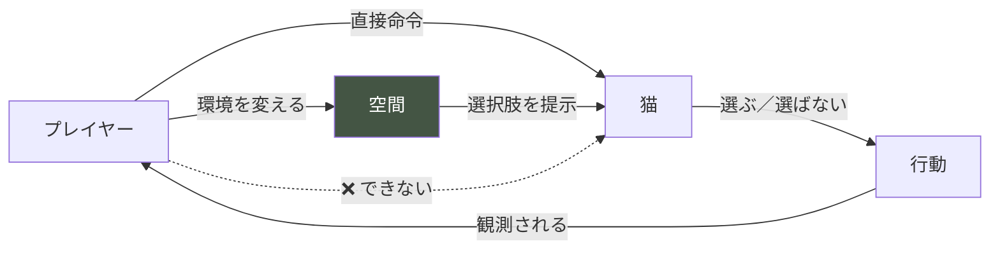

## 1.2 なぜ環境改善が中心なのか

| 理由 | 説明 |
|---|---|
| **唯一の対話手段** | 猫を変えられない以上、環境が唯一の働きかけ（Pillar 3） |
| **可逆な試行の場** | 環境だけが可逆。試行錯誤ができる（08 §1.3 軸3） |
| **現実との一致** | 現実の飼育でも、人ができるのは環境整備である |
| **成長の器** | 「良い部屋」の基準がプレイヤーの中で変化する（08 ⑤） |
| **個体差の露呈** | 同じ環境が個体で違う意味を持つ（原則2） |

## 1.3 環境が背景でない、とは何か

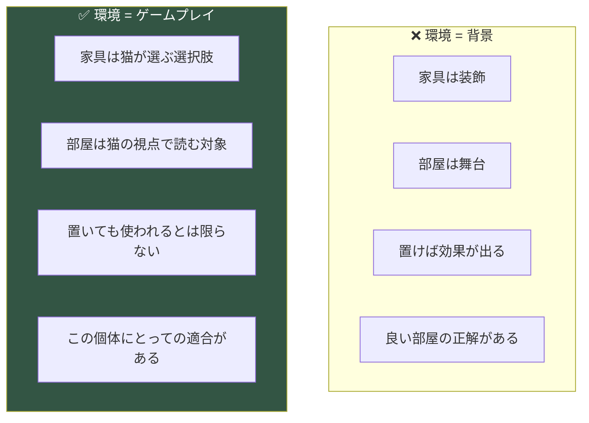

**⚠️ 「置けば効果が出る」を否定することが、本作の環境設計の核心である。**
置いた物が使われるかどうかは、Cat AI が個体の選好に基づいて決める（05 ⑥）。

## 1.4 プレイヤーへ与えたい学び

| 学び | 対応する一般化（06） |
|---|---|
| 猫は環境に反応する | G-03 |
| 良い変更も、変更自体がストレス | G-04 |
| 遮蔽だけでは安全ではない（逃走路が要る） | LL-1 |
| 高価な物が良いとは限らない | MU-18 の反証 |
| 掃除は両面を持つ | MU-20 の反証 |
| この子にとっての快適は、一般論と違う | G-10 |

**⚠️ 最も伝えたいのは「猫の視点で空間を見る」という能力そのものである。**
これは現実に転移する（Reality Bridge 層1）。

## 1.5 環境改善 = 成長体験


**⚠️ 環境そのものは30日で「完成」する。しかし変わったのはプレイヤーの見方である**（Pillar 5）。
部屋の変化は、プレイヤーの理解の変化の可視化である。

## 1.6 実装時の注意点

```
⚠️ 環境に絶対的な「良さ」を持たせない（AA-66）
⚠️ 家具に効果値を持たせない（AA-65）
⚠️ 「置けば効果」の構造を作らない
⚠️ 部屋を背景アセットとして扱わない
⚠️ 環境の適合度をプレイヤーに数値表示しない（憲章 I-1）
```

---

# ② Room Model

> **目的**: 部屋の空間構造を確定し、Zone の数と構成を定める（Z-03）。
> **設計理由**: 04 は Zone を抽象概念として定めたが、実装には具体的な空間構造が要る。同時に、複雑すぎる部屋は1日1〜2分の観察に収まらない。適切な粒度を確定する。
> **プレイヤー体験への影響**: 観察対象の量と、空間の読み取りやすさ。
> **他システムとの依存関係**: 04 §4.2 Zone、05 ⑥ Behavior、07 LL-1。
> **実装時の注意点**: エリアと Zone を混同しない。エリアは意味的分類、Zone は猫の認識単位。

## 2.1 空間の二層構造

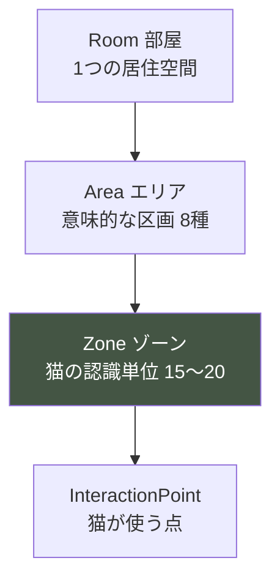

| 層 | 定義 | 数 | 誰のための概念か |
|---|---|---|---|
| **Room** | 居住空間全体 | 1 | 全体 |
| **Area** | 機能的な区画 | 8 | プレイヤーの理解 |
| **Zone** | 猫が「ある場所」と認識する単位 | 15〜20 | **猫（Cat AI）** |
| **InteractionPoint** | 猫が具体的に使う点 | 可変 | 猫の行動 |

**⚠️ Area はプレイヤーの認知単位、Zone は猫の認知単位である。**
両者は一致しない。1つの Area に複数の Zone があり、1つの Zone が複数の Area にまたがることもある。

## 2.2 ⚠️ 部屋の規模

**本作の部屋は「ワンルーム + α」とする。**

| 理由 | 説明 |
|---|---|
| 観察時間 | 1日1〜2分で見渡せる規模 |
| トライアルの現実 | 保護猫のトライアルは限られた空間で始まることが多い |
| Zone の管理 | 15〜20 Zone が認知と実装の上限 |
| 個体差の表現 | 狭くても個体差は十分表現できる |

**⚠️ 複数の部屋・広い家にしない。** 観察が拡散し、密度が下がる。

## 2.3 部屋構造図

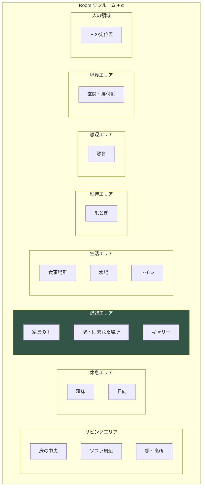

## 2.4 8つのエリアの定義

| ID | エリア | 役割 | 対応 Need | 対応 Zone 例 |
|---|---|---|---|---|
| **AR-1** | **退避エリア** | 安全の確保。隠れる | N-01 安全 | 家具下・隅・キャリー |
| **AR-2** | **休息エリア** | 眠る・くつろぐ | N-05 睡眠・N-09 休息 | 寝床・日向 |
| **AR-3** | **生活エリア** | 食事・飲水・排泄 | N-02〜N-04 | 食器・水・トイレ |
| **AR-4** | **リビングエリア** | 移動・探索・遊びの中心 | N-10 探索・N-11 遊び | 床中央・ソファ |
| **AR-5** | **窓辺エリア** | 外部刺激・日向・見晴らし | N-12 高所・N-06 体温 | 窓台 |
| **AR-6** | **維持エリア** | 爪とぎ・マーキング | N-08 爪とぎ | 爪とぎ器 |
| **AR-7** | **境界エリア** | 外との境。刺激の入口 | （刺激源） | 玄関・扉付近 |
| **AR-8** | **人の領域** | 人の定位置。距離の基準 | N-13 社会的接触 | 人の座る場所 |

### ⚠️ エリアの重要な性質

**エリアは「役割」であって「固定の場所」ではない。**

```
退避エリアは、家具の配置で移動する。
食事エリアは、食器を動かせば変わる。
高所は、棚を置けば生まれる。

→ プレイヤーがエリアを作り変えることが、環境改善である。
```

## 2.5 Zone の構成（Z-03 の確定）

**Zone は 15〜20 個。以下の型で構成する。**

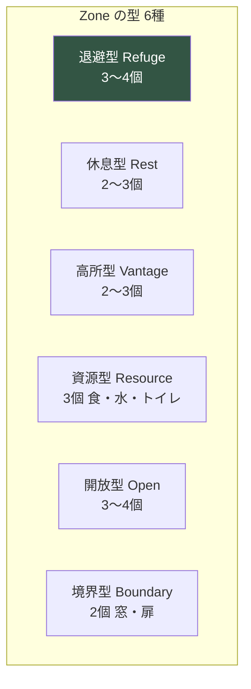

| Zone 型 | 数 | 特徴 | 主な属性 |
|---|---|---|---|
| **退避型** | 3〜4 | 隠れられる | 高 cover、逃走路が鍵 |
| **休息型** | 2〜3 | 安定して休める | 中 cover、快適性 |
| **高所型** | 2〜3 | 見下ろせる | 高 height、sightline |
| **資源型** | 3 | 食・水・トイレ | 到達性が鍵 |
| **開放型** | 3〜4 | 見通しがよい | 低 cover、trafficLevel |
| **境界型** | 2 | 外部刺激の入口 | 高 noiseLevel |

**⚠️ 各 Zone は 04 §4.2 の10属性を持つ**（height / cover / exits / sightline / humanDistance / trafficLevel / noiseLevel / lightLevel / temperature / selfScent）。

## 2.6 Zone の可変性

**Zone には固定 Zone と可変 Zone がある。**

| 種別 | 内容 | プレイヤーの操作 |
|---|---|---|
| **固定 Zone** | 部屋の構造由来（窓・扉・壁の隅） | 変更不可 |
| **半可変 Zone** | 家具由来（棚の上・ソファの下） | 家具の移動で変わる |
| **生成 Zone** | 追加物由来（置いた箱・タワー） | 追加・撤去で生成・消滅 |

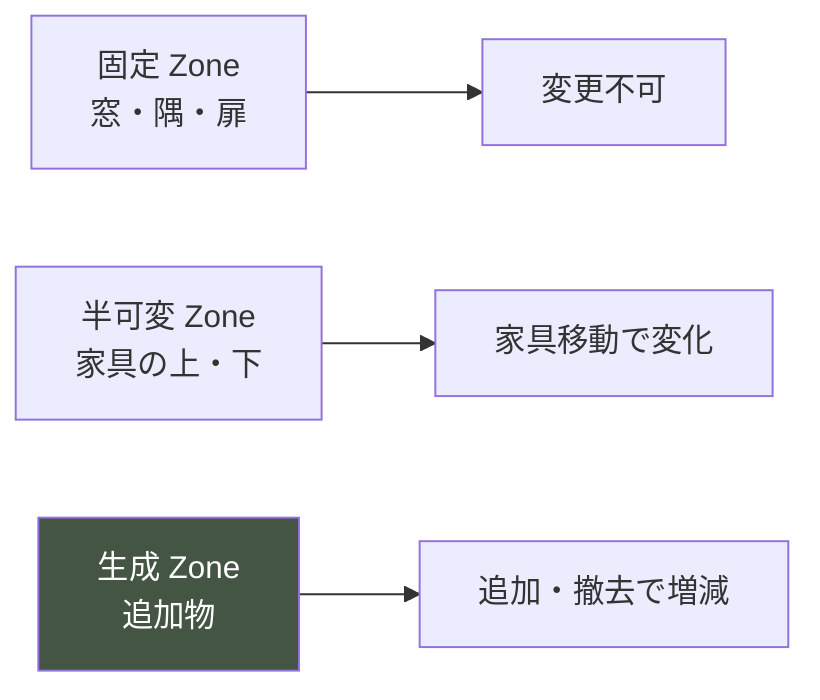

**⚠️ プレイヤーが Zone を「生み出せる」ことが、環境改善の実体である。**
段ボールを置く = 退避型 Zone を1つ生成する。

## 2.7 Zone 間の関係

**Zone は孤立せず、接続関係を持つ。**

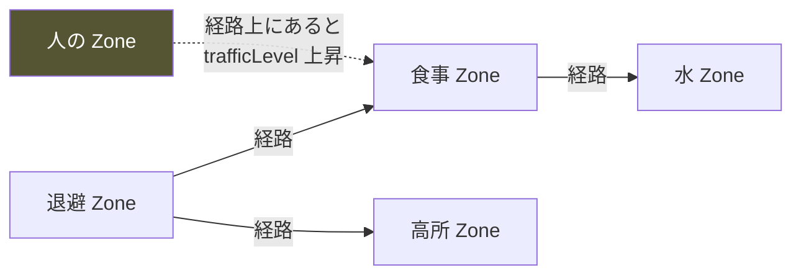

**⚠️ 経路が人の Zone を通ると、その資源への到達性が下がる**（04 §4.6）。
これが LL-2「食事の条件」の空間的実装である。

## 2.8 実装時の注意点

```
⚠️ Area（意味）と Zone（猫の認識）を混同しない
⚠️ 部屋を複数にしない。ワンルーム + α
⚠️ Zone を 15〜20 に保つ（多すぎると観察が拡散）
⚠️ 生成 Zone をプレイヤーが作れるようにする
⚠️ Zone 間の経路を明示的に持つ
⚠️ 固定 Zone だけで最低限の生活が成立すること（初期状態でも詰まない）
```

---

# ③ Environment Parameters

> **目的**: 環境の内部パラメータを確定し、猫への作用を定義する。
> **設計理由**: 04 §4 が Zone 属性を定めたが、それらがどう相互作用し、どう猫に作用するかの統合が必要。本章がパラメータ体系を完成させる。
> **プレイヤー体験への影響**: 環境変更の効果の一貫性と予測可能性。
> **他システムとの依存関係**: 04 §4、05 Cat AI、⑦ Feedback。
> **実装時の注意点**: すべて L2 内部値。プレイヤーに数値開示しない（憲章 I-1）。

## 3.1 パラメータの三層

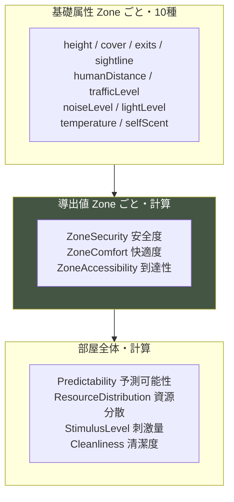

## 3.2 基礎属性（04 §4.2 再掲）

| 属性 | 値域 | 意味 | 主な変化条件 |
|---|---|---|---|
| `height` | 0-1 | 床からの相対高さ | 家具の設置 |
| `cover` | 0-1 | 遮蔽度 | 家具・囲い |
| `exits` | 整数 | 逃走経路の数 | 配置 |
| `sightline` | 0-1 | 見渡しやすさ | 高さ・障害物 |
| `humanDistance` | 0-1 | 人からの距離 | 人・家具の位置 |
| `trafficLevel` | 0-1 | 人の動線上か | 人の位置・経路 |
| `noiseLevel` | 0-1 | 到達する音量 | 音源・遮蔽 |
| `lightLevel` | 0-1 | 照度 | 窓・時間帯・照明 |
| `temperature` | 0-1 | 相対温度 | 日射・時間帯 |
| `selfScent` | 0-1 | 自己臭の蓄積 | 滞在・掃除 |

## 3.3 導出値

### ZoneSecurity（安全度）— 04 §4.3

```
ZoneSecurity(z) =
    w_cover  × cover
  + w_height × height
  + w_exits  × exitScore(exits)
  + w_sight  × sightline
  + w_dist   × humanDistance
  - w_traffic× trafficLevel
  - w_noise  × noiseLevel
  + w_scent  × selfScent
```

**⚠️ 重み w_* は個体プロファイルで変動する**（SR-5）。同じ Zone が個体で違う安全度を持つ。

### ZoneComfort（快適度）

```
ZoneComfort(z) =
    w_temp    × thermalFit(temperature)
  + w_light   × lightFit(lightLevel)
  + w_soft    × softness      ← 家具属性
  + w_scent2  × selfScent
```

### ZoneAccessibility（到達性）

```
ZoneAccessibility(z) =
    pathSafety(z)        ← 経路上の最低 ZoneSecurity
  × (1 - pathTraffic(z)) ← 経路が人の動線を通るか
  × reachability(z)      ← 物理的に到達可能か
```

**⚠️ 到達性が資源に効く。** 安全な食事 Zone でも、到達経路が危険なら使われない。

## 3.4 部屋全体のパラメータ

| パラメータ | 計算 | 猫への作用 |
|---|---|---|
| **Predictability** | ルーチンの一貫性 + 環境変化頻度 + 人の一貫性 | Vigilance ベースライン（04 §3.6） |
| **ResourceDistribution** | 同種資源の分散 + 異種資源の分離 | 全体の安心 |
| **StimulusLevel** | 音・光・動きの総量 | 覚醒・警戒 |
| **Cleanliness** | トイレ・食器の清潔度 | 資源の使用可否 |

### ResourceDistribution の設計（04 §4.7）

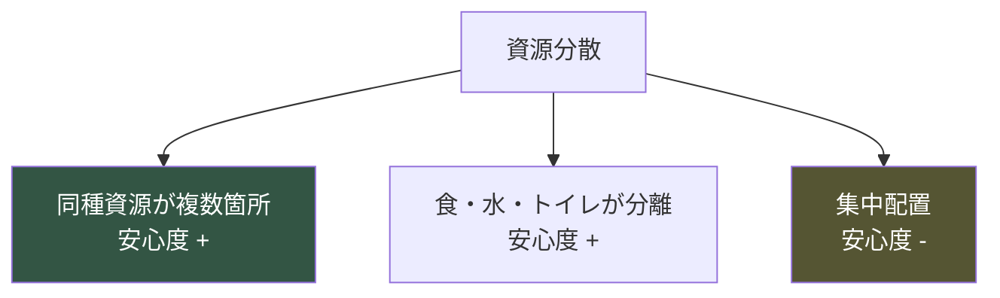

| 配置 | 効果 |
|---|---|
| 隠れ場所が複数 | + |
| 食事と水が離れている | + |
| 食事とトイレが離れている | + |
| すべてが一箇所に集中 | − |
| トイレが食事の近く | −− |

## 3.5 環境パラメータ関係図

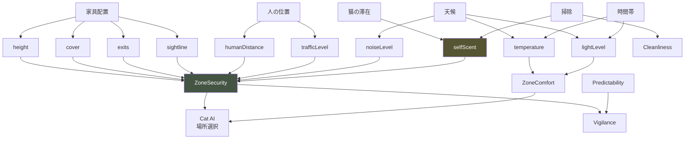

## 3.6 ⚠️ 掃除の両面性（04 §4.3 / MU-20）

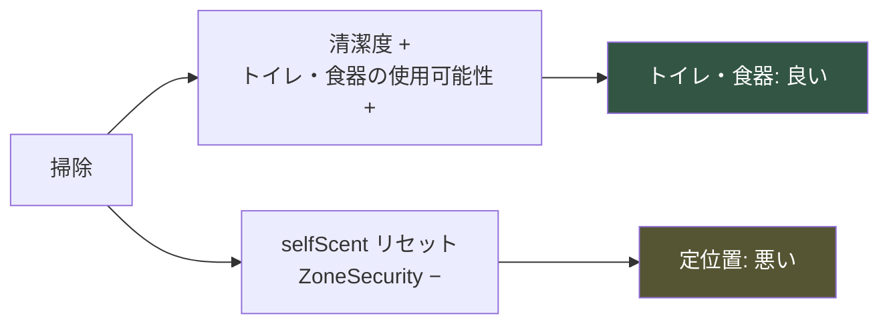

| 掃除の対象 | 清潔度への効果 | 自己臭への効果 | 総合 |
|---|---|---|---|
| トイレ | 大きくプラス | 影響小 | **良い** |
| 食器・水 | プラス | 影響小 | **良い** |
| 猫の定位置 | 小 | **リセット（悪い）** | **悪い** |
| 爪とぎ | 小 | リセット（悪い） | 悪い |
| 床全体 | 小 | 部分リセット | 中立〜やや悪い |

**⚠️ この両面性が、MU-20「掃除すればするほど良い」の反証装置である**（07 §7.6）。

## 3.7 環境変化そのものの影響（04 §4.8）

```
どんな変更も、変更それ自体がストレス要因である。

EnvironmentChangeImpact = changeMagnitude × noveltyFactor × (1 + StressLoad)

即時: Vigilance +Δ
短期: 該当 Zone の一時回避（1〜2 Segment）
中期: 慣れれば本来の効果（翌日以降、3日で定着）
```

**⚠️ 複数 Zone を同時に変更すると、再学習が並行して混乱が長期化する**（05 §5.3）。

## 3.8 実装時の注意点

```
⚠️ 全パラメータを L2 内部値に保つ（憲章 I-1）
⚠️ ZoneSecurity の重みを個体プロファイルで変動させる
⚠️ 到達性を資源の使用判定に含める
⚠️ 掃除の両面性を必ず実装する
⚠️ 環境変化の遅延効果（3日）を守る
⚠️ 同時変更のペナルティを実装する
⚠️ パラメータの評価結果をプレイヤーに開示しない
```

---

# ④ Furniture System

> **目的**: 家具・用品のカテゴリ体系を確定する。個別家具は設計しない。
> **設計理由**: 家具に効果値を持たせないという原則（AA-65）を、カテゴリ設計のレベルで担保する。家具は「効果」ではなく「Zone 属性への物理的寄与」として定義する。
> **プレイヤー体験への影響**: 「良い家具を買う」のではなく「この子に合う環境を作る」体験。
> **他システムとの依存関係**: S-09 Furniture、08 ④ Money Economy、③ パラメータ。
> **実装時の注意点**: カテゴリに「性能ランク」を持たせない。持つのは物理的事実のみ。

## 4.1 ⚠️ 家具の定義

> ### **家具は効果を持たない。Zone 属性への物理的寄与を持つ。**

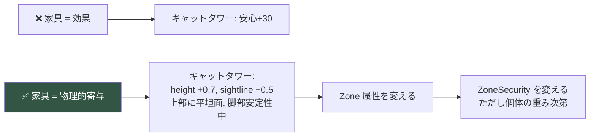

**⚠️ 同じ家具が、個体によって「良い」にも「無意味」にもなる。**

## 4.2 家具カテゴリ図

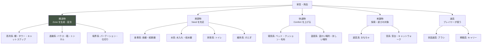

## 4.3 カテゴリ別の定義

### 構造物（Structural）— Zone を生成・変形する

| サブカテゴリ | 役割 | 寄与する属性 | 設置条件 |
|---|---|---|---|
| **高所系** | 高所型 Zone を生成 | height↑ sightline↑ | 床面積・安定性 |
| **退避系** | 退避型 Zone を生成 | cover↑ exits（形状次第） | 設置スペース |
| **境界系** | 動線・視線を変える | trafficLevel 変化 sightline 変化 | 配置の自由度 |

**⚠️ 退避系は exits に注意。** 出入口が1つの箱は行き止まりになる（LL-1 の核心）。

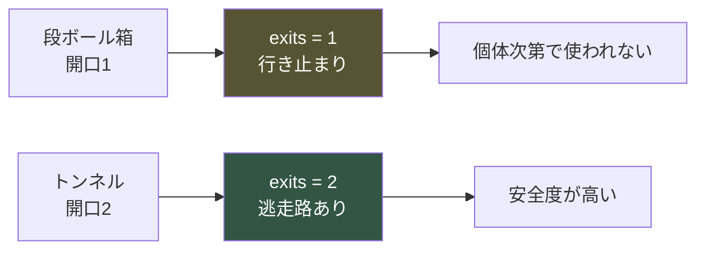

### 資源物（Resource）— Need を充足する

| サブカテゴリ | 充足 Need | 属性 | 特記 |
|---|---|---|---|
| **食事系** | N-02 空腹 | 位置・素材・高さ | 消耗品を要する |
| **水系** | N-03 渇き | 位置・食器からの距離 | 消耗品を要する |
| **排泄系** | N-04 排泄 | 位置・清潔度・逃走路・数 | 清潔度が使用可否を決める |
| **維持系** | N-08 爪とぎ | 素材・向き（水平/垂直）・位置 | マーキング機能 |

**⚠️ 資源物は「置けば使われる」ではない。** 位置・到達性・清潔度が使用を左右する。

### 快適物（Comfort）— Comfort を上げる

| サブカテゴリ | 効果 | 属性 |
|---|---|---|
| **寝具系** | ZoneComfort↑ | softness・保温性・洗濯可否 |
| **温度系** | temperature 調整 | 暖かさ・涼しさ |

### 刺激物（Stimulus）— 探索・遊びの対象

| サブカテゴリ | 効果 | 特記 |
|---|---|---|
| **遊具系** | N-11 遊び充足 | 個体の遊び傾向次第 |
| **窓系** | 外部刺激・見晴らし | 脱走関心の対象（⑧） |

### 道具（Tool）— プレイヤーが使う

| サブカテゴリ | 用途 | 特記 |
|---|---|---|
| **世話道具** | ブラッシング等 | 接触を伴う。個体次第で嫌悪 |
| **移動具** | キャリー | 初期の退避場所にもなる |

## 4.4 家具の Zone 属性への寄与（Z-04 の確定）

**家具は、設置された位置の Zone 属性を変更する。**

```
Zone.attribute += Σ furniture.contribution[attribute]

例：棚を Zone-05 に設置
  Zone-05.height    += 0.7
  Zone-05.sightline += 0.5
  → 新たに「棚の上」という生成 Zone が出現
```

| 家具カテゴリ | 主な寄与 |
|---|---|
| 高所系 | height, sightline を大きく上げる |
| 退避系 | cover を上げる、exits を規定 |
| 境界系 | trafficLevel, sightline を変える |
| 快適物 | softness, temperature を変える |
| 資源物 | その Zone を資源型にする |

**⚠️ 寄与は「物理的事実」であり、「良さ」ではない**（AA-65）。

## 4.5 相乗効果（Synergy）

**家具は組み合わせで意味を持つ。ただし「効果の加算」ではない。**

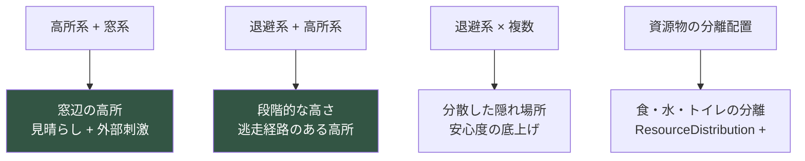

| 組み合わせ | 相乗効果 | 対応する学び |
|---|---|---|
| 高所 + 窓 | 見晴らしのよい休息地点 | 個体の選好次第 |
| 退避 + 高所 | 逃げ場のある高所 | LL-1 |
| 退避を複数分散 | 安心の底上げ | ResourceDistribution |
| 資源の分離 | 落ち着いた生活 | LL-2 |
| 段差の連続 | 高所への安全な経路 | 到達性 |

**⚠️ 相乗効果も個体差に支配される。** T-6 が低い個体には高所の相乗効果が効かない。

## 4.6 ⚠️ 無料の解法の保証（EB-05 の確定）

**08 §4.2 M-2「すべての課題に無料の解法がある」を、家具システムで担保する。**

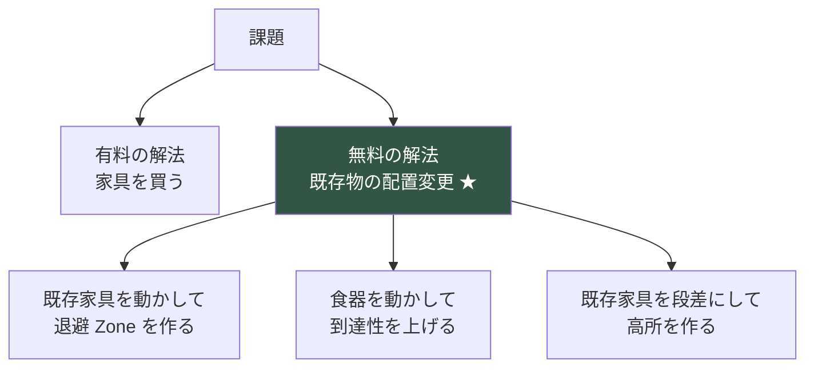

**設計要件**

```
□ 初期配置の家具だけで、最低限の Zone がすべて揃う
□ 既存家具の移動で、退避・高所・資源の Zone を作れる
□ 購入は「選択肢を増やす」だけで、「必須」ではない
□ どの個体でも、無料の解法で30日を完遂できる
```

**⚠️ 初期家具の構成が、無料の解法を成立させる鍵である。**
初期家具は「動かせば使える」素材として設計する（Content Bible への必達要件）。

## 4.7 家具の状態

| 状態 | 内容 | 変化 |
|---|---|---|
| 配置 | どの Zone にあるか | プレイヤーが移動 |
| 向き | 開口の方向・水平/垂直 | プレイヤーが調整 |
| 清潔度 | 汚れの蓄積 | 使用で低下・掃除で回復 |
| 自己臭 | 猫のマーキング | 滞在で蓄積・掃除で消失 |

**⚠️ 家具に「耐久度」「レベル」を持たせない**（AA-65 / 憲章 I-3）。

## 4.8 実装時の注意点

```
⚠️ 家具に効果値・ランク・レアリティ・耐久度を持たせない
⚠️ 家具は Zone 属性への物理的寄与のみを持つ
⚠️ 退避系の exits を必ず持たせる（行き止まりを表現）
⚠️ 相乗効果を「加算」でなく「Zone の質の変化」で実装
⚠️ 初期家具だけで最低限の Zone が揃う
⚠️ 無料の解法（配置変更）を全課題に用意する
⚠️ 相乗効果も個体差に支配させる
```

---

# ⑤ Environmental Interaction

> **目的**: 猫が環境をどう利用するかを設計する。
> **設計理由**: 環境は「置かれる」だけでは意味を持たない。猫が「使う」ことで初めて観察対象になる。使い方の設計が、環境と Cat AI の接続点である。
> **プレイヤー体験への影響**: 環境が「生きている」感覚。
> **他システムとの依存関係**: 05 ⑥ Behavior、④ Furniture、⑦ Feedback。
> **実装時の注意点**: 使い方を家具側に固定しない。猫が用途を決める。

## 5.1 猫と環境の相互作用図

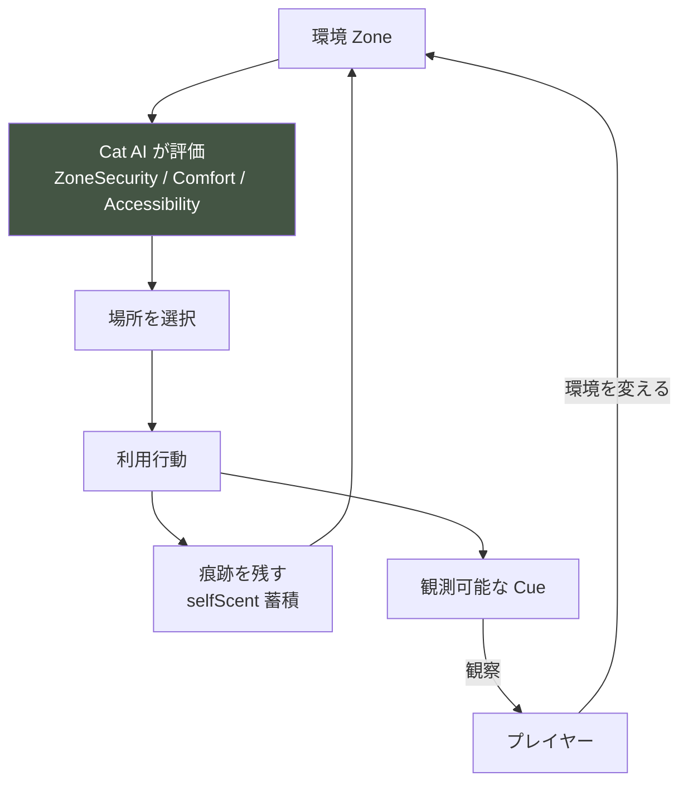

## 5.2 環境利用の4様式

| 様式 | 内容 | 対応行動（05 ⑥） |
|---|---|---|
| **選ぶ** | どの Zone にいるか | 場所選択 |
| **使う** | 資源・家具を機能的に使う | 摂食・排泄・爪とぎ・睡眠 |
| **避ける** | 特定 Zone を通らない・使わない | 迂回・回避 |
| **馴染む** | 自己臭をつけ、縄張り化する | マーキング（05 ③3.5） |

## 5.3 「使い方」は猫が決める

**同じ家具が、個体・状況で異なる使われ方をする。**

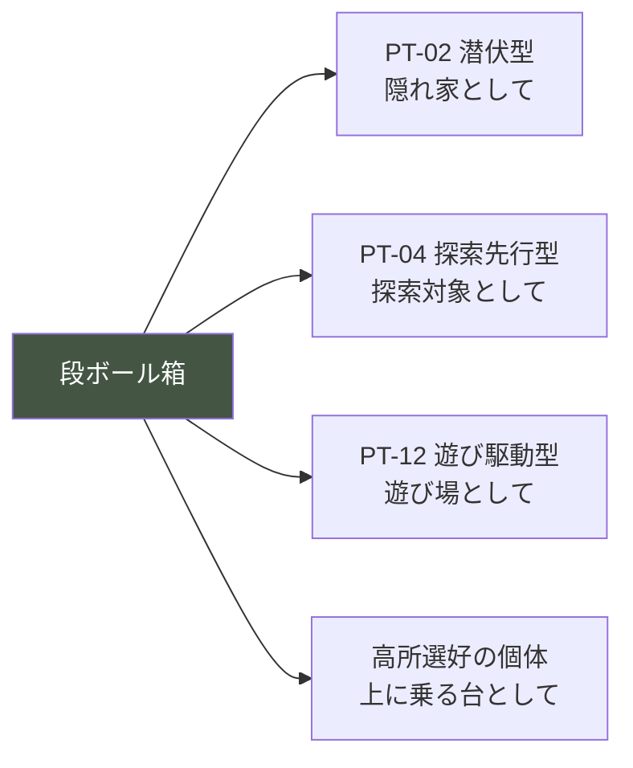

**⚠️ 家具に「用途」を固定しない。** Cat AI が Zone 属性と個体選好から使い方を決める。

## 5.4 お気に入りの場所（Favorite Spot）

**特定 Zone への選好が、時間とともに形成される。**

```
FavoriteScore(z) = ZoneSecurity(z) × visitFrequency(z) × selfScent(z)

最も高い Zone が「お気に入り」として観測される。
```

| 段階 | 観測される |
|---|---|
| Day 1-5 | 定位置なし（探している） |
| Day 6-15 | 特定 Zone の使用が増える |
| Day 16-30 | 明確なお気に入りが形成される |

**⚠️ お気に入りの形成が、進行の可視化になる**（08 ⑤）。

**⚠️ お気に入りを掃除すると、selfScent がリセットされ、一時的に使われなくなる**（MU-20）。

## 5.5 危険回避

**猫は危険地帯（負の連合を持つ Zone）を避ける。**

```
避ける Zone の条件：
  □ 過去に驚愕体験があった（05 §5.3 spatialMemory.valence 低下）
  □ trafficLevel が高い
  □ noiseLevel が高い
  □ exits が少ない
```

**⚠️ 一度の嫌悪体験で回避が形成され、消えるのに時間がかかる**（05 §5.5）。
プレイヤーが「なぜあの場所を使わないのか」を推理する材料になる。

## 5.6 探索

**新しい環境要素への段階的接近（05 ③3.6）。**


**⚠️ この段階が「環境変更の効果は3日後」の実体である**（04 §4.8）。

## 5.7 移動パターン

**猫の移動は、Zone 間の経路選択である。**

| パターン | 条件 | 観測 |
|---|---|---|
| 直線移動 | 低警戒 | 「まっすぐ歩く」 |
| 縁伝い | 中警戒 | 「壁沿いに移動」 |
| 迂回 | 危険地帯の記憶 | 「遠回りする」 |
| 経路の途絶 | 到達不能 | 「行こうとして戻る」 |

**⚠️ 移動パターンが、Zone の安全度の観測窓になる。**
「なぜあの経路を通らないのか」が推理対象。

## 5.8 実装時の注意点

```
⚠️ 家具の用途を固定しない。Cat AI が決める
⚠️ お気に入りの形成を時間の関数にする
⚠️ 危険地帯の回避を負の連合で実装
⚠️ 新規物への4段階接近を守る
⚠️ 移動パターンを Zone 属性から導出する
⚠️ 利用行動が必ず観測可能な Cue を生む（SR-1）
```

---

# ⑥ Environment Progression

> **目的**: 30日を通じた環境の変化と、プレイヤーの選択肢の広がりを設計する。
> **設計理由**: 08 ①1.2 で「選択肢は増えない」と定めた。環境の進行は、選択肢の増加ではなく「理解に基づく環境の洗練」でなければならない。
> **プレイヤー体験への影響**: 部屋が「この子のための部屋」になっていく実感。
> **他システムとの依存関係**: 08 ⑤ Progression Curve、06 Knowledge。
> **実装時の注意点**: 環境の「完成度」を数値・進捗で示さない。

## 6.1 ⚠️ 環境進行の原則

> ### **広がるのは選択肢ではなく、環境を読む解像度である。**

```mermaid
graph LR
    A["Day 1<br/>できること: 配置変更・購入・掃除"] --> B["Day 30<br/>できること: 同じ"]
    A --> C["Day 1<br/>何をすべきか: わからない"]
    B --> D["Day 30<br/>何をすべきか: この子に合わせられる"]

    style D fill:#484,color:#fff
```

**⚠️ 家具の「解放」はない**（08 §1.2）。Day 1 から全カテゴリが購入可能（予算の範囲で）。

## 6.2 環境の段階的洗練

| Day 帯 | プレイヤーの環境理解 | 環境の状態 |
|---|---|---|
| **1-5** | 自分の好みで配置 | 一般的な「良さそうな」配置 |
| **6-12** | 猫の反応から学ぶ | 使われる物・使われない物が判明 |
| **13-20** | 単純な改善が裏目に | 過剰な変更で混乱 |
| **21-27** | この子の視点で見る | この個体に適合した配置 |
| **28-30** | 完成に近づく | この子のための部屋 |

## 6.3 環境進行の3つの局面

```mermaid
graph TB
    subgraph P1["局面1: 探索的配置 Day 1-12"]
        A1["一般論で配置"]
        A2["何が使われるか観察"]
    end
    subgraph P2["局面2: 過剰と反省 Day 13-20"]
        B1["もっと良くしようと変更"]
        B2["変更自体がストレスと気づく"]
    end
    subgraph P3["局面3: 適合 Day 21-30"]
        C1["この子の選好を理解"]
        C2["最小限の的確な調整"]
    end

    P1 --> P2 --> P3

    style P3 fill:#354,color:#fff
```

**⚠️ 局面2（過剰と反省）が Player Flow Phase ④ と一致する。**
「良かれと思った環境改善が裏目に出る」体験（MU-18 / MU-21）。

## 6.4 環境が「完成」に向かう指標（非表示）

**プレイヤーには見せないが、内部で環境の適合度が上がる。**

| 指標 | Day 1 | Day 30 |
|---|---|---|
| 使われる Zone の割合 | 低 | 高 |
| お気に入りの形成 | なし | 明確 |
| 回避される Zone | 多い | 少ない |
| 資源の到達性 | ばらつき | 最適化 |
| territory の広がり | 極小 | 部屋の大半 |

**⚠️ これらは「猫の行動」として観測される。数値表示しない**（憲章 I-1 / ⑦）。

## 6.5 環境進行と経済の関係

```mermaid
graph LR
    A["Day 1-12<br/>試行的に購入"] --> B["予算が減る"]
    B --> C["Day 13-20<br/>買っても解決しないと気づく"]
    C --> D["Day 21-30<br/>無料の解法（配置変更）に回帰 ★"]

    style D fill:#484,color:#fff
```

**⚠️ 「買えば良くなる」から「配置と振る舞いで整える」への移行が、環境進行の本質である**（08 §4.2）。
これが MU-18 の反証の経済的側面。

## 6.6 実装時の注意点

```
⚠️ 家具の解放を作らない（Day 1 から全カテゴリ購入可）
⚠️ 環境の完成度を数値・進捗で示さない
⚠️ 局面2（過剰と反省）を Day 13-20 に配置
⚠️ 環境の適合度上昇を猫の行動で表現
⚠️ 「買えば解決」から「配置で整える」への移行を設計
```

---

# ⑦ Environmental Feedback

> **目的**: 環境改善の結果を、数値ではなく猫の行動で伝える設計を確定する。
> **設計理由**: 憲章 I-1 により環境の評価を数値表示できない。フィードバックは「猫がどう使ったか」でのみ与えられる。この写像を精密に設計しなければ、プレイヤーは環境変更の効果を読めない。
> **プレイヤー体験への影響**: 環境変更が「届いた」実感の有無。
> **他システムとの依存関係**: 05 ⑩ Observation Mapping、06 Knowledge、⑤ Interaction。
> **実装時の注意点**: フィードバックを演出で強調しない。行動として静かに現れる。

## 7.1 フィードバックの原則

> ### **環境改善の結果は、猫が「使う／使わない」でのみ伝わる。**

```mermaid
graph LR
    A["環境を変える"] --> B["即時: 警戒<br/>どんな変更も一度は驚く"]
    B --> C["1-2日: 様子見<br/>遠巻きに観察"]
    C --> D["3日: 判定<br/>使う or 使わない ★"]

    D --> E["使う → 届いた"]
    D --> F["使わない → 合わなかった"]

    style D fill:#454,color:#fff
```

**⚠️ フィードバックは遅延する（3日）。** 即座に結果が出ないことが、Pillar 4 と M1（未完了の問い）を成立させる。

## 7.2 フィードバックの5チャンネル

| チャンネル | 伝えるもの | 観測 |
|---|---|---|
| **居場所** | Zone の適合度 | どこにいるか・いないか |
| **使用行動** | 資源・家具の適合 | 使うか・使わないか |
| **滞在時間** | 快適度 | どれくらいいるか |
| **行動の質** | 全体の安心 | 探索・遊びの有無 |
| **痕跡** | 不在時の利用 | selfScent・使用痕 |

## 7.3 環境改善の成功の伝わり方

**「良い環境になった」を、以下の行動で伝える。**

```mermaid
graph TB
    A["環境が適合した"] --> B["使われる Zone が増える"]
    A --> C["お気に入りが形成される"]
    A --> D["探索・遊びが出現する ★"]
    A --> E["行動範囲が広がる"]
    A --> F["隠れる時間が減る"]

    D --> G["最強の成功指標<br/>04 §2.3"]

    style G fill:#484,color:#fff
```

**⚠️ 探索・遊びの出現が、環境成功の最良の指標である。**
これらは安全でなければ発現しない（04 §2.3 層4ゲート）。

## 7.4 環境の不適合の伝わり方

```mermaid
graph TB
    A["環境が合わない"] --> B["置いた物が使われない"]
    A --> C["特定 Zone が避けられる"]
    A --> D["隠れる時間が増える"]
    A --> E["食事時刻が後退する"]
    A --> F["行動範囲が狭まる"]

    style A fill:#553,color:#fff
```

**⚠️ 不適合を「×」「失敗」で示さない**（07 ⑧8.7）。使われない、という事実のみ。

## 7.5 フィードバックの読み取り難度

| 難度 | フィードバック | 例 |
|---|---|---|
| **易** | 明確な使用/不使用 | 「箱に入った」「タワーに乗らない」 |
| **中** | 滞在時間の変化 | 「前より長くいる」 |
| **難** | 行動の質の変化 | 「遊ぶようになった」 |
| **最難** | 不在時の痕跡 | 「夜、あの場所を使ったらしい」 |

**⚠️ 読み取り難度が、観察技能の熟達（06 ③）と対応する。**

## 7.6 ⚠️ フィードバックしてはならない方法

```
❌ 「環境が改善されました」の通知
❌ 快適度ゲージの上昇
❌ 「+10」などの数値
❌ 猫の感情アイコン（ハート等）
❌ 効果音・演出での祝福
❌ 「正しい配置です」の表示
❌ 星評価・ランク
```

**⚠️ すべて憲章 I-1 / AP-70 / AA-66 に違反する。**

## 7.7 フィードバックの遅延と間

```mermaid
sequenceDiagram
    participant P as プレイヤー
    participant E as 環境
    participant C as 猫

    P->>E: 隠れ場所を設置
    E->>C: 新規物体
    C->>P: 即時: 警戒（観測される）
    Note over P: 「驚かせちゃったかな」
    Note over P,C: 【1日の壁】
    C->>P: 翌日: 遠くから見る
    Note over P: 「気になってはいるみたい」
    Note over P,C: 【1日の壁】
    C->>P: 翌々日: 近づいて嗅ぐ
    Note over P,C: 【1日の壁】
    C->>P: 3日目: 使い始める ★
    Note over P: 「使ってくれた」
```

**⚠️ この遅延が、環境改善を「対話」にする。** 即座の反応は「操作」になる。

## 7.8 実装時の注意点

```
⚠️ フィードバックを数値・ゲージで与えない
⚠️ フィードバックを演出で祝わない（AP-70）
⚠️ 成功は「探索・遊びの出現」で伝える
⚠️ 不適合は「使われない」事実のみで伝える
⚠️ フィードバックを3日遅延させる
⚠️ 読み取り難度を観察技能に対応させる
⚠️ 「正しい配置」を示さない（AA-66）
```

---

# ⑧ Hazard System

> **目的**: 危険要素を、脅威ではなく学習として設計する。
> **設計理由**: 危険の知識は現実で最も重要である。しかし憲章§9.4 は死・重篤な事象を脅威として使うことを禁じる。「危険を発生させずに、危険を学ばせる」設計が必要。
> **プレイヤー体験への影響**: 恐怖ではなく、注意深さ。
> **他システムとの依存関係**: 05 ⑧ Environment Reaction、07 付録A（除外カテゴリ）、Reality Bridge。
> **実装時の注意点**: ハザードを実際に発生させない。関心と観測可能性のみ。

## 8.1 ⚠️ ハザードの基本方針

> ### **危険は「起きること」ではなく「気づくこと」として設計する。**

```mermaid
graph LR
    A["❌ 危険が起きる"] --> A1["誤飲 → 病気 → ペナルティ"]
    B["✅ 危険に気づく"] --> B1["危険要素の存在が観測可能<br/>猫の関心が観測可能<br/>対処すると変化が観測可能"]

    A1 --> C["恐怖による行動誘導<br/>憲章 I-10 / §9.4 違反"]
    B1 --> D["注意深さの獲得<br/>Reality Bridge へ"]

    style B fill:#354,color:#fff
    style C fill:#844,color:#fff
```

## 8.2 ハザードの分類

| 分類 | 例 | ゲーム内での扱い | 現実の情報 |
|---|---|---|---|
| **誤飲リスク** | 小物・紐・ゴム | 猫の関心を観測可能に | Reality Bridge |
| **脱走リスク** | 窓・扉の開放 | 関心を観測可能に（05 ⑧8.3） | Reality Bridge |
| **転落リスク** | 高所・不安定な足場 | 家具の安定性として表現 | Reality Bridge |
| **有害植物** | 特定の植物 | 猫の忌避 or 関心を観測 | Reality Bridge |
| **コード類** | 電気コード | 猫の関心を観測可能に | Reality Bridge |
| **騒音** | 過度な音 | StressLoad への作用（既存） | — |
| **ストレス源** | 過干渉・頻繁な変更 | 悪循環（既存） | — |

## 8.3 ハザードの3層設計

```mermaid
graph TB
    L1["層1: 存在<br/>危険要素が部屋にある"]
    L2["層2: 関心<br/>猫がそれに近づく・興味を示す"]
    L3["層3: 対処<br/>プレイヤーが片付ける・対策する"]

    L1 --> L2 --> L3
    L3 --> L4["変化: 猫の関心が消える<br/>観測可能"]

    style L4 fill:#354,color:#fff
```

| 層 | 内容 | 観測 |
|---|---|---|
| **層1 存在** | 危険要素が Zone に存在する | プレイヤーが見れば気づける |
| **層2 関心** | 猫が近づく・嗅ぐ・触ろうとする | CB-057〜060 として観測 |
| **層3 対処** | プレイヤーが片付ける | 行動枠を消費 |
| **変化** | 対処後、猫の関心が消える | 観測可能 |

## 8.4 ⚠️ ハザードが「発生」しない設計

**危険な結果（誤飲・転落・脱走）は、実際には起きない。**

| ❌ 実装しない | ✅ 実装する |
|---|---|
| 誤飲による病気 | 猫が小物に興味を示す様子 |
| 転落による負傷 | 不安定な足場を避ける/使う様子 |
| 実際の脱走 | 窓・扉への関心（CB-063） |
| 中毒 | 有害植物への忌避/関心 |
| ハザードによるゲームオーバー | 対処すると関心が消える変化 |

**根拠**

```
憲章§9.4：死・重篤な疾病を脅威として使わない
憲章 I-10：恐怖による行動誘導をしない
05 ⑧8.3：脱走は発生させない

しかし：
06 §7.4：MU-29（トイレ我慢）MU-31（脱走）等は最有害な誤解
   → 知識としては極めて重要

結論：起こさないが、気づけるようにする。
```

## 8.5 ハザードの気づかせ方

```mermaid
graph LR
    A["危険要素を配置<br/>※ゲーム開始時に存在しうる"] --> B["猫が関心を示す"]
    B --> C["プレイヤーが観察"]
    C --> D{"気づくか"}
    D -->|"気づく"| E["片付ける → 関心が消える"]
    D -->|"気づかない"| F["関心が続く<br/>※事故は起きない"]
    F --> G["別の機会に再び関心"]

    style E fill:#354,color:#fff
```

**⚠️ 気づかなくても事故は起きない。** ただし「猫が何かを気にしている」という観察対象が残り続ける。

**⚠️ 気づいて対処すると、猫の関心が消える。** これが「対処の効果」の観測になる。

## 8.6 ハザードと Reality Bridge

**ゲーム内で扱えない危険の知識は、ゲーム外で正確に伝える。**

| ゲーム内 | Reality Bridge（ゲーム外） |
|---|---|
| 猫が小物に興味を示す | 誤飲しやすい物のリスト・対策 |
| 窓への関心 | 脱走対策の具体的方法 |
| 高所への関心 | 転落防止・安全な高所の作り方 |
| 植物への忌避/関心 | 猫に有害な植物のリスト |
| トイレの我慢（既存） | 泌尿器疾患のリスク・受診の目安 |

**⚠️ ゲーム外では説明してよい**（06 ⑩10.5）。ただし押し付けない・中立に。

## 8.7 騒音・ストレス源（既存システムの再利用）

**騒音と過干渉は、新しいハザードではなく、既存システムで扱う。**

| ハザード | 既存システム |
|---|---|
| 騒音 | 04 §4.4 音の Vigilance への作用 |
| 過干渉 | 04 §5.6 悪循環 |
| 頻繁な環境変更 | 04 §4.8 環境変化の影響 |
| 不規則な生活 | 04 §3.6 予測可能性の低下 |

**⚠️ これらは「ハザード」として特別扱いせず、環境シミュレーションの一部として自然に作用する。**

## 8.8 実装時の注意点

```
⚠️ 危険な結果を発生させない（誤飲・転落・脱走・中毒）
⚠️ ハザードをゲームオーバー条件にしない
⚠️ ハザードを恐怖で表現しない（憲章 I-10）
⚠️ 気づかなくても事故が起きない設計にする
⚠️ 対処すると猫の関心が消える（観測可能な効果）
⚠️ 危険の知識は Reality Bridge で正確に扱う
⚠️ 騒音・過干渉は既存システムで処理する
```

---

# ⑨ Environment Data Model

> **目的**: 環境のデータ構造を確定し、実装の基盤を提供する。
> **設計理由**: データ構造が「何を表現できるか」を決める。効果値を持てない構造にすることで、AA-65 を型レベルで担保する。
> **プレイヤー体験への影響**: 間接的（表現可能な範囲が体験を規定）。
> **他システムとの依存関係**: 03 Architecture（S-07〜S-10）、D-01 Content Definition。
> **実装時の注意点**: FurnitureDefinition に効果値フィールドを作らない。

## 9.1 データモデル図

```mermaid
classDiagram
    class Room {
        +RoomId id
        +Area[] areas
        +Zone[] zones
        +ZonePath[] paths
        +RoomEnvironment environment
    }

    class Area {
        +AreaId id
        +AreaType type
        +ZoneId[] zones
    }

    class Zone {
        +ZoneId id
        +ZoneType type
        +ZoneOrigin origin
        +ZoneAttributes attributes
        +FurnitureId[] furniture
        +InteractionPoint[] points
        +float selfScent
    }

    class ZoneAttributes {
        +float height
        +float cover
        +int exits
        +float sightline
        +float humanDistance
        +float trafficLevel
        +float noiseLevel
        +float lightLevel
        +float temperature
    }

    class ZonePath {
        +ZoneId from
        +ZoneId to
        +float pathSafety
        +bool throughHumanZone
    }

    class FurnitureDefinition {
        +FurnitureId id
        +FurnitureCategory category
        +AttributeContribution[] contributions
        +PhysicalFact[] facts
        +PlacementConstraint constraints
        +bool consumesResource
    }

    class FurnitureInstance {
        +FurnitureId definition
        +ZoneId placedZone
        +Orientation orientation
        +float cleanliness
        +float selfScent
    }

    class AttributeContribution {
        +AttributeName attribute
        +float delta
    }

    class RoomEnvironment {
        +float predictability
        +float resourceDistribution
        +float stimulusLevel
        +float cleanliness
        +Weather weather
    }

    class InteractionPoint {
        +PointType type
        +NeedId servedNeed
        +float accessibility
    }

    class HazardMarker {
        +HazardType type
        +ZoneId location
        +bool attractsInterest
    }

    Room *-- Area
    Room *-- Zone
    Room *-- ZonePath
    Room *-- RoomEnvironment
    Zone *-- ZoneAttributes
    Zone *-- InteractionPoint
    Zone o-- FurnitureInstance
    FurnitureInstance --> FurnitureDefinition
    FurnitureDefinition *-- AttributeContribution
    Zone o-- HazardMarker

    note for FurnitureDefinition "効果値フィールドは存在しない\ncontributions は物理的寄与のみ\nAA-65"
    note for ZoneAttributes "selfScent は Zone 側に持つ\n個体の重みは Cat Profile 側"
```

## 9.2 主要な構造の説明

### Zone

```
Zone {
    id
    type          : refuge / rest / vantage / resource / open / boundary
    origin        : fixed / semiVariable / generated
    attributes    : ZoneAttributes（10属性、selfScent は別持ち）
    furniture[]   : 設置された家具
    points[]      : InteractionPoint
    selfScent     : 自己臭（可変）
}
```

**⚠️ Zone に ZoneSecurity / ZoneComfort を保存しない。**
これらは個体プロファイルに依存する導出値であり、Cat AI が計算時に導出する（AA-31 派生値の非保存）。

### FurnitureDefinition

```
FurnitureDefinition {
    id
    category           : structural / resource / comfort / stimulus / tool
    contributions[]    : { attribute, delta } ← 物理的寄与のみ
    facts[]            : 高さ120cm / 開口1 / 素材 など（表示用の事実）
    constraints        : 設置条件
    consumesResource   : 消耗品を要するか
}
```

**⚠️ 存在させないフィールド**

| 禁止フィールド | 理由 |
|---|---|
| `effect` / `bonus` | 効果値（AA-65） |
| `rank` / `rarity` / `tier` | ランク（S-10 禁止） |
| `securityBonus` | 「良さ」の直接指定 |
| `preferredBy` | 「この個体が好む」の固定（原則2） |
| `durability` / `level` | 耐久・成長（憲章 I-3） |
| `price`（効果との相関） | 価格＝良さ（MU-18） |

**⚠️ 価格は購入システム側に持つ。** 家具定義には持たせない（価格と効果の分離）。

### ZonePath

```
ZonePath {
    from, to
    pathSafety        : 経路上の最低 ZoneSecurity（導出）
    throughHumanZone  : 人の Zone を通るか
}
```

**⚠️ pathSafety が資源の到達性を決める**（LL-2 の空間的実装）。

### HazardMarker

```
HazardMarker {
    type              : ingestion / escape / fall / plant / cord
    location          : ZoneId
    attractsInterest  : 猫の関心を引くか
    // ⚠️ damage / severity フィールドは存在しない
}
```

**⚠️ ハザードにダメージ・深刻度を持たせない**（⑧8.4）。

## 9.3 データの可変性

| データ | 可変 | 変更主体 |
|---|---|---|
| Zone.attributes | ✅ | 家具の設置・環境変化 |
| Zone.selfScent | ✅ | 猫の滞在・掃除 |
| FurnitureInstance.placedZone | ✅ | プレイヤーの移動 |
| FurnitureInstance.cleanliness | ✅ | 使用・掃除 |
| RoomEnvironment.* | ✅ | 天候・時間・掃除 |
| FurnitureDefinition | ❌ | 不変（定義） |
| Zone.origin（fixed の場合） | ❌ | 不変 |

## 9.4 セーブ対象（Architecture §9.2）

| データ | 保存 | 理由 |
|---|---|---|
| Zone.attributes（可変分） | ✅ | 環境の状態 |
| Zone.selfScent | ✅ | 縄張りの状態 |
| FurnitureInstance | ✅ | 配置の状態 |
| RoomEnvironment | ✅ | 部屋の状態 |
| ZoneSecurity/Comfort | ❌ | 派生値（再計算） |
| FurnitureDefinition | ❌ | Content から再読込 |

## 9.5 実装時の注意点

```
⚠️ FurnitureDefinition に効果値・ランク・耐久を持たせない
⚠️ 価格を家具定義から分離する
⚠️ ZoneSecurity/Comfort を保存しない（導出値）
⚠️ HazardMarker にダメージを持たせない
⚠️ selfScent を Zone 側に、個体の重みを Profile 側に持つ
⚠️ pathSafety を経路の到達性判定に使う
⚠️ スキーマ検証で禁止フィールドの不在を確認する
```

---

# ⑩ Anti Environment Design

> **目的**: 導入してはならない環境設計を網羅列挙する。
> **設計理由**: 環境設計は「良い部屋の正解」を作りたくなる誘惑が最も強い領域である。事前列挙で防ぐ。
> **プレイヤー体験への影響**: （遵守により）個体差と試行錯誤の保持。
> **他システムとの依存関係**: 08 ⑫ AN、Experience Bible ⑫ AP の環境領域拡張。
> **実装時の注意点**: 🔴 は議論せず却下。

## 凡例

```
🔴 憲章・Pillar 違反に直結  🟠 環境設計の破壊  🟡 品質の低下
```

---

## A. 効果値・数値（AV-01〜AV-14）

| # | アンチパターン | 度 | 理由 |
|---|---|---|---|
| AV-01 | 家具が能力値を直接上げる | 🔴 | AA-65 / 憲章 I-3 |
| AV-02 | 家具に「安心+N」の効果値 | 🔴 | 憲章 I-1 |
| AV-03 | 部屋に「快適度スコア」 | 🔴 | AA-66 |
| AV-04 | Zone に「安全度ゲージ」を表示 | 🔴 | 憲章 I-1 |
| AV-05 | 環境の「完成度%」表示 | 🔴 | AP-27 |
| AV-06 | 家具にランク・レアリティ | 🔴 | S-10 禁止 |
| AV-07 | 家具に耐久度・レベル | 🔴 | 憲章 I-3 |
| AV-08 | 家具の「効果説明文」 | 🔴 | Pillar 3。用途ではなく事実を |
| AV-09 | 環境改善の「+10」表示 | 🔴 | 憲章 I-1 |
| AV-10 | 部屋の星評価 | 🔴 | 憲章 I-4 の精神 |
| AV-11 | 猫の快適度を数値で表示 | 🔴 | 憲章 I-1 |
| AV-12 | Zone の適合度を可視化 | 🔴 | 同上 |
| AV-13 | 家具の「おすすめ度」 | 🔴 | AP-31 |
| AV-14 | 導出値（Security等）を保存・表示 | 🔴 | AA-31 / 憲章 I-1 |

## B. 万能・最適解（AV-15〜AV-28）

| # | アンチパターン | 度 | 理由 |
|---|---|---|---|
| AV-15 | 万能家具（すべての個体に効く） | 🔴 | 原則2 / SR-5 |
| AV-16 | 最適解が1つしかない部屋 | 🔴 | 原則3 / BP-1 |
| AV-17 | 高価な家具ほど正解 | 🔴 | MU-18 / AN-31 |
| AV-18 | 「正しい配置」が存在する | 🔴 | 原則3 / AA-66 |
| AV-19 | 配置のチュートリアル | 🔴 | AP-29 |
| AV-20 | 「おすすめレイアウト」提示 | 🔴 | AP-31 |
| AV-21 | 全個体で同じ配置が最適 | 🔴 | 原則2 |
| AV-22 | 家具に固定の「好む個体」 | 🟠 | 原則2。選好は連続的 |
| AV-23 | 「この家具を置けば解決」 | 🔴 | 「置けば効果」の否定（§1.3） |
| AV-24 | 無料の解法が存在しない課題 | 🔴 | 08 §4.2 / EB-05 |
| AV-25 | 購入必須の環境要素 | 🔴 | 同上 |
| AV-26 | 攻略可能な配置パターン | 🟠 | MU-36 |
| AV-27 | 「完璧な部屋」の達成 | 🔴 | 原則4。完成しない |
| AV-28 | 相乗効果の数値加算 | 🟠 | AA-65。質の変化であるべき |

## C. 背景化・演出（AV-29〜AV-38）

| # | アンチパターン | 度 | 理由 |
|---|---|---|---|
| AV-29 | 部屋を背景アセットとして扱う | 🟠 | §1.3 |
| AV-30 | 家具を装飾として扱う | 🟠 | 同上 |
| AV-31 | 配置に意味のない家具 | 🟡 | ノイズ |
| AV-32 | 環境変更を演出で祝う | 🔴 | AP-70 |
| AV-33 | 「良い部屋になりました」通知 | 🔴 | 憲章 I-1 |
| AV-34 | パーティクル・光で成功を示す | 🔴 | AP-74 |
| AV-35 | 環境改善のファンファーレ | 🔴 | AP-67 |
| AV-36 | 猫の感情アイコンで満足を表示 | 🔴 | AP-36 |
| AV-37 | 「模様替え」を娯楽化する | 🟠 | 自己表現でなく配慮（Experience Bible SF-2） |
| AV-38 | インテリアの美しさを評価する | 🟠 | この子のための部屋であるべき |

## D. 即時性・フィードバック（AV-39〜AV-48）

| # | アンチパターン | 度 | 理由 |
|---|---|---|---|
| AV-39 | 環境変更が即座に効果を出す | 🔴 | §7.1。操作になる |
| AV-40 | 置いた瞬間に猫が使う | 🔴 | 05 §5.6。段階を飛ばす |
| AV-41 | 環境の効果を即時通知 | 🔴 | 憲章 I-1 |
| AV-42 | フィードバックを数値で返す | 🔴 | 憲章 I-1 |
| AV-43 | 「配置成功」の表示 | 🔴 | AA-66 |
| AV-44 | 不適合を「×」で示す | 🔴 | 07 ⑧8.7 |
| AV-45 | 環境変更の効果予測を表示 | 🔴 | Pillar 2 |
| AV-46 | 「この配置なら猫が喜びます」 | 🔴 | 内心の断定（原則4） |
| AV-47 | 変更前後の比較スコア | 🔴 | 憲章 I-1 |
| AV-48 | 環境変化のストレスを実装しない | 🟠 | 04 §4.8。即時改善は非現実的 |

## E. 掃除・清潔（AV-49〜AV-56）

| # | アンチパターン | 度 | 理由 |
|---|---|---|---|
| AV-49 | 掃除すればするほど良い | 🔴 | MU-20 |
| AV-50 | 掃除の両面性を実装しない | 🔴 | §3.6 |
| AV-51 | 自己臭リセットの影響を実装しない | 🟠 | 05 §5.3 |
| AV-52 | 清潔度を数値で表示 | 🔴 | 憲章 I-1 |
| AV-53 | 「清潔度100%」の達成目標 | 🔴 | AP-27 |
| AV-54 | 掃除を怠るとゲームオーバー | 🔴 | 憲章 I-4 |
| AV-55 | トイレ掃除の効果を実装しない | 🟠 | §3.6。トイレは明確に良い |
| AV-56 | すべての掃除を一律に扱う | 🟠 | 対象で効果が違う |

## F. 空間構造（AV-57〜AV-66）

| # | アンチパターン | 度 | 理由 |
|---|---|---|---|
| AV-57 | 逃走路のない隠れ場所を安全とする | 🔴 | LL-1 / 04 §4.3 |
| AV-58 | exits を実装しない | 🔴 | 同上 |
| AV-59 | 複数の部屋・広い家にする | 🟠 | §2.2。観察の拡散 |
| AV-60 | Zone を固定にする（生成不可） | 🟠 | §2.6。環境改善が成立しない |
| AV-61 | 経路を実装しない | 🟠 | 到達性が表現できない |
| AV-62 | 人の動線が資源に影響しない | 🟠 | 04 §4.6 / LL-2 |
| AV-63 | 初期状態で詰む部屋 | 🔴 | BP-6 |
| AV-64 | 資源の分散・分離を実装しない | 🟠 | 04 §4.7 |
| AV-65 | Zone 数が多すぎる（20超） | 🟡 | 観察の拡散 |
| AV-66 | Area と Zone を混同する | 🟡 | §2.1。認知単位の誤り |

## G. 家具・利用（AV-67〜AV-78）

| # | アンチパターン | 度 | 理由 |
|---|---|---|---|
| AV-67 | 家具の用途を固定する | 🟠 | 05 §5.3。猫が決める |
| AV-68 | すべての家具が必ず使われる | 🔴 | 原則2。個体差 |
| AV-69 | 使われない家具を作らない | 🟠 | 反証の材料が消える |
| AV-70 | お気に入りの形成を実装しない | 🟠 | §5.4。進行の可視化 |
| AV-71 | 危険地帯の回避を実装しない | 🟠 | 05 §5.5 |
| AV-72 | 新規物への段階的接近を飛ばす | 🔴 | 05 §5.6 |
| AV-73 | 家具に消耗の概念を混ぜる | 🟡 | 憲章 I-3 |
| AV-74 | 資源物が位置に依存しない | 🟠 | LL-2。到達性 |
| AV-75 | トイレの数・位置が影響しない | 🟠 | 04 §2.3 |
| AV-76 | 食器と水の距離が影響しない | 🟠 | 04 §2.3 |
| AV-77 | 相乗効果を個体差に依存させない | 🟠 | 原則2 |
| AV-78 | 家具の物理的事実を持たせない | 🟠 | 観察・判断の材料 |

## H. ハザード（AV-79〜AV-90）

| # | アンチパターン | 度 | 理由 |
|---|---|---|---|
| AV-79 | 誤飲を実際に発生させる | 🔴 | 憲章§9.4 |
| AV-80 | 転落で負傷させる | 🔴 | 同上 |
| AV-81 | 実際の脱走を起こす | 🔴 | 05 ⑧8.3 |
| AV-82 | 中毒を発生させる | 🔴 | 憲章§9.4 |
| AV-83 | ハザードをゲームオーバー条件にする | 🔴 | 憲章 I-4 |
| AV-84 | 危険を恐怖で表現する | 🔴 | 憲章 I-10 |
| AV-85 | ハザードにダメージ値を持たせる | 🔴 | ⑧8.4 |
| AV-86 | 気づかないと事故が起きる | 🔴 | ⑧8.5 |
| AV-87 | 危険の知識を Reality Bridge で扱わない | 🟠 | ⑧8.6。教育機会の損失 |
| AV-88 | ハザードで罪悪感を誘発する | 🔴 | 憲章 I-10 |
| AV-89 | 対処しても変化が観測できない | 🟠 | SR-1 |
| AV-90 | 騒音・過干渉を特別なハザードにする | 🟡 | ⑧8.7。既存システムで処理 |

## I. 進行・経済（AV-91〜AV-100）

| # | アンチパターン | 度 | 理由 |
|---|---|---|---|
| AV-91 | 家具を解放式にする | 🔴 | 08 §1.2 |
| AV-92 | 環境の進行を数値で示す | 🔴 | 憲章 I-1 |
| AV-93 | 「買えば良くなる」構造 | 🔴 | 08 §4.2 / MU-18 |
| AV-94 | 環境改善に「完成」を設定する | 🔴 | 原則4 |
| AV-95 | 局面2（過剰と反省）を設計しない | 🟠 | Phase ④ の環境版 |
| AV-96 | 環境の適合を数値で内部管理して表示 | 🔴 | 憲章 I-1 |
| AV-97 | 高額家具を進行報酬にする | 🔴 | 憲章 I-7 |
| AV-98 | 環境コンプリート要素 | 🔴 | AP-27 |
| AV-99 | 「全家具設置」を目標にする | 🔴 | 収集化 |
| AV-100 | 環境を現実と矛盾させる | 🔴 | 憲章§9.2。転移の阻害 |

## J. 現実整合（AV-101〜AV-106）

| # | アンチパターン | 度 | 理由 |
|---|---|---|---|
| AV-101 | 現実と矛盾する安全設計 | 🔴 | 憲章§9.2 |
| AV-102 | 監修を経ない環境知識 | 🔴 | 憲章§9.2 |
| AV-103 | ゲーム独自の嘘の環境ルール | 🔴 | 06 転移の阻害 |
| AV-104 | 現実では危険な配置を推奨する | 🔴 | Mission 2 |
| AV-105 | 資源配置の助言が現実と乖離 | 🟠 | 04 付録B 監修 |
| AV-106 | 環境エンリッチメントの原理に反する | 🔴 | 憲章§9.2 |

**合計 106 項目**

---

# ⑪ Environment Validation Checklist

> **目的**: 環境システムを YES/NO で検証可能にする。
> **設計理由**: Room / Furniture / Environment の実装を統一基準で検証するため。
> **プレイヤー体験への影響**: （遵守により）一貫した環境。
> **他システムとの依存関係**: 全章の検証装置。
> **実装時の注意点**: ★ は必須。1つでもNOなら実装を止める。

---

## A群: 環境の思想（VQ001〜VQ012）

```
□ VQ001 ★ 環境に絶対的な「良さ」が存在しないか
□ VQ002 ★ 家具に効果値がないか
□ VQ003 ★ 「置けば効果」の構造がないか
□ VQ004 ★ 部屋が背景アセットになっていないか
□ VQ005 ★ 環境の適合度が数値表示されていないか
□ VQ006 ★ 万能家具が存在しないか
□ VQ007 ★ 最適解が1つの部屋になっていないか
□ VQ008 ★ 高価な家具ほど正解になっていないか
□ VQ009    環境が猫との対話手段になっているか
□ VQ010    環境改善が可逆か
□ VQ011    環境が個体差を露呈させるか
□ VQ012    環境改善が成長体験になっているか
```

## B群: 部屋構造（VQ013〜VQ024）

```
□ VQ013 ★ Area（意味）と Zone（猫の認識）が区別されているか
□ VQ014 ★ 部屋がワンルーム + α の規模か
□ VQ015 ★ Zone が 15〜20 か
□ VQ016 ★ 生成 Zone をプレイヤーが作れるか
□ VQ017 ★ 初期状態で最低限の Zone が揃っているか
□ VQ018 ★ 初期状態で詰まないか
□ VQ019    8つのエリアが定義されているか
□ VQ020    Zone に6つの型があるか
□ VQ021    固定/半可変/生成 Zone が区別されているか
□ VQ022    Zone 間の経路が明示されているか
□ VQ023    経路が人の動線の影響を受けるか
□ VQ024    エリアが役割であり固定の場所でないか
```

## C群: 環境パラメータ（VQ025〜VQ038）

```
□ VQ025 ★ 全パラメータが L2 内部値か
□ VQ026 ★ ZoneSecurity の重みが個体で変動するか
□ VQ027 ★ 導出値（Security/Comfort）を保存していないか
□ VQ028 ★ 掃除の両面性が実装されているか
□ VQ029 ★ 環境変化の遅延効果（3日）があるか
□ VQ030 ★ 同時変更のペナルティがあるか
□ VQ031    Zone に10属性があるか
□ VQ032    exits（逃走路）が実装されているか
□ VQ033    到達性が資源使用に影響するか
□ VQ034    Predictability が Vigilance に作用するか
□ VQ035    ResourceDistribution が実装されているか
□ VQ036    自己臭が Zone 側に持たれているか
□ VQ037    トイレ掃除が明確にプラスか
□ VQ038    定位置の掃除がマイナスに作用するか
```

## D群: 家具システム（VQ039〜VQ052）

```
□ VQ039 ★ 家具が Zone 属性への物理的寄与のみを持つか
□ VQ040 ★ 家具に効果値・ランク・耐久がないか
□ VQ041 ★ 価格が家具定義から分離されているか
□ VQ042 ★ 退避系に exits があるか（行き止まりの表現）
□ VQ043 ★ 初期家具だけで最低限の Zone が揃うか
□ VQ044 ★ 全課題に無料の解法（配置変更）があるか
□ VQ045 ★ 同じ家具が個体で異なる意味を持つか
□ VQ046    5つのカテゴリに分類されているか
□ VQ047    家具に物理的事実が記述されているか
□ VQ048    相乗効果が「質の変化」で実装されているか
□ VQ049    相乗効果が個体差に支配されるか
□ VQ050    家具に「好む個体」が固定されていないか
□ VQ051    使われない家具が存在しうるか
□ VQ052    家具の状態（清潔度・自己臭）が可変か
```

## E群: 環境相互作用（VQ053〜VQ062）

```
□ VQ053 ★ 家具の用途が固定されていないか（猫が決める）
□ VQ054 ★ 新規物への4段階接近が守られているか
□ VQ055 ★ 利用行動が観測可能な Cue を生むか
□ VQ056    お気に入りの形成が時間の関数か
□ VQ057    危険地帯の回避が負の連合で実装されているか
□ VQ058    移動パターンが Zone 属性から導出されるか
□ VQ059    4様式（選ぶ/使う/避ける/馴染む）が実装されているか
□ VQ060    お気に入りの掃除で一時的に使われなくなるか
□ VQ061    通らない経路が観測から推理できるか
□ VQ062    利用が痕跡（selfScent）を残すか
```

## F群: 環境進行（VQ063〜VQ070）

```
□ VQ063 ★ 家具が解放式になっていないか
□ VQ064 ★ 環境の完成度が数値・進捗で示されていないか
□ VQ065 ★ 局面2（過剰と反省）が Day 13-20 に配置されているか
□ VQ066 ★ 環境が「完成」として達成されないか
□ VQ067    広がるのが選択肢でなく解像度か
□ VQ068    Day 1 から全カテゴリが購入可能か
□ VQ069    環境の適合が猫の行動で表現されるか
□ VQ070    「買えば解決」から「配置で整える」への移行があるか
```

## G群: 環境フィードバック（VQ071〜VQ082）

```
□ VQ071 ★ フィードバックが数値・ゲージでないか
□ VQ072 ★ フィードバックを演出で祝わないか
□ VQ073 ★ 成功が「探索・遊びの出現」で伝わるか
□ VQ074 ★ 不適合が「使われない」事実のみで伝わるか
□ VQ075 ★ フィードバックが3日遅延するか
□ VQ076 ★ 「正しい配置」を示していないか
□ VQ077 ★ 不適合を「×」で示していないか
□ VQ078    5チャンネルでフィードバックするか
□ VQ079    読み取り難度が観察技能に対応するか
□ VQ080    即時反応が「警戒」であるか
□ VQ081    猫の感情アイコンを使っていないか
□ VQ082    環境変更の効果予測を表示していないか
```

## H群: ハザード（VQ083〜VQ094）

```
□ VQ083 ★ 危険な結果（誤飲・転落・脱走・中毒）が発生しないか
□ VQ084 ★ ハザードがゲームオーバー条件でないか
□ VQ085 ★ 危険を恐怖で表現していないか
□ VQ086 ★ 気づかなくても事故が起きないか
□ VQ087 ★ ハザードにダメージ値がないか
□ VQ088 ★ ハザードで罪悪感を誘発していないか
□ VQ089    危険要素の存在が観測可能か
□ VQ090    猫の関心が観測可能か
□ VQ091    対処すると猫の関心が消えるか
□ VQ092    危険の知識が Reality Bridge で扱われるか
□ VQ093    騒音・過干渉が既存システムで処理されるか
□ VQ094    対処の効果が観測可能か
```

## I群: データモデル（VQ095〜VQ104）

```
□ VQ095 ★ FurnitureDefinition に効果値がないか
□ VQ096 ★ FurnitureDefinition にランク・耐久がないか
□ VQ097 ★ 「好む個体」フィールドがないか
□ VQ098 ★ HazardMarker にダメージがないか
□ VQ099 ★ ZoneSecurity/Comfort を保存していないか
□ VQ100 ★ スキーマ検証で禁止フィールドの不在を確認するか
□ VQ101    価格が購入システム側にあるか
□ VQ102    selfScent が Zone 側、重みが Profile 側か
□ VQ103    pathSafety が到達性判定に使われるか
□ VQ104    セーブ対象が §9.4 と一致するか
```

## J群: 現実整合（VQ105〜VQ112）

```
□ VQ105 ★ 現実と矛盾する安全設計がないか
□ VQ106 ★ 環境知識が監修済みか
□ VQ107 ★ ゲーム独自の嘘の環境ルールがないか
□ VQ108 ★ 現実で危険な配置を推奨していないか
□ VQ109 ★ 環境エンリッチメントの原理に沿っているか
□ VQ110    資源配置の助言が現実と整合するか
□ VQ111    逃走路の必要性が現実に基づくか
□ VQ112    掃除の両面性が現実に基づくか
```

## K群: Anti Environment 適合（VQ113〜VQ118）

```
□ VQ113 ★ AV-01〜AV-106 の 🔴項目がゼロか
□ VQ114 ★ 効果値・数値表示が存在しないか
□ VQ115 ★ 万能家具・単一最適解が存在しないか
□ VQ116 ★ 危険な結果が発生しないか
□ VQ117    AV の 🟠項目が5件以下か
□ VQ118    無料の解法の網羅性が検証されているか
```

**合計 118 項目**

---

# 付録A: パラメータ計算式集

**⚠️ すべて L2 内部計算。プレイヤーに開示しない。実測調整の対象。**

## ZoneSecurity

```
exitScore(exits) = 0    if exits == 0
                 = 0.5  if exits == 1
                 = 1.0  if exits >= 2

ZoneSecurity(z, profile) =
    Σ profile.weight[attr] × normalizedValue(z, attr)
  ※ 個体プロファイルの重みで変動
```

## ZoneComfort

```
thermalFit(temp, profile) = 1 - |temp - profile.preferredTemp|
lightFit(light, profile)  = profile.lightPreference(light)

ZoneComfort(z, profile) =
    w_temp × thermalFit + w_light × lightFit + w_soft × softness + w_scent × selfScent
```

## ZoneAccessibility

```
pathSafety(z) = min over path( ZoneSecurity(each zone in path) )
pathTraffic(z) = max over path( trafficLevel )

ZoneAccessibility(z) = pathSafety(z) × (1 - pathTraffic(z)) × reachable(z)
```

## Predictability（部屋全体）

```
Predictability =
    w_routine × routineConsistency
  - w_change  × recentChangeFrequency
  + w_human   × humanConsistency
```

## EnvironmentChangeImpact

```
EnvironmentChangeImpact = changeMagnitude × noveltyFactor × (1 + StressLoad)
※ 04 §4.8
```

## FavoriteScore

```
FavoriteScore(z) = ZoneSecurity(z) × visitFrequency(z) × selfScent(z)
```

**⚠️ すべての重み・係数は付録B の実測調整対象。**

---

# 付録B: 次工程への引き継ぎ

## B.1 各設計書への必達要件

| 設計書 | 要件 |
|---|---|
| **Content Bible（家具データ）** | 効果値を持たない。物理的事実のみ。初期家具で無料の解法を成立させる |
| **Content Bible（イベント）** | LL-1（隠れ場所）が逃走路0のZoneで反証される配置 |
| **Cat AI 実装** | ZoneSecurity/Comfort を個体重みで計算。Zone 選好を導出 |
| **UI 設計** | Zone の適合度・環境の完成度を表示しない。配置操作は「模様替え」の感覚 |
| **Reality Bridge** | 誤飲・脱走・転落・有害植物・資源配置の正確な情報 |
| **監修** | 資源配置・逃走路・掃除の両面性・環境エンリッチメント |
| **アート** | Zone の状態変化が視覚的に読める。日向の移動 |

## B.2 未確定事項

| # | 事項 | 決定すべき工程 |
|---|---|---|
| RE-01 | 初期家具の具体的構成 | Content Bible |
| RE-02 | 家具カテゴリ内の具体的アイテム | Content Bible |
| RE-03 | Zone の具体的な座標・形状 | Room 実装 + アート |
| RE-04 | ZoneSecurity 重みの個体別具体値 | Cat AI 実装 + 監修 |
| RE-05 | パラメータ計算式の係数 | 実測調整 |
| RE-06 | 家具の物理的事実の記述形式 | Content Bible |
| RE-07 | ハザード要素の具体的リスト | Content Bible + 監修 |
| RE-08 | 資源配置の推奨（監修） | 監修工程 |
| RE-09 | Core Gameplay Loop Bible との整合 | 同文書作成時 |

---

## 改訂履歴

| バージョン | 日付 | 変更内容 |
|---|---|---|
| 1.0 | 2026-07-24 | 初版策定。Z-03 / Z-04 / EB-05 を確定 |

---

> **部屋は、猫の視点で見たときに初めて意味を持つ。**
> **プレイヤーが学ぶのは、模様替えではない。**
> **他者の視点で、世界を見ることだ。**
