# 保護猫トライアル30日 — Master Game Design Document v1.0

**Document Type**: Master GDD（統合設計書・開発チームの唯一の入口）
**Nature**: 統合文書。**新規仕様を含まない**。既存文書の統合とレビューのみ
**Audience**: 全職種（Designer / Programmer / UI / Art / Sound / QA / Producer）
**Last Updated**: 2026-07-24

---

## ⚠️ 最重要：本 GDD の前提と、参照文書の実在状況

本 GDD は既存文書の**統合**であり、新しい仕様を作らない。
指示で参照を求められた文書のうち、**2つは未作成**である。捏造で埋めず、事実を記す。

| # | 文書 | 実在 | 本 GDD での扱い |
|---|---|---|---|
| B0 | Project Constitution | ✅ [00](./00-PROJECT-CONSTITUTION.md) | 統合 |
| B1 | Game Design Pillars & Experience Bible | ✅ [01](./01-EXPERIENCE-BIBLE.md) | 統合 |
| **B2** | **Core Gameplay Loop Bible** | ✅ [13](./13-CORE-GAMEPLAY-LOOP-BIBLE.md)（**Accepted**） | 統合・正式化（OI-1 解消。Segment=6/行動枠=2 は 2026-07-24 確定） |
| B3 | Player Flow Bible | ✅ [02](./02-PLAYER-FLOW.md) | 統合 |
| B4 | Game Systems Architecture | ✅ [03](./03-SYSTEM-ARCHITECTURE.md) | 統合 |
| B5 | Simulation Rules Bible | ✅ [04](./04-SIMULATION-RULES.md) | 統合 |
| B6 | Cat AI & Behavior Bible | ✅ [05](./05-CAT-AI-DESIGN.md) | 統合 |
| B7 | Player Knowledge System Bible | ✅ [06](./06-PLAYER-KNOWLEDGE-SYSTEM.md) | 統合 |
| B8 | Event System Bible | ✅ [07](./07-EVENT-SYSTEM.md) | 統合 |
| B9 | Game Economy & Progression Bible | ✅ [08](./08-PROGRESSION-ECONOMY-BALANCE.md) | 統合 |
| B10 | Room & Environment System Bible | ✅ [09](./09-ROOM-ENVIRONMENT-SYSTEM.md) | 統合 |
| **B11** | **Data Architecture & Content Schema Bible** | ✅ [14](./14-DATA-ARCHITECTURE-BIBLE.md)（Proposed） | 統合＋横断規約定義（OI-2 解消。現象語彙・実データは Content 工程） |

> **B2 と B11 の内容の一部は、他文書に分散して存在する**（§15 に所在を明記）。
> しかし正式な統合文書としては存在しない。これは開発着手前に解消すべき最大の負債である。

---

## 目次

- [① Executive Summary](#-executive-summary)
- [② Design Philosophy](#-design-philosophy)
- [③ Core Experience](#-core-experience)
- [④ Gameplay Summary](#-gameplay-summary)
- [⑤ System Overview](#-system-overview)
- [⑥ Player Systems](#-player-systems)
- [⑦ Cat Systems](#-cat-systems)
- [⑧ Environment Systems](#-environment-systems)
- [⑨ Event Systems](#-event-systems)
- [⑩ Progression](#-progression)
- [⑪ Data Architecture](#-data-architecture)
- [⑫ Technical Overview](#-technical-overview)
- [⑬ Content Overview](#-content-overview)
- [⑭ Development Risks](#-development-risks)
- [⑮ Open Issues](#-open-issues)
- [⑯ Dependency Matrix](#-dependency-matrix)
- [⑰ Architecture Consistency Review](#-architecture-consistency-review)
- [⑱ Development Readiness Score](#-development-readiness-score)

---

# ① Executive Summary

> **目的**: ゲームの全体像を1画面で伝える。
> **参照元Bible**: B0 §2-3、B1 ②、B0 環境情報
> **他章との依存関係**: 全章の要約。②③④の圧縮版
> **開発チームへの指針**: 迷ったらここに戻る。ここと矛盾する実装は誤り

## 1.1 ゲーム概要

| 項目 | 内容 |
|---|---|
| **仮タイトル** | 保護猫トライアル30日 |
| **ジャンル** | 観察・推理・環境改善シミュレーション |
| **プラットフォーム** | Web ブラウザ（PC / スマホ） |
| **ターゲット** | 全年齢 / ゲーム初心者 / 猫好き / 保護猫に興味がある人 / 将来猫を迎える人 |
| **プレイ時間** | 30〜60分（1日1〜2分 × 30日） |
| **収益モデル** | 非課金（憲章 I-5。課金前提の設計を禁止） |

## 1.2 コンセプト（B1 ②）

> ### **「言葉の通じない相手の世界が、少しずつ読めるようになっていく」**

これは能力獲得ではなく**知覚の変容**のゲームである。外国語が読めるようになる感覚に近い。

## 1.3 提供する価値

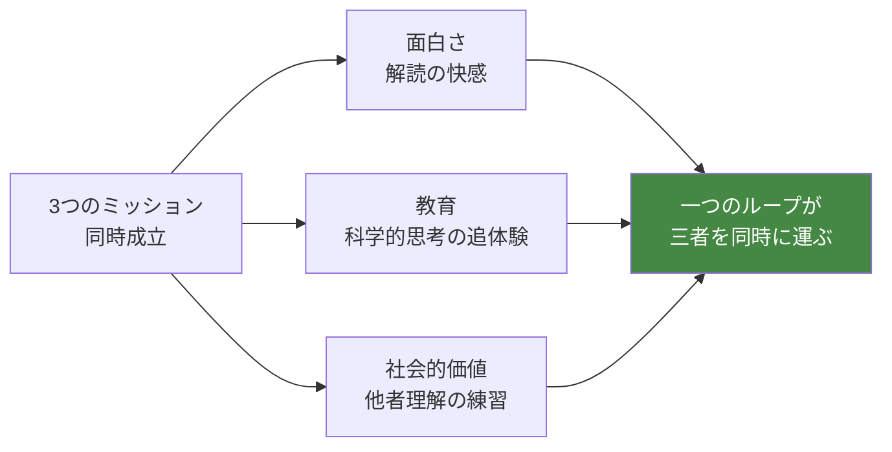

**成功の定義**（B0 §11.1）: プレイヤーの価値観が、プレイ前より少しだけ変わっていること。
売上でも DL 数でもない。

## 1.4 一行で言うと

> **猫は変わらない。変わるのは、見ている私たちのほうだ。**

---

# ② Design Philosophy

> **目的**: 全設計判断の最上位基準を提示する。
> **参照元Bible**: B0 全体、B1 ①⑫
> **他章との依存関係**: 全章がこれに従う。違反は他章を無効化する
> **開発チームへの指針**: 迷ったら「派手でない方」を選ぶ（B0 §0.4）

## 2.1 三層の思想構造

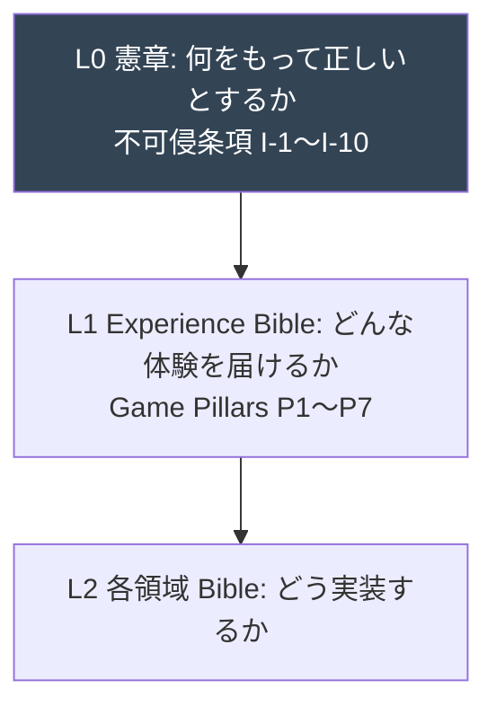

## 2.2 不可侵条項（B0 §1.2）— 絶対に変更しない10箇条

| # | 条項 |
|---|---|
| I-1 | 猫の内部状態を数値として表示しない |
| I-2 | 猫をプレイヤーの命令で動かせない |
| I-3 | レベル・経験値・能力値成長を導入しない |
| I-4 | 勝敗・スコアランキング・ゲームオーバーを導入しない |
| I-5 | ガチャ・確率課金・スタミナ課金を導入しない |
| I-6 | 猫への暴力・虐待を選択肢として実装しない |
| I-7 | 学習内容を報酬で釣って読ませない |
| I-8 | 実在の団体・業種・個人を敵役として描かない |
| I-9 | 「見送り」エンディングを失敗として演出しない |
| I-10 | プレイヤーを叱責・断罪するテキストを書かない |

## 2.3 Game Pillars（B1 ①）— 7本の柱

| # | 柱 | 一行定義 | 衝突時の優先 |
|---|---|---|---|
| P5 | 変わるのは、猫ではない | 進行度はプレイヤー側にある | **1（最優先）** |
| P1 | 見ることが、行為である | 観察が最も強いプレイ | 2 |
| P2 | 答えではなく、手応えを渡す | ○×でなく確からしさ | 3 |
| P3 | 環境こそが、対話である | 唯一の発話手段は空間 | 4 |
| P6 | 静けさを、設計する | 何も起きない時間がコンテンツ | 5 |
| P4 | 30日は、戻らない | 不可逆な時間が重みを与える | 6 |
| P7 | 現実へ続く、出口がある | ゲームの外側に接続 | 7 |

## 2.4 ゲームデザイン10原則（B0 §5）

```
1 猫は命である    2 猫は個体差がある    3 正解は一つではない
4 猫の気持ちは数値で見えない    5 猫は思い通りにならない
6 焦るほど悪循環になる    7 観察が最大の攻略法
8 環境改善が最大の成長要素    9 知識より理解を重視する
10 変わるのはプレイヤーである
```

## 2.5 禁止事項の要約（B0 付録B、B1 ⑫）

| 領域 | 禁止 |
|---|---|
| システム | レベル/経験値/戦闘/勝敗/ガチャ/課金前提/猫の操作・育成 |
| UI | 数値・ゲージ・%表示 / 通知バッジ / アニメーションUI |
| 表現 | 猫のセリフ・内心の断定 / 感情アイコン / 誇張リアクション |
| テキスト | 叱責/説教/正解の断定/クイズ/禁止語彙 |
| 学習 | 報酬による誘導 / 現象より先の知識提示 / 未監修の事実 |

**語彙統制（B0 §10.2）**: 育成/攻略/好感度/クリア/失敗/正解/飼う/ペット を使わない。

---

# ③ Core Experience

> **目的**: プレイヤーが実際に得る体験を定義する。
> **参照元Bible**: B1 ②③④⑤、B3 ⑨、B7
> **他章との依存関係**: ④のゲームプレイがこれを実装する
> **開発チームへの指針**: 感情曲線と学習曲線の一致が本作の核心

## 3.1 コア体験ループ（B0 §3.3）


**このループは全編を通じて不変**（B0 §3.3）。新機能はこれを深くする追加のみ許可。

## 3.2 Core Fantasy（B1 ②）

プレイヤーは「まだ飼い主ではない、一人の人間」。
持つ武器は**目・時間・想像力**。持たない武器は**言葉・力・専門知識**。

**「救う」ファンタジーは禁止**（B1 §2.4）。本作は「救う」ではなく「わかる」。

## 3.3 感情曲線（B1 ③）— 7 Phase

```
感情の質
  │                                          ╭─ ⑦余韻
  │                                    ╭─────╯
  │                              ╭─────╯ ⑥決断
  │                    ╭───╮╭─────╯
  │              ╭─────╯   ╰╯ ⑤理解
  │        ╭─────╯ ④停滞（谷）
  │  ╭─────╯ ③発見
  │╭─╯②不安
  ╯ ①期待
  └────────────────────────────────────────→ Day
   0   1-5    6-12   13-20  21-27  28-30  後
```

## 3.4 6つの感情的瞬間（B3 ⑨9.2）— 演出配分の基準

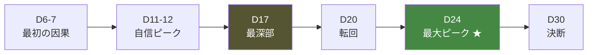

**最大ピーク（D24）**: 猫が近づいてきた瞬間ではなく「なぜ近づいてきたのか」がわかった瞬間（B0 §8.1）。

## 3.5 学習曲線（B7 ⑥、B1 ③）

**感情曲線と学習到達が一致する。** 感情が動く瞬間に理解が生まれる。

| Day | 感情 | 到達する一般化 |
|---|---|---|
| 6-7 | 発見 | G-03 猫は環境に反応する |
| 17 | 最深部・悔しさ | G-06 焦ると逆効果 |
| 20 | 転回・驚き | G-07 待つことには効果がある |
| 24 | 理解 | G-08 猫は人の振る舞いを見ている |
| 30 | 責任 | G-12/G-13 猫のために判断する／わかろうとする方法 |

## 3.6 「わかった → わかってなかった」構造

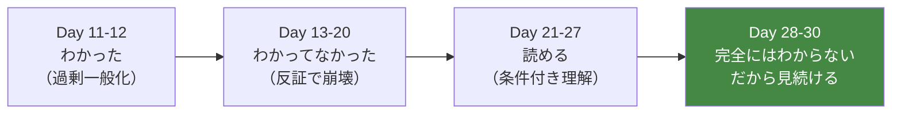

**この順序は逆転できない**（B7 ②2.2）。Day 13-20 の反証（谷）が本作の心臓部。

---

# ④ Gameplay Summary

> **目的**: ゲーム開始から終了までの実際の流れを示す。
> **参照元Bible**: B3 ①③、B5 §1、B9 ③
> **他章との依存関係**: ③の体験を、⑤〜⑩のシステムで実現する
> **開発チームへの指針**: ⚠️ 本章の一部は B2（未作成）の管轄。§15 参照

## 4.1 初回起動〜Day 1（B3 ①）

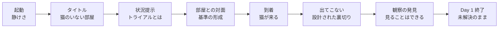

**FTUE の成功条件は1点のみ**（B3 §1.1）: Day 1 終了時に「明日どうなるんだろう」と思っていること。
**チュートリアルは説明でなく制約で行う**（B3 ①、消去法で観察に至らせる）。

## 4.2 1日の流れ（B3 ③、B5 §1、B9 ③）

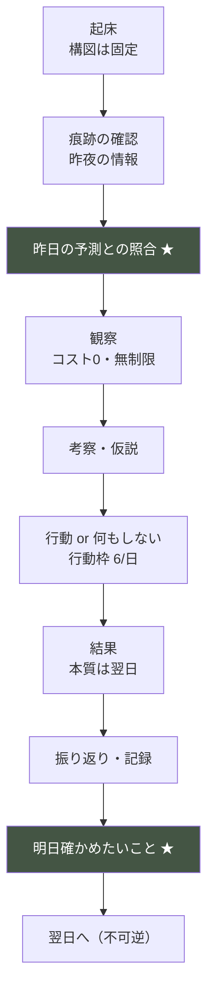

**時間構造**（B5 §1.2 で暫定確定・⚠️ B2 で正式化すべき）:
- 1日 = **6 Segment**（在室3：朝・夕・夜／不在3：未明・昼・深夜）
- 1 Segment = **2 行動枠**（B9 §3.3 で確定）。1日計6枠。**観察は0コスト**

## 4.3 30日全体の流れ（B3 ②、B7 ⑥）

```mermaid
gantt
    title 30日の構造
    dateFormat X
    axisFormat Day %s
    section Phase
    ①期待 ②不安（基準形成）:0, 6
    ③発見（規則）:6, 13
    ④停滞（反証・谷）:crit, 13, 21
    ⑤理解（再解釈）:21, 28
    ⑥決断:28, 31
    section 学習ライン
    LL-1 安心できる場所:1, 6
    LL-2 食事の条件:3, 17
    LL-5 人との距離:4, 27
    LL-3 音と刺激:5, 20
    LL-4 環境を変える:8, 22
    LL-6 自分が変数 ★:8, 30
```

## 4.4 エンディング方針（B0 §6.6、B3 ⑤D7）

**勝利条件は存在しない**（憲章 I-4）。30日目に訪れるのは勝敗ではなく**決断**。

| 結末 | 意味 |
|---|---|
| 正式譲渡 | この子と暮らしていける確信を得た |
| トライアル延長 | まだわからない。急がない誠実な保留 |
| 見送り | この環境では幸せにできないという判断 |

**3結末は等価**（憲章 I-9）。見送りを失敗として演出することは不可侵条項違反。

---

# ⑤ System Overview

> **目的**: 全システムの責務と依存を一望する。
> **参照元Bible**: B4 ①②
> **他章との依存関係**: ⑥⑦⑧⑨⑩�pmが各層の詳細
> **開発チームへの指針**: L4→L2 の参照は憲章 I-1 違反。層を守れ

## 5.1 5層アーキテクチャ（B4 §0.2）

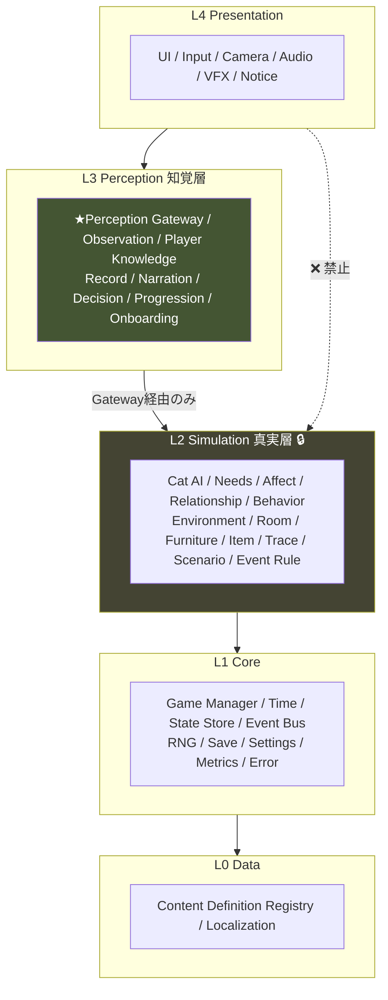

## 5.2 観測境界（B4 §0.1）— 本アーキテクチャの中核

```
真実（Truth）は観測境界を越えられない。越えられるのは現象（Phenomenon）だけ。
```

| 保証 | 実現 |
|---|---|
| G-1 数値がUIに到達しない | L4→L2 参照を型で禁止 |
| G-2 ゲームが正解を教えられない | Player Knowledge が Simulation を参照不可 |
| G-3 猫の行動が再現可能 | 決定論的更新 + Seeded RNG |

## 5.3 システム一覧（B4 ①）

| 層 | 主要システム | 数 |
|---|---|---|
| L0 Data | Content Definition / Localization | 2 |
| L1 Core | Game Manager / Time / State / Event Bus / RNG / Save / Settings / Metrics / Error | 9 |
| L2 Simulation | Cat AI / Behavior / Needs / Affect / Relationship / Environment / Room / Furniture / Item / Trace / Scenario / Event Rule / (統括) | 13 |
| L3 Perception | Perception Gateway / Phenomenon Registry / Observation / Player Knowledge / Record / Narration / Decision / Progression / Onboarding | 9 |
| L4 Presentation | UI / Input / Camera / Audio / VFX / Notice | 6 |

**⚠️ 不採用モジュール**（B4 §1.2）: Achievement System（実績は I-7 禁止）。**空の枠も作らない**。

## 5.4 依存の絶対規則（B4 ⑦）

| 規則 | 内容 |
|---|---|
| DR-2 | 下位層は上位層を参照しない |
| DR-3 | L4 は L2 を参照しない（層飛ばし禁止） |
| DR-4 | L3→L2 は Perception Gateway 経由のみ |
| DR-6 | 循環参照は全面禁止 |

---

# ⑥ Player Systems

> **目的**: プレイヤーの理解・観察・判断・行動のシステムを統合する。
> **参照元Bible**: B7 全体、B3 ⑤⑥
> **他章との依存関係**: ⑦猫システムから Cue を受け、⑧環境へ働きかける
> **開発チームへの指針**: 理解度は観測履歴からのみ構築（G-2）。正解を知らない

## 6.1 理解のモデル（B7 ①②）

**理解 = 証拠構造の充足**（正解との一致ではない）。

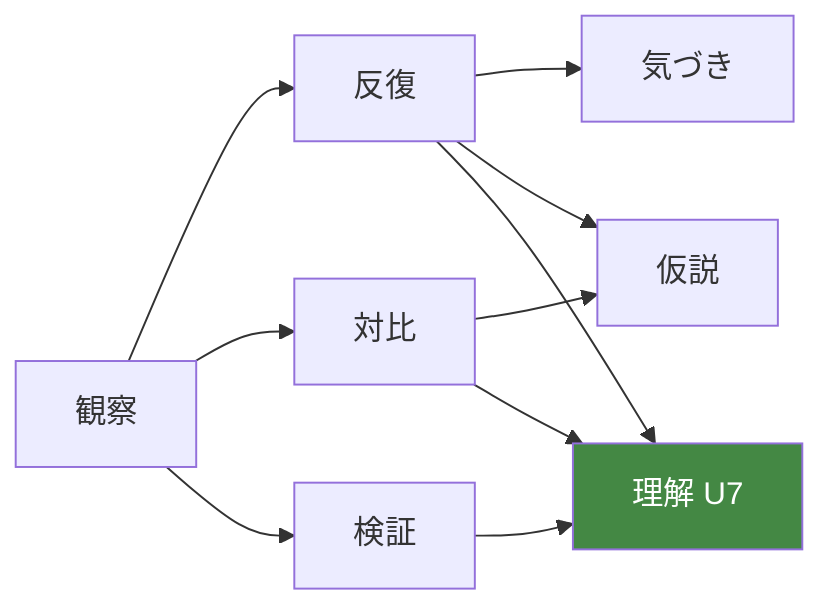

理解の8段階: U0 未分化 → U1 検出 → U2 弁別 → U3 パターン → U4 仮説 → U5 予測 → U6 検証 → U7 モデル。

## 6.2 観察技能（B7 ③）

15対象（耳/尻尾/瞳孔/ひげ/姿勢/歩き方/睡眠/食事/トイレ/鳴き声/遊び/隠れ方/痕跡/環境/**自分自身**）× 3レベル（L1検出/L2弁別/L3文脈化）。

**O-15 自分自身が到達点**（B7 §3.2）。最も現実に転移する技能。

## 6.3 仮説システム（B7 ④）

- 仮説の選択肢は**観測した要素のみ**で構成（総当たり不可）
- 正誤判定しない。仮説を立てると描写解像度が上がる（正しくても間違っても）
- 反証は「事実の並置」で追記。削除しない

## 6.4 判断・行動（B3 ⑤、B9 ③）

| 決定 | 重要度 | 自覚度 | コスト |
|---|---|---|---|
| D2b 何もしない | 最高 | 低 | 0 |
| D4 猫との距離 | 最高 | 最低 | 0 |
| D3 環境変更 | 高 | 高 | 2枠 |
| D7 最終決断 | 最高 | 最高 | — |

**最も効く行動が、最も安く、最も気づかれにくい**（B9 §3.4）。

## 6.5 振り返り（B7 ⑧）

「今日何が起きたか」でなく「今日何を理解できたか」。推量形で記録、評価しない、追記のみ。
**明日確かめたいこと**を翌朝提示 → Daily Loop の学習機能。

---

# ⑦ Cat Systems

> **目的**: 猫AI・欲求・情動・関係・学習・個性を統合する。
> **参照元Bible**: B5 §2-5、B6 全体
> **他章との依存関係**: ⑧環境を入力、⑥へ Cue を出力（Gateway経由）
> **開発チームへの指針**: 猫は真実でなく自分の記憶で動く（AI-3）。性格は不変（AI-2）

## 7.1 意思決定アーキテクチャ（B6 ②）— 4層ハイブリッド

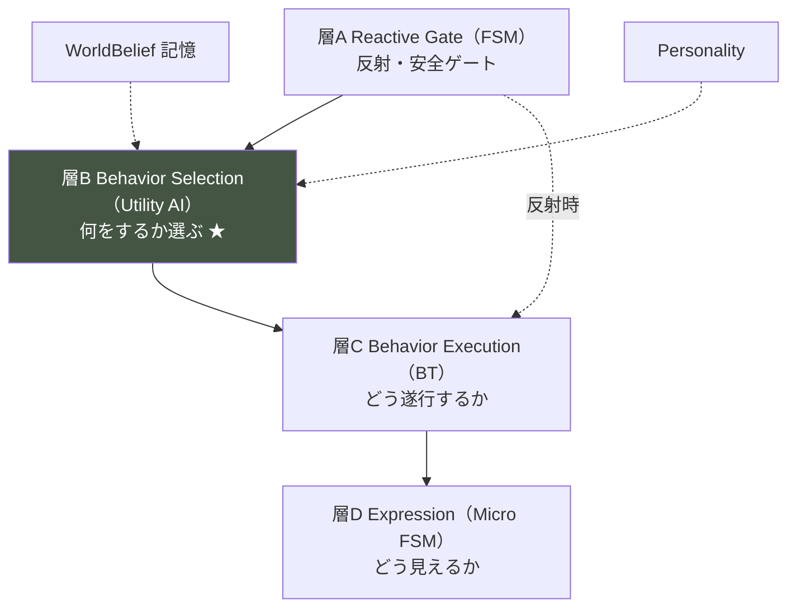

**GOAP/HTN/ML は却下**（計画型は最適行動に収束し、攻略可能になる）。

## 7.2 内部状態（B5 §2-3、B6 ③）

| 分類 | 変数 |
|---|---|
| Needs（13） | 安全/空腹/渇き/排泄/睡眠/体温/グルーミング/爪とぎ/休息/探索/遊び/高所/社会的接触 |
| Affect（4） | Arousal / Valence / Vigilance / StressLoad |
| Relationship（3） | Familiarity / Trust / ToleranceDistance |
| AI固有 | WorldBelief / Attention / Territory / Curiosity / Condition |

**中核メカニクス**: 安全欲求が他をゲートする（B5 §2.3）。「不安だと食べない」の実体。

## 7.3 情動と非対称性（B5 §3）

```
Vigilance: 上昇即時 / 下降遅い（1:20）
StressLoad: 慢性。上限0.8（詰み禁止）
Trust: 上昇遅い / 下降速い（逆非対称）
```

**焦るほど悪循環**の数理的実体は、StressLoad の正のフィードバックループ（B5 §3.4）。

## 7.4 学習（B6 ⑤）— 機械学習ではなく明示的記憶

4種: 非連合（慣れ・感作）/ 連合 / 空間 / 社会的。
**pursuitTendency（逃げたら追うか）が Trust の最大要因**（B6 §5.4）。負の記憶は1回で形成、消去に数週間。

## 7.5 個性（B6 ④）— 24タイプ

8気質軸の連続空間上のプリセット。**タイプ名は表示しない**。
特に教育的: PT-18 新規回避型（環境改善が裏目）/ PT-21 接触忌避型（懐く≠触れる）/ PT-06 距離維持型（30日で接触に至らないのが正常）。

## 7.6 観測写像（B6 ⑩）— 誤解を解く

| 誤解 | 実際 |
|---|---|
| ゴロゴロ＝機嫌が良い | 弛緩と自己鎮静の両方。音で区別不能 |
| お腹を見せる＝撫でて | 高度な弛緩。接触要請ではない |
| 尻尾を振る＝嬉しい | 猫ではむしろ苛立ち・葛藤 |

**全写像が監修対象**（B6 付録B、最高重要度8項目）。

---

# ⑧ Environment Systems

> **目的**: 部屋・家具・安全・生活環境を統合する。
> **参照元Bible**: B5 §4、B10 全体
> **他章との依存関係**: ⑦猫の入力、⑥プレイヤーの働きかけの対象
> **開発チームへの指針**: 家具は効果値でなく物理的寄与を持つ（AA-65）

## 8.1 環境の定義（B10 ①）

> **環境 = プレイヤーが猫に語りかける唯一の言語**（Pillar 3）

## 8.2 空間の二層構造（B10 ②）

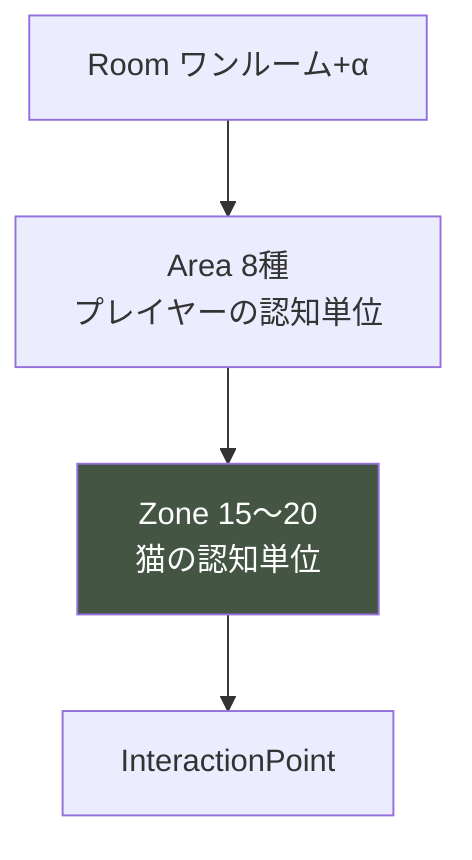

Zone 型（6種）: 退避 / 休息 / 高所 / 資源 / 開放 / 境界。
固定 / 半可変 / 生成 の3種。**プレイヤーが生成 Zone を作れることが環境改善の実体**。

## 8.3 環境パラメータ（B5 §4、B10 ③）

基礎属性10（height/cover/exits/sightline/humanDistance/trafficLevel/noiseLevel/lightLevel/temperature/selfScent）→ 導出値（ZoneSecurity/Comfort/Accessibility）→ 部屋全体（Predictability/ResourceDistribution/StimulusLevel/Cleanliness）。

**exitScore が LL-1 の核心**: 逃走路0の隠れ場所は安全でない。
**掃除の両面性**: トイレ掃除は良い、定位置の掃除は selfScent を消して悪い（MU-20 の反証）。

## 8.4 家具システム（B10 ④）

5カテゴリ（構造/資源/快適/刺激/道具）。**効果値・ランク・耐久を持たない**。物理的寄与のみ。
**無料の解法を全課題に保証**（B10 §4.6）: 初期家具の配置変更だけで30日完遂可能。

## 8.5 環境フィードバック（B10 ⑦）

数値でなく猫の行動で伝える。**3日遅延**。成功は「探索・遊びの出現」で伝わる。

## 8.6 ハザード（B10 ⑧）

**危険は「起きること」でなく「気づくこと」**。誤飲・転落・脱走・中毒は発生させない（憲章§9.4）。関心を観測可能にし、対処すると関心が消える。正確な知識は Reality Bridge。

---

# ⑨ Event Systems

> **目的**: イベント構造・ライフサイクル・分類を統合する。
> **参照元Bible**: B8 全体
> **他章との依存関係**: ⑦猫、⑧環境を変化させ、⑥へ観察機会を供給
> **開発チームへの指針**: イベントは学習ラインに属する。単発は作らない

## 9.1 イベントの定義（B8 ①）

> **イベント = 猫の生活に自然に生じる状態変化と、それが生む観察機会の束**

課題ではない。すべてのイベントは**学習ライン**（LL-1〜LL-6）に属する。

## 9.2 6つの役割型（B8 §1.4）


**T-5 反証を持たない学習ラインは不完全**（過剰一般化が固定される）。

## 9.3 ライフサイクル（B8 ②）

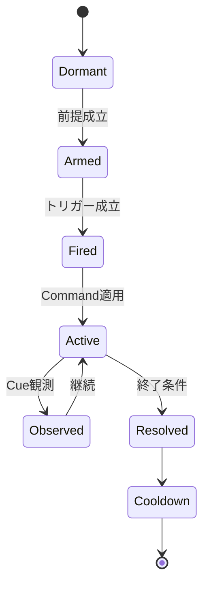

**イベントは猫の反応を指定しない**（Cat AI が決める）。変更してよいのは環境・刺激・資源・人のみ。

## 9.4 分類（B8 ③）— 27カテゴリ

生活基盤6 / 空間と環境7 / 感覚刺激3 / 人との関係5 / 猫自身4 / 制度と現実2。
**不採用**: 発情・多頭飼育・引越し（Reality Bridge で扱う）。

## 9.5 バランス（B8 ⑩）

**1日の新規発火は1件が上限**。静かな日を30%以上。30日の総発火18〜22件。反証は Day 13-20 に集中。

---

# ⑩ Progression

> **目的**: 進行・報酬・リソース・難易度を統合する。
> **参照元Bible**: B9 全体
> **他章との依存関係**: 全システムの上に成長体験を構築
> **開発チームへの指針**: 数値は伸ばさない。伸びるのは読解・判断・環境

## 10.1 成長の定義（B9 ①）

**選択肢は増えない**（Day 1 と Day 30 で同じ）。増えるのは選択の質。
3軸: 読解（単調増加）/ 判断（谷を持つ）/ 環境（可逆）。

## 10.2 リソース（B9 ②）

| リソース | 性質 |
|---|---|
| 時間（Segment） | 観察は0コスト |
| 行動枠 | 1日6。繰り越し不可 |
| 予算 | 初期値のみ。増えない |
| 消耗品 | 補充が必要 |

**信頼・理解はリソースにしない**（残高化＝懐かせるゲーム化）。

## 10.3 金銭（B9 ④）

**金で猫との関係は改善しない**。価格と効果を相関させない。すべての課題に無料の解法。赤字でも詰まない。医療費は情報提示のみ（発生させない）。

## 10.4 報酬（B9 ⑥）

物質報酬なし。RW-1 観測可能性の拡大 / RW-2 猫の新行動 / RW-4 予測の的中 / RW-5 再解釈 / RW-6 美的 / RW-7 自己変化。**祝わない**。

## 10.5 難易度（B9 ⑦）— Day 17 が最高点

```
難易度 = 読み取るべき情報の微細さ × 考慮すべき文脈の数
```

動的難易度なし（AP-09）。主要な源は個体差。

## 10.6 バランス検証の特異指標（B9 ⑪）

「何もしない」選択率 **10〜20%**（0%は失敗）/ 悪循環発生率 **60〜80%**（低すぎも失敗）。

---

# ⑪ Data Architecture

> **目的**: データ構造・ID・コンテンツ構造を統合する。
> **参照元Bible**: B4 ③⑨⑩、B8 ⑪、B10 ⑨
> **他章との依存関係**: 全コンテンツの器
> **開発チームへの指針**: ⚠️ B11（統合データ文書）は未作成。データ定義は3文書に分散

## 11.1 ⚠️ データ設計の所在

**統合された Data Architecture Bible（B11）は存在しない。** データ定義は以下に分散する。

| データ領域 | 定義の所在 |
|---|---|
| セーブデータ構造 | B4 ⑨ Save Architecture |
| 状態管理（GameState等） | B4 ⑧ State Management |
| イベント定義スキーマ | B8 ⑪ Event Data Model |
| 環境定義スキーマ | B10 ⑨ Environment Data Model |
| 猫プロファイル | B6 ④、B4 ⑩ |
| 現象語彙 | B4 P-02 Phenomenon Registry |

**→ 要設計（§15 OI-2）**: これらを統合し、ID規則・JSONスキーマ・命名規則を横断定義する文書。

## 11.2 データの三態（B4 ④）

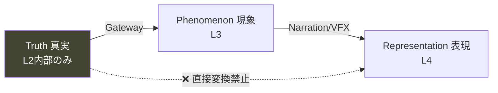

## 11.3 保存の三分類（B4 ⑨）

| 分類 | 例 |
|---|---|
| Persisted | Seed / Day / Cat State / 配置 / 観測履歴 / Record |
| Transient | Phenomenon / UI状態 / 表示文字列 |
| Derived（再生成） | Player Knowledge / 環境評価 / 描写解像度 |

**セーブは1スロット・自動のみ**（Pillar 4）。派生データは保存せず再生成。

## 11.4 拡張時のスキーマ検証（B4 D-01、B8 ⑪、B10 ⑨）

各定義は Content Definition Registry が読込時に検証。禁止フィールド（効果値・ランク・猫の反応指定）の不在を確認。

**⚠️ ID規則・JSONの具体形式は未定義（B11 の管轄、§15 OI-2）。**

---

# ⑫ Technical Overview

> **目的**: 開発に必要な主要システムを責務レベルで整理する（実装方法ではない）。
> **参照元Bible**: B4 ⑫、B4 §12 Performance
> **他章との依存関係**: ⑤の実装骨格
> **開発チームへの指針**: ⚠️ 技術スタックは未定義（§15 OI-3）

## 12.1 主要システムの責務（B4 ①）

| システム | 責務 |
|---|---|
| Game Manager | ライフサイクル統括・シーン遷移 |
| Time System | 5粒度の時間進行（Frame/Tick/Segment/Day/Trial） |
| State Store | 全状態の単一保持・遷移制御 |
| Event Bus | 順序保証された疎結合通信 |
| RNG Service | 決定論的乱数（用途別ストリーム） |
| Save System | 1スロット・自動・整合性検証 |
| Perception Gateway | Truth→Phenomenon 変換（唯一の越境点） |
| Simulation System | L2 統括・更新順序保証 |

## 12.2 更新順序（B4 ⑥）

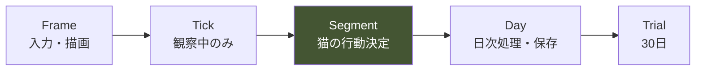

**実時間で Simulation を回さない**（AP-17）。

## 12.3 性能方針（B4 §12）

静けさ（Pillar 6）と実時間非連動により、性能的に有利。浮いた予算を**初回ロード短縮**とアセット品質へ。

**⚠️ 具体的な秒数・容量目標は未定義（Technical Design の管轄、§15 OI-3）。**

## 12.4 CI 必須検証（B4 §14.2）

依存グラフ検証 / 境界違反検出 / 再現性テスト / セーブ往復テスト / 禁止語検出 / デバッグコード検出。

---

# ⑬ Content Overview

> **目的**: コンテンツ全体を整理する。
> **参照元Bible**: B5 §9、B6 ④、B7 ⑥、B8 ③⑦、B10 ④
> **他章との依存関係**: 各システムが定義した「器」を埋める中身
> **開発チームへの指針**: ⚠️ 実コンテンツは全て未作成（Content Bible の管轄）

## 13.1 コンテンツの種類と状態

| コンテンツ | 器の設計 | 実データ | 所在 |
|---|---|---|---|
| **猫（個体）** | ✅ 24タイプ・8気質軸 | ❌ 未作成 | B6 ④ |
| **家具・用品** | ✅ 5カテゴリ | ❌ 未作成 | B10 ④ |
| **イベント** | ✅ 6役割型・27カテゴリ | ❌ 未作成 | B8 ③ |
| **学習ライン** | ✅ LL-1〜LL-6 | ⚠️ 骨格のみ | B8 §7.3 |
| **知識（一般化）** | ✅ G-01〜G-13 | ✅ 定義済み | B7 §6.3 |
| **現象語彙** | ✅ 構造 | ❌ 未作成 | B4 P-02 |
| **観察描写** | ✅ 3レベル構造 | ❌ 未作成 | B7 §3.4 |
| **シナリオ** | ✅ 30日構造 | ❌ 未作成 | B3 ②、B8 |
| **記録テキスト** | ✅ 文体規則 | ❌ 未作成 | B7 §8.2 |

## 13.2 監修必須コンテンツ（B5 付録B、B6 付録B）

| 領域 | 最高重要度項目 |
|---|---|
| 情動とボディランゲージ | B6 B-11/B-12/B-13（耳・尻尾・仰向け） |
| 健康・体調 | B5 B-03/B-07、B6 B-03/B-06/B-08 |
| 対人反応 | B6 B-10（視線・接近・接触） |

**監修未了でのリリースは憲章§9.2 違反**。

## 13.3 学習ライン標準セット（B8 §7.3）

| ライン | テーマ | 対応一般化 |
|---|---|---|
| LL-1 | 安心できる場所の条件 | G-03 |
| LL-2 | 食事が成立する条件 | G-03, G-05 |
| LL-3 | 音と刺激への反応 | G-05 |
| LL-4 | 環境を変えるということ | G-04 |
| LL-5 | 人との距離 | G-06, G-07 |
| LL-6 | 自分が変数である ★ | G-08 |

---

# ⑭ Development Risks

> **目的**: 開発・設計・教育・ゲームデザインのリスクを分析する。
> **参照元Bible**: 全文書の実装注意点、B0 §11.3、B2/B7 の失敗定義
> **他章との依存関係**: ⑮⑰と連動
> **開発チームへの指針**: リスクは「思想の希薄化」に集中する。数値目標のための妥協を警戒

## 14.1 ゲームデザイン上のリスク

| # | リスク | 深刻度 | 兆候 | 対策 |
|---|---|---|---|---|
| GR-1 | 「懐かせるゲーム」への転落 | 🔴 最高 | V-05 で「懐かせるゲーム」と説明される | Pillar 5 の徹底。信頼を非リソース化 |
| GR-2 | 静けさが退屈と誤認され刺激追加 | 🔴 | 「退屈」への対処で演出を足す | N-14 判定（V-01）。観測対象を足す |
| GR-3 | Phase ④（谷）で離脱 | 🟠 | Day 15-19 の離脱率 | セーフティネット（B5 §5.6） |
| GR-4 | 最速プレイヤーが観察をスキップ | 🟠 | 観察時間の短さ | 観察量で情報量が変わる設計（DE-31） |
| GR-5 | 「何もしない」が選ばれない | 🟠 | 選択率0% | DS-1〜3（B9 §8.3） |

## 14.2 設計上のリスク

| # | リスク | 深刻度 | 対策 |
|---|---|---|---|
| DR-A | 観測境界の漏洩（数値がUIに出る） | 🔴 最高 | 型・Lint・CIで強制（B4 §7.4） |
| DR-B | G-2 の破れ（ゲームが正解を知る） | 🔴 | Player Knowledge の Simulation 非参照 |
| DR-C | 「わかりにくい」への説明追加 | 🔴 | AL-87。制約設計に戻る |
| DR-D | なし崩しの例外で不可侵条項が緩む | 🔴 | B0 §14.6 定期監査 |

## 14.3 教育的リスク

| # | リスク | 深刻度 | 対策 |
|---|---|---|---|
| ER-1 | 誤った知識を広める | 🔴 最高 | 監修必須。未監修リリース禁止 |
| ER-2 | 最有害な誤解が修正されない | 🔴 | 反証3回以上を自動テスト（B8 §7.6） |
| ER-3 | 学習が転移しない | 🟠 | 3文脈以上での経験（B7 ⑩） |
| ER-4 | 説教・押し付けと受け取られる | 🟠 | 現象での提示。DE-51 監視 |

## 14.4 開発プロセス上のリスク

| # | リスク | 深刻度 | 対策 |
|---|---|---|---|
| PR-1 | **B2/B11 未作成のまま実装着手** | 🔴 最高 | §15 OI-1/OI-2 を最優先解消 |
| PR-2 | 実測調整パラメータの未確定 | 🟠 | プレイテスト計画（付録C群） |
| PR-3 | 監修工数の未確保 | 🟠 | 監修項目の早期リスト化（済） |
| PR-4 | イベント密度が上がる圧力 | 🟠 | 1日1件上限の死守 |

---

# ⑮ Open Issues

> **目的**: 未決定・矛盾・追加設計・保留を一覧化する。推測で埋めない。
> **参照元Bible**: 各文書の未確定事項、本 GDD のレビュー
> **他章との依存関係**: ⑭⑰⑱と連動
> **開発チームへの指針**: OI-1/OI-2 は実装着手前に解消すべき最重要負債

## 15.1 🔴 最重要（実装着手前に解消）

| ID | 種別 | 内容 | 現状の所在 |
|---|---|---|---|
| ~~**OI-1**~~ | ✅ **解消** | **Core Gameplay Loop Bible を作成**（[13](./13-CORE-GAMEPLAY-LOOP-BIBLE.md)・Proposed） | B0 §3.3 / B3 / B5 §1 / B9 §3 を統合・正式化。Segment=6/行動枠=2 の確定昇格は人間承認待ち |
| ~~**OI-2**~~ | ✅ **解消** | **Data Architecture Bible を作成**（[14](./14-DATA-ARCHITECTURE-BIBLE.md)・Proposed） | ID規則・JSON形式・ローカライズ規則・現象語彙スキーマを定義し EP-09 実装と整合。実データ（現象語彙リスト等）は Content 工程 |

### OI-1 の詳細

```
Core Gameplay Loop Bible が担うべき内容と、現在の所在：

□ コアループの定義        → B0 §3.3（あり）
□ 1日の Segment 構造      → B5 §1.2（暫定確定・要正式化）
□ 1 Segment の行動枠      → B9 §3.3（確定済み・2枠）
□ 行動コスト表            → B9 §3.4（確定済み）
□ 観察と介入の非対称       → B9 §3（あり）

→ 断片は揃っている。「統合・正式化」の作業であり、新規設計ではない。
→ ただし正式文書がないため、Segment 数6は「暫定確定」のまま。
```

### OI-2 の詳細

```
Data Architecture Bible が担うべき内容と、現在の所在：

□ セーブスキーマ          → B4 ⑨（あり）
□ イベント定義スキーマ     → B8 ⑪（あり）
□ 環境定義スキーマ         → B10 ⑨（あり）
□ ID命名規則              → 未定義 ★
□ JSON の具体形式         → 未定義 ★
□ 現象語彙の完全リスト     → 未定義 ★（B4 P-02 は構造のみ）
□ ローカライゼーションキー規則 → 未定義 ★

→ スキーマは各所にあるが、横断的なID・命名・JSON規則が欠落。
```

## 15.2 🟠 要設計（実装と並行可）

| ID | 内容 | 決定すべき工程 |
|---|---|---|
| OI-3 | 技術スタック（フレームワーク・言語）・性能数値目標 | Technical Design（未着手） |
| OI-4 | UI/UX 設計（画面・操作・情報提示） | UI Design（未着手） |
| OI-5 | Reality Bridge の具体内容（現実情報層） | Reality Bridge Design（未着手） |
| OI-6 | アート方針・アセット仕様 | Art Bible（未着手） |
| OI-7 | サウンド方針（生活音・限定的音楽） | Sound Bible（未着手） |

## 15.3 🟡 要判断（デザイン判断待ち）

| ID | 内容 | 参照 |
|---|---|---|
| OI-8 | 初回プレイの推奨個体の確定 | B6 §4.5 |
| OI-9 | 在室 Segment の可変性（シナリオ次第） | B5 §1.2 |
| OI-10 | 季節の実装時期（将来拡張） | B5 §1.6 |

## 15.4 実測調整待ち（プレイテスト）

各文書の付録C群に集約。主要なもの:

| 項目 | 判定基準 |
|---|---|
| 行動枠2の妥当性 | 平均使用枠 3.0〜4.5 |
| 悪循環の回復日数 | 待つ=1〜3日、放置=6〜8日 |
| Vigilance/StressLoad の係数 | Day 17 に最深部が来るか |
| 初期予算・生活コスト | 必須支出のみで黒字 |

## 15.5 ⚠️ 発見された矛盾・要確認

| ID | 内容 | 判定 |
|---|---|---|
| CF-1 | B5 の Segment 数6が「暫定確定」。B2 未作成のため正式化されていない | **要確認**: B2 作成時に確定 |
| CF-2 | 指示文が B2/B11 を「策定済み」と記載するが実在しない | **事実誤認**: 本 GDD で訂正済み |
| CF-3 | Progression System の名称衝突（B4 で P-08 として再定義、B9 が主管） | **整合済み**: §17 で確認 |

**⚠️ 重大な設計矛盾は発見されていない**（§17 で詳述）。矛盾は「未作成文書」に起因するもののみ。

---

# ⑯ Dependency Matrix

> **目的**: 各 Bible の依存関係をマトリクス化する。
> **参照元Bible**: 各文書の Parent Documents 宣言
> **他章との依存関係**: ⑰の基礎
> **開発チームへの指針**: 上位文書と矛盾する下位文書は無効（B0 §0.3）

## 16.1 Bible 依存図

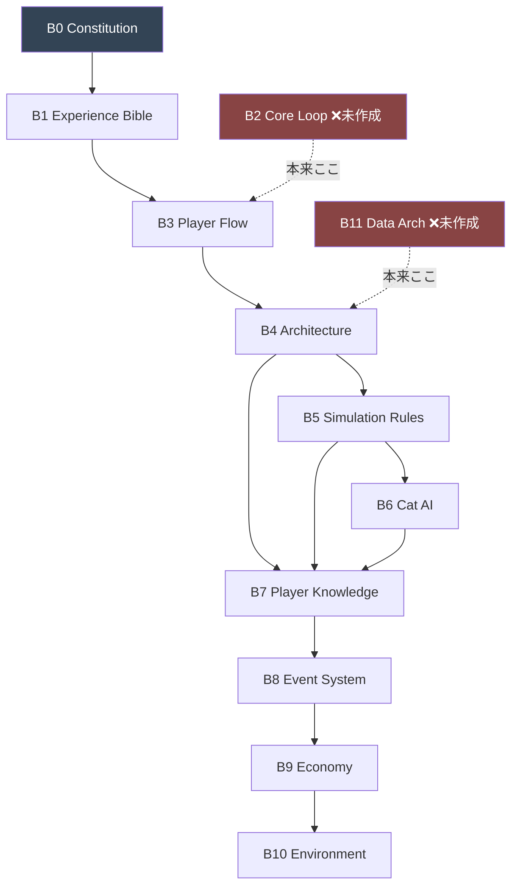

## 16.2 依存マトリクス

**行が「参照する側」、列が「参照される側」。✅ = 直接依存。**

| ↓が→に依存 | B0 | B1 | B3 | B4 | B5 | B6 | B7 | B8 | B9 | B10 |
|---|:--:|:--:|:--:|:--:|:--:|:--:|:--:|:--:|:--:|:--:|
| **B1 Experience** | ✅ | — | | | | | | | | |
| **B3 Player Flow** | ✅ | ✅ | — | | | | | | | |
| **B4 Architecture** | ✅ | ✅ | ✅ | — | | | | | | |
| **B5 Simulation** | ✅ | ✅ | ✅ | ✅ | — | | | | | |
| **B6 Cat AI** | ✅ | ✅ | ✅ | ✅ | ✅ | — | | | | |
| **B7 Knowledge** | ✅ | ✅ | ✅ | ✅ | ✅ | ✅ | — | | | |
| **B8 Event** | ✅ | ✅ | ✅ | ✅ | ✅ | ✅ | ✅ | — | | |
| **B9 Economy** | ✅ | ✅ | ✅ | ✅ | ✅ | ✅ | ✅ | ✅ | — | |
| **B10 Environment** | ✅ | ✅ | ✅ | ✅ | ✅ | ✅ | ✅ | ✅ | ✅ | — |

**⚠️ 全文書が B0（憲章）に依存。下流ほど依存数が増える（累積的統合）。**
**⚠️ 循環依存なし。** 依存は常に上流→下流の一方向。

## 16.3 未作成文書の影響範囲

| 未作成 | 本来依存すべき下流 | 影響 |
|---|---|---|
| B2 Core Loop | B4/B5/B6/B7/B8/B9/B10（全て） | Segment 定義が暫定のまま7文書に伝播 |
| B11 Data Arch | 実装工程 | ID/JSON規則の欠落。実装着手をブロック |

---

# ⑰ Architecture Consistency Review

> **目的**: 全文書間の整合性を確認する。
> **参照元Bible**: 全文書
> **他章との依存関係**: ⑮⑱の根拠
> **開発チームへの指針**: 本レビューで🔴が出た箇所は着手前に解消

## 17.1 矛盾（Contradictions）

| 確認項目 | 結果 |
|---|---|
| 不可侵条項に反する下位仕様 | ✅ **なし** |
| Pillar 間の未解決衝突 | ✅ **なし**（優先順位で解決済み B1 §Pillar相互関係） |
| 数値表示の禁止 vs 内部数値の必要 | ✅ **整合**（観測境界で解決 B4 §0） |
| 「難易度が理解度で変わる」要求 vs G-2 | ✅ **整合**（B8 ⑥で要求を修正して実現） |
| 名称衝突（Progression） | 🟡 **軽微**（B4 P-08 と B9 が役割分担。混乱リスクは命名で対処済み） |

**結論**: 実設計上の矛盾は発見されない。唯一の矛盾は「未作成文書を策定済みとする指示文の事実誤認」（CF-2）。

## 17.2 重複（Duplications）

| 項目 | 状態 | 判定 |
|---|---|---|
| Anti Pattern リスト（各文書に存在） | 領域別に分割。重複は意図的 | ✅ 許容 |
| チェックリスト（各文書に存在） | 領域別。参照先が異なる | ✅ 許容 |
| 悪循環の記述（B3/B5/B8/B9） | 各層の視点で記述 | ✅ 整合（矛盾なし） |
| 描写解像度（B6/B7/B10） | B7 が主管、他は参照 | ✅ 整合 |

**⚠️ 有害な重複（同一事項の異なる定義）は発見されない。**

## 17.3 責務漏れ（Missing Responsibilities）

| 領域 | 責務主体 | 状態 |
|---|---|---|
| ID命名規則 | （B11） | 🔴 **漏れ**（OI-2） |
| JSON具体形式 | （B11） | 🔴 **漏れ**（OI-2） |
| 現象語彙の実リスト | （B11 / Content） | 🔴 **漏れ**（OI-2） |
| 技術スタック | （Technical Design） | 🟠 未着手（OI-3） |
| UI 具体設計 | （UI Design） | 🟠 未着手（OI-4） |
| Reality Bridge 実装 | （Reality Bridge Design） | 🟠 未着手（OI-5） |

## 17.4 責務重複（Overlapping Responsibilities）

| 潜在的重複 | 解決状態 |
|---|---|
| 環境の記述（B5 §4 と B10） | ✅ B5 が法則、B10 が実装展開。明確に分離 |
| 学習（B6 ⑤ と B7） | ✅ B6 が猫の記憶、B7 がプレイヤーの理解。別物 |
| イベント難易度（B8 ⑥ と B9 ⑦） | ✅ B8 が個別、B9 が全体曲線 |

**⚠️ 未解決の責務重複は発見されない。**

## 17.5 循環依存（Circular Dependencies）

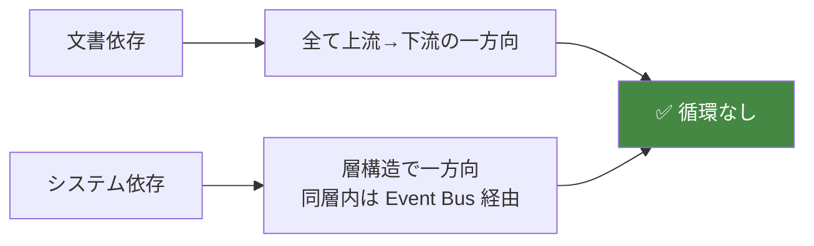

**✅ 文書レベル・システムレベルともに循環依存なし。**

## 17.6 不足設計（Insufficient Design）

| # | 不足 | 深刻度 |
|---|---|---|
| 1 | B2 Core Loop（統合文書） | 🔴 |
| 2 | B11 Data Architecture（統合文書） | 🔴 |
| 3 | 技術設計 | 🟠 |
| 4 | UI/UX 設計 | 🟠 |
| 5 | 実コンテンツ全般 | 🟠（器は完成、中身が空） |
| 6 | 実測調整パラメータ | 🟡（プレイテスト待ち） |

## 17.7 整合性レビュー総括

```
✅ 強み: 思想の一貫性が極めて高い。10文書が同一の原則から演繹され、
         下流ほど累積的に統合されている。循環依存・設計矛盾ともになし。

🔴 弱み: 2つの統合文書（B2/B11）が未作成。断片は存在するが正式化されていない。
         特に B11 欠落によりID/JSON規則がなく、実装着手をブロックする。

🟠 未着手: 技術・UI・アート・サウンド・実コンテンツ。これらは「器」が完成済みで、
          設計思想は明確なため、着手可能な状態。
```

---

# ⑱ Development Readiness Score

> **目的**: 開発準備度を100点満点で評価する。
> **参照元Bible**: ⑮⑰、全文書
> **他章との依存関係**: 本 GDD の総括
> **開発チームへの指針**: スコアは「思想100・実装準備60」の非対称を示す

## 18.1 総合評価

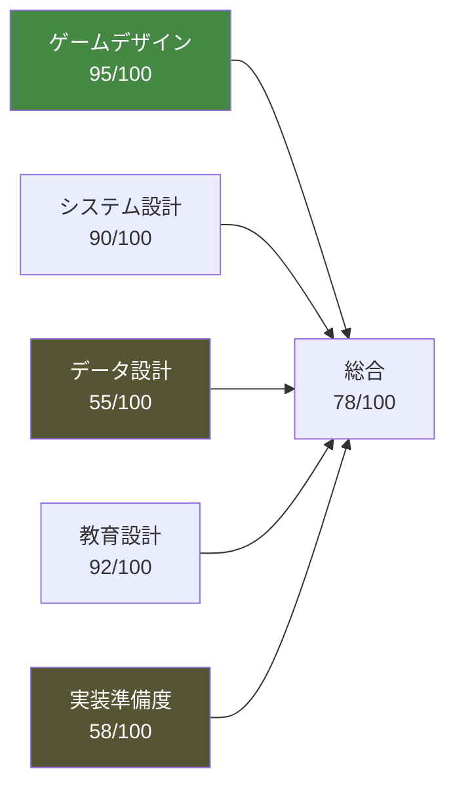

## 18.2 項目別評価

### ゲームデザイン完成度：95/100

| 評価理由 | 改善提案 |
|---|---|
| ✅ 思想が10文書を貫き一貫。Pillar 衝突も解決済み | Core Loop の正式文書化（OI-1）で+3 |
| ✅ 感情曲線・学習曲線・難易度曲線が一致 | 実測調整で曲線を検証（プレイテスト）で+2 |
| ✅ 「懐かせるゲーム」への転落を構造的に防止 | — |
| △ Segment 数が暫定確定 | B2 作成で確定 |

### システム設計完成度：90/100

| 評価理由 | 改善提案 |
|---|---|
| ✅ 5層アーキテクチャ・観測境界が明確 | — |
| ✅ 循環依存なし・責務分離が徹底 | — |
| ✅ 4層AI・決定論性の保証 | — |
| △ 更新順序が B2 未確定に一部依存 | Core Loop 正式化で+5 |
| △ CI 検証項目は定義済みだが未実装 | 実装工程で検証 |

### データ設計完成度：55/100

| 評価理由 | 改善提案 |
|---|---|
| ✅ セーブ・イベント・環境のスキーマは存在 | — |
| 🔴 **統合 Data Architecture 文書が未作成** | **B11 作成が最優先（+30）** |
| 🔴 ID命名規則・JSON具体形式が未定義 | 同上 |
| 🔴 現象語彙の実リストが未作成 | Content 工程 |
| △ 派生/永続の分類は明確 | — |

**⚠️ この項目が最低スコア。実装着手の主要ブロッカー。**

### 教育設計完成度：92/100

| 評価理由 | 改善提案 |
|---|---|
| ✅ 理解を証拠構造で定義（G-2）。クイズ化を構造的に回避 | — |
| ✅ 38の誤解、最有害12項目の反証配置 | — |
| ✅ 転移の3条件を30日に組込み | — |
| 🔴 **監修が未実施**（項目リストは完成） | 監修工程の実施（+5）。未監修リリースは禁止 |
| △ Reality Bridge の実内容が未設計 | OI-5 |

### 実装準備度：58/100

| 評価理由 | 改善提案 |
|---|---|
| ✅ 責務・依存・更新順序が明確 | — |
| ✅ 「器」が完成し、拡張構造も定義済み | — |
| 🔴 **技術スタック未定義**（OI-3） | Technical Design 着手（+15） |
| 🔴 **B11 未作成でデータ実装不可**（OI-2） | B11 作成（+15） |
| 🔴 UI/UX 未設計（OI-4） | UI Design 着手（+10） |
| △ 実コンテンツが空 | Content Bible（器は完成） |

## 18.3 総括と推奨アクション

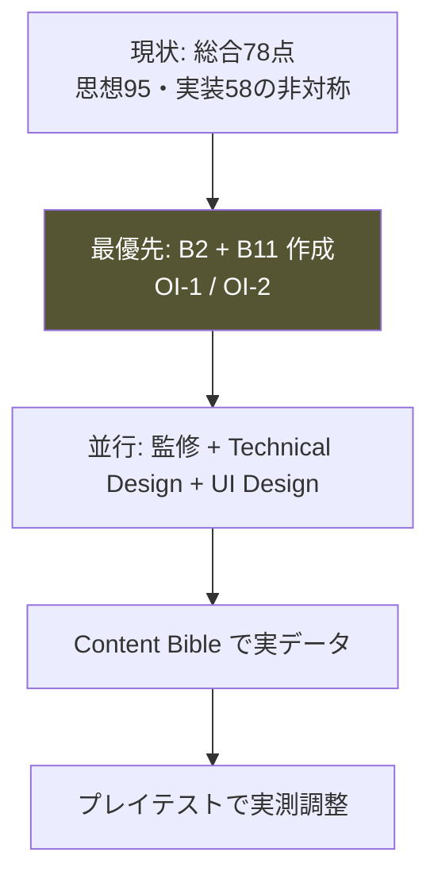

### 開発着手前に必須（🔴）

```
1. B2 Core Gameplay Loop Bible の作成（統合・正式化。新規設計ではない）
2. B11 Data Architecture & Content Schema Bible の作成（ID/JSON/命名規則）
3. 監修工程の計画（項目リストは完成済み）
```

### 着手可能（🟠）

```
4. Technical Design（技術スタック・性能目標）
5. UI/UX Design（B3 の U-1〜U-10 を必達要件として）
6. Content Bible（各設計書の引き継ぎ要件に従う）
```

## 18.4 最終所見

> **この企画は「思想の完成度」において稀有な水準にある。**
> **10文書が単一の原則から演繹され、矛盾なく累積している。**
>
> **一方、実装準備は「2つの統合文書の欠落」と「技術・UI・コンテンツの未着手」により
> 未完了である。ただしこれらは新規設計ではなく、既存の断片の統合と具体化である。**
>
> **最大のリスクは技術的困難ではなく、開発の過程で思想が希薄化することである。**
> **本 GDD と各 Bible のチェックリスト（合計1,400項目超）が、その防波堤となる。**

---

## 付録: 本 GDD の使い方

| 職種 | 最初に読むべき章 | 常に参照すべき Bible |
|---|---|---|
| Producer | ①②⑭⑮⑱ | B0 |
| Game Designer | 全章 | B0 B1 B3 |
| Programmer | ⑤⑪⑫⑯⑰ | B4 B5 B6 |
| UI Designer | ③⑥⑩ | B2(要作成) B3 B7 |
| Artist | ③⑦⑧ | B1 B6 §10 |
| Sound | ③ | B0 §9.6 B1 P6 |
| QA | ⑰⑱ + 各 Bible のチェックリスト | 全 Bible |

---

## 改訂履歴

| バージョン | 日付 | 変更内容 |
|---|---|---|
| 1.0 | 2026-07-24 | 初版。10文書を統合。B2/B11 の未作成を明示 |

---

> **新しい仕様は、この文書にひとつも足していない。**
> **足したのは、10の文書が同じことを言っている、という確認だけである。**
