# 保護猫トライアル30日 — Development Constitution v1.0

**Document Type**: Development Constitution（開発憲章・AI×人間協働の最高位開発ルール）
**Nature**: 開発プロセスの規範。**ゲーム仕様ではない**
**Applies to**: すべてのAI開発者（Claude / ChatGPT / Codex / Gemini / Cursor / Copilot 等）と人間開発者
**Precedence**: ゲーム仕様は Project Constitution が最上位。**開発行為については本書が最上位**
**Last Updated**: 2026-07-24

---

## ⚠️ 本書の位置づけ

```
ゲームの「中身」の最上位 = Project Constitution（B0）
開発の「進め方」の最上位 = 本書（Development Constitution）

両者は直交する。本書はゲーム仕様を一切変更しない。
本書が定めるのは「誰が・何を・どの順で・どう検証して」作るか、である。
```

---

## 目次

- [① Development Philosophy](#-development-philosophy)
- [② Source of Truth](#-source-of-truth)
- [③ AI Responsibilities](#-ai-responsibilities)
- [④ Human Responsibilities](#-human-responsibilities)
- [⑤ Coding Standards](#-coding-standards)
- [⑥ Architecture Rules](#-architecture-rules)
- [⑦ Documentation Rules](#-documentation-rules)
- [⑧ Review Process](#-review-process)
- [⑨ Git Workflow](#-git-workflow)
- [⑩ Testing Policy](#-testing-policy)
- [⑪ Change Management](#-change-management)
- [⑫ AI Prompt Standards](#-ai-prompt-standards)
- [⑬ Anti Development Rules](#-anti-development-rules)
- [⑭ Development Checklist](#-development-checklist)

---

# ① Development Philosophy

> **目的**: 開発全体を貫く思想を定義する。
> **背景**: 本プロジェクトは複数のAIと複数の人間が長期にわたり協働する。個々の判断が揃わなければ、10文書で築いた思想の一貫性は実装段階で崩れる。
> **採用理由**: 品質は「後で担保するもの」ではなく「構造で強制するもの」。憲章 I-1 を人間の注意力に委ねないのと同じ原理を、開発プロセスにも適用する。
> **運用ルール**: すべての開発判断は「5年後も保守できるか」で決める。
> **違反時の影響**: 思想の希薄化。Master GDD ⑭ GR/DR が現実化する。

## 1.1 開発の3原則

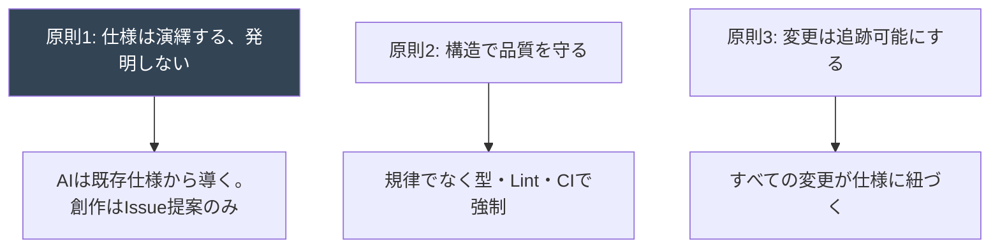

## 1.2 品質基準

| 基準 | 内容 |
|---|---|
| **正しさ** | 仕様（Bible）に一致する |
| **可読性** | 5年後の他者が読める。可読性 > 巧妙さ |
| **保守性** | 変更の影響範囲が限定される |
| **拡張性** | 「増やす」でなく「深める」拡張が容易（B0 §14.2） |
| **検証可能性** | 自動テストで正しさを確認できる |
| **思想適合** | Project Constitution の不可侵条項に反しない |

**品質バー**: Nintendo / Valve / Larian / Supercell / Riot 水準。
**設計参照**: Clean Architecture / DDD / Data Driven Design / ECS思想。

## 1.3 AI利用方針

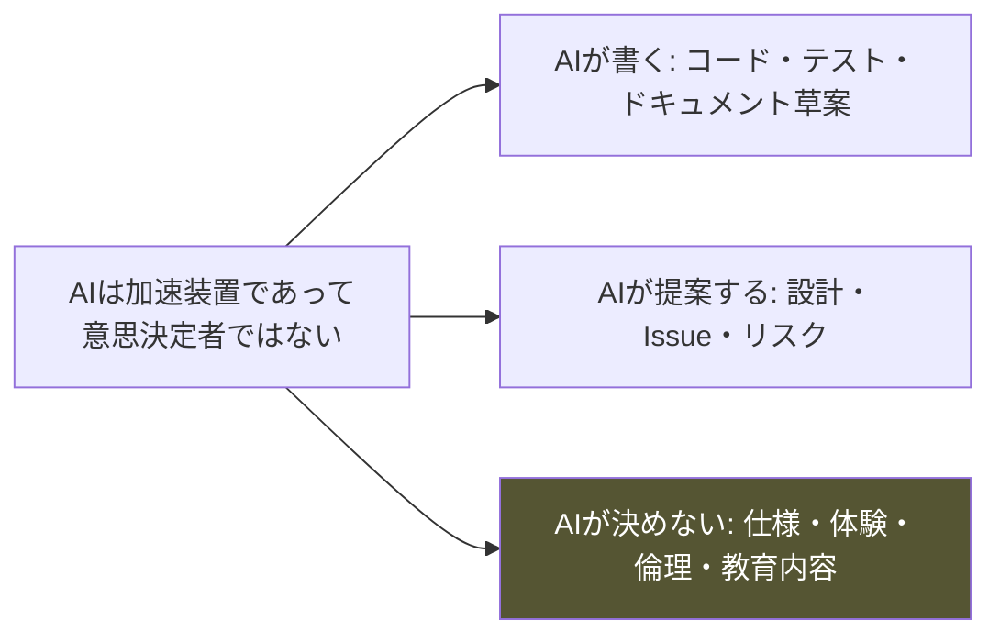

**大原則**: AIは仕様の**実装**を担い、仕様の**変更**を担わない。
変更が必要なら、実装せず**Issueとして提案**する（③⑪）。

---

# ② Source of Truth

> **目的**: 仕様の優先順位と矛盾時の判断ルールを確定する。
> **背景**: 12以上の文書と実装が併存する。どれが正か曖昧だと、AIは最も新しい/最も近い情報に引きずられ、上位仕様を破る。
> **採用理由**: B0 §0.3 の効力順位を開発全体に拡張する。単一の真実源がなければ長期開発は必ず分裂する。
> **運用ルール**: 迷ったら上位を採る。下位が上位と矛盾したら、下位を直す。
> **違反時の影響**: 仕様の分裂。実装が事実上の仕様になる（最悪の状態）。

## 2.1 仕様優先順位図

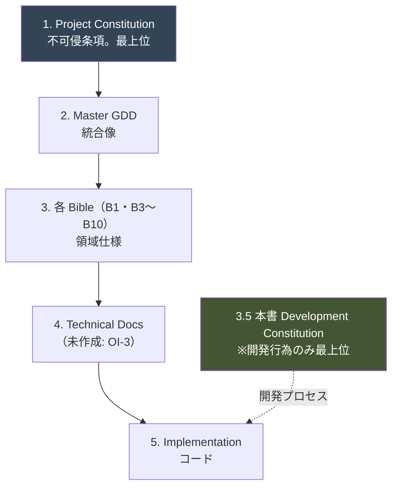

| 順位 | 文書 | 管轄 |
|---|---|---|
| 1 | Project Constitution | ゲームの是非。**改訂不可**（不可侵条項） |
| 2 | Master GDD | 全体整合。統合像 |
| 3 | 各 Bible | 領域仕様 |
| （3.5） | 本書 | 開発の進め方（ゲーム仕様には介入しない） |
| 4 | Technical Docs | 実装方針（⚠️ 未作成） |
| 5 | Implementation | コード。**仕様ではない** |

## 2.2 矛盾時の判断ルール

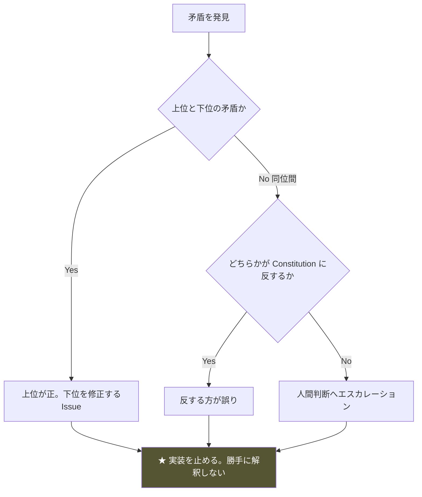

**絶対規則**

```
□ 矛盾を発見したら、実装を止める
□ AIが勝手に「どちらか正しそうな方」を選ばない
□ 上位が明確に勝つ場合のみAIが判断してよい
□ 同位間の矛盾は必ず人間へエスカレーション
□ 「実装が動いているから実装が正しい」は禁止（AN思想）
```

## 2.3 未定義事項の扱い

**仕様が存在しない領域は、AIが埋めてはならない。**

| 状況 | 対応 |
|---|---|
| 仕様が明確 | 実装する |
| 仕様が曖昧 | **要確認**として提示。実装しない |
| 仕様が不在 | **要設計**としてIssue提案。推測で埋めない |
| 仕様間で矛盾 | **要判断**としてエスカレーション |

**⚠️ Master GDD ⑮ の Open Issues（OI-1〜OI-10）が未定義事項の現在の一覧。**

---

# ③ AI Responsibilities

> **目的**: AIが担う責務・担ってはいけない責務・レビュー必須事項を確定する。
> **背景**: AIは高速だが、仕様の意図を誤解する。何を任せ何を任せないかの線引きが品質を決める。
> **採用理由**: Master GDD ⑭ DR-C「わかりにくいへの説明追加」のような、善意のAI逸脱を構造的に防ぐ。
> **運用ルール**: AIは④の人間責務に踏み込まない。踏み込む必要が生じたらIssue提案。
> **違反時の影響**: 仕様の無断変更。思想の破壊。

## 3.1 AIが担当する責務

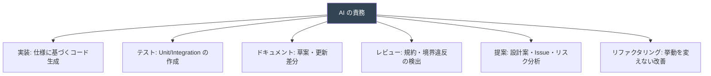

| 責務 | 条件 |
|---|---|
| コード実装 | 仕様が明確な場合のみ |
| テスト作成 | 実装とセット |
| ドキュメント更新 | ⑦に従う |
| 規約・境界レビュー | 機械的に検証可能な項目 |
| 設計提案 | **提案であって決定ではない** |
| リファクタリング | 挙動不変を保証できる場合 |

## 3.2 AIが担当してはいけない責務

| 禁止責務 | 理由 | 正しい行動 |
|---|---|---|
| 仕様変更 | ②。上位を破る | Issue提案 |
| ゲーム体験の判断 | ④。人間の領域 | 提示して委ねる |
| 倫理・教育内容の決定 | ④。憲章§9.2 | 監修へ |
| 猫の描写の正誤判断 | 監修が必要 | 監修へ |
| データ構造の勝手な変更 | B4 AA。破壊的 | Issue提案 |
| 命名・ファイル構成の勝手な変更 | 一貫性の破壊 | Issue提案 |
| 最適化の名目での挙動変更 | 意図せぬ副作用 | 提案してから |
| Constitution 例外の適用 | B0 §10.5 | 人間承認必須 |

## 3.3 AIのレビュー必須事項

**AIが自分の出力に対し、コミット前に必ず自己検証する。**

```
□ Project Constitution 不可侵条項 I-1〜I-10 に反していないか
□ 観測境界（L4→L2 参照）を破っていないか（B4 §0）
□ G-2（Player Knowledge の Simulation 非参照）を破っていないか
□ 禁止語彙（B0 §10.2）をコード・コメント・文字列に含んでいないか
□ Magic Number を導入していないか
□ God Class/Object を作っていないか
□ 循環依存を作っていないか
□ TODO を放置していないか
□ 説明なしの実装をしていないか
□ ⑭ Development Checklist を通過するか
```

**⚠️ 自己検証は⑫の Self Review 形式で出力に含める。**

---

# ④ Human Responsibilities

> **目的**: 人間が必ず判断する事項を確定する。
> **背景**: AIに委ねてはならない領域がある。特に体験・倫理・教育は、本作の存在意義そのものである。
> **採用理由**: 本作の成功は「プレイヤーの価値観の変化」（B0 §11.1）という、機械では判定不能な成果で測られる。
> **運用ルール**: 以下の判断をAIが下していたら、それは差し戻す。
> **違反時の影響**: 本作の存在意義の毀損。誤った知識の拡散。

## 4.1 人間が必ず判断する事項

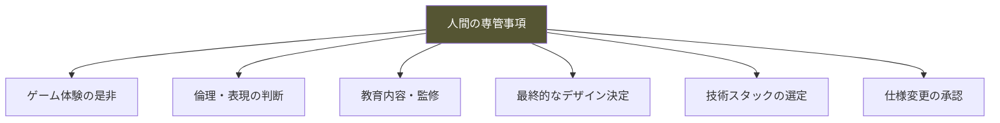

| 領域 | 判断内容 | 根拠 |
|---|---|---|
| **ゲーム体験** | 面白いか・感情曲線が機能するか | B1 ⑬ V-01〜V-11 |
| **倫理・表現** | 猫の描写・センシティブ表現 | B0 §9.3-9.4 |
| **教育内容** | 知識の正確性 | 監修必須（B5/B6 付録B） |
| **最終デザイン** | UI・アート・サウンドの最終形 | 職種リード |
| **技術選定** | フレームワーク・言語・基盤（OI-3） | アーキテクト |
| **仕様変更の承認** | Bible の改訂 | B0 §1.3 / §10.5 |
| **不可侵条項の解釈** | I-1〜I-10 のグレーゾーン | プロジェクト責任者 |
| **プレイテスト結果の解釈** | 「退屈 vs 静か」の判定 | B1 N-14 |

## 4.2 人間とAIの責務分担図

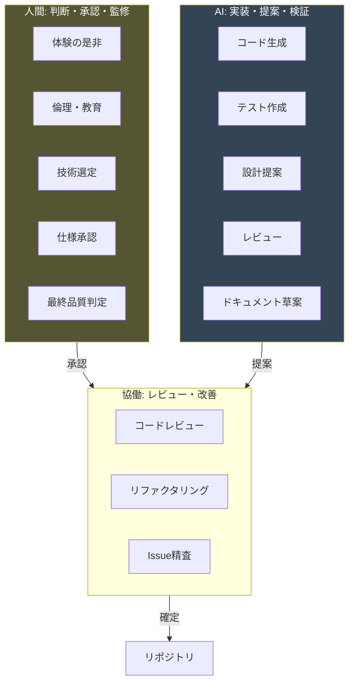

## 4.3 エスカレーションの原則

```
AIが判断に迷う → 実装を止める → 人間へ以下を添えてエスカレーション
  ・何が不明か
  ・関連する Bible の該当箇所
  ・考えられる選択肢（決めずに提示）
  ・各選択肢が触れる上位仕様
```

---

# ⑤ Coding Standards

> **目的**: 命名・コメント・構成・設計原則の採用ルールを定める。
> **背景**: 複数AIが書くと、スタイルが分裂する。統一規約がなければ可読性・保守性が崩壊する。
> **採用理由**: OSS品質・長期保守を前提とする。一貫性は個々の最適さより優先される。
> **運用ルール**: Linter/Formatter で機械的に強制。人間の好みで揺らさない。
> **違反時の影響**: 可読性の低下。レビューコストの増大。

## 5.1 設計原則の採用

| 原則 | 採用 | 適用方針 |
|---|---|---|
| **SOLID** | ✅ | 単一責任を最優先。B4 のモジュール責務に対応 |
| **DRY** | ✅ | ただし早すぎる抽象化を避ける（3回目で抽象化） |
| **KISS** | ✅ | 可読性 > 巧妙さ |
| **YAGNI** | ✅ | 「後で使うかも」の枠を作らない（B4 AA-94） |
| **Composition > Inheritance** | ✅ | 継承は避ける。合成を優先 |
| **Functional Core / Imperative Shell** | ✅ | Simulation は純粋関数中心、副作用は外殻 |
| **Data Driven Design** | ✅ | ロジックとデータの分離（B4 D-01） |
| **ECS思想** | 参考 | 猫AI・環境の設計参照。厳密採用は要判断 |

### Functional Core / Imperative Shell の適用（重要）

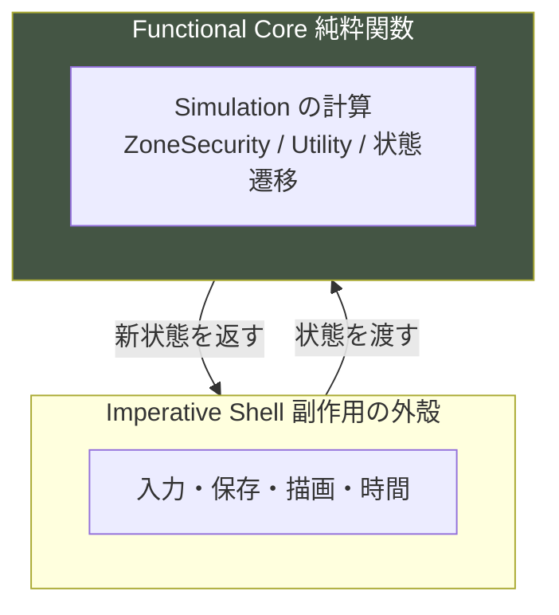

**採用理由**: B4 G-3（決定論性）は純粋関数と相性が良い。副作用を外殻に隔離すれば、Simulation を同一入力→同一出力でテストできる（B5 SR-3）。

## 5.2 命名規則

| 対象 | 規則 | 備考 |
|---|---|---|
| 変数・関数 | 意図を表す完全な名前 | 略語を避ける |
| 定数 | Magic Number 禁止。必ず命名 | ⑬ AD-11 |
| ブール | is/has/can/should 接頭 | |
| 内部数値変数 | ⚠️ 「好感度」「懐き度」を名前に使わない | B4 AA-120 |
| 層をまたぐ型 | 層を名前で示す（TruthX / PhenomenonX） | 境界の明示 |
| ファイル | 責務を反映 | B4 AA-115 |

**⚠️ 禁止語彙（B0 §10.2）はコード識別子にも適用**: `affection`, `tameLevel`, `clearFlag` 等は禁止。

## 5.3 コメント

```
□ 「何を」でなく「なぜ」を書く
□ 仕様への参照を書く（例: // B5 §2.3 ゲート則）
□ 観測境界・G-2 等の制約箇所には理由コメント必須
□ TODO は放置禁止。Issue番号を紐づける
□ コメントアウトされたコードをコミットしない
```

## 5.4 フォルダ構成

**層構造をディレクトリに反映する（B4 §2.1 に一致）。**

```
/data          L0 定義データ
/core          L1 基盤
/simulation    L2 真実層 🔒
/perception    L3 知覚層
/presentation  L4 表現層
/content       実データ（猫・家具・イベント・語彙）
/tests         テスト
```

**⚠️ ディレクトリ境界がビルド設定上の依存境界と一致すること（B4 §7.4）。**
`/presentation` から `/simulation` を import できない構成にする。

## 5.5 実装時の必須事項

```
□ 1関数1責務
□ 関数の行数を抑える（長大な関数を避ける）
□ ネストを深くしない
□ 副作用を Imperative Shell に隔離
□ すべての乱数は RNG Service 経由（B4 C-05）
□ すべての時間は Time System 経由（B4 C-02）
□ 状態変更は State Store 経由（B4 C-03）
```

---

# ⑥ Architecture Rules

> **目的**: 勝手に変更してはならない設計・依存方向・責務・データ構造を確定する。
> **背景**: アーキテクチャは初期には無害な逸脱が後期に修復不能になる。B4 の観測境界は本作の憲章保証そのもの。
> **採用理由**: B4 全体を開発規律として拘束力を持たせる。
> **運用ルール**: 以下はAIが変更してはならない。変更にはIssueと人間承認が必要。
> **違反時の影響**: 憲章 I-1 の破れ。数値のUI漏洩。

## 6.1 変更してはならない設計（凍結事項）

| 凍結事項 | 根拠 | 変更手続き |
|---|---|---|
| 5層アーキテクチャ | B4 §0.2 | 責任者承認 + Master GDD 改訂 |
| 観測境界（Perception Gateway） | B4 §0.1 | **変更不可** |
| 依存方向（上流→下流） | B4 ⑦ | 変更不可 |
| G-2（Knowledge の Simulation 非参照） | B4 §0.4 | 変更不可 |
| 決定論性（Seeded RNG） | B4 G-3 | 変更不可 |
| セーブ1スロット | B4 ⑨ | 変更不可（Pillar 4） |
| 時間粒度（Frame/Tick/Segment/Day/Trial） | B4 ⑥ | Master GDD 改訂 |

## 6.2 依存方向の絶対規則（B4 ⑦ 再掲）

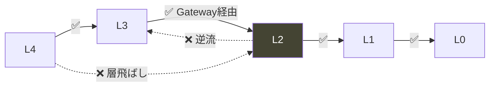

**CIで機械的に検証する（B4 §14.2）。** レビューだけに頼らない。

## 6.3 データ構造の禁止事項

| 禁止 | 根拠 |
|---|---|
| Phenomenon に数値フィールド | B4 AA-03 |
| 家具に効果値・ランク・耐久 | B10 AV-01/06/07 |
| 「好感度」変数 | B4 AA-120 |
| レベル・経験値の構造 | B4 AA-119 |
| 派生値の保存 | B4 AA-31 |
| 導出値（ZoneSecurity）の保存 | B10 §9.2 |

## 6.4 責務の凍結

**各モジュールの責務と禁止事項（B4 ③、B5-B10 の各定義）は変更不可。**
新しい責務が必要なら、既存モジュールに混ぜず、Issueで新モジュールを提案。

---

# ⑦ Documentation Rules

> **目的**: 変更時にどの文書を更新するかを確定する。
> **背景**: コードと文書の乖離は、文書を信用不能にする（B4 AA-110）。
> **採用理由**: 文書が唯一の真実源である以上、コード変更は文書変更を伴わねばならない。
> **運用ルール**: 文書更新のないコード変更はマージしない。
> **違反時の影響**: 仕様の分裂。実装が事実上の仕様になる。

## 7.1 変更種別と更新対象

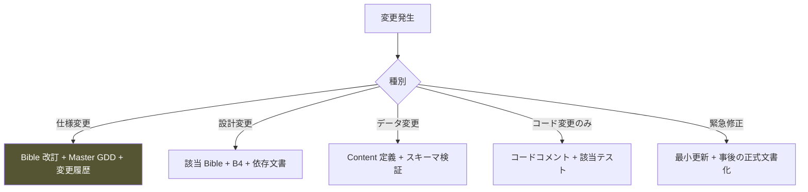

| 変更種別 | 更新対象 | 承認 |
|---|---|---|
| 仕様変更 | Bible + Master GDD + 改訂履歴 | 人間（責任者） |
| 設計変更 | 該当 Bible + B4 + 依存文書（⑯ Matrix参照） | 人間（アーキテクト） |
| データ変更 | Content 定義 + スキーマ | AI可（検証通過） |
| コード変更のみ | コメント + テスト | レビュー |
| 緊急修正 | 最小 + 事後正式化（⑪） | 事後承認 |

## 7.2 更新の連鎖（Dependency Matrix 準拠）

**下位を変えたら、Master GDD ⑯ の依存マトリクスで影響上流を確認し、整合を取る。**

## 7.3 変更履歴

```
すべての Bible 末尾の改訂履歴に、以下を記録（B0 §14.5）:
  ・改訂日 / 改訂者
  ・変更前 → 変更後
  ・変更理由（どの検証・事実に基づくか）
  ・影響を受ける下位文書
  ・「なぜやらなかったか」も記録（B0 §14.5）
```

---

# ⑧ Review Process

> **目的**: AI・人間・設計・コード・QAの各レビューの流れを定める。
> **背景**: 単一のレビューでは、思想違反・境界違反・バグを同時に捕捉できない。多層レビューが必要。
> **採用理由**: B0 §10.4 のレビューゲートを開発プロセスに具体化する。
> **運用ルール**: ゲートを飛ばさない。上流ゲートで落ちたら下流に進めない。
> **違反時の影響**: 憲章違反の混入。品質の劣化。

## 8.1 レビュー図

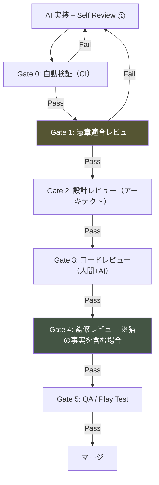

## 8.2 各ゲートの責務

| ゲート | 検証者 | 内容 | 落ちたら |
|---|---|---|---|
| **G0 自動検証** | CI | 依存グラフ・境界・再現性・禁止語・テスト | 実装へ差し戻し |
| **G1 憲章適合** | AI + 人間 | 不可侵条項・Pillar・AP/AA/AV/AN/AL | 実装へ差し戻し |
| **G2 設計** | アーキテクト | 責務・依存・データ構造 | 設計見直し |
| **G3 コード** | 人間 + AI | 規約・可読性・保守性 | 修正 |
| **G4 監修** | 監修者 | 猫の事実の正確性 | 内容修正 |
| **G5 QA/Play** | QA + 人間 | 体験・回帰 | 差し戻し |

**⚠️ G1 は面白さや実装難度を議論しない。憲章遵守のみ（B0 §10.4）。**
**⚠️ G4 は猫に関する事実を含む変更でのみ必須。含まなければスキップ可。**

## 8.3 レビューの優先確認順（B4 §付録B.3）

```
1. 観測境界（AQ001〜016）← 破れたら全て無意味
2. 憲章適合（AQ121〜134）
3. 依存関係（AQ017〜030）
4. その他
```

---

# ⑨ Git Workflow

> **目的**: ブランチ・コミット・PR・タグ・バージョンの運用を定める。
> **背景**: 複数AI・複数人が並行作業する。規律なきGit運用は履歴を追跡不能にする。
> **採用理由**: trunk に近い運用で、小さく・頻繁に・追跡可能に統合する。
> **運用ルール**: main は常にリリース可能。直接コミット禁止。
> **違反時の影響**: 履歴の破壊。リリース不能。

## 9.1 Git運用図

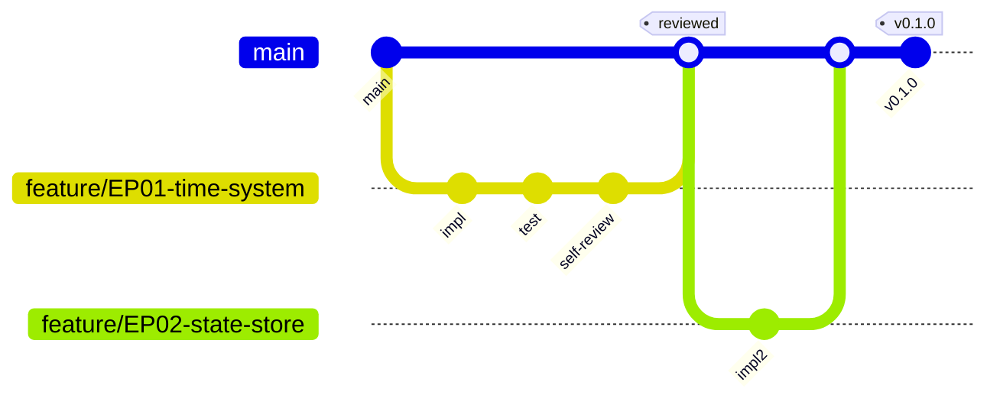

## 9.2 ブランチ運用

| ブランチ | 用途 | 寿命 |
|---|---|---|
| `main` | 常にリリース可能 | 永続 |
| `feature/<issue-id>-<slug>` | 1 Issue = 1ブランチ | Issue完了で削除 |
| `fix/<issue-id>-<slug>` | バグ修正 | 同上 |
| `hotfix/<slug>` | 緊急修正（⑪） | 即マージ |
| `docs/<slug>` | 文書のみ | 同上 |

**⚠️ main への直接コミット禁止。** すべてPR経由。

## 9.3 コミットルール

```
形式: <type>(<scope>): <subject>   [refs #issue]

type : feat / fix / refactor / test / docs / chore / perf
scope: 層またはモジュール（simulation / perception / core 等）
subject: 命令形・簡潔

例: feat(simulation): add ZoneSecurity computation [refs #42]
```

**規則**

```
□ 1コミット1論理変更
□ Issue番号を紐づける
□ 禁止語彙を含めない（B0 §10.2）
□ コミットメッセージ末尾に規定の Co-Authored-By を付す（本プロジェクトの規約に従う）
□ 秘密情報をコミットしない
```

## 9.4 Pull Request

| 項目 | 必須 |
|---|---|
| 紐づく Issue | ✅ |
| ⑫ Self Review の記載 | ✅ |
| ⑭ Development Checklist の結果 | ✅ |
| テストの追加 | ✅ |
| 影響を受ける文書の更新 | ✅（⑦） |
| CI 全通過 | ✅ |
| レビュアー承認 | ✅（⑧ G1-G3） |

## 9.5 バージョン管理

```
Semantic Versioning: MAJOR.MINOR.PATCH

MAJOR: 仕様レベルの重大変更（Bible 改訂を伴う）
MINOR: 機能追加（Phase 完了時など）
PATCH: バグ修正

タグ: リリースごとに v<version>。Milestone 完了時に付与
```

---

# ⑩ Testing Policy

> **目的**: 各テスト種別の品質保証ルールを定める。
> **背景**: 本作は決定論的シミュレーションであり、テスト適性が高い。同時に「体験」は自動テストで測れない。
> **採用理由**: 自動化可能な正しさは自動化し、体験は人間が検証する。
> **運用ルール**: テストなきコードはマージしない。
> **違反時の影響**: 回帰の見逃し。憲章違反の混入。

## 10.1 テストの種別と対象

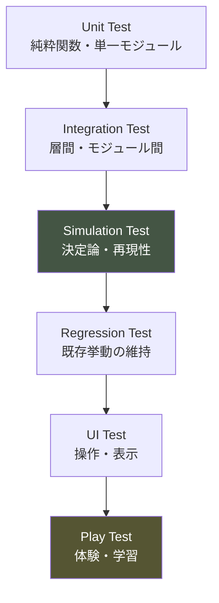

| 種別 | 対象 | 自動化 | 検証者 |
|---|---|---|---|
| **Unit** | Functional Core・計算式 | ✅ | AI/CI |
| **Integration** | Gateway・Event Bus・Save往復 | ✅ | AI/CI |
| **Simulation** | 同一シード→同一結果（SR-3） | ✅ | CI |
| **Regression** | 既存の挙動 | ✅ | CI |
| **UI** | 片手操作・階層3以内・数値非表示 | 半自動 | QA |
| **Play** | 体験・感情曲線・学習（V-01〜V-11） | ❌ | 人間 |

## 10.2 必須の特殊テスト（B4 §14.2）

```
□ 観測境界テスト: L2 の数値が L4 に到達しないことを検証
□ G-2 テスト: Player Knowledge が Simulation を import しないことを静的検証
□ 再現性テスト: 同一シードで全変数一致
□ セーブ往復テスト: 保存→復元→状態一致
□ 禁止語検出: 識別子・文字列に禁止語彙がないか
□ デバッグコード検出: 本番ビルドに Simulation 直参照が残らないか
```

## 10.3 Simulation Test の体験検証（B5 §10.2）

```
□ Day 1-5 で猫は姿をほとんど見せない
□ 過干渉で悪循環に入る（発生率 60-80%）
□ 悪循環から必ず脱出できる（詰みなし）
□ 待つと1〜3日、放置は6〜8日で回復
□ 探索・遊びが Day 10-20 に初出
□ Trust が単調増加しない
```

## 10.4 Play Test の判定基準（B1 ⑬）

```
□ V-01 今、画面に何が見えますか（退屈 vs 静かの判定）
□ V-05 一言で説明（「懐かせるゲーム」なら失敗）
□ V-06/07 何を学び、どうわかったか
□ V-10 猫の見方は変わったか
```

**⚠️ Play Test は人間専管（④）。AIは代替できない。**

---

# ⑪ Change Management

> **目的**: 仕様・設計・データ・緊急の各変更手順を定める。
> **背景**: 変更は避けられない。無管理な変更が思想を崩す。
> **採用理由**: すべての変更を追跡可能にし、上位仕様への影響を事前評価する。
> **運用ルール**: 変更は種別に応じた手順を経る。飛ばさない。
> **違反時の影響**: 仕様の分裂。整合性の崩壊。

## 11.1 変更手順のフロー

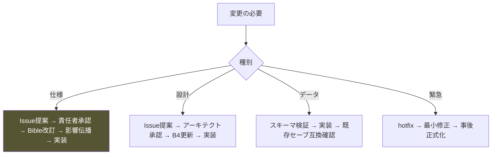

## 11.2 仕様変更手順

```
1. 変更をIssueとして提案（AIは実装しない）
2. Project Constitution 不可侵条項に反しないか確認
3. 責任者が承認（B0 §1.3 / §10.5）
4. Bible を改訂（改訂履歴に記録）
5. Master GDD ⑯ で影響上流を特定
6. 影響文書をすべて更新
7. 実装
8. 全ゲートを通す（⑧）
```

**⚠️ 不可侵条項（I-1〜I-10）の変更提案は却下される。それは別のゲームである（B0 §1.2）。**

## 11.3 緊急修正手順

```
1. hotfix ブランチ
2. 最小の修正（挙動を広げない）
3. リリース
4. 事後に正式な変更管理へ載せる（⑪.2）
5. なぜ緊急になったかを記録
```

**⚠️ 緊急修正でも観測境界・G-2・不可侵条項は破らない。** 緊急を理由に品質を下げない。

## 11.4 データ変更手順（後方互換）

```
□ スキーマ検証を通す
□ 既存セーブが復元可能か確認（B4 §9.6 マイグレーション）
□ 現象語彙は追記専用（B4 §10.4。意味変更・削除・ID再利用禁止）
```

---

# ⑫ AI Prompt Standards

> **目的**: AIへの依頼テンプレート・禁止事項・期待出力・レビュー方法を定める。
> **背景**: 曖昧なプロンプトは、AIに仕様の空白を推測で埋めさせる。
> **採用理由**: 依頼の形式を固定することで、AIの逸脱を入口で防ぐ。
> **運用ルール**: 実装依頼は必ず本テンプレートを使う。
> **違反時の影響**: 仕様の無断変更。手戻り。

## 12.1 実装依頼テンプレート

```markdown
## Task
<何を実装するか。1文>

## Source of Truth
- 関連 Bible: <B番号 §章>
- 関連 Issue: <#番号>

## Constraints
- 変更してよい: <ファイル/モジュール>
- 変更してはいけない: <凍結事項>

## Definition of Done
- <完了条件>

## If spec is missing
- 実装せず、Issue として提案せよ（推測禁止）
```

## 12.2 AI出力の必須形式（実装時）

**Chief AI Game Developer ペルソナ準拠。実装依頼への応答は以下の順で出力する。**

```
## Objective        目的
## Dependencies      依存する Bible・システム
## Design Decision   設計判断（なぜこの実装か）
## Implementation Plan  実装計画
## Risks             リスク
## Test Plan         テスト計画
## Code              コード
## Self Review       自己検証（③3.3 の項目）
## Documentation Updates  更新すべき文書
```

## 12.3 AIへの禁止事項

```
❌ 仕様変更
❌ 勝手な最適化（挙動変更を伴うもの）
❌ ファイル構成・命名・データ構造の勝手な変更
❌ Magic Number の導入
❌ God Object / God Class の生成
❌ 循環依存の導入
❌ 説明なしの実装
❌ TODO の放置
❌ 仕様の空白の推測埋め
❌ 複数の無関係な変更を1つにまとめる
```

## 12.4 AI出力のレビュー方法

```
1. Self Review（⑫.2）が含まれているか
2. ③3.3 の自己検証項目に答えているか
3. ⑭ Development Checklist の該当項目を通過するか
4. 仕様参照が明記されているか
5. 未定義事項を推測で埋めていないか
```

---

# ⑬ Anti Development Rules

> **目的**: 絶対に行ってはならない開発行為を列挙する。
> **背景**: 逸脱の多くは悪意でなく善意（「良かれと思って」）から生じる。事前列挙が唯一の防御。
> **採用理由**: 判断を「リストにあるか」で終わらせ、議論を減らす。
> **運用ルール**: 🔴 に該当したら即座に中止。
> **違反時の影響**: 各項目に記載。

## 凡例

```
🔴 憲章・上位仕様の破壊  🟠 品質・保守性の破壊  🟡 プロセスの劣化
```

## A. 仕様・設計の逸脱（AD-01〜AD-20）

| # | 禁止行為 | 度 | 理由 |
|---|---|---|---|
| AD-01 | 仕様を勝手に変更する | 🔴 | ②。上位の破壊 |
| AD-02 | 設計を勝手に変更する | 🔴 | ⑥ |
| AD-03 | 実装方針を勝手に変える | 🔴 | ③ |
| AD-04 | 仕様の空白を推測で埋める | 🔴 | ②2.3 |
| AD-05 | 不可侵条項に例外を適用する | 🔴 | B0 §1.2 |
| AD-06 | 観測境界を破る（L4→L2参照） | 🔴 | B4 §0 |
| AD-07 | G-2 を破る | 🔴 | B4 §0.4 |
| AD-08 | 数値をUIに露出する | 🔴 | 憲章 I-1 |
| AD-09 | 「好感度」等の変数を作る | 🔴 | B4 AA-120 |
| AD-10 | レベル・経験値を実装する | 🔴 | 憲章 I-3 |
| AD-11 | Magic Number を使う | 🟠 | 保守性 |
| AD-12 | データ構造を勝手に変える | 🔴 | ⑥6.3 |
| AD-13 | 命名を勝手に変える | 🟠 | 一貫性 |
| AD-14 | ファイル構成を勝手に変える | 🟠 | 一貫性 |
| AD-15 | 実装を仕様として扱う | 🔴 | ②。「動くから正しい」禁止 |
| AD-16 | 矛盾を勝手に解決する | 🔴 | ②2.2 |
| AD-17 | 決定論性を壊す（Math.random 直接使用） | 🔴 | B4 C-05 |
| AD-18 | 時間を独自にカウントする | 🟠 | B4 AA-37 |
| AD-19 | 状態を二重管理する | 🟠 | B4 AA-25 |
| AD-20 | 「後で使うかも」の空枠を作る | 🟠 | B4 AA-94 |

## B. コード品質（AD-21〜AD-40）

| # | 禁止行為 | 度 | 理由 |
|---|---|---|---|
| AD-21 | God Object を作る | 🟠 | 単一責任違反 |
| AD-22 | God Class を作る | 🟠 | 同上 |
| AD-23 | 循環依存を作る | 🔴 | B4 DR-6 |
| AD-24 | 継承で機能を拡張する | 🟠 | Composition優先 |
| AD-25 | 早すぎる抽象化 | 🟠 | KISS/YAGNI |
| AD-26 | 深いネスト | 🟡 | 可読性 |
| AD-27 | 長大な関数 | 🟠 | 単一責任 |
| AD-28 | 副作用を Core に混ぜる | 🟠 | ⑤5.1 |
| AD-29 | any/unknown で境界を突破 | 🔴 | B4 AA-19 |
| AD-30 | 動的importで静的解析を回避 | 🟠 | B4 AA-18 |
| AD-31 | グローバル変数・シングルトン濫用 | 🟠 | B4 AA-14 |
| AD-32 | 例外の握りつぶし | 🟠 | B4 AA-103 |
| AD-33 | エラー時に進行を巻き戻す | 🔴 | Pillar 4 |
| AD-34 | 説明なしの巧妙なコード | 🟠 | 可読性 > 巧妙さ |
| AD-35 | コメントアウトコードの残置 | 🟡 | 5.3 |
| AD-36 | 未使用コードの残置 | 🟡 | 保守性 |
| AD-37 | 無効化のないキャッシュ | 🟠 | B4 AA-97 |
| AD-38 | 時間ベースのキャッシュ失効 | 🔴 | 再現性（B4 AA-98） |
| AD-39 | 無制限に増える配列・ログ | 🟠 | B4 AA-99 |
| AD-40 | 挙動を変えるリファクタリング | 🟠 | 定義違反 |

## C. テスト・検証（AD-41〜AD-55）

| # | 禁止行為 | 度 | 理由 |
|---|---|---|---|
| AD-41 | テストなしでマージ | 🟠 | ⑩ |
| AD-42 | テスト用に境界を緩める | 🔴 | B4 AA-10 |
| AD-43 | 再現性テストを省く | 🔴 | SR-3 |
| AD-44 | セーブ往復テストを省く | 🟠 | 進行喪失リスク |
| AD-45 | 観測境界テストを省く | 🔴 | I-1 |
| AD-46 | 失敗するテストをスキップして放置 | 🟠 | 回帰 |
| AD-47 | テストを実装に合わせて甘くする | 🟠 | 検証の無意味化 |
| AD-48 | Play Test をAIが代替する | 🔴 | ④。人間専管 |
| AD-49 | 「退屈」への対処で刺激を足す | 🔴 | B1 N-14 |
| AD-50 | 「わかりにくい」への対処で説明を足す | 🔴 | B7 AL-87 |
| AD-51 | CI をスキップしてマージ | 🟠 | ⑧ |
| AD-52 | 禁止語検出を無効化 | 🔴 | B0 §10.2 |
| AD-53 | デバッグ用の L2 直参照を残す | 🔴 | B4 AA-09 |
| AD-54 | 監修未了の猫の事実を実装 | 🔴 | 憲章§9.2 |
| AD-55 | 回帰テストなしで既存挙動を変える | 🟠 | 回帰 |

## D. Git・プロセス（AD-56〜AD-72）

| # | 禁止行為 | 度 | 理由 |
|---|---|---|---|
| AD-56 | main への直接コミット | 🟠 | ⑨ |
| AD-57 | Issue に紐づかない変更 | 🟠 | 追跡不能 |
| AD-58 | 複数の無関係な変更を1コミットに | 🟠 | 履歴の可読性 |
| AD-59 | 巨大PR（レビュー不能） | 🟠 | ⑧ |
| AD-60 | Self Review なしのPR | 🟠 | ⑫ |
| AD-61 | 文書更新なしの仕様/設計変更 | 🔴 | ⑦ |
| AD-62 | 秘密情報のコミット | 🔴 | セキュリティ |
| AD-63 | レビューゲートの飛ばし | 🟠 | ⑧ |
| AD-64 | 承認前のマージ | 🟠 | ⑧ |
| AD-65 | 緊急を口実に品質を下げる | 🔴 | ⑪3 |
| AD-66 | 変更理由の未記録 | 🟡 | B0 §14.5 |
| AD-67 | 「なぜやらなかったか」の未記録 | 🟡 | B0 §14.5 |
| AD-68 | コミットメッセージに禁止語彙 | 🟠 | B0 §10.2 |
| AD-69 | 履歴の改竄（force push を共有ブランチに） | 🔴 | 履歴の破壊 |
| AD-70 | TODO を Issue なしで放置 | 🟡 | 5.3 |
| AD-71 | バージョン規則の無視 | 🟡 | ⑨5 |
| AD-72 | ドキュメントと実装の乖離放置 | 🟠 | B4 AA-110 |

## E. AI固有の逸脱（AD-73〜AD-88）

| # | 禁止行為 | 度 | 理由 |
|---|---|---|---|
| AD-73 | 人間専管事項をAIが判断 | 🔴 | ④ |
| AD-74 | 体験の是非をAIが決める | 🔴 | ④ |
| AD-75 | 倫理・教育をAIが決める | 🔴 | ④ |
| AD-76 | 技術スタックをAIが勝手に選定 | 🔴 | ④・OI-3 |
| AD-77 | 猫の事実をAIが正誤判断 | 🔴 | 監修 |
| AD-78 | 迷いを隠して実装を進める | 🔴 | ④3。エスカレーション義務 |
| AD-79 | 仕様参照なしの実装 | 🟠 | ⑫ |
| AD-80 | 提案を実装として出す | 🔴 | ③ |
| AD-81 | 最新情報に引きずられ上位を破る | 🔴 | ② |
| AD-82 | 一貫性より個別最適を優先 | 🟠 | ⑤ |
| AD-83 | ハルシネーションした仕様で実装 | 🔴 | ② |
| AD-84 | 存在しない Bible を根拠にする | 🔴 | ②。B2/B11 は未作成 |
| AD-85 | Self Review を形骸化させる | 🟠 | ⑫ |
| AD-86 | プロンプト外の変更を混ぜる | 🟠 | スコープ逸脱 |
| AD-87 | 「良かれと思って」の逸脱 | 🟠 | 逸脱の主因 |
| AD-88 | 猫を擬人化する実装 | 🔴 | 原則4 |

## F. パフォーマンス・Web（AD-89〜AD-100）

| # | 禁止行為 | 度 | 理由 |
|---|---|---|---|
| AD-89 | 毎フレームでの Simulation 更新 | 🟠 | B4 AA-39 |
| AD-90 | 実時間で猫の状態を変える | 🟠 | AP-17 |
| AD-91 | 毎フレームの文字列生成 | 🟡 | GC負荷 |
| AD-92 | 起動時の全アセット読込 | 🟠 | B4 AA-100 |
| AD-93 | 性能のために観測情報を削る | 🔴 | Pillar 1 |
| AD-94 | 性能のために演出を足す | 🟡 | Pillar 6（逆説） |
| AD-95 | ログイン必須化 | 🟠 | 憲章§9.7 |
| AD-96 | 外部への無断データ送信 | 🔴 | B4 AA・プライバシー |
| AD-97 | 現実の行動追跡 | 🔴 | AP-86 |
| AD-98 | 通信断で進行を失う実装 | 🔴 | 憲章§9.7 |
| AD-99 | インストール必須化 | 🟠 | 憲章§9.7 |
| AD-100 | スマホ片手操作を破る実装 | 🟠 | 憲章§9.5 |

## G. 教育・思想（AD-101〜AD-108）

| # | 禁止行為 | 度 | 理由 |
|---|---|---|---|
| AD-101 | 教育目的を忘れた実装 | 🔴 | Mission |
| AD-102 | 猫を攻略対象にする実装 | 🔴 | 原則10 |
| AD-103 | プレイヤーを責めるテキスト | 🔴 | I-10 |
| AD-104 | 報酬で学習を誘導する | 🔴 | I-7 |
| AD-105 | 現象より先に知識を提示 | 🔴 | 憲章§7.2 |
| AD-106 | クイズ・正誤判定の実装 | 🔴 | Pillar 2 |
| AD-107 | 猫の内心を断定する実装 | 🔴 | 原則4 |
| AD-108 | 「見送り」を失敗として実装 | 🔴 | I-9 |

**合計 108 項目**

---

# ⑭ Development Checklist

> **目的**: AIがコードを書く前に確認する YES/NO チェックリスト。
> **背景**: 実装前の確認が、手戻りと逸脱を最も安く防ぐ。
> **採用理由**: ③3.3 と⑫を実行可能な形にする。
> **運用ルール**: ★ は必須。1つでもNOなら実装に着手しない。
> **違反時の影響**: 憲章違反の混入。

## A群: 着手前（DC001〜DC016）

```
□ DC001 ★ 関連する Bible を特定したか
□ DC002 ★ 依存するシステムを特定したか
□ DC003 ★ 仕様が明確か（曖昧なら着手しない）
□ DC004 ★ 仕様の空白を推測で埋めようとしていないか
□ DC005 ★ 上位仕様（Constitution/GDD）に反していないか
□ DC006 ★ 変更してよい範囲を確認したか
□ DC007 ★ 凍結事項（⑥6.1）に触れていないか
□ DC008 ★ 紐づく Issue があるか
□ DC009    影響を受ける下流を Dependency Matrix で確認したか
□ DC010    未定義事項（OI-1〜10）に該当しないか
□ DC011    存在しない Bible（B2/B11）を根拠にしていないか
□ DC012    人間専管事項（④）に踏み込んでいないか
□ DC013    監修が必要な内容を含むか判定したか
□ DC014    テスト方針を先に決めたか
□ DC015    ブランチを切ったか
□ DC016    プロンプトテンプレート（⑫）に沿った依頼か
```

## B群: 憲章適合（DC017〜DC032）★全必須

```
□ DC017 ★ 不可侵条項 I-1〜I-10 に反しないか
□ DC018 ★ 数値をUIに露出しないか（I-1）
□ DC019 ★ 猫を命令で動かさないか（I-2）
□ DC020 ★ レベル・経験値を作らないか（I-3）
□ DC021 ★ 勝敗・ゲームオーバーを作らないか（I-4）
□ DC022 ★ 課金・ガチャを作らないか（I-5）
□ DC023 ★ 猫への加害を実装しないか（I-6）
□ DC024 ★ 報酬で学習を誘導しないか（I-7）
□ DC025 ★ 実在団体を敵役にしないか（I-8）
□ DC026 ★ 見送りを失敗にしないか（I-9）
□ DC027 ★ プレイヤーを責めないか（I-10）
□ DC028 ★ Pillar 1〜7 に反しないか
□ DC029 ★ 禁止語彙を識別子・文字列に含まないか
□ DC030 ★ 猫を擬人化していないか
□ DC031 ★ 猫を攻略対象にしていないか
□ DC032 ★ 教育目的を満たすか
```

## C群: アーキテクチャ（DC033〜DC048）

```
□ DC033 ★ 観測境界を破らないか（L4→L2）
□ DC034 ★ Gateway 以外で L2→L3 出力しないか
□ DC035 ★ Phenomenon に数値を含めないか
□ DC036 ★ Player Knowledge が Simulation を参照しないか（G-2）
□ DC037 ★ 循環依存を作らないか
□ DC038 ★ 依存方向（上流→下流）を守るか
□ DC039 ★ 状態を State Store 経由で変更するか
□ DC040 ★ 乱数を RNG Service 経由にするか
□ DC041 ★ 時間を Time System 経由にするか
□ DC042 ★ Command 経由で Simulation を変更するか
□ DC043    同層内の相互参照を Event Bus 経由にするか
□ DC044    派生値・導出値を保存しないか
□ DC045    データ構造を勝手に変えていないか
□ DC046    命名・ファイル構成を勝手に変えていないか
□ DC047    ディレクトリが層構造に一致するか
□ DC048    モジュールの責務を混ぜていないか
```

## D群: コード品質（DC049〜DC064）

```
□ DC049 ★ Magic Number がないか
□ DC050 ★ God Object/Class がないか
□ DC051 ★ 単一責任か
□ DC052 ★ Composition を優先したか
□ DC053 ★ 副作用を Imperative Shell に隔離したか
□ DC054 ★ Data Driven か（ロジックとデータの分離）
□ DC055    早すぎる抽象化をしていないか
□ DC056    ネストが深すぎないか
□ DC057    関数が長すぎないか
□ DC058    any/unknown で境界を突破していないか
□ DC059    可読性 > 巧妙さか
□ DC060    「なぜ」のコメントがあるか
□ DC061    仕様参照コメントがあるか
□ DC062    TODO を放置していないか
□ DC063    コメントアウトコードがないか
□ DC064    未使用コードがないか
```

## E群: テスト（DC065〜DC078）

```
□ DC065 ★ Unit Test を書いたか
□ DC066 ★ テストが実装に合わせて甘くなっていないか
□ DC067 ★ 決定論性を検証したか（該当時）
□ DC068 ★ 観測境界テストを含むか（該当時）
□ DC069 ★ セーブ往復テストを含むか（該当時）
□ DC070 ★ 回帰テストを壊していないか
□ DC071    Integration Test が必要か判定したか
□ DC072    Simulation Test が必要か判定したか
□ DC073    体験検証（B5 §10.2）に該当するか
□ DC074    Play Test を人間に委ねるべき部分を分離したか
□ DC075    CI が全通過するか
□ DC076    禁止語検出を通るか
□ DC077    デバッグコードが残っていないか
□ DC078    エッジケース（通信断・中断）を考慮したか
```

## F群: パフォーマンス・Web（DC079〜DC088）

```
□ DC079 ★ 毎フレームで Simulation を回していないか
□ DC080 ★ 実時間で猫の状態を変えていないか
□ DC081 ★ 通信断で進行を失わないか
□ DC082 ★ 性能のために観測情報を削っていないか
□ DC083    起動時に全アセットを読み込んでいないか
□ DC084    無効化のないキャッシュがないか
□ DC085    時間ベースのキャッシュ失効がないか
□ DC086    無制限に増える配列がないか
□ DC087    スマホ片手操作を破っていないか
□ DC088    外部への無断送信がないか
```

## G群: プロセス・完了（DC089〜DC100）

```
□ DC089 ★ Self Review（⑫.2）を出力に含めたか
□ DC090 ★ 更新すべき文書を特定したか
□ DC091 ★ 仕様/設計変更なら文書を更新したか
□ DC092 ★ Issue に紐づくコミットか
□ DC093 ★ 完了条件（Definition of Done）を満たすか
□ DC094    PR にチェックリスト結果を記載したか
□ DC095    変更が Issue のスコープ内か
□ DC096    レビューゲート（⑧）を飛ばしていないか
□ DC097    迷いがあればエスカレーションしたか
□ DC098    「5年後も保守できるか」を自問したか
□ DC099    ⑬ Anti Development の 🔴項目がゼロか
□ DC100    この変更を1文で正当化できるか（仕様参照つき）
```

**合計 100 項目**

---

## 改訂履歴

| バージョン | 日付 | 変更内容 |
|---|---|---|
| 1.0 | 2026-07-24 | 初版策定 |

---

> **AIは、速く間違える力を持つ。**
> **この憲章は、その速さを、正しい方向にだけ向けるためにある。**
