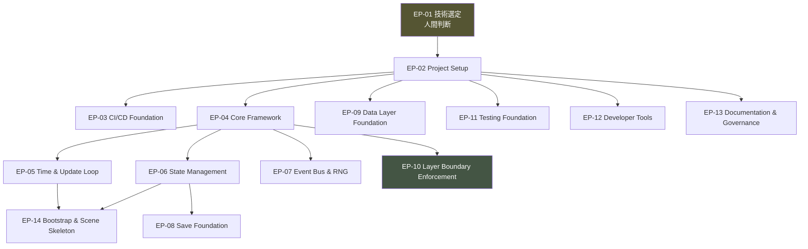
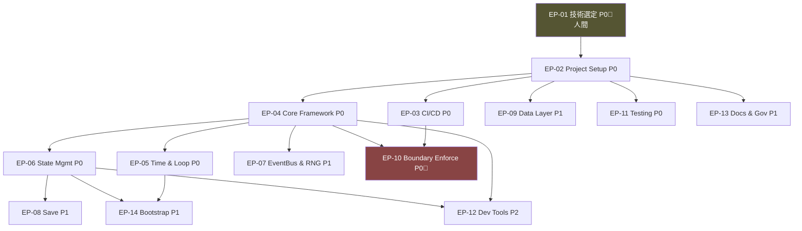
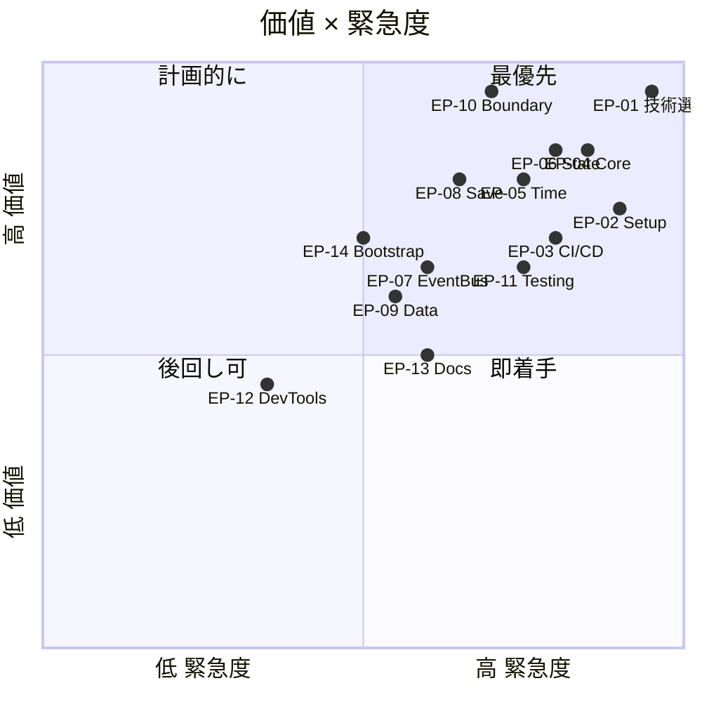
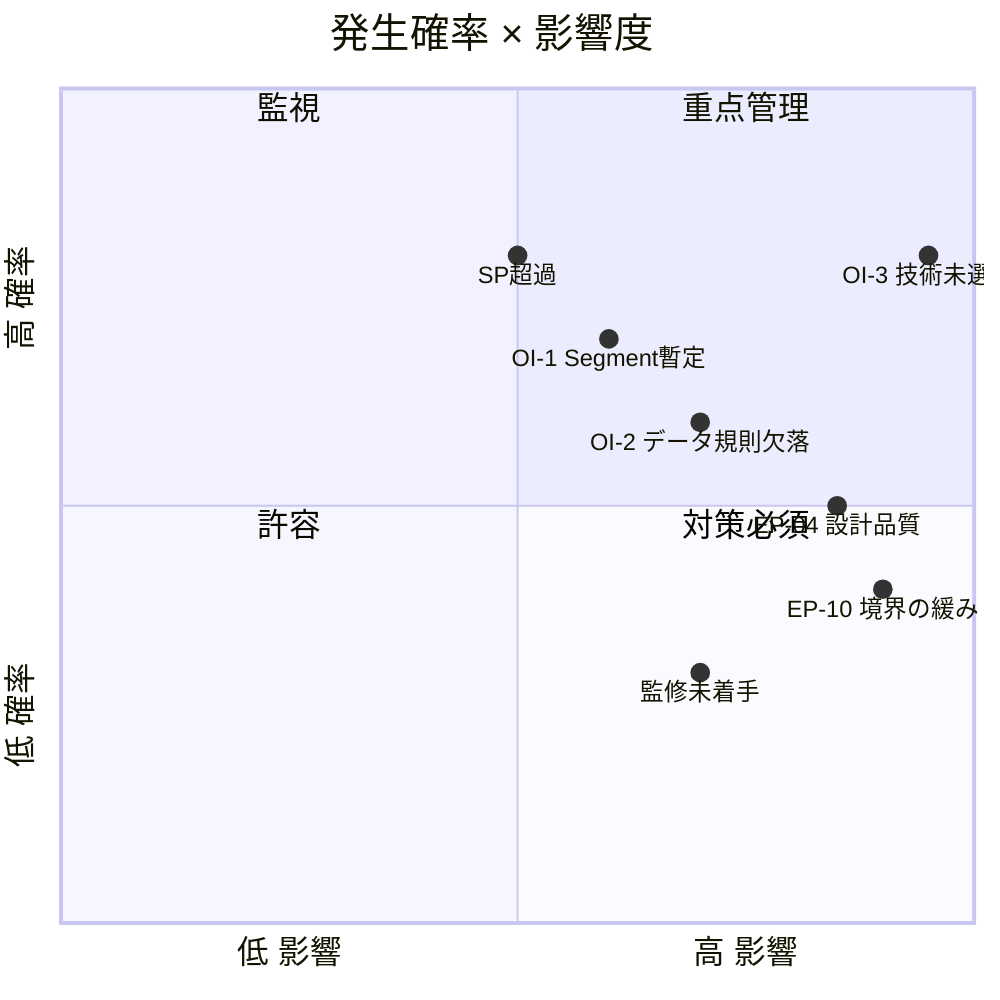

# 保護猫トライアル30日 — Sprint 1: Project Foundation Epics v1.0

**Document Type**: Sprint 1 Epic 設計（Issue化・コードは含まない）
**Sprint Goal**: 「ゲーム」ではなく「ゲーム開発が始められる状態」を完成させる
**Source of Truth**: Project Constitution / Master GDD / Development Constitution / 全 Bible
**Scope**: Sprint 1 で必要になる Epic のみ。Issue分解・実装は次段階
**Last Updated**: 2026-07-24

---

## ⚠️ Sprint 1 の前提と制約

```
■ 本書は Epic 設計のみ。Issue・コード・設計変更・新仕様を含まない（指示準拠）
■ Sprint 1 は基盤構築。ゲームプレイ機能（猫AI・観察・イベント）は Sprint 2 以降
■ Development Constitution ⑥ の凍結事項を、基盤として先に実体化する
```

### 🔴 Sprint 1 開始のブロッカー（Master GDD ⑮ より）

| ID | 未解決 | 影響 |
|---|---|---|
| **OI-3** | 技術スタック未定義 | **Sprint 1 の大半が着手不能** |
| OI-1 | Core Gameplay Loop Bible 未作成 | Sprint 2 に影響（Sprint 1 は可） |
| OI-2 | Data Architecture Bible 未作成 | データ層 Epic に影響 |

> **⚠️ 技術選定（OI-3）は Development Constitution ④ により人間専管事項である。**
> **AIが勝手にスタックを決めない。よって EP-01 を「技術選定の意思決定 Epic」として先頭に置き、後続を依存させる。**

---

## 目次

- [Sprint 1 全体像](#sprint-1-全体像)
- [Epic 一覧](#epic-一覧)
- [各 Epic 詳細](#各-epic-詳細)
- [① Epic Dependency Diagram](#-epic-dependency-diagram)
- [② Critical Path](#-critical-path)
- [③ Sprint Timeline](#-sprint-timeline)
- [④ Epic Priority Matrix](#-epic-priority-matrix)
- [⑤ Risk Matrix](#-risk-matrix)

---

## Sprint 1 全体像



**Sprint 1 の成果物 = 空のゲームが起動し、時間が進み、状態が保存・復元でき、層境界がCIで守られ、テストが回る状態。**

---

## Epic 一覧

| ID | Epic | 優先 | SP | リスク | 主管 |
|---|---|---|---|---|---|
| **EP-01** | Technical Foundation Decision | P0 | 5 | 🔴 高 | 人間 |
| **EP-02** | Project Setup & Repository | P0 | 8 | 🟢 低 | AI+人間 |
| **EP-03** | CI/CD Foundation | P0 | 13 | 🟠 中 | AI+人間 |
| **EP-04** | Core Framework | P0 | 13 | 🟠 中 | AI |
| **EP-05** | Time System & Update Loop | P0 | 13 | 🟠 中 | AI |
| **EP-06** | State Management | P0 | 13 | 🟠 中 | AI |
| **EP-07** | Event Bus & RNG Service | P1 | 8 | 🟠 中 | AI |
| **EP-08** | Save Foundation | P1 | 13 | 🟠 中 | AI |
| **EP-09** | Data Layer Foundation | P1 | 8 | 🟠 中 | AI |
| **EP-10** | Layer Boundary Enforcement | P0 | 8 | 🔴 高 | AI+人間 |
| **EP-11** | Testing Foundation | P0 | 8 | 🟢 低 | AI |
| **EP-12** | Developer Tools | P2 | 8 | 🟢 低 | AI |
| **EP-13** | Documentation & Governance | P1 | 5 | 🟢 低 | 人間+AI |
| **EP-14** | Bootstrap & Scene Skeleton | P1 | 8 | 🟢 低 | AI |

**合計 14 Epic / 約 131 SP**（Sprint 1 のみで完遂できない場合、Sprint 1a/1b に分割する想定）

---

## 各 Epic 詳細

---

### EP-01 — Technical Foundation Decision

| 項目 | 内容 |
|---|---|
| **Purpose** | 技術スタック（言語・フレームワーク・ビルド・描画・状態管理の方式）を意思決定し、OI-3 を解消する |
| **Business Value** | 全開発の前提。未決のままでは1行も書けない |
| **Internal Development Value** | 後続13 Epic の基盤。決定が全構成を規定する |
| **Target Systems** | 全システム（選定対象） |
| **Dependencies** | なし（起点） |
| **Related Bible** | Master GDD ⑫（責務レベルの要件）、B4 §12（性能方針）、憲章§9.7（Web/インストール不要/通信断耐性） |
| **Success Criteria** | ・Web ブラウザ（PC/スマホ）で動く<br>・インストール不要（憲章§9.7）<br>・決定論的計算に適する<br>・層境界を静的に強制できる型システム<br>・選定理由が文書化される |
| **Completion Definition** | 技術選定書（ADR: Architecture Decision Record）が承認され、リポジトリに記録される |
| **Expected Deliverables** | ADR-001 技術スタック決定書 / 依存境界の強制手段の決定 / 性能目標の数値化（OI-3の一部） |
| **Estimated Story Points** | 5（判断中心。実装なし） |
| **Risk Level** | 🔴 高（全体を規定。誤ると手戻り甚大） |
| **Priority** | P0（最優先・起点） |
| **Out of Scope** | 実装 / 具体的なライブラリの全選定（主要のみ決定） |
| **Future Related Epics** | すべての EP-02 以降 |

**⚠️ この Epic は AI が代替できない（Development Constitution ④・AD-76）。AI は選択肢と各案の Bible 適合性を提示し、人間が決定する。**

---

### EP-02 — Project Setup & Repository

| 項目 | 内容 |
|---|---|
| **Purpose** | リポジトリ・ディレクトリ構造・Linter/Formatter・依存管理を、Development Constitution ⑤⑨ に沿って構築する |
| **Business Value** | 全開発者（AI含む）の作業土台 |
| **Internal Development Value** | 一貫性の強制。フォルダ構成が層構造を反映（DevConst §5.4） |
| **Target Systems** | 全（リポジトリ基盤） |
| **Dependencies** | EP-01 |
| **Related Bible** | DevConst ⑤⑨、B4 §2.1（層構造）、B0 §10.2（禁止語彙） |
| **Success Criteria** | ・`/data /core /simulation /perception /presentation /content /tests` の層別ディレクトリ<br>・Linter/Formatter が禁止語彙・命名規則を検出<br>・依存管理が動作<br>・README と CONTRIBUTING が存在 |
| **Completion Definition** | 空のプロジェクトが lint/format を通してビルドできる |
| **Expected Deliverables** | リポジトリ骨格 / lint・format 設定 / 禁止語彙 Linter ルール / .gitignore / README / CONTRIBUTING（DevConst 準拠） |
| **Estimated Story Points** | 8 |
| **Risk Level** | 🟢 低 |
| **Priority** | P0 |
| **Out of Scope** | 実ロジック / CI（EP-03） |
| **Future Related Epics** | EP-03〜EP-14 |

---

### EP-03 — CI/CD Foundation

| 項目 | 内容 |
|---|---|
| **Purpose** | Development Constitution ⑧⑩・B4 §14.2 が要求する自動検証を CI に組み込む |
| **Business Value** | 品質を「構造で強制」する（DevConst 原則2）。憲章違反を機械的に防ぐ |
| **Internal Development Value** | 依存グラフ・境界・禁止語・再現性の自動検証。全 PR のゲート G0 |
| **Target Systems** | 全（検証基盤） |
| **Dependencies** | EP-02 |
| **Related Bible** | DevConst ⑧⑩、B4 §14.2、B4 ⑦（依存規則） |
| **Success Criteria** | ・依存グラフ検証（L4→L2 禁止）が CI で失敗を検出<br>・禁止語検出が動作<br>・テスト自動実行<br>・デバッグコード検出<br>・PR がゲートを通らないとマージ不可 |
| **Completion Definition** | 意図的な境界違反を入れた PR が CI で赤くなることを確認 |
| **Expected Deliverables** | CI パイプライン / 依存グラフ検証ジョブ / 禁止語検出ジョブ / テスト実行ジョブ / ブランチ保護設定 |
| **Estimated Story Points** | 13 |
| **Risk Level** | 🟠 中（検証ツールの選定と統合） |
| **Priority** | P0 |
| **Out of Scope** | 再現性テスト本体（EP-05/06 完了後）/ デプロイ自動化（Sprint 9） |
| **Future Related Epics** | EP-10（境界強制）、EP-11（テスト） |

---

### EP-04 — Core Framework

| 項目 | 内容 |
|---|---|
| **Purpose** | L1 Core の骨格（Game Manager・モジュール登録・ライフサイクル）を、責務のみで構築する |
| **Business Value** | 全システムの器 |
| **Internal Development Value** | Functional Core / Imperative Shell の分離を土台として確立（DevConst §5.1） |
| **Target Systems** | Game Manager、モジュール基盤 |
| **Dependencies** | EP-01、EP-02 |
| **Related Bible** | B4 ①（C-01）、B4 §6（更新順序）、DevConst §5.1 |
| **Success Criteria** | ・Game Manager が初期化順序を保証<br>・モジュールが登録・解決できる<br>・神クラス化していない（AD-21）<br>・純粋核と副作用外殻が分離 |
| **Completion Definition** | 空のモジュールを登録し、初期化→更新→終了のライフサイクルが回る |
| **Expected Deliverables** | Game Manager / モジュール登録機構 / ライフサイクル定義 / Functional Core / Imperative Shell の境界 |
| **Estimated Story Points** | 13 |
| **Risk Level** | 🟠 中（設計品質が全体に波及） |
| **Priority** | P0 |
| **Out of Scope** | 個別システムの中身（Sprint 2以降） |
| **Future Related Epics** | EP-05、EP-06、EP-07 |

---

### EP-05 — Time System & Update Loop

| 項目 | 内容 |
|---|---|
| **Purpose** | B4 ⑥ の5粒度（Frame/Tick/Segment/Day/Trial）と更新順序を実装する |
| **Business Value** | 全 Simulation の駆動軸 |
| **Internal Development Value** | 決定論性（G-3）の土台。時間の単一情報源（AD-18回避） |
| **Target Systems** | Time System、Update Loop |
| **Dependencies** | EP-04 |
| **Related Bible** | B4 ⑥、B5 §1（Segment 構造・暫定確定）、B9 §3（行動枠） |
| **Success Criteria** | ・5粒度が定義され進行する<br>・Frame で Simulation を回さない（AD-89）<br>・実時間で猫状態を変えない（AD-90）<br>・巻き戻し不可（Pillar 4）<br>・更新順序が B4 ⑥ と一致 |
| **Completion Definition** | 空の Simulation に対し Segment/Day が正しい順序で進行する |
| **Expected Deliverables** | Time System / 5粒度の進行機構 / 更新順序の骨格 / ⚠️ Segment=6 は B2 未確定のため「暫定値・要正式化」と明記 |
| **Estimated Story Points** | 13 |
| **Risk Level** | 🟠 中（⚠️ OI-1 に依存。Segment 数が暫定） |
| **Priority** | P0 |
| **Out of Scope** | 猫の行動処理（Sprint 3）、実際の Segment 内容 |
| **Future Related Epics** | EP-14、Sprint 2 の Simulation |

**⚠️ Segment 構造は B2（未作成）の管轄。暫定値6で実装し、正式化時に検証する Issue を残す。**

---

### EP-06 — State Management

| 項目 | 内容 |
|---|---|
| **Purpose** | B4 ⑧ の State Store（単一情報源・遷移制御・Cat State のアクセス制限）を実装する |
| **Business Value** | 全状態の一貫性 |
| **Internal Development Value** | 二重管理の防止（AD-19）。Cat State を L2 に限定（憲章 I-1 の構造的保証） |
| **Target Systems** | State Store、各 State（Game/Scene/Day/Cat/Player/Event） |
| **Dependencies** | EP-04 |
| **Related Bible** | B4 ⑧、B4 §0（観測境界）、憲章 I-1 |
| **Success Criteria** | ・State Store が単一情報源<br>・変更は Command 経由（可変参照を渡さない AD-28）<br>・不正遷移を拒否<br>・**Cat State へのアクセスが L2 に限定**（L3/L4 から取得不可）<br>・変更が通知を伴う |
| **Completion Definition** | L4 から Cat State を取得しようとするとコンパイル/型エラーになる |
| **Expected Deliverables** | State Store / 6種の State 定義 / 遷移制御 / Cat State アクセス制限 / 状態遷移図の実装対応 |
| **Estimated Story Points** | 13 |
| **Risk Level** | 🟠 中（憲章 I-1 の構造的保証を担う） |
| **Priority** | P0 |
| **Out of Scope** | 各 State の中身（Sprint 2以降） |
| **Future Related Epics** | EP-08、EP-10 |

---

### EP-07 — Event Bus & RNG Service

| 項目 | 内容 |
|---|---|
| **Purpose** | B4 ④（Event Bus・順序保証）と B4 C-05（決定論的 RNG・用途別ストリーム）を実装する |
| **Business Value** | 疎結合通信と再現性 |
| **Internal Development Value** | 循環依存の回避手段（同層は Bus 経由）。決定論性の中核 |
| **Target Systems** | Event Bus、RNG Service |
| **Dependencies** | EP-04 |
| **Related Bible** | B4 ④⑤、B4 C-05、B5 §8.4（RNG ストリーム） |
| **Success Criteria** | ・配信順序が決定論的（AD-17回避）<br>・同期配信中の再入禁止<br>・Simulation Event が L2 外へ出ない<br>・Math.random 直接使用禁止<br>・用途別ストリーム（weather/behavior/trace/micro/profile）<br>・購読解除漏れを検出 |
| **Completion Definition** | 同一シードで RNG が同一列を返し、Event 配信順が再現する |
| **Expected Deliverables** | Event Bus / RNG Service / ストリーム分割 / 再入防止機構 |
| **Estimated Story Points** | 8 |
| **Risk Level** | 🟠 中 |
| **Priority** | P1 |
| **Out of Scope** | 具体的なイベント（Sprint 5） |
| **Future Related Epics** | EP-14、Sprint 5 |

---

### EP-08 — Save Foundation

| 項目 | 内容 |
|---|---|
| **Purpose** | B4 ⑨（1スロット・自動・整合性検証・派生値非保存）の保存基盤を実装する |
| **Business Value** | 進行喪失の防止（憲章§9.7）。Pillar 4 の技術的担保 |
| **Internal Development Value** | Persisted/Transient/Derived の分類を骨格化 |
| **Target Systems** | Save System |
| **Dependencies** | EP-06（State） |
| **Related Bible** | B4 ⑨、憲章§9.7、Pillar 4 |
| **Success Criteria** | ・1スロットのみ（AD：複数スロット禁止）<br>・自動保存<br>・チェックサム検証<br>・派生値を保存しない（再生成）<br>・保存失敗を検出・通知<br>・通信断でも進行を失わない<br>・往復で状態一致 |
| **Completion Definition** | 空の状態を保存→復元し、往復テストが一致。破損データで縮退復元が動く |
| **Expected Deliverables** | Save System / スキーマバージョニング / 整合性検証 / 縮退復元 / 往復テスト |
| **Estimated Story Points** | 13 |
| **Risk Level** | 🟠 中（進行喪失は体験の全否定） |
| **Priority** | P1 |
| **Out of Scope** | ⚠️ 具体的なセーブスキーマは OI-2（B11未作成）に依存。骨格のみ |
| **Future Related Epics** | 全 Simulation（保存対象） |

**⚠️ 保存対象の具体スキーマは B11 未作成のため確定不能。骨格を作り、スキーマ確定を Issue に残す。**

---

### EP-09 — Data Layer Foundation

| 項目 | 内容 |
|---|---|
| **Purpose** | B4 D-01（Content Definition Registry・スキーマ検証・不変性）と Localization の基盤を実装する |
| **Business Value** | 全コンテンツの器。Data Driven Design の土台 |
| **Internal Development Value** | 定義追加のみで拡張可能な構造（B0 §14.2） |
| **Target Systems** | Content Definition Registry、Localization |
| **Dependencies** | EP-02 |
| **Related Bible** | B4 D-01/D-02、B0 §14.2、B4 §10（拡張性） |
| **Success Criteria** | ・定義データを読込・スキーマ検証・提供<br>・実行時に定義を書き換えない（不変）<br>・検証を通らない定義を提供しない<br>・Localization がキー解決<br>・テキスト内で数値を整形しない（I-1の抜け道防止） |
| **Completion Definition** | サンプル定義を検証付きで読み込み、不正定義を拒否する |
| **Expected Deliverables** | Content Definition Registry / スキーマ検証機構 / Localization 骨格 / ⚠️ ID命名規則は OI-2 に依存 |
| **Estimated Story Points** | 8 |
| **Risk Level** | 🟠 中（⚠️ OI-2 に依存） |
| **Priority** | P1 |
| **Out of Scope** | ⚠️ ID規則・JSON形式・実コンテンツ（B11/Content Bible） |
| **Future Related Epics** | Sprint 6 Content |

**⚠️ ID命名規則・JSON具体形式は B11（未作成）の管轄。基盤のみ作り、規則確定を Issue に残す。**

---

### EP-10 — Layer Boundary Enforcement

| 項目 | 内容 |
|---|---|
| **Purpose** | B4 §0/§7 の観測境界と依存規則を、型・ビルド設定・CI で機械的に強制する仕組みを構築する |
| **Business Value** | **憲章 I-1 の構造的保証そのもの**。本作最重要の技術基盤 |
| **Internal Development Value** | G-1/G-2/DR-3/DR-4 を規律でなく構造で守る |
| **Target Systems** | ビルド設定、Lint、CI、型境界 |
| **Dependencies** | EP-03（CI）、EP-04（層構造） |
| **Related Bible** | B4 §0・§7.4・⑦、憲章 I-1、DevConst ⑥ |
| **Success Criteria** | ・`/presentation` から `/simulation` を import するとビルドエラー<br>・Perception Gateway 以外で L2→L3 出力するとエラー<br>・Phenomenon 型に数値フィールドを入れるとエラー<br>・Player Knowledge が Simulation を import するとエラー（G-2）<br>・循環依存を CI が検出 |
| **Completion Definition** | 意図的な境界違反6種すべてが、ビルドまたはCIで検出される |
| **Expected Deliverables** | モジュール可視性設定 / import 制限 Lint / 依存グラフCI検証 / 境界違反テストスイート |
| **Estimated Story Points** | 8 |
| **Risk Level** | 🔴 高（これが緩いと全ての憲章保証が崩れる） |
| **Priority** | P0 |
| **Out of Scope** | Gateway の実ロジック（Sprint 2） |
| **Future Related Epics** | 全 Simulation / Perception |

**⚠️ Development Constitution が「レビューだけに頼らない」と定める中核。EP-10 の完成が Sprint 1 の品質的ハイライト。**

---

### EP-11 — Testing Foundation

| 項目 | 内容 |
|---|---|
| **Purpose** | B4 §14.2・DevConst ⑩ のテスト基盤（Unit/Integration/Simulation/再現性/セーブ往復）を構築する |
| **Business Value** | 品質保証の器 |
| **Internal Development Value** | テストなきマージを防ぐ（AD-41） |
| **Target Systems** | テスト基盤 |
| **Dependencies** | EP-02 |
| **Related Bible** | DevConst ⑩、B4 §14.2、B5 §10 |
| **Success Criteria** | ・Unit/Integration が書けて回る<br>・再現性テストの枠組み（同一シード→同一結果）<br>・セーブ往復テストの枠組み<br>・CI から実行される<br>・カバレッジが計測される |
| **Completion Definition** | サンプルの純粋関数に対し全種のテストが緑になる |
| **Expected Deliverables** | テストランナー設定 / テストユーティリティ / 再現性テスト枠 / セーブ往復テスト枠 / カバレッジ計測 |
| **Estimated Story Points** | 8 |
| **Risk Level** | 🟢 低 |
| **Priority** | P0 |
| **Out of Scope** | Play Test（人間・Sprint後半）、UI Test（Sprint 7） |
| **Future Related Epics** | 全実装 Epic |

---

### EP-12 — Developer Tools

| 項目 | 内容 |
|---|---|
| **Purpose** | B4 §11.5 の開発ビルド限定デバッグ機構（真実の可視化）を、本番から分離した層で構築する |
| **Business Value** | 開発効率。観測境界の内側を安全に覗く手段 |
| **Internal Development Value** | 本番に漏れないデバッグ経路（AD-53回避） |
| **Target Systems** | デバッグビュー（開発ビルド限定） |
| **Dependencies** | EP-04、EP-06 |
| **Related Bible** | B4 §11.5、DevConst ⑥ |
| **Success Criteria** | ・開発ビルドで Simulation の真実を可視化<br>・本番ビルドから完全に除去される<br>・デバッグ経路が L4→L2 依存を作らない（別層に配置）<br>・読み取り専用（状態を変更しない） |
| **Completion Definition** | 本番ビルドにデバッグコードが含まれないことを CI が検証 |
| **Expected Deliverables** | デバッグビュー（別層）/ ビルド時除去機構 / 状態インスペクタ（読取専用） |
| **Estimated Story Points** | 8 |
| **Risk Level** | 🟢 低 |
| **Priority** | P2 |
| **Out of Scope** | ゲーム内 UI（Sprint 7） |
| **Future Related Epics** | 全 Simulation のデバッグ |

---

### EP-13 — Documentation & Governance

| 項目 | 内容 |
|---|---|
| **Purpose** | Development Constitution ⑦⑨⑫ の運用（文書更新規則・PRテンプレート・ADR・変更履歴）をリポジトリに実体化する |
| **Business Value** | 長期・複数AI・複数人開発の統治 |
| **Internal Development Value** | 文書と実装の乖離防止（AD-72）。プロセスの明文化 |
| **Target Systems** | ガバナンス基盤 |
| **Dependencies** | EP-02 |
| **Related Bible** | DevConst ⑦⑧⑨⑫、B0 §14.5 |
| **Success Criteria** | ・PR テンプレート（Self Review + チェックリスト）<br>・Issue テンプレート<br>・ADR の置き場と運用<br>・全 Bible がリポジトリに配置<br>・CODEOWNERS でレビュー責任者を定義 |
| **Completion Definition** | PR を出すと Self Review 記入欄が自動で現れ、未記入だと通らない |
| **Expected Deliverables** | PR/Issue テンプレート / ADR ディレクトリ / Bible 配置 / CODEOWNERS / 貢献ガイド |
| **Estimated Story Points** | 5 |
| **Risk Level** | 🟢 低 |
| **Priority** | P1 |
| **Out of Scope** | 実 Issue の作成（Sprint 2以降） |
| **Future Related Epics** | 全 Epic の運用 |

---

### EP-14 — Bootstrap & Scene Skeleton

| 項目 | 内容 |
|---|---|
| **Purpose** | 起動→初期化→空のシーン表示→終了の最小ライフサイクルを、5層を貫通して動かす（垂直スライスの骨格） |
| **Business Value** | 「起動して動く」最初の統合。基盤が繋がった証明 |
| **Internal Development Value** | EP-04〜EP-10 の統合検証。Sprint 2 の受け皿 |
| **Target Systems** | Bootstrap、Scene Management（骨格） |
| **Dependencies** | EP-05、EP-06、EP-04 |
| **Related Bible** | B4 ①（C-01）、B3 ①（起動フロー骨格）、憲章§9.7 |
| **Success Criteria** | ・ブラウザで起動<br>・Core→（空の）各層が初期化<br>・空のシーンが表示<br>・時間が進む<br>・状態が保存・復元される<br>・終了処理が走る |
| **Completion Definition** | ブラウザで開くと空のシーンが表示され、時間が進み、リロードで状態が復元される |
| **Expected Deliverables** | Bootstrap / Scene Management 骨格 / 5層貫通の起動フロー / 統合テスト |
| **Estimated Story Points** | 8 |
| **Risk Level** | 🟢 低（統合。個別は各Epicで検証済み） |
| **Priority** | P1 |
| **Out of Scope** | タイトル画面の実内容 / 猫 / 部屋（Sprint 2以降） |
| **Future Related Epics** | Sprint 2 MVP |

---

## ① Epic Dependency Diagram



---

## ② Critical Path


**クリティカルパス**: `EP-01 → EP-02 → EP-04 → EP-06 → EP-08`（≈47 SP）

| 特記 | 理由 |
|---|---|
| **EP-01 が全ての起点** | 技術未選定では何も始まらない。人間判断のため外部依存リスク |
| **EP-04→EP-06 が幹** | Core と State が他の大半をブロックする |
| **EP-10 は並行だが最重要** | クリティカルパス上ではないが、品質的に落とせない |

---

## ③ Sprint Timeline

**前提: 2週間スプリント。⚠️ 131 SP は1スプリントに収まらない可能性が高いため、Sprint 1a / 1b に分割を推奨。**

```mermaid
gantt
    title Sprint 1 Foundation（2週間 × 想定2本）
    dateFormat X
    axisFormat Day %s

    section 前提（Day 0）
    EP-01 技術選定（人間）:crit, 0, 2

    section Sprint 1a（P0 基盤）
    EP-02 Setup:2, 4
    EP-03 CI/CD:4, 7
    EP-04 Core Framework:4, 8
    EP-11 Testing:4, 6
    EP-10 Boundary Enforce:crit, 7, 10

    section Sprint 1b（P0-P1 統合）
    EP-05 Time & Loop:8, 11
    EP-06 State Mgmt:8, 11
    EP-07 EventBus & RNG:11, 13
    EP-09 Data Layer:6, 9
    EP-08 Save:11, 14
    EP-13 Docs & Gov:4, 6
    EP-14 Bootstrap:14, 16
    EP-12 Dev Tools:13, 16
```



**推奨分割**

| Sprint | 含む Epic | ゴール |
|---|---|---|
| **1a** | EP-01〜04, EP-10, EP-11, EP-13 | 基盤 + 境界強制 + テスト + 統治が立つ |
| **1b** | EP-05〜09, EP-12, EP-14 | 時間・状態・保存・データ・起動が繋がる |

---

## ④ Epic Priority Matrix



| 優先度 | Epic | 判断 |
|---|---|---|
| **P0（即着手）** | EP-01/02/03/04/05/06/10/11 | 基盤・境界・テスト。全てをブロック |
| **P1（計画的）** | EP-07/08/09/13/14 | 重要だが P0 の後 |
| **P2（後回し可）** | EP-12 | Dev Tools。基盤が動けば後で可 |

---

## ⑤ Risk Matrix



| リスク | 確率 | 影響 | 対策 |
|---|---|---|---|
| **OI-3 技術未選定のまま着手** | 高 | 最高 | EP-01 を最優先。人間判断を Day 0 に確定 |
| **EP-10 境界強制が緩い** | 中 | 最高 | 境界違反6種のテストを完成条件に。落ちるまで完了としない |
| **OI-1 Segment 暫定で手戻り** | 中 | 高 | 暫定値を明記し、正式化 Issue を残す。データ駆動で変更容易に |
| **OI-2 データ規則欠落** | 中 | 高 | EP-09 は骨格のみ。規則確定を Sprint 1 中に人間へ要請 |
| **EP-04 設計品質が全体に波及** | 高 | 中 | アーキテクトレビュー（G2）を必須。神クラス化を検出 |
| **131 SP がスプリント超過** | 中 | 高 | Sprint 1a/1b 分割。P2（EP-12）を最初に落とす |
| **監修工程の未着手** | 中 | 低（Sprint 1では） | Sprint 1 は猫の事実を含まないため影響小。Sprint 3 までに着手 |

---

## Sprint 1 完了条件（Definition of Done）

```
□ 技術スタックが決定・文書化されている（EP-01）
□ リポジトリが層構造で構成され、lint/format が通る（EP-02）
□ CI が境界違反・禁止語・テストを検証する（EP-03）
□ Core Framework 上でライフサイクルが回る（EP-04）
□ 5粒度の時間が正しい順序で進行する（EP-05）
□ State Store が単一情報源として機能し、Cat State が L2 に限定される（EP-06）
□ Event Bus と RNG が決定論的に動く（EP-07）
□ 状態が保存・復元でき、往復テストが一致する（EP-08）
□ Content 定義が検証付きで読み込める（EP-09）
□ 境界違反6種がビルド/CIで検出される（EP-10）★最重要
□ Unit/Integration/再現性/セーブ往復テストが回る（EP-11）
□ 開発ビルド限定のデバッグ機構が本番から分離される（EP-12）
□ PR/Issue テンプレートと ADR 運用が確立する（EP-13）
□ ブラウザで空のシーンが起動し、時間が進み、リロードで復元される（EP-14）
```

**⚠️ Sprint 1 完了 = 「空のゲームが、憲章の保証を守った基盤の上で起動する」状態。**
**ゲームプレイ（猫・観察・イベント）は一切含まない。それは Sprint 2 以降。**

---

## 次スプリントへの申し送り

| 項目 | 内容 |
|---|---|
| **要人間判断（Sprint 1 中に）** | OI-3 技術選定（EP-01）、OI-1/OI-2 の解消着手 |
| **要文書作成** | B2 Core Gameplay Loop Bible、B11 Data Architecture Bible |
| **Sprint 2 の前提** | 本 Sprint の全 DoD。特に EP-10 境界強制 |
| **持ち越し得る技術的負債** | EP-12 Dev Tools（P2）、詳細な性能チューニング |
| **持ち越してはならない負債** | EP-10 境界強制、EP-06 Cat State 制限、EP-08 保存の堅牢性 |

---

## 改訂履歴

| バージョン | 日付 | 変更内容 |
|---|---|---|
| 1.0 | 2026-07-24 | 初版。14 Epic。Issue・コード・設計変更を含まない |

---

> **Sprint 1 で作るのは、ゲームではない。**
> **10冊の Bible が守ろうとした約束を、コードが破れないようにする「檻」である。**
> **EP-10 が完成した瞬間、憲章 I-1 は祈りから構造になる。**
