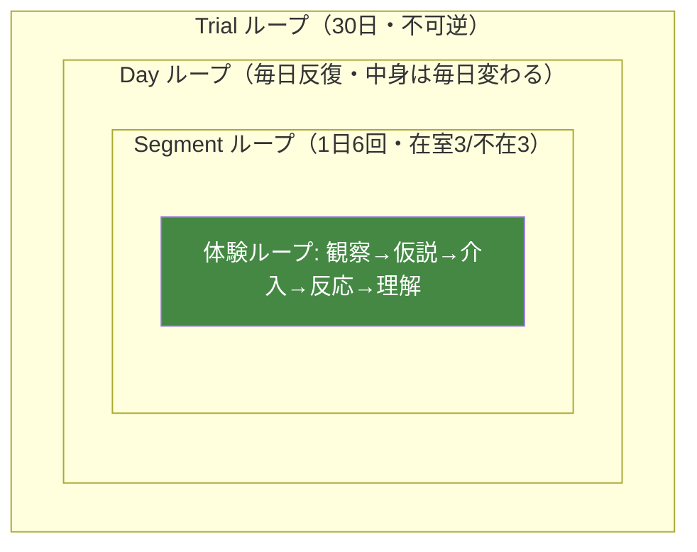
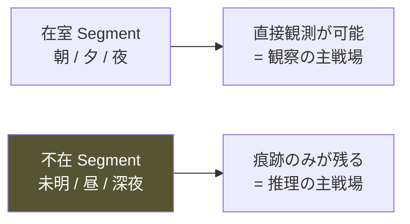
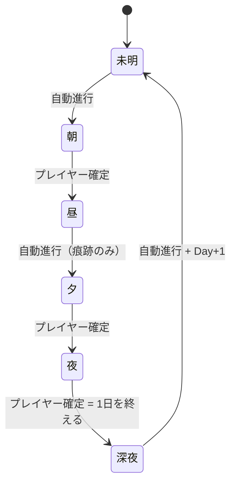

# 保護猫トライアル30日 — B2 Core Gameplay Loop Bible v1.0

**Document Type**: Bible（B2）／ Core Gameplay Loop の統合・正式化
**Status**: Proposed（⚠️ Segment=6 / 行動枠=2 の「暫定確定→確定」昇格は人間承認待ち・DevConst ④）
**Resolves**: Master GDD OI-1 / Architecture Y-01・Y-10 / Simulation Rules Z-01・Z-02 / X-1
**Last Updated**: 2026-07-24

> **本書は新規設計ではない。** Master GDD §15.1 が明記するとおり、コアループの構成要素は
> 既存 Bible に確定済みで分散している。本書はそれを**1冊に統合し、正式化**する。
> したがって各節は出典 Bible を明示し、原則として新しい値・法則を導入しない。
> 唯一の未確定「1日=6 Segment」「1 Segment=2 行動枠」は既に**暫定確定**であり、本書はこれを
> 確定へ昇格する（実測調整は付録 A で継続）。

---

## Source of Truth（統合元）

| 構成要素 | 出典 | 状態 |
|---|---|---|
| コア体験ループの定義 | B0 §3.3 | 確定（不変・L1） |
| 時間粒度（Frame/Tick/Segment/Day/Trial） | B4 §6.1 / B5 §1.1 | 確定 |
| 1日の Segment 構造（6分割） | B5 §1.2 | 暫定確定 → **本書で正式化** |
| 時間進行規則（T-1〜T-6） | B5 §1.3 | 確定 |
| 日数構造（30日・Day0・Day30） | B5 §1.4 / 憲章§14.3 | 確定 |
| 行動枠（在室 Segment ごと2枠） | B9 §3.3 | 確定（Z-02） |
| 行動別コスト表 | B9 §3.4 | 確定（X-1） |
| 観察と介入の非対称 | B5 §1.3 T-5 / B9 §3 | 確定 |
| 1日のプレイヤーフロー（Day Flow） | B3 ③ | 確定 |

---

## 目次

- [① ループ階層の全体像](#-ループ階層の全体像)
- [② コア体験ループ（正式化）](#-コア体験ループ正式化)
- [③ 時間構造の正式化](#-時間構造の正式化)
- [④ 行動枠と観察／介入の非対称](#-行動枠と観察介入の非対称)
- [⑤ 1日のフロー（Day Flow との対応）](#-1日のフローday-flow-との対応)
- [⑥ ループの不変条項と決定論](#-ループの不変条項と決定論)
- [付録 A 実測調整待ち](#付録-a-実測調整待ち)
- [付録 B 解消した Open Issue の対応](#付録-b-解消した-open-issue-の対応)

---

## ① ループ階層の全体像

本作のループは**3層の入れ子**である。時間の三重構造（B9 §3.1）と体験の反復（B3 ③）が対応する。



| 層 | 単位 | 駆動 | プレイヤーの関与 |
|---|---|---|---|
| **Trial** | 30日 | Day 30 到達 | 不可逆に進む。巻き戻せない（Pillar 4） |
| **Day** | 1日 | 明示的な確定操作 | フローは固定・中身は毎日変わる（B3 ③） |
| **Segment** | 1日6分割 | 在室=プレイヤー確定／不在=自動 | 在室で観察・介入、不在は痕跡のみ |
| **体験ループ** | Segment 内〜跨ぎ | プレイヤーの認知 | 本作の心臓（§②） |

**⚠️ この階層は不変である（憲章 L1）。** 新機能はループを**深く**するためにのみ追加してよい（B0 §3.3）。

---

## ② コア体験ループ（正式化）

出典: **B0 §3.3（一字一句不変）**。本書はこれを実装可能な粒度に接続するのみで、**改変しない**。

```
観察する
  ↓
「なぜ？」が生まれる
  ↓
仮説を立てる
  ↓
環境や行動を変えてみる（または、変えない）
  ↓
猫の反応を見る（期待通りとは限らない）
  ↓
仮説を更新する ＝ 理解が深まる
  ↓
観察する（前より深く見えるようになっている）
```

### 2.1 各段階の実装対応

| 段階 | プレイヤー操作 | 関与システム | コスト |
|---|---|---|---|
| 観察する | 見る・視線・位置・姿勢 | Perception（L3）→ Phenomenon | **0**（Pillar 1・無制限） |
| 「なぜ？」 | — | プレイヤーの内面（設計対象外の余白） | — |
| 仮説を立てる | 記録に書く | Record System（B7） | 0 |
| 介入する | 環境変更・距離・何もしない | Environment / Cat AI（L2） | 0〜2 行動枠（§④） |
| 反応を見る | 観察 | Simulation → Perception | 0 |
| 理解が深まる | — | Player Knowledge（B7・観測履歴から再生成） | — |

**⚠️ 「答え合わせ」ではない（B0 §3.4）。** 正解のフィードバックを返さない。行動の結果として猫の様子が変わるだけである。ループはクイズ化してはならない。

### 2.2 「答え」ではなく「手応え」

- ループの出力は **◯×ではなく、猫の様子の変化**である。
- 攻略情報を知っていても、この個体には当てはまらないことがある（Pillar 5 個体差）。
- ループの報酬は「理解が深まった感覚（O-1 差分の快感）」であり、スコアではない。

---

## ③ 時間構造の正式化

### 3.1 時間粒度（B4 §6.1 / B5 §1.1）

| 粒度 | 単位 | 駆動 | Simulation を動かすか |
|---|---|---|---|
| Frame | 描画1回 | 実時間 | ❌（AD-89） |
| Tick | 観察の滞留単位 | 実時間（観察中のみ） | ❌（Perception のみ） |
| **Segment** | 1日を6分割 | プレイヤー行動＋自動進行 | ✅ |
| **Day** | 1日 | 明示的な確定操作 | ✅ |
| Trial | 30日 | Day 30 到達 | — |

**Simulation は Segment / Day 粒度でのみ動く**（AA-38/39）。実時間で猫状態を変えない（AD-90）。

### 3.2 1日 = 6 Segment（★ Y-01/Z-01 を正式化）

**根拠**: 猫の薄明薄暮性（crepuscular）。最低2つの活動ピークと、その前後の低活動帯が要る（B5 §1.2）。

| ID | Segment | 時間帯 | 猫の基準活動水準 | 既定の在室 | 主な機能 |
|---|---|---|---|---|---|
| SG-1 | 未明 | 04:00–06:00 | 高（第1ピーク） | ❌ 就寝中 | 痕跡生成 |
| SG-2 | 朝 | 06:00–10:00 | 中 | ✅ 在室 | 観察・介入 |
| SG-3 | 昼 | 10:00–15:00 | 低（主睡眠） | ❌ 外出 | 痕跡生成 |
| SG-4 | 夕 | 15:00–19:00 | 高（第2ピーク） | ✅ 在室 | 観察・介入 |
| SG-5 | 夜 | 19:00–23:00 | 中 | ✅ 在室 | 観察・介入 |
| SG-6 | 深夜 | 23:00–04:00 | 中〜低 | ❌ 就寝中 | 痕跡生成 |

**在室3（朝・夕・夜）／不在3（未明・昼・深夜）の対称構造**が、痕跡の価値と推理の主戦場を生む（B5 §1.2）。



> ⚠️ **正式化の位置づけ**: 6 という値と在室/不在の割当は B5 §1.2 の暫定確定を確定へ昇格したもの。
> 活動ピークの時間帯配分は**監修必須**（B5 付録B-01）。在室 Segment はシナリオで変動しうる（OI-9・拡張余地）。

### 3.3 時間進行の規則（B5 §1.3・不変）



| 規則 | 内容 |
|---|---|
| **T-1** | 在室 Segment の終了は、プレイヤーの明示操作で行う |
| **T-2** | 不在 Segment は自動処理される（介入不可）。痕跡のみが残る |
| **T-3** | 時間は巻き戻らない（Pillar 4 / AA-42） |
| **T-4** | 在室 Segment 内で観察は無制限（Pillar 1） |
| **T-5** | 介入行動は Segment ごとに有限（§④） |
| **T-6** | 「何もしない」を選んでも Segment は進行する |

**⚠️ 実装対応**: Sprint 1 の `TimeState` は `advanceSegment()` のみで前進する。上記の
「在室=プレイヤー確定／不在=自動」の区別は Sprint 2 で `isInRoomSegment()` と結線する
（現状 `TimeState.ts` の在室判定 `[1,3,4]` は本表 SG-2/4/5＝index 1/3/4 と一致・要検証）。

### 3.4 日数構造（B5 §1.4・憲章§14.3）

| 項目 | 規則 |
|---|---|
| 総日数 | **30日固定**（変更不可） |
| Day 0 | 到着日。SG-4 夕 から開始 |
| Day 1–29 | 通常進行 |
| Day 30 | 決断の日。SG-5 夜 で終了 |
| 曜日 | 持たない（生活リズムを単純に保ち、「この子の普通」の確立を早める） |

30日は**カウントダウンではない**。「残り◯日」を焦燥として演出しない（B0 §3.5）。
30日目に訪れるのは勝敗ではなく**決断**である。

---

## ④ 行動枠と観察／介入の非対称

出典: **B9 §3.3（Z-02 確定）・§3.4（X-1 確定）**。

### 4.1 非対称の原理

```
観察 = コスト0    → いくらでも見られる（Pillar 1）
介入 = 有限資源    → 選ばなければならない
```

この非対称が **Pillar 1（観察が最大の攻略法）の資源設計上の実装**である。

### 4.2 行動枠（Action Slot / R-2）

| 項目 | 規則 |
|---|---|
| 付与 | **在室 Segment ごとに 2 枠** |
| 1日の総枠 | 在室3 Segment × 2 = **6 枠** |
| 繰り越し | **不可。未使用枠は Segment 終了で消滅**（B5 §1.3 T-5 補足） |
| 設計意図 | 「使わないと損」を生まない（Pillar 6）。有限だが、余らせても罰はない |

**⚠️ 2枠は初期値**（B9 §3.3）。平均使用枠 3.0〜4.5 を目安に実測調整する（付録 A）。

### 4.3 行動別コスト表（B9 §3.4・要約）

| コスト | 行動 | 分類 |
|---|---|---|
| **0** | 観察／記録を読む／自分の位置・姿勢・視線を変える／何もしない | 自由（無制限） |
| 1 | 資源補充（餌・水・砂）／食器の位置変更／部分掃除／小物の設置・撤去 | 軽 |
| 2 | 全体掃除／家具の移動・追加・撤去／トイレの位置変更 | 重 |

> **★ 設計の核心（B9 §3.4）**: 最も効く行動（自分の位置・姿勢・視線）が、最も安く（コスト0）、最も気づかれにくい。
> 終盤に「自分が変数だった（LL-6）」と気づく経済的実装である。**この非対称を崩してはならない。**

**禁止事項（B9 §3）**: 観察にコストを課さない／行動枠を繰り越し可能にしない。

---

## ⑤ 1日のフロー（Day Flow との対応）

出典: **B3 §3.1**。1日の**フローは固定・中身は毎日変わる**（認知負荷を下げ、飽きを防ぐ分離）。

| # | 段階 | 対応する時間/資源 | プレイヤーの問い |
|---|---|---|---|
| 1 | 起床 | Day 開始・構図固定 | （受動） |
| 2 | 猫の様子確認 | SG 開始時の観測 | 「猫はどこにいるか／いないか」 |
| 3 | 観察 ← 主要時間 | 在室 Segment・コスト0 | 「今日は何が違うか」 |
| 4 | 考察 | 記録（コスト0） | 「なぜ」 |
| 5 | 行動（またはしない） | 行動枠 0〜2 | 「何を変えるか／変えないか」 |
| 6 | 結果 | 即時（小）／翌日持ち越し（大） | 「どう反応したか」 |
| 7 | 振り返り | Record（追記のみ） | （自分の言葉で残す） |
| 8 | 翌日へ（不可逆） | Day+1 | 「未解決の問いを持ったまま」 |

**プレイヤー心理の転換（B3 ③）**: 「今日は何をしようか」ではなく「**今日は何が違うか**」で1日を始める。
これがプレイヤーの成熟であり、コア体験ループが作業化しないための設計原理である。

**⚠️ 構図固定の重要性**: 毎朝同じ構図 → 違いだけが目に入る → O-1（差分）の快感が発生する（B3 ③[1]）。

---

## ⑥ ループの不変条項と決定論

### 6.1 不変条項（憲章 L1 / B0 §3.3）

```
■ コア体験ループ（観察→仮説→介入→反応→理解）は全編を通じて不変
■ 新機能はループを「深く」するためにのみ追加する。「置き換える」追加は却下
■ 観察は無制限・コスト0、介入は有限（この非対称を崩さない）
■ 時間は巻き戻らない。1日は不可逆
■ 30日目は勝敗ではなく決断
```

変更提案は憲章§L1 の判定（「その変更は L1=コアループを変えるか？」）を通すこと。

### 6.2 決定論との関係（B5 SR-3 / B4 G-3）

- **同一シード・同一入力なら、同一の1日が再現される。**
- 天候は `RNG.stream("weather").at(day)` で決定し、プレイヤー行動に依存しない（B5 §1.5）。
- Segment 進行・猫の行動・痕跡生成は決定論的ストリームで駆動する（B5 §8.4）。
- これによりコアループの「反応」は再現可能で、観察が学習に繋がる（Pillar 1 の技術的前提）。

---

## 付録 A 実測調整待ち（プレイテスト）

| 項目 | 判定基準 | 出典 |
|---|---|---|
| 1 Segment あたり 2 行動枠 | 平均使用枠 3.0〜4.5 | B9 §3.3 付録A |
| Segment 数 6 の妥当性 | 1日1〜2分の体験に収まり、差分が読めるか | B5 §1.2 |
| 活動ピークの時間帯配分 | 監修（獣医/行動学） | B5 付録B-01 |
| 在室 Segment の可変性 | シナリオ次第（OI-9） | B5 §1.2 |

---

## 付録 B 解消した Open Issue の対応

| ID | 内容 | 本書での扱い |
|---|---|---|
| **OI-1** | Core Gameplay Loop Bible 未作成 | **本書が解消（統合・正式化）** |
| Y-01 / Z-01 | Segment 数6の妥当性 | §3.2 で正式化（実測調整は付録A） |
| Z-02 / Y-02 | 1 Segment あたりの介入可能回数 | §4.2 で正式化（2枠） |
| X-1 | 行動別コスト表 | §4.3 で参照・要約 |
| Y-10 | Architecture §6 との整合 | §3.1 で一致を確認 |

**⚠️ 残る人間承認事項（DevConst ④）**: 「6 Segment」「2 行動枠」を**暫定確定→確定**へ昇格すること。
本書は既存の暫定値を統合しただけで、新しい設計判断は導入していない。最終承認をもって Status を Accepted とする。

---

## 改訂履歴

| バージョン | 日付 | 変更 |
|---|---|---|
| 1.0 | 2026-07-24 | 初版。B0§3.3 / B3③ / B5§1 / B9§3 を統合し OI-1 を解消（Proposed） |
