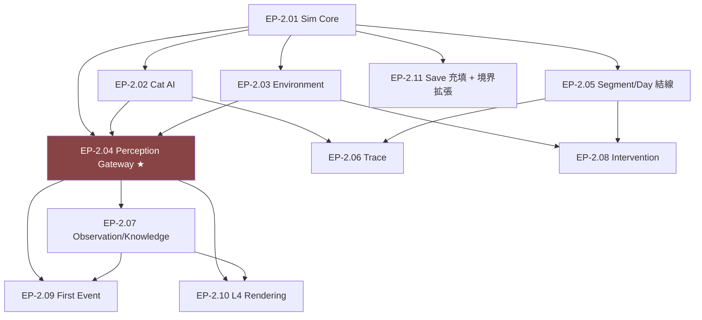

# 保護猫トライアル30日 — Sprint 2: MVP Vertical Slice Epics v0.1（叩き台）

**Document Type**: Sprint 2 Epic 設計（叩き台・Issue/コードは含まない）
**Status**: Proposed（⚠️ スコープ確定・監修・数値バランスは人間判断待ち）
**Sprint Goal**: **コア体験ループが5層を貫通して一度でも回る**——「1匹の猫を観察し、仮説を立て、環境を1つ変え、翌 Segment に反応が返る」最小の遊びを成立させる
**Source of Truth**: B2（コアループ）/ B4（5層）/ B5（世界法則）/ B6（Cat AI）/ B7（学習）/ B8（イベント）/ B10（環境）/ B11（データ）
**Last Updated**: 2026-07-24

> **叩き台である。** Sprint 1 の Epic 設計（[12](./12-SPRINT1-FOUNDATION-EPICS.md)）と同じ粒度で、
> 既存 Bible を実装 Epic に分解した提案。**スコープの取捨・数値・監修事項は人間が確定する**（DevConst ④）。

---

## ⚠️ 前提と原則

```
■ Sprint 1 の全 DoD が満たされていること（基盤・境界強制・保存・データ Registry 骨格）
■ Sprint 2 は「薄く貫く」。深さ（全学習ライン・全イベント・経済）は Sprint 3 以降
■ 憲章 I-1（観測境界）を初めて実データで貫く回。Perception Gateway が唯一の越境点
■ 猫の事実（Needs/Behavior 等）を扱う初回 → 監修工程がここから必須（B5/B6 付録C）
```

### Sprint 2 で「やらないこと」（Out of Scope）

- 全 6 学習ライン（LL-1〜6）— MVP は 1 本のみ
- 全イベント・全現象語彙 — 最小 Cue セットのみ
- 経済・予算・進行バランスの作り込み（B9 全体）— 行動枠の消費のみ
- 悪循環・Affect の深い動態（B5/B6 の高度部）— 最小 Needs モデルのみ
- タイトル/エンディング/振り返り画面の作り込み — 起動は EP-14 の骨格を流用

---

## Epic 一覧（叩き台）

| ID | Epic | 層 | 主管 | 依存 | 主 Bible |
|---|---|---|---|---|---|
| **EP-2.01** | Simulation Core（Cat State + 更新順序） | L2 | AI | Sprint1 State | B5 §6 / B4 §8.5 |
| **EP-2.02** | Cat AI（Utility 意思決定・最小） | L2 | AI+監修 | 2.01 | B6 |
| **EP-2.03** | Environment & Room（部屋・家具・アイテム） | L2 | AI | 2.01 | B10 |
| **EP-2.04** | Perception Gateway & Phenomenon ★ | L3 | AI+人間 | 2.01–2.03 | B4 P-01/P-02 / B11 §6 |
| **EP-2.05** | Segment/Day ループ結線（在室確定/不在自動/痕跡） | L1/L2 | AI | Sprint1 Time | B2 §3 / B5 §1 |
| **EP-2.06** | Trace System（痕跡・不在 Segment の産物） | L2 | AI | 2.02, 2.05 | B5 / B7 |
| **EP-2.07** | Observation & Record / Player Knowledge | L3 | AI | 2.04 | B7 |
| **EP-2.08** | Intervention & Action Slots（介入・行動枠） | L2 | AI | 2.03, 2.05 | B2 §4 / B9 §3 |
| **EP-2.09** | First Cue & Minimal Event（学習ライン1本） | L2/L3 | AI+監修 | 2.04, 2.07 | B8 |
| **EP-2.10** | L4 Rendering（部屋・猫・観察UI・Canvas） | L4 | AI+人間 | 2.04, 2.07 | B4 L4 / OI-4 |
| **EP-2.11** | Save スキーマ充填 + 境界テスト拡張 | L1 | AI | 全 | B11 / EP-10 |

**⚠️ 概算 11 Epic。Sprint 1 同様 2a/2b への分割を想定。**

---

## Epic 詳細（要点のみ・叩き台）

### EP-2.01 Simulation Core（L2）
- **Purpose**: `CatState` を Sprint1 の最小形（`arrived`）から、Needs / Affect / Relationship / Behavior の**最小実体**へ拡張。B5 §6 の更新順序（Needs→Environment→Relationship→Affect→AI）を骨格実装。
- **Success**: Cat State が L2 限定を維持（憲章 I-1）／更新順序が B5 §6 と一致／決定論的。
- **⚠️ 人間/監修**: Needs の種類と初期値（B5 付録C・監修）。

### EP-2.02 Cat AI（L2）
- **Purpose**: B6 の Utility ベース意思決定を**最小**実装（休む/移動する/隠れる 等 数種）。性格は不変（Pillar 5）。
- **Success**: 同一シードで同一行動列／「操作できない他者」であること（憲章 I-2）。
- **⚠️ 監修必須**: 行動候補と Utility 係数（B6 付録C）。

### EP-2.03 Environment & Room（L2）
- **Purpose**: B10 の Room / Furniture / Item を最小実装（1部屋・数点の家具）。定義は B11 の ID/JSON 規則・EP-09 Registry に載せる。
- **Success**: 家具寄与が属性加算で計算／定義は不変・検証付き。

### EP-2.04 Perception Gateway & Phenomenon ★（L3）
- **Purpose**: **本作最重要の越境点**。L2 の真実→ Phenomenon（数値を持たない現象）へ変換する唯一の関門を実装。
- **Success**: Gateway 以外から L2→L3 出力できない／Phenomenon 型に数値フィールドを入れると**境界テストで落ちる**（EP-10 拡張）／表示は解像度×ローカライズキー（B11 §6）。
- **⚠️ 人間**: 現象語彙の最小セット（B11 付録A・EV-02）。

### EP-2.05 Segment/Day ループ結線（L1/L2）
- **Purpose**: B2 §3 を実装に結線。在室 Segment=プレイヤー確定／不在=自動処理／痕跡生成。`TimeState.isInRoomSegment` を SG 構造に正式対応。
- **Success**: 在室3/不在3 が正しく進行／不在はまとめて自動処理され痕跡のみ残る／巻き戻し不可。

### EP-2.06 Trace System（L2）
- **Purpose**: 不在 Segment の産物（痕跡）を生成・保持。推理の主戦場（B2 §3.2）。
- **Success**: 痕跡が決定論的に生成／観測はできるが真実数値は露出しない。

### EP-2.07 Observation & Record / Player Knowledge（L3）
- **Purpose**: 観察（コスト0・無制限）と記録（追記のみ）。Player Knowledge は**観測履歴から再生成**（保存しない・G-2）。
- **Success**: Player Knowledge が Simulation を import しない（G-2・境界テスト）／観測履歴のみ保存。

### EP-2.08 Intervention & Action Slots（L2）
- **Purpose**: B2 §4 の行動枠（在室 Segment ごと2枠）と介入（Command 経由）。コスト表（B9 §3.4）の最小サブセット。
- **Success**: 観察=0/介入=有限の非対称／未使用枠は消滅／Command 経由で Cat State を直接書き換えない。

### EP-2.09 First Cue & Minimal Event（L2/L3）
- **Purpose**: B8 のイベント/Cue を**1学習ライン分**実装。direct + indirect Cue、`guaranteedInSpiral` を含む最小構成。
- **Success**: B8 §11.4 のスキーマ検証を通過／`StateChange.target` に `cat.*` 不可（I-1）。
- **⚠️ 監修/Content**: イベント本文・Cue 内容。

### EP-2.10 L4 Rendering（L4）
- **Purpose**: 部屋・猫・観察 UI を Canvas で描画。**L2 を import せず Phenomenon のみ受ける**。静かなトーン（Pillar 6）。
- **Success**: L4→L2 参照ゼロ（境界テスト）／構図固定（B3 ③・差分が読める）。
- **⚠️ 人間**: UI/UX 設計（OI-4・未着手）。

### EP-2.11 Save スキーマ充填 + 境界テスト拡張（L1）
- **Purpose**: `GameSnapshot` を実 Cat State/Environment/Trace/観測履歴で充填（B11・B4 §9.3）。EP-10 境界テストに Sprint2 の検査（Gateway 限定・Phenomenon 数値禁止・G-2）を追加。
- **Success**: セーブ往復が実データで一致／新境界6種が検出される。

---

## 依存関係（叩き台）



**クリティカルパス**: `EP-2.01 → EP-2.04（Gateway）→ EP-2.07 → EP-2.10`。
Gateway（EP-2.04）が品質的ハイライト（憲章 I-1 を実データで初めて貫く）。

---

## リスク（叩き台）

| リスク | 対策 |
|---|---|
| MVP スコープ膨張 | 「1匹・1部屋・1学習ライン・最小 Needs」を死守。深さは Sprint 3 |
| 監修未着手のまま猫の事実を実装 | EP-2.01/2.02/2.09 前に監修着手（B5/B6 付録C） |
| Gateway が緩いと I-1 が崩れる | EP-2.04 完了条件に境界テスト拡張を含める（落ちるまで未完） |
| UI/UX 未設計（OI-4） | EP-2.10 前に最小 UI 方針を人間が決める |
| Phenomenon 語彙・イベント本文（Content 未確定） | 最小セットのみ人間が先行確定 |

---

## Sprint 2 完了条件（Definition of Done・叩き台）

```
□ 1匹の猫が1部屋で、決定論的に行動する（EP-2.01/2.02）
□ プレイヤーが観察（無制限）し、記録できる（EP-2.07）
□ プレイヤーが環境を1つ変え（行動枠消費）、翌 Segment に反応が返る（EP-2.08）
□ 真実は Perception Gateway を通した Phenomenon としてのみ L4 に届く（EP-2.04・I-1）
□ 在室/不在 Segment が進行し、不在は痕跡を残す（EP-2.05/2.06）
□ 1学習ラインが成立し、スキーマ検証を通る（EP-2.09）
□ 状態が実データで保存・復元され、新境界6種が CI で検出される（EP-2.11）
```

**⚠️ Sprint 2 完了 = コア体験ループが「一度、5層を貫いて回る」こと。** 面白さの作り込みは Sprint 3 以降。

---

## 人間へのエスカレーション（Sprint 2 着手前）

| 事項 | 種別 | 参照 |
|---|---|---|
| ~~B2 の Segment=6 / 行動枠=2 の確定昇格~~ ✅ **2026-07-24 承認済み** | 承認 | B2 付録B |
| 監修着手（Needs / Cat AI 行動 / イベント本文） | 監修 | B5/B6/B8 付録C |
| UI/UX 最小方針（OI-4） | 設計 | Master GDD §15.2 |
| 現象語彙の最小セット（EV-02） | Content | B11 付録A |

---

## 改訂履歴

| バージョン | 日付 | 変更 |
|---|---|---|
| 0.1 | 2026-07-24 | 叩き台初版。MVP 垂直スライスを 11 Epic に分解（Proposed） |
